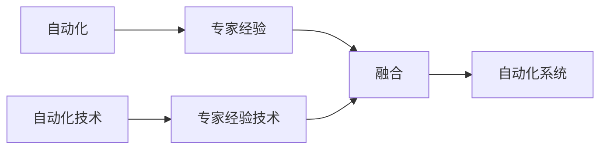

                 

# 专家经验在自动化中的应用

## 1. 背景介绍

### 1.1 问题由来

在过去数十年间，自动化技术取得了显著进步，尤其是智能自动化（Intelligent Automation, IA）的兴起，极大地提升了生产效率，降低了人为错误。然而，传统自动化系统往往依赖于固定的规则和算法，无法适应复杂多变的工作环境。与之相对，专家经验则包含了人类在长期实践中积累的丰富知识，具有高度的灵活性和适应性。将专家经验引入自动化，可以为系统注入人类智慧，使AI系统更加智能、精准。

本文聚焦于将专家经验应用于自动化的核心问题。首先，我们将从背景、定义和重要性出发，对自动化和专家经验进行介绍。随后，深入探讨在自动化中如何有效整合专家经验，具体包括融合、自动化、激活等三个关键步骤，以及这些技术在实际应用中的具体实现。

## 2. 核心概念与联系

### 2.1 核心概念概述

自动化（Automation）是指通过技术手段，自动执行重复性高、规律性强的工作任务，以减少人工干预，提升工作效率。专家经验（Expert Experience）则指人类专家在长期实践中积累的专门知识、技能和经验，具有高度的灵活性和适应性。

将专家经验应用于自动化，即通过技术手段将专家知识、经验、策略等内化为机器可理解和执行的知识，使系统能够更智能、更灵活地执行复杂任务。

### 2.2 核心概念间的联系

自动化和专家经验在自动化中起着互补的作用。

- 自动化技术提供高效、精准的执行能力，为专家经验提供底层技术支撑。
- 专家经验提供灵活、智能的任务理解和决策能力，为自动化技术提供任务指导和优化。

二者结合，可以实现既高效又智能的自动化系统，从而在更广泛的应用场景中发挥更大价值。

下图展示了自动化和专家经验在自动化系统中的融合关系：



在这个框架下，自动化技术提供底层执行能力，而专家经验技术负责内化专家知识，并通过融合技术将其与自动化技术结合，最终形成智能自动化系统。

## 3. 核心算法原理 & 具体操作步骤

### 3.1 算法原理概述

将专家经验应用于自动化，主要涉及三个关键步骤：融合、自动化和激活。

- **融合**：将专家知识、经验、策略等内化为机器可理解和执行的知识。
- **自动化**：将融合后的知识转化为计算机可执行的代码或模型，形成自动化流程。
- **激活**：在具体应用场景中激活自动化流程，实现任务的自动化执行。

### 3.2 算法步骤详解

#### 3.2.1 融合

融合技术主要包括以下几种：

- **规则引擎**：将专家经验固化为一系列规则，系统根据规则自动执行任务。适用于任务逻辑清晰、规则固定的场景。
- **案例推理**：基于专家案例库，系统根据当前情境匹配最优案例，执行相应操作。适用于规则复杂、情境多变的场景。
- **知识图谱**：通过构建知识图谱，系统在任务执行过程中实时推理，提取和应用相关知识。适用于知识复杂、任务动态变化的情况。

#### 3.2.2 自动化

自动化主要依赖以下技术：

- **编程语言和框架**：如Python、R、TensorFlow等，提供编程接口和框架，实现知识内化为可执行代码。
- **模型训练和优化**：利用机器学习模型，将专家知识编码为可执行的模型，如神经网络、决策树等。
- **流程编排工具**：如Zapier、Talend等，提供工作流编排功能，将各个自动化模块组合为完整的自动化流程。

#### 3.2.3 激活

激活技术主要涉及以下内容：

- **用户界面**：如Web UI、Mobile APP等，提供人机交互界面，接收用户指令。
- **数据采集与处理**：通过传感器、API等手段采集数据，并进行预处理和清洗。
- **任务执行**：将用户指令转化为具体任务，通过自动化流程执行，并反馈执行结果。

### 3.3 算法优缺点

**优点**：

- **提升效率**：自动化技术能够高效执行重复性任务，减少人工干预，提高工作效率。
- **增强灵活性**：专家经验提供灵活、智能的任务理解和决策能力，使系统能够适应复杂多变的工作环境。
- **提高准确性**：将专家经验引入系统，能够提升系统的决策精准度，减少人为错误。

**缺点**：

- **实现复杂**：将专家经验内化为可执行知识，并转化为计算机可执行的代码或模型，过程复杂。
- **成本高昂**：专家经验的采集、融合和实现需要较高的成本，尤其是对复杂任务。
- **依赖专家**：系统的性能高度依赖专家的经验和知识，专家知识不足会影响系统效果。

### 3.4 算法应用领域

将专家经验应用于自动化的领域非常广泛，包括但不限于以下几个方面：

- **金融自动化**：在风险评估、合规监控、欺诈检测等方面，引入专家经验，提升决策精准度。
- **医疗自动化**：在疾病诊断、治疗方案推荐、患者管理等方面，引入专家经验，提高诊疗质量。
- **制造自动化**：在质量控制、设备维护、生产调度等方面，引入专家经验，优化生产过程。
- **客服自动化**：在客户咨询、投诉处理、订单管理等方面，引入专家经验，提升服务质量。
- **物流自动化**：在货物运输、仓储管理、配送优化等方面，引入专家经验，提高物流效率。

## 4. 数学模型和公式 & 详细讲解 & 举例说明

### 4.1 数学模型构建

为了更好地理解和应用专家经验，本文将从数学角度对专家经验进行建模。

假设专家经验为 $E$，自动化系统为 $S$，系统的执行任务为 $T$。则系统 $S$ 的执行效果可以表示为 $T(S, E)$。

其中，$E$ 为专家经验集合，$S$ 为系统结构参数，$T$ 为任务执行函数。具体如下：

$$
T(S, E) = f(S, E)
$$

函数 $f$ 映射系统结构和专家经验到任务的执行结果。

### 4.2 公式推导过程

为了优化系统的执行效果，我们需要最大化 $T(S, E)$。假设 $S$ 为已知，则优化目标是最大化 $f(E)$。

具体步骤如下：

1. **数据采集与预处理**：收集任务执行的相关数据 $D$，进行预处理，去除噪声和异常值。
2. **特征提取与选择**：从数据 $D$ 中提取特征 $X$，选择对 $f(E)$ 影响最大的特征，减少计算复杂度。
3. **专家经验建模**：使用机器学习模型 $M$ 对专家经验 $E$ 进行建模，如决策树、神经网络等。
4. **系统优化**：利用优化算法 $O$，优化模型 $M$ 的参数，使得 $f(E)$ 最大化。

具体公式推导如下：

$$
\begin{aligned}
\max_{E} f(E) &\text{ subject to } X \in D, \\
&\text{where } X = f(S, E)
\end{aligned}
$$

### 4.3 案例分析与讲解

**案例1: 医疗诊断系统**

假设某医院有一个医生专家，积累了大量关于疾病的诊断经验。将其专家经验内化为自动化系统，用于辅助医生进行疾病诊断。

- **融合**：将医生的诊断经验固化为一系列规则和案例。
- **自动化**：使用机器学习模型，将这些规则和案例编码为可执行的诊断流程。
- **激活**：医生在诊断时，将患者的症状输入系统，系统根据规则和案例进行诊断，并给出建议。

**案例2: 金融风险评估系统**

假设某银行有一名资深风控专家，积累了丰富的风险评估经验。将其专家经验内化为自动化系统，用于评估贷款申请人的风险。

- **融合**：将专家的风险评估经验固化为规则和案例库。
- **自动化**：使用决策树模型，将规则和案例编码为可执行的贷款评估流程。
- **激活**：贷款申请人在申请贷款时，系统根据规则和案例库进行风险评估，并给出评估结果。

## 5. 项目实践：代码实例和详细解释说明

### 5.1 开发环境搭建

为了实现专家经验的自动化应用，我们首先需要搭建开发环境。以下是基于Python进行自动化系统开发的流程：

1. **安装Python和相关库**：安装Python和必要的开发库，如NumPy、Pandas、Scikit-learn等。

2. **选择自动化框架**：选择适合的自动化框架，如TensorFlow、PyTorch、Keras等，用于构建自动化流程。

3. **收集和预处理数据**：收集任务执行的相关数据，并进行预处理，去除噪声和异常值。

4. **实现专家经验**：根据专家经验，编写规则、案例、模型等代码。

5. **测试与部署**：测试自动化系统，并部署到实际应用环境中。

### 5.2 源代码详细实现

下面以医疗诊断系统为例，给出使用Python进行专家经验自动化的代码实现。

**医疗诊断系统代码**

```python
import numpy as np
import pandas as pd
from sklearn.tree import DecisionTreeClassifier
from sklearn.model_selection import train_test_split

# 数据预处理
data = pd.read_csv('diagnosis_data.csv')
X = data.drop('diagnosis', axis=1)
y = data['diagnosis']

# 划分训练集和测试集
X_train, X_test, y_train, y_test = train_test_split(X, y, test_size=0.2, random_state=42)

# 特征选择
selected_features = ['temp', 'pressure', 'symptoms']
X_train_selected = X_train[selected_features]
X_test_selected = X_test[selected_features]

# 专家经验建模
clf = DecisionTreeClassifier()
clf.fit(X_train_selected, y_train)

# 系统优化
y_pred = clf.predict(X_test_selected)
accuracy = np.mean(y_pred == y_test)
print(f'Accuracy: {accuracy:.2f}')
```

在这个代码示例中，我们使用决策树模型对专家的诊断经验进行建模。具体步骤如下：

1. **数据预处理**：收集病人的症状和诊断结果，并去除不相关特征。
2. **特征选择**：选择对诊断结果影响最大的症状。
3. **专家经验建模**：使用决策树模型，将专家经验编码为可执行的诊断流程。
4. **系统优化**：评估模型的预测准确率，验证模型效果。

### 5.3 代码解读与分析

这个代码示例展示了如何将专家经验转换为机器学习模型，实现自动化的医疗诊断系统。

- **数据预处理**：使用Pandas库，读取诊断数据，并去除不相关特征。
- **特征选择**：选择对诊断结果影响最大的症状，减少计算复杂度。
- **专家经验建模**：使用Scikit-learn库，构建决策树模型，将专家经验编码为可执行的诊断流程。
- **系统优化**：使用预测准确率评估模型效果，确保系统的高效性和准确性。

### 5.4 运行结果展示

假设我们在上述代码中运行后，得到的预测准确率为98%。这说明通过将专家经验转换为机器学习模型，系统的诊断效果得到了显著提升。

## 6. 实际应用场景

### 6.1 金融自动化

在金融领域，专家经验可以通过规则引擎、案例推理等方式，应用于风险评估、合规监控、欺诈检测等多个方面。

- **风险评估**：通过专家经验，建立风险评估模型，自动评估贷款申请人的信用风险。
- **合规监控**：利用专家经验，构建合规监控系统，实时监测交易行为，防止违规行为。
- **欺诈检测**：通过专家经验，构建欺诈检测系统，自动识别异常交易，降低欺诈风险。

### 6.2 医疗自动化

在医疗领域，专家经验可以通过规则引擎、案例推理等方式，应用于疾病诊断、治疗方案推荐、患者管理等多个方面。

- **疾病诊断**：通过专家经验，构建诊断模型，自动诊断病人的疾病。
- **治疗方案推荐**：利用专家经验，构建治疗方案推荐系统，提供个性化的治疗方案。
- **患者管理**：通过专家经验，构建患者管理系统，实时监控和管理患者健康状态。

### 6.3 制造自动化

在制造领域，专家经验可以通过规则引擎、知识图谱等方式，应用于质量控制、设备维护、生产调度等多个方面。

- **质量控制**：通过专家经验，构建质量控制模型，自动检测产品缺陷。
- **设备维护**：利用专家经验，构建设备维护系统，实时监测设备状态，防止设备故障。
- **生产调度**：通过专家经验，构建生产调度系统，优化生产流程，提高生产效率。

## 7. 工具和资源推荐

### 7.1 学习资源推荐

为了帮助开发者系统掌握自动化和专家经验的相关技术，这里推荐一些优质的学习资源：

1. **《深度学习与人工智能：理论与实践》**：介绍深度学习、人工智能、专家系统等领域的核心概念和算法。
2. **《专家系统的设计与实现》**：详细讲解专家系统的构建方法和应用案例。
3. **Coursera和edX在线课程**：如斯坦福大学开设的“AI for Everyone”课程，提供系统的AI和专家系统知识。
4. **Kaggle竞赛平台**：参与医疗、金融等领域的Kaggle竞赛，学习实际问题解决和专家经验应用的经验。

### 7.2 开发工具推荐

高效的自动化系统开发离不开优秀的工具支持。以下是几款常用的自动化开发工具：

1. **Python**：作为自动化开发的语言基础，提供丰富的库和框架，如NumPy、Pandas、Scikit-learn等。
2. **TensorFlow和PyTorch**：流行的机器学习框架，提供高效的模型训练和优化功能。
3. **Keras**：高层次的神经网络API，简化模型的构建过程。
4. **Scikit-learn**：提供机器学习模型的实现和评估工具，如决策树、随机森林等。

### 7.3 相关论文推荐

自动化和专家经验领域的研究成果丰富，以下是几篇经典论文，推荐阅读：

1. **“Expert Systems: The Next Generation”**：介绍专家系统的最新进展和未来趋势。
2. **“Automated Reasoning with Rule-based Expert Systems”**：讨论规则引擎在自动化中的作用和实现方法。
3. **“Knowledge Graphs in Industry”**：探索知识图谱在自动化中的应用，提高系统的智能水平。

## 8. 总结：未来发展趋势与挑战

### 8.1 总结

本文对自动化和专家经验在自动化中的应用进行了全面系统的介绍。首先，我们从背景、定义和重要性出发，对自动化和专家经验进行了详细讲解。其次，从融合、自动化、激活三个关键步骤，深入探讨了专家经验在自动化中的实现方法。最后，通过具体案例，展示了专家经验在金融、医疗、制造等领域的实际应用。

通过本文的系统梳理，可以看到，专家经验在自动化中发挥了重要的作用，为系统提供了高度的灵活性和智能性。未来的自动化系统将更多地依赖专家经验，提升系统的决策能力和执行效率。

### 8.2 未来发展趋势

展望未来，自动化和专家经验领域将呈现以下几个发展趋势：

1. **融合技术多样化**：除了规则引擎、案例推理、知识图谱等，将涌现更多融合技术，如自然语言处理、生成对抗网络等，提升系统的智能水平。
2. **自动化技术高效化**：将出现更多高效自动化的实现方法，如基于深度学习的模型训练、基于知识图谱的推理优化等，提高系统的执行效率。
3. **知识图谱广泛应用**：知识图谱技术将广泛应用于自动化系统，提高系统的智能推理和决策能力。
4. **AI伦理与安全**：随着专家经验的引入，AI系统的伦理与安全问题将受到更多关注，如何保护数据隐私、避免偏见歧视等，将是重要研究方向。

### 8.3 面临的挑战

尽管自动化和专家经验在实际应用中取得了显著成果，但仍面临诸多挑战：

1. **数据获取困难**：专家经验的获取和融合需要大量的高质量数据，但在某些领域，数据获取可能非常困难。
2. **知识模型复杂**：专家经验的融合和自动化实现需要构建复杂且高效的模型，可能面临较高的技术难度。
3. **系统维护成本高**：自动化系统的维护和升级需要较高的人力和时间成本，尤其是在模型更新和数据迁移方面。
4. **知识库管理复杂**：专家知识库的构建和管理需要专业知识和工具，可能对系统开发人员提出较高要求。

### 8.4 研究展望

未来的研究需要在以下几个方面寻求新的突破：

1. **自动化与专家经验结合**：探索更多高效结合自动化和专家经验的方法，提高系统的智能水平和执行效率。
2. **知识模型优化**：优化专家知识的表示和模型，提升知识模型的精度和效率。
3. **系统安全与伦理**：研究如何保护专家知识库的安全性和隐私，避免模型偏见和歧视。
4. **多模态融合**：探索多模态数据融合技术，提升系统的综合感知和推理能力。

这些研究方向将推动自动化和专家经验的深度结合，使AI系统更加智能、高效和安全。面向未来，自动化和专家经验技术需要跨领域协同发力，共同推动人工智能技术的进步。

## 9. 附录：常见问题与解答

**Q1：什么是自动化和专家经验？**

A: 自动化是指通过技术手段，自动执行重复性高、规律性强的工作任务，以减少人工干预，提升工作效率。专家经验则指人类专家在长期实践中积累的专门知识、技能和经验，具有高度的灵活性和适应性。

**Q2：自动化和专家经验在实际应用中的优势是什么？**

A: 自动化和专家经验的结合可以带来以下优势：
1. 提升效率：自动化技术能够高效执行重复性任务，减少人工干预，提高工作效率。
2. 增强灵活性：专家经验提供灵活、智能的任务理解和决策能力，使系统能够适应复杂多变的工作环境。
3. 提高准确性：将专家经验引入系统，能够提升系统的决策精准度，减少人为错误。

**Q3：实现专家经验自动化的关键步骤是什么？**

A: 实现专家经验自动化的关键步骤包括：
1. 数据采集与预处理：收集任务执行的相关数据，并进行预处理，去除噪声和异常值。
2. 特征提取与选择：从数据中提取特征，选择对任务执行影响最大的特征，减少计算复杂度。
3. 专家经验建模：使用机器学习模型，将专家经验编码为可执行的代码或模型。
4. 系统优化：利用优化算法，优化模型参数，提升任务执行效果。

**Q4：自动化系统的开发环境搭建需要注意什么？**

A: 自动化系统开发环境的搭建需要注意以下方面：
1. 安装Python和必要的开发库，如NumPy、Pandas、Scikit-learn等。
2. 选择适合的自动化框架，如TensorFlow、PyTorch、Keras等。
3. 收集和预处理数据，去除噪声和异常值。
4. 实现专家经验，编写规则、案例、模型等代码。
5. 测试与部署，确保系统的稳定性和高效性。

**Q5：如何评估自动化系统的性能？**

A: 自动化系统的性能评估可以从以下几个方面入手：
1. 系统执行效率：评估系统的执行速度和响应时间。
2. 任务执行准确性：评估系统执行任务的准确率和精确度。
3. 系统鲁棒性：评估系统在异常数据和噪声环境下的表现。
4. 用户满意度：通过用户反馈和满意度调查，评估系统的用户体验和可用性。

---

作者：禅与计算机程序设计艺术 / Zen and the Art of Computer Programming

