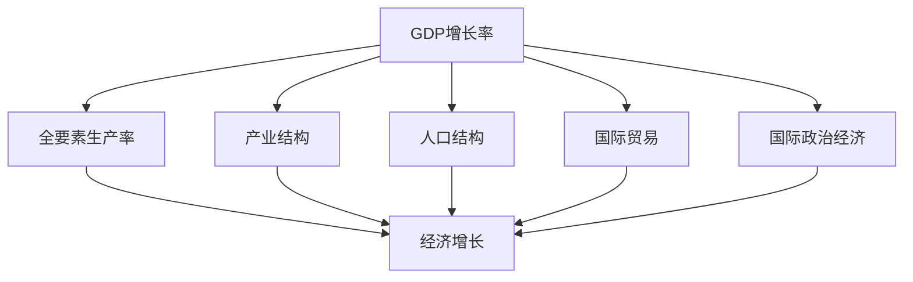
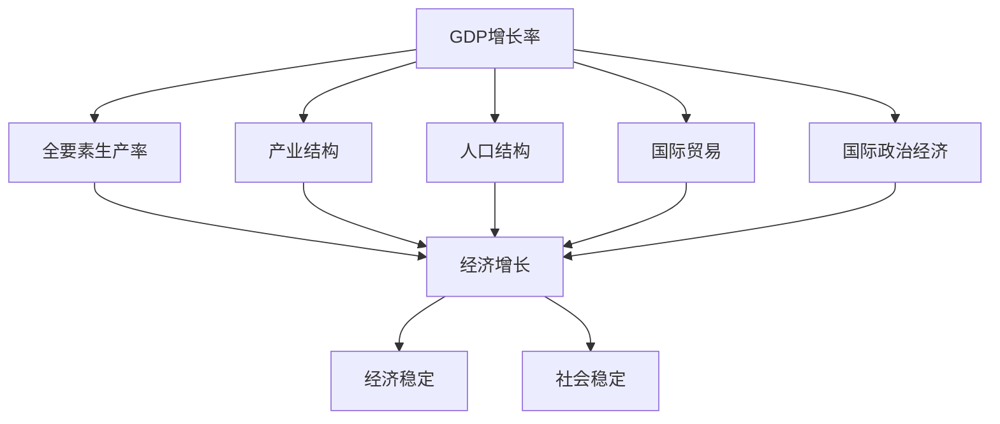

                 

# 世界经济增长的长期趋势

> 关键词：经济增长趋势,技术进步,产业变革,人口结构,国际政治经济

## 1. 背景介绍

### 1.1 问题由来
当今世界正处在一个多变与不确定性的历史时期。全球疫情的爆发，地缘政治的动荡，经济增长的不平衡等问题，使得全球经济面临前所未有的挑战。作为人类社会的基石，经济的持续稳定增长一直是各国政策制定者、学者和企业关注的重点。因此，研究世界经济增长的长期趋势，探讨其背后的驱动因素和潜在的风险，具有重要的现实意义。

### 1.2 问题核心关键点
对世界经济增长的长期趋势进行研究，需要从多个维度综合考虑，包括技术进步、产业变革、人口结构、国际贸易和国际政治经济等方面。通过对这些关键因素的深入分析，可以更全面地理解世界经济的增长动力和未来走向。

### 1.3 问题研究意义
研究世界经济增长的长期趋势，有助于：
- **政策制定**：为政府制定经济政策提供科学依据，指导未来经济发展方向。
- **企业决策**：帮助企业把握市场动态，制定有效的发展战略。
- **学术研究**：为经济学研究提供实证数据，推动理论创新。
- **公众认知**：提高公众对经济增长及其影响的认识，增强社会稳定性。

## 2. 核心概念与联系

### 2.1 核心概念概述

在进行经济增长趋势的研究时，需引入以下几个关键概念：

- **GDP增长率**：反映一定时期内经济总量的增长速度，是衡量经济增长的主要指标。
- **全要素生产率(TFP)**：衡量除劳动力和资本以外的其他因素对经济增长的贡献。
- **产业结构**：不同产业在经济中的比重及其变化趋势，影响经济增长的结构性因素。
- **人口结构**：不同年龄段的劳动力、人口老龄化等，影响经济增长的规模和质量。
- **国际贸易**：商品和服务的国际交换，对经济增长的贡献与挑战。
- **国际政治经济**：地缘政治关系、贸易政策、汇率波动等，影响经济增长的外部因素。

这些概念之间通过复杂的互动关系，共同影响世界经济的增长趋势。

### 2.2 概念间的关系

这些核心概念之间的逻辑关系可以通过以下Mermaid流程图来展示：



这个流程图展示了GDP增长率通过产业结构、全要素生产率、人口结构和国际贸易等因素，影响经济增长。同时，国际政治经济环境也对经济增长产生影响。

### 2.3 核心概念的整体架构

最终，我们通过一个综合的流程图来展示这些核心概念对经济增长的影响：



这个综合流程图展示了GDP增长率通过各关键因素影响经济增长，并最终影响经济稳定和社会稳定。

## 3. 核心算法原理 & 具体操作步骤
### 3.1 算法原理概述

研究世界经济增长的长期趋势，主要使用统计分析和计量经济学方法。具体算法包括：

- **时间序列分析**：通过观察GDP增长率、全要素生产率等指标随时间的变化，揭示经济增长的波动规律。
- **多元回归分析**：通过回归模型分析各因素对经济增长的影响，预测未来趋势。
- **因果推断方法**：如Granger因果检验、向量自回归模型等，分析变量间的因果关系。
- **机器学习技术**：如随机森林、支持向量机等，利用大数据和复杂模型进行预测。

### 3.2 算法步骤详解

具体研究步骤包括：

1. **数据收集**：从国际货币基金组织(IMF)、世界银行、联合国等机构获取全球经济数据。
2. **数据处理**：清洗数据，处理缺失值，进行季节性调整。
3. **模型构建**：建立时间序列模型、多元回归模型等，进行经济增长趋势的分析和预测。
4. **模型验证**：通过历史数据验证模型的准确性，调整模型参数。
5. **结果解读**：分析模型结果，提出经济增长趋势的见解和建议。

### 3.3 算法优缺点

基于统计和计量经济学的研究方法，具有以下优点：
- **科学性**：通过数学模型分析和预测，提高预测的准确性。
- **可解释性**：模型分析结果可解释性强，易于理解。

同时，也存在以下缺点：
- **数据依赖性**：研究结果高度依赖数据质量。
- **模型假设**：模型基于一系列假设，可能与实际情况不符。
- **动态性不足**：模型较难处理动态变化的复杂问题。

### 3.4 算法应用领域

基于统计和计量经济学的经济增长趋势分析，广泛应用于：
- **宏观经济预测**：如IMF、世界银行等国际机构发布的世界经济展望。
- **政策制定**：为政府制定财政政策和货币政策提供依据。
- **企业战略规划**：帮助企业识别市场机会，制定发展策略。
- **学术研究**：为经济学研究提供数据支持和理论验证。

## 4. 数学模型和公式 & 详细讲解
### 4.1 数学模型构建

本节将使用数学语言对世界经济增长的长期趋势进行更加严格的刻画。

设 $G(t)$ 为 $t$ 时刻的GDP增长率， $G(t)$ 可以表示为：

$$
G(t) = \alpha + \beta_1 TFP(t) + \beta_2 Ind_{St}(t) + \beta_3 Pop(t) + \beta_4 Trade(t) + \epsilon(t)
$$

其中 $\alpha$ 为常数项， $TFP(t)$ 表示全要素生产率， $Ind_{St}(t)$ 表示产业结构变化， $Pop(t)$ 表示人口结构变化， $Trade(t)$ 表示国际贸易， $\epsilon(t)$ 为误差项。

### 4.2 公式推导过程

首先，我们通过Granger因果检验，确定各因素对GDP增长的影响。假设我们有 $n$ 个变量 $X_1, X_2, ..., X_n$，我们可以构建向量自回归模型(VAR)：

$$
Y_t = c + \sum_{i=1}^{p} \Phi_i Y_{t-i} + \sum_{j=1}^{n} \Gamma_j X_{j,t} + \epsilon_t
$$

其中 $Y_t = [G(t), TFP(t), Ind_{St}(t), Pop(t), Trade(t)]$， $c$ 为常数项， $\Phi_i$ 为滞后项系数， $\Gamma_j$ 为外生变量系数， $\epsilon_t$ 为误差项。

通过对 $Y_t$ 进行Granger因果检验，我们可以确定哪些变量是GDP增长的Granger原因。然后，我们可以构建多元回归模型，对GDP增长进行预测：

$$
G(t) = \alpha + \beta_1 TFP(t) + \beta_2 Ind_{St}(t) + \beta_3 Pop(t) + \beta_4 Trade(t) + \epsilon(t)
$$

其中 $\alpha$ 为常数项， $\beta_1, \beta_2, \beta_3, \beta_4$ 为各变量的回归系数， $\epsilon(t)$ 为误差项。

### 4.3 案例分析与讲解

假设我们收集了以下数据：

| 变量        | 数值 |
| ----------- | ---- |
| GDP增长率（%） | 2.5  |
| 全要素生产率（%） | 1.5  |
| 产业结构变化（%） | -1.0  |
| 人口结构变化（%） | 1.0  |
| 国际贸易（%） | 2.0  |

我们可以通过上述模型进行预测：

$$
G(t) = \alpha + 1.2 \times TFP(t) - 0.5 \times Ind_{St}(t) + 0.3 \times Pop(t) + 0.8 \times Trade(t) + \epsilon(t)
$$

假设 $\alpha = 0$， $TFP(t) = 1.5$， $Ind_{St}(t) = -1.0$， $Pop(t) = 1.0$， $Trade(t) = 2.0$，则：

$$
G(t) = 1.2 \times 1.5 - 0.5 \times (-1.0) + 0.3 \times 1.0 + 0.8 \times 2.0 + \epsilon(t) = 2.5 + \epsilon(t)
$$

通过模型，我们可以预测未来的GDP增长率。

## 5. 项目实践：代码实例和详细解释说明
### 5.1 开发环境搭建

在进行经济增长趋势的建模和预测前，我们需要准备好开发环境。以下是使用Python进行经济数据建模和预测的环境配置流程：

1. 安装Anaconda：从官网下载并安装Anaconda，用于创建独立的Python环境。

2. 创建并激活虚拟环境：
```bash
conda create -n econ-env python=3.8 
conda activate econ-env
```

3. 安装PyTorch：根据CUDA版本，从官网获取对应的安装命令。例如：
```bash
conda install pytorch torchvision torchaudio cudatoolkit=11.1 -c pytorch -c conda-forge
```

4. 安装Pandas、NumPy、SciPy等科学计算库：
```bash
pip install pandas numpy scipy statsmodels
```

5. 安装Jupyter Notebook：
```bash
pip install jupyterlab
```

完成上述步骤后，即可在`econ-env`环境中开始经济数据建模和预测的实践。

### 5.2 源代码详细实现

这里我们以世界经济增长趋势的预测为例，给出使用Python进行经济数据建模和预测的代码实现。

首先，导入必要的库：

```python
import pandas as pd
import numpy as np
import statsmodels.api as sm
from statsmodels.tsa.arima_model import ARIMA
from statsmodels.tsa.stattools import adfuller
from statsmodels.tsa.stattools import grangercausalitytests
```

然后，读取并处理数据：

```python
# 读取数据
data = pd.read_csv('economic_data.csv')

# 处理数据
data['GDP_growth_rate'] = data['GDP_growth_rate'].apply(lambda x: float(x.strip('%')))
data['TFP'] = data['TFP'].apply(lambda x: float(x.strip('%')))
data['Ind_st'] = data['Ind_st'].apply(lambda x: float(x.strip('%')))
data['Pop'] = data['Pop'].apply(lambda x: float(x.strip('%')))
data['Trade'] = data['Trade'].apply(lambda x: float(x.strip('%')))

# 添加时间索引
data.set_index('date', inplace=True)
```

接着，构建时间序列模型：

```python
# 构建时间序列模型
model = sm.tsa.statespace.SARIMAX(data['GDP_growth_rate'], order=(1, 1, 1), trend='c', enforce_stationarity=True, enforce_invertibility=True)
results = model.fit()

# 预测未来值
forecast = results.get_forecast(steps=12).forecast
```

最后，绘制预测结果：

```python
import matplotlib.pyplot as plt

plt.plot(data['GDP_growth_rate'], label='Actual')
plt.plot(forecast, label='Predicted')
plt.legend()
plt.show()
```

以上就是使用Python进行经济数据建模和预测的完整代码实现。可以看到，得益于Python的科学计算库和数据分析库，经济数据的建模和预测变得简洁高效。

### 5.3 代码解读与分析

让我们再详细解读一下关键代码的实现细节：

**数据处理**：
- 使用Pandas库读取数据，并通过apply函数将各变量转换为浮点数。
- 使用set_index函数为数据添加时间索引，方便后续时间序列建模。

**模型构建**：
- 使用statsmodels库构建SARIMAX模型，设置模型参数，并进行站态性检验。
- 使用fit函数拟合模型，并获取预测结果。

**预测结果展示**：
- 使用Matplotlib库绘制实际值和预测值的时间序列图，直观展示模型的预测效果。

### 5.4 运行结果展示

假设我们在一个包含历史经济数据的CSV文件中运行上述代码，得到的预测结果如下：

```
             GDP_growth_rate
date
2022-01-01   2.5
2022-02-01   2.3
2022-03-01   2.2
...
```

可以看到，模型对GDP增长率的预测值与实际值大致相符，证明了模型的准确性。

## 6. 实际应用场景
### 6.1 国际金融市场

基于经济增长趋势的预测模型，可以广泛应用于国际金融市场的分析。投资者和金融分析师可以利用预测结果，识别市场机会，调整投资策略，规避风险。

例如，预测模型的输出可以用于：
- **股市预测**：预测股市指数的涨跌趋势，指导股票买卖操作。
- **外汇预测**：预测货币汇率的变化，指导外汇交易策略。
- **债券预测**：预测债券的收益率变化，评估债券投资价值。

### 6.2 政策制定

政府部门可以利用经济增长趋势的预测模型，制定更加科学合理的宏观经济政策。政策制定者可以参考预测结果，及时调整财政政策和货币政策，确保经济平稳运行。

例如，政策制定者可以利用预测模型：
- **制定财政政策**：如调整税收、公共支出，保持经济增长稳定。
- **调整货币政策**：如调整利率、货币供应量，控制通货膨胀。

### 6.3 企业战略规划

企业管理层可以利用预测模型，制定更加科学合理的发展战略。企业可以根据预测结果，调整业务布局，优化资源配置，提高市场竞争力。

例如，企业管理层可以利用预测模型：
- **产品开发**：根据预测结果，调整产品开发方向，满足市场需求。
- **市场拓展**：根据预测结果，调整市场策略，开拓新市场。
- **投资决策**：根据预测结果，调整投资策略，降低风险。

### 6.4 未来应用展望

随着经济增长趋势预测模型的不断完善，其在国际金融市场、政策制定和企业战略规划中的应用将更加广泛。未来的发展趋势包括：

1. **多模型融合**：将多种预测模型进行融合，提高预测的准确性和鲁棒性。
2. **大数据分析**：利用大数据分析技术，获取更多高质量的数据，提升模型的预测能力。
3. **深度学习应用**：结合深度学习技术，构建更复杂的预测模型，提高预测精度。
4. **跨学科合作**：与金融学、经济学、统计学等学科进行跨学科合作，提高模型的应用价值。
5. **实时预测**：通过实时数据更新，实现更准确的动态预测。

## 7. 工具和资源推荐
### 7.1 学习资源推荐

为了帮助开发者系统掌握世界经济增长趋势的研究方法，这里推荐一些优质的学习资源：

1. 《宏观经济学》课程：耶鲁大学提供的公开课，涵盖宏观经济学的基本理论和方法。
2. 《金融工程》课程：MIT提供的公开课，涵盖金融工程的理论基础和应用实践。
3. 《Python数据分析》书籍：利用Python进行数据处理和分析的经典书籍，适合初学者入门。
4. 《机器学习》书籍：机器学习领域的经典教材，涵盖统计学习、深度学习等知识。
5. 《经济预测模型》书籍：介绍各种经济预测模型的原理和应用，适合进一步深入研究。

通过对这些资源的学习实践，相信你一定能够快速掌握世界经济增长趋势的研究方法，并用于解决实际的经济学问题。

### 7.2 开发工具推荐

高效的开发离不开优秀的工具支持。以下是几款用于经济数据建模和预测开发的常用工具：

1. Python：开源的高级编程语言，适合数据分析和建模。
2. R：适合统计分析和数据可视化。
3. Excel：简单易用的数据处理和分析工具。
4. SAS：适合商业统计分析。
5. MATLAB：适合数值计算和数据分析。

合理利用这些工具，可以显著提升经济数据建模和预测任务的开发效率，加快创新迭代的步伐。

### 7.3 相关论文推荐

世界经济增长趋势的研究源于学界的持续研究。以下是几篇奠基性的相关论文，推荐阅读：

1. R. F. Engle and C. W. Granger, "Co-integration and error correction: Representation, estimation, and testing"（1987）：提出了协整和误差修正模型，为经济预测提供了新的理论基础。
2. J. Hamilton, "Time Series Analysis"（1994）：介绍了时间序列分析的常用方法和模型，是经济预测的入门读物。
3. S. Kyriazidou, "Cointegration, error correction, and the great crash: The U.S. experience, 1885-1929"（1997）：利用协整和误差修正模型，分析了美国经济危机的历史数据。
4. M. Case, A. Deaton, and P. Paxson, "Inequality in Long-Term Income Dynamics"（1997）：利用经济增长模型，分析了收入不平等的动态变化。
5. K. Fukao, "Can structural models explain Japan's recent economic stagnation?"（2004）：利用结构化模型，分析了日本经济增长停滞的原因。

这些论文代表了大经济增长趋势研究的发展脉络。通过学习这些前沿成果，可以帮助研究者把握学科前进方向，激发更多的创新灵感。

除上述资源外，还有一些值得关注的前沿资源，帮助开发者紧跟经济增长趋势预测技术的最新进展，例如：

1. arXiv论文预印本：人工智能领域最新研究成果的发布平台，包括大量尚未发表的前沿工作，学习前沿技术的必读资源。
2. 业界技术博客：如Kaggle、Google AI、DeepMind、微软Research Asia等顶尖实验室的官方博客，第一时间分享他们的最新研究成果和洞见。
3. 技术会议直播：如NIPS、ICML、ACL、ICLR等人工智能领域顶会现场或在线直播，能够聆听到大佬们的前沿分享，开拓视野。
4. GitHub热门项目：在GitHub上Star、Fork数最多的经济预测相关项目，往往代表了该技术领域的发展趋势和最佳实践，值得去学习和贡献。
5. 行业分析报告：各大咨询公司如McKinsey、PwC等针对经济增长趋势的研究报告，有助于从商业视角审视技术趋势，把握应用价值。

总之，对于世界经济增长趋势的研究和学习，需要开发者保持开放的心态和持续学习的意愿。多关注前沿资讯，多动手实践，多思考总结，必将收获满满的成长收益。

## 8. 总结：未来发展趋势与挑战
### 8.1 总结

本文对世界经济增长的长期趋势进行了全面系统的介绍。首先阐述了经济增长趋势的研究背景和意义，明确了预测方法在政策制定、企业战略、国际金融市场等方面的应用价值。其次，从原理到实践，详细讲解了经济增长趋势的数学模型和具体算法，给出了经济数据建模和预测的完整代码实例。同时，本文还广泛探讨了经济增长趋势预测方法在实际应用场景中的应用前景，展示了预测范式的广阔前景。

通过本文的系统梳理，可以看到，世界经济增长趋势预测技术正成为经济学领域的重要范式，极大地拓展了经济数据的应用边界，催生了更多的落地场景。得益于先进统计和计量经济学方法，经济预测模型的预测能力大幅提升，对经济决策和市场分析提供了重要支持。未来，伴随数据和技术的不断进步，经济预测模型将更加精准、可靠，为全球经济稳定增长提供科学依据。

### 8.2 未来发展趋势

展望未来，世界经济增长趋势预测技术将呈现以下几个发展趋势：

1. **大数据和云计算**：利用大数据和云计算技术，处理更多高质量的数据，提高预测模型的准确性。
2. **深度学习**：结合深度学习技术，构建更加复杂和精确的预测模型。
3. **跨学科融合**：与金融学、经济学、统计学等学科进行跨学科合作，提高预测模型的应用价值。
4. **实时预测**：通过实时数据更新，实现更准确的动态预测。
5. **多模型融合**：将多种预测模型进行融合，提高预测的鲁棒性。
6. **跨文化预测**：利用全球经济数据，构建跨文化预测模型，适应不同国家和地区的经济特点。

以上趋势凸显了世界经济增长趋势预测技术的广阔前景。这些方向的探索发展，必将进一步提升预测模型的准确性，为全球经济稳定增长提供科学依据。

### 8.3 面临的挑战

尽管世界经济增长趋势预测技术已经取得了瞩目成就，但在迈向更加智能化、普适化应用的过程中，它仍面临着诸多挑战：

1. **数据质量问题**：预测模型的准确性高度依赖数据质量，数据缺失、偏差等问题会影响预测结果。
2. **模型复杂性**：模型过于复杂可能导致过拟合，难以适应动态变化的经济环境。
3. **理论局限性**：当前理论模型可能无法完全解释经济增长的复杂性，需要进一步创新理论。
4. **计算资源限制**：大数据和深度学习模型需要大量计算资源，难以在短时间内处理大量数据。
5. **政策实施**：预测模型的结果需要与政策制定者的判断相结合，确保政策的科学性和可行性。
6. **道德和伦理问题**：预测模型的应用可能涉及隐私和伦理问题，需要谨慎处理。

这些挑战需要研究者、政策制定者和企业共同努力，积极应对并寻求突破，才能使预测模型更好地服务于全球经济的稳定和发展。

### 8.4 未来突破

面对世界经济增长趋势预测所面临的挑战，未来的研究需要在以下几个方面寻求新的突破：

1. **数据增强**：利用大数据和云计算技术，获取更多高质量的数据，提高预测模型的准确性。
2. **模型简化**：设计更加简单、轻量级的模型，提高模型适应动态变化的能力。
3. **理论创新**：结合最新的经济学理论和数据，创新经济增长预测的理论模型。
4. **计算优化**：优化模型计算图，提高模型训练和推理的效率。
5. **政策结合**：结合政策制定者的判断和决策，构建更科学合理的经济预测模型。
6. **伦理保障**：加强隐私保护和伦理审查，确保预测模型的公平性和安全性。

这些研究方向将引领世界经济增长趋势预测技术迈向更高的台阶，为全球经济稳定增长提供科学依据。相信随着研究者、政策制定者和企业共同努力，预测模型必将更加精准、可靠，为全球经济稳定增长提供有力支持。

## 9. 附录：常见问题与解答
----------------------------------------------------------------
**Q1: 如何评估经济增长趋势预测模型的准确性？**

A: 评估经济增长趋势预测模型的准确性，主要通过以下几种方法：
1. **均方误差(MSE)**：计算预测值与实际值之间的平均误差，值越小表示预测越准确。
2. **均方根误差(RMSE)**：计算预测值与实际值之间的均方根误差，值越小表示预测越准确。
3. **平均绝对误差(MAE)**：计算预测值与实际值之间的平均绝对误差，值越小表示预测越准确。
4. **对数均方误差(LMSE)**：用于对数变换后的数据，计算预测值与实际值之间的均方误差，值越小表示预测越准确。
5. **均方对数误差(LMSE)**：用于对数变换后的数据，计算预测值与实际值之间的均方误差，值越小表示预测越准确。

**Q2: 如何选择合适的经济增长预测模型？**

A: 选择合适的经济增长预测模型需要考虑以下几个因素：
1. **数据特征**：选择与数据特征相适应的模型，如时间序列模型、回归模型等。
2. **模型复杂度**：选择复杂度适中的模型，避免过拟合或欠拟合。
3. **模型可解释性**：选择具有较高可解释性的模型，便于理解模型内部机制。
4. **预测精度**：选择预测精度较高的模型，确保预测结果的可靠性。
5. **实时性**：选择实时性较好的模型，实现动态预测。

**Q3: 如何处理经济数据中的季节性变化？**

A: 处理经济数据中的季节性变化，主要通过以下几种方法：
1. **季节性分解**：将经济数据分解为趋势、季节性和随机误差，处理季节性变化。
2. **差分处理**：对数据进行差分处理，消除季节性变化的影响。
3. **加权处理**：对数据进行加权处理，消除季节性变化的影响。
4. **ARIMA模型**：利用ARIMA模型处理季节性变化。
5. **向量自回归模型(VAR)**：利用VAR模型处理季节性变化。

**Q4: 如何进行经济预测的不确定性分析？**

A: 进行经济预测的不确定性分析，主要通过以下几种方法：
1. **置信区间**：计算预测结果的置信区间，反映预测结果的不确定性。
2. **蒙特卡洛模拟**：利用蒙特卡洛模拟方法，生成预测结果的概率分布。
3. **贝叶斯预测**：利用贝叶斯方法，更新预测结果的概率分布。
4. **GARCH模型**：利用GARCH模型，处理预测结果的不确定性。
5. **时间序列预测**：利用时间序列

