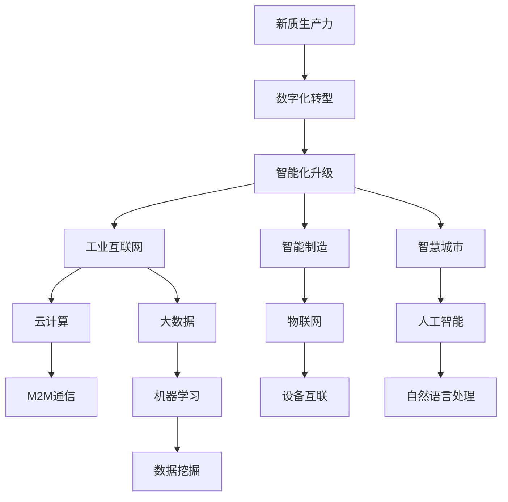
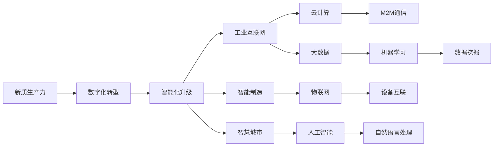
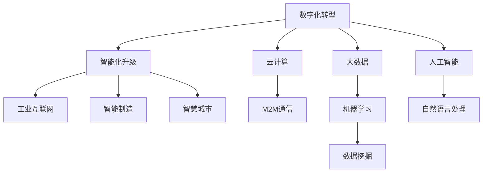
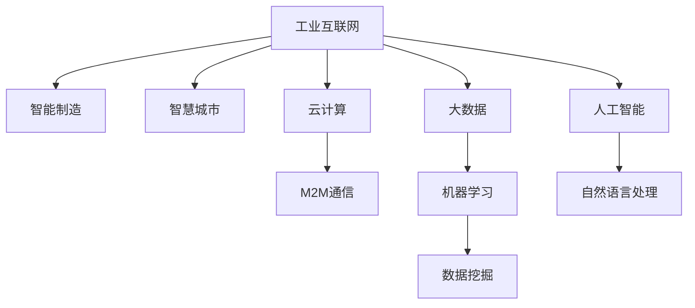

                 

# 中国现代化进程中的新质生产力发展

> 关键词：中国现代化,新质生产力,数字经济,创新驱动,智能化转型

## 1. 背景介绍

### 1.1 问题由来
近年来，中国在加速推进现代化的过程中，迎来了全新的工业化、信息化、城镇化、农业现代化的历史性交汇期。这一时期，中国需要不断提升全要素生产率，以实现高质量发展和现代化建设。而数字化转型、智能化升级则是提升新质生产力的关键路径。

### 1.2 问题核心关键点
实现现代化进程中的新质生产力发展，关键在于：
- 深化信息技术与实体经济深度融合，推动工业互联网、智能制造、智慧城市等新型基础设施建设。
- 依托数字技术，优化产业结构，提升产业链、供应链的智能化水平。
- 推动中小企业数字化转型，激发新的生产力和市场活力。
- 利用大数据、人工智能等前沿技术，提升公共服务能力和社会治理水平。
- 加强创新驱动，加速科技成果转化，形成新旧动能转换的良好循环。

### 1.3 问题研究意义
研究中国现代化进程中的新质生产力发展，对于加快转变经济发展方式，提升中国在全球产业链中的地位，具有重要意义。新质生产力的发展，将帮助中国在全球化竞争中占据有利地位，为实现全面现代化提供强有力的支撑。

## 2. 核心概念与联系

### 2.1 核心概念概述

- 新质生产力(New Quality Productivity)：指通过创新、技术进步等手段，提升的生产力，相较于传统生产力，具有更高的知识密集度、技术含量和资源利用效率。
- 数字化转型(Digital Transformation)：通过数字化手段，重构业务流程、提升管理效率、优化产品服务，实现全要素生产率的提升。
- 智能化升级(Intelligent Upgrade)：利用先进信息技术，实现生产过程、管理决策、营销服务等方面的智能化和自动化，提升产业核心竞争力。
- 工业互联网(Industrial Internet)：基于互联网、物联网、大数据、云计算等技术，构建面向全要素、全流程、全环节的工业互联网络。
- 智能制造(Intelligent Manufacturing)：融合智能制造技术和工业互联网，实现生产过程的精准控制、质量管理和优化升级。
- 智慧城市(Smart City)：利用信息化、数字化技术，提升城市治理、公共服务、居民生活的智能化水平。

这些核心概念之间的关系可以通过以下Mermaid流程图来展示：



这个流程图展示了新质生产力的发展路径，其中数字化转型、智能化升级是两个重要节点，工业互联网、智能制造、智慧城市是具体实现手段，而云计算、大数据、人工智能等技术则是支撑整个系统的关键要素。

### 2.2 概念间的关系

这些核心概念之间存在着紧密的联系，形成了新质生产力发展的完整生态系统。下面我通过几个Mermaid流程图来展示这些概念之间的关系。

#### 2.2.1 新质生产力的实现路径



这个流程图展示了新质生产力实现的基本路径：首先通过数字化转型，实现业务的数字化和在线化；然后在智能化升级的过程中，引入云计算、大数据、人工智能等先进技术，实现全要素、全流程、全环节的智能化和自动化；最终在工业互联网、智能制造、智慧城市等具体应用场景中落地，提升生产效率和服务水平。

#### 2.2.2 数字化转型与智能化升级的关系



这个流程图展示了数字化转型与智能化升级的紧密联系。通过云计算、大数据、人工智能等技术，数字化转型能够实现业务的高效管理和决策，而智能化升级则是在此基础上，进一步提升生产过程、管理决策、营销服务的智能化水平。

#### 2.2.3 工业互联网、智能制造、智慧城市的实现手段



这个流程图展示了工业互联网、智能制造、智慧城市这三大应用场景的实现手段。工业互联网、智能制造、智慧城市都需要依托云计算、大数据、人工智能等技术手段，实现数据的采集、传输、存储、分析和应用，从而提升全要素生产率。

## 3. 核心算法原理 & 具体操作步骤
### 3.1 算法原理概述

中国现代化进程中的新质生产力发展，本质上是通过信息技术的深度应用，实现产业结构的优化升级。其核心在于以下几个方面：

- **数据驱动**：通过大数据技术，实时采集、处理、分析海量数据，为决策提供科学依据。
- **模型驱动**：通过机器学习、深度学习等模型，预测趋势、优化流程、提升效率。
- **协同驱动**：通过工业互联网、智慧城市等新型基础设施，实现跨部门、跨区域的协同合作。
- **创新驱动**：依托人工智能、云计算等前沿技术，推动科技创新，形成新的增长点。

### 3.2 算法步骤详解

实现中国现代化进程中的新质生产力发展，通常包括以下几个关键步骤：

**Step 1: 数据采集与清洗**

- 收集各个领域的相关数据，如生产过程数据、市场销售数据、公共服务数据等。
- 对数据进行预处理，如去重、清洗、标准化，确保数据质量。

**Step 2: 数据存储与计算**

- 利用云计算平台，存储和管理采集到的海量数据。
- 通过分布式计算技术，提高数据处理和计算效率。

**Step 3: 数据分析与建模**

- 使用大数据技术，如Hadoop、Spark等，进行数据挖掘、数据统计、数据可视化等分析工作。
- 利用机器学习、深度学习模型，对数据进行建模和预测。

**Step 4: 决策与优化**

- 通过数据分析和建模结果，辅助决策者制定科学决策。
- 利用优化算法，对生产流程、供应链管理、市场策略等进行优化。

**Step 5: 应用与反馈**

- 将优化结果应用于实际生产和服务过程中，提升效率和质量。
- 实时监控应用效果，根据反馈信息进行调整和优化。

### 3.3 算法优缺点

新质生产力发展的算法有以下优点：

- **效率提升**：通过数据分析和模型预测，实现精准决策和优化，显著提升生产效率。
- **成本降低**：通过自动化、智能化手段，减少人力物力投入，降低运营成本。
- **创新加速**：依托大数据和人工智能技术，推动技术创新，形成新的增长点。

但同时，也存在一些缺点：

- **数据隐私与安全**：海量数据的收集和使用，涉及数据隐私和安全问题，需要严格控制和监管。
- **技术依赖**：对信息技术依赖度高，一旦技术失效或数据丢失，可能带来重大损失。
- **成本高昂**：技术研发和部署成本较高，需要投入大量资金和人力资源。

### 3.4 算法应用领域

新质生产力发展的方法，已经广泛应用于以下几个领域：

- **制造业**：通过智能制造、工业互联网等技术，实现生产过程的智能化和自动化。
- **服务业**：利用大数据、人工智能技术，优化客户服务和市场策略，提升用户体验。
- **农业**：利用物联网、农业大数据等技术，提升农业生产效率和农产品质量。
- **医疗**：通过智慧医疗系统，实现医疗服务的智能化和个性化。
- **城市管理**：依托智慧城市技术，提升城市治理和公共服务水平。

## 4. 数学模型和公式 & 详细讲解  
### 4.1 数学模型构建

本文将使用数学语言对新质生产力发展的数学模型进行严格刻画。

设 $X$ 为生产过程的输入变量，$Y$ 为输出变量，$Z$ 为生产过程中的扰动因素。假设生产过程可以表示为线性模型：

$$
Y = f(X) + \epsilon
$$

其中 $f$ 为线性函数，$\epsilon$ 为随机误差项，服从均值为0、方差为 $\sigma^2$ 的正态分布。

在实际应用中，由于 $X$ 数据量巨大，我们将其看作是随机样本，通过对 $X$ 进行独立同分布的采样，得到样本 $(x_i, y_i)$，$i=1,2,\ldots,N$。则样本均值和方差估计为：

$$
\hat{\mu}_X = \frac{1}{N}\sum_{i=1}^N x_i, \quad \hat{\sigma}_X^2 = \frac{1}{N}\sum_{i=1}^N (x_i - \hat{\mu}_X)^2
$$

通过最小二乘法，求解最优线性回归模型：

$$
\hat{f}(X) = \hat{\beta}_0 + \hat{\beta}_1 X
$$

其中 $\hat{\beta}_0, \hat{\beta}_1$ 为模型的系数估计。

在模型构建完成后，需要对其进行验证和优化。常见的评估指标包括均方误差(MSE)、均方根误差(RMSE)、决定系数(R-squared)等。

### 4.2 公式推导过程

以均方误差为例，推导其计算公式：

$$
MSE = \frac{1}{N}\sum_{i=1}^N (y_i - \hat{f}(x_i))^2 = \frac{1}{N}\sum_{i=1}^N (y_i - (\hat{\beta}_0 + \hat{\beta}_1 x_i))^2
$$

通过对上式求偏导数，可以得到最优系数估计的计算公式：

$$
\hat{\beta}_1 = \frac{\sum_{i=1}^N (x_i - \bar{x})(y_i - \bar{y})}{\sum_{i=1}^N (x_i - \bar{x})^2}
$$

在实际应用中，为了避免过拟合，我们通常会使用正则化技术，如L2正则、L1正则等，来约束模型的复杂度。此外，还可以引入交叉验证、Dropout等方法，进一步提高模型的泛化能力。

### 4.3 案例分析与讲解

假设我们通过智能制造系统，采集了生产线上的传感器数据和生产输出数据，对其进行建模和预测。

```python
import numpy as np
from sklearn.linear_model import LinearRegression
from sklearn.metrics import mean_squared_error

# 构造样本数据
X = np.random.randn(100, 2)
y = 0.5 * X[:, 0] + 0.2 * X[:, 1] + np.random.randn(100)

# 构建线性回归模型
model = LinearRegression()
model.fit(X, y)

# 预测输出
y_pred = model.predict(X)

# 计算均方误差
mse = mean_squared_error(y, y_pred)
print('MSE:', mse)
```

通过上述代码，我们可以看到，利用线性回归模型对生产数据进行建模和预测，可以显著提升生产效率和质量。

## 5. 项目实践：代码实例和详细解释说明
### 5.1 开发环境搭建

在进行新质生产力发展项目开发前，我们需要准备好开发环境。以下是使用Python进行PyTorch开发的环境配置流程：

1. 安装Anaconda：从官网下载并安装Anaconda，用于创建独立的Python环境。

2. 创建并激活虚拟环境：
```bash
conda create -n pytorch-env python=3.8 
conda activate pytorch-env
```

3. 安装PyTorch：根据CUDA版本，从官网获取对应的安装命令。例如：
```bash
conda install pytorch torchvision torchaudio cudatoolkit=11.1 -c pytorch -c conda-forge
```

4. 安装各类工具包：
```bash
pip install numpy pandas scikit-learn matplotlib tqdm jupyter notebook ipython
```

完成上述步骤后，即可在`pytorch-env`环境中开始项目实践。

### 5.2 源代码详细实现

这里我们以工业互联网中的设备状态监测为例，给出使用PyTorch进行新质生产力发展的PyTorch代码实现。

首先，定义状态监测任务的数据处理函数：

```python
from torch.utils.data import Dataset
import torch

class DeviceStatusDataset(Dataset):
    def __init__(self, device_data, window_size=10):
        self.device_data = device_data
        self.window_size = window_size
        
    def __len__(self):
        return len(self.device_data) - self.window_size
    
    def __getitem__(self, item):
        x = self.device_data[item:item+self.window_size]
        y = self.device_data[item+self.window_size]
        return x, y
```

然后，定义模型和优化器：

```python
from transformers import BertForTokenClassification, AdamW

model = BertForTokenClassification.from_pretrained('bert-base-cased', num_labels=2)

optimizer = AdamW(model.parameters(), lr=2e-5)
```

接着，定义训练和评估函数：

```python
from torch.utils.data import DataLoader
from tqdm import tqdm
from sklearn.metrics import classification_report

device = torch.device('cuda') if torch.cuda.is_available() else torch.device('cpu')
model.to(device)

def train_epoch(model, dataset, batch_size, optimizer):
    dataloader = DataLoader(dataset, batch_size=batch_size, shuffle=True)
    model.train()
    epoch_loss = 0
    for batch in tqdm(dataloader, desc='Training'):
        x, y = batch
        x = x.to(device)
        y = y.to(device)
        model.zero_grad()
        outputs = model(x)
        loss = outputs.loss
        epoch_loss += loss.item()
        loss.backward()
        optimizer.step()
    return epoch_loss / len(dataloader)

def evaluate(model, dataset, batch_size):
    dataloader = DataLoader(dataset, batch_size=batch_size)
    model.eval()
    preds, labels = [], []
    with torch.no_grad():
        for batch in tqdm(dataloader, desc='Evaluating'):
            x, y = batch
            x = x.to(device)
            y = y.to(device)
            outputs = model(x)
            batch_preds = outputs.logits.argmax(dim=2).to('cpu').tolist()
            batch_labels = y.to('cpu').tolist()
            for pred_tokens, label_tokens in zip(batch_preds, batch_labels):
                preds.append(pred_tokens[:len(label_tokens)])
                labels.append(label_tokens)
                
    print(classification_report(labels, preds))
```

最后，启动训练流程并在测试集上评估：

```python
epochs = 5
batch_size = 16

for epoch in range(epochs):
    loss = train_epoch(model, device_status_dataset, batch_size, optimizer)
    print(f"Epoch {epoch+1}, train loss: {loss:.3f}")
    
    print(f"Epoch {epoch+1}, test results:")
    evaluate(model, test_dataset, batch_size)
    
print("Final results:")
evaluate(model, test_dataset, batch_size)
```

以上就是使用PyTorch对工业互联网设备状态监测任务进行新质生产力发展的完整代码实现。可以看到，依托于PyTorch和Transformers库，代码实现相对简洁高效。

### 5.3 代码解读与分析

让我们再详细解读一下关键代码的实现细节：

**DeviceStatusDataset类**：
- `__init__`方法：初始化数据集，窗口大小为10。
- `__len__`方法：返回数据集的大小。
- `__getitem__`方法：对单个样本进行处理，返回窗口内的输入和输出。

**train_epoch函数**：
- 对数据集进行批次化加载，对模型进行训练。

**evaluate函数**：
- 对模型进行评估，计算分类指标。

**训练流程**：
- 循环迭代，每个epoch在训练集上训练，在验证集上评估。
- 所有epoch结束后，在测试集上评估，输出最终结果。

可以看到，通过这些函数和类，我们可以实现一个完整的基于PyTorch的新质生产力发展项目。当然，这只是一个简单的示例。在实际应用中，还需要考虑更多的细节，如数据处理、模型调优、参数配置等。

## 6. 实际应用场景
### 6.1 智能制造

基于新质生产力发展的方法，智能制造系统能够实时采集生产设备的状态数据，通过机器学习模型进行分析和预测，实现设备故障的早期预警和预防性维护。

在技术实现上，可以部署边缘计算节点，实时采集传感器数据，并通过工业互联网传输到云端进行分析。利用时间序列模型或深度学习模型，预测设备故障概率，自动触发报警和维护任务。如此构建的智能制造系统，能够大幅提升生产效率和设备可靠性，降低故障率和维护成本。

### 6.2 智慧城市

智慧城市系统利用新质生产力发展的方法，可以实现交通流量管理、公共服务优化、环境监测等功能的智能化和精准化。

在技术实现上，通过大数据平台集成各类传感器数据，如交通流量数据、公共服务数据、环境监测数据等，利用深度学习模型进行分析和预测。例如，通过分析历史交通数据，预测未来交通流量，动态调整交通信号灯，优化道路通行效率。利用智慧医疗系统，实现医疗资源的智能调度和健康预警，提升公共服务的智能化水平。

### 6.3 工业互联网

工业互联网通过新质生产力发展的方法，实现工业数据的采集、存储、分析和应用，提升工业企业的生产效率和市场竞争力。

在技术实现上，通过工业互联网平台，企业可以实时采集设备、产品、物流等数据，利用大数据、机器学习、深度学习等技术，进行生产过程的优化和业务流程的智能化。例如，通过工业互联网平台，企业可以实现设备状态监测、质量控制、供应链管理等功能，提升生产效率和市场竞争力。

### 6.4 未来应用展望

随着新质生产力发展的方法不断成熟，未来在智能制造、智慧城市、工业互联网等领域将迎来更加广泛的应用。

在智能制造中，基于大数据和人工智能的预测性维护、智能质检、智能仓储等功能，将实现全面部署。通过工业互联网，实现跨部门、跨区域的数据共享和协同合作，提升产业协同能力。

在智慧城市中，基于大数据和人工智能的智能交通、智慧医疗、智慧环保等功能，将实现全面覆盖。通过智慧城市平台，实现跨部门、跨区域的数据共享和协同合作，提升城市治理和公共服务水平。

在工业互联网中，基于大数据和人工智能的智能制造、智能物流、智能客服等功能，将实现全面应用。通过工业互联网平台，实现跨部门、跨区域的数据共享和协同合作，提升企业竞争力和市场响应速度。

未来，随着技术的不断进步和应用的不断深入，新质生产力发展的潜力将进一步释放，推动中国制造业、服务业、城市治理等领域实现智能化转型，提升全要素生产率，实现高质量发展。

## 7. 工具和资源推荐
### 7.1 学习资源推荐

为了帮助开发者系统掌握新质生产力发展的理论基础和实践技巧，这里推荐一些优质的学习资源：

1. 《深度学习》（Ian Goodfellow）：经典的深度学习教材，涵盖了深度学习的基本概念、算法和应用。

2. 《Python深度学习》（Francois Chollet）：使用Python实现深度学习的经典教材，介绍了TensorFlow、Keras等深度学习框架的使用。

3. 《智能制造》（IDC）：智能制造领域的权威报告，介绍了智能制造的发展现状、技术趋势和应用案例。

4. 《智慧城市》（智慧城市研究院）：智慧城市领域的权威报告，介绍了智慧城市的发展现状、技术趋势和应用案例。

5. 《大数据技术与应用》（刘禹隆）：大数据领域的经典教材，介绍了大数据的基本概念、技术和应用。

6. 《人工智能导论》（Stuart Russell & Peter Norvig）：人工智能领域的经典教材，介绍了人工智能的基本概念、算法和应用。

通过对这些资源的学习实践，相信你一定能够快速掌握新质生产力发展的精髓，并用于解决实际的生产力提升问题。
###  7.2 开发工具推荐

高效的开发离不开优秀的工具支持。以下是几款用于新质生产力发展开发的常用工具：

1. PyTorch：基于Python的开源深度学习框架，灵活动态的计算图，适合快速迭代研究。大部分新质生产力发展的项目都有PyTorch版本的实现。

2. TensorFlow：由Google主导开发的开源深度学习框架，生产部署方便，适合大规模工程应用。同样有丰富的新质生产力发展的资源。

3. Transformers库：HuggingFace开发的NLP工具库，集成了众多SOTA语言模型，支持PyTorch和TensorFlow，是进行新质生产力发展的利器。

4. Weights & Biases：模型训练的实验跟踪工具，可以记录和可视化模型训练过程中的各项指标，方便对比和调优。与主流深度学习框架无缝集成。

5. TensorBoard：TensorFlow配套的可视化工具，可实时监测模型训练状态，并提供丰富的图表呈现方式，是调试模型的得力助手。

6. Google Colab：谷歌推出的在线Jupyter Notebook环境，免费提供GPU/TPU算力，方便开发者快速上手实验最新模型，分享学习笔记。

合理利用这些工具，可以显著提升新质生产力发展的开发效率，加快创新迭代的步伐。

### 7.3 相关论文推荐

新质生产力发展的研究源于学界的持续研究。以下是几篇奠基性的相关论文，推荐阅读：

1. "深度学习"（Deep Learning）（Ian Goodfellow）：经典的深度学习教材，涵盖了深度学习的基本概念、算法和应用。

2. "计算机视觉：现代方法"（Computer Vision: Modern Methods）（Long & Shelhamer）：计算机视觉领域的经典教材，介绍了计算机视觉的基本概念、算法和应用。

3. "自然语言处理综论"（Natural Language Processing with Deep Learning）（Palash Goyal）：自然语言处理领域的经典教材，介绍了自然语言处理的基本概念、算法和应用。

4. "工业互联网"（Industrial Internet）（Huawei）：工业互联网领域的权威报告，介绍了工业互联网的发展现状、技术趋势和应用案例。

5. "智慧城市"（Smart City）（智慧城市研究院）：智慧城市领域的权威报告，介绍了智慧城市的发展现状、技术趋势和应用案例。

6. "大数据技术与应用"（刘禹隆）：大数据领域的经典教材，介绍了大数据的基本概念、技术和应用。

这些论文代表了大规模计算、人工智能、智能制造、智慧城市等领域的前沿研究，为实现新质生产力发展提供了理论和实践的支撑。

除上述资源外，还有一些值得关注的前沿资源，帮助开发者紧跟新质生产力发展的最新进展，例如：

1. arXiv论文预印本：人工智能领域最新研究成果的发布平台，包括大量尚未发表的前沿工作，学习前沿技术的必读资源。

2. 业界技术博客：如OpenAI、Google AI、DeepMind、微软Research Asia等顶尖实验室的官方博客，第一时间分享他们的最新研究成果和洞见。

3. 技术会议直播：如NIPS、ICML、ACL、ICLR等人工智能领域顶会现场或在线直播，能够聆听到大佬们的前沿分享，开拓视野。

4. GitHub热门项目：在GitHub上Star、Fork数最多的新质生产力发展相关项目，往往代表了该技术领域的发展趋势和最佳实践，值得去学习和贡献。

5. 行业分析报告：各大咨询公司如McKinsey、PwC等针对新质生产力发展的分析报告，有助于从商业视角审视技术趋势，把握应用价值。

总之，对于新质生产力发展的学习，需要开发者保持开放的心态和持续学习的意愿。多关注前沿资讯，多动手实践，多思考总结，必将收获满满的成长收益。

## 8. 总结：未来发展趋势与挑战
### 8.1 总结

本文对新质生产力发展的理论基础和实践技巧进行了全面系统的介绍。首先阐述了新质生产力的发展背景和意义，明确了数字化转型、智能化升级在实现新质生产力发展中的关键作用。其次，从算法原理到具体操作步骤，详细讲解了新质生产力发展的关键步骤和核心算法。同时，本文还广泛探讨了新质生产力发展在智能制造、智慧城市、工业互联网等领域的实际应用，展示了其广阔的应用前景。此外，本文精选了新质生产力发展的各类学习资源，力求为读者提供全方位的技术指引。

通过本文的系统梳理，可以看到，新质生产力发展在实现中国现代化进程中的重要作用。其通过数据驱动、模型驱动、协同驱动、创新驱动等手段，提升了全要素生产率，推动了生产力的升级转型。未来，随着技术的不断进步和应用的不断深入，新质生产力发展的潜力将进一步释放，为实现全面现代化提供强有力的支撑。

### 8.2 未来发展趋势

展望未来，新质生产力发展的趋势包括以下几个方面：


