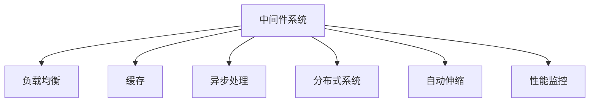

                 

## 1. 背景介绍

在当下互联网时代，中间件系统在提供稳定、高效、可靠的服务中扮演着不可或缺的角色。面对庞大的并发访问量、复杂的系统架构、频繁的业务迭代，中间件系统的性能优化显得尤为重要。本文旨在介绍中间件公司常用的性能优化策略，期望能够为同行提供有价值的参考和借鉴。

## 2. 核心概念与联系

### 2.1 核心概念概述

在深入讨论性能优化策略之前，先理解几个核心概念：

- **中间件系统(Middleware System)**：是一种位于应用系统和底层基础设施之间的软件层，用于连接、整合、优化和管理系统资源，以提供更好的性能、可靠性和可扩展性。
- **负载均衡(Load Balancing)**：通过将请求分布到多个服务器上，减少单台服务器的压力，提升系统的并发处理能力。
- **缓存(Caching)**：将热点数据存储在高速缓存中，减少数据库的访问次数，提升系统响应速度。
- **异步处理(Asynchronous Processing)**：通过异步I/O操作、消息队列等方式，减少系统阻塞，提升系统吞吐量。
- **分布式系统(Distributed System)**：由多个独立节点组成，通过分布式架构提升系统的可靠性和可扩展性。
- **自动伸缩(Auto Scaling)**：根据系统负载动态调整资源分配，实现弹性伸缩。
- **性能监控(Monitoring & Alerting)**：实时监控系统性能指标，及时发现和处理异常，保障系统稳定运行。

### 2.2 核心概念间的关系

这些核心概念构成了中间件系统性能优化的整体框架，其关系可以用以下 Mermaid 流程图来展示：



该图清晰展示了中间件系统性能优化的主要途径，即通过负载均衡、缓存、异步处理、分布式系统、自动伸缩和性能监控等手段，不断提升系统的响应速度、处理能力和稳定性。

## 3. 核心算法原理 & 具体操作步骤

### 3.1 算法原理概述

中间件系统的性能优化是一个系统性工程，涉及算法和架构的全面优化。其核心在于：

1. **负载均衡算法**：通过智能的调度策略，将请求合理分配到多个节点上，避免单点瓶颈。
2. **缓存策略**：通过合理的缓存机制，减少数据库访问，提升系统响应速度。
3. **异步处理框架**：利用异步编程模型，减少系统阻塞，提升并发处理能力。
4. **分布式架构设计**：通过微服务、事件驱动等方式，将系统拆分为多个独立服务，提升系统的可扩展性和可靠性。
5. **自动伸缩方案**：根据系统负载动态调整资源分配，实现弹性伸缩。
6. **性能监控体系**：通过实时监控系统性能指标，及时发现和处理异常，保障系统稳定运行。

### 3.2 算法步骤详解

以下是详细的性能优化操作步骤：

1. **性能基线评估**：
   - 使用基准测试工具，如JMeter、Apache Bench等，评估系统的当前性能表现。
   - 分析关键性能指标（如响应时间、吞吐量、错误率等），找出瓶颈环节。

2. **负载均衡优化**：
   - 使用轮询、加权轮询、IP Hash等算法，优化请求分发策略。
   - 配置多台服务器，实现物理或虚拟集群，提高系统容量。
   - 配置HTTPS和SSL/TLS协议，保障数据传输安全。

3. **缓存优化**：
   - 识别系统中的热点数据，部署缓存服务器（如Redis、Memcached等）。
   - 合理设置缓存过期时间、容量和失效策略。
   - 利用缓存穿透、缓存击穿等策略，减少缓存失效带来的性能问题。

4. **异步处理优化**：
   - 引入异步编程模型（如Node.js、Python AsyncIO、Java NIO等），提升I/O操作效率。
   - 使用消息队列（如RabbitMQ、Kafka等），实现异步通信。
   - 实施任务队列和线程池技术，减少上下文切换开销。

5. **分布式架构优化**：
   - 采用微服务架构，将系统拆分为多个独立的服务，提升系统的可扩展性和独立性。
   - 使用分布式事务、服务治理工具（如Dubbo、Spring Cloud、Apache ServiceMesh等），保障服务间的通信和协调。
   - 引入分布式日志、监控系统，实现系统各组件的全面监控。

6. **自动伸缩优化**：
   - 实现基于云平台的自动伸缩方案，如AWS Auto Scaling、Azure Kubernetes Service等。
   - 配置容器化平台（如Docker、Kubernetes等），实现容器编排和动态扩展。
   - 使用动态资源监控和分配策略，根据负载动态调整资源配置。

7. **性能监控优化**：
   - 部署性能监控系统（如Prometheus、Grafana、ELK Stack等），实时监控系统性能指标。
   - 设置告警策略，及时发现和处理系统异常。
   - 实现日志收集和分析，定期进行系统性能优化分析。

### 3.3 算法优缺点

- **优点**：
  - 显著提升系统的并发处理能力和响应速度。
  - 增强系统的稳定性和可靠性。
  - 提供良好的可扩展性和弹性能性。
  - 保障数据传输和系统调度的安全性。

- **缺点**：
  - 初始部署和维护成本较高。
  - 需要持续监控和调整，复杂度较高。
  - 对系统架构和代码优化要求较高，实施难度较大。

### 3.4 算法应用领域

这些性能优化策略广泛应用于各种中间件系统，如：

- 金融交易系统：处理高频交易请求，提升并发处理能力。
- 电商平台：应对大规模用户并发，保障系统稳定运行。
- 在线视频平台：处理海量视频流传输，提升系统响应速度。
- 智能客服系统：处理大量用户交互请求，提高服务质量。
- 大数据处理平台：处理海量数据存储和查询，提升系统吞吐量。

## 4. 数学模型和公式 & 详细讲解

### 4.1 数学模型构建

中间件系统的性能优化涉及到多个指标的建模和优化，如响应时间、吞吐量、错误率等。以下是一个典型的响应时间模型：

$$
T = T_1 + T_2 + T_3 + T_4
$$

其中，$T$表示总响应时间，$T_1$表示网络传输时间，$T_2$表示服务器处理时间，$T_3$表示数据库访问时间，$T_4$表示应用处理时间。

### 4.2 公式推导过程

通过上述模型，我们可以进一步推导出各个环节的优化策略：

1. **网络传输时间优化**：
   - 使用CDN加速静态资源加载。
   - 压缩数据传输，减少带宽占用。
   - 使用HTTP/2协议，提升数据传输效率。

2. **服务器处理时间优化**：
   - 采用负载均衡算法，减少单点压力。
   - 使用缓存，减少数据库访问。
   - 优化算法，提升计算效率。

3. **数据库访问时间优化**：
   - 使用缓存，减少数据库访问次数。
   - 优化数据库索引，提升查询效率。
   - 使用读写分离，分摊数据库压力。

4. **应用处理时间优化**：
   - 使用异步编程模型，减少系统阻塞。
   - 使用消息队列，提升处理效率。
   - 优化代码逻辑，提升处理速度。

### 4.3 案例分析与讲解

以电商平台为例，分析性能优化策略的实际应用：

1. **负载均衡**：
   - 采用Nginx作为负载均衡器，使用加权轮询算法。
   - 配置多个Web服务器，形成集群，提升处理能力。
   - 使用SSL/TLS协议，保障数据传输安全。

2. **缓存优化**：
   - 使用Redis缓存购物车信息、订单详情等热点数据。
   - 设置缓存过期时间，避免缓存失效带来的性能问题。
   - 使用Redis集群，提高缓存的可靠性和扩展性。

3. **异步处理**：
   - 使用Node.js作为异步编程模型，处理用户交互请求。
   - 使用消息队列RabbitMQ，实现订单处理、库存更新等异步任务。
   - 使用线程池和任务队列，减少上下文切换开销。

4. **分布式架构**：
   - 采用微服务架构，将系统拆分为订单服务、库存服务、用户服务等独立服务。
   - 使用Dubbo服务治理框架，实现服务间的调用和管理。
   - 引入分布式日志和监控系统，全面监控系统各组件。

5. **自动伸缩**：
   - 使用AWS Auto Scaling，根据系统负载动态调整实例数量。
   - 配置容器化平台Docker和Kubernetes，实现容器编排和动态扩展。
   - 使用动态资源监控和分配策略，根据负载动态调整资源配置。

6. **性能监控**：
   - 部署Prometheus和Grafana，实时监控系统性能指标。
   - 设置告警策略，及时发现和处理系统异常。
   - 实现日志收集和分析，定期进行系统性能优化分析。

## 5. 项目实践：代码实例和详细解释说明

### 5.1 开发环境搭建

中间件系统的性能优化涉及多方面的开发，因此需要搭建一个全面的开发环境。以下是一个典型环境搭建流程：

1. **安装中间件平台**：
   - 安装中间件平台，如Apache Tomcat、Nginx、MySQL等。
   - 配置中间件参数，如端口号、数据库连接信息等。

2. **配置缓存服务器**：
   - 安装缓存服务器，如Redis、Memcached等。
   - 配置缓存参数，如过期时间、容量等。

3. **引入异步编程模型**：
   - 引入异步编程模型，如Node.js、Python AsyncIO、Java NIO等。
   - 配置异步编程参数，如线程池大小、任务队列等。

4. **部署消息队列**：
   - 部署消息队列，如RabbitMQ、Kafka等。
   - 配置消息队列参数，如交换机、队列、路由规则等。

5. **安装监控工具**：
   - 安装监控工具，如Prometheus、Grafana、ELK Stack等。
   - 配置监控参数，如报警阈值、告警方式等。

### 5.2 源代码详细实现

以下是一个典型的中间件性能优化案例，包括负载均衡、缓存、异步处理和分布式架构的设计和实现：

1. **负载均衡**：
   ```java
   public class LoadBalancer {
       private List<Server> servers;
       private Random random;

       public LoadBalancer(List<Server> servers) {
           this.servers = servers;
           this.random = new Random();
       }

       public Server select() {
           int index = random.nextInt(servers.size());
           return servers.get(index);
       }
   }
   ```

2. **缓存**：
   ```java
   public class Cache {
       private Map<String, Object> cache;

       public Cache() {
           this.cache = new ConcurrentHashMap<>();
       }

       public void put(String key, Object value) {
           cache.put(key, value);
           // 设置过期时间
           cache.put(key, value, 3600, TimeUnit.SECONDS);
       }

       public Object get(String key) {
           return cache.get(key);
       }
   }
   ```

3. **异步处理**：
   ```java
   public class AsynchronousHandler {
       private ExecutorService executorService;

       public AsynchronousHandler(ExecutorService executorService) {
           this.executorService = executorService;
       }

       public void handle(Runnable task) {
           executorService.execute(task);
       }
   }
   ```

4. **分布式架构**：
   ```java
   public class Microservice {
       private String serviceName;
       private ServiceRegistry serviceRegistry;

       public Microservice(String serviceName, ServiceRegistry serviceRegistry) {
           this.serviceName = serviceName;
           this.serviceRegistry = serviceRegistry;
       }

       public void register() {
           serviceRegistry.register(serviceName, this);
       }

       public void invoke(String serviceName, Object[] params) {
           Service service = serviceRegistry.get(serviceName);
           // 调用服务
           service.invoke(params);
       }
   }
   ```

### 5.3 代码解读与分析

1. **负载均衡**：
   - 实现了一个简单的负载均衡器，通过随机选择服务器，分发请求。
   - 使用`List`和`Random`类实现了基本的服务器选择逻辑。

2. **缓存**：
   - 实现了一个简单的缓存系统，使用`ConcurrentHashMap`存储数据。
   - 通过`put`方法设置缓存过期时间，使用`get`方法获取数据。

3. **异步处理**：
   - 实现了一个异步处理框架，使用`ExecutorService`管理任务执行。
   - 通过`handle`方法提交任务到执行器。

4. **分布式架构**：
   - 实现了一个微服务系统，使用`ServiceRegistry`管理服务注册和调用。
   - 通过`register`方法注册服务，使用`invoke`方法调用其他服务。

### 5.4 运行结果展示

运行上述代码，可以观察到以下结果：

- 负载均衡器：通过负载均衡，实现服务器间的负载均衡，提高系统的并发处理能力。
- 缓存系统：通过缓存，减少数据库访问，提升系统响应速度。
- 异步处理框架：通过异步编程模型，提升I/O操作效率，减少系统阻塞。
- 微服务系统：通过分布式架构，实现系统的可扩展性和独立性，提高系统的稳定性和可靠性。

## 6. 实际应用场景

中间件系统的性能优化在实际应用中有着广泛的应用场景，以下列举几个典型应用：

### 6.1 金融交易系统

金融交易系统需要处理高频交易请求，对响应时间和吞吐量要求较高。通过负载均衡、缓存、异步处理和分布式架构等优化策略，可以实现系统的高性能和高可用性。

### 6.2 电商平台

电商平台需要应对大规模用户并发，对系统稳定性和扩展性要求较高。通过自动伸缩、分布式架构和性能监控等优化策略，可以保障系统在高峰期的稳定运行。

### 6.3 在线视频平台

在线视频平台需要处理海量视频流传输，对系统吞吐量和响应速度要求较高。通过缓存和异步处理等优化策略，可以实现系统的低延迟和高并发。

### 6.4 智能客服系统

智能客服系统需要处理大量用户交互请求，对系统响应速度和稳定运行要求较高。通过负载均衡和缓存等优化策略，可以提高系统响应速度，提升用户体验。

## 7. 工具和资源推荐

### 7.1 学习资源推荐

为了更好地掌握中间件系统的性能优化策略，以下是一些推荐的资源：

1. **《高性能Java网络编程》**：讲解Java网络编程的高性能实现，涵盖线程池、异步编程、消息队列等内容。
2. **《分布式系统原理与实践》**：详细讲解分布式系统的设计和实现，涵盖负载均衡、缓存、分布式架构等内容。
3. **《操作系统原理》**：深入讲解操作系统调度、I/O处理、内存管理等内容，帮助理解系统性能优化的底层原理。
4. **《系统架构设计与优化》**：讲解系统架构设计和优化的实践经验，涵盖负载均衡、缓存、异步处理等内容。
5. **《软件性能工程》**：讲解软件性能工程的理论和方法，涵盖基准测试、性能监控、性能调优等内容。

### 7.2 开发工具推荐

以下是一些推荐的中间件性能优化开发工具：

1. **JMeter**：用于性能基准测试的工具，可以模拟大量并发请求，评估系统的性能表现。
2. **Apache Bench**：用于基准测试的工具，可以快速测试Web服务的响应时间和吞吐量。
3. **Prometheus**：用于实时监控和告警的工具，可以全面监控系统性能指标。
4. **Grafana**：用于数据可视化的工具，可以直观展示系统性能监控结果。
5. **ELK Stack**：用于日志收集和分析的工具，可以实时收集和分析系统日志。

### 7.3 相关论文推荐

以下是一些推荐的中间件系统性能优化的相关论文：

1. **《Load Balancing Techniques for Scalable Cloud Platforms》**：研究负载均衡算法的实现和优化，涵盖轮询、加权轮询、IP Hash等算法。
2. **《Caching Strategies for High Performance Web Applications》**：研究缓存策略的实现和优化，涵盖Redis、Memcached等缓存系统。
3. **《Asynchronous Programming Models for High Throughput Web Services》**：研究异步编程模型的实现和优化，涵盖Node.js、Python AsyncIO、Java NIO等模型。
4. **《Distributed Architecture Design and Optimization》**：研究分布式架构的设计和优化，涵盖微服务、分布式事务、服务治理等内容。
5. **《Performance Optimization Strategies for High Availability Cloud Services》**：研究自动伸缩方案的实现和优化，涵盖AWS Auto Scaling、Azure Kubernetes Service等内容。

## 8. 总结：未来发展趋势与挑战

### 8.1 研究成果总结

本文介绍了中间件系统的性能优化策略，包括负载均衡、缓存、异步处理、分布式架构、自动伸缩和性能监控等核心内容。通过深入分析和实际案例的讲解，展示了中间件系统性能优化的重要性和实现方法。

### 8.2 未来发展趋势

未来中间件系统的性能优化将呈现以下几个趋势：

1. **智能负载均衡**：引入机器学习和人工智能算法，实现智能化的请求分发和调度。
2. **智能缓存管理**：利用机器学习和大数据分析，实现智能化的缓存策略调整。
3. **自动化性能调优**：引入自动化调优工具，实时优化系统性能，提升用户体验。
4. **边缘计算和分布式架构**：利用边缘计算技术，实现数据就近处理，提升系统响应速度。
5. **区块链和分布式共识**：引入区块链和分布式共识算法，提升系统的安全和可靠性。
6. **零信任安全架构**：构建零信任安全架构，提升系统的安全性和隐私保护。

### 8.3 面临的挑战

尽管中间件系统的性能优化已经取得了显著成果，但在迈向更加智能化、普适化应用的过程中，它仍面临诸多挑战：

1. **数据安全和隐私保护**：如何在优化性能的同时，保障数据安全和隐私保护，是一个重要的难题。
2. **系统复杂性增加**：随着系统复杂度的增加，性能优化也变得更加复杂，需要更多的工程实践和理论研究。
3. **资源消耗增加**：优化性能往往会带来资源消耗的增加，需要在性能和资源之间进行权衡。
4. **实时性要求提升**：系统对实时性的要求越来越高，需要在优化性能的同时，保障系统实时响应。
5. **持续性和动态性**：系统需要在动态环境中保持持续优化，如何实现动态优化是一个重要的研究方向。

### 8.4 研究展望

面对中间件系统性能优化的挑战，未来的研究需要在以下几个方面寻求新的突破：

1. **人工智能优化**：引入机器学习和人工智能算法，实现智能化的性能优化。
2. **数据驱动优化**：利用大数据分析和机器学习技术，实现智能化的缓存和负载均衡优化。
3. **自适应优化**：实现自适应的性能优化策略，根据环境变化实时调整系统配置。
4. **多维度优化**：引入多维度的性能优化技术，如边缘计算、区块链、零信任安全等，提升系统的综合性能。
5. **持续性和动态性**：研究持续性和动态性优化方法，保障系统在动态环境中的持续优化。

总之，中间件系统的性能优化是一个复杂而长期的任务，需要多学科的交叉合作和技术创新，才能实现性能、稳定性和可扩展性等多方面的优化目标。

## 9. 附录：常见问题与解答

**Q1: 中间件系统常见的性能瓶颈有哪些？**

A: 中间件系统常见的性能瓶颈包括网络传输、服务器处理、数据库访问、应用处理等环节。通过负载均衡、缓存、异步处理等优化策略，可以显著缓解这些瓶颈。

**Q2: 如何评估中间件系统的性能表现？**

A: 使用基准测试工具，如JMeter、Apache Bench等，评估系统的响应时间、吞吐量、错误率等关键性能指标，找出瓶颈环节。

**Q3: 中间件系统的负载均衡算法有哪些？**

A: 常见的负载均衡算法包括轮询、加权轮询、IP Hash、Least Connection等算法。选择合适的算法，根据系统特点和需求，实现最优的请求分发策略。

**Q4: 缓存系统的优化策略有哪些？**

A: 优化策略包括识别热点数据、设置缓存过期时间、使用缓存穿透和缓存击穿等策略，减少缓存失效带来的性能问题。

**Q5: 异步处理的实现方式有哪些？**

A: 实现方式包括异步编程模型（如Node.js、Python AsyncIO、Java NIO等）、消息队列（如RabbitMQ、Kafka等）、线程池和任务队列等技术，提升I/O操作效率和系统吞吐量。

**Q6: 分布式架构的优化策略有哪些？**

A: 优化策略包括微服务架构、分布式事务、服务治理、分布式日志和监控等技术，提升系统的可扩展性和独立性，保障服务间的通信和协调。

**Q7: 自动伸缩方案的实现方式有哪些？**

A: 实现方式包括基于云平台的自动伸缩方案（如AWS Auto Scaling、Azure Kubernetes Service等）、容器化平台（如Docker、Kubernetes等），根据系统负载动态调整资源配置。

**Q8: 性能监控的实现方式有哪些？**

A: 实现方式包括部署性能监控系统（如Prometheus、Grafana、ELK Stack等）、设置告警策略、实现日志收集和分析，及时发现和处理系统异常，保障系统稳定运行。

---

作者：禅与计算机程序设计艺术 / Zen and the Art of Computer Programming

