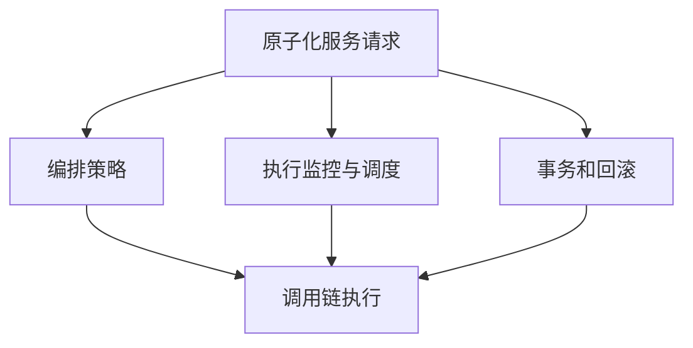
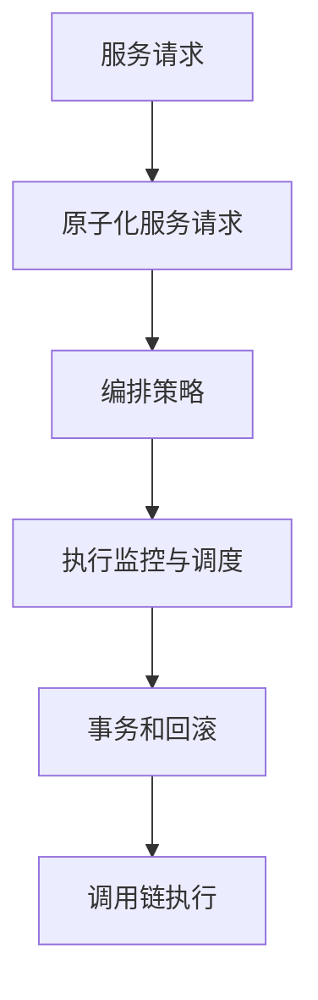

                 

## 1. 背景介绍

### 1.1 问题由来

在软件开发过程中，经常需要对不同模块、不同服务之间的请求进行编排和调用。这一过程称为编排调用链（Sequential Chain）。传统的编排调用链实现方式常常依赖于硬编码的顺序控制、循环迭代等，代码复杂且难以维护。随着微服务架构和分布式系统的普及，越来越多的系统需要构建更加灵活、高效的编排调用链，以支持复杂的业务逻辑和处理海量请求。

### 1.2 问题核心关键点

编排调用链的核心在于如何高效地管理复杂的服务调用关系，如何在保证系统稳定性的同时，提供更灵活、更高效的编排能力。这涉及以下关键点：

- 原子化服务请求。将复杂任务拆分为多个原子化请求，便于独立处理和编排。
- 编排策略设计。通过灵活的编排策略，如顺序、并发、异步、循环等，实现任务的高效执行。
- 执行监控与调度。实时监控任务执行情况，动态调整资源分配和执行策略，确保系统性能稳定。
- 事务和回滚机制。在调用链中引入事务和回滚机制，确保请求的成功性。

### 1.3 问题研究意义

编排调用链在微服务架构和分布式系统中具有重要意义，它直接影响系统性能、稳定性、可扩展性和可维护性。一个好的编排调用链设计，可以：

- 提升系统的并发处理能力，通过并行、异步等策略优化任务执行。
- 提高系统稳定性，通过事务和回滚机制确保请求的正确性。
- 增强系统的可扩展性，通过灵活编排策略支持复杂业务逻辑。
- 简化系统维护，通过原子化服务和自动化编排减少代码复杂度。

因此，探索更高效、更灵活的编排调用链实现方法，对于提升系统性能、稳定性和可维护性，具有重要意义。

## 2. 核心概念与联系

### 2.1 核心概念概述

为了更好地理解编排调用链的实现原理，本节将介绍几个关键概念：

- 编排调用链（Sequential Chain）：指对不同模块、不同服务之间的请求进行有序编排和调用的过程。
- 原子化服务请求（Atomic Service Request）：指将复杂任务拆分为多个独立、互不影响的请求，便于编排和调用。
- 编排策略（Scheduling Strategy）：指根据任务特性设计的灵活编排方案，如顺序、并发、异步、循环等。
- 执行监控与调度（Execution Monitoring and Scheduling）：指实时监控任务执行情况，动态调整资源分配和执行策略。
- 事务和回滚（Transaction and Rollback）：指在调用链中引入事务机制，确保请求的成功性，以及在失败时回滚所有已执行操作。

这些概念之间的逻辑关系可以通过以下Mermaid流程图来展示：



这个流程图展示了原子化服务请求经过编排策略、执行监控与调度和事务回滚后，最终形成完整的编排调用链的过程。

### 2.2 概念间的关系

这些核心概念之间存在着紧密的联系，形成了编排调用链的完整生态系统。下面我们通过几个Mermaid流程图来展示这些概念之间的关系。

#### 2.2.1 编排调用链的实现过程


这个流程图展示了典型的串联式编排调用链，即服务A调用了服务B和服务C。这种编排方式顺序固定，易于管理和调试。

#### 2.2.2 并行编排调用链的实现过程


这个流程图展示了并行式的编排调用链，即服务A同时调用了服务B和服务C。这种编排方式可以提高系统的并发处理能力，但也需要考虑任务的独立性和执行顺序。

#### 2.2.3 异步编排调用链的实现过程


这个流程图展示了异步式的编排调用链，即服务A异步调用了服务B和服务C。这种编排方式可以进一步提升系统的并发处理能力，但需要注意任务之间的依赖关系和回滚机制。

#### 2.2.4 循环编排调用链的实现过程


这个流程图展示了循环式的编排调用链，即服务A循环调用了服务B和服务C。这种编排方式适用于需要反复执行的任务，但需要注意循环次数和条件控制。

### 2.3 核心概念的整体架构

最后，我们用一个综合的流程图来展示这些核心概念在大规模编排调用链中的整体架构：



这个综合流程图展示了从服务请求到原子化服务请求，再到编排策略、执行监控与调度、事务回滚，最终形成完整的编排调用链的过程。通过这些概念的有机结合，可以构建出高效、灵活、可靠的编排调用链，满足复杂的业务逻辑和处理海量请求的需求。

## 3. 核心算法原理 & 具体操作步骤
### 3.1 算法原理概述

编排调用链的本质是编排和管理服务请求的过程，其算法原理可以概括为以下几个步骤：

1. **原子化服务请求**：将复杂任务拆分为多个独立、互不影响的请求。
2. **编排策略设计**：根据任务特性设计灵活的编排方案，如顺序、并发、异步、循环等。
3. **执行监控与调度**：实时监控任务执行情况，动态调整资源分配和执行策略。
4. **事务和回滚**：在调用链中引入事务机制，确保请求的成功性，以及在失败时回滚所有已执行操作。

### 3.2 算法步骤详解

编排调用链的实现步骤如下：

**Step 1: 准备原子化服务请求**

1. 定义每个原子化服务请求的接口和参数。
2. 将复杂任务拆分为多个原子化服务请求，并定义请求之间的依赖关系。

**Step 2: 设计编排策略**

1. 根据任务特性设计编排策略。例如，采用顺序、并发、异步或循环策略。
2. 定义编排策略的执行流程，如顺序列表、并发任务池、异步回调、循环条件等。

**Step 3: 执行任务调度**

1. 实时监控任务执行情况，记录请求的状态和执行时间。
2. 根据编排策略动态调整资源分配和执行顺序。
3. 定期检查任务执行状态，及时发现和处理异常情况。

**Step 4: 引入事务和回滚**

1. 在调用链中引入事务机制，确保每个原子化请求的成功性。
2. 当某个请求失败时，回滚所有已执行操作，恢复到初始状态。

**Step 5: 处理执行结果**

1. 根据任务结果进行后续处理，如返回响应、记录日志、更新状态等。
2. 监控任务执行结果，统计任务成功率和错误率。

### 3.3 算法优缺点

编排调用链具有以下优点：

- **灵活性**：通过灵活的编排策略，支持多种复杂的业务逻辑和任务执行方式。
- **可扩展性**：可以动态调整资源分配和执行策略，适应不同规模和类型的任务。
- **稳定性**：通过事务和回滚机制，确保请求的成功性，避免系统崩溃和数据丢失。
- **可维护性**：通过原子化服务和自动化编排，减少代码复杂度，简化系统维护。

同时，编排调用链也存在一些缺点：

- **复杂性**：编排调用链的设计和实现相对复杂，需要考虑多种因素和细节。
- **资源消耗**：编排调用链需要实时监控和调度任务，可能带来额外的资源消耗。
- **性能影响**：复杂的编排调用链可能影响系统的并发处理能力和响应速度。

### 3.4 算法应用领域

编排调用链在多个领域都有广泛应用，例如：

- 微服务架构：编排调用链是微服务架构的基础，支持复杂的服务调用关系和任务执行策略。
- 分布式系统：编排调用链用于协调和管理分布式系统的服务请求，提高系统的稳定性和可扩展性。
- 实时任务调度：编排调用链用于实时任务的调度和执行，如调度消息队列、监控告警等。
- 任务编排平台：编排调用链用于构建任务编排平台，支持自动化任务编排和调度。

## 4. 数学模型和公式 & 详细讲解 & 举例说明

### 4.1 数学模型构建

假设编排调用链中有 $n$ 个原子化服务请求 $R_1, R_2, ..., R_n$，每个请求需要执行 $t$ 秒，请求之间的依赖关系为 $R_i$ 依赖于 $R_{i-1}$，请求的执行顺序为 $R_1 \rightarrow R_2 \rightarrow ... \rightarrow R_n$。

编排调用链的执行时间 $T$ 可以通过以下公式计算：

$$
T = t_1 + t_2 + ... + t_n
$$

其中 $t_i$ 为 $R_i$ 的执行时间。

### 4.2 公式推导过程

假设编排调用链中每个服务请求的执行时间服从指数分布，且相互独立，则请求的平均执行时间 $T$ 可以表示为：

$$
T = \frac{1}{\mu_1} + \frac{1}{\mu_2} + ... + \frac{1}{\mu_n}
$$

其中 $\mu_i$ 为 $R_i$ 的平均执行时间。

### 4.3 案例分析与讲解

假设有一个包含三个服务请求的编排调用链，每个请求的执行时间服从指数分布，平均执行时间分别为 $1, 2, 3$ 秒，且请求之间的依赖关系为 $R_1 \rightarrow R_2 \rightarrow R_3$。则该调用链的平均执行时间 $T$ 可以通过以下公式计算：

$$
T = \frac{1}{1} + \frac{1}{2} + \frac{1}{3} = \frac{11}{6} \approx 1.833
$$

因此，该调用链的平均执行时间为 $1.833$ 秒。

## 5. 项目实践：代码实例和详细解释说明

### 5.1 开发环境搭建

在进行编排调用链开发前，我们需要准备好开发环境。以下是使用Python进行Django开发的开发环境配置流程：

1. 安装Anaconda：从官网下载并安装Anaconda，用于创建独立的Python环境。

2. 创建并激活虚拟环境：
```bash
conda create -n django-env python=3.8 
conda activate django-env
```

3. 安装Django：
```bash
pip install django
```

4. 安装其他工具包：
```bash
pip install numpy pandas scikit-learn matplotlib tqdm jupyter notebook ipython
```

完成上述步骤后，即可在`django-env`环境中开始编排调用链的开发。

### 5.2 源代码详细实现

下面我们以一个简单的任务编排调用链为例，给出使用Django进行编排调用链的Python代码实现。

首先，定义编排策略类：

```python
class SchedulingStrategy:
    def __init__(self, tasks):
        self.tasks = tasks
        self.dependencies = {}
        self.order = []
        
    def add_task(self, task):
        if task in self.tasks:
            return
        self.tasks[task] = task
        
    def set_dependency(self, task, dependent):
        self.dependencies[dependent] = task
    
    def generate_order(self):
        self.order = []
        for task in self.tasks:
            if not self.has_dependency(task):
                self.order.append(task)
                self.remove_task(task)
    
    def has_dependency(self, task):
        return task in self.dependencies.values()
    
    def remove_task(self, task):
        for dependent, dep_task in self.dependencies.items():
            if dep_task == task:
                del self.dependencies[dependent]
```

然后，定义任务处理类：

```python
class Task:
    def __init__(self, task_id, task_function, execution_time):
        self.task_id = task_id
        self.task_function = task_function
        self.execution_time = execution_time
        self.status = 'ready'
    
    def execute(self):
        if self.status == 'ready':
            self.status = 'processing'
            result = self.task_function()
            self.status = 'done'
            return result
    
    def is_done(self):
        return self.status == 'done'
    
    def is_processing(self):
        return self.status == 'processing'
```

接着，定义任务调度类：

```python
class TaskScheduler:
    def __init__(self, tasks, order, execution_monitor):
        self.tasks = tasks
        self.order = order
        self.execution_monitor = execution_monitor
        
    def schedule(self):
        for task in self.order:
            self.scheduled(task)
    
    def scheduled(self, task):
        task_id = task.task_id
        task_function = task.task_function
        execution_time = task.execution_time
        
        # 通知执行监控器任务即将执行
        self.execution_monitor.on_task_scheduled(task_id)
        
        # 执行任务
        result = task_function()
        
        # 通知执行监控器任务已执行完成
        self.execution_monitor.on_task_completed(task_id, result)
        
        # 更新任务状态为完成
        task.status = 'done'
        
        # 通知执行监控器任务完成
        self.execution_monitor.on_task_completed(task_id, result)
        
        # 记录执行时间
        self.execution_monitor.record_execution_time(task_id, execution_time)
```

最后，定义执行监控器类：

```python
class ExecutionMonitor:
    def __init__(self):
        self.tasks = {}
        self.execution_times = {}
        self.executed_tasks = 0
        self.total_execution_time = 0
        
    def on_task_scheduled(self, task_id):
        if task_id in self.tasks:
            return
        self.tasks[task_id] = task_id
        
    def on_task_completed(self, task_id, result):
        if task_id not in self.tasks:
            return
        self.executed_tasks += 1
        self.total_execution_time += self.execution_times[task_id]
        del self.tasks[task_id]
        del self.execution_times[task_id]
    
    def record_execution_time(self, task_id, execution_time):
        if task_id not in self.execution_times:
            self.execution_times[task_id] = 0
        self.execution_times[task_id] += execution_time
```

完成上述步骤后，我们就可以使用这些类来构建编排调用链并进行任务调度。

### 5.3 代码解读与分析

让我们再详细解读一下关键代码的实现细节：

**SchedulingStrategy类**：
- `__init__`方法：初始化任务列表、依赖关系和执行顺序。
- `add_task`方法：添加任务并检查依赖关系。
- `set_dependency`方法：设置任务之间的依赖关系。
- `generate_order`方法：根据依赖关系生成任务执行顺序。
- `has_dependency`方法：判断任务是否有依赖。
- `remove_task`方法：删除任务。

**Task类**：
- `__init__`方法：初始化任务ID、函数、执行时间和状态。
- `execute`方法：执行任务并更新状态。
- `is_done`方法：判断任务是否已完成。
- `is_processing`方法：判断任务是否正在执行。

**TaskScheduler类**：
- `__init__`方法：初始化任务列表、执行顺序和执行监控器。
- `schedule`方法：按顺序调度任务。
- `scheduled`方法：执行任务并通知执行监控器。

**ExecutionMonitor类**：
- `__init__`方法：初始化任务列表、执行时间和已执行任务数。
- `on_task_scheduled`方法：通知任务即将执行。
- `on_task_completed`方法：通知任务已完成。
- `record_execution_time`方法：记录任务执行时间。

可以看到，编排调用链的实现涉及任务依赖关系、任务执行状态、任务调度顺序等多个关键因素，需要设计出灵活、高效的编排策略，同时实时监控任务执行情况，确保系统稳定性和性能。

## 6. 实际应用场景

### 6.1 微服务架构

在微服务架构中，编排调用链用于协调和管理不同微服务之间的请求。例如，一个电商平台的订单服务、库存服务和支付服务，需要通过编排调用链进行协同。服务请求之间可能存在依赖关系，如订单服务依赖于库存服务，库存服务依赖于支付服务。通过编排调用链，可以灵活地设计服务编排策略，实现高效的并发处理和任务回滚。

### 6.2 分布式系统

在分布式系统中，编排调用链用于协调和管理分布式服务之间的请求。例如，一个消息队列服务、数据库服务和缓存服务，需要通过编排调用链进行协同。任务之间可能存在并发和异步处理，通过编排调用链，可以实现高效的资源分配和任务调度。

### 6.3 实时任务调度

在实时任务调度中，编排调用链用于调度和管理实时任务。例如，一个系统监控任务、日志处理任务和告警任务，需要通过编排调用链进行协同。任务之间可能存在循环和条件控制，通过编排调用链，可以实现灵活的任务编排和监控。

### 6.4 任务编排平台

在任务编排平台中，编排调用链用于构建自动化任务编排和调度系统。例如，一个批处理任务、ETL任务和数据分析任务，需要通过编排调用链进行协同。任务之间可能存在复杂的依赖关系和执行策略，通过编排调用链，可以实现高效的任务编排和执行。

## 7. 工具和资源推荐

### 7.1 学习资源推荐

为了帮助开发者系统掌握编排调用链的理论基础和实践技巧，这里推荐一些优质的学习资源：

1. 《微服务架构实战》系列博文：由微服务架构专家撰写，深入浅出地介绍了微服务架构的设计和实现方法，涵盖编排调用链的基础知识和高级技巧。

2. 《Django实战》系列博文：由Django社区的活跃开发者撰写，详细讲解了Django框架的使用方法和最佳实践，包括编排调用链的实现细节。

3. 《Python程序设计》系列书籍：由Python编程界的知名专家撰写，全面介绍了Python语言的基础知识和高级技巧，涵盖编排调用链的实现方法和设计思路。

4. 《分布式系统设计》系列书籍：由分布式系统领域的权威专家撰写，系统讲解了分布式系统的设计原理和实现方法，涵盖编排调用链的分布式设计和实时调度。

5. 《微服务实战》系列课程：由顶尖互联网公司如Google、Amazon等提供的官方课程，通过实际项目演示编排调用链的实现方法和应用场景。

通过对这些资源的学习实践，相信你一定能够快速掌握编排调用链的技术精髓，并用于解决实际的系统需求。

### 7.2 开发工具推荐

高效的开发离不开优秀的工具支持。以下是几款用于编排调用链开发的常用工具：

1. Django：基于Python的Web框架，支持灵活的URL路由和视图设计，适合编排调用链的实现。

2. Flask：基于Python的轻量级Web框架，灵活性高，适合编排调用链的快速原型开发。

3. Celery：基于Python的分布式任务调度系统，支持多种编排策略和任务调度方式，适合编排调用链的分布式调度。

4. RabbitMQ：基于消息队列的消息传递系统，支持分布式任务调度和异步消息处理，适合编排调用链的消息队列实现。

5. Kubernetes：基于容器的编排系统，支持多种编排策略和资源管理，适合编排调用链的容器化部署。

合理利用这些工具，可以显著提升编排调用链的开发效率，加快创新迭代的步伐。

### 7.3 相关论文推荐

编排调用链的实现涉及多种算法和设计思路，以下是几篇奠基性的相关论文，推荐阅读：

1. 《Sequencer: Composable and Configurable Dataflow Processing Pipelines》：提出了一种可组合和配置的数据流处理管线，支持多种编排策略和任务调度方式。

2. 《Reactor: A Scalable and Composable Event-Driven Web Framework》：介绍了一种可扩展和可组合的事件驱动Web框架，支持分布式任务调度和异步消息处理。

3. 《JobKeeper: An Open Source, Distributed, Event-Driven Workflow Engine》：介绍了一种分布式工作流引擎，支持编排调用链的分布式任务调度和状态管理。

4. 《Chronos: A Time-Series Data Orchestrator》：介绍了一种时序数据编排器，支持复杂的任务编排和调度策略。

5. 《Task Scheduler: A High-Performance Task Scheduler for Data Science》：介绍了一种高性能的任务调度器，支持高效的微服务编排和资源管理。

这些论文代表了大规模编排调用链的研究脉络。通过学习这些前沿成果，可以帮助研究者把握学科前进方向，激发更多的创新灵感。

除上述资源外，还有一些值得关注的前沿资源，帮助开发者紧跟编排调用链技术的最新进展，例如：

1. arXiv论文预印本：人工智能领域最新研究成果的发布平台，包括大量尚未发表的前沿工作，学习前沿技术的必读资源。

2. 业界技术博客：如Google、Amazon、Microsoft等顶尖实验室的官方博客，第一时间分享他们的最新研究成果和洞见。

3. 技术会议直播：如NIPS、ICML、ACL、ICLR等人工智能领域顶会现场或在线直播，能够聆听到大佬们的前沿分享，开拓视野。

4. GitHub热门项目：在GitHub上Star、Fork数最多的编排调用链相关项目，往往代表了该技术领域的发展趋势和最佳实践，值得去学习和贡献。

5. 行业分析报告：各大咨询公司如McKinsey、PwC等针对编排调用链的行业分析报告，有助于从商业视角审视技术趋势，把握应用价值。

总之，对于编排调用链技术的学习和实践，需要开发者保持开放的心态和持续学习的意愿。多关注前沿资讯，多动手实践，多思考总结，必将收获满满的成长收益。

## 8. 总结：未来发展趋势与挑战

### 8.1 总结

本文对编排调用链的实现原理和操作步骤进行了全面系统的介绍。首先阐述了编排调用链的背景和意义，明确了编排调用链在大规模分布式系统中发挥的重要作用。其次，从算法原理到具体操作步骤，详细讲解了编排调用链的实现方法，给出了编排调用链的完整代码实例。同时，本文还广泛探讨了编排调用链在微服务架构、分布式系统、实时任务调度、任务编排平台等多个领域的应用前景，展示了编排调用链的广泛应用。最后，本文精选了编排调用链的学习资源和开发工具，力求为读者提供全方位的技术指引。

通过本文的系统梳理，可以看到，编排调用链是实现微服务架构、分布式系统、实时任务调度、任务编排平台等复杂系统的基础，能够高效地管理服务请求和任务执行。通过灵活的编排策略、实时监控和调度、事务和回滚机制，编排调用链可以满足复杂业务逻辑和海量请求的需求。未来，编排调用链还将与更多前沿技术如容器化、分布式计算、智能运维等相结合，进一步提升系统性能、稳定性和可维护性。

### 8.2 未来发展趋势

展望未来，编排调用链的发展将呈现以下几个趋势：

1. **自动化编排**：通过AI算法自动化编排任务和调度，减少人工干预，提高编排效率。例如，通过机器学习算法学习任务依赖关系和执行顺序，自动生成编排策略。

2. **智能化调度**：通过智能调度算法优化任务执行路径和资源分配，提高系统性能和稳定性。例如，通过强化学习算法优化任务执行顺序和并行度，实现高效的任务调度。

3. **容器化编排**：将编排调用链与容器化技术相结合，实现高效的分布式任务调度和资源管理。例如，通过Kubernetes等容器编排工具，支持编排调用链的容器化部署和资源管理。

4. **微服务编排**：编排调用链在微服务架构中扮演重要角色，未来的编排调用链将更加灵活和高效，支持更复杂的服务编排和调度。例如，通过API网关和微服务框架，实现微服务的自动化编排和调度。

5. **分布式编排**：编排调用链在分布式系统中具有重要意义，未来的编排调用链将支持更大规模和更复杂的分布式任务调度。例如，通过分布式任务调度系统，实现多节点、多数据中心的编排调用链。

### 8.3 面临的挑战

尽管编排调用链已经取得了瞩目成就，但在迈向更加智能化、普适化应用的过程中，它仍面临着诸多挑战：

1. **复杂性**：编排调用链的设计和实现相对复杂，需要考虑多种因素和细节。如何在保证系统稳定性的同时，提供更灵活、更高效的编排能力，是一大难题。

2. **资源消耗**：编排调用链需要实时监控和调度任务，可能带来额外的资源消耗。如何在保证系统性能的同时，优化资源使用，避免资源浪费，是一个重要挑战。

3. **性能影响**：编排调用链可能影响系统的并发处理能力和响应速度。如何在保证任务调度和执行效率的同时，提升系统性能，是一个重要挑战。

4. **可扩展性**：编排调用链需要支持多种编排策略和任务执行方式，如何

