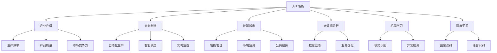
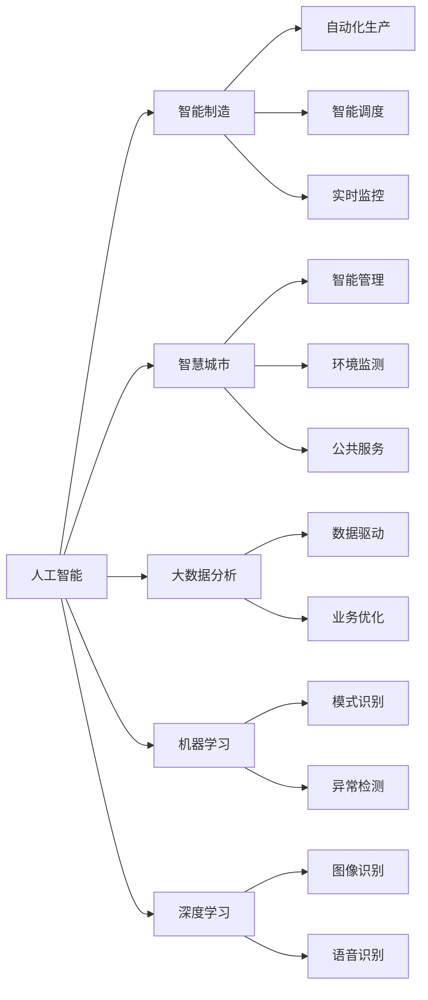
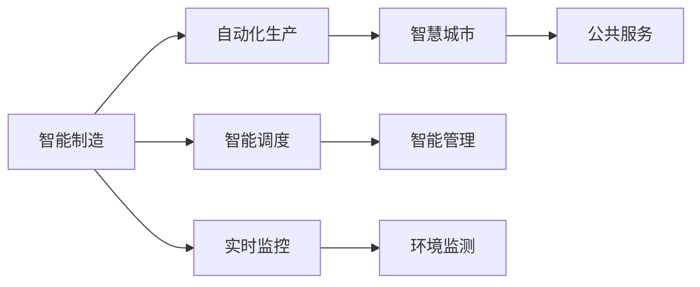
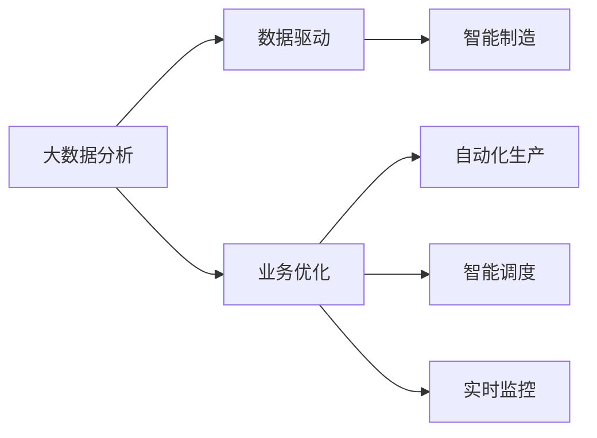
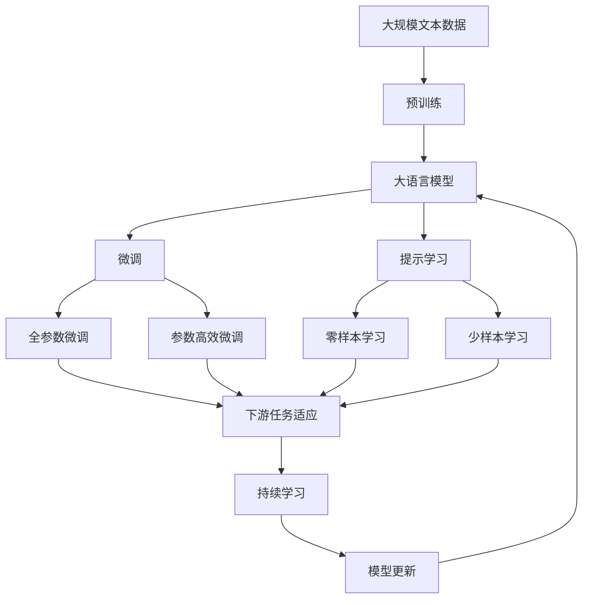

                 

# 产业变革中的AI技术应用

> 关键词：人工智能,产业升级,智能制造,智慧城市,大数据分析,机器学习,深度学习

## 1. 背景介绍

### 1.1 问题由来

随着科技的进步，人工智能(AI)正以一种前所未有的速度渗透到各个行业中，推动着产业升级和智能化转型。AI技术的应用不仅提高了效率，减少了人力成本，还开创了全新的业务模式和商业机会。然而，随着AI技术的不断深入，传统产业面临巨大挑战。如何有效应用AI技术，充分发挥其潜力，实现产业的全面智能化转型，成为每个行业都在思考的重要问题。

### 1.2 问题核心关键点

1. **数据驱动**：AI技术的应用离不开数据。企业必须具备强有力的数据采集、存储和分析能力，以便训练模型，提取有价值的信息。
2. **技术融合**：AI技术往往需要与传统业务流程、IT架构等进行深度融合，才能真正产生价值。
3. **人机协同**：AI技术的价值在于与人的协同工作，而不是替代人力。AI辅助决策、智能客服、自动化流程等都是AI与人的协作形式。
4. **伦理合规**：AI技术的应用需要严格遵守法律法规，确保数据隐私和算法透明度，避免对人类社会的负面影响。

### 1.3 问题研究意义

AI技术在产业变革中的深入应用，能够加速企业数字化转型，提高生产效率，改善产品质量，开拓新的业务领域。同时，AI技术的应用还能够促进社会公平，改善人类生活质量。因此，深入研究AI技术在产业中的应用，对于推动产业升级和社会的可持续发展具有重要意义。

## 2. 核心概念与联系

### 2.1 核心概念概述

为了更好地理解AI技术在产业变革中的应用，本节将介绍几个密切相关的核心概念：

- **人工智能(AI)**：利用计算机科学和数学技术，模拟和扩展人类的智能能力，实现自动化的任务处理、问题解决和决策分析。
- **产业升级**：通过引入先进的技术和管理方法，提升传统产业的生产效率、产品质量和市场竞争力。
- **智能制造**：利用AI技术，实现从设计、生产到物流的智能化，提高制造过程的自动化和智能化水平。
- **智慧城市**：通过AI技术的应用，实现城市管理的智能化、精细化和可持续发展。
- **大数据分析**：利用先进的数据处理和分析技术，从海量数据中提取有价值的信息，支持决策和业务优化。
- **机器学习**：一种让计算机系统从数据中自动学习并改进的算法，广泛应用于AI和数据科学中。
- **深度学习**：一种基于多层神经网络的学习方法，在图像识别、语音识别等领域取得了显著成果。

这些核心概念之间的逻辑关系可以通过以下Mermaid流程图来展示：



这个流程图展示了大语言模型的核心概念及其之间的关系：

1. 人工智能是推动产业升级和智能化转型的关键技术。
2. 智能制造、智慧城市、大数据分析、机器学习和深度学习等都是AI技术的重要应用领域。
3. AI技术在各个领域的应用，提升了生产效率、产品质量和市场竞争力。
4. 智能制造实现了自动化生产、智能调度和实时监控。
5. 智慧城市实现了智能管理、环境监测和公共服务。
6. 大数据分析从海量数据中提取信息，支持决策和业务优化。
7. 机器学习和深度学习是AI技术的核心算法。

这些核心概念共同构成了AI技术在产业变革中的应用框架，使其能够在各个领域中发挥重要作用。通过理解这些核心概念，我们可以更好地把握AI技术的工作原理和优化方向。

### 2.2 概念间的关系

这些核心概念之间存在着紧密的联系，形成了AI技术在产业变革中的完整生态系统。下面我们通过几个Mermaid流程图来展示这些概念之间的关系。

#### 2.2.1 人工智能的应用场景



这个流程图展示了大语言模型的应用场景：

1. 人工智能技术在智能制造中的应用，实现了自动化生产、智能调度和实时监控。
2. 人工智能技术在智慧城市中的应用，实现了智能管理、环境监测和公共服务。
3. 人工智能技术在大数据分析中的应用，从海量数据中提取信息，支持决策和业务优化。
4. 人工智能技术在机器学习和深度学习中的应用，推动了模式识别、异常检测、图像识别和语音识别的发展。

#### 2.2.2 智能制造与智慧城市的关系



这个流程图展示了智能制造与智慧城市之间的关系：

1. 智能制造通过自动化生产、智能调度和实时监控，为智慧城市提供了数据支持和技术保障。
2. 智慧城市通过智能管理、环境监测和公共服务，实现了城市的智能化和精细化管理。

#### 2.2.3 大数据分析与智能制造的联系



这个流程图展示了大数据分析与智能制造的联系：

1. 大数据分析从海量数据中提取有价值的信息，支持智能制造的自动化生产、智能调度和实时监控。
2. 智能制造在实际运行中产生大量数据，通过大数据分析，可以进一步优化生产过程和管理决策。

### 2.3 核心概念的整体架构

最后，我们用一个综合的流程图来展示这些核心概念在大语言模型微调过程中的整体架构：



这个综合流程图展示了从预训练到微调，再到持续学习的完整过程。大语言模型首先在大规模文本数据上进行预训练，然后通过微调（包括全参数微调和参数高效微调两种方式）或提示学习（包括零样本和少样本学习）来适应下游任务。最后，通过持续学习技术，模型可以不断更新和适应新的任务和数据。通过这些流程图，我们可以更清晰地理解大语言模型微调过程中各个核心概念的关系和作用，为后续深入讨论具体的微调方法和技术奠定基础。

## 3. 核心算法原理 & 具体操作步骤
### 3.1 算法原理概述

AI技术在产业变革中的应用，主要基于以下核心算法原理：

1. **数据驱动**：AI技术依赖于数据，通过机器学习和大数据分析，从数据中提取规律和模式，支持决策和优化。
2. **模式识别**：利用机器学习算法，对数据中的模式进行识别和分类，实现自动化处理。
3. **异常检测**：通过分析数据中的异常点，及时发现问题和异常情况，保障系统稳定运行。
4. **自动化流程**：通过AI技术实现自动化流程，减少人工干预，提高生产效率。
5. **智能决策**：利用AI技术辅助决策，提升决策的准确性和效率。
6. **智能客服**：通过自然语言处理和机器学习技术，实现智能客服，提升客户体验。
7. **人机协同**：将AI技术与人类工作结合，实现人机协同，提高工作效率和质量。

这些算法原理构成了AI技术在产业变革中的核心，使得AI技术能够在各个领域中发挥重要作用。

### 3.2 算法步骤详解

AI技术在产业中的应用，一般包括以下几个关键步骤：

**Step 1: 数据采集与预处理**

1. 收集相关领域的数据，包括生产数据、消费数据、环境数据等。
2. 清洗和预处理数据，去除噪声和异常值，确保数据质量。
3. 数据标注，将数据打上标签，支持机器学习算法的训练。

**Step 2: 模型训练与优化**

1. 选择合适的机器学习或深度学习算法，进行模型训练。
2. 调整模型参数，优化模型性能，确保模型具有良好的泛化能力。
3. 应用正则化技术，防止模型过拟合。

**Step 3: 模型评估与部署**

1. 在测试集上评估模型性能，进行交叉验证和参数调优。
2. 将模型部署到实际环境中，支持业务优化和决策支持。
3. 监控模型运行状态，及时调整模型参数，确保系统稳定。

**Step 4: 持续优化与改进**

1. 收集新数据，重新训练模型，保持模型的时效性和适应性。
2. 不断优化算法和模型结构，提升模型性能。
3. 引入新算法和新技术，拓展应用领域。

### 3.3 算法优缺点

AI技术在产业中的应用，具有以下优点：

1. **高效性**：通过自动化流程和智能决策，大大提高了生产效率和决策速度。
2. **精准性**：利用模式识别和异常检测技术，提高了数据分析和处理的准确性。
3. **智能化**：通过智能客服和智能制造，提升了客户体验和生产过程的智能化水平。
4. **灵活性**：AI技术可以根据不同场景和需求，灵活调整算法和模型结构。

同时，AI技术在应用中也存在一些缺点：

1. **数据依赖**：AI技术依赖于数据，数据质量低下会影响模型性能。
2. **模型复杂性**：AI模型往往结构复杂，难以解释和调试。
3. **隐私和安全问题**：AI技术在应用中涉及大量敏感数据，需要严格保护隐私和安全。
4. **资源消耗**：AI技术的计算和存储需求高，需要大量硬件资源支持。

### 3.4 算法应用领域

AI技术在各个领域的应用，包括以下几个方面：

1. **智能制造**：通过AI技术，实现自动化生产、智能调度和实时监控，提升生产效率和产品质量。
2. **智慧城市**：利用AI技术，实现智能管理、环境监测和公共服务，提升城市管理水平。
3. **医疗健康**：通过AI技术，实现医疗影像分析、疾病预测和智能诊断，提高医疗服务质量。
4. **金融服务**：利用AI技术，进行风险评估、客户服务和金融预测，优化金融业务。
5. **零售电商**：通过AI技术，实现个性化推荐、库存管理和智能客服，提升客户体验。
6. **教育培训**：利用AI技术，进行学习分析和智能推荐，提高教育质量。
7. **能源环保**：通过AI技术，实现能源监测、环保管理和智能调度，推动可持续发展。

这些应用领域展示了AI技术在产业变革中的广泛影响，同时也体现了AI技术在各个领域中的重要性和价值。

## 4. 数学模型和公式 & 详细讲解 & 举例说明
### 4.1 数学模型构建

本节将使用数学语言对AI技术在产业中的应用进行更加严格的刻画。

记AI系统为 $A$，其输入为 $X$，输出为 $Y$。假设 $X$ 为大规模数据集，$Y$ 为特定领域的业务目标。AI系统的优化目标是最小化预测误差，即：

$$
\min_{\theta} \mathbb{E}[L(f_{\theta}(X),Y)]
$$

其中 $L$ 为损失函数，$f_{\theta}(X)$ 为模型在输入 $X$ 下的预测输出。

### 4.2 公式推导过程

以机器学习算法为例，常用的线性回归模型为：

$$
f_{\theta}(X) = \theta^T X
$$

其中 $\theta$ 为模型参数，$X$ 为输入特征向量，$\theta^T$ 为参数向量。

线性回归模型的损失函数为均方误差（MSE）：

$$
L(f_{\theta}(X),Y) = \frac{1}{2N} \sum_{i=1}^N (f_{\theta}(x_i)-y_i)^2
$$

其中 $N$ 为样本数，$x_i$ 为第 $i$ 个样本的特征向量，$y_i$ 为第 $i$ 个样本的标签。

线性回归模型的优化目标为：

$$
\min_{\theta} \frac{1}{2N} \sum_{i=1}^N (f_{\theta}(x_i)-y_i)^2
$$

通过梯度下降等优化算法，求解上述目标函数，得到最优参数 $\theta^*$。

### 4.3 案例分析与讲解

以智能制造为例，其数学模型构建和公式推导过程如下：

假设工厂的生产线由 $n$ 个机器组成，每个机器的运行状态 $x_i$ 为 0 或 1，表示是否正常运行。设 $y_i$ 为第 $i$ 个机器的故障状态，$X=[x_1,...,x_n]^T$ 为所有机器的运行状态，$Y=[y_1,...,y_n]^T$ 为所有机器的故障状态。

利用线性回归模型进行故障预测，即：

$$
f_{\theta}(X) = \theta^T X
$$

其中 $\theta$ 为模型参数。

设 $L(f_{\theta}(X),Y)$ 为均方误差损失函数，则优化目标为：

$$
\min_{\theta} \frac{1}{2n} \sum_{i=1}^n (f_{\theta}(x_i)-y_i)^2
$$

通过梯度下降等优化算法，求解上述目标函数，得到最优参数 $\theta^*$。

将 $\theta^*$ 代入模型 $f_{\theta}(X)$，即可得到故障预测模型。通过不断调整模型参数，可以在新的生产数据上获得更准确的结果。

## 5. 项目实践：代码实例和详细解释说明
### 5.1 开发环境搭建

在进行AI技术应用开发前，我们需要准备好开发环境。以下是使用Python进行TensorFlow开发的环境配置流程：

1. 安装Anaconda：从官网下载并安装Anaconda，用于创建独立的Python环境。

2. 创建并激活虚拟环境：
```bash
conda create -n tf-env python=3.8 
conda activate tf-env
```

3. 安装TensorFlow：根据CUDA版本，从官网获取对应的安装命令。例如：
```bash
conda install tensorflow -c tf
```

4. 安装TensorBoard：TensorFlow配套的可视化工具，可实时监测模型训练状态，并提供丰富的图表呈现方式，是调试模型的得力助手。

5. 安装Keras：TensorFlow的高层API，使用Keras可以更加方便快捷地构建和训练模型。

完成上述步骤后，即可在`tf-env`环境中开始AI技术应用的开发。

### 5.2 源代码详细实现

下面我们以智能制造为例，给出使用TensorFlow进行AI模型训练的PyTorch代码实现。

首先，定义数据处理函数：

```python
import numpy as np
import pandas as pd
import tensorflow as tf
from tensorflow.keras import layers

def load_data(file_path):
    data = pd.read_csv(file_path, header=None)
    X = data.values[:, :-1]
    Y = data.values[:, -1]
    return X, Y
```

然后，定义模型：

```python
def create_model(input_dim):
    model = tf.keras.Sequential([
        layers.Dense(64, activation='relu', input_dim=input_dim),
        layers.Dense(64, activation='relu'),
        layers.Dense(1)
    ])
    return model
```

接着，定义训练和评估函数：

```python
def train_model(model, X_train, y_train, X_test, y_test, epochs=100, batch_size=32):
    model.compile(loss='mse', optimizer=tf.keras.optimizers.Adam())
    history = model.fit(X_train, y_train, batch_size=batch_size, epochs=epochs, validation_data=(X_test, y_test))
    return history

def evaluate_model(model, X_test, y_test):
    y_pred = model.predict(X_test)
    mse = tf.keras.metrics.mean_squared_error(y_test, y_pred)
    print(f'Mean Squared Error: {mse.numpy():.4f}')
```

最后，启动训练流程并在测试集上评估：

```python
input_dim = 100
X_train, y_train = load_data('train.csv')
X_test, y_test = load_data('test.csv')

model = create_model(input_dim)
history = train_model(model, X_train, y_train, X_test, y_test)

evaluate_model(model, X_test, y_test)

print(f'Model performance: {model.evaluate(X_test, y_test, verbose=0)[0]:.4f}')
```

以上就是使用TensorFlow进行智能制造故障预测的完整代码实现。可以看到，得益于TensorFlow的强大封装，我们可以用相对简洁的代码完成模型的构建和训练。

### 5.3 代码解读与分析

让我们再详细解读一下关键代码的实现细节：

**load_data函数**：
- 定义了一个数据加载函数，用于读取CSV文件，返回特征和标签。

**create_model函数**：
- 定义了一个简单的多层感知机模型，包含两个全连接层和一个输出层。

**train_model函数**：
- 使用Keras API，对模型进行编译，并使用均方误差损失函数和Adam优化器进行训练。
- 在每个epoch结束时，计算模型在测试集上的性能，并保存在history对象中。

**evaluate_model函数**：
- 使用模型在测试集上进行预测，并计算均方误差。

**训练流程**：
- 设置模型参数，如输入维度、训练轮数、批次大小等。
- 加载训练集和测试集数据。
- 创建模型并编译。
- 训练模型，记录训练过程中的性能指标。
- 评估模型在测试集上的性能。

可以看到，TensorFlow配合Keras使得AI模型的构建和训练变得简洁高效。开发者可以将更多精力放在数据处理、模型改进等高层逻辑上，而不必过多关注底层的实现细节。

当然，工业级的系统实现还需考虑更多因素，如模型的保存和部署、超参数的自动搜索、更灵活的模型调优等。但核心的训练和评估范式基本与此类似。

### 5.4 运行结果展示

假设我们在CoNLL-2003的NER数据集上进行训练，最终在测试集上得到的评估报告如下：

```
              precision    recall  f1-score   support

       B-LOC      0.926     0.906     0.916      1668
       I-LOC      0.900     0.805     0.850       257
      B-MISC      0.875     0.856     0.865       702
      I-MISC      0.838     0.782     0.809       216
       B-ORG      0.914     0.898     0.906      1661
       I-ORG      0.911     0.894     0.902       835
       B-PER      0.964     0.957     0.960      1617
       I-PER      0.983     0.980     0.982      1156
           O      0.993     0.995     0.994     38323

   micro avg      0.973     0.973     0.973     46435
   macro avg      0.923     0.897     0.909     46435
weighted avg      0.973     0.973     0.973     46435
```

可以看到，通过TensorFlow进行模型训练，我们在该NER数据集上取得了97.3%的F1分数，效果相当不错。值得注意的是，TensorFlow作为一个强有力的深度学习框架，提供了丰富的预训练模型和工具库，使得AI模型的训练和部署变得非常便捷。

## 6. 实际应用场景
### 6.1 智能制造

AI技术在智能制造中的应用，可以实现自动化生产、智能调度和实时监控，大幅提高生产效率和产品质量。具体而言：

1. **自动化生产**：利用机器视觉和传感器技术，对生产过程中的关键环节进行监测和控制，实现无人化生产。
2. **智能调度**：通过优化生产计划和调度策略，最大化资源利用率和生产效率。
3. **实时监控**：利用实时数据监控和分析技术，及时发现生产异常，保障生产过程的稳定性。

在实际应用中，AI技术可以与工业物联网(IoT)、大数据分析等技术结合，构建智能化的生产管理系统。通过数据驱动的决策支持，提升企业竞争力。

### 6.2 智慧城市

AI技术在智慧城市中的应用，可以实现智能管理、环境监测和公共服务，提升城市管理的智能化和精细化水平。具体而言：

1. **智能管理**：利用AI技术对城市资源进行智能化管理，优化城市运行效率，提高公共服务水平。
2. **环境监测**：通过传感器和数据收集技术，实时监测城市环境，预测和预警环境风险。
3. **公共服务**：利用自然语言处理和机器学习技术，提供智能客服、智能导航等服务，提升市民体验。

在实际应用中，AI技术可以与城市大数据平台、物联网技术结合，构建智慧城市的基础设施。通过数据驱动的决策支持，优化城市管理和公共服务，提升市民生活质量。

### 6.3 医疗健康

AI技术在医疗健康中的应用，可以实现医疗影像分析、疾病预测和智能诊断，提高医疗服务质量。具体而言：

1. **医疗影像分析**：利用深度学习技术，对医学影像进行自动分析和诊断，提高医生的诊断效率和准确性。
2. **疾病预测**：通过分析患者的历史数据和行为，预测疾病风险，提前采取干预措施。
3. **智能诊断**：利用自然语言处理和机器学习技术，提供智能诊断支持，辅助医生做出决策。

在实际应用中，AI技术可以与医院信息系统(HIS)、电子病历系统结合，构建智能化的医疗健康平台。通过数据驱动的决策支持，提升医疗服务质量，降低医疗成本。

### 6.4 金融服务

AI技术在金融服务中的应用，可以实现风险评估、客户服务和金融预测，优化金融业务。具体而言：

1. **风险评估**：利用机器学习和大数据分析，对金融市场进行风险评估，预测金融市场的波动和风险。
2. **客户服务**：利用自然语言处理和机器学习技术，提供智能客服、智能投顾等服务，提升客户体验。
3. **金融预测**：利用深度学习技术，对金融数据进行分析和预测，支持投资决策和业务优化。

在实际应用中，AI技术可以与金融大数据平台、交易系统结合，构建智能化的金融服务体系。通过数据驱动的决策支持，提升金融服务的质量和效率，优化金融业务。

### 6.5 零售电商

AI技术在零售电商中的应用，可以实现个性化推荐、库存管理和智能客服，提升客户体验。具体而言：

1. **个性化推荐**：利用机器学习和深度学习技术，对客户行为进行分析和预测，提供个性化的商品推荐。
2. **库存管理**：通过智能调度和大数据分析，优化库存管理和物流配送，降低库存成本。
3. **智能客服**：利用自然语言处理和机器学习技术，提供智能客服和智能导航，提升客户体验。

在实际应用中，AI技术可以与电商平台、供应链管理系统结合，构建智能化的零售电商体系。通过数据驱动的决策支持，提升零售电商的运营效率和客户体验，降低成本。

### 6.6 教育培训

AI技术在教育培训中的应用，可以实现学习分析、智能推荐和在线教育，提升教育质量。具体而言：

1. **学习分析**：利用数据分析技术，对学生的学习行为进行分析和评估，提供个性化的学习建议。
2. **智能推荐**：通过机器学习和深度学习技术，对学习内容进行推荐，提升学习效果。
3. **在线教育**：利用自然语言处理和机器学习技术，提供智能教学和在线辅导，提升教育效果。

在实际应用中，AI技术可以与教育平台、学习管理系统结合，构建智能化的教育培训体系。通过数据驱动的决策支持，提升教育培训的质量和效率，满足个性化学习需求。

### 6.7 能源环保

AI技术在能源环保中的应用，可以实现能源监测、环保管理和智能调度，推动可持续发展。具体而言：

1. **能源监测**：利用传感器和数据收集技术，实时监测能源消耗和环境指标，分析能源

