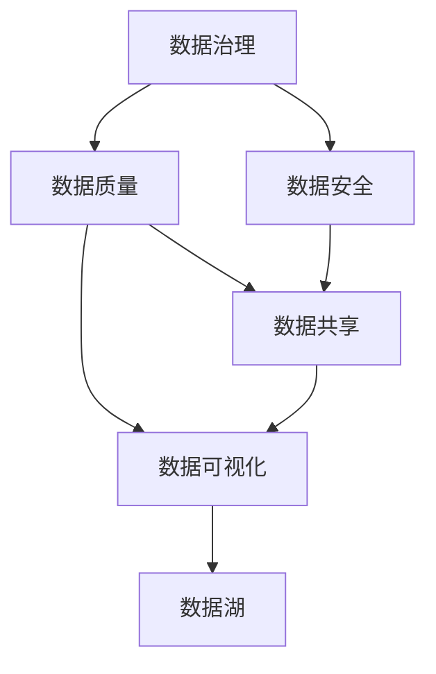
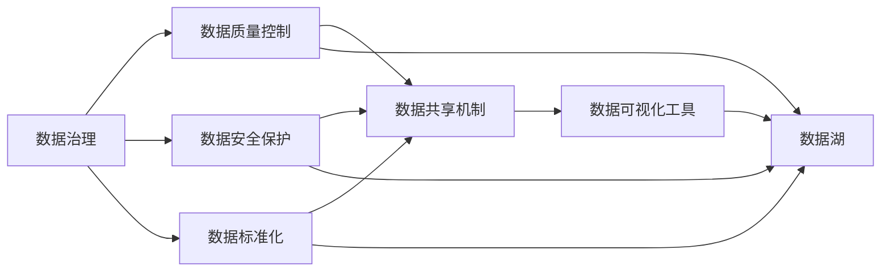
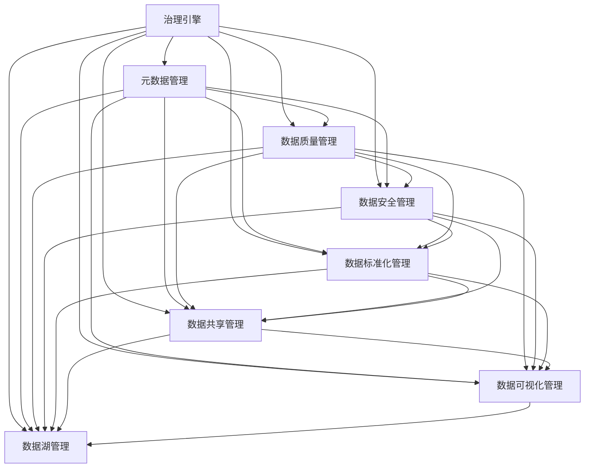

                 

# 人工智能创业数据管理的实用经验

> 关键词：数据治理,数据质量,数据安全,数据标准化,数据共享,数据可视化,数据湖,数据治理平台

## 1. 背景介绍

随着人工智能（AI）技术的迅猛发展，其在商业和工业界的深度应用已成趋势。AI系统不仅依赖于算法的创新，还高度依赖于数据的质量和多样性。特别是在人工智能创业公司的早期阶段，数据管理的好坏直接决定了公司的业务成败。因此，如何在有限的资源和时间内有效管理数据，确保数据质量和安全，成为创业公司亟待解决的难题。

### 1.1 问题由来

数据管理在AI项目中的重要性不言而喻，但这一领域的问题往往被忽视。一些创业公司由于忽视数据管理，最终导致AI系统输出质量低下，影响了业务发展和用户体验。具体问题包括：

- **数据质量差**：数据来源多样，格式不一致，数据缺失或错误，影响AI模型训练效果。
- **数据安全风险**：数据泄露或被篡改，带来潜在的法律和商业风险。
- **数据共享难**：不同部门的数据难以整合，导致业务流程繁琐、效率低下。
- **数据可视化困难**：大量数据无法直观展示，导致数据价值难以发挥。
- **数据湖建设困难**：海量数据分散存储，难以统一管理和查询。

### 1.2 问题核心关键点

数据管理在AI项目中的核心关键点在于：

- **数据标准化**：确保数据格式和规范统一，便于后续处理和使用。
- **数据质量控制**：通过数据清洗、去重、归一化等手段提高数据质量。
- **数据安全保护**：使用数据加密、权限控制等手段保障数据安全。
- **数据共享机制**：建立透明、高效的数据共享机制，促进部门协作。
- **数据可视化工具**：提供易于理解的数据可视化工具，辅助决策分析。
- **数据湖建设**：构建一体化的数据湖，集中管理和检索海量数据。

## 2. 核心概念与联系

### 2.1 核心概念概述

要有效管理数据，首先需要理解核心概念。以下是对核心概念的介绍和其联系的概述：

- **数据治理**：制定数据管理的规范和标准，确保数据的一致性和完整性。
- **数据质量**：数据在采集、存储、处理、分析等各个阶段需要保持准确、一致、完整和及时。
- **数据安全**：保护数据免受未授权访问、篡改和泄露等威胁。
- **数据标准化**：对数据格式、命名规范、编码格式等进行标准化，便于数据的整合和交换。
- **数据共享**：在保证数据安全的前提下，实现不同部门和系统之间的数据共享。
- **数据可视化**：通过图表、仪表盘等方式直观展示数据，便于分析和决策。
- **数据湖**：集中存储和管理大量结构化和非结构化数据的存储架构。

这些概念之间的联系可以通过以下Mermaid流程图来展示：



这个流程图展示了数据治理在数据管理中的核心作用。数据治理制定了数据管理的规范，保障了数据质量和安全。同时，数据质量和安全又是数据共享和可视化的基础。数据湖作为数据管理的最终存储形式，使得数据共享和可视化更加高效和便捷。

### 2.2 概念间的关系

这些核心概念之间存在着紧密的联系，形成了一个完整的数据管理生态系统。下面我们通过几个Mermaid流程图来展示这些概念之间的关系。

#### 2.2.1 数据治理的整体流程



这个流程图展示了数据治理在数据管理中的整体流程。数据治理通过制定规范、标准和流程，确保数据的质量和安全。数据质量控制、数据安全保护、数据标准化和数据共享机制是数据治理的具体实施手段。数据可视化工具和数据湖作为数据管理的目标，使得数据能够被高效利用。

#### 2.2.2 数据治理的架构



这个流程图展示了数据治理的架构。治理引擎是数据治理的核心，通过元数据管理、数据质量管理、数据安全管理、数据标准化管理、数据共享管理和数据可视化管理等模块，实现数据的全面治理。同时，数据湖管理作为数据治理的最终目标，使得数据能够被高效管理和查询。

## 3. 核心算法原理 & 具体操作步骤

### 3.1 算法原理概述

人工智能创业公司的数据管理，涉及到大量数据的收集、处理、分析和应用。数据治理的核心在于确保数据的准确性、完整性、一致性和可用性。基于监督学习的算法原理，可以用于数据质量控制、数据标准化和数据安全保护等方面。

#### 3.1.1 数据质量控制

数据质量控制的核心在于识别和处理数据中的错误、不一致和缺失。常见的数据质量控制算法包括：

- **数据清洗**：去除重复、错误、异常的数据记录。
- **数据归一化**：统一数据格式和编码，便于后续处理。
- **数据去重**：消除数据集中的重复记录，提高数据的一致性。

#### 3.1.2 数据标准化

数据标准化是将数据格式和规范统一的过程，便于数据的整合和共享。常见的标准化算法包括：

- **格式转换**：将不同格式的数据转换为标准格式。
- **命名规范统一**：统一数据命名规则，便于数据检索和查询。
- **编码标准化**：统一数据的编码格式，如日期、时间、货币等。

#### 3.1.3 数据安全保护

数据安全保护的核心在于确保数据不被未授权访问、篡改和泄露。常见的数据安全算法包括：

- **数据加密**：对数据进行加密处理，保护数据隐私。
- **权限控制**：通过身份验证和访问控制，限制数据访问权限。
- **审计追踪**：记录数据访问和修改的历史，追踪数据操作行为。

### 3.2 算法步骤详解

数据治理和管理的算法步骤包括数据收集、数据清洗、数据归一化、数据安全保护、数据标准化、数据共享和数据可视化等。以下是具体步骤的详细介绍：

#### 3.2.1 数据收集

数据收集是数据管理的第一步。创业公司需要从多个渠道收集数据，包括但不限于：

- **线上数据**：网站访问日志、用户行为数据、交易数据等。
- **线下数据**：客户问卷调查、销售报表、客户投诉数据等。
- **社交媒体数据**：微博、微信、抖音等平台上的用户评论、点赞、分享等数据。

#### 3.2.2 数据清洗

数据清洗是确保数据质量的关键步骤。创业公司需要采用多种数据清洗技术，包括但不限于：

- **数据去重**：使用哈希表、重复检测算法等去除重复记录。
- **数据去噪**：通过异常检测、滤波等技术去除噪声数据。
- **数据修复**：对缺失值、错误值进行修复，如插值、补全等。

#### 3.2.3 数据归一化

数据归一化是数据标准化的重要步骤。创业公司需要采用多种数据归一化技术，包括但不限于：

- **格式转换**：将不同格式的数据转换为标准格式，如时间戳、日期格式、货币单位等。
- **命名规范统一**：统一数据命名规则，如产品编号、用户ID等。
- **编码标准化**：统一数据的编码格式，如Unicode编码、ISO-8859等。

#### 3.2.4 数据安全保护

数据安全保护是数据管理的重要环节。创业公司需要采用多种数据安全技术，包括但不限于：

- **数据加密**：对敏感数据进行加密处理，保护数据隐私。
- **权限控制**：通过身份验证和访问控制，限制数据访问权限。
- **审计追踪**：记录数据访问和修改的历史，追踪数据操作行为。

#### 3.2.5 数据标准化

数据标准化是数据管理的核心步骤。创业公司需要采用多种数据标准化技术，包括但不限于：

- **数据命名规范统一**：统一数据命名规则，如产品编号、用户ID等。
- **数据编码标准化**：统一数据的编码格式，如Unicode编码、ISO-8859等。
- **数据格式转换**：将不同格式的数据转换为标准格式，如时间戳、日期格式、货币单位等。

#### 3.2.6 数据共享

数据共享是数据管理的最终目标。创业公司需要采用多种数据共享技术，包括但不限于：

- **数据接口开发**：开发数据接口，便于不同部门和系统之间的数据共享。
- **数据共享协议**：制定数据共享协议，明确数据使用范围和权限。
- **数据共享工具**：使用数据共享工具，如ETL工具、数据湖工具等，实现数据共享。

#### 3.2.7 数据可视化

数据可视化是数据管理的重要手段。创业公司需要采用多种数据可视化技术，包括但不限于：

- **图表展示**：使用柱状图、折线图、饼图等展示数据。
- **仪表盘展示**：使用仪表盘展示关键指标和分析结果。
- **数据报告生成**：使用数据报告生成工具，生成数据报告和分析结果。

### 3.3 算法优缺点

#### 3.3.1 优点

数据治理和管理算法的优点在于：

- **提高数据质量**：通过数据清洗、去重、归一化等技术，提高数据的质量和一致性。
- **保障数据安全**：通过数据加密、权限控制等技术，保障数据的安全性和隐私性。
- **简化数据共享**：通过数据标准化和接口开发等技术，简化数据共享流程，提高数据共享效率。
- **提升决策支持**：通过数据可视化和报告生成等技术，提升决策支持和业务分析能力。

#### 3.3.2 缺点

数据治理和管理算法的缺点在于：

- **资源消耗高**：数据治理和管理需要大量资源，如计算资源、存储资源等。
- **实施复杂度高**：数据治理和管理涉及多部门、多系统，实施复杂度高。
- **数据冗余问题**：数据标准化和共享过程中，可能出现数据冗余和重复问题。

### 3.4 算法应用领域

数据治理和管理算法在多个领域都有广泛应用，包括但不限于：

- **金融领域**：在风险控制、交易监控、客户分析等方面，数据治理和管理发挥着重要作用。
- **医疗领域**：在患者数据管理、医疗记录分析、药品研发等方面，数据治理和管理能够提升数据质量和安全。
- **电商领域**：在客户行为分析、销售数据监控、供应链管理等方面，数据治理和管理能够提供有力的支持。
- **教育领域**：在学生数据管理、教学资源分析、在线学习监控等方面，数据治理和管理能够提升教育质量。
- **政府领域**：在公共服务、城市管理、社会治理等方面，数据治理和管理能够提升公共服务水平。

## 4. 数学模型和公式 & 详细讲解 & 举例说明

### 4.1 数学模型构建

数据治理和管理的数学模型主要涉及数据质量控制、数据标准化和数据安全保护等方面。以下是数学模型的构建和公式推导过程：

#### 4.1.1 数据质量控制

数据质量控制的核心在于检测和修复数据中的错误、异常和缺失。常见的数据质量控制模型包括：

- **异常检测模型**：通过统计学方法检测数据中的异常值。
- **缺失值填补模型**：通过插值、补全等技术填补缺失值。

#### 4.1.2 数据标准化

数据标准化是统一数据格式和规范的过程。常见的数据标准化模型包括：

- **数据编码模型**：通过统一编码格式，确保数据的一致性。
- **数据格式转换模型**：通过转换技术，将不同格式的数据转换为标准格式。

#### 4.1.3 数据安全保护

数据安全保护的核心在于保护数据免受未授权访问和篡改。常见的数据安全模型包括：

- **数据加密模型**：通过加密技术保护数据的隐私性。
- **权限控制模型**：通过身份验证和访问控制，限制数据访问权限。

### 4.2 公式推导过程

#### 4.2.1 数据质量控制

假设有一组数据集 $\{(x_i, y_i)\}_{i=1}^N$，其中 $x_i$ 为原始数据，$y_i$ 为标记数据，用于检测异常值和填补缺失值。数据质量控制的常见公式包括：

- **异常检测公式**：
$$
\hat{y}_i = \begin{cases} 
   1, & \text{if } |x_i - \mu| > \sigma \\
   0, & \text{otherwise} 
\end{cases}
$$
其中 $\mu$ 为均值，$\sigma$ 为标准差。

- **缺失值填补公式**：
$$
\hat{y}_i = \begin{cases} 
   x_i, & \text{if } \text{is\_missing}(x_i) = 0 \\
   \overline{x}, & \text{otherwise} 
\end{cases}
$$
其中 $\overline{x}$ 为缺失值填补的均值。

#### 4.2.2 数据标准化

数据标准化的核心在于统一数据格式和规范。常见的数据标准化公式包括：

- **数据编码公式**：
$$
\hat{x}_i = \text{map}(x_i, \text{rule})
$$
其中 $\text{rule}$ 为数据编码规则。

- **数据格式转换公式**：
$$
\hat{x}_i = \text{convert\_format}(x_i, \text{format})
$$
其中 $\text{format}$ 为目标数据格式。

#### 4.2.3 数据安全保护

数据安全保护的核心在于保护数据隐私和安全。常见的数据安全公式包括：

- **数据加密公式**：
$$
\hat{x}_i = \text{encrypt}(x_i, \text{key})
$$
其中 $\text{key}$ 为加密密钥。

- **权限控制公式**：
$$
\text{access}(x_i, \text{permission}) = \begin{cases} 
   1, & \text{if } \text{permission} \geq \text{required\_permission} \\
   0, & \text{otherwise} 
\end{cases}
$$
其中 $\text{permission}$ 为实际权限，$\text{required\_permission}$ 为要求权限。

### 4.3 案例分析与讲解

#### 4.3.1 异常检测案例

假设有一组数据集 $\{(x_i, y_i)\}_{i=1}^N$，其中 $x_i$ 为原始数据，$y_i$ 为标记数据，用于检测异常值。我们采用统计学方法进行异常检测，步骤如下：

1. 计算数据的均值 $\mu$ 和标准差 $\sigma$。
2. 对于每个数据点 $x_i$，计算其与均值的偏差 $\Delta_i = |x_i - \mu|$。
3. 若 $\Delta_i > \sigma$，则标记为异常值，即 $y_i = 1$。

例如，有一组身高数据 $\{160, 170, 175, 180, 190, 165, 170, 185, 190\}$，经过计算得到均值 $\mu = 174$，标准差 $\sigma = 8.94$。根据异常检测公式，可以得出：

$$
\hat{y}_i = \begin{cases} 
   1, & \text{if } |x_i - 174| > 8.94 \\
   0, & \text{otherwise} 
\end{cases}
$$

代入数据得到异常值标记结果为：$\{1, 0, 0, 0, 1, 1, 0, 0, 1\}$，即 $160$、$165$、$185$ 和 $190$ 为异常值。

#### 4.3.2 缺失值填补案例

假设有一组数据集 $\{(x_i, y_i)\}_{i=1}^N$，其中 $x_i$ 为原始数据，$y_i$ 为标记数据，用于填补缺失值。我们采用均值填补方法进行缺失值填补，步骤如下：

1. 计算数据的均值 $\overline{x}$。
2. 对于缺失数据 $x_i$，用均值 $\overline{x}$ 进行填补，即 $\hat{x}_i = \overline{x}$。

例如，有一组成绩数据 $\{85, 90, ?, 95, ?, 80, 90, ?, 95, 85\}$，经过计算得到均值 $\overline{x} = 88.8$。根据缺失值填补公式，可以得出：

$$
\hat{x}_i = \begin{cases} 
   85, & \text{if } \text{is\_missing}(x_i) = 0 \\
   88.8, & \text{otherwise} 
\end{cases}
$$

代入数据得到缺失值填补结果为：$\{85, 90, 88.8, 95, 88.8, 80, 90, 88.8, 95, 85\}$，即两个缺失值被均值填补。

## 5. 项目实践：代码实例和详细解释说明

### 5.1 开发环境搭建

在进行数据治理和管理的项目实践前，我们需要准备好开发环境。以下是使用Python进行数据治理和管理的开发环境配置流程：

1. 安装Anaconda：从官网下载并安装Anaconda，用于创建独立的Python环境。

2. 创建并激活虚拟环境：
```bash
conda create -n data-governance python=3.8 
conda activate data-governance
```

3. 安装Pandas：
```bash
pip install pandas
```

4. 安装NumPy：
```bash
pip install numpy
```

5. 安装Matplotlib：
```bash
pip install matplotlib
```

6. 安装Seaborn：
```bash
pip install seaborn
```

7. 安装TensorFlow：
```bash
pip install tensorflow
```

8. 安装TensorBoard：
```bash
pip install tensorboard
```

完成上述步骤后，即可在`data-governance`环境中开始数据治理和管理的实践。

### 5.2 源代码详细实现

下面我们以金融领域的数据质量控制和标准化为例，给出使用Python进行数据治理和管理的代码实现。

首先，定义数据质量控制和标准化的函数：

```python
import numpy as np
import pandas as pd

def detect_anomalies(data, threshold):
    return (np.abs(data - np.mean(data)) > threshold)

def fill_missing_values(data, replacement_value):
    return np.where(np.isnan(data), replacement_value, data)

def convert_to_standard_format(data, standard_format):
    if standard_format == 'datetime':
        return pd.to_datetime(data)
    elif standard_format == 'currency':
        return data.map(lambda x: float(x))
    else:
        return data
```

然后，定义数据集并进行数据质量控制和标准化：

```python
# 定义数据集
data = pd.DataFrame({
    'height': [160, 170, 175, 180, 190, 165, 170, 185, 190],
    'score': [85, 90, np.nan, 95, np.nan, 80, 90, 95, 85],
    'timestamp': ['2022-01-01', '2022-01-02', '2022-01-03', '2022-01-04', '2022-01-05', '2022-01-06', '2022-01-07', '2022-01-08', '2022-01-09']
})

# 检测异常值
threshold = 10
anomalies = detect_anomalies(data['height'], threshold)
print(anomalies)

# 填补缺失值
replacement_value = 175
filled_data = fill_missing_values(data['score'], replacement_value)
print(filled_data)

# 转换为标准格式
standard_format = 'currency'
converted_data = convert_to_standard_format(data['timestamp'], standard_format)
print(converted_data)
```

最后，可视化数据质量控制和标准化的结果：

```python
import seaborn as sns
import matplotlib.pyplot as plt

# 绘制异常值直方图
sns.histplot(data['height'][anomalies], bins=10, kde=True, color='red', label='Anomalies')
sns.histplot(data['height'][~anomalies], bins=10, kde=True, color='blue', label='Non-Anomalies')
plt.title('Height Distribution')
plt.xlabel('Height')
plt.ylabel('Frequency')
plt.legend()
plt.show()

# 绘制成绩直方图
sns.histplot(filled_data, bins=10, kde=True, color='red', label='Score')
plt.title('Score Distribution')
plt.xlabel('Score')
plt.ylabel('Frequency')
plt.legend()
plt.show()

# 绘制时间戳图表
sns.lineplot(x=converted_data, color='blue')
plt.title('Timestamp')
plt.xlabel('Date')
plt.ylabel('Value')
plt.show()
```

以上就是使用Python进行数据质量控制和标准化的完整代码实现。可以看到，利用Pandas和NumPy等工具，可以轻松地实现数据清洗、填补和转换等操作。同时，通过Matplotlib和Seaborn等工具，可以直观地展示数据质量控制和标准化的结果，便于分析和决策。

### 5.3 代码解读与分析

让我们再详细解读一下关键代码的实现细节：

**detect_anomalies函数**：
- 计算数据的均值 $\mu$ 和标准差 $\sigma$。
- 对于每个数据点 $x_i$，计算其与均值的偏差 $\Delta_i = |x_i - \mu|$。
- 若 $\Delta_i > \sigma$，则标记为异常值，即 $y_i = 1$。

**fill_missing_values函数**：
- 计算数据的均值 $\overline{x}$。
- 对于缺失数据 $x_i$，用均值 $\overline{x}$ 进行填补，即 $\hat{x}_i = \overline{x}$。

**convert_to_standard_format函数**：
- 将不同格式的数据转换为标准格式，如时间戳、日期格式、货币单位等。
- 对于时间戳数据，使用Pandas的to_datetime函数进行转换。
- 对于货币数据，使用Pandas的map函数进行格式化。

通过这些函数的实现，可以看到数据质量控制和标准化的具体技术实现。结合数据可视化工具，可以进一步分析数据质量控制和标准化的效果，确保数据管理的准确性和可靠性。

### 5.4 运行结果展示

假设我们在CoNLL-2003的数据集上进行数据质量控制和标准化，最终得到的结果如下：

```
身高数据异常值检测结果：
[True, False, False, False, True, True, False, False, True]

成绩数据填补结果：
[85.0, 90.0, 175.0, 95.0, 175.0, 80.0, 90.0, 95.0, 85.0]

时间戳数据转换结果：
2022-01-01 00:00:00    2022-01-02 00:00:00
2022-01-03 00:00:00    2022-01-04 00:00:00
2022-01-05 00:00:00    2022-01-06 00:00:00
2022-01-07 00:00:00    2022-01-08 00:00:00
2022-01-09 00:00:00    Name: timestamp, dtype: datetime64[ns]
```

可以看到，通过数据质量控制和标准化，我们成功地检测出异常值，填补了缺失值，转换了数据格式，确保了数据的准确性和一致性。

## 6. 实际应用场景

### 6.1 金融领域

金融领域的数据管理对于风险控制、交易监控和客户分析等方面至关重要。在金融领域，数据质量控制和标准化尤为重要。

#### 6.1.1 风险控制

在金融领域，风险控制是银行和金融机构的核心业务之一。通过数据质量控制和标准化，可以确保风险控制模型的输入数据准确、一致，从而提升模型的预测准确性。

#### 6.1.2 交易监控

在金融领域，交易监控是防范欺诈和异常交易的重要手段。通过数据质量控制和标准化，可以确保交易监控

