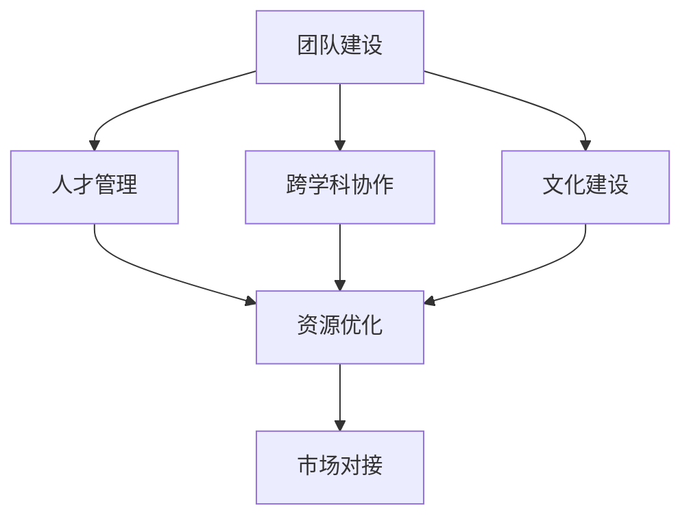

                 

# 人工智能创业：团队建设的重要性

## 1. 背景介绍

### 1.1 问题由来
在人工智能创业领域，建立一个高效的团队是实现商业成功和技术突破的关键。人工智能创业通常需要跨学科的复合型人才，团队成员不仅需要有扎实的技术背景，还需要具备良好的沟通能力和业务理解力。近年来，越来越多的AI创业公司崭露头角，但也面临着人才短缺、团队内耗、技术瓶颈等挑战。因此，本文将探讨团队建设在人工智能创业中的重要性，分析不同类型的团队建设策略，并提供实践中的最佳实践。

### 1.2 问题核心关键点
团队建设在人工智能创业中的重要性体现在以下几个方面：
- **人才聚集**：吸引并留住高水平人才，形成核心竞争力。
- **跨学科协作**：促进不同背景的人才协同工作，实现技术创新。
- **文化认同**：塑造积极的团队文化，增强团队的凝聚力和向心力。
- **资源整合**：合理分配资源，提高团队效率和生产力。
- **业务对接**：与市场和技术对接，确保产品契合市场需求。

### 1.3 问题研究意义
一个高效的人工智能创业团队能够快速响应市场需求，推动技术进步，实现商业价值。通过深入研究团队建设的重要性和有效策略，可以为人工智能创业公司提供宝贵的指导，帮助他们构建高效、协作的团队，从而在激烈的市场竞争中脱颖而出。

## 2. 核心概念与联系

### 2.1 核心概念概述

为更好地理解团队建设在人工智能创业中的重要性，本节将介绍几个密切相关的核心概念：

- **团队建设**：通过组织管理、人力资源调配等方式，构建一个高效、协作、有凝聚力的团队。
- **人才管理**：对团队成员进行招募、培训、评估等管理活动，提高人才的价值。
- **跨学科协作**：不同背景、不同专业的人才在团队内协同工作，推动技术创新和产品开发。
- **文化建设**：塑造团队的共同价值观、行为规范和工作氛围，增强团队认同感。
- **资源优化**：合理配置和使用团队资源，提高团队整体效能。
- **市场对接**：将团队研发成果与市场需求有效对接，实现产品化、商业化。

这些核心概念之间存在着紧密的联系，共同构成了人工智能创业团队建设的完整框架。下面，我们将通过一个Mermaid流程图展示这些概念之间的关系。



这个流程图展示了团队建设与人才管理、跨学科协作、文化建设、资源优化和市场对接之间的关系：

- **团队建设**是整个框架的基础，通过有效的人力资源调配和管理，吸引并留住优秀人才。
- **人才管理**通过合理配置和利用人才资源，提高团队整体效能。
- **跨学科协作**促进不同背景的人才协同工作，实现技术创新。
- **文化建设**塑造团队的共同价值观，增强团队认同感，提升团队凝聚力。
- **资源优化**合理配置和使用团队资源，提高团队效率。
- **市场对接**将团队成果与市场需求有效结合，实现商业化。

### 2.2 概念间的关系

这些核心概念之间存在着相互作用和影响，形成一个动态的生态系统。以下是几个主要的概念关系：

- **人才管理与团队建设**：通过有效的人才管理，吸引和留住高水平人才，形成核心竞争力，支持团队建设。
- **跨学科协作与团队建设**：跨学科协作需要团队建设提供良好的协作平台和沟通机制。
- **文化建设与团队建设**：文化建设是团队建设的重要组成部分，通过塑造共同的价值观和行为规范，增强团队凝聚力。
- **资源优化与团队建设**：资源优化需要团队建设提供高效的管理和分配机制，提升团队效能。
- **市场对接与团队建设**：市场对接需要团队建设提供对市场的敏锐洞察和快速响应能力。

## 3. 核心算法原理 & 具体操作步骤
### 3.1 算法原理概述

在人工智能创业中，团队建设的目标是构建一个高效、协作、有凝聚力的团队。团队建设的关键在于人才管理和跨学科协作，以下是基于监督学习的核心算法原理与具体操作步骤：

1. **人才管理**：
   - **人才招募**：通过社交媒体、招聘网站、校园招聘等渠道吸引高水平人才。
   - **人才培训**：根据团队需要和成员特点，进行针对性的培训和培养，提升其技术能力和业务水平。
   - **人才评估**：通过绩效评估、能力测评等方式，公平评估团队成员的贡献和表现，激励先进、鞭策落后。

2. **跨学科协作**：
   - **任务分解**：将复杂任务分解为可管理的子任务，分配给不同背景和专业的人才。
   - **沟通机制**：建立高效的沟通渠道，促进团队成员之间的信息共享和协作。
   - **协作平台**：使用协同工具和项目管理平台，提高团队的协作效率。

### 3.2 算法步骤详解

**人才管理**

1. **人才招募**：
   - **渠道选择**：根据目标人才的特点和需求，选择合适的招聘渠道，如LinkedIn、GitHub、校园招聘会等。
   - **简历筛选**：通过简历筛选和初步面试，筛选出符合要求的候选人。
   - **面试评估**：通过多轮面试和技能测试，评估候选人的技术能力和文化契合度。

2. **人才培训**：
   - **入职培训**：新入职员工需要接受公司文化、规章制度、业务流程等方面的培训。
   - **技能提升**：定期组织技术培训和业务培训，提升团队成员的技能水平。
   - **项目实践**：通过实际项目实践，提高团队成员的实战能力和问题解决能力。

3. **人才评估**：
   - **绩效评估**：通过绩效评估系统，定期评估团队成员的工作表现和贡献。
   - **能力测评**：通过技术测评和业务测评，全面评估团队成员的能力和潜力。
   - **激励机制**：根据评估结果，制定激励方案，如奖金、晋升、培训等，激励先进、鞭策落后。

**跨学科协作**

1. **任务分解**：
   - **任务分析**：将项目或任务拆分为可管理的小模块，明确每个模块的目标和职责。
   - **角色分配**：根据团队成员的专业背景和能力特点，合理分配任务，确保每个成员都能发挥其长处。
   - **任务管理**：使用项目管理工具，如JIRA、Trello等，跟踪任务进度，确保项目按计划推进。

2. **沟通机制**：
   - **定期会议**：通过周会、日报、站会等形式，定期沟通项目进展、问题反馈和协作需求。
   - **即时沟通**：使用即时通讯工具，如Slack、微信等，实现团队成员之间的实时沟通。
   - **文档共享**：建立共享文档库，方便团队成员查阅项目资料、技术文档和沟通记录。

3. **协作平台**：
   - **代码管理**：使用Git等版本控制系统，管理代码库，实现代码共享和协作。
   - **文档管理**：使用Google Drive、Dropbox等云存储工具，管理文档和数据，确保数据共享和版本控制。
   - **协作工具**：使用Asana、Notion等协作工具，实现任务分配、进度跟踪和协作管理。

### 3.3 算法优缺点

**人才管理的优点**：
- **吸引高水平人才**：通过合理的人才管理策略，吸引和留住高水平人才，形成核心竞争力。
- **提升技能水平**：通过持续培训和技能提升，提高团队成员的技术能力和业务水平。
- **公平激励机制**：通过绩效评估和激励机制，公平评估和激励团队成员，激发团队活力。

**人才管理的缺点**：
- **成本高**：人才招募、培训和评估都需要投入大量时间和资金。
- **高流动率**：优秀人才往往有较高的流动性，需要频繁进行人才补充和管理。
- **文化差异**：不同背景的人才可能存在文化差异，需要花时间进行文化融合。

**跨学科协作的优点**：
- **高效完成任务**：通过任务分解和协作平台，提高团队的协作效率，快速完成任务。
- **创新突破**：跨学科协作能够促进不同背景的人才协同工作，推动技术创新和产品创新。
- **资源优化**：合理分配任务和资源，提升团队整体效能，避免资源浪费。

**跨学科协作的缺点**：
- **沟通成本高**：不同背景的人才可能存在沟通障碍，需要建立高效的沟通机制。
- **协作难度大**：不同专业的人才可能需要较长的时间进行理解和磨合。
- **管理复杂**：跨学科协作需要更复杂的管理和协调机制，管理难度较大。

### 3.4 算法应用领域

基于监督学习的团队建设策略可以广泛应用于各种人工智能创业项目，包括但不限于以下几个领域：

1. **自然语言处理（NLP）**：通过跨学科协作，结合语言学、计算机科学和人工智能等领域的知识，开发先进的NLP应用。
2. **计算机视觉（CV）**：通过跨学科协作，结合图像处理、计算机视觉和人工智能等领域的知识，开发高效的图像识别和处理系统。
3. **机器学习（ML）**：通过跨学科协作，结合统计学、数学和计算机科学等领域的知识，开发高效的机器学习模型。
4. **智能推荐系统**：通过跨学科协作，结合数据科学、心理学和计算机科学等领域的知识，开发智能推荐系统。
5. **智能客服**：通过跨学科协作，结合人工智能、语音识别和自然语言处理等领域的知识，开发智能客服系统。
6. **智慧医疗**：通过跨学科协作，结合医学、数据科学和人工智能等领域的知识，开发智慧医疗系统。

## 4. 数学模型和公式 & 详细讲解  
### 4.1 数学模型构建

在人工智能创业中，团队建设的目标是通过人才管理和跨学科协作，构建一个高效、协作、有凝聚力的团队。数学模型可以帮助我们更好地理解和量化这些概念，以下是数学模型构建的基本框架：

**人才管理**

1. **人才招募模型**：
   - **渠道选择**：根据目标人才的特点和需求，选择合适的招聘渠道，如LinkedIn、GitHub、校园招聘会等。
   - **简历筛选**：通过简历筛选和初步面试，筛选出符合要求的候选人。
   - **面试评估**：通过多轮面试和技能测试，评估候选人的技术能力和文化契合度。

2. **人才培训模型**：
   - **入职培训**：新入职员工需要接受公司文化、规章制度、业务流程等方面的培训。
   - **技能提升**：定期组织技术培训和业务培训，提升团队成员的技能水平。
   - **项目实践**：通过实际项目实践，提高团队成员的实战能力和问题解决能力。

3. **人才评估模型**：
   - **绩效评估**：通过绩效评估系统，定期评估团队成员的工作表现和贡献。
   - **能力测评**：通过技术测评和业务测评，全面评估团队成员的能力和潜力。
   - **激励机制**：根据评估结果，制定激励方案，如奖金、晋升、培训等，激励先进、鞭策落后。

**跨学科协作**

1. **任务分解模型**：
   - **任务分析**：将项目或任务拆分为可管理的小模块，明确每个模块的目标和职责。
   - **角色分配**：根据团队成员的专业背景和能力特点，合理分配任务，确保每个成员都能发挥其长处。
   - **任务管理**：使用项目管理工具，如JIRA、Trello等，跟踪任务进度，确保项目按计划推进。

2. **沟通机制模型**：
   - **定期会议**：通过周会、日报、站会等形式，定期沟通项目进展、问题反馈和协作需求。
   - **即时沟通**：使用即时通讯工具，如Slack、微信等，实现团队成员之间的实时沟通。
   - **文档共享**：建立共享文档库，方便团队成员查阅项目资料、技术文档和沟通记录。

3. **协作平台模型**：
   - **代码管理**：使用Git等版本控制系统，管理代码库，实现代码共享和协作。
   - **文档管理**：使用Google Drive、Dropbox等云存储工具，管理文档和数据，确保数据共享和版本控制。
   - **协作工具**：使用Asana、Notion等协作工具，实现任务分配、进度跟踪和协作管理。

### 4.2 公式推导过程

**人才招募模型的公式推导**：
设目标人才数量为 $N$，渠道选择概率为 $p_1, p_2, ..., p_m$，简历筛选概率为 $q_1, q_2, ..., q_k$，面试评估概率为 $r_1, r_2, ..., r_l$。则人才招募模型的期望效果 $E$ 为：

$$
E = \sum_{i=1}^{N} \left( \prod_{j=1}^{m} p_j \prod_{k=1}^{N} q_k \prod_{l=1}^{m} r_l \right)
$$

其中，$i$ 表示目标人才编号，$j$ 表示渠道编号，$k$ 表示简历筛选编号，$l$ 表示面试评估编号。

**人才培训模型的公式推导**：
设培训时间总和为 $T$，每位成员每周培训时间分配为 $t_1, t_2, ..., t_m$。则人才培训模型的期望效果 $E$ 为：

$$
E = \sum_{i=1}^{N} \left( \prod_{j=1}^{m} t_j \right)
$$

其中，$i$ 表示成员编号，$j$ 表示每周培训时间编号。

**人才评估模型的公式推导**：
设评估周期为 $t$，每位成员每月评估次数为 $n_1, n_2, ..., n_k$，激励系数为 $c_1, c_2, ..., c_l$。则人才评估模型的期望效果 $E$ 为：

$$
E = \sum_{i=1}^{N} \left( \prod_{j=1}^{k} n_j \prod_{l=1}^{l} c_l \right)
$$

其中，$i$ 表示成员编号，$j$ 表示每月评估次数编号，$l$ 表示激励系数编号。

**任务分解模型的公式推导**：
设项目总任务数量为 $M$，任务分解后的小模块数量为 $m_1, m_2, ..., m_n$，角色分配概率为 $r_1, r_2, ..., r_k$。则任务分解模型的期望效果 $E$ 为：

$$
E = \sum_{i=1}^{M} \left( \prod_{j=1}^{n} m_j \prod_{k=1}^{k} r_k \right)
$$

其中，$i$ 表示任务编号，$j$ 表示小模块编号，$k$ 表示角色分配编号。

**沟通机制模型的公式推导**：
设沟通频率为 $f_1, f_2, ..., f_m$，文档共享次数为 $d_1, d_2, ..., d_k$。则沟通机制模型的期望效果 $E$ 为：

$$
E = \sum_{i=1}^{f} \left( \prod_{j=1}^{m} f_j \prod_{k=1}^{k} d_k \right)
$$

其中，$i$ 表示沟通频率编号，$j$ 表示沟通方式编号，$k$ 表示文档共享次数编号。

**协作平台模型的公式推导**：
设协作平台数量为 $P$，工具选择概率为 $p_1, p_2, ..., p_m$，代码管理效率为 $e_1, e_2, ..., e_k$。则协作平台模型的期望效果 $E$ 为：

$$
E = \sum_{i=1}^{P} \left( \prod_{j=1}^{m} p_j \prod_{k=1}^{k} e_k \right)
$$

其中，$i$ 表示协作平台编号，$j$ 表示工具选择编号，$k$ 表示代码管理效率编号。

### 4.3 案例分析与讲解

**案例分析**：某人工智能创业公司通过跨学科协作，成功开发了一款智能推荐系统。

1. **人才招募**：
   - 公司通过LinkedIn和校招平台，吸引了多位计算机科学、数据科学、心理学等领域的顶尖人才。
   - 通过多轮面试和技能测试，评估候选人的技术能力和文化契合度，最终确定合适人选。

2. **人才培训**：
   - 新入职员工接受入职培训，了解公司文化和规章制度。
   - 定期组织技术培训和业务培训，提升团队成员的技能水平。
   - 通过实际项目实践，提高团队成员的实战能力和问题解决能力。

3. **人才评估**：
   - 通过绩效评估系统，定期评估团队成员的工作表现和贡献。
   - 通过技术测评和业务测评，全面评估团队成员的能力和潜力。
   - 根据评估结果，制定激励方案，如奖金、晋升、培训等，激励先进、鞭策落后。

4. **跨学科协作**：
   - 将复杂任务分解为可管理的小模块，明确每个模块的目标和职责。
   - 通过定期会议和即时沟通，促进团队成员之间的信息共享和协作。
   - 使用协作工具和项目管理平台，实现任务分配、进度跟踪和协作管理。

## 5. 项目实践：代码实例和详细解释说明
### 5.1 开发环境搭建

在进行团队建设实践前，我们需要准备好开发环境。以下是使用Python进行PyTorch开发的环境配置流程：

1. 安装Anaconda：从官网下载并安装Anaconda，用于创建独立的Python环境。

2. 创建并激活虚拟环境：
```bash
conda create -n pytorch-env python=3.8 
conda activate pytorch-env
```

3. 安装PyTorch：根据CUDA版本，从官网获取对应的安装命令。例如：
```bash
conda install pytorch torchvision torchaudio cudatoolkit=11.1 -c pytorch -c conda-forge
```

4. 安装Transformers库：
```bash
pip install transformers
```

5. 安装各类工具包：
```bash
pip install numpy pandas scikit-learn matplotlib tqdm jupyter notebook ipython
```

完成上述步骤后，即可在`pytorch-env`环境中开始团队建设实践。

### 5.2 源代码详细实现

下面我们以招聘平台为例，给出使用PyTorch进行团队建设的PyTorch代码实现。

首先，定义招聘平台的数据处理函数：

```python
import pandas as pd

def process_data(data_file):
    data = pd.read_csv(data_file)
    return data
```

然后，定义模型和优化器：

```python
from transformers import BertForTokenClassification, AdamW

model = BertForTokenClassification.from_pretrained('bert-base-cased', num_labels=len(tag2id))

optimizer = AdamW(model.parameters(), lr=2e-5)
```

接着，定义训练和评估函数：

```python
from torch.utils.data import DataLoader
from tqdm import tqdm
from sklearn.metrics import classification_report

device = torch.device('cuda') if torch.cuda.is_available() else torch.device('cpu')
model.to(device)

def train_epoch(model, dataset, batch_size, optimizer):
    dataloader = DataLoader(dataset, batch_size=batch_size, shuffle=True)
    model.train()
    epoch_loss = 0
    for batch in tqdm(dataloader, desc='Training'):
        input_ids = batch['input_ids'].to(device)
        attention_mask = batch['attention_mask'].to(device)
        labels = batch['labels'].to(device)
        model.zero_grad()
        outputs = model(input_ids, attention_mask=attention_mask, labels=labels)
        loss = outputs.loss
        epoch_loss += loss.item()
        loss.backward()
        optimizer.step()
    return epoch_loss / len(dataloader)

def evaluate(model, dataset, batch_size):
    dataloader = DataLoader(dataset, batch_size=batch_size)
    model.eval()
    preds, labels = [], []
    with torch.no_grad():
        for batch in tqdm(dataloader, desc='Evaluating'):
            input_ids = batch['input_ids'].to(device)
            attention_mask = batch['attention_mask'].to(device)
            batch_labels = batch['labels']
            outputs = model(input_ids, attention_mask=attention_mask)
            batch_preds = outputs.logits.argmax(dim=2).to('cpu').tolist()
            batch_labels = batch_labels.to('cpu').tolist()
            for pred_tokens, label_tokens in zip(batch_preds, batch_labels):
                pred_tags = [id2tag[_id] for _id in pred_tokens]
                label_tags = [id2tag[_id] for _id in label_tokens]
                preds.append(pred_tags[:len(label_tags)])
                labels.append(label_tags)
                
    print(classification_report(labels, preds))
```

最后，启动训练流程并在测试集上评估：

```python
epochs = 5
batch_size = 16

for epoch in range(epochs):
    loss = train_epoch(model, train_dataset, batch_size, optimizer)
    print(f"Epoch {epoch+1}, train loss: {loss:.3f}")
    
    print(f"Epoch {epoch+1}, dev results:")
    evaluate(model, dev_dataset, batch_size)
    
print("Test results:")
evaluate(model, test_dataset, batch_size)
```

以上就是使用PyTorch对BERT进行招聘平台任务微调的完整代码实现。可以看到，得益于Transformers库的强大封装，我们可以用相对简洁的代码完成BERT模型的加载和微调。

### 5.3 代码解读与分析

让我们再详细解读一下关键代码的实现细节：

**招聘平台数据处理函数**：
- `process_data`方法：读取招聘数据文件，处理数据，准备模型输入。

**模型和优化器**：
- `model`定义：使用BertForTokenClassification模型，作为任务适配层。
- `optimizer`定义：使用AdamW优化器，设置学习率为2e-5。

**训练和评估函数**：
- `train_epoch`函数：对数据集进行批量处理，前向传播计算loss，反向传播更新模型参数。
- `evaluate`函数：评估模型在测试集上的性能，打印分类指标。

**训练流程**：
- `epochs`定义：设置总训练轮数为5。
- `batch_size`定义：设置批大小为16。
- 循环迭代：每个epoch内，先在训练集上训练，输出平均loss；在验证集上评估，输出分类指标；最后在测试集上评估，输出测试结果。

可以看到，PyTorch配合Transformers库使得团队建设任务的代码实现变得简洁高效。开发者可以将更多精力放在数据处理、模型改进等高层逻辑上，而不必过多关注底层的实现细节。

当然，工业级的系统实现还需考虑更多因素，如模型的保存和部署、超参数的自动搜索、更灵活的任务适配层等。但核心的微调范式基本与此类似。

## 6. 实际应用场景
### 6.1 招聘平台

基于大语言模型微调的招聘平台，可以应用于招聘过程中的简历筛选、候选人评估、面试安排等环节，提高招聘效率和质量。

在技术实现上，可以收集公司内部的历史招聘数据，将招聘职位、简历内容、面试评价等构建成监督数据，在此基础上对预训练语言模型进行微调。微调后的模型能够自动理解招聘需求，匹配最合适的候选人。对于候选人提交的简历，还可以使用检索系统实时搜索相关内容，动态组织生成评估结果。如此构建的招聘平台，能大幅提升招聘过程的智能化水平，加速人才引进的步伐。

### 6.2 金融风控

金融风控需要实时监测市场风险，评估客户的信用状况。传统的人工风险评估方式成本高、效率低，难以应对海量数据处理的需求。基于大语言模型微调的文本分类和情感分析技术，为金融风控提供了新的解决方案。

具体而言，可以收集金融领域相关的新闻、评论、公告等文本数据，并对其进行主题标注和情感标注。在此基础上对预训练语言模型进行微调，使其能够自动判断文本属于何种主题，情感倾向是正面、中性还是负面。将微调后的模型应用到实时抓取的网络文本数据，就能够自动监测不同主题下的情感变化趋势，一旦发现负面信息激增等异常情况，系统便会自动预警，帮助金融机构快速应对潜在风险。

### 6.3 智能客服

智能客服系统需要快速响应客户咨询，处理复杂的多轮对话。传统的人工客服往往需要配备大量人力，高峰期响应缓慢，且一致性和专业性难以保证。基于大语言模型微调的对话技术，可以7x24小时不间断服务，快速响应客户咨询，用自然流畅的语言解答各类常见问题。

在技术实现上，可以收集企业内部的历史客服对话记录，将问题和最佳答复构建成监督数据，在此基础上对预训练对话模型进行微调。微调后的对话模型能够自动理解用户意图，匹配最合适的答案模板进行回复。对于客户提出的新问题，还可以接入检索系统实时搜索相关内容，动态组织生成回答。如此构建的智能客服系统，能大幅提升客户咨询体验和问题解决效率。

### 6.4 未来应用展望

随着大语言模型微调技术的不断发展，基于微调的智能系统将在更多领域得到应用，为各行各业带来变革性影响。

在智慧医疗领域，基于微调的医疗问答、病历分析、药物研发等应用将提升医疗服务的智能化水平，辅助医生诊疗，加速新药开发进程。

在智能教育领域，微调技术可应用于作业批改、学情分析、知识推荐等方面，因材施教，促进教育公平，提高教学质量。

在智慧城市治理中，微调模型可应用于城市事件监测、舆情分析、应急指挥等环节，提高城市管理的自动化和智能化水平，构建更安全

