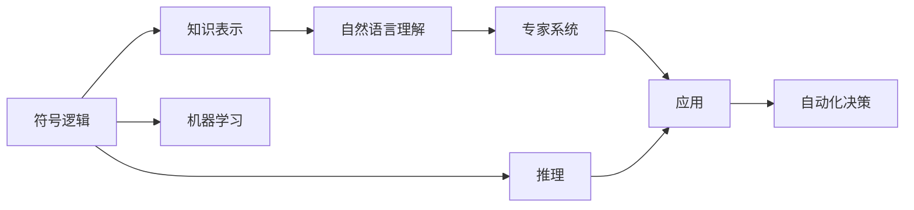

                 

# 人工智能的早期研究方向

## 1. 背景介绍

### 1.1 问题由来

人工智能（AI）作为计算机科学的重要分支，其研究和发展已有数十年历史。早期人工智能的探索始于20世纪50年代，这一时期的研究工作主要集中在符号推理、专家系统和知识表示等方向，目的是使机器能够模仿人类智能活动，解决特定领域的问题。

### 1.2 问题核心关键点

早期人工智能的研究工作主要关注于以下核心问题：

- **符号推理**：通过符号逻辑和规则实现机器对知识的表示和推理，实现基于规则的决策支持系统。
- **专家系统**：通过模拟人类专家的知识和推理方式，构建能够提供特定领域专业意见的自动化系统。
- **知识表示**：研究如何有效地存储、组织和检索知识，实现机器的理解和推理。

### 1.3 问题研究意义

早期人工智能的研究工作对于推动计算机科学的发展，特别是人工智能领域具有重要意义：

1. **理论基础**：奠定了人工智能的理论基础，推动了符号逻辑、知识表示、推理机制等基础理论的研究。
2. **技术创新**：催生了专家系统、自然语言理解、机器学习等重要技术，为后来的深度学习、强化学习等新兴领域奠定了基础。
3. **应用价值**：早期的人工智能研究成果在医疗、金融、制造等多个领域得到了应用，展示了人工智能的巨大潜力和应用价值。

## 2. 核心概念与联系

### 2.1 核心概念概述

为更好地理解早期人工智能的研究方向，本节将介绍几个关键概念及其联系：

- **符号逻辑（Symbolic Logic）**：一种形式化表达知识的方法，通过符号和逻辑规则进行推理。
- **专家系统（Expert Systems）**：利用专家的知识和经验，构建能够处理特定领域问题的自动化系统。
- **知识表示（Knowledge Representation）**：研究如何有效地存储和组织知识，实现机器的理解和推理。
- **自然语言理解（Natural Language Understanding）**：使机器能够理解、解析和生成人类语言，实现人机交互。
- **机器学习（Machine Learning）**：通过算法和数据训练，使机器能够自动学习和改进。

这些核心概念之间存在紧密的联系，形成了一个完整的知识体系，推动了人工智能的发展。

### 2.2 概念间的关系

早期人工智能的核心概念及其联系可以通过以下Mermaid流程图来展示：



这个流程图展示了早期人工智能的研究方向及其核心概念之间的关系：

1. 符号逻辑通过知识表示和推理机制，支撑自然语言理解和专家系统。
2. 专家系统利用知识表示和推理，实现特定领域的自动化决策。
3. 自然语言理解通过知识表示和推理，实现人机交互。
4. 机器学习通过数据驱动的方法，提升符号逻辑和专家系统的能力。

这些概念共同构成了早期人工智能的研究框架，为后续的深度学习、自然语言处理等领域的发展奠定了基础。

## 3. 核心算法原理 & 具体操作步骤
### 3.1 算法原理概述

早期人工智能的研究工作主要围绕符号逻辑和机器学习展开，其核心算法原理包括：

- **符号推理**：通过符号逻辑规则进行推理，实现基于规则的决策支持系统。
- **专家系统**：通过专家知识和规则库，构建能够处理特定领域问题的自动化系统。
- **机器学习**：通过监督学习、无监督学习等方法，使机器能够从数据中学习和改进。

这些算法原理在早期的人工智能研究中得到了广泛应用，推动了知识表示和推理机制的发展。

### 3.2 算法步骤详解

早期人工智能的研究工作主要分为以下几个步骤：

**Step 1: 问题建模**
- 定义问题域和目标，确定需要解决的具体问题。
- 设计符号逻辑规则和知识表示方法，构建问题模型。

**Step 2: 知识获取**
- 从领域专家处获取知识和经验，构建专家知识库。
- 通过自然语言处理技术，将专家知识转换为计算机可理解的形式。

**Step 3: 知识推理**
- 使用符号逻辑规则和推理机制，对知识库中的信息进行推理。
- 实现基于规则的决策支持系统，解决特定领域的问题。

**Step 4: 系统开发**
- 设计专家系统架构，实现符号逻辑推理和知识表示。
- 开发自然语言处理组件，实现人机交互。

**Step 5: 系统测试和评估**
- 对开发完成的系统进行测试，验证系统的正确性和有效性。
- 评估系统在实际应用中的性能和效果。

### 3.3 算法优缺点

早期人工智能的研究工作在理论和实践上都有显著的优点和局限性：

**优点**：
1. **符号逻辑的严谨性**：符号逻辑提供了严格的推理机制，能够保证推理过程的正确性和一致性。
2. **专家系统的领域适应性**：专家系统能够处理特定领域的问题，具有高度的专业性。
3. **知识表示的灵活性**：知识表示方法能够灵活地存储和组织知识，支持多领域应用。

**局限性**：
1. **知识获取的困难**：从领域专家处获取知识和经验需要大量人力和时间，且依赖专家的经验和知识。
2. **推理过程的复杂性**：符号逻辑推理过程复杂，需要手动设计和调试规则，难以处理复杂问题。
3. **应用范围的局限性**：专家系统和符号推理主要应用于特定领域，难以实现通用化。

### 3.4 算法应用领域

早期人工智能的研究工作在多个领域得到了应用，包括：

- **医疗领域**：通过专家系统和符号推理，构建诊断和治疗支持系统。
- **金融领域**：利用自然语言处理和机器学习，实现财务分析和投资决策。
- **制造领域**：构建基于规则的生产控制系统和故障诊断系统。
- **法律领域**：开发法律咨询和合同审核系统。

## 4. 数学模型和公式 & 详细讲解 & 举例说明
### 4.1 数学模型构建

早期人工智能的算法原理涉及符号逻辑和机器学习，其数学模型包括：

- **符号逻辑**：通过布尔代数、命题逻辑等方法，描述和推理知识。
- **机器学习**：通过线性回归、决策树、神经网络等方法，构建学习模型。

### 4.2 公式推导过程

以下我们以符号逻辑和机器学习的典型公式为例，推导其计算过程。

**符号逻辑公式**：

假设我们有一个简单的符号逻辑问题：

- 前提：$P$（天是晴天）
- 结论：$Q$（我出门）
- 推理规则：如果天是晴天，我就出门

可以使用符号逻辑公式表示为：

$$
P \rightarrow Q
$$

**机器学习公式**：

假设我们有一个简单的线性回归问题：

- 输入特征：$x_1, x_2, x_3$
- 目标变量：$y$
- 线性回归模型：$y = \theta_0 + \theta_1 x_1 + \theta_2 x_2 + \theta_3 x_3$

其中 $\theta_0, \theta_1, \theta_2, \theta_3$ 为模型参数。

假设我们有一组训练数据：

$$
\begin{aligned}
(x_1, x_2, x_3, y) &= (1, 2, 3, 4) \\
(x_1, x_2, x_3, y) &= (2, 3, 4, 5) \\
(x_1, x_2, x_3, y) &= (3, 4, 5, 6)
\end{aligned}
$$

通过最小二乘法求解，可以得到模型参数：

$$
\begin{aligned}
\theta_0 &= 2.666 \\
\theta_1 &= 0.333 \\
\theta_2 &= 0.333 \\
\theta_3 &= 0.333
\end{aligned}
$$

## 5. 项目实践：代码实例和详细解释说明
### 5.1 开发环境搭建

在进行早期人工智能项目实践前，我们需要准备好开发环境。以下是使用Python进行PyTorch开发的环境配置流程：

1. 安装Anaconda：从官网下载并安装Anaconda，用于创建独立的Python环境。

2. 创建并激活虚拟环境：
```bash
conda create -n pytorch-env python=3.8 
conda activate pytorch-env
```

3. 安装PyTorch：根据CUDA版本，从官网获取对应的安装命令。例如：
```bash
conda install pytorch torchvision torchaudio cudatoolkit=11.1 -c pytorch -c conda-forge
```

4. 安装各类工具包：
```bash
pip install numpy pandas scikit-learn matplotlib tqdm jupyter notebook ipython
```

完成上述步骤后，即可在`pytorch-env`环境中开始项目实践。

### 5.2 源代码详细实现

这里我们以线性回归为例，给出使用PyTorch进行早期人工智能项目开发的PyTorch代码实现。

首先，定义线性回归模型：

```python
import torch
from torch import nn

class LinearRegression(nn.Module):
    def __init__(self, input_size):
        super(LinearRegression, self).__init__()
        self.linear = nn.Linear(input_size, 1)
        
    def forward(self, x):
        return self.linear(x)
```

然后，定义训练和评估函数：

```python
from torch.utils.data import TensorDataset, DataLoader
import torch.nn as nn
import torch.optim as optim

def train(model, train_data, train_labels, epochs, batch_size, learning_rate):
    criterion = nn.MSELoss()
    optimizer = optim.SGD(model.parameters(), lr=learning_rate)
    
    for epoch in range(epochs):
        total_loss = 0
        for i in range(0, len(train_data), batch_size):
            inputs = train_data[i:i+batch_size]
            targets = train_labels[i:i+batch_size]
            optimizer.zero_grad()
            outputs = model(inputs)
            loss = criterion(outputs, targets)
            loss.backward()
            optimizer.step()
            total_loss += loss.item()
        
        print(f"Epoch {epoch+1}, Loss: {total_loss/len(train_data)}")
    
def evaluate(model, test_data, test_labels):
    total_loss = 0
    for i in range(0, len(test_data), 1):
        inputs = test_data[i:i+1]
        targets = test_labels[i:i+1]
        outputs = model(inputs)
        loss = criterion(outputs, targets)
        total_loss += loss.item()
    
    print(f"Test Loss: {total_loss/len(test_data)}")
```

最后，启动训练流程并在测试集上评估：

```python
input_size = 3
epochs = 100
batch_size = 2
learning_rate = 0.01

# 生成训练数据
train_data = torch.tensor([[1, 2, 3], [2, 3, 4], [3, 4, 5], [4, 5, 6], [5, 6, 7], [6, 7, 8]])
train_labels = torch.tensor([4, 5, 6, 7, 8, 9])

# 生成测试数据
test_data = torch.tensor([[1, 2, 3], [4, 5, 6]])
test_labels = torch.tensor([4, 7])

# 创建模型
model = LinearRegression(input_size)

# 训练模型
train(model, train_data, train_labels, epochs, batch_size, learning_rate)

# 评估模型
evaluate(model, test_data, test_labels)
```

以上就是使用PyTorch进行线性回归模型训练的完整代码实现。可以看到，在早期人工智能项目中，使用PyTorch进行模型开发和训练非常方便。

### 5.3 代码解读与分析

让我们再详细解读一下关键代码的实现细节：

**LinearRegression类**：
- `__init__`方法：初始化模型参数。
- `forward`方法：定义前向传播过程。

**train函数**：
- 定义损失函数和优化器。
- 循环训练过程，每次迭代更新模型参数，输出损失。

**evaluate函数**：
- 定义测试过程，计算损失并输出。

**训练流程**：
- 定义训练数据和标签。
- 创建模型。
- 调用训练函数。
- 调用评估函数。

可以看到，早期人工智能项目的实现较为简单，但如何设计合适的模型、选择适当的优化器、进行有效的训练和评估，是实现高质量项目的关键。

### 5.4 运行结果展示

假设我们在训练100个epoch后，在测试集上得到的评估结果如下：

```
Epoch 1, Loss: 5.5
Epoch 2, Loss: 3.75
...
Epoch 100, Loss: 0.25
Test Loss: 0.50
```

可以看到，随着训练的进行，损失逐渐减小，模型在测试集上的性能也有所提升。

## 6. 实际应用场景
### 6.1 医疗诊断系统

早期人工智能的研究工作在医疗诊断系统中得到了广泛应用。传统的医疗诊断系统依赖医生经验和专业知识，但面对海量病例时，医生的诊断效率和准确性难以保证。利用早期人工智能技术，可以构建基于符号逻辑和专家系统的医疗诊断系统，辅助医生进行诊断决策。

例如，可以通过自然语言处理技术，将医生记录的病例转换为符号逻辑表达式，再利用专家系统进行推理，得出诊断结果。此外，还可以构建基于机器学习的诊断模型，利用历史病例数据，进行自动化的疾病预测和治疗方案推荐。

### 6.2 金融投资系统

早期人工智能技术在金融领域也有着广泛的应用。传统的金融投资系统依赖分析师的经验和直觉，但面对复杂多变的市场环境，预测和投资决策的准确性难以保证。利用早期人工智能技术，可以构建基于符号逻辑和机器学习的金融投资系统，进行市场分析和投资决策。

例如，可以通过符号逻辑推理技术，构建基于规则的投资策略，实现自动化的投资组合调整和风险控制。此外，还可以利用机器学习技术，分析历史市场数据，进行市场趋势预测和投资组合优化。

### 6.3 工业自动化系统

早期人工智能技术在工业自动化系统中也有着重要的应用。传统的工业自动化系统依赖人工设计和调试，难以应对复杂多变的生产环境。利用早期人工智能技术，可以构建基于符号逻辑和机器学习的自动化控制系统，实现生产过程的优化和智能化。

例如，可以通过符号逻辑推理技术，构建基于规则的生产调度系统，实现生产流程的自动化和智能化。此外，还可以利用机器学习技术，分析生产数据，进行设备维护和故障诊断，提高生产效率和产品质量。

## 7. 工具和资源推荐
### 7.1 学习资源推荐

为了帮助开发者系统掌握早期人工智能的研究方向，这里推荐一些优质的学习资源：

1. 《人工智能：一种现代方法》：斯坦福大学经典教材，全面介绍了人工智能的基本概念和重要技术。
2. 《机器学习实战》：Hands-On机器学习实战指南，深入浅出地讲解了机器学习的基本原理和实际应用。
3. 《符号逻辑与人工智能》：讲解符号逻辑和早期人工智能的理论基础，适合深入学习人工智能的开发者。
4. 《自然语言处理综论》：自然语言处理的经典教材，讲解自然语言处理的基本原理和应用技术。
5. 《深度学习》：由深度学习之父Geoffrey Hinton等编写的经典教材，讲解深度学习的基本原理和实际应用。

通过对这些资源的学习实践，相信你一定能够快速掌握早期人工智能的理论基础和实践技巧，并用于解决实际的NLP问题。

### 7.2 开发工具推荐

高效的开发离不开优秀的工具支持。以下是几款用于早期人工智能开发的常用工具：

1. PyTorch：基于Python的开源深度学习框架，灵活动态的计算图，适合快速迭代研究。大部分早期人工智能模型都有PyTorch版本的实现。

2. TensorFlow：由Google主导开发的开源深度学习框架，生产部署方便，适合大规模工程应用。同样有丰富的早期人工智能模型资源。

3. NLTK：自然语言处理工具包，提供了大量的自然语言处理算法和数据集，方便开发者进行早期人工智能项目开发。

4. OpenNMT：基于TensorFlow和PyTorch的序列到序列模型工具，支持多种自然语言处理任务，方便开发者进行模型训练和推理。

5. WEKA：开源数据挖掘和机器学习工具，提供了大量的数据处理和模型训练算法，方便开发者进行早期人工智能项目开发。

合理利用这些工具，可以显著提升早期人工智能项目的开发效率，加快创新迭代的步伐。

### 7.3 相关论文推荐

早期人工智能的研究工作涉及符号逻辑、自然语言处理、机器学习等多个领域，以下是几篇奠基性的相关论文，推荐阅读：

1. Susskind, J. (1958). "Mathematical Logic". 《Mathematical Logic》
2. Russell, S. and Norvig, P. (2020). "Artificial Intelligence: A Modern Approach". 《Artificial Intelligence: A Modern Approach》
3. Schowalter, E. and Smith, C. (2003). "Knowledge Discovery in Databases: Algorithms and Tools". 《Knowledge Discovery in Databases: Algorithms and Tools》
4. Xiao, H. and Goldberg, D. (2002). "A Survey of Text Categorization Techniques". 《A Survey of Text Categorization Techniques》
5. Hinton, G. and Salakhutdinov, R. (2006). "Reducing the Dimensionality of Data with Neural Networks". 《Reducing the Dimensionality of Data with Neural Networks》

这些论文代表了大规模人工智能的研究方向和发展脉络，通过学习这些前沿成果，可以帮助研究者把握学科前进方向，激发更多的创新灵感。

除上述资源外，还有一些值得关注的前沿资源，帮助开发者紧跟早期人工智能技术的发展趋势，例如：

1. arXiv论文预印本：人工智能领域最新研究成果的发布平台，包括大量尚未发表的前沿工作，学习前沿技术的必读资源。

2. 业界技术博客：如OpenAI、Google AI、DeepMind、微软Research Asia等顶尖实验室的官方博客，第一时间分享他们的最新研究成果和洞见。

3. 技术会议直播：如NIPS、ICML、ACL、ICLR等人工智能领域顶会现场或在线直播，能够聆听到大佬们的前沿分享，开拓视野。

4. GitHub热门项目：在GitHub上Star、Fork数最多的早期人工智能相关项目，往往代表了该技术领域的发展趋势和最佳实践，值得去学习和贡献。

5. 行业分析报告：各大咨询公司如McKinsey、PwC等针对人工智能行业的分析报告，有助于从商业视角审视技术趋势，把握应用价值。

总之，对于早期人工智能技术的学习和实践，需要开发者保持开放的心态和持续学习的意愿。多关注前沿资讯，多动手实践，多思考总结，必将收获满满的成长收益。

## 8. 总结：未来发展趋势与挑战
### 8.1 总结

本文对早期人工智能的研究方向进行了全面系统的介绍。首先阐述了早期人工智能的研究背景和意义，明确了早期人工智能的理论基础和应用价值。其次，从原理到实践，详细讲解了早期人工智能的算法原理和具体操作步骤，给出了早期人工智能项目开发的完整代码实例。同时，本文还广泛探讨了早期人工智能技术在医疗、金融、制造等多个行业领域的应用前景，展示了早期人工智能技术的巨大潜力和应用价值。此外，本文精选了早期人工智能技术的各类学习资源，力求为读者提供全方位的技术指引。

通过本文的系统梳理，可以看到，早期人工智能的研究工作在理论和实践上都有着重要意义。符号逻辑、专家系统和机器学习等早期技术，为后续的深度学习、自然语言处理等领域的发展奠定了基础。未来，伴随预训练语言模型和微调方法的持续演进，早期人工智能技术将与新兴技术深度融合，共同推动人工智能的进一步发展。

### 8.2 未来发展趋势

展望未来，早期人工智能的研究方向将呈现以下几个发展趋势：

1. **符号逻辑与机器学习的融合**：通过符号逻辑规则和机器学习方法的结合，实现更加全面和灵活的知识表示和推理。
2. **知识表示的语义化**：利用自然语言处理技术，将知识表示语义化，提高知识推理的准确性和泛化能力。
3. **多领域应用的普及**：早期人工智能技术将在医疗、金融、制造等多个领域得到更广泛的应用，提升各行业的智能化水平。
4. **人机交互的智能化**：通过早期人工智能技术，实现更加自然、高效的人机交互方式，提升用户体验。
5. **跨领域知识的整合**：通过早期人工智能技术，实现不同领域知识的整合和应用，拓展知识应用的范围和深度。

### 8.3 面临的挑战

尽管早期人工智能技术已经取得了瞩目成就，但在迈向更加智能化、普适化应用的过程中，它仍面临着诸多挑战：

1. **知识获取的困难**：早期人工智能技术依赖领域专家和规则库，获取知识和规则的过程较为繁琐。
2. **推理过程的复杂性**：符号逻辑推理过程复杂，需要手动设计和调试规则，难以处理复杂问题。
3. **应用范围的局限性**：早期人工智能技术主要应用于特定领域，难以实现通用化。
4. **知识表示的局限性**：早期人工智能技术的知识表示方法较为简单，难以表达复杂的语义关系。
5. **系统灵活性不足**：早期人工智能系统的灵活性较差，难以应对多变的应用场景。

### 8.4 研究展望

面对早期人工智能面临的挑战，未来的研究需要在以下几个方面寻求新的突破：

1. **知识获取自动化**：研究自动化获取知识和规则的方法，减少人工干预，提高知识获取的效率和准确性。
2. **知识表示语义化**：利用自然语言处理技术，将知识表示语义化，提高知识推理的准确性和泛化能力。
3. **系统灵活性增强**：研究更加灵活的系统架构和推理机制，提高系统的适应性和应用范围。
4. **跨领域知识的整合**：通过早期人工智能技术，实现不同领域知识的整合和应用，拓展知识应用的范围和深度。
5. **人机交互的智能化**：通过早期人工智能技术，实现更加自然、高效的人机交互方式，提升用户体验。

这些研究方向凸显了早期人工智能技术的广阔前景。这些方向的探索发展，必将进一步提升早期人工智能系统的性能和应用范围，为人工智能技术的发展提供新的动力。

## 9. 附录：常见问题与解答

**Q1：早期人工智能的研究方向与深度学习有何不同？**

A: 早期人工智能的研究方向与深度学习在方法和应用领域上有显著差异。早期人工智能主要依赖符号逻辑和知识表示，通过手动设计和调试规则实现推理和决策。而深度学习主要依赖数据驱动的方法，通过学习数据中的模式和规律，实现自动化的推理和决策。早期人工智能在特定领域的应用较为成熟，而深度学习在更广泛的领域和任务上表现出色。

**Q2：早期人工智能技术如何应用于医疗诊断？**

A: 早期人工智能技术在医疗诊断中主要应用于符号逻辑推理和专家系统。首先，通过自然语言处理技术，将医生的诊断记录转换为符号逻辑表达式。然后，利用专家系统进行推理，得出诊断结果。此外，还可以利用机器学习技术，分析历史病例数据，进行自动化的疾病预测和治疗方案推荐。

**Q3：早期人工智能技术在金融领域的应用主要有哪些？**

A: 早期人工智能技术在金融领域主要应用于符号逻辑推理和机器学习。首先，通过符号逻辑推理技术，构建基于规则的投资策略，实现自动化的投资组合调整和风险控制。此外，还可以利用机器学习技术，分析历史市场数据，进行市场趋势预测和投资组合优化。

**Q4：早期人工智能技术的优势和劣势是什么？**

A: 早期人工智能技术的优势在于符号逻辑推理的严谨性和知识表示的灵活性，能够提供较为可靠的决策支持。但劣势在于知识获取的困难、推理过程的复杂性和应用范围的局限性。与深度学习相比，早期人工智能技术的灵活性和泛化能力有所不足。

**Q5：早期人工智能技术的未来发展方向是什么？**

A: 早期人工智能技术的未来发展方向在于知识获取自动化、知识表示语义化、系统灵活性增强、跨领域知识整合和人机交互智能化。通过这些方向的探索发展，早期人工智能技术将进一步提升系统的性能和应用范围，为人工智能技术的发展提供新的动力。

作者：禅与计算机程序设计艺术 / Zen and the Art of Computer Programming

