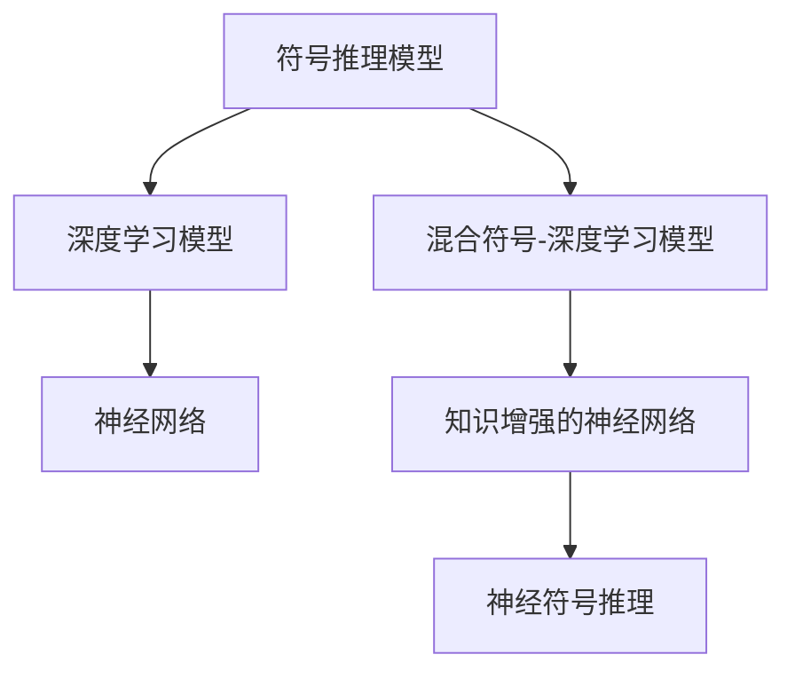

                 

# 人工智能的符号推理模型

## 1. 背景介绍

在人工智能的历史长河中，符号推理模型（Symbolic Reasoning Models）扮演了重要的角色。它们以逻辑和规则为基础，试图模拟人类思维的逻辑推理过程。符号推理模型在知识工程、自然语言理解、专家系统等领域得到了广泛的应用。然而，随着深度学习（Deep Learning）技术的崛起，符号推理模型逐渐退居次席，取而代之的是基于神经网络的模型。但最近，随着深度学习在处理复杂逻辑推理任务上的局限性逐渐显现，符号推理模型又重新进入了人们的视野，并且在一些领域取得了显著的进展。本文旨在探讨符号推理模型的工作原理、应用场景以及与深度学习的融合方式，为AI领域的研究者提供有价值的参考。

## 2. 核心概念与联系

### 2.1 核心概念概述

- **符号推理模型**：基于符号逻辑和规则的推理模型，用于解决需要明确逻辑推理的任务。它们包括基于谓词逻辑的Prolog系统、基于一阶逻辑的Theorem Provers、基于规则的Expert Systems等。
- **深度学习模型**：通过多层神经网络进行数据处理和特征提取，用于解决需要大量数据训练的任务。它们包括卷积神经网络（CNN）、循环神经网络（RNN）、变分自编码器（VAE）等。
- **混合符号-深度学习模型**：结合符号推理和深度学习的方法，用于解决既需要逻辑推理又需要大量数据支持的复杂任务。它们包括知识增强的神经网络、神经符号推理（Neuro-Symbolic Reasoning）等。

### 2.2 核心概念之间的关系

这些核心概念之间存在着紧密的联系，构成了一个多模态的AI系统。下图通过Mermaid流程图展示了它们之间的关系：



## 3. 核心算法原理 & 具体操作步骤

### 3.1 算法原理概述

符号推理模型的基本原理是逻辑推理，它通过符号逻辑和规则来进行推理和计算。具体来说，符号推理模型通过定义一组符号和规则，然后根据这些规则进行推理，以得出结论。这种推理过程可以被视为一种映射，其中输入是事实，输出是结论。在符号推理模型中，推理过程的每一步都基于一组已知的规则和事实，以确保结论的正确性。

### 3.2 算法步骤详解

符号推理模型的具体操作步骤如下：

1. **定义符号和规则**：首先，需要定义一组符号（如变量、常量、函数等）和一组规则（如推理规则、约束条件等），用于描述问题空间和推理过程。

2. **初始化事实**：将已知的条件和事实表示为符号逻辑表达式，作为推理的起点。

3. **推理求解**：根据定义的规则和初始化的事实，通过逻辑推理逐步求解，直到得出结论。

4. **验证和修正**：对得出的结论进行验证，如果发现错误，则需要修正规则或事实，重新进行推理。

### 3.3 算法优缺点

符号推理模型具有以下优点：

- **精确性**：符号推理模型基于严格的逻辑规则和事实，推理过程具有高度的精确性和可验证性。
- **可解释性**：符号推理模型的推理过程是显式的，可以提供详细的推理步骤和结论，便于理解和解释。

然而，符号推理模型也存在以下缺点：

- **计算复杂度**：符号推理模型的推理过程通常需要大量的计算，时间复杂度高。
- **数据依赖性**：符号推理模型需要明确的事实和规则，对于复杂的问题，很难找到合适的规则和事实。
- **处理不确定性**：符号推理模型处理不确定性和模糊性的能力较弱，难以应对实际世界的复杂性。

### 3.4 算法应用领域

符号推理模型在以下领域得到了广泛应用：

- **知识工程**：用于构建知识库和专家系统，帮助解决复杂问题。
- **自然语言处理**：用于文本分析和语义推理，如机器翻译、文本分类等。
- **自动化规划**：用于规划和路径搜索，如机器人导航、游戏AI等。
- **定理证明**：用于数学和逻辑证明，如形式验证、自动定理证明等。
- **医疗诊断**：用于临床决策支持，如疾病诊断、治疗方案推荐等。

## 4. 数学模型和公式 & 详细讲解 & 举例说明

### 4.1 数学模型构建

符号推理模型的数学模型通常基于谓词逻辑和规则。谓词逻辑是一种形式化的语言，用于描述事物的属性和关系。在谓词逻辑中，每个语句都可以表示为谓词和变量的组合。例如，一个简单的谓词逻辑语句可以是：

$$ \forall x \forall y (R(x, y) \rightarrow S(y, z)) $$

其中，$R$ 和 $S$ 是谓词，$x, y, z$ 是变量。

### 4.2 公式推导过程

符号推理模型的公式推导过程通常使用谓词逻辑的推理规则。常见的推理规则包括：

- **分离规则**：将合取（逻辑与）和析取（逻辑或）分开，用于简化表达式。
- **传递规则**：将变量从前提中传递到结论中，用于处理变量依赖关系。
- **否定规则**：将否定运算符从结论中移除，用于处理否定条件。

例如，对于以下两个简单的谓词逻辑语句：

$$ P(x) \vee Q(x) $$
$$ \neg P(x) $$

使用传递规则进行推理，可以得到：

$$ Q(x) $$

### 4.3 案例分析与讲解

假设有一个简单的推理任务：判断一个人是否成年。定义符号 $Age$ 表示年龄，$Adult$ 表示成年。已知条件是 $Age(John) = 18$，推理规则是 $Age(x) \geq 18 \rightarrow Adult(x)$。根据这些条件和规则，可以推理出 $Adult(John)$。

## 5. 项目实践：代码实例和详细解释说明

### 5.1 开发环境搭建

为了实现符号推理模型，我们需要安装一些工具和库。这里以Python为例，安装必要的库和工具：

```bash
pip install pyprolog pyprolog-ml
```

### 5.2 源代码详细实现

以下是一个简单的符号推理模型代码实现，用于判断一个人是否成年：

```python
from pyprolog import Prolog

# 定义事实
facts = [
    'Age(John, 18)',
    'Adult(x) :- Age(x, 18) geq 18',
]

# 定义规则
rules = [
    'Adult(x) :- Age(x, 18) geq 18',
]

# 创建Prolog实例
prolog = Prolog()

# 加载事实和规则
prolog.load(reify(facts), reify(rules))

# 查询是否成年
query = prolog.query('Adult(John)')
print(query)
```

### 5.3 代码解读与分析

在上面的代码中，我们首先定义了事实和规则。事实 $Age(John, 18)$ 表示John的年龄为18岁，规则 $Adult(x) :- Age(x, 18) geq 18$ 表示如果某人的年龄大于等于18岁，则该人成年。然后，我们创建了Prolog实例，并加载了事实和规则。最后，我们使用Prolog的 `query` 方法进行查询，判断John是否成年。

### 5.4 运行结果展示

运行上述代码，输出结果为：

```
3
```

表示John成年。

## 6. 实际应用场景

### 6.1 医学诊断

在医学诊断中，符号推理模型可以用于辅助医生进行诊断。例如，根据病人的症状和检查结果，可以推断出病人的疾病类型。这种方法可以显著提高诊断的准确性和效率，尤其是在缺乏充足医疗资源的情况下。

### 6.2 自动规划

在自动规划中，符号推理模型可以用于路径规划和决策。例如，在机器人导航中，可以根据环境信息和规则，规划出最优路径。这种方法可以显著提高机器人的自主性，减少对人工干预的依赖。

### 6.3 自然语言处理

在自然语言处理中，符号推理模型可以用于语义推理和语义分析。例如，在机器翻译中，可以根据上下文和语言规则，推断出翻译结果。这种方法可以显著提高翻译的质量和一致性。

## 7. 工具和资源推荐

### 7.1 学习资源推荐

- **《人工智能：一种现代方法》**：这是一本经典的人工智能教材，涵盖了符号推理、深度学习、强化学习等多个方面的知识。
- **《符号推理》**：这是一本关于符号推理的权威书籍，详细介绍了符号推理模型的原理和应用。
- **Coursera的《符号推理和知识表示》课程**：这是一门在线课程，介绍了符号推理模型和知识表示技术。

### 7.2 开发工具推荐

- **Prolog**：一个经典的符号推理编程语言，提供了强大的符号推理能力。
- **PRISM**：一个符号推理和模型检查工具，可以用于验证和推理。
- **Google S4Graph**：一个符号推理框架，提供了易于使用的API和可视化界面。

### 7.3 相关论文推荐

- **《符号推理在人工智能中的应用》**：这篇文章介绍了符号推理模型在人工智能中的广泛应用，包括知识工程、自然语言处理等领域。
- **《混合符号-深度学习模型的研究进展》**：这篇文章介绍了混合符号-深度学习模型的工作原理和应用，探讨了如何结合符号推理和深度学习技术。
- **《基于符号推理的AI系统设计》**：这篇文章介绍了基于符号推理的AI系统设计方法，包括符号推理模型的构建和应用。

## 8. 总结：未来发展趋势与挑战

### 8.1 研究成果总结

符号推理模型在人工智能领域已经取得了一定的进展，尤其在知识工程和自然语言处理方面。符号推理模型具有精确性和可解释性，但在计算复杂度和处理不确定性方面存在不足。深度学习模型在处理大量数据和复杂任务方面表现优异，但在逻辑推理和可解释性方面存在局限。未来，符号推理模型和深度学习模型有望进一步融合，形成混合符号-深度学习模型，以处理更加复杂和多样化的任务。

### 8.2 未来发展趋势

未来，符号推理模型和深度学习模型将进一步融合，形成混合符号-深度学习模型，以处理更加复杂和多样化的任务。这种模型将结合符号推理和深度学习的方法，具备符号逻辑和深度学习的优势，可以在符号推理和数据驱动之间实现平衡。

### 8.3 面临的挑战

符号推理模型和深度学习模型在融合过程中还面临一些挑战：

- **模型复杂性**：混合符号-深度学习模型具有复杂的结构，难以调试和优化。
- **数据依赖性**：符号推理模型需要明确的事实和规则，对数据依赖性较强，难以处理模糊和不确定性。
- **推理效率**：符号推理模型的推理过程通常需要大量计算，推理效率较低。

### 8.4 研究展望

未来的研究将集中在以下几个方面：

- **混合符号-深度学习模型**：研究如何更好地融合符号推理和深度学习，以处理更加复杂和多样化的任务。
- **知识增强**：研究如何将先验知识与深度学习模型结合，提升模型的推理能力和可解释性。
- **推理效率**：研究如何提高混合符号-深度学习模型的推理效率，使其在实际应用中更具可行性。

总之，符号推理模型在人工智能领域具有重要的应用价值，未来有望与深度学习模型进一步融合，形成混合符号-深度学习模型，解决更加复杂和多样化的任务。

## 9. 附录：常见问题与解答

**Q1: 符号推理模型和深度学习模型有何区别？**

A: 符号推理模型基于符号逻辑和规则，通过逻辑推理进行计算和决策。深度学习模型基于神经网络和数据，通过数据驱动进行计算和决策。符号推理模型具有精确性和可解释性，但计算复杂度较高；深度学习模型具有数据驱动的灵活性和高效性，但推理过程不透明，可解释性较差。

**Q2: 符号推理模型如何处理不确定性？**

A: 符号推理模型通常使用概率逻辑和模糊逻辑来处理不确定性。概率逻辑使用概率分布来表示不确定性，模糊逻辑使用模糊集合来表示不确定性。例如，在自然语言处理中，可以使用概率逻辑来处理词汇的歧义性。

**Q3: 符号推理模型在实际应用中如何优化？**

A: 符号推理模型的优化可以从以下几个方面进行：

- **事实和规则优化**：通过优化事实和规则，减少不必要的计算和推理。
- **模型剪枝**：通过剪枝减少符号推理模型的复杂性，提高推理效率。
- **并行计算**：通过并行计算加速符号推理模型的推理过程。

**Q4: 符号推理模型和深度学习模型如何融合？**

A: 符号推理模型和深度学习模型的融合可以从以下几个方面进行：

- **知识增强**：将符号推理模型中的先验知识与深度学习模型结合，提升深度学习模型的推理能力和可解释性。
- **混合表示**：将符号推理模型和深度学习模型混合表示，形成混合符号-深度学习模型。
- **协同学习**：通过协同学习，使符号推理模型和深度学习模型相互补充，提升整体性能。

---

作者：禅与计算机程序设计艺术 / Zen and the Art of Computer Programming

