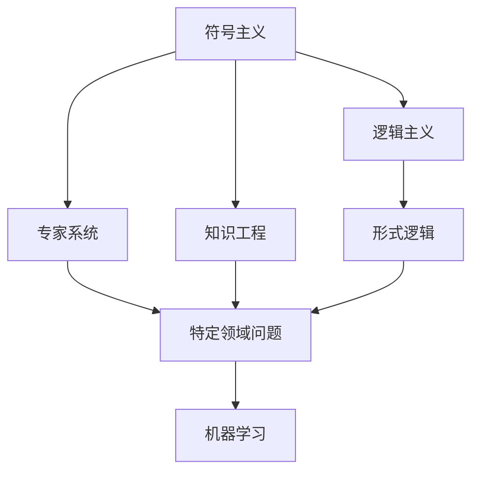

                 

# 人工智能研究的早期方向

## 1. 背景介绍

### 1.1 问题由来
在人工智能(AI)领域，过去几十年的研究和发展经历了多次高潮与低谷。从早期的逻辑主义、符号主义到后期的连接主义、行为主义，再到如今深度学习和增强学习的兴起，AI研究经历了多轮迭代和变革。早期的研究更多地关注于人工智能的理论和原则，强调计算机如何通过符号推理、逻辑计算等形式进行智能操作。而随着计算资源和数据量的增加，研究的重点逐渐转向了机器学习和深度学习算法在具体任务上的应用，取得了显著的突破。

### 1.2 问题核心关键点
早期人工智能研究的核心在于：

- **符号处理**：早期AI研究采用符号逻辑和知识表示的方法，通过知识图谱、规则库等方式对问题进行建模和推理。
- **认知模型**：研究人类认知和思维过程，试图构建出能够模拟人类思考方式的机器智能。
- **专家系统**：通过专家知识库和推理机，模拟专家解决特定领域问题的过程。
- **机器学习**：早期机器学习方法包括决策树、规则归纳、支持向量机等，重点在于从数据中提取模式和规律。

这些早期研究方向为后来的深度学习和强化学习奠定了理论基础和技术积累。

## 2. 核心概念与联系

### 2.1 核心概念概述

为更好地理解早期人工智能的研究方向，本节将介绍几个关键概念及其联系：

- **符号主义**：早期AI研究的核心思想之一，通过符号逻辑和知识表示的方法，模拟人类认知和思维过程。符号主义强调通过规则和知识库进行推理，达到智能决策的目的。
- **逻辑主义**：研究如何用形式逻辑和公理化方法解决计算和推理问题，试图将人工智能的理论基础建立在逻辑和数学之上。
- **专家系统**：基于专家知识和经验，通过符号处理和推理机制，模拟人类专家的决策过程，解决特定领域的问题。
- **知识工程**：将人类的知识和经验提炼为可执行的程序和规则，构建知识库，用于驱动AI系统。
- **机器学习**：早期的机器学习方法包括决策树、规则归纳、支持向量机等，通过学习数据中的模式和规律，进行分类、回归等任务。

这些核心概念通过一系列逻辑关系连接起来，形成了早期人工智能研究的基本框架。

### 2.2 概念间的关系

这些核心概念之间的关系可以通过以下Mermaid流程图来展示：



这个流程图展示了早期人工智能研究的主要方向和它们之间的联系：

1. 符号主义和逻辑主义构成理论基础，为专家系统和知识工程提供原则和方法。
2. 专家系统和知识工程结合了领域专家的知识，通过符号处理和推理机制，解决特定领域问题。
3. 机器学习为专家系统和知识工程提供了数据驱动的模型和算法，用于从数据中提取规律。

这些概念共同构成了早期人工智能研究的完整框架，为后续的深度学习和增强学习提供了基础和灵感。

## 3. 核心算法原理 & 具体操作步骤
### 3.1 算法原理概述

早期人工智能研究主要通过符号处理和逻辑推理实现智能决策。其核心算法包括规则推理、专家系统和机器学习。规则推理是早期AI研究的重要组成部分，通过定义一系列规则和知识库，模拟人类专家的决策过程。专家系统则是将专家知识封装为可执行的推理机，通过符号处理和推理机制，解决特定领域的问题。机器学习则是通过学习数据中的模式和规律，进行分类、回归等任务。

### 3.2 算法步骤详解

早期AI研究的算法步骤主要包括以下几个关键环节：

1. **定义规则**：根据领域专家的知识，定义一系列规则，用于描述问题的解决过程。
2. **知识库构建**：将领域知识提炼为知识库，作为规则推理的基础。
3. **规则推理**：通过规则引擎，对输入数据进行推理和匹配，找到符合规则的解决方案。
4. **模型训练**：使用机器学习方法，从数据中提取模式和规律，构建分类或回归模型。
5. **模型评估**：对训练好的模型进行评估，确保其在新数据上的泛化能力。
6. **应用部署**：将模型部署到实际应用中，进行实时推理和决策。

### 3.3 算法优缺点

早期AI研究的优点包括：

- **理论基础扎实**：通过逻辑主义和符号主义，构建了坚实的理论基础，为后续研究提供了指导。
- **领域知识应用**：专家系统和知识工程结合领域专家的知识，提高了系统的可解释性和实用性。
- **机器学习促进**：早期机器学习方法为后续深度学习提供了技术积累。

缺点则主要体现在：

- **知识获取困难**：专家系统的知识库构建和规则推理依赖于领域专家的经验，获取知识成本较高。
- **模型泛化能力不足**：早期机器学习方法主要依赖手动特征工程，难以应对复杂多变的输入数据。
- **计算资源限制**：早期AI系统依赖于符号处理和规则推理，计算资源消耗较大，难以实现实时响应。

### 3.4 算法应用领域

早期AI研究在多个领域得到了应用，主要包括以下几个方面：

- **医疗诊断**：通过专家系统和知识工程，构建医疗诊断系统，辅助医生进行疾病诊断和治疗。
- **金融预测**：使用规则推理和机器学习，构建金融预测模型，进行风险评估和投资决策。
- **教育培训**：利用专家系统和知识工程，构建智能教育系统，进行个性化学习推荐和评估。
- **军事决策**：通过规则推理和专家系统，构建军事决策支持系统，辅助指挥官进行战略决策。
- **工业控制**：使用机器学习和专家系统，构建工业控制系统，实现自动化生产和管理。

## 4. 数学模型和公式 & 详细讲解
### 4.1 数学模型构建

早期AI研究的核心数学模型主要基于符号逻辑和统计学习。符号逻辑用于描述问题的解法和知识推理，统计学习用于从数据中提取规律和模式。

定义一个符号逻辑模型 $M$，包含符号库 $\Sigma$、逻辑规则 $R$ 和事实库 $F$。其中，$\Sigma$ 包括所有可能出现在知识库中的符号，$R$ 是规则集合，$F$ 是初始的事实集合。模型 $M$ 的推理过程可以通过规则 $R$ 和事实 $F$ 进行推理，得到新的事实或解法。

统计学习模型 $M$ 通常基于决策树、规则归纳等方法，通过训练数据 $D=\{(x_i, y_i)\}_{i=1}^N$ 构建模型 $h(x)$，其中 $x$ 是输入特征，$y$ 是目标变量。模型的训练目标是最小化经验风险：

$$
\min_{h} \mathcal{L}(h) = \frac{1}{N} \sum_{i=1}^N \ell(h(x_i),y_i)
$$

其中 $\ell$ 是损失函数，常用的包括均方误差、交叉熵等。

### 4.2 公式推导过程

以决策树为例，其基本算法流程如下：

1. 选择最优特征 $X$ 和最优阈值 $t$，将数据集 $D$ 分为子集 $D_1$ 和 $D_2$。
2. 计算子集 $D_1$ 和 $D_2$ 的目标变量均值 $y_1$ 和 $y_2$。
3. 如果 $y_1$ 和 $y_2$ 的方差小于预设阈值 $\epsilon$，则停止递归，返回当前节点的预测值 $h(x)$。
4. 否则，对子集 $D_1$ 和 $D_2$ 进行递归处理，生成新的决策树节点。

假设训练数据集 $D=\{(x_i, y_i)\}_{i=1}^N$，每个样本的特征维度为 $d$，目标变量为二分类，则决策树算法步骤如下：

1. 从 $d$ 个特征中选择最优特征 $X$ 和阈值 $t$，将数据集分为子集 $D_1$ 和 $D_2$。
2. 计算子集 $D_1$ 和 $D_2$ 的目标变量均值 $y_1$ 和 $y_2$。
3. 如果 $y_1$ 和 $y_2$ 的方差小于预设阈值 $\epsilon$，则停止递归，返回当前节点的预测值 $h(x)$。
4. 否则，对子集 $D_1$ 和 $D_2$ 进行递归处理，生成新的决策树节点。

### 4.3 案例分析与讲解

以一个简单的金融预测任务为例，使用决策树算法进行建模。假设数据集 $D=\{(x_i, y_i)\}_{i=1}^N$，每个样本包含 $d=5$ 个特征，目标变量为二分类，表示是否会投资某只股票。

1. 选择最优特征 $X$ 和阈值 $t$，将数据集分为子集 $D_1$ 和 $D_2$。假设选择特征 $X$ 的阈值 $t=0.5$，将数据集分为 $D_1$ 和 $D_2$，分别包含前 $N/2$ 和后 $N/2$ 个样本。
2. 计算子集 $D_1$ 和 $D_2$ 的目标变量均值 $y_1$ 和 $y_2$。假设 $y_1=0.6$，$y_2=0.4$。
3. 由于 $y_1$ 和 $y_2$ 的方差较大，继续递归处理。
4. 对子集 $D_1$ 和 $D_2$ 进行递归处理，生成新的决策树节点。假设生成新的决策树节点，并计算其预测值。

## 5. 项目实践：代码实例和详细解释说明
### 5.1 开发环境搭建

在进行早期AI研究的项目实践前，我们需要准备好开发环境。以下是使用Python进行决策树模型的环境配置流程：

1. 安装Anaconda：从官网下载并安装Anaconda，用于创建独立的Python环境。

2. 创建并激活虚拟环境：
```bash
conda create -n ai-env python=3.8 
conda activate ai-env
```

3. 安装Python数据科学包：
```bash
pip install numpy pandas scikit-learn matplotlib jupyter notebook ipython
```

4. 安装scikit-learn库：
```bash
pip install scikit-learn
```

完成上述步骤后，即可在`ai-env`环境中开始项目实践。

### 5.2 源代码详细实现

这里我们以一个简单的金融预测任务为例，使用scikit-learn库中的决策树模型进行建模。

首先，准备数据集：

```python
import pandas as pd
from sklearn.model_selection import train_test_split

# 读取数据集
data = pd.read_csv('financial_data.csv')

# 将数据分为训练集和测试集
X_train, X_test, y_train, y_test = train_test_split(data.drop('target', axis=1), data['target'], test_size=0.2, random_state=42)

# 输出训练集和测试集的形状
print(f'训练集形状：{X_train.shape}, 目标变量形状：{y_train.shape}')
print(f'测试集形状：{X_test.shape}, 目标变量形状：{y_test.shape}')
```

然后，训练决策树模型：

```python
from sklearn.tree import DecisionTreeClassifier

# 创建决策树模型
model = DecisionTreeClassifier()

# 训练模型
model.fit(X_train, y_train)

# 输出模型参数
print(model.get_params())
```

接着，评估模型性能：

```python
from sklearn.metrics import accuracy_score

# 预测测试集
y_pred = model.predict(X_test)

# 计算准确率
accuracy = accuracy_score(y_test, y_pred)
print(f'测试集准确率：{accuracy:.2f}')
```

最后，使用训练好的模型进行预测：

```python
# 预测新样本
new_samples = pd.DataFrame({'feature1': [10, 15, 20], 'feature2': [5, 10, 15], 'feature3': [1, 2, 3], 'feature4': [0.5, 1, 1.5], 'feature5': [0.1, 0.2, 0.3]})
y_pred = model.predict(new_samples)

print(f'新样本预测结果：{y_pred}')
```

以上就是使用Python进行决策树模型训练和预测的完整代码实现。可以看到，scikit-learn库为决策树模型的构建和评估提供了方便的接口，使得项目实践更加高效和便捷。

### 5.3 代码解读与分析

让我们再详细解读一下关键代码的实现细节：

**数据集准备**：
- 使用pandas库读取CSV文件，并将其分为训练集和测试集。
- 输出训练集和测试集的形状，确认数据分割的正确性。

**模型训练**：
- 使用scikit-learn库中的DecisionTreeClassifier创建决策树模型。
- 使用fit方法对模型进行训练。

**模型评估**：
- 使用predict方法对测试集进行预测。
- 使用accuracy_score函数计算准确率。

**预测新样本**：
- 创建新的数据框，包含新样本的特征。
- 使用predict方法对新样本进行预测。

可以看到，scikit-learn库提供了丰富的机器学习算法和工具，使得早期AI研究中的项目实践变得简单高效。

## 6. 实际应用场景
### 6.1 智能医疗诊断

早期AI研究在医疗领域的应用主要集中在专家系统和知识工程上，通过构建医疗诊断系统，辅助医生进行疾病诊断和治疗。专家系统可以模拟医生的推理过程，结合知识库和规则，快速准确地给出诊断结果。知识工程则将专家的知识提炼为知识库，用于驱动系统运行。

在实践中，可以收集大量的医疗案例和专家经验，构建知识库和规则库，通过专家系统进行推理和诊断。同时，引入机器学习方法，从大量的医疗数据中提取模式和规律，用于提升诊断系统的准确率和泛化能力。

### 6.2 金融风险管理

早期AI研究在金融领域主要关注于规则推理和机器学习。通过构建金融预测系统，进行风险评估和投资决策。规则推理系统可以根据历史数据和规则，预测股票和债券的市场趋势，生成投资策略。机器学习系统则可以从大量的金融数据中提取模式，进行分类和回归，辅助进行风险管理和投资决策。

在实践中，可以使用规则推理系统结合历史数据和专家规则，预测市场趋势和风险点。同时，引入机器学习系统，从大量金融数据中提取模式和规律，进行分类和回归，生成风险评估和投资决策。

### 6.3 教育个性化推荐

早期AI研究在教育领域主要关注于专家系统和知识工程。通过构建智能教育系统，进行个性化学习推荐和评估。专家系统可以模拟教师的推理过程，结合知识库和规则，推荐适合学生的学习资源和路径。知识工程则将教师的知识提炼为知识库，用于驱动系统运行。

在实践中，可以收集大量的学生学习数据和教师教学经验，构建知识库和规则库，通过专家系统进行个性化推荐。同时，引入机器学习方法，从大量的学生学习数据中提取模式，用于提升推荐系统的准确率和泛化能力。

## 7. 工具和资源推荐
### 7.1 学习资源推荐

为了帮助开发者系统掌握早期人工智能的研究方向和实践技巧，这里推荐一些优质的学习资源：

1. 《人工智能基础》系列书籍：由人工智能领域的权威专家撰写，全面介绍了人工智能的基本概念、算法和技术。
2. CS223《人工智能与机器学习》课程：斯坦福大学开设的入门级AI课程，涵盖了人工智能的基本理论和算法。
3. 《模式识别与机器学习》书籍：经典教材，详细介绍了模式识别和机器学习的基本原理和应用。
4. Coursera的《机器学习》课程：由斯坦福大学教授Andrew Ng主讲，是机器学习领域的经典入门课程。
5. Kaggle平台：提供丰富的机器学习和数据科学竞赛，可以帮助开发者实践项目、积累经验。

通过对这些资源的学习实践，相信你一定能够快速掌握早期人工智能的研究方向，并用于解决实际的AI问题。

### 7.2 开发工具推荐

高效的开发离不开优秀的工具支持。以下是几款用于早期AI研究开发的常用工具：

1. Python编程语言：免费开源，拥有丰富的数据科学库和算法支持，是早期AI研究的主流编程语言。
2. Jupyter Notebook：交互式编程环境，支持多种语言和库，方便开发者调试和展示代码。
3. scikit-learn库：丰富的机器学习算法和工具，方便开发者构建和评估模型。
4. TensorFlow：谷歌开发的深度学习框架，支持多种模型和算法，广泛应用于早期AI研究。
5. PyTorch：Facebook开发的深度学习框架，具有动态计算图和高效的模型构建能力，广泛应用于早期AI研究。

合理利用这些工具，可以显著提升早期AI研究任务的开发效率，加快创新迭代的步伐。

### 7.3 相关论文推荐

早期AI研究的发展源于学界的持续研究。以下是几篇奠基性的相关论文，推荐阅读：

1. symbolic reasoning and problem-solving（符号推理与问题求解）：提出了基于符号逻辑的推理算法，奠定了早期AI研究的基础。
2. decision trees and rule induction（决策树与规则归纳）：介绍了决策树算法和规则归纳方法，用于从数据中提取模式和规律。
3. expert systems for medical diagnosis（医学诊断专家系统）：介绍了早期AI在医疗诊断中的应用，强调了知识工程和专家系统的重要性。
4. neural networks and deep learning（神经网络和深度学习）：介绍了神经网络和深度学习的基本原理，为后续研究奠定了技术基础。
5. reinforcement learning for robotics（机器人强化学习）：介绍了早期AI在机器人控制中的应用，强调了强化学习的重要性。

这些论文代表了大规模AI研究的演进脉络。通过学习这些前沿成果，可以帮助研究者把握学科前进方向，激发更多的创新灵感。

除上述资源外，还有一些值得关注的前沿资源，帮助开发者紧跟早期AI研究技术的最新进展，例如：

1. arXiv论文预印本：人工智能领域最新研究成果的发布平台，包括大量尚未发表的前沿工作，学习前沿技术的必读资源。
2. IEEE Transactions on Neural Networks and Learning Systems：IEEE主办的神经网络和学习系统期刊，涵盖早期AI研究的前沿进展和技术突破。
3. NIPS、ICML、AAAI等顶级会议：人工智能领域的顶级学术会议，定期发布最新的研究成果和技术进展。

总之，对于早期AI研究技术的学习和实践，需要开发者保持开放的心态和持续学习的意愿。多关注前沿资讯，多动手实践，多思考总结，必将收获满满的成长收益。

## 8. 总结：未来发展趋势与挑战
### 8.1 总结

本文对早期人工智能研究进行了全面系统的介绍。首先阐述了早期AI研究的核心概念和研究方向，明确了符号主义、逻辑主义、专家系统和机器学习等研究方向的重要价值。其次，从原理到实践，详细讲解了早期AI研究的数学模型和算法流程，给出了具体的项目实践案例。同时，本文还广泛探讨了早期AI研究在医疗、金融、教育等多个领域的应用前景，展示了早期AI研究的巨大潜力。

通过本文的系统梳理，可以看到，早期AI研究为后来的深度学习和增强学习奠定了理论和实践基础，催生了更多的落地场景。早期AI研究中的知识工程和专家系统为现代AI技术中的知识图谱和自然语言理解提供了重要的思想和技术积累。同时，早期AI研究中的机器学习为深度学习提供了技术积累和算法支持。未来，早期AI研究中的思想和技术将继续引领AI技术的进步和发展。

### 8.2 未来发展趋势

展望未来，早期AI研究将呈现以下几个发展趋势：

1. 知识图谱和符号推理的发展：随着知识图谱和符号推理技术的发展，未来的AI系统将能够更好地处理复杂多变的输入数据，提升系统的可解释性和可理解性。
2. 专家系统和规则推理的优化：专家系统和规则推理系统将继续优化，结合更多领域知识，构建更加精细化的知识库和规则库，提升系统的实用性和稳定性。
3. 机器学习的改进：机器学习算法将进一步优化，引入更多先验知识和结构化信息，提升模型的泛化能力和鲁棒性。
4. 深度学习与早期AI研究的融合：深度学习技术将与早期AI研究进行更加深入的融合，结合知识图谱、符号推理和机器学习，构建更加全面、准确的信息整合能力。
5. 多模态数据的整合：早期AI研究将继续拓展到图像、视频、语音等多模态数据，提升AI系统对现实世界的理解和建模能力。

这些趋势凸显了早期AI研究的广泛应用和重要价值。这些方向的探索发展，必将进一步提升AI系统的性能和应用范围，为构建人机协同的智能系统铺平道路。

### 8.3 面临的挑战

尽管早期AI研究已经取得了显著成就，但在迈向更加智能化、普适化应用的过程中，它仍面临着诸多挑战：

1. 知识获取困难：专家系统和知识工程依赖于领域专家的经验，获取知识成本较高。如何通过自动学习等方式获取更多的领域知识，是未来的重要课题。
2. 模型泛化能力不足：早期AI系统主要依赖手动特征工程，难以应对复杂多变的输入数据。如何提高模型的泛化能力和鲁棒性，还需要更多理论和实践的积累。
3. 计算资源限制：早期AI系统依赖于符号处理和规则推理，计算资源消耗较大，难以实现实时响应。如何优化计算图和模型结构，提升推理速度和效率，将是重要的优化方向。
4. 模型可解释性不足：早期AI系统更像是"黑盒"系统，难以解释其内部工作机制和决策逻辑。如何赋予系统更强的可解释性，将是亟待攻克的难题。
5. 安全性问题：早期AI系统容易学习到有害和偏见的信息，如何从数据和算法层面消除模型偏见，确保输出的安全性，也将是重要的研究课题。

### 8.4 研究展望

面对早期AI研究面临的这些挑战，未来的研究需要在以下几个方面寻求新的突破：

1. 探索更高效的符号推理方法：结合知识图谱和符号推理，提升系统的可解释性和可理解性。
2. 引入更多先验知识和结构化信息：将更多领域知识和结构化信息融入模型中，提升模型的泛化能力和鲁棒性。
3. 优化计算图和模型结构：优化计算图和模型结构，提升推理速度和效率，实现实时响应。
4. 引入因果分析和博弈论工具：将因果分析和博弈论工具引入系统，增强系统的稳定性和可解释性。
5. 加强模型安全和可解释性：在模型训练目标中引入伦理导向的评估指标，过滤和惩罚有害和偏见的输出倾向，加强人工干预和审核。

这些研究方向的探索，必将引领早期AI研究技术迈向更高的台阶，为构建安全、可靠、可解释、可控的智能系统铺平道路。面向未来，早期AI研究需要与其他人工智能技术进行更深入的融合，共同推动自然语言理解和智能交互系统的进步。只有勇于创新、敢于突破，才能不断拓展AI的边界，让智能技术更好地造福人类社会。

## 9. 附录：常见问题与解答

**Q1：早期AI研究与现代AI研究有哪些区别？**

A: 早期AI研究主要关注符号逻辑、知识工程和专家系统，通过逻辑推理和规则推理实现智能决策。现代AI研究则更多关注深度学习和增强学习，通过数据驱动的算法进行智能决策。早期AI研究的理论基础较为扎实，但实际应用中受限于知识获取和计算资源，难以实现实时响应。现代AI研究则通过大数据和高效算法，实现了更为广泛的落地应用。

**Q2：早期AI研究有哪些典型的应用场景？**

A: 早期AI研究在医疗、金融、教育、军事、工业控制等领域得到了广泛应用。医疗领域主要应用于医疗诊断和治疗，金融领域主要应用于风险评估和投资决策，教育领域主要应用于个性化学习推荐和评估，军事领域主要应用于决策支持和作战指挥，工业控制领域主要应用于自动化生产和管理。

**Q3：早期AI研究的优缺点有哪些？**

A: 早期AI研究的优点包括：
- 理论基础扎实：通过逻辑主义和符号主义，构建了坚实的理论基础。
- 领域知识应用：专家系统和知识工程结合领域专家的知识，提高了系统的可解释性和实用性。

缺点则主要体现在：
- 知识获取困难：专家系统和知识工程依赖于领域专家的经验，获取知识成本较高。
- 模型泛化能力不足：早期AI系统主要依赖手动特征工程，难以应对复杂多变的输入数据。
- 计算资源限制：早期AI系统依赖于符号处理和规则推理，计算资源消耗较大，难以实现实时响应。

**Q4：早期AI研究有哪些典型的算法？**

A: 早期AI研究中典型的算法包括决策树、规则归纳、符号推理、专家系统、知识工程等。决策树算法通过构建决策树，从数据中提取模式和规律。规则归纳方法通过学习数据中的模式和规律，构建分类或回归模型。符号推理通过逻辑推理和规则推理，模拟人类专家的决策过程。专家系统通过知识库和规则库，模拟专家的推理过程。知识工程将领域知识提炼为知识库，用于驱动系统运行。

**Q5：早期AI研究与现代AI研究有哪些联系？**

A: 早期AI研究为现代AI研究提供了理论基础和技术积累。逻辑主义和符号主义为现代AI研究中的知识图谱和自然语言理解提供了重要的思想和技术积累。专家系统和知识工程为现代AI研究中的智能推荐系统和智能助手提供了重要的技术支持。机器学习为现代AI研究中的深度学习和增强学习提供了技术积累和算法支持。未来，早期AI研究中的思想和技术

