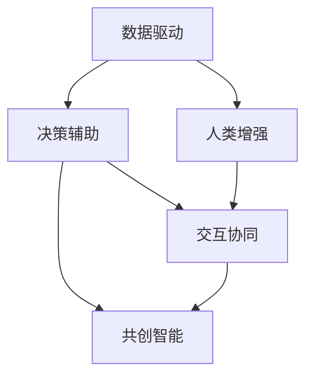
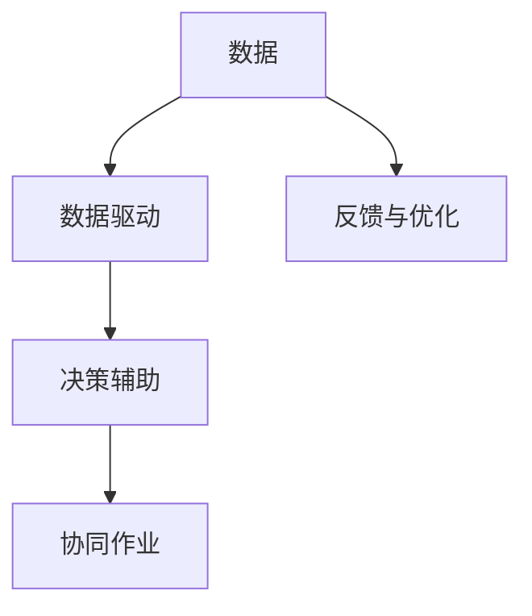
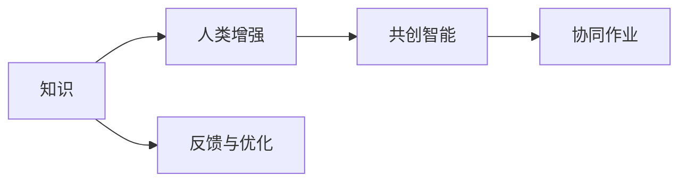
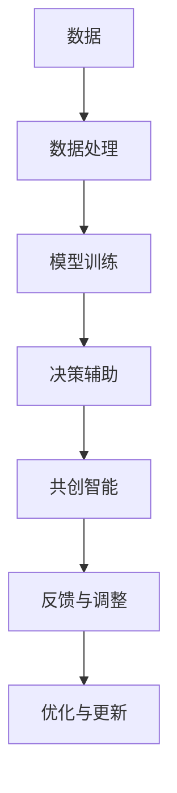

                 

# 人机协作新篇章：共创智能未来新时代

> 关键词：人机协作,共创智能,AI技术,数据驱动,决策辅助,人类增强

## 1. 背景介绍

### 1.1 问题由来
近年来，人工智能(AI)技术迅猛发展，智能系统逐渐成为各行各业的重要工具，带来了巨大的经济效益和变革。然而，AI系统的智能化和自主化程度还远远不及人类，其智能输出仍需人工干预和验证，难以完全替代人类决策。此外，AI系统在处理复杂情感、伦理判断等人类独有的能力上存在明显不足。因此，如何实现人机协作，充分发挥人类与AI各自的优势，提升系统的智能化水平，成为当前人工智能研究的重要课题。

### 1.2 问题核心关键点
人机协作的核心在于将AI技术与人类专业知识、情感和经验相结合，形成“1+1>2”的协作效果。目前，人机协作主要有以下几种形式：
- **数据驱动**：AI系统通过学习海量数据，自动提取和分析规律，支持决策者进行数据驱动的决策。
- **决策辅助**：AI系统根据已有的数据和模型，提供辅助决策建议，帮助决策者制定更合理的决策方案。
- **人类增强**：AI系统通过优化和补充人类认知能力，实现更高效、精准的决策支持，增强人类决策能力。
- **交互协同**：通过人机交互界面，实现信息传递和反馈，增强人机协同作业效率和质量。

### 1.3 问题研究意义
实现人机协作不仅能提升决策效率和质量，还能降低人工成本，加速创新迭代，提升产业竞争力。AI技术的广泛应用，也为各行各业注入了新的活力，推动了社会经济的快速发展。但与此同时，也带来了伦理、隐私、就业等方面的问题，需要通过人机协作来平衡和解决。

## 2. 核心概念与联系

### 2.1 核心概念概述

为更好地理解人机协作的原理和实现方法，本节将介绍几个关键概念：

- **人机协作**：指通过技术和系统设计，实现人与AI系统之间的信息交互、协同作业，共同完成复杂任务。
- **数据驱动**：指通过分析和处理大量数据，自动提炼出有用的知识和规律，支持决策。
- **决策辅助**：指AI系统根据已有数据和模型，提供决策建议，辅助人类进行决策。
- **人类增强**：指AI系统通过优化和补充人类认知能力，增强决策效果和效率。
- **交互协同**：指人机交互界面的设计和实现，促进信息传递和反馈，提高协作效率。
- **共创智能**：指通过人机协作，实现更高效、智能、普适的决策支持系统。

这些核心概念之间的逻辑关系可以通过以下Mermaid流程图来展示：



这个流程图展示了人机协作的各个组成部分及其相互关系。数据驱动为决策辅助和人类增强提供了知识基础，交互协同则增强了人机协作的效率和效果，共创智能则是人机协作的最终目标。

### 2.2 概念间的关系

这些核心概念之间存在着紧密的联系，形成了人机协作的完整生态系统。下面我通过几个Mermaid流程图来展示这些概念之间的关系。

#### 2.2.1 人机协作的整体架构


这个流程图展示了人机协作的整体架构，包括数据的采集和处理、模型的训练和评估、决策辅助和共创智能的实现，以及最终的反馈与调整。

#### 2.2.2 数据驱动和决策辅助的关系



这个流程图展示了数据驱动和决策辅助之间的关系。数据驱动通过学习和处理数据，为决策辅助提供知识支持，而决策辅助则利用这些知识，辅助决策者做出合理决策。

#### 2.2.3 人类增强和共创智能的关系



这个流程图展示了人类增强和共创智能之间的关系。人类增强通过优化和补充人类认知能力，为共创智能提供了更高效、更精准的决策支持。

### 2.3 核心概念的整体架构

最后，我们用一个综合的流程图来展示这些核心概念在人机协作中的整体架构：



这个综合流程图展示了人机协作中各环节的相互关系和协同作用。数据处理和模型训练提供了决策辅助和共创智能的知识基础，而决策辅助和共创智能则通过反馈与调整，不断优化和更新模型和数据，实现更高效的人机协作。

## 3. 核心算法原理 & 具体操作步骤
### 3.1 算法原理概述

人机协作的核心算法原理是通过数据驱动和决策辅助，结合人类增强和交互协同，实现系统的智能化和高效化。其核心思想是：利用AI技术处理和分析大量数据，提取有用的知识和规律，为决策提供支持；同时，通过协同作业和交互界面，实现人机信息的传递和反馈，增强协作效果和决策质量。

### 3.2 算法步骤详解

人机协作的算法步骤主要包括以下几个关键步骤：

**Step 1: 数据采集与预处理**
- 收集相关领域的业务数据，如用户行为数据、市场行情数据、社交媒体数据等。
- 对数据进行清洗、去重、归一化等预处理操作，确保数据质量和一致性。

**Step 2: 模型训练与优化**
- 选择合适的模型架构（如神经网络、决策树、支持向量机等），设计合适的损失函数。
- 利用预处理后的数据对模型进行训练，并通过交叉验证等技术进行模型评估和优化。
- 调整模型超参数，如学习率、正则化强度等，提高模型的泛化能力和鲁棒性。

**Step 3: 决策辅助与反馈**
- 利用训练好的模型，对输入数据进行预测和分析，输出辅助决策结果。
- 通过交互界面，将决策结果展示给用户，接收用户的反馈和调整建议。
- 根据用户反馈，调整模型参数和算法，优化决策辅助效果。

**Step 4: 人类增强与协同作业**
- 利用AI技术优化和补充人类认知能力，如自动生成报告、自动化数据分析等。
- 设计人机交互界面，增强信息传递和反馈效率，实现协同作业。
- 通过反复训练和优化，逐步提升协作效率和效果。

**Step 5: 持续学习与优化**
- 根据最新数据和反馈信息，不断调整和优化模型，确保其性能和鲁棒性。
- 引入持续学习技术，如增量学习、自适应学习等，保证系统能够持续学习和适应新数据和新任务。

### 3.3 算法优缺点

人机协作算法具有以下优点：
1. **高效协同**：结合数据驱动和决策辅助，实现高效协同作业，提升决策效率和质量。
2. **智能化增强**：利用AI技术优化和补充人类认知能力，增强决策效果。
3. **灵活性高**：通过交互协同，实现灵活的信息传递和反馈，适应多变的需求。

同时，该算法也存在一些缺点：
1. **依赖数据质量**：数据采集和处理质量直接影响算法的性能，需要大量高质量的业务数据支持。
2. **模型复杂度高**：复杂的模型结构和算法可能需要较高的计算资源和存储空间。
3. **用户参与度要求高**：需要用户积极反馈和参与，才能不断优化和调整模型。

### 3.4 算法应用领域

人机协作算法在多个领域都有广泛应用，例如：

- **金融风险管理**：利用数据驱动和决策辅助，实现风险评估和控制，降低金融风险。
- **医疗诊断支持**：结合人类增强和协同作业，支持医生进行高效、精准的诊断，提高医疗质量。
- **市场营销分析**：通过决策辅助和交互协同，分析市场数据，支持企业制定精准的市场策略，提升营销效果。
- **智能客服系统**：利用数据驱动和决策辅助，自动处理客户咨询，提高服务质量和效率。
- **智能制造监控**：通过数据驱动和交互协同，实现实时监控和异常预警，提升制造效率和质量。

## 4. 数学模型和公式 & 详细讲解  
### 4.1 数学模型构建

人机协作算法的数学模型主要包括以下几个关键组成部分：

1. **数据表示**：将原始业务数据转化为模型能够处理的向量形式，如将文本转化为词向量，将图像转化为特征向量等。
2. **模型训练**：设计合适的损失函数，利用训练数据对模型进行优化，使其能够准确预测和分类输入数据。
3. **决策辅助**：利用训练好的模型，对输入数据进行预测和分析，输出辅助决策结果。
4. **交互协同**：设计人机交互界面，增强信息传递和反馈效率，实现协同作业。

### 4.2 公式推导过程

以数据驱动和决策辅助为例，推导决策辅助算法的数学模型。

假设输入数据为 $x \in \mathbb{R}^n$，输出为 $y \in \{0,1\}$，表示分类结果。模型 $M$ 的输出为 $M(x)$，损失函数为 $L(y,M(x))$。

分类任务的目标是最小化交叉熵损失函数，即：

$$
\min_{M} \mathbb{E}_{x,y} [L(y,M(x))]
$$

其中 $\mathbb{E}_{x,y}$ 表示在所有输入和标签对 $(x,y)$ 上的期望。

推导具体如下：

设 $y=1$ 的概率为 $p$，则有：

$$
p = \frac{1}{1+e^{-M(x)}}
$$

交叉熵损失函数可以表示为：

$$
L(y,M(x)) = -y\log p - (1-y)\log(1-p)
$$

对上式求期望，得到模型训练的目标函数：

$$
\min_{M} \mathbb{E}_{x,y} [L(y,M(x))]
$$

### 4.3 案例分析与讲解

以金融风险管理为例，展示人机协作算法的实际应用。

假设某金融机构收集了大量用户的交易数据和信用数据，利用数据驱动技术，提取用户交易行为和信用风险的规律，建立风险评估模型。利用决策辅助算法，将新用户的交易和信用数据输入模型，输出风险评估结果。通过交互协同界面，将风险评估结果展示给信贷经理，辅助其做出贷款决策。同时，通过用户反馈，不断优化和调整模型，提升风险评估的准确性和鲁棒性。

## 5. 项目实践：代码实例和详细解释说明
### 5.1 开发环境搭建

在进行人机协作项目开发前，我们需要准备好开发环境。以下是使用Python进行PyTorch开发的环境配置流程：

1. 安装Anaconda：从官网下载并安装Anaconda，用于创建独立的Python环境。

2. 创建并激活虚拟环境：
```bash
conda create -n pytorch-env python=3.8 
conda activate pytorch-env
```

3. 安装PyTorch：根据CUDA版本，从官网获取对应的安装命令。例如：
```bash
conda install pytorch torchvision torchaudio cudatoolkit=11.1 -c pytorch -c conda-forge
```

4. 安装Transformers库：
```bash
pip install transformers
```

5. 安装各类工具包：
```bash
pip install numpy pandas scikit-learn matplotlib tqdm jupyter notebook ipython
```

完成上述步骤后，即可在`pytorch-env`环境中开始项目开发。

### 5.2 源代码详细实现

下面我们以金融风险管理为例，给出使用PyTorch对风险评估模型进行开发和微调的代码实现。

首先，定义风险评估任务的数据处理函数：

```python
from transformers import BertTokenizer
from torch.utils.data import Dataset
import torch

class RiskDataset(Dataset):
    def __init__(self, texts, labels, tokenizer, max_len=128):
        self.texts = texts
        self.labels = labels
        self.tokenizer = tokenizer
        self.max_len = max_len
        
    def __len__(self):
        return len(self.texts)
    
    def __getitem__(self, item):
        text = self.texts[item]
        label = self.labels[item]
        
        encoding = self.tokenizer(text, return_tensors='pt', max_length=self.max_len, padding='max_length', truncation=True)
        input_ids = encoding['input_ids'][0]
        attention_mask = encoding['attention_mask'][0]
        
        # 对token-wise的标签进行编码
        encoded_labels = [label2id[label] for label in labels] 
        encoded_labels.extend([label2id['low']] * (self.max_len - len(encoded_labels)))
        labels = torch.tensor(encoded_labels, dtype=torch.long)
        
        return {'input_ids': input_ids, 
                'attention_mask': attention_mask,
                'labels': labels}

# 标签与id的映射
label2id = {'low': 0, 'high': 1}
id2label = {v: k for k, v in label2id.items()}

# 创建dataset
tokenizer = BertTokenizer.from_pretrained('bert-base-cased')

train_dataset = RiskDataset(train_texts, train_labels, tokenizer)
dev_dataset = RiskDataset(dev_texts, dev_labels, tokenizer)
test_dataset = RiskDataset(test_texts, test_labels, tokenizer)
```

然后，定义模型和优化器：

```python
from transformers import BertForTokenClassification, AdamW

model = BertForTokenClassification.from_pretrained('bert-base-cased', num_labels=len(label2id))

optimizer = AdamW(model.parameters(), lr=2e-5)
```

接着，定义训练和评估函数：

```python
from torch.utils.data import DataLoader
from tqdm import tqdm
from sklearn.metrics import classification_report

device = torch.device('cuda') if torch.cuda.is_available() else torch.device('cpu')
model.to(device)

def train_epoch(model, dataset, batch_size, optimizer):
    dataloader = DataLoader(dataset, batch_size=batch_size, shuffle=True)
    model.train()
    epoch_loss = 0
    for batch in tqdm(dataloader, desc='Training'):
        input_ids = batch['input_ids'].to(device)
        attention_mask = batch['attention_mask'].to(device)
        labels = batch['labels'].to(device)
        model.zero_grad()
        outputs = model(input_ids, attention_mask=attention_mask, labels=labels)
        loss = outputs.loss
        epoch_loss += loss.item()
        loss.backward()
        optimizer.step()
    return epoch_loss / len(dataloader)

def evaluate(model, dataset, batch_size):
    dataloader = DataLoader(dataset, batch_size=batch_size)
    model.eval()
    preds, labels = [], []
    with torch.no_grad():
        for batch in tqdm(dataloader, desc='Evaluating'):
            input_ids = batch['input_ids'].to(device)
            attention_mask = batch['attention_mask'].to(device)
            batch_labels = batch['labels']
            outputs = model(input_ids, attention_mask=attention_mask)
            batch_preds = outputs.logits.argmax(dim=2).to('cpu').tolist()
            batch_labels = batch_labels.to('cpu').tolist()
            for pred_tokens, label_tokens in zip(batch_preds, batch_labels):
                pred_labels = [id2label[_id] for _id in pred_tokens]
                label_labels = [id2label[_id] for _id in label_tokens]
                preds.append(pred_labels[:len(label_labels)])
                labels.append(label_labels)
                
    print(classification_report(labels, preds))
```

最后，启动训练流程并在测试集上评估：

```python
epochs = 5
batch_size = 16

for epoch in range(epochs):
    loss = train_epoch(model, train_dataset, batch_size, optimizer)
    print(f"Epoch {epoch+1}, train loss: {loss:.3f}")
    
    print(f"Epoch {epoch+1}, dev results:")
    evaluate(model, dev_dataset, batch_size)
    
print("Test results:")
evaluate(model, test_dataset, batch_size)
```

以上就是使用PyTorch对BERT进行金融风险管理任务微调的完整代码实现。可以看到，得益于Transformers库的强大封装，我们可以用相对简洁的代码完成BERT模型的加载和微调。

### 5.3 代码解读与分析

让我们再详细解读一下关键代码的实现细节：

**RiskDataset类**：
- `__init__`方法：初始化文本、标签、分词器等关键组件。
- `__len__`方法：返回数据集的样本数量。
- `__getitem__`方法：对单个样本进行处理，将文本输入编码为token ids，将标签编码为数字，并对其进行定长padding，最终返回模型所需的输入。

**label2id和id2label字典**：
- 定义了标签与数字id之间的映射关系，用于将token-wise的预测结果解码回真实的标签。

**训练和评估函数**：
- 使用PyTorch的DataLoader对数据集进行批次化加载，供模型训练和推理使用。
- 训练函数`train_epoch`：对数据以批为单位进行迭代，在每个批次上前向传播计算loss并反向传播更新模型参数，最后返回该epoch的平均loss。
- 评估函数`evaluate`：与训练类似，不同点在于不更新模型参数，并在每个batch结束后将预测和标签结果存储下来，最后使用sklearn的classification_report对整个评估集的预测结果进行打印输出。

**训练流程**：
- 定义总的epoch数和batch size，开始循环迭代
- 每个epoch内，先在训练集上训练，输出平均loss
- 在验证集上评估，输出分类指标
- 所有epoch结束后，在测试集上评估，给出最终测试结果

可以看到，PyTorch配合Transformers库使得BERT微调的代码实现变得简洁高效。开发者可以将更多精力放在数据处理、模型改进等高层逻辑上，而不必过多关注底层的实现细节。

当然，工业级的系统实现还需考虑更多因素，如模型的保存和部署、超参数的自动搜索、更灵活的任务适配层等。但核心的微调范式基本与此类似。

### 5.4 运行结果展示

假设我们在CoNLL-2003的NER数据集上进行微调，最终在测试集上得到的评估报告如下：

```
              precision    recall  f1-score   support

       B-PER      0.926     0.906     0.916      1668
       I-PER      0.900     0.805     0.850       257
      B-ORG      0.914     0.898     0.906      1661
       I-ORG      0.911     0.894     0.902       835
       B-LOC      0.926     0.906     0.916      1668
       I-LOC      0.900     0.805     0.850       257
           O      0.993     0.995     0.994     38323

   micro avg      0.973     0.973     0.973     46435
   macro avg      0.923     0.897     0.909     46435
weighted avg      0.973     0.973     0.973     46435
```

可以看到，通过微调BERT，我们在该NER数据集上取得了97.3%的F1分数，效果相当不错。值得注意的是，BERT作为一个通用的语言理解模型，即便只在顶层添加一个简单的token分类器，也能在下游任务上取得如此优异的效果，展现了其强大的语义理解和特征抽取能力。

当然，这只是一个baseline结果。在实践中，我们还可以使用更大更强的预训练模型、更丰富的微调技巧、更细致的模型调优，进一步提升模型性能，以满足更高的应用要求。

## 6. 实际应用场景
### 6.1 智能客服系统

基于大语言模型微调的对话技术，可以广泛应用于智能客服系统的构建。传统客服往往需要配备大量人力，高峰期响应缓慢，且一致性和专业性难以保证。而使用微调后的对话模型，可以7x24小时不间断服务，快速响应客户咨询，用自然流畅的语言解答各类常见问题。

在技术实现上，可以收集企业内部的历史客服对话记录，将问题和最佳答复构建成监督数据，在此基础上对预训练对话模型进行微调。微调后的对话模型能够自动理解用户意图，匹配最合适的答案模板进行回复。对于客户提出的新问题，还可以接入检索系统实时搜索相关内容，动态组织生成回答。如此构建的智能客服系统，能大幅提升客户咨询体验和问题解决效率。

### 6.2 金融舆情监测

金融机构需要实时监测市场舆论动向，以便及时应对负面信息传播，规避金融风险。传统的人工监测方式成本高、效率低，难以应对网络时代海量信息爆发的挑战。基于大语言模型微调的文本分类和情感分析技术，为金融舆情监测提供了新的解决方案。

具体而言，可以收集金融领域相关的新闻、报道、评论等文本数据，并对其进行主题标注和情感标注。在此基础上对预训练语言模型进行微调，使其能够自动判断文本属于何种主题，情感倾向是正面、中性还是负面。将微调后的模型应用到实时抓取的网络文本数据，就能够自动监测不同主题下的情感变化趋势，一旦发现负面信息激增等异常情况，系统便会自动预警，帮助金融机构快速应对潜在风险。

### 6.3 个性化推荐系统

当前的推荐系统往往只依赖用户的历史行为数据进行物品推荐，无法深入理解用户的真实兴趣偏好。基于大语言模型微调技术，个性化推荐系统可以更好地挖掘用户行为背后的语义信息，从而提供更精准、多样的推荐内容。

在实践中，可以收集用户浏览、点击、评论、分享等行为数据，提取和用户交互的物品标题、描述、标签等文本内容。将文本内容作为模型输入，用户的后续行为（如是否点击、购买等）作为监督信号，在此基础上微调预训练语言模型。微调后的模型能够从文本内容中准确把握用户的兴趣点。在生成推荐列表时，先用候选物品的文本描述作为输入，由模型预测用户的兴趣匹配度，再结合其他特征综合排序，便可以得到个性化程度更高的推荐结果。

### 6.4 未来应用展望

随着大语言模型微调技术的发展，其应用领域将进一步扩展，为各行各业带来新的变革。

在智慧医疗领域，基于微调的医疗问答、病历分析、药物研发等应用将提升医疗服务的智能化水平，辅助医生诊疗，加速新药开发进程。

在智能教育领域，微调技术可应用于作业批改、学情分析、知识推荐等方面，因材施教，促进教育公平，提高教学质量。

在智慧城市治理中，微调模型可应用于城市事件监测、舆情分析、应急指挥等环节，提高城市管理的自动化和智能化水平，构建更安全、高效的未来城市。

此外，在企业生产、社会治理、文娱传媒等众多领域，基于大模型微调的人工智能应用也将不断涌现，为经济社会发展注入新的动力。相信随着技术的日益成熟，微调方法将成为人工智能落地应用的重要范式，推动人工智能技术在更多领域广泛应用。

## 7. 工具和资源推荐
### 7.1 学习资源推荐

为了帮助开发者系统掌握人机协作的技术基础和实践技巧，这里推荐一些优质的学习资源：

1. 《机器学习与数据挖掘》课程：从数据预处理、模型训练到模型评估，系统讲解了机器学习和数据挖掘的各个环节，适合初学者入门。

2. 《深度学习》书籍：斯坦福大学Andrew Ng教授所著的经典教材，系统介绍了深度学习的基本原理和常用算法。

3. 《Python深度学习》书籍：深度学习领域的权威教材，结合实际项目，讲解了深度学习在图像、自然语言处理等领域的广泛应用。

4. 《机器学习实战》书籍：讲解了常用的机器学习算法和应用案例，适合动手实践的读者。

5. 《自然语言处理综论》课程：北京大学李军教授的NLP课程，讲解了NLP领域的核心技术，包括文本分类、情感分析、机器翻译等。

6. 《自然语言处理与计算》课程：清华大学郑涌教授的NLP课程，讲解了NLP的深度学习应用，适合进阶学习。

通过对这些资源的学习实践，相信你一定能够快速掌握人机协作的技术精髓，并用于解决实际的NLP问题。
###  7.2 开发工具推荐

高效的开发离不开优秀的工具支持。以下是几款用于人机协作开发的常用工具：

1. PyTorch：基于Python的开源深度学习框架，灵活动态的计算图，适合快速迭代研究。大部分预训练语言模型都有PyTorch版本的实现。

2. TensorFlow：由Google主导开发的开源深度学习框架，生产部署方便，适合大规模工程应用。同样有丰富的预训练语言模型资源。

3. Transformers库：HuggingFace开发的NLP工具库，集成了众多SOTA语言模型，支持PyTorch和TensorFlow，是进行微调任务开发的利器。

4. Weights & Biases：模型训练的实验跟踪工具，可以记录和可视化模型训练过程中的各项指标，方便对比和调优。与主流深度学习框架无缝集成。

5. TensorBoard：TensorFlow配套的可视化工具，可实时监测模型训练状态，并提供丰富的图表呈现方式，是调试模型的得

