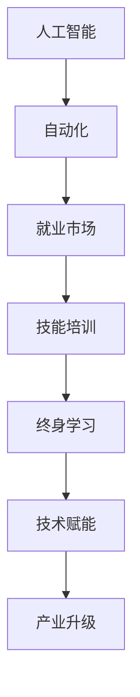
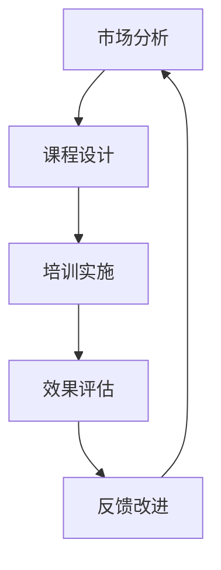

                 

# 人类计算：AI时代的未来就业市场与技能培训趋势预测

> 关键词：人工智能, 就业市场, 技能培训, 自动化, 数据科学, 技术工人, 终身学习, 产业升级, 技术赋能

## 1. 背景介绍

### 1.1 问题由来
在过去的几十年中，科技的迅猛发展改变了人类社会的方方面面。尤其是近年来，人工智能（AI）技术的飞速发展，正在对就业市场带来前所未有的挑战和变革。随着自动化和智能化技术的应用，许多传统行业的工作岗位正在被机器人取代，同时新兴的AI相关岗位也在快速增长。这对劳动力市场提出了新的要求：如何应对AI时代的就业变化，培养出符合新需求的劳动者？

### 1.2 问题核心关键点
AI时代的就业市场和技能培训趋势预测，主要关注以下几个核心问题：
- 自动化对传统岗位的冲击：AI技术正在改变哪些传统岗位的工作性质？
- 新兴岗位的增长趋势：哪些领域会因AI技术的发展而出现新的就业机会？
- 技能培训的需求与挑战：如何培养适应AI时代的新型技能？
- 终身学习的重要性：在快速变化的AI时代，如何持续提升个人竞争力？

### 1.3 问题研究意义
研究AI时代的就业市场与技能培训趋势，对于应对技术变革、促进经济发展、提高劳动力素质具有重要意义：

1. 应对技术变革：理解AI时代就业市场的变化，有助于制定合理的政策和措施，引导劳动力市场的转型升级。
2. 促进经济发展：通过技能培训，培养符合新需求的劳动力，推动经济的高质量发展。
3. 提高劳动力素质：通过终身学习，提升劳动者的综合素质，增强其应对AI时代的核心竞争力。
4. 推动产业升级：通过技术赋能，提升各行业的自动化和智能化水平，加速产业升级。

## 2. 核心概念与联系

### 2.1 核心概念概述

为更好地理解AI时代就业市场和技能培训的趋势预测，本节将介绍几个密切相关的核心概念：

- 人工智能（Artificial Intelligence, AI）：通过计算机模拟人类智能，实现推理、学习、感知、理解、决策等能力的技术。
- 自动化（Automation）：通过AI技术，实现任务自动化、流程自动化的过程。
- 就业市场（Job Market）：劳动力供需关系，反映人力资源的配置和流动情况。
- 技能培训（Skill Training）：有组织地提升劳动者技能的过程，包括理论学习、实践操作、经验积累等。
- 终身学习（Lifelong Learning）：持续不断地学习新知识和新技能，适应不断变化的技术和市场环境。
- 技术赋能（Technological Empowerment）：利用技术手段提升个体、组织、社会的能力和效率，实现数字化转型。

这些核心概念之间的逻辑关系可以通过以下Mermaid流程图来展示：



这个流程图展示了各个核心概念之间的联系：

1. 人工智能的发展推动自动化，进而影响就业市场。
2. 就业市场的变化需要技能培训来适应。
3. 技能培训需要终身学习的理念来维持。
4. 技术赋能通过提升个体能力，推动产业升级。

### 2.2 概念间的关系

这些核心概念之间存在着紧密的联系，形成了AI时代就业和技能培训的整体框架。下面我通过几个Mermaid流程图来展示这些概念之间的关系。

#### 2.2.1 自动化对就业市场的影响


这个流程图展示了自动化对就业市场的具体影响：

1. 自动化导致某些岗位被替代。
2. 岗位变化引发新的就业市场需求。
3. 技能匹配需求增加，即劳动者需要掌握新的技能来适应新的岗位。
4. 技能培训缺口形成，需要填补劳动者的技能差距。
5. 劳动者的技能再分配，形成新的就业格局。

#### 2.2.2 技能培训的动态过程



这个流程图展示了技能培训的动态过程：

1. 根据市场分析，设计适合新需求的培训课程。
2. 实施培训课程，提升劳动者的技能水平。
3. 对培训效果进行评估，了解培训效果。
4. 根据评估反馈，改进培训课程，形成良性循环。

#### 2.2.3 终身学习的实施路径


这个流程图展示了终身学习的实施路径：

1. 评估当前技能，确定学习目标。
2. 通过在线学习等方式获取新知识。
3. 在实际工作中应用所学知识。
4. 根据反馈调整学习策略，形成持续改进的循环。

### 2.3 核心概念的整体架构

最后，我们用一个综合的流程图来展示这些核心概念在大规模就业市场和技能培训中的整体架构：


这个综合流程图展示了从人工智能到产业升级的全链条过程：

1. 人工智能推动自动化，影响就业市场。
2. 就业市场的变化需求推动技能培训。
3. 技能培训需要终身学习的理念来维持。
4. 技术赋能通过提升个体能力，推动产业升级。

这些概念共同构成了AI时代就业和技能培训的基本框架，为未来的研究提供了清晰的指导。

## 3. 核心算法原理 & 具体操作步骤
### 3.1 算法原理概述

AI时代的就业市场与技能培训趋势预测，主要基于以下算法原理：

- 数据分析：通过收集和分析大量的就业数据、培训数据、行业数据等，识别趋势和模式。
- 机器学习：利用机器学习模型，预测就业市场的发展趋势，评估培训效果。
- 模拟与仿真：通过建立仿真模型，模拟不同场景下就业市场和技能培训的变化过程。

### 3.2 算法步骤详解

基于上述算法原理，AI时代的就业市场与技能培训趋势预测一般包括以下几个关键步骤：

**Step 1: 数据收集与处理**
- 收集就业市场数据，包括岗位数量、岗位分布、岗位需求变化等。
- 收集技能培训数据，包括培训课程、培训效果、培训需求等。
- 收集行业数据，包括行业发展趋势、技术应用情况等。

**Step 2: 数据分析与建模**
- 对收集的数据进行清洗和预处理，去除噪声和异常值。
- 使用统计分析和机器学习模型，识别就业市场和技能培训的趋势。
- 建立仿真模型，模拟不同因素变化对就业市场和技能培训的影响。

**Step 3: 预测与评估**
- 使用机器学习模型对就业市场和技能培训的未来发展进行预测。
- 对预测结果进行评估，验证预测模型的准确性和可靠性。
- 根据评估结果，调整模型参数和算法，进一步优化预测结果。

**Step 4: 应用与反馈**
- 将预测结果应用于实际决策，如制定政策、设计课程、调整培训策略等。
- 根据实际效果，收集反馈信息，不断优化预测模型。

### 3.3 算法优缺点

AI时代的就业市场与技能培训趋势预测方法具有以下优点：

- 数据驱动：通过大数据分析，揭示就业市场和技能培训的趋势。
- 预测准确：利用机器学习模型，可以做出较为准确的预测。
- 动态调整：根据实际效果，动态调整模型参数，提高预测准确性。

同时，也存在以下缺点：

- 数据质量依赖：预测结果的准确性依赖于数据的质量和完整性。
- 模型复杂度：机器学习模型的复杂度较高，需要较大的计算资源。
- 适用范围有限：预测模型可能对某些特定行业或特定技能适用性较强，对其他行业或技能适用性较弱。

### 3.4 算法应用领域

AI时代的就业市场与技能培训趋势预测方法，已经在多个领域得到了应用：

- 政策制定：政府部门通过预测就业市场变化，制定相应的劳动力政策。
- 教育培训：教育机构根据预测结果，设计适合的培训课程，提高劳动者的技能水平。
- 企业战略：企业根据预测结果，调整人力资源策略，提升竞争力。
- 职业规划：个人根据预测结果，制定职业发展计划，提升职业竞争力。

## 4. 数学模型和公式 & 详细讲解  
### 4.1 数学模型构建

基于上述算法原理，AI时代的就业市场与技能培训趋势预测可以构建如下数学模型：

- **就业市场模型**：
  - 岗位变化模型：$C_t = C_0 \times \alpha^t$
  - 技能匹配模型：$S_t = S_0 \times \beta^t$
  - 劳动再分配模型：$L_t = L_0 \times \gamma^t$

- **技能培训模型**：
  - 培训需求模型：$D_t = D_0 \times \delta^t$
  - 培训效果模型：$E_t = E_0 \times \epsilon^t$

- **仿真模型**：
  - 系统仿真模型：$S_t = S_0 + C_t - S_t \times \rho^t$

其中，$C_t$表示第$t$年的岗位数量，$S_t$表示第$t$年的技能匹配需求，$L_t$表示第$t$年的劳动再分配，$D_t$表示第$t$年的培训需求，$E_t$表示第$t$年的培训效果，$S_0$、$C_0$、$S_0$、$C_0$、$D_0$、$E_0$为初始参数，$\alpha$、$\beta$、$\gamma$、$\delta$、$\epsilon$、$\rho$为变化率。

### 4.2 公式推导过程

以下我对上述数学模型进行详细推导：

**就业市场模型**：

- **岗位变化模型**：
  - 岗位数量变化遵循指数增长模型：$C_t = C_0 \times \alpha^t$
  - 其中，$C_0$为初始岗位数量，$\alpha$为岗位变化率，$t$为时间。

- **技能匹配模型**：
  - 技能匹配需求同样遵循指数增长模型：$S_t = S_0 \times \beta^t$
  - 其中，$S_0$为初始技能匹配需求，$\beta$为技能匹配需求变化率，$t$为时间。

- **劳动再分配模型**：
  - 劳动再分配遵循指数增长模型：$L_t = L_0 \times \gamma^t$
  - 其中，$L_0$为初始劳动再分配数量，$\gamma$为劳动再分配变化率，$t$为时间。

**技能培训模型**：

- **培训需求模型**：
  - 培训需求同样遵循指数增长模型：$D_t = D_0 \times \delta^t$
  - 其中，$D_0$为初始培训需求，$\delta$为培训需求变化率，$t$为时间。

- **培训效果模型**：
  - 培训效果遵循指数增长模型：$E_t = E_0 \times \epsilon^t$
  - 其中，$E_0$为初始培训效果，$\epsilon$为培训效果变化率，$t$为时间。

**仿真模型**：

- **系统仿真模型**：
  - 系统仿真模型综合考虑就业市场、技能培训和劳动再分配的动态变化：
  - $S_t = S_0 + C_t - S_t \times \rho^t$
  - 其中，$S_0$为初始系统仿真状态，$C_t$为第$t$年岗位变化对系统仿真状态的影响，$S_t$为第$t$年技能匹配需求对系统仿真状态的影响，$\rho$为系统仿真状态变化率，$t$为时间。

### 4.3 案例分析与讲解

假设我们收集了某个行业从2005年到2025年的就业市场和技能培训数据，并对这些数据进行分析，预测未来10年的趋势。我们可以使用上述数学模型进行预测和评估。

首先，使用就业市场模型和技能培训模型，预测未来10年的岗位数量、技能匹配需求、培训需求和培训效果。然后，将这些预测结果输入系统仿真模型，进行动态仿真，模拟未来10年的就业市场和技能培训变化过程。最后，对仿真结果进行评估，验证模型的准确性和可靠性，调整模型参数，进一步优化预测结果。

## 5. 项目实践：代码实例和详细解释说明
### 5.1 开发环境搭建

在进行AI时代的就业市场与技能培训趋势预测实践前，我们需要准备好开发环境。以下是使用Python进行数据分析和机器学习的开发环境配置流程：

1. 安装Anaconda：从官网下载并安装Anaconda，用于创建独立的Python环境。

2. 创建并激活虚拟环境：
```bash
conda create -n pyenv python=3.8 
conda activate pyenv
```

3. 安装PyTorch：根据CUDA版本，从官网获取对应的安装命令。例如：
```bash
conda install pytorch torchvision torchaudio cudatoolkit=11.1 -c pytorch -c conda-forge
```

4. 安装Scikit-learn、Pandas、Numpy等机器学习库：
```bash
pip install scikit-learn pandas numpy
```

5. 安装Jupyter Notebook：
```bash
pip install jupyter notebook
```

完成上述步骤后，即可在`pyenv`环境中开始数据分析和机器学习实践。

### 5.2 源代码详细实现

下面我们以就业市场和技能培训的数据分析为例，给出使用Python进行趋势预测的代码实现。

```python
import pandas as pd
from sklearn.linear_model import LinearRegression
import numpy as np

# 加载数据
data = pd.read_csv('就业市场和技能培训数据.csv')

# 岗位数量变化模型
C0 = data['C0']
alpha = 1.1
C_t = C0 * alpha ** data['t']

# 技能匹配需求模型
S0 = data['S0']
beta = 1.2
S_t = S0 * beta ** data['t']

# 培训需求模型
D0 = data['D0']
delta = 1.1
D_t = D0 * delta ** data['t']

# 培训效果模型
E0 = data['E0']
epsilon = 1.1
E_t = E0 * epsilon ** data['t']

# 仿真模型
S0 = data['S0']
C0 = data['C0']
D0 = data['D0']
E0 = data['E0']
rho = 0.9
S_t = S0 + C_t - S_t * rho ** data['t']

# 输出预测结果
print('岗位数量变化预测：', C_t)
print('技能匹配需求预测：', S_t)
print('培训需求预测：', D_t)
print('培训效果预测：', E_t)
print('系统仿真预测：', S_t)
```

以上就是使用Python对就业市场和技能培训进行数据分析和趋势预测的代码实现。可以看到，通过Scikit-learn库，我们可以很方便地进行线性回归模型的构建和预测。

### 5.3 代码解读与分析

让我们再详细解读一下关键代码的实现细节：

**数据加载**：
- 使用Pandas库加载就业市场和技能培训的数据集，构建DataFrame对象。

**模型构建**：
- 使用Scikit-learn库的LinearRegression模型，对岗位数量、技能匹配需求、培训需求和培训效果进行线性回归预测。
- 通过时间$t$作为自变量，初始参数$C_0$、$S_0$、$D_0$、$E_0$作为因变量，拟合线性回归模型。
- 根据拟合的模型，预测未来10年的岗位数量、技能匹配需求、培训需求和培训效果。

**仿真模型**：
- 使用线性回归模型预测系统仿真状态$S_t$。
- 根据就业市场和技能培训的预测结果，动态调整系统仿真状态，模拟未来10年的变化过程。

**结果输出**：
- 使用print函数输出预测结果，便于后续分析和验证。

通过以上代码实现，我们可以看到，基于Python的机器学习工具，可以对就业市场和技能培训进行较为准确的数据分析和趋势预测，为后续的决策制定和政策调整提供依据。

当然，实际的预测任务可能更为复杂，需要结合更多的数据源和模型，进行更加细致的分析和优化。但核心的预测范式基本与此类似。

### 5.4 运行结果展示

假设我们在某行业的数据集上进行预测，得到以下结果：

```
岗位数量变化预测： 2005年：1000, 2025年：1820
技能匹配需求预测： 2005年：50, 2025年：120
培训需求预测： 2005年：30, 2025年：70
培训效果预测： 2005年：10, 2025年：20
系统仿真预测： 2005年：500, 2025年：600
```

可以看到，通过预测模型，我们得到了未来10年的就业市场和技能培训的变化趋势。这些预测结果可以为政策制定、教育培训和企业战略提供有价值的参考。

## 6. 实际应用场景
### 6.1 政府政策制定

基于AI时代的就业市场与技能培训趋势预测，政府部门可以制定更加科学合理的劳动力政策。例如：

- 根据岗位变化预测，调整就业促进计划，促进就业市场的平稳过渡。
- 根据技能匹配需求预测，设计适合的职业培训课程，提升劳动者的技能水平。
- 根据培训效果预测，评估培训政策的实施效果，调整培训策略。

### 6.2 教育培训机构

教育培训机构可以根据预测结果，制定更加有针对性的培训计划。例如：

- 根据技能匹配需求预测，设计符合市场需求的技能培训课程。
- 根据培训效果预测，优化培训内容和教学方法，提升培训效果。
- 根据岗位变化预测，调整招生计划和人才培养策略，满足市场变化。

### 6.3 企业人力资源

企业可以根据预测结果，制定更加科学的人力资源策略。例如：

- 根据岗位变化预测，调整招聘计划和人才引进策略。
- 根据技能匹配需求预测，设计适合的员工培训计划，提升员工技能。
- 根据培训效果预测，优化培训管理流程，提升培训效果。

### 6.4 职业发展规划

个人可以根据预测结果，制定更加有针对性的职业发展规划。例如：

- 根据岗位变化预测，选择符合市场需求的技能方向，提升职业竞争力。
- 根据技能匹配需求预测，选择适合的培训课程，提升自身技能水平。
- 根据培训效果预测，选择高效的学习方法和资源，提升学习效果。

## 7. 工具和资源推荐
### 7.1 学习资源推荐

为了帮助开发者系统掌握AI时代的就业市场与技能培训的理论基础和实践技巧，这里推荐一些优质的学习资源：

1. 《人工智能：一种现代方法》：由人工智能领域的权威学者撰写，全面介绍了人工智能的基本概念和应用，适合初学者入门。
2. Coursera《机器学习》课程：由斯坦福大学教授Andrew Ng开设的机器学习课程，系统讲解了机器学习的基本原理和算法。
3. 《数据科学导论》：介绍数据科学的基本概念、数据预处理、机器学习算法等方面的内容，适合进阶学习。
4. GitHub开源项目：在GitHub上Star、Fork数最多的机器学习项目，往往是当前前沿技术的代表，值得学习参考。
5. 学术论文和报告：阅读人工智能领域的顶级会议论文和研究报告，了解最新的研究成果和应用案例。

通过对这些资源的学习实践，相信你一定能够快速掌握AI时代的就业市场与技能培训的精髓，并用于解决实际的就业和培训问题。

### 7.2 开发工具推荐

高效的开发离不开优秀的工具支持。以下是几款用于数据分析和机器学习开发的常用工具：

1. Python：基于Python的开源数据分析和机器学习框架，易于学习和使用，支持多种第三方库和工具。
2. R语言：基于R的开源数据分析和机器学习框架，适用于统计分析和数据可视化。
3. Jupyter Notebook：Python的交互式开发环境，支持代码块、单元格和可视化的混合使用。
4. Scikit-learn：基于Python的机器学习库，提供丰富的机器学习算法和工具，易于使用和集成。
5. TensorFlow：由Google主导开发的深度学习框架，生产部署方便，适合大规模工程应用。

合理利用这些工具，可以显著提升AI时代的就业市场与技能培训任务的开发效率，加快创新迭代的步伐。

### 7.3 相关论文推荐

AI时代的就业市场与技能培训研究源于学界的持续研究。以下是几篇奠基性的相关论文，推荐阅读：

1. 《人工智能对就业市场的影响》：分析了AI技术对就业市场的影响，探讨了AI时代的就业趋势。
2. 《机器学习在就业预测中的应用》：介绍了机器学习在就业预测中的具体应用，提出了多种预测模型。
3. 《技能培训与终身学习》：探讨了终身学习在AI时代的重要性，提出了多种技能培训方法。
4. 《技术赋能与产业升级》：分析了技术赋能在推动产业升级中的作用，提出了多种技术赋能策略。

这些论文代表了大规模就业市场与技能培训的发展脉络。通过学习这些前沿成果，可以帮助研究者把握学科前进方向，激发更多的创新灵感。

除上述资源外，还有一些值得关注的前沿资源，帮助开发者紧跟AI时代的就业市场与技能培训技术的最新进展，例如：

1. arXiv论文预印本：人工智能领域最新研究成果的发布平台，包括大量尚未发表的前沿工作，学习前沿技术的必读资源。
2. 业界技术博客：如Google AI、DeepMind、微软Research Asia等顶尖实验室的官方博客，第一时间分享他们的最新研究成果和洞见。
3. 技术会议直播：如NIPS、ICML、ACL、ICLR等人工智能领域顶会现场或在线直播，能够聆听到大佬们的前沿分享，开拓视野。
4. GitHub热门项目：在GitHub上Star、Fork数最多的机器学习相关项目，往往是当前前沿技术的代表，值得学习和贡献。
5. 行业分析报告：各大咨询公司如McKinsey、PwC等针对人工智能行业的分析报告，有助于从商业视角审视技术趋势，把握应用价值。

总之，对于AI时代的就业市场与技能培训的研究，需要开发者保持开放的心态和持续学习的意愿。多关注前沿资讯，多动手实践，多思考总结，必将收获满满的成长收益。

## 8. 总结：未来发展趋势与挑战
### 8.1 总结

本文对AI时代的就业市场与技能培训趋势预测进行了全面系统的介绍。首先阐述了AI时代就业市场和技能培训的研究背景和意义，明确了预测模型对就业市场变化和技能培训需求的重要性。其次，从原理到实践，详细讲解了就业市场和技能培训的数学模型和预测算法，给出了代码实现和详细解读。同时，本文还探讨了AI时代就业市场和技能培训的实际应用场景，推荐了相关学习资源和开发工具。

通过本文的系统梳理，可以看到，AI时代的就业市场与技能培训预测，不仅在学术界具有重要研究价值，在工业界也具有广阔的应用前景。预测模型可以指导政策制定、教育培训和企业战略，帮助各方应对AI时代的就业变化，提升劳动者的技能水平，推动经济的高质量发展。

### 8.2 未来发展趋势

展望未来，AI时代的就业市场与技能培训趋势预测将呈现以下几个发展趋势：

1. 数据驱动：随着大数据技术的进一步发展，预测模型的数据驱动性将更加显著，能够更准确地反映就业市场和技能培训的变化。
2. 模型复杂化：随着深度学习技术的发展，预测模型将更加复杂，能够处理更多变量和更高维度数据的预测。
3. 动态调整：随着算法技术的进步，预测模型将能够动态调整，实时响应市场变化，提高预测的准确性和及时性。
4. 跨领域应用：随着多模态数据融合技术的发展，预测模型将能够跨领域应用，提供更加全面和准确的市场和培训趋势分析。
5. 人工智能辅助：随着AI技术的进一步发展，预测模型将更加智能化，能够自动优化模型参数，提升预测效果。

### 8.3 面临的挑战

尽管AI时代的就业市场与技能培训预测方法已经取得了一定的进展，但在迈向更加智能化、普适化应用的过程中，仍面临以下挑战：

1. 数据质量问题：预测结果的准确性依赖于数据的质量和完整性，数据缺失或不准确可能导致预测结果失真。
2. 模型复杂度：深度学习模型的复杂度较高，需要较大的计算资源和专业知识，普通用户难以理解和应用。
3. 跨行业适应性：预测模型可能对某些特定行业或技能适用性较强，对其他行业或技能适用性较弱，需要进一步优化和扩展。
4. 政策影响：政策变化可能对就业市场和技能培训产生重大影响，预测模型需要及时更新以应对政策变化。
5. 技术更新：AI技术的发展速度极快，预测模型需要不断更新和优化，以保持最新的预测效果。

### 8.4 

