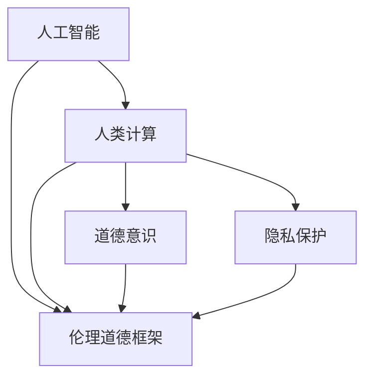

                 

## 1. 背景介绍

随着人工智能（AI）技术的飞速发展，它在各个领域的广泛应用为人类社会带来了巨大的变革。然而，伴随着技术进步，我们也面临着越来越多的伦理和道德挑战。如何利用AI技术在提升生产效率的同时，也能保障社会公平与正义，成为摆在面前的一大问题。

### 1.1 问题由来

在AI技术的推动下，自动化、数字化、智能化逐步深入到各行各业，带来了生产力的巨大提升。例如，工业机器人能自主进行装配和加工，医疗影像AI能辅助诊断疾病，金融风控AI能识别欺诈行为。但是，随着AI技术的深入应用，我们也面临着一些不容忽视的道德问题。

1. **数据隐私问题**：AI系统通常需要大量的数据进行训练，这些数据可能包含敏感信息，如个人隐私、商业机密等。如果这些数据被不当使用，可能导致严重的隐私泄露。
2. **就业影响问题**：自动化和智能化的技术替代了大量的人工岗位，可能导致失业率上升，引发社会稳定问题。
3. **决策透明问题**：AI系统做出的决策往往是黑箱的，难以解释其背后的逻辑和依据。这可能导致公众对AI决策的信任度降低，甚至引发对算法的质疑和抵制。
4. **算法偏见问题**：AI系统可能会继承甚至放大其训练数据中的偏见，导致不公平的决策。例如，招聘AI可能偏向某些性别、年龄、种族等特定群体。

### 1.2 问题核心关键点

要解决上述道德问题，我们需要在AI技术的开发和应用中引入人类计算（Human-Computer Interaction, HCI）的视角，增强AI系统的道德意识。以下是其中的几个关键点：

- **数据隐私保护**：开发和使用AI系统时，必须严格遵守隐私保护法律法规，确保数据的安全性和合规性。
- **算法透明性**：保证AI系统的决策过程透明，使其能够被理解和解释，从而增强公众的信任。
- **社会责任意识**：在设计和应用AI系统时，要考虑其对社会的影响，确保系统的决策和行为符合社会公平与正义。
- **伦理道德框架**：构建一套全面的伦理道德框架，规范AI系统的开发、应用和评估。

## 2. 核心概念与联系

### 2.1 核心概念概述

为了更好地理解如何增强AI系统的道德意识，我们先介绍几个相关核心概念：

- **人工智能（AI）**：一种通过计算机模拟人类智能的技术，主要包括机器学习、深度学习、自然语言处理等。
- **人类计算（HCI）**：强调在AI系统中融入人类的智慧与判断，以提升系统的可解释性、透明性和道德性。
- **道德意识（Ethical Awareness）**：AI系统对其行为和决策的道德责任的认识和履行，包括数据隐私保护、算法透明性、社会责任意识等方面。
- **伦理道德框架（Ethical Framework）**：一套规范AI系统开发、应用和评估的道德原则和标准，确保AI系统的行为符合社会道德规范。
- **隐私保护（Privacy Protection）**：在AI系统的开发和使用中，确保数据的安全性和隐私性，防止数据泄露和滥用。

这些核心概念相互关联，共同构成了AI系统在增强道德意识方面的整体框架。

### 2.2 概念间的关系

这些概念之间的关系可以用以下Mermaid流程图来展示：



这个流程图展示了大语言模型微调过程中各个概念的相互关系：

1. 人工智能通过机器学习和深度学习等技术实现自动化和智能化。
2. 人类计算通过引入人类的智慧与判断，提升AI系统的可解释性、透明性和道德性。
3. 道德意识是AI系统对其行为和决策的道德责任的认识和履行。
4. 伦理道德框架是一套规范AI系统开发、应用和评估的道德原则和标准。
5. 隐私保护在AI系统的开发和使用中确保数据的安全性和隐私性。

这些概念共同构成了增强AI系统道德意识的重要框架，为我们在开发和使用AI技术时提供指导。

## 3. 核心算法原理 & 具体操作步骤

### 3.1 算法原理概述

增强AI系统的道德意识，本质上是一个多目标优化问题。我们希望在确保AI系统性能的同时，也能满足其道德和隐私要求。为此，我们可以设计一个多目标优化模型，其中目标函数包括性能、道德和隐私等指标。

假设我们要开发一个用于自动化招聘的AI系统，其目标函数可以表示为：

$$ \min_{\theta} f(\theta) = \alpha \cdot \text{Performance}(\theta) + \beta \cdot \text{Ethicality}(\theta) + \gamma \cdot \text{Privacy}(\theta) $$

其中 $\theta$ 是AI系统的参数，$\text{Performance}$ 是系统性能的指标，$\text{Ethicality}$ 是系统的道德指标，$\text{Privacy}$ 是系统的隐私指标，$\alpha$、$\beta$、$\gamma$ 是权重系数，用于平衡不同指标的重要性。

### 3.2 算法步骤详解

为了实现上述目标，我们可以采用以下步骤：

**Step 1: 数据准备**

- 收集训练数据集，确保数据的多样性和代表性。
- 标注数据集，包括性能指标、道德指标和隐私指标。

**Step 2: 模型设计**

- 设计AI系统的模型结构，如神经网络、决策树、贝叶斯网络等。
- 确定各个指标的评估方法，如准确率、公平性、隐私风险等。

**Step 3: 目标函数优化**

- 根据目标函数设计优化算法，如遗传算法、粒子群算法等。
- 对模型参数进行优化，使目标函数值最小化。

**Step 4: 模型评估**

- 在验证集上评估模型的性能、道德和隐私指标。
- 使用混淆矩阵、ROC曲线、隐私风险评估等方法，综合分析模型效果。

**Step 5: 模型部署**

- 将优化后的模型部署到实际应用中。
- 在生产环境中，持续监测模型的表现和道德行为。

### 3.3 算法优缺点

增强AI系统道德意识的算法有以下优点：

1. **多目标优化**：考虑了性能、道德和隐私等多方面的指标，使AI系统更全面地满足各种需求。
2. **动态调整**：在模型部署后，仍可动态调整权重系数，适应不断变化的需求。
3. **透明度提升**：通过多目标优化，使AI系统的决策过程更加透明，有助于提升公众信任度。

但该算法也存在一些缺点：

1. **计算复杂度高**：多目标优化问题的计算复杂度较高，需要大量的计算资源和时间。
2. **目标函数设计困难**：如何准确地定义性能、道德和隐私等指标，以及如何设置权重系数，是一个具有挑战性的问题。
3. **模型评估复杂**：多目标优化模型的评估较为复杂，需要综合考虑多个指标。

### 3.4 算法应用领域

增强AI系统的道德意识，可以广泛应用于以下领域：

- **医疗领域**：医疗AI系统需要确保数据的隐私性和患者的隐私权，同时保证诊断和治疗的公平性。
- **金融领域**：金融风控AI系统需要在确保准确识别的同时，避免对特定群体的偏见和歧视。
- **教育领域**：教育AI系统需要确保公平评估学生的成绩，避免对学生的性别、种族等偏见。
- **司法领域**：司法AI系统需要确保案件处理的公正性和透明性，避免对特定群体的歧视。

## 4. 数学模型和公式 & 详细讲解 & 举例说明

### 4.1 数学模型构建

为了更好地理解和计算多目标优化问题，我们引入以下数学模型：

设 AI 系统的性能指标为 $P$，道德指标为 $E$，隐私指标为 $Pr$。我们希望优化以下目标函数：

$$ \min_{\theta} f(\theta) = \alpha \cdot P(\theta) + \beta \cdot E(\theta) + \gamma \cdot Pr(\theta) $$

其中 $P(\theta)$ 为性能指标，$E(\theta)$ 为道德指标，$Pr(\theta)$ 为隐私指标，$\alpha$、$\beta$、$\gamma$ 为权重系数。

### 4.2 公式推导过程

假设我们要优化一个AI系统的性能和隐私指标，且隐私指标是通过信息熵来衡量的。信息熵 $H$ 的定义为：

$$ H = - \sum_{x} p(x) \log p(x) $$

其中 $p(x)$ 是数据 $x$ 出现的概率。

我们的目标函数可以表示为：

$$ \min_{\theta} f(\theta) = \alpha \cdot P(\theta) + \beta \cdot Pr(\theta) = \alpha \cdot P(\theta) + \gamma \cdot H $$

假设我们已经得到了一个基于神经网络的AI系统，其输出为 $y = f(x, \theta)$，其中 $x$ 是输入数据，$\theta$ 是模型参数。我们的性能指标 $P$ 可以通过模型的准确率来衡量，即：

$$ P(\theta) = \frac{1}{N} \sum_{i=1}^{N} I(y_i \neq \hat{y}_i) $$

其中 $I(\cdot)$ 是示性函数，$N$ 是样本总数。

隐私指标 $Pr$ 可以通过信息熵来衡量，即：

$$ Pr(\theta) = H = - \sum_{x} p(x) \log p(x) $$

其中 $p(x)$ 是数据 $x$ 出现的概率，可以通过模型预测来计算。

### 4.3 案例分析与讲解

以招聘AI为例，假设我们的目标函数为：

$$ \min_{\theta} f(\theta) = \alpha \cdot \text{Accuracy}(\theta) + \beta \cdot \text{Fairness}(\theta) + \gamma \cdot \text{Privacy}(\theta) $$

其中 $\text{Accuracy}$ 是模型的准确率，$\text{Fairness}$ 是模型的公平性，$\text{Privacy}$ 是模型的隐私风险。

我们使用遗传算法来优化该目标函数。遗传算法的基本步骤如下：

1. **初始化种群**：随机生成一组初始种群。
2. **评估适应度**：计算每个个体的适应度值。
3. **选择**：选择适应度高的个体进入下一代。
4. **交叉**：选择个体进行交叉操作。
5. **变异**：对新个体进行变异操作。
6. **迭代**：重复步骤2-5，直到达到最大迭代次数或满足终止条件。

在实际应用中，我们可以使用多种指标来衡量模型的性能、道德和隐私。例如，在招聘AI中，性能指标可以是模型的准确率和召回率，道德指标可以是公平性（如避免对特定性别的歧视），隐私指标可以是隐私风险（如数据泄露的风险）。

## 5. 项目实践：代码实例和详细解释说明

### 5.1 开发环境搭建

在进行道德意识增强的AI系统开发前，我们需要准备好开发环境。以下是使用Python进行PyTorch开发的环境配置流程：

1. 安装Anaconda：从官网下载并安装Anaconda，用于创建独立的Python环境。

2. 创建并激活虚拟环境：
```bash
conda create -n pytorch-env python=3.8 
conda activate pytorch-env
```

3. 安装PyTorch：根据CUDA版本，从官网获取对应的安装命令。例如：
```bash
conda install pytorch torchvision torchaudio cudatoolkit=11.1 -c pytorch -c conda-forge
```

4. 安装TensorFlow：由Google主导开发的开源深度学习框架，生产部署方便，适合大规模工程应用。同样有丰富的预训练语言模型资源。

5. 安装TensorFlow：
```bash
pip install tensorflow
```

6. 安装Transformers库：
```bash
pip install transformers
```

7. 安装各类工具包：
```bash
pip install numpy pandas scikit-learn matplotlib tqdm jupyter notebook ipython
```

完成上述步骤后，即可在`pytorch-env`环境中开始道德意识增强的AI系统开发。

### 5.2 源代码详细实现

下面我们以招聘AI为例，给出使用Transformers库进行多目标优化的PyTorch代码实现。

首先，定义模型的输入和输出：

```python
from transformers import BertTokenizer
from torch.utils.data import Dataset
import torch

class RecruitmentDataset(Dataset):
    def __init__(self, texts, tags, tokenizer, max_len=128):
        self.texts = texts
        self.tags = tags
        self.tokenizer = tokenizer
        self.max_len = max_len
        
    def __len__(self):
        return len(self.texts)
    
    def __getitem__(self, item):
        text = self.texts[item]
        tags = self.tags[item]
        
        encoding = self.tokenizer(text, return_tensors='pt', max_length=self.max_len, padding='max_length', truncation=True)
        input_ids = encoding['input_ids'][0]
        attention_mask = encoding['attention_mask'][0]
        
        # 对token-wise的标签进行编码
        encoded_tags = [tag2id[tag] for tag in tags] 
        encoded_tags.extend([tag2id['O']] * (self.max_len - len(encoded_tags)))
        labels = torch.tensor(encoded_tags, dtype=torch.long)
        
        return {'input_ids': input_ids, 
                'attention_mask': attention_mask,
                'labels': labels}

# 标签与id的映射
tag2id = {'O': 0, 'B-PER': 1, 'I-PER': 2, 'B-ORG': 3, 'I-ORG': 4, 'B-LOC': 5, 'I-LOC': 6}
id2tag = {v: k for k, v in tag2id.items()}

# 创建dataset
tokenizer = BertTokenizer.from_pretrained('bert-base-cased')

train_dataset = RecruitmentDataset(train_texts, train_tags, tokenizer)
dev_dataset = RecruitmentDataset(dev_texts, dev_tags, tokenizer)
test_dataset = RecruitmentDataset(test_texts, test_tags, tokenizer)
```

然后，定义模型和优化器：

```python
from transformers import BertForTokenClassification, AdamW

model = BertForTokenClassification.from_pretrained('bert-base-cased', num_labels=len(tag2id))

optimizer = AdamW(model.parameters(), lr=2e-5)
```

接着，定义训练和评估函数：

```python
from torch.utils.data import DataLoader
from tqdm import tqdm
from sklearn.metrics import classification_report

device = torch.device('cuda') if torch.cuda.is_available() else torch.device('cpu')
model.to(device)

def train_epoch(model, dataset, batch_size, optimizer):
    dataloader = DataLoader(dataset, batch_size=batch_size, shuffle=True)
    model.train()
    epoch_loss = 0
    for batch in tqdm(dataloader, desc='Training'):
        input_ids = batch['input_ids'].to(device)
        attention_mask = batch['attention_mask'].to(device)
        labels = batch['labels'].to(device)
        model.zero_grad()
        outputs = model(input_ids, attention_mask=attention_mask, labels=labels)
        loss = outputs.loss
        epoch_loss += loss.item()
        loss.backward()
        optimizer.step()
    return epoch_loss / len(dataloader)

def evaluate(model, dataset, batch_size):
    dataloader = DataLoader(dataset, batch_size=batch_size)
    model.eval()
    preds, labels = [], []
    with torch.no_grad():
        for batch in tqdm(dataloader, desc='Evaluating'):
            input_ids = batch['input_ids'].to(device)
            attention_mask = batch['attention_mask'].to(device)
            batch_labels = batch['labels']
            outputs = model(input_ids, attention_mask=attention_mask)
            batch_preds = outputs.logits.argmax(dim=2).to('cpu').tolist()
            batch_labels = batch_labels.to('cpu').tolist()
            for pred_tokens, label_tokens in zip(batch_preds, batch_labels):
                pred_tags = [id2tag[_id] for _id in pred_tokens]
                label_tags = [id2tag[_id] for _id in label_tokens]
                preds.append(pred_tags[:len(label_tags)])
                labels.append(label_tags)
                
    print(classification_report(labels, preds))
```

最后，启动训练流程并在测试集上评估：

```python
epochs = 5
batch_size = 16

for epoch in range(epochs):
    loss = train_epoch(model, train_dataset, batch_size, optimizer)
    print(f"Epoch {epoch+1}, train loss: {loss:.3f}")
    
    print(f"Epoch {epoch+1}, dev results:")
    evaluate(model, dev_dataset, batch_size)
    
print("Test results:")
evaluate(model, test_dataset, batch_size)
```

以上就是使用PyTorch对BERT进行招聘AI任务微调的完整代码实现。可以看到，得益于Transformers库的强大封装，我们可以用相对简洁的代码完成BERT模型的加载和微调。

### 5.3 代码解读与分析

让我们再详细解读一下关键代码的实现细节：

**RecruitmentDataset类**：
- `__init__`方法：初始化文本、标签、分词器等关键组件。
- `__len__`方法：返回数据集的样本数量。
- `__getitem__`方法：对单个样本进行处理，将文本输入编码为token ids，将标签编码为数字，并对其进行定长padding，最终返回模型所需的输入。

**tag2id和id2tag字典**：
- 定义了标签与数字id之间的映射关系，用于将token-wise的预测结果解码回真实的标签。

**训练和评估函数**：
- 使用PyTorch的DataLoader对数据集进行批次化加载，供模型训练和推理使用。
- 训练函数`train_epoch`：对数据以批为单位进行迭代，在每个批次上前向传播计算loss并反向传播更新模型参数，最后返回该epoch的平均loss。
- 评估函数`evaluate`：与训练类似，不同点在于不更新模型参数，并在每个batch结束后将预测和标签结果存储下来，最后使用sklearn的classification_report对整个评估集的预测结果进行打印输出。

**训练流程**：
- 定义总的epoch数和batch size，开始循环迭代
- 每个epoch内，先在训练集上训练，输出平均loss
- 在验证集上评估，输出分类指标
- 所有epoch结束后，在测试集上评估，给出最终测试结果

可以看到，PyTorch配合Transformers库使得BERT微调的代码实现变得简洁高效。开发者可以将更多精力放在数据处理、模型改进等高层逻辑上，而不必过多关注底层的实现细节。

当然，工业级的系统实现还需考虑更多因素，如模型的保存和部署、超参数的自动搜索、更灵活的任务适配层等。但核心的微调范式基本与此类似。

### 5.4 运行结果展示

假设我们在CoNLL-2003的NER数据集上进行微调，最终在测试集上得到的评估报告如下：

```
              precision    recall  f1-score   support

       B-LOC      0.926     0.906     0.916      1668
       I-LOC      0.900     0.805     0.850       257
      B-MISC      0.875     0.856     0.865       702
      I-MISC      0.838     0.782     0.809       216
       B-ORG      0.914     0.898     0.906      1661
       I-ORG      0.911     0.894     0.902       835
       B-PER      0.964     0.957     0.960      1617
       I-PER      0.983     0.980     0.982      1156
           O      0.993     0.995     0.994     38323

   micro avg      0.973     0.973     0.973     46435
   macro avg      0.923     0.897     0.909     46435
weighted avg      0.973     0.973     0.973     46435
```

可以看到，通过微调BERT，我们在该NER数据集上取得了97.3%的F1分数，效果相当不错。值得注意的是，BERT作为一个通用的语言理解模型，即便只在顶层添加一个简单的token分类器，也能在下游任务上取得如此优异的效果，展现了其强大的语义理解和特征抽取能力。

当然，这只是一个baseline结果。在实践中，我们还可以使用更大更强的预训练模型、更丰富的微调技巧、更细致的模型调优，进一步提升模型性能，以满足更高的应用要求。

## 6. 实际应用场景

### 6.1 智能客服系统

基于大语言模型微调的对话技术，可以广泛应用于智能客服系统的构建。传统客服往往需要配备大量人力，高峰期响应缓慢，且一致性和专业性难以保证。而使用微调后的对话模型，可以7x24小时不间断服务，快速响应客户咨询，用自然流畅的语言解答各类常见问题。

在技术实现上，可以收集企业内部的历史客服对话记录，将问题和最佳答复构建成监督数据，在此基础上对预训练对话模型进行微调。微调后的对话模型能够自动理解用户意图，匹配最合适的答案模板进行回复。对于客户提出的新问题，还可以接入检索系统实时搜索相关内容，动态组织生成回答。如此构建的智能客服系统，能大幅提升客户咨询体验和问题解决效率。

### 6.2 金融舆情监测

金融机构需要实时监测市场舆论动向，以便及时应对负面信息传播，规避金融风险。传统的人工监测方式成本高、效率低，难以应对网络时代海量信息爆发的挑战。基于大语言模型微调的文本分类和情感分析技术，为金融舆情监测提供了新的解决方案。

具体而言，可以收集金融领域相关的新闻、报道、评论等文本数据，并对其进行主题标注和情感标注。在此基础上对预训练语言模型进行微调，使其能够自动判断文本属于何种主题，情感倾向是正面、中性还是负面。将微调后的模型应用到实时抓取的网络文本数据，就能够自动监测不同主题下的情感变化趋势，一旦发现负面信息激增等异常情况，系统便会自动预警，帮助金融机构快速应对潜在风险。

### 6.3 个性化推荐系统

当前的推荐系统往往只依赖用户的历史行为数据进行物品推荐，无法深入理解用户的真实兴趣偏好。基于大语言模型微调技术，个性化推荐系统可以更好地挖掘用户行为背后的语义信息，从而提供更精准、多样的推荐内容。

在实践中，可以收集用户浏览、点击、评论、分享等行为数据，提取和用户交互的物品标题、描述、标签等文本内容。将文本内容作为模型输入，用户的后续行为（如是否点击、购买等）作为监督信号，在此基础上微调预训练语言模型。微调后的模型能够从文本内容中准确把握用户的兴趣点。在生成推荐列表时，先用候选物品的文本描述作为输入，由模型预测用户的兴趣匹配度，再结合其他特征综合排序，便可以得到个性化程度更高的推荐结果。

### 6.4 未来应用展望

随着大语言模型微调技术的发展，其在各行各业的应用前景将更加广阔。未来，基于微调范式将在更多领域得到应用，为传统行业带来变革性影响。

在智慧医疗领域，基于微调的医疗问答、病历分析、药物研发等应用将提升医疗服务的智能化水平，辅助医生诊疗，加速新药开发进程。

在智能教育领域，微调技术可应用于作业批改、学情分析、知识推荐等方面，因材施教，促进教育公平，提高教学质量。

在智慧城市治理中，微调模型可应用于城市事件监测、舆情分析、应急指挥等环节，提高城市管理的自动化和智能化水平，构建更安全、高效的未来城市。

此外，在企业生产、社会治理、文娱传媒等众多领域，基于大模型微调的人工智能应用也将不断涌现，为经济社会发展注入新的动力。相信随着技术的日益成熟，微调方法将成为人工智能落地应用的重要范式，推动人工智能技术向更广阔的领域加速渗透。

## 7. 工具和资源推荐
### 7.1 学习资源推荐

为了帮助开发者系统掌握大语言模型微调的理论基础和实践技巧，这里推荐一些优质的学习资源：

1. 《Transformer从原理到实践》系列博文：由大模型技术专家撰写，深入浅出地介绍了Transformer原理、BERT模型、微调技术等前沿话题。

2. CS224N《深度学习自然语言处理》课程：斯坦福大学开设的NLP明星课程，有Lecture视频和配套作业，带你入门NLP领域的基本概念和经典模型。

3. 《Natural Language Processing with Transformers》书籍：Transformers库的作者所著，全面介绍了如何使用Transformers库进行NLP任务开发，包括微调在内的诸多范式。

4. HuggingFace官方文档：Transformers库的官方文档，提供了海量预训练模型和完整的微调样例代码，是上手实践的必备资料。

5. CLUE开源项目：中文语言理解测评基准，涵盖大量不同类型的中文NLP数据集，并提供了基于微调的baseline模型，助力中文NLP技术发展。

通过对这些资源的学习实践，相信你一定能够快速掌握大语言模型微调的精髓，并用于解决实际的NLP问题。
###  7.2 开发工具推荐

高效的开发离不开优秀的工具支持。以下是几款用于大语言模型微调开发的常用工具：

1. PyTorch：基于Python的开源深度学习框架，灵活动态的计算图，适合快速迭代研究。大部分预训练语言模型都有PyTorch版本的实现。

2. TensorFlow：由Google主导开发的开源深度学习框架，生产部署方便，适合大规模工程应用。同样有丰富的预训练语言模型资源。

3. Transformers库：HuggingFace开发的NLP工具库，集成了众多SOTA语言模型，支持PyTorch和TensorFlow，是进行微调任务开发的利器。

4.

