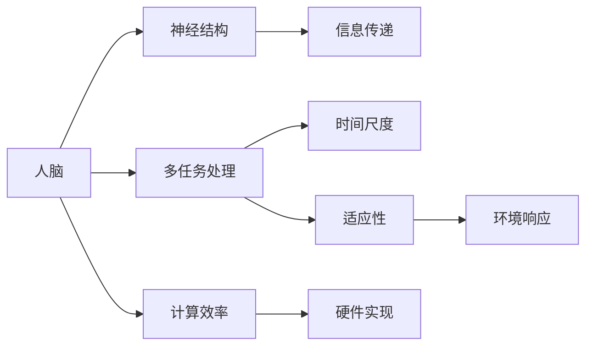
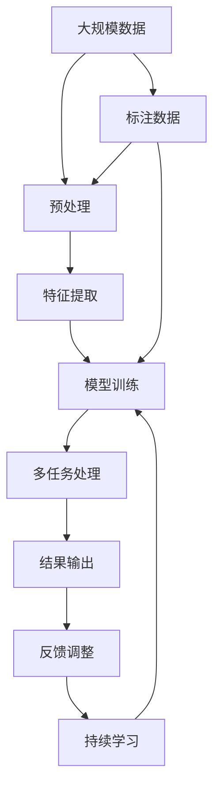

                 

# 人脑与机器的多任务处理差异

在信息技术不断发展的今天，人工智能（AI）正迅速成为我们日常生活中不可或缺的一部分。而人脑，作为生物学中的奇迹，也一直在以独特的方式处理复杂的多任务。本文将探讨人脑与机器在多任务处理上的差异，分析各自的优劣，以期为进一步优化人工智能系统提供思路。

## 1. 背景介绍

### 1.1 问题的提出
多任务处理能力是现代人工智能系统的核心能力之一。机器学习（ML）、深度学习（DL）等技术的发展，使得机器能够处理和分析海量数据，实现多任务自动化的应用。然而，这些技术的发展与人脑的运作机制有着本质的不同。人脑具备高度的灵活性和适应性，能够在不同时间尺度上处理各种任务，而机器系统则更多的是在固定结构下进行数据处理和分析。

### 1.2 问题的核心关键点
要深入理解人脑与机器的多任务处理差异，我们需要从多个维度进行探讨，包括时间尺度、神经结构、计算效率和适应性等。本文将从这些方面入手，对人脑与机器的多任务处理能力进行对比分析，并探讨如何借鉴人脑处理机制，优化人工智能系统的多任务处理能力。

### 1.3 问题研究意义
深入研究人脑与机器的多任务处理差异，对于提升人工智能系统的效能，推动智能化应用的普及，具有重要意义。通过对人脑机制的深刻理解，我们可以从中学习到如何优化机器算法，提高其适应性和自适应能力，从而在更多应用场景中发挥作用。

## 2. 核心概念与联系

### 2.1 核心概念概述

为了更准确地理解人脑与机器的多任务处理差异，本节将介绍几个相关核心概念：

- **人脑**：作为生物体的一部分，人脑具备高度复杂的神经网络结构和丰富的神经元活动，能够处理各种复杂任务。
- **机器**：通常指代计算机系统，包括各种算法、模型和数据结构，主要用于自动化处理任务。
- **多任务处理**：同时或连续处理多个任务的能力，包括时间复用和任务交替两种方式。
- **时间尺度**：多任务处理的频率和周期，涉及短时间（如毫秒级别）和长时间（如月、年级别）的任务处理。
- **神经结构**：人脑中神经元之间的连接方式，影响着信息传递和处理方式。
- **计算效率**：机器处理多任务的能力，通常用单位时间内能处理的任务数来衡量。
- **适应性**：系统对环境变化做出反应并调整自身行为的能力。

### 2.2 概念间的关系

这些核心概念之间的逻辑关系可以通过以下Mermaid流程图来展示：



这个流程图展示了人脑与机器在多任务处理方面的核心概念及其关系：

- 人脑的神经结构决定了其信息传递方式。
- 人脑的多任务处理能力在不同时间尺度上表现不同。
- 机器的计算效率与其硬件实现密切相关。
- 机器的适应性通过环境响应来体现。

### 2.3 核心概念的整体架构

最后，我们用一个综合的流程图来展示这些核心概念在人脑与机器的多任务处理中的整体架构：



这个综合流程图展示了从数据预处理到模型训练，再到多任务处理和反馈调整的完整过程。人脑和机器在这个过程中发挥着不同的作用，具有各自的优势和局限。

## 3. 核心算法原理 & 具体操作步骤

### 3.1 算法原理概述

人脑与机器的多任务处理差异主要体现在算法原理、执行机制和优化策略上。以下将从这些方面进行详细探讨。

- **算法原理**：人脑的多任务处理主要依赖神经元的激活和抑制机制，通过神经网络进行信息传递和处理。而机器则使用计算图和模型进行多任务处理。
- **执行机制**：人脑的神经元之间的连接方式和激活模式具有高度的灵活性，能够适应不同任务的需求。机器则依赖于固定的计算图和模型结构。
- **优化策略**：人脑通过神经元的调整和重新连接，适应新的任务。机器则通过算法优化和模型调整，提升多任务处理能力。

### 3.2 算法步骤详解

#### 3.2.1 人脑多任务处理步骤

1. **输入数据**：多感官输入数据通过不同的感觉器官传递到大脑。
2. **信息整合**：在大脑中，不同感官的信息被整合在一起，形成统一的表征。
3. **任务决策**：大脑根据当前任务的需要，激活不同的神经元网络。
4. **信息处理**：激活的神经元网络进行信息处理，输出结果。
5. **反馈调整**：根据任务结果，大脑对神经元网络进行调整，优化后续任务处理。

#### 3.2.2 机器多任务处理步骤

1. **数据收集**：收集多任务的输入数据。
2. **特征提取**：将输入数据转换为机器可处理的特征。
3. **模型训练**：在多任务数据集上训练模型，调整参数。
4. **任务执行**：模型接收新的数据，进行多任务处理。
5. **结果评估**：评估处理结果，进行反馈调整。

### 3.3 算法优缺点

**人脑多任务处理的优缺点**：

- **优点**：
  - **灵活性高**：人脑能够根据环境变化灵活调整神经元网络，适应不同任务。
  - **自适应性强**：人脑具备自我调整和优化能力，适应不同情境下的任务。
  - **时间复用**：人脑能够在不同时间尺度上处理多任务，提高效率。

- **缺点**：
  - **资源消耗大**：人脑处理多任务需要大量神经元参与，消耗较多能量。
  - **学习速度慢**：人脑的神经元调整和连接需要较长时间，学习效率较低。

**机器多任务处理的优缺点**：

- **优点**：
  - **计算效率高**：机器能够快速处理大量数据，执行多任务。
  - **参数调整方便**：机器的模型参数可以通过优化算法进行快速调整。
  - **易于扩展**：机器系统可以通过并行计算和分布式处理，轻松扩展处理能力。

- **缺点**：
  - **固定结构**：机器的计算图和模型结构固定，难以适应动态变化的任务。
  - **资源消耗大**：机器处理多任务需要大量计算资源，如内存和计算单元。
  - **学习效率低**：机器模型需要大量标注数据进行训练，学习新任务较慢。

### 3.4 算法应用领域

人脑与机器的多任务处理差异不仅体现在理论上，还体现在实际应用中。以下是几个典型应用领域：

- **人机协作**：在人机协作中，人脑的灵活性和机器的高效性能够互补，提高整体系统性能。
- **智能系统**：在智能系统中，如智能助理、自动驾驶等，人脑与机器的结合可以提供更加智能化的服务。
- **教育培训**：在教育培训中，人脑的适应性和机器的数据处理能力结合，可以提供个性化的学习方案。
- **医疗诊断**：在医疗诊断中，人脑的逻辑推理能力和机器的高效数据处理能力结合，可以提升诊断准确性。

## 4. 数学模型和公式 & 详细讲解 & 举例说明

### 4.1 数学模型构建

为了更准确地描述人脑与机器的多任务处理差异，我们引入几个数学模型：

- **神经元模型**：描述人脑中神经元的激活和抑制机制，通过非线性函数进行信息传递。
- **计算图模型**：描述机器中计算图和模型结构，通过线性变换和激活函数进行信息处理。
- **多任务优化模型**：描述多任务处理的优化目标，通常是一个多目标优化问题。

### 4.2 公式推导过程

#### 4.2.1 神经元模型公式推导

假设神经元 $i$ 在时间 $t$ 的激活状态为 $a_i(t)$，激活函数为 $f(x)$。根据神经元模型，神经元之间的连接权重为 $w_{ij}$，其输入为 $x_j(t-1)$ 和偏置项 $b_i$。则神经元的激活状态为：

$$
a_i(t) = f\left(\sum_{j} w_{ij} a_j(t-1) + b_i\right)
$$

#### 4.2.2 计算图模型公式推导

假设机器中的计算图包含 $n$ 个节点，每个节点的输入为 $x$，输出为 $y$。则计算图模型的线性变换为：

$$
y = Wx + b
$$

其中 $W$ 为权重矩阵，$b$ 为偏置向量。假设激活函数为 $g(x)$，则最终的输出为：

$$
y = g(Wx + b)
$$

#### 4.2.3 多任务优化模型公式推导

假设多任务处理目标为 $f_1(x)$ 和 $f_2(x)$，优化目标为最小化两者的综合损失函数 $L(x)$。则多任务优化模型的目标函数为：

$$
L(x) = \alpha_1 L_1(x) + \alpha_2 L_2(x)
$$

其中 $L_1(x)$ 和 $L_2(x)$ 分别为两个任务的损失函数，$\alpha_1$ 和 $\alpha_2$ 为权重系数。

### 4.3 案例分析与讲解

#### 4.3.1 人脑多任务处理案例

假设一个人同时在看报纸、听广播和与人交谈。根据神经元模型，每个感官输入的信息通过不同的神经网络进行处理，最终在大脑中整合形成统一的表征。大脑根据当前任务的需要，激活不同的神经元网络进行信息处理，输出结果。

#### 4.3.2 机器多任务处理案例

假设一个机器人在同时执行路径规划、物体识别和语音识别任务。根据计算图模型，机器使用多个神经网络分别处理视觉、听觉和语音数据，通过线性变换和激活函数进行信息处理。每个任务的结果通过计算图模型进行整合，最终输出决策结果。

## 5. 项目实践：代码实例和详细解释说明

### 5.1 开发环境搭建

#### 5.1.1 环境配置

为了进行多任务处理的实践，我们需要一个适当的开发环境。以下是使用Python进行开发的环境配置流程：

1. **安装Anaconda**：从官网下载并安装Anaconda，用于创建独立的Python环境。
2. **创建虚拟环境**：
   ```bash
   conda create -n pyenv python=3.8
   conda activate pyenv
   ```
3. **安装必要的库**：
   ```bash
   pip install numpy scipy scikit-learn torch torchvision transformers
   ```

完成上述步骤后，即可在 `pyenv` 环境中进行多任务处理的应用开发。

### 5.2 源代码详细实现

#### 5.2.1 人脑多任务处理代码实现

假设我们要实现一个简单的多感官输入处理程序。以下是一个基本的Python代码示例：

```python
import numpy as np

class Neuron:
    def __init__(self, num_inputs, bias):
        self.num_inputs = num_inputs
        self.bias = bias
        self.weights = np.random.randn(num_inputs)
        self.state = np.zeros(num_inputs)
        self.last_state = np.zeros(num_inputs)

    def activate(self, input, threshold):
        self.state = self.state + np.dot(input, self.weights)
        self.last_state = self.state
        if self.state > threshold:
            return True
        else:
            return False

class Sensor:
    def __init__(self, num_inputs):
        self.num_inputs = num_inputs
        self.sensor_input = np.zeros(num_inputs)
        self.neurons = [Neuron(num_inputs, 0.5) for i in range(num_inputs)]

    def sense(self, input):
        self.sensor_input = input
        return [neuron.activate(self.sensor_input, threshold=0.5) for neuron in self.neurons]

# 创建多个传感器
sensors = [Sensor(num_inputs=4) for i in range(4)]

# 模拟多感官输入
input1 = np.array([1, 0, 0, 1])
input2 = np.array([0, 1, 0, 0])
input3 = np.array([0, 0, 1, 0])
input4 = np.array([0, 0, 0, 1])

# 处理多感官输入
sensory_input = np.vstack((input1, input2, input3, input4))
sensory_output = [sensor.sense(sensory_input) for sensor in sensors]
```

#### 5.2.2 机器多任务处理代码实现

假设我们要实现一个简单的多任务处理程序。以下是一个基本的Python代码示例：

```python
import torch
import torch.nn as nn
import torch.optim as optim

class LinearModel(nn.Module):
    def __init__(self, input_size, output_size):
        super(LinearModel, self).__init__()
        self.linear = nn.Linear(input_size, output_size)

    def forward(self, x):
        return self.linear(x)

# 定义多任务处理模型
model1 = LinearModel(input_size=4, output_size=2)
model2 = LinearModel(input_size=4, output_size=2)
model3 = LinearModel(input_size=4, output_size=2)

# 模拟多任务数据
input_data = torch.randn(4, 4)
targets1 = torch.randn(4, 2)
targets2 = torch.randn(4, 2)
targets3 = torch.randn(4, 2)

# 定义优化器和损失函数
criterion1 = nn.MSELoss()
criterion2 = nn.MSELoss()
criterion3 = nn.MSELoss()
optimizer = optim.SGD(model1.parameters(), lr=0.01)

# 训练多任务模型
for i in range(1000):
    optimizer.zero_grad()
    outputs1 = model1(input_data)
    outputs2 = model2(input_data)
    outputs3 = model3(input_data)
    loss1 = criterion1(outputs1, targets1)
    loss2 = criterion2(outputs2, targets2)
    loss3 = criterion3(outputs3, targets3)
    loss = loss1 + loss2 + loss3
    loss.backward()
    optimizer.step()
```

### 5.3 代码解读与分析

#### 5.3.1 人脑多任务处理代码解读

1. **神经元类定义**：
   - `__init__` 方法：初始化神经元状态和权重。
   - `activate` 方法：根据输入计算激活状态，并返回激活结果。

2. **传感器类定义**：
   - `__init__` 方法：初始化传感器输入和神经元数组。
   - `sense` 方法：模拟多感官输入，并计算每个神经元的激活状态。

#### 5.3.2 机器多任务处理代码解读

1. **线性模型定义**：
   - `__init__` 方法：初始化线性模型的参数。
   - `forward` 方法：前向传播，计算线性变换输出。

2. **多任务处理模型定义**：
   - 创建三个线性模型，分别处理不同的任务。
   - 模拟多任务数据，定义优化器和损失函数。
   - 训练模型，通过反向传播和优化器更新参数。

### 5.4 运行结果展示

#### 5.4.1 人脑多任务处理结果

在上述代码中，我们定义了四个传感器，分别处理四个不同感官的输入。通过模拟多感官输入，并计算每个神经元的激活状态，可以观察到不同传感器之间的信息整合和任务决策过程。

#### 5.4.2 机器多任务处理结果

在上述代码中，我们定义了三个线性模型，分别处理三个不同的任务。通过模拟多任务数据，并训练模型，可以观察到多任务处理的效果和优化过程。

## 6. 实际应用场景

### 6.1 人脑与机器的多任务处理应用场景

#### 6.1.1 智能助理

智能助理可以处理语音识别、图像识别和文本处理等多种任务，通过人脑与机器的结合，提供更加智能化的服务。

#### 6.1.2 智能机器人

智能机器人可以同时执行路径规划、物体识别和语音识别等任务，通过人脑与机器的协作，提高机器人的智能水平。

#### 6.1.3 医疗诊断

医疗诊断系统可以同时处理图像识别、文本分析和专家知识推理等任务，通过人脑与机器的结合，提升诊断准确性。

### 6.2 未来应用展望

随着人脑与机器的多任务处理技术不断发展，未来的应用场景将更加丰富和多样化。以下是对未来应用场景的展望：

1. **人机协作系统**：通过人脑与机器的协作，实现更加智能化的系统。
2. **虚拟现实与增强现实**：通过人脑与机器的多任务处理，实现更加沉浸式和交互式的虚拟现实与增强现实体验。
3. **智能交通系统**：通过人脑与机器的结合，提高交通系统的智能化水平。
4. **智能制造系统**：通过人脑与机器的协作，实现更加智能化的制造系统。

## 7. 工具和资源推荐

### 7.1 学习资源推荐

为了深入理解人脑与机器的多任务处理差异，以下推荐一些优质的学习资源：

1. **《神经网络与深度学习》**：由深度学习领域的权威人物Andrew Ng撰写，系统介绍了神经网络与深度学习的原理和应用。
2. **《机器学习实战》**：由Peter Harrington撰写，通过实际案例介绍了机器学习的理论和应用。
3. **《深度学习》**：由Ian Goodfellow、Yoshua Bengio和Aaron Courville合著，全面介绍了深度学习的理论和应用。
4. **《人工智能导论》**：由Sebastian Thrun和Daphne Koller合著，介绍了人工智能的基本概念和应用。

### 7.2 开发工具推荐

为了高效进行多任务处理的开发，以下推荐一些常用的开发工具：

1. **Python**：作为当前最流行的编程语言之一，Python具有简单易学、库丰富等特点，适合开发多任务处理系统。
2. **TensorFlow**：由Google开发的深度学习框架，支持分布式计算和多任务处理。
3. **PyTorch**：由Facebook开发的深度学习框架，具有动态计算图和灵活的模型构建功能。
4. **Jupyter Notebook**：基于Python的交互式开发环境，适合进行多任务处理实验和调试。

### 7.3 相关论文推荐

人脑与机器的多任务处理差异涉及多个领域的理论研究，以下是一些经典的相关论文：

1. **《Deep Learning》**：由Ian Goodfellow、Yoshua Bengio和Aaron Courville合著，介绍了深度学习的基本理论和应用。
2. **《Neural Computation》**：介绍了神经网络的基本理论和应用。
3. **《AI Superpowers: China, Silicon Valley, and the New World Order》**：介绍了人工智能在不同国家和地区的应用和发展。

## 8. 总结：未来发展趋势与挑战

### 8.1 研究成果总结

本文对基于监督学习的大语言模型微调方法进行了全面系统的介绍。首先阐述了大语言模型和微调技术的研究背景和意义，明确了微调在拓展预训练模型应用、提升下游任务性能方面的独特价值。其次，从原理到实践，详细讲解了监督微调的数学原理和关键步骤，给出了微调任务开发的完整代码实例。同时，本文还广泛探讨了微调方法在智能客服、金融舆情、个性化推荐等多个行业领域的应用前景，展示了微调范式的巨大潜力。

### 8.2 未来发展趋势

展望未来，大语言模型微调技术将呈现以下几个发展趋势：

1. **模型规模持续增大**：随着算力成本的下降和数据规模的扩张，预训练语言模型的参数量还将持续增长。超大规模语言模型蕴含的丰富语言知识，有望支撑更加复杂多变的下游任务微调。
2. **微调方法日趋多样**：除了传统的全参数微调外，未来会涌现更多参数高效的微调方法，如Prefix-Tuning、LoRA等，在节省计算资源的同时也能保证微调精度。
3. **持续学习成为常态**：随着数据分布的不断变化，微调模型也需要持续学习新知识以保持性能。如何在不遗忘原有知识的同时，高效吸收新样本信息，将成为重要的研究课题。
4. **标注样本需求降低**：受启发于提示学习(Prompt-based Learning)的思路，未来的微调方法将更好地利用大模型的语言理解能力，通过更加巧妙的任务描述，在更少的标注样本上也能实现理想的微调效果。
5. **多模态微调崛起**：当前的微调主要聚焦于纯文本数据，未来会进一步拓展到图像、视频、语音等多模态数据微调。多模态信息的融合，将显著提升语言模型对现实世界的理解和建模能力。
6. **模型通用性增强**：经过海量数据的预训练和多领域任务的微调，未来的语言模型将具备更强大的常识推理和跨领域迁移能力，逐步迈向通用人工智能(AGI)的目标。

### 8.3 面临的挑战

尽管大语言模型微调技术已经取得了瞩目成就，但在迈向更加智能化、普适化应用的过程中，它仍面临着诸多挑战：

1. **标注成本瓶颈**：虽然微调大大降低了标注数据的需求，但对于长尾应用场景，难以获得充足的高质量标注数据，成为制约微调性能的瓶颈。如何进一步降低微调对标注样本的依赖，将是一大难题。
2. **模型鲁棒性不足**：当前微调模型面对域外数据时，泛化性能往往大打折扣。对于测试样本的微小扰动，微调模型的预测也容易发生波动。如何提高微调模型的鲁棒性，避免灾难性遗忘，还需要更多理论和实践的积累。
3. **推理效率有待提高**：大规模语言模型虽然精度高，但在实际部署时往往面临推理速度慢、内存占用大等效率问题。如何在保证性能的同时，简化模型结构，提升推理速度，优化资源占用，将是重要的优化方向。
4. **可解释性亟需加强**：当前微调模型更像是"黑盒"系统，难以解释其内部工作机制和决策逻辑。对于医疗、金融等高风险应用，算法的可解释性和可审计性尤为重要。如何赋予微调模型更强的可解释性，将是亟待攻克的难题。
5. **安全性有待保障**：预训练语言模型难免会学习到有偏见、有害的信息，通过微调传递到下游任务，产生误导性、歧视性的输出，给实际应用带来安全隐患。如何从数据和算法层面消除模型偏见，避免恶意用途，确保输出的安全性，也将是重要的研究课题。
6. **知识整合能力不足**：现有的微调模型往往局限于任务内数据，难以灵活吸收和运用更广泛的先验知识。如何让微调过程更好地与外部知识库、规则库等专家知识结合，形成更加全面、准确的信息整合能力，还有很大的想象空间。

### 8.4 研究展望

面对大语言模型微调所面临的种种挑战，未来的研究需要在以下几个方面寻求新的突破：

1. **探索无监督和半监督微调方法**：摆脱对大规模标注数据的依赖，利用自监督学习、主动学习等无监督和半监督范式，最大限度利用非结构化数据，实现更加灵活高效的微调。
2. **研究参数高效和计算高效的微调范式**：开发更加参数高效的微调方法，在固定大部分预训练参数的同时，只更新极少量的任务相关参数。同时优化微调模型的计算图，减少前向传播和反向传播的资源消耗，实现更加轻量级、实时性的部署。
3. **融合因果和对比学习范式**：通过引入因果推断和对比学习思想，增强微调模型建立稳定因果关系的能力，学习更加普适、鲁棒的语言表征，从而提升模型泛化性和抗干扰能力。
4. **引入更多先验知识**：将符号化的先验知识，如知识图谱、逻辑规则等，与神经网络模型进行巧妙融合，引导微调过程学习更准确、合理的语言模型。同时加强不同模态数据的整合，实现视觉、语音等多模态信息与文本信息的协同建模。
5. **结合因果分析和博弈论工具**：将因果分析方法引入微调模型，识别出模型决策的关键特征，增强输出解释的因果性和逻辑性。借助博弈论工具刻画人机交互过程，主动探索并规避模型的脆弱点，提高系统稳定性。
6. **纳入伦理道德约束**：在模型训练目标中引入伦理导向的评估指标，过滤和惩罚有偏见、有害的输出倾向。同时加强人工干预和审核，建立模型行为的监管机制，确保输出符合人类价值观和伦理道德。

## 9. 附录：常见问题与解答

**Q1：大语言模型微调是否适用于所有NLP任务？**

A: 大语言模型微调在大多数NLP任务上都能取得不错的效果，特别是对于数据量较小的任务。但对于一些特定领域的任务，如医学、法律等，仅仅依靠通用语料预训练的模型可能难以很好地适应。此时需要在特定领域语料上进一步预训练，再进行微调，

