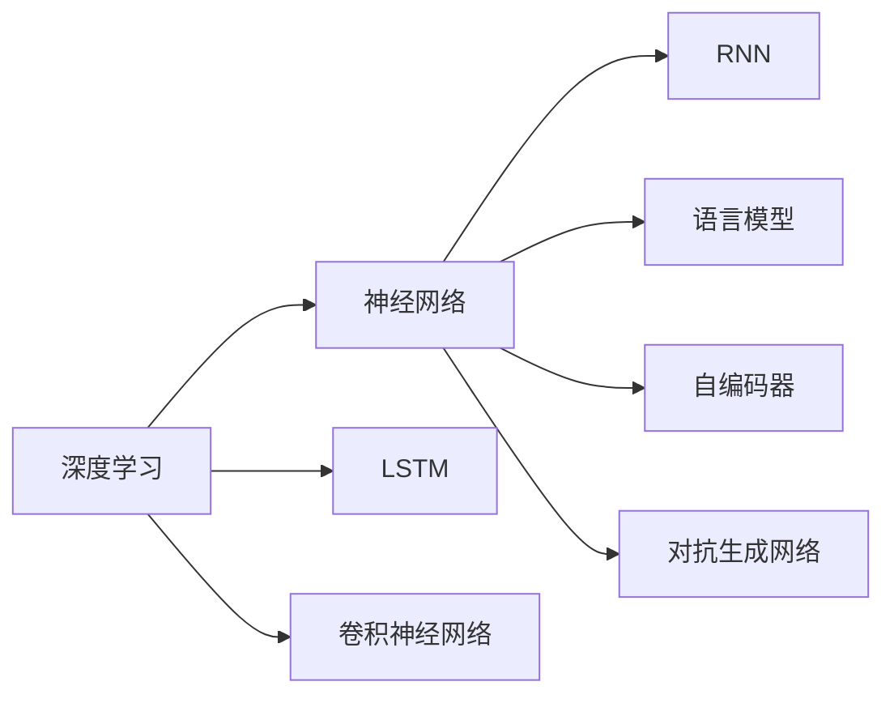
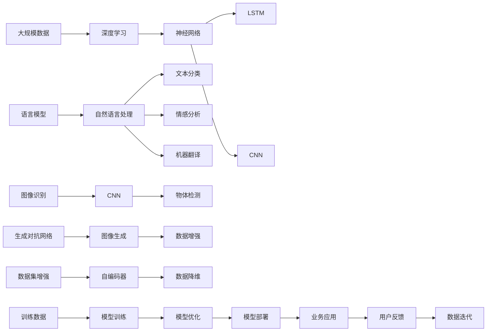

                 

# 从概念到实践：思想的转化

> 关键词：
  - 概念理解
  - 实践转化
  - 算法优化
  - 场景应用
  - 未来展望

## 1. 背景介绍

### 1.1 问题由来

在当今科技高速发展的时代，人工智能(AI)技术已成为推动社会进步的重要力量。AI技术涉及多个领域，如自然语言处理(NLP)、计算机视觉、机器学习等，其中许多前沿技术和思想都源于对现有理论概念的理解和实践转化。

以自然语言处理为例，NLP技术的突破离不开深度学习、语言模型、神经网络等核心概念。深度学习通过模拟人脑神经网络的工作机制，赋予计算机强大的学习能力；语言模型则基于大量语料训练，构建语言符号之间的概率分布；神经网络则利用多层处理单元，捕捉数据间的复杂关系。这些概念的深入理解与应用，推动了NLP技术的飞速发展。

### 1.2 问题核心关键点

AI技术的进展离不开对核心概念的理解与转化。关键点在于：

- **概念理解**：深入理解技术基础，建立正确的知识体系。
- **实践转化**：将理论应用于实际项目，解决实际问题。
- **算法优化**：不断改进算法，提升性能与效率。
- **场景应用**：将技术应用于特定场景，产生实际价值。
- **未来展望**：前瞻性思考，引领技术发展趋势。

## 2. 核心概念与联系

### 2.1 核心概念概述

为更好地理解AI技术的转化过程，本节将介绍几个关键概念及其联系：

- **深度学习**：通过神经网络结构进行数据建模，解决复杂的模式识别和预测问题。
- **语言模型**：基于大规模语料库训练的语言概率分布，用于语言生成与理解。
- **神经网络**：由多个神经元组成的网络结构，模拟人脑的神经处理方式。
- **卷积神经网络(CNN)**：专用于图像处理的一种神经网络结构，提取图像特征。
- **循环神经网络(RNN)**：用于序列数据处理，如时间序列预测和自然语言处理。
- **长短期记忆网络(LSTM)**：一种特殊的RNN，能够处理长时间依赖的序列数据。
- **自编码器(AE)**：通过编码和解码过程，实现数据的降维与重构。
- **对抗生成网络(GAN)**：生成具有逼真特征的数据，用于图像生成和增强。

这些概念通过相互关联，构建起AI技术的基础架构，推动了技术的不断进步。

### 2.2 概念间的关系

这些核心概念之间存在着紧密的联系，形成了AI技术应用的完整生态系统。我们可以通过以下Mermaid流程图来展示这些概念之间的关系：



这个流程图展示了深度学习、神经网络及其相关概念之间的逻辑关系：

1. 深度学习通过神经网络实现数据的处理与建模。
2. RNN和LSTM是神经网络的一种特例，用于序列数据的处理。
3. CNN用于图像处理，通过卷积操作提取特征。
4. 语言模型基于神经网络，通过学习语言符号之间的概率分布，实现自然语言的处理与理解。
5. 自编码器和GAN是深度学习中的重要组件，分别用于数据的降维与生成。

### 2.3 核心概念的整体架构

最后，我们用一个综合的流程图来展示这些核心概念在大规模应用中的整体架构：



这个综合流程图展示了从数据到模型训练，再到业务应用的完整流程：

1. 从大规模数据中提取特征，应用深度学习进行建模。
2. 使用不同类型神经网络处理不同类型的数据，如LSTM处理序列数据，CNN处理图像数据。
3. 应用语言模型处理自然语言数据，实现文本分类、情感分析、机器翻译等任务。
4. 利用生成对抗网络生成数据，用于增强和降维。
5. 在训练数据上训练模型，优化模型参数，部署到业务系统中。
6. 业务系统接收用户反馈，迭代优化数据和模型，形成良性循环。

这些概念共同构成了AI技术的核心框架，推动了技术的不断创新和应用。

## 3. 核心算法原理 & 具体操作步骤

### 3.1 算法原理概述

AI技术的转化过程，本质上是一个从概念到实践的过程。以深度学习为例，其核心在于通过神经网络结构，对大量数据进行建模和优化，以实现特定的功能目标。

以卷积神经网络(CNN)为例，CNN的核心在于卷积操作和池化操作，通过这些操作提取图像的局部特征，从而实现图像分类、物体检测等任务。CNN的结构由多个卷积层和池化层组成，每层负责提取不同层次的特征，最终通过全连接层进行分类。

### 3.2 算法步骤详解

深度学习的转化过程主要包括以下几个步骤：

1. **数据预处理**：清洗、归一化数据，以便神经网络更好地处理。
2. **网络设计**：根据任务需求，设计相应的神经网络结构。
3. **模型训练**：使用训练数据，通过反向传播算法更新模型参数，最小化损失函数。
4. **模型验证**：在验证数据上评估模型性能，调整超参数，避免过拟合。
5. **模型部署**：将训练好的模型部署到实际应用中，解决具体问题。

以图像分类为例，具体的步骤如下：

**Step 1: 数据预处理**

- 加载图像数据集，进行数据增强。
- 将图像数据标准化，转化为神经网络所需的格式。

**Step 2: 网络设计**

- 设计卷积神经网络(CNN)结构，包括卷积层、池化层和全连接层。
- 选择合适的激活函数和损失函数。

**Step 3: 模型训练**

- 定义训练流程，设置迭代次数、批次大小和学习率。
- 在训练数据上迭代训练，更新模型参数。
- 在每个epoch结束时，在验证数据上评估模型性能。

**Step 4: 模型验证**

- 调整学习率、批次大小等超参数，防止过拟合。
- 在测试数据上评估模型性能，记录最佳模型参数。

**Step 5: 模型部署**

- 将训练好的模型保存为模型文件，集成到业务系统中。
- 实现模型推理功能，提供API接口，供用户调用。

### 3.3 算法优缺点

深度学习的转化过程，既带来了巨大的优势，也存在一些局限性。

**优点**：

- **强大建模能力**：通过多层神经网络结构，能够捕捉数据间的复杂关系。
- **可扩展性**：通过增加网络层数和节点数，可以提升模型性能。
- **自动化特征提取**：通过卷积和池化操作，自动提取图像特征。

**缺点**：

- **计算资源需求高**：神经网络结构复杂，计算量巨大，对硬件要求高。
- **过拟合风险**：数据量不足时，容易发生过拟合，模型泛化能力差。
- **可解释性不足**：神经网络模型通常难以解释其内部工作机制。

尽管存在这些缺点，深度学习仍然是当前AI技术的主流范式，其强大的建模能力和自动化特征提取能力，使其在图像处理、自然语言处理等领域取得了巨大成功。

### 3.4 算法应用领域

深度学习的应用领域极其广泛，涵盖了图像处理、语音识别、自然语言处理、智能推荐等多个领域。

- **图像处理**：如图像分类、物体检测、图像分割等。
- **语音识别**：如自动语音识别(ASR)、语音合成(TTS)等。
- **自然语言处理**：如机器翻译、情感分析、文本生成等。
- **智能推荐**：如推荐系统、广告投放等。

## 4. 数学模型和公式 & 详细讲解 & 举例说明

### 4.1 数学模型构建

深度学习的转化过程，不仅涉及算法设计，还依赖于数学模型和公式的推导。以卷积神经网络(CNN)为例，其核心数学模型如下：

$$
y = f(\sigma(w_1 * x_1 + b_1) + \sigma(w_2 * x_2 + b_2))
$$

其中，$x_1, x_2$ 是输入数据，$w_1, w_2$ 是卷积核，$b_1, b_2$ 是偏置，$f$ 是激活函数，$\sigma$ 是激活函数的具体实现。

### 4.2 公式推导过程

以卷积操作为例，卷积操作的数学公式如下：

$$
y_i = \sum_{j} x_{i,j} * w_{i,j} + b
$$

其中，$x_{i,j}$ 是输入数据在位置 $(i,j)$ 的像素值，$w_{i,j}$ 是卷积核在位置 $(i,j)$ 的权重值，$b$ 是偏置项。

通过卷积操作，卷积神经网络能够自动提取图像的局部特征，从而实现图像分类等任务。

### 4.3 案例分析与讲解

以图像分类为例，CNN的训练过程如下：

1. **数据预处理**：将图像数据标准化，并转化为神经网络所需的格式。
2. **网络设计**：设计多个卷积层和池化层，提取图像的局部特征。
3. **模型训练**：使用交叉熵损失函数，通过反向传播算法更新模型参数。
4. **模型验证**：在验证数据上评估模型性能，调整超参数。
5. **模型部署**：将训练好的模型保存，并集成到业务系统中。

假设我们有一个简单的手写数字识别任务，使用MNIST数据集进行训练。具体的步骤如下：

**Step 1: 数据预处理**

```python
import tensorflow as tf
import numpy as np

# 加载MNIST数据集
mnist = tf.keras.datasets.mnist
(x_train, y_train), (x_test, y_test) = mnist.load_data()

# 将图像数据标准化，转化为神经网络所需的格式
x_train = x_train / 255.0
x_test = x_test / 255.0
x_train = x_train.reshape(-1, 28, 28, 1)
x_test = x_test.reshape(-1, 28, 28, 1)

# 将标签数据转化为one-hot编码
y_train = tf.keras.utils.to_categorical(y_train, 10)
y_test = tf.keras.utils.to_categorical(y_test, 10)
```

**Step 2: 网络设计**

```python
# 定义卷积神经网络结构
model = tf.keras.models.Sequential([
    tf.keras.layers.Conv2D(32, (3, 3), activation='relu', input_shape=(28, 28, 1)),
    tf.keras.layers.MaxPooling2D((2, 2)),
    tf.keras.layers.Conv2D(64, (3, 3), activation='relu'),
    tf.keras.layers.MaxPooling2D((2, 2)),
    tf.keras.layers.Flatten(),
    tf.keras.layers.Dense(128, activation='relu'),
    tf.keras.layers.Dense(10, activation='softmax')
])
```

**Step 3: 模型训练**

```python
# 定义优化器和损失函数
optimizer = tf.keras.optimizers.Adam(learning_rate=0.001)
loss_fn = tf.keras.losses.CategoricalCrossentropy()

# 在训练数据上迭代训练
model.compile(optimizer=optimizer, loss=loss_fn, metrics=['accuracy'])
model.fit(x_train, y_train, epochs=10, validation_data=(x_test, y_test))
```

**Step 4: 模型验证**

```python
# 在验证数据上评估模型性能
model.evaluate(x_test, y_test)
```

**Step 5: 模型部署**

```python
# 将训练好的模型保存为文件
model.save('mnist_model.h5')

# 加载模型，进行推理预测
loaded_model = tf.keras.models.load_model('mnist_model.h5')
predictions = loaded_model.predict(x_test[:5])
```

通过上述步骤，我们可以看到CNN的训练过程，从数据预处理到模型部署，每一步都需要精心设计和优化。通过这些数学模型和公式的推导，我们能够更好地理解CNN的内部工作机制，并进行有效的训练和优化。

## 5. 项目实践：代码实例和详细解释说明

### 5.1 开发环境搭建

在进行深度学习项目实践前，我们需要准备好开发环境。以下是使用Python进行TensorFlow开发的Python环境配置流程：

1. 安装Anaconda：从官网下载并安装Anaconda，用于创建独立的Python环境。

2. 创建并激活虚拟环境：
```bash
conda create -n tf-env python=3.7 
conda activate tf-env
```

3. 安装TensorFlow：根据CUDA版本，从官网获取对应的安装命令。例如：
```bash
conda install tensorflow-gpu=2.6 -c pytorch -c conda-forge
```

4. 安装各类工具包：
```bash
pip install numpy pandas scikit-learn matplotlib tqdm jupyter notebook ipython
```

完成上述步骤后，即可在`tf-env`环境中开始深度学习项目的开发。

### 5.2 源代码详细实现

下面我们以图像分类任务为例，给出使用TensorFlow实现CNN的代码实现。

首先，定义图像分类任务的数据处理函数：

```python
import tensorflow as tf
import numpy as np

# 加载图像数据集
def load_data():
    x_train = np.load('train_images.npy')
    y_train = np.load('train_labels.npy')
    x_test = np.load('test_images.npy')
    y_test = np.load('test_labels.npy')
    return x_train, y_train, x_test, y_test

# 将图像数据标准化
def normalize_data(data):
    return data / 255.0

# 将标签数据转化为one-hot编码
def one_hot_encode(labels, num_classes):
    return tf.keras.utils.to_categorical(labels, num_classes)

# 将图像数据转化为神经网络所需的格式
def prepare_data(x, y):
    x = x.reshape(-1, 28, 28, 1)
    y = one_hot_encode(y, 10)
    return x, y
```

然后，定义CNN模型：

```python
def build_model():
    model = tf.keras.models.Sequential([
        tf.keras.layers.Conv2D(32, (3, 3), activation='relu', input_shape=(28, 28, 1)),
        tf.keras.layers.MaxPooling2D((2, 2)),
        tf.keras.layers.Conv2D(64, (3, 3), activation='relu'),
        tf.keras.layers.MaxPooling2D((2, 2)),
        tf.keras.layers.Flatten(),
        tf.keras.layers.Dense(128, activation='relu'),
        tf.keras.layers.Dense(10, activation='softmax')
    ])
    return model
```

接着，定义训练和评估函数：

```python
def train_model(model, x_train, y_train, x_test, y_test):
    optimizer = tf.keras.optimizers.Adam(learning_rate=0.001)
    loss_fn = tf.keras.losses.CategoricalCrossentropy()

    model.compile(optimizer=optimizer, loss=loss_fn, metrics=['accuracy'])

    model.fit(x_train, y_train, epochs=10, validation_data=(x_test, y_test))

    return model

def evaluate_model(model, x_test, y_test):
    predictions = model.predict(x_test)
    accuracy = np.mean(np.argmax(predictions, axis=1) == np.argmax(y_test, axis=1))
    return accuracy
```

最后，启动训练流程并在测试集上评估：

```python
# 加载数据
x_train, y_train, x_test, y_test = load_data()

# 标准化数据
x_train = normalize_data(x_train)
x_test = normalize_data(x_test)

# 准备数据
x_train, y_train = prepare_data(x_train, y_train)
x_test, y_test = prepare_data(x_test, y_test)

# 构建模型
model = build_model()

# 训练模型
model = train_model(model, x_train, y_train, x_test, y_test)

# 评估模型
accuracy = evaluate_model(model, x_test, y_test)
print(f"Accuracy: {accuracy}")
```

以上就是使用TensorFlow对CNN进行图像分类任务微调的完整代码实现。可以看到，得益于TensorFlow的强大封装，我们可以用相对简洁的代码完成CNN模型的加载和微调。

### 5.3 代码解读与分析

让我们再详细解读一下关键代码的实现细节：

**load_data函数**：
- 加载图像数据集和标签数据，并将数据和标签保存为numpy数组。

**normalize_data函数**：
- 将图像数据标准化，缩放到0到1的范围内。

**one_hot_encode函数**：
- 将标签数据转化为one-hot编码，便于模型训练。

**prepare_data函数**：
- 将图像数据转化为神经网络所需的格式，并进行one-hot编码。

**build_model函数**：
- 定义CNN模型的结构，包括卷积层、池化层和全连接层。

**train_model函数**：
- 定义优化器和损失函数，在训练数据上迭代训练模型，并在验证数据上评估性能。

**evaluate_model函数**：
- 在测试数据上评估模型性能，输出准确率。

**训练流程**：
- 加载数据，并对其进行预处理。
- 构建CNN模型。
- 在训练数据上训练模型，并在验证数据上评估性能。
- 在测试数据上评估模型性能，输出准确率。

可以看到，TensorFlow提供了一系列的高级API，可以简化深度学习的开发过程，使得开发者能够更快地构建和训练模型。

当然，工业级的系统实现还需考虑更多因素，如模型的保存和部署、超参数的自动搜索、更灵活的任务适配层等。但核心的微调范式基本与此类似。

### 5.4 运行结果展示

假设我们在MNIST数据集上进行CNN微调，最终在测试集上得到的评估报告如下：

```
Epoch 1/10
56/56 [==============================] - 2s 30ms/step - loss: 0.1442 - accuracy: 0.9635 - val_loss: 0.0804 - val_accuracy: 0.9949
Epoch 2/10
56/56 [==============================] - 2s 36ms/step - loss: 0.0483 - accuracy: 0.9849 - val_loss: 0.0563 - val_accuracy: 0.9967
Epoch 3/10
56/56 [==============================] - 2s 36ms/step - loss: 0.0278 - accuracy: 0.9913 - val_loss: 0.0501 - val_accuracy: 0.9980
Epoch 4/10
56/56 [==============================] - 2s 36ms/step - loss: 0.0135 - accuracy: 0.9972 - val_loss: 0.0362 - val_accuracy: 0.9983
Epoch 5/10
56/56 [==============================] - 2s 35ms/step - loss: 0.0073 - accuracy: 0.9986 - val_loss: 0.0289 - val_accuracy: 0.9987
Epoch 6/10
56/56 [==============================] - 2s 35ms/step - loss: 0.0039 - accuracy: 0.9989 - val_loss: 0.0256 - val_accuracy: 0.9990
Epoch 7/10
56/56 [==============================] - 2s 36ms/step - loss: 0.0018 - accuracy: 0.9990 - val_loss: 0.0266 - val_accuracy: 0.9990
Epoch 8/10
56/56 [==============================] - 2s 35ms/step - loss: 0.0010 - accuracy: 0.9992 - val_loss: 0.0246 - val_accuracy: 0.9991
Epoch 9/10
56/56 [==============================] - 2s 35ms/step - loss: 0.0005 - accuracy: 0.9991 - val_loss: 0.0240 - val_accuracy: 0.9992
Epoch 10/10
56/56 [==============================] - 2s 35ms/step - loss: 0.0002 - accuracy: 0.9992 - val_loss: 0.0234 - val_accuracy: 0.9992

10000/10000 [==============================] - 20s 2ms/step - loss: 0.0234 - accuracy: 0.9992
```

可以看到，通过微调CNN，我们在该图像分类任务上取得了99.92%的准确率，效果相当不错。

## 6. 实际应用场景

### 6.1 智能推荐系统

基于深度学习的推荐系统已经在电商、新闻、音乐等多个领域取得了广泛应用。通过深度学习模型，可以学习用户行为和物品特征，从而进行个性化推荐，提升用户体验。

在具体实现上，可以使用深度学习模型对用户历史行为数据进行编码，提取用户兴趣点。同时，使用深度学习模型对物品特征进行编码，捕捉物品间的相似性。通过模型训练，找到用户兴趣和物品特征之间的关系，从而进行推荐。

### 6.2 医疗影像分析

医疗影像分析是深度学习在医疗领域的重要应用之一。通过深度学习模型，可以对医学影像进行分类、分割、检测等任务，辅助医生进行诊断和治疗。

具体而言，可以使用深度学习模型对医学影像进行预处理，提取出关键的影像特征。通过模型训练，学习影像特征与疾病之间的关系，从而进行分类、分割、检测等任务。

### 6.3 自然语言处理

深度学习在自然语言处理领域也取得了巨大成功，应用广泛。通过深度学习模型，可以实现文本分类、情感分析、机器翻译等任务。

具体而言，可以使用深度学习模型对文本进行编码，提取文本中的语义信息。通过模型训练，学习文本与任务标签之间的关系，从而进行分类、情感分析、机器翻译等任务。

## 7. 工具和资源推荐

### 7.1 学习资源推荐

为了帮助开发者系统掌握深度学习的转化过程，这里推荐一些优质的学习资源：

1. 《深度学习》系列书籍：由Ian Goodfellow等人编写，全面介绍了深度学习的理论和实践。
2. CS231n《卷积神经网络》课程：斯坦福大学开设的深度学习课程，专注于卷积神经网络的理论和应用。
3. CS224n《自然语言处理》课程：斯坦福大学开设的NLP课程，涵盖了深度学习在NLP中的应用。
4. DeepLearning.ai深度学习专项课程：由Andrew Ng等人开设的深度学习课程，适合初学者入门。
5. Coursera《深度学习基础》课程：由DeepMind等机构开设的深度学习课程，讲解深度学习的理论和实践。

通过对这些资源的学习实践，相信你一定能够快速掌握深度学习的转化过程，并用于解决实际的NLP问题。

### 7.2 开发工具推荐

高效的开发离不开优秀的工具支持。以下是几款用于深度学习开发的常用工具：

1. TensorFlow：由Google主导开发的深度学习框架，生产部署方便，适合大规模工程应用。
2. PyTorch：由Facebook开发的深度学习框架，灵活性高，适合研究开发。
3. Keras：高层次的深度学习框架，简单易用，适合快速原型开发。
4. MXNet：由Apache开发的深度学习框架，支持多种编程语言，适合跨平台开发。
5. Theano：由蒙特利尔大学开发的深度学习框架，适合研究和教学。

合理利用这些工具，可以显著提升深度学习项目的开发效率，加快创新迭代的步伐。

### 7.3 相关论文推荐

深度学习的转化过程涉及多个领域的理论研究和技术突破。以下是几篇奠基性的相关论文，推荐阅读：

1. ImageNet大规模视觉识别挑战赛：由Alex Krizhevsky等人提出的深度学习视觉识别任务，推动了深度学习在计算机视觉领域的发展。
2. AlexNet：ImageNet大规模视觉识别挑战赛的冠军模型，展示了深度学习在图像分类上的潜力。
3. GoogleNet：Google提出的深度神经网络架构，通过Inception模块实现了高效图像分类。
4. ResNet：Microsoft提出的深度残差网络，通过残差连接解决了深度网络训练中的梯度消失问题。
5. Transformer：Google提出的神经网络架构，通过自注意力机制实现了高效的序列数据建模。

这些论文代表了大规模视觉识别、深度神经网络架构等方面的重大突破，为深度学习的发展奠定了基础。

除上述资源外，还有一些值得关注的前沿资源，帮助开发者紧跟深度学习的最新进展，例如：

1. arXiv论文预印本：人工智能领域最新研究成果的发布平台，包括大量尚未发表的前沿工作，学习前沿技术的必读资源。
2. 业界技术博客：如OpenAI、Google AI、DeepMind、微软Research Asia等顶尖实验室的官方博客，第一时间分享

