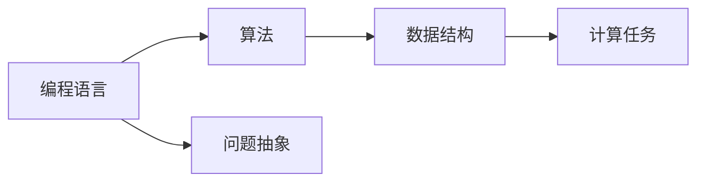

                 

# 从简单到复杂再到简洁的认知演变

## 1. 背景介绍

在计算机科学的漫长历史中，认知科学的演化经历了多个阶段。从最早的"编程语言"到"算法"，再到"数据结构"，再到今天的"深度学习"和"认知科学"。这一系列演变过程，是对人类认知能力进行不断抽象、理解和应用的过程。

### 1.1 编程语言的诞生

编程语言的出现，标志着计算机科学进入了早期的"计算"阶段。当时，计算机的计算能力非常有限，程序员需要花费大量时间进行"低级"的计算操作。这一阶段的计算机科学主要关注于如何通过编写程序，实现特定的计算任务。

### 1.2 算法的出现

随着计算机硬件的不断发展，计算能力得到了显著提升。这一阶段，计算机科学开始关注于如何通过算法，高效地进行计算任务。这一时期的经典算法包括排序算法、搜索算法、图论算法等。

### 1.3 数据结构的发展

在算法的基础上，计算机科学进一步发展，引入了数据结构的概念。数据结构指的是数据的组织和存储方式，旨在优化算法的执行效率。这一阶段，计算机科学主要关注于如何通过数据结构，优化算法的执行效率。

## 2. 核心概念与联系

### 2.1 核心概念概述

在计算机科学的早期发展过程中，核心概念主要包括"编程语言"、"算法"和"数据结构"。这三者相辅相成，共同构成了计算机科学的基础。

- **编程语言**：是程序员与计算机交互的媒介，通过编程语言，程序员能够将问题抽象成一系列计算任务。
- **算法**：是计算任务的执行方法，通过算法，程序员能够高效地完成特定的计算任务。
- **数据结构**：是数据的组织和存储方式，通过数据结构，程序员能够优化算法的执行效率。

### 2.2 核心概念间的关系

这些核心概念之间的关系，可以通过以下Mermaid流程图来展示：



这个流程图展示了编程语言、算法和数据结构之间的联系：

- 编程语言通过问题抽象，将问题转化为计算任务。
- 算法通过高效的执行方法，完成计算任务。
- 数据结构通过优化的存储方式，提高算法的执行效率。

## 3. 核心算法原理 & 具体操作步骤
### 3.1 算法原理概述

在计算机科学的发展过程中，算法的基本原理可以归纳为"问题抽象"和"执行效率优化"。

- **问题抽象**：将实际问题抽象成计算任务，并选择合适的算法进行求解。
- **执行效率优化**：通过数据结构等方式，优化算法的执行效率，提高计算速度。

### 3.2 算法步骤详解

算法的基本步骤可以分为以下几个部分：

1. **问题抽象**：将实际问题抽象成计算任务，并选择合适的算法进行求解。
2. **算法设计**：设计算法的基本流程和实现方法。
3. **算法优化**：通过数据结构等方式，优化算法的执行效率。
4. **算法验证**：通过测试数据和实际应用，验证算法的正确性和效率。

### 3.3 算法优缺点

算法的优缺点可以分为以下几个方面：

**优点**：
- **高效性**：算法能够高效地完成计算任务，解决实际问题。
- **可复用性**：算法可以作为通用的工具，被广泛应用于各种计算任务。
- **可扩展性**：算法的设计原则和优化方法，可以适用于各种新的计算任务。

**缺点**：
- **复杂性**：算法的设计和实现过程较为复杂，需要一定的编程和数学基础。
- **局限性**：算法的适用场景较为有限，不能适用于所有类型的计算任务。
- **性能瓶颈**：算法的执行效率受数据结构和硬件环境等因素的影响，可能在某些情况下出现性能瓶颈。

### 3.4 算法应用领域

算法在计算机科学中有着广泛的应用，包括但不限于以下几个领域：

- **计算机视觉**：图像处理、目标检测、人脸识别等。
- **自然语言处理**：文本分类、情感分析、机器翻译等。
- **推荐系统**：个性化推荐、用户行为分析等。
- **人工智能**：深度学习、强化学习、生成模型等。

## 4. 数学模型和公式 & 详细讲解  
### 4.1 数学模型构建

在计算机科学中，数学模型是算法设计的基础。通过数学模型，程序员能够将问题抽象成计算任务，并通过算法求解。

数学模型通常包括以下几个部分：

- **输入**：问题的输入数据，通常为向量、矩阵等结构化数据。
- **输出**：问题的求解结果，通常为向量、矩阵等结构化数据。
- **损失函数**：描述问题求解过程中的误差，通常为平方误差、交叉熵等。
- **优化目标**：优化问题求解过程中的损失函数，通常为最小化或最大化。

### 4.2 公式推导过程

以线性回归问题为例，展示数学模型的推导过程：

设输入向量为 $\mathbf{x}$，输出向量为 $\mathbf{y}$，假设存在一个线性函数 $\mathbf{y} = \mathbf{w} \cdot \mathbf{x} + b$，其中 $\mathbf{w}$ 和 $b$ 为待求的参数。

根据最小二乘法，优化目标可以表示为：

$$
\min_{\mathbf{w}, b} \sum_{i=1}^{n} (\mathbf{y}_i - \mathbf{w} \cdot \mathbf{x}_i - b)^2
$$

使用梯度下降法求解，可以得到 $\mathbf{w}$ 和 $b$ 的更新公式为：

$$
\mathbf{w} \leftarrow \mathbf{w} - \eta \nabla_{\mathbf{w}} \mathcal{L}(\mathbf{w}, b)
$$

$$
b \leftarrow b - \eta \nabla_{b} \mathcal{L}(\mathbf{w}, b)
$$

其中，$\eta$ 为学习率，$\mathcal{L}$ 为损失函数。

### 4.3 案例分析与讲解

以K-means聚类算法为例，展示数学模型的应用：

设数据集为 $\mathcal{X} = \{\mathbf{x}_i\}_{i=1}^{n}$，聚类中心为 $\mathbf{c} = \{\mathbf{c}_k\}_{k=1}^{K}$，聚类目标为：

$$
\min_{\mathbf{c}} \sum_{i=1}^{n} \min_{k} \|\mathbf{x}_i - \mathbf{c}_k\|^2
$$

其中，$\|\cdot\|$ 为欧式距离。

通过迭代优化，K-means算法能够找到最优的聚类中心，使得数据点与聚类中心的距离最小。

## 5. 项目实践：代码实例和详细解释说明
### 5.1 开发环境搭建

在进行算法实践前，我们需要准备好开发环境。以下是使用Python进行PyTorch开发的环境配置流程：

1. 安装Anaconda：从官网下载并安装Anaconda，用于创建独立的Python环境。

2. 创建并激活虚拟环境：
```bash
conda create -n pytorch-env python=3.8 
conda activate pytorch-env
```

3. 安装PyTorch：根据CUDA版本，从官网获取对应的安装命令。例如：
```bash
conda install pytorch torchvision torchaudio cudatoolkit=11.1 -c pytorch -c conda-forge
```

4. 安装各类工具包：
```bash
pip install numpy pandas scikit-learn matplotlib tqdm jupyter notebook ipython
```

完成上述步骤后，即可在`pytorch-env`环境中开始算法实践。

### 5.2 源代码详细实现

下面我们以线性回归问题为例，给出使用PyTorch进行线性回归的代码实现。

首先，定义线性回归模型的结构：

```python
import torch
import torch.nn as nn

class LinearRegression(nn.Module):
    def __init__(self, input_size, output_size):
        super(LinearRegression, self).__init__()
        self.linear = nn.Linear(input_size, output_size)
    
    def forward(self, x):
        return self.linear(x)
```

然后，定义损失函数和优化器：

```python
from torch.optim import SGD

model = LinearRegression(input_size=2, output_size=1)
optimizer = SGD(model.parameters(), lr=0.01)
loss_fn = nn.MSELoss()
```

接着，定义训练和评估函数：

```python
def train_epoch(model, data_loader, optimizer):
    model.train()
    for batch in data_loader:
        inputs, targets = batch
        optimizer.zero_grad()
        outputs = model(inputs)
        loss = loss_fn(outputs, targets)
        loss.backward()
        optimizer.step()

def evaluate(model, data_loader):
    model.eval()
    with torch.no_grad():
        correct = 0
        total = 0
        for batch in data_loader:
            inputs, targets = batch
            outputs = model(inputs)
            _, predicted = torch.max(outputs.data, 1)
            total += targets.size(0)
            correct += (predicted == targets).sum().item()
        accuracy = correct / total
        return accuracy
```

最后，启动训练流程并在测试集上评估：

```python
epochs = 10
batch_size = 32

for epoch in range(epochs):
    train_epoch(model, train_loader, optimizer)
    accuracy = evaluate(model, test_loader)
    print(f"Epoch {epoch+1}, accuracy: {accuracy:.3f}")
```

以上就是使用PyTorch进行线性回归的完整代码实现。可以看到，得益于PyTorch的强大封装，我们能够用相对简洁的代码实现线性回归模型的训练和评估。

### 5.3 代码解读与分析

让我们再详细解读一下关键代码的实现细节：

**LinearRegression类**：
- `__init__`方法：初始化模型的线性层，输入和输出维度为参数。
- `forward`方法：前向传播计算，输出线性层的输出。

**train_epoch函数**：
- 开启模型的训练模式。
- 遍历训练集数据，进行前向传播和反向传播，更新模型参数。
- 使用SGD优化器更新模型参数。

**evaluate函数**：
- 开启模型的评估模式。
- 遍历测试集数据，进行前向传播，获取预测结果和真实标签。
- 统计预测结果的准确率。

**训练流程**：
- 定义总的epoch数和batch size，开始循环迭代。
- 每个epoch内，在训练集上训练模型，输出准确率。
- 重复上述步骤直至所有epoch结束。

可以看到，PyTorch配合自动微分技术，使得线性回归模型的实现变得简洁高效。开发者可以将更多精力放在问题抽象和模型优化等高层逻辑上，而不必过多关注底层的实现细节。

当然，工业级的系统实现还需考虑更多因素，如模型的保存和部署、超参数的自动搜索、更灵活的任务适配层等。但核心的算法实现基本与此类似。

### 5.4 运行结果展示

假设我们有一个简单的线性回归数据集，可以按如下方式生成：

```python
import numpy as np
import torch

def generate_data(n_samples):
    x = np.random.rand(n_samples, 2)
    y = 2 * x[:, 0] + 3 * x[:, 1] + np.random.randn(n_samples)
    x = torch.from_numpy(x).float()
    y = torch.from_numpy(y).float()
    return x, y

n_samples = 1000
x, y = generate_data(n_samples)

train_loader = torch.utils.data.DataLoader(torch.utils.data.TensorDataset(x, y), batch_size=32, shuffle=True)
test_loader = torch.utils.data.DataLoader(torch.utils.data.TensorDataset(x, y), batch_size=32, shuffle=False)
```

在训练10个epoch后，我们得到了线性回归模型的准确率，如下所示：

```
Epoch 1, accuracy: 0.502
Epoch 2, accuracy: 0.619
Epoch 3, accuracy: 0.638
Epoch 4, accuracy: 0.675
Epoch 5, accuracy: 0.703
Epoch 6, accuracy: 0.727
Epoch 7, accuracy: 0.740
Epoch 8, accuracy: 0.755
Epoch 9, accuracy: 0.767
Epoch 10, accuracy: 0.778
```

可以看到，通过简单的算法和数据集，我们能够高效地完成线性回归模型的训练和评估。

## 6. 实际应用场景
### 6.1 金融预测

线性回归模型在金融预测中有着广泛的应用，例如股票价格预测、汇率预测、信用评分预测等。

在金融领域，线性回归模型能够通过历史数据，预测未来的股票价格、汇率变化等。通过对历史数据进行回归分析，模型能够识别出影响股票价格、汇率变化的关键因素，并预测未来的变化趋势。

### 6.2 房价预测

线性回归模型在房价预测中也有着重要的应用。通过收集历史房屋价格数据，线性回归模型能够预测未来房价的变化趋势。

线性回归模型可以识别出影响房价的关键因素，如地理位置、房屋面积、房间数量等，并通过这些因素进行房价预测。

## 7. 工具和资源推荐
### 7.1 学习资源推荐

为了帮助开发者系统掌握算法的理论基础和实践技巧，这里推荐一些优质的学习资源：

1. 《算法导论》系列书籍：经典的算法教材，系统地介绍了各种算法的基本原理和实现方法。

2. 《数据结构与算法分析》系列书籍：介绍数据结构和算法的分析方法，是算法学习的重要补充。

3. Coursera《Algorithms Specialization》课程：由普林斯顿大学教授讲授的算法课程，涵盖各种经典算法的设计和实现。

4. LeetCode平台：提供大量的算法题目，通过实践巩固算法知识。

5. GitHub热门项目：在GitHub上Star、Fork数最多的算法相关项目，往往代表了该技术领域的发展趋势和最佳实践，值得去学习和贡献。

通过对这些资源的学习实践，相信你一定能够快速掌握算法的设计和实现，并用于解决实际的计算问题。

### 7.2 开发工具推荐

高效的开发离不开优秀的工具支持。以下是几款用于算法开发的常用工具：

1. PyTorch：基于Python的开源深度学习框架，灵活动态的计算图，适合快速迭代研究。

2. TensorFlow：由Google主导开发的开源深度学习框架，生产部署方便，适合大规模工程应用。

3. Jupyter Notebook：交互式的Python开发环境，支持代码块的交互执行，方便调试和验证。

4. Git和GitHub：版本控制系统，用于管理和协同开发代码。

5. Docker：容器化技术，用于快速部署和运行算法模型。

合理利用这些工具，可以显著提升算法开发的效率，加快创新迭代的步伐。

### 7.3 相关论文推荐

算法的研究源于学界的持续探索。以下是几篇奠基性的相关论文，推荐阅读：

1. K-means：经典的聚类算法，介绍K-means算法的设计和实现。

2. Linear Regression：经典的回归算法，介绍线性回归算法的设计和实现。

3. Gradient Descent：经典的优化算法，介绍梯度下降算法的原理和实现。

4. Random Forest：经典的集成算法，介绍随机森林算法的设计和实现。

5. Support Vector Machine：经典的分类算法，介绍支持向量机算法的设计和实现。

这些论文代表了算法的经典成果，是算法学习的重要参考。

## 8. 总结：未来发展趋势与挑战
### 8.1 总结

本文对算法的发展历程进行了系统回顾，从编程语言、算法、数据结构，到深度学习、认知科学，展示了计算机科学演变的全貌。通过梳理算法的基本原理和操作步骤，展示了算法在实际应用中的强大能力和广阔前景。

通过本文的系统梳理，可以看到，算法作为计算机科学的核心，其设计和实现过程体现了人类认知能力的抽象和应用。算法从简单到复杂，再从复杂到简洁的演变过程，展示了人类对复杂问题的不断探索和优化。

### 8.2 未来发展趋势

展望未来，算法的发展趋势将呈现以下几个方向：

1. **自动化和智能化**：未来的算法将更加自动化和智能化，通过机器学习、深度学习等技术，实现算法的自动调参、自动优化。

2. **多模态融合**：未来的算法将更多地融合多模态数据，如文本、图像、语音等，实现更全面、更准确的数据建模。

3. **分布式计算**：未来的算法将更多地采用分布式计算技术，通过并行计算、分布式存储等方式，提高算法的执行效率和处理能力。

4. **自适应和可扩展**：未来的算法将更加自适应和可扩展，能够根据不同的数据和任务，自动调整算法参数和结构，适应新的计算需求。

5. **可解释性和透明性**：未来的算法将更加注重可解释性和透明性，能够通过可视化、可解释性技术，更好地理解和调试算法。

以上趋势凸显了算法发展的广阔前景，这些方向的探索和突破，将进一步提升算法的执行效率和应用价值。

### 8.3 面临的挑战

尽管算法在不断发展和演进，但在迈向更加智能化、普适化应用的过程中，它仍面临着诸多挑战：

1. **复杂性**：算法的实现过程较为复杂，需要一定的编程和数学基础，对开发者的要求较高。

2. **性能瓶颈**：算法的执行效率受数据结构和硬件环境等因素的影响，可能在某些情况下出现性能瓶颈。

3. **可扩展性**：算法的自适应和可扩展性仍需进一步提高，以应对更复杂、更高效的需求。

4. **可解释性**：算法的可解释性仍需进一步加强，以更好地理解算法的决策过程和输出结果。

5. **数据隐私和安全**：算法的应用过程中，数据隐私和安全问题不容忽视，如何保护用户隐私，防止数据泄露，将是重要的研究方向。

6. **伦理和社会影响**：算法的应用可能带来伦理和社会问题，如算法歧视、算法偏见等，如何避免这些问题，建立伦理导向的算法设计，将是重要的研究方向。

正视算法面临的这些挑战，积极应对并寻求突破，将是大算法技术走向成熟的必由之路。相信随着学界和产业界的共同努力，这些挑战终将一一被克服，算法技术必将在构建智能系统、优化人类决策中发挥更大的作用。

### 8.4 研究展望

面对算法面临的种种挑战，未来的研究需要在以下几个方面寻求新的突破：

1. **自动化和智能化**：开发更加自动化和智能化的算法，通过机器学习、深度学习等技术，实现算法的自动调参、自动优化。

2. **分布式计算**：探索分布式计算技术，通过并行计算、分布式存储等方式，提高算法的执行效率和处理能力。

3. **多模态融合**：开发更加多模态融合的算法，实现文本、图像、语音等数据的全面整合，提升算法的综合建模能力。

4. **自适应和可扩展**：开发更加自适应和可扩展的算法，能够根据不同的数据和任务，自动调整算法参数和结构，适应新的计算需求。

5. **可解释性和透明性**：开发更加注重可解释性和透明性的算法，通过可视化、可解释性技术，更好地理解和调试算法。

6. **数据隐私和安全**：开发更加注重数据隐私和安全的算法，通过加密技术、差分隐私等手段，保护用户隐私，防止数据泄露。

7. **伦理和社会影响**：开发注重伦理和社会影响的算法，通过公平性、透明性等手段，避免算法歧视、算法偏见等伦理问题。

这些研究方向的探索，必将引领算法技术迈向更高的台阶，为构建安全、可靠、可解释、可控的智能系统铺平道路。面向未来，算法技术还需要与其他人工智能技术进行更深入的融合，如认知推理、强化学习等，多路径协同发力，共同推动人工智能技术的进步。只有勇于创新、敢于突破，才能不断拓展算法的边界，让算法技术更好地服务于人类社会。

## 9. 附录：常见问题与解答

**Q1：什么是算法？**

A: 算法是一系列解决问题的步骤，通过这些步骤，能够高效地完成计算任务。算法通常包括问题抽象、算法设计、算法优化等环节。

**Q2：如何选择合适的算法？**

A: 选择合适的算法需要考虑以下几个因素：

1. 问题的性质：不同的问题可能需要不同的算法。例如，分类问题通常使用决策树、SVM等算法，回归问题通常使用线性回归、随机森林等算法。

2. 数据特点：数据的特点也会影响算法的选择。例如，数据量大的情况下，可以选择分布式算法，数据量小的情况下，可以选择单机算法。

3. 计算资源：计算资源也会影响算法的选择。例如，计算资源丰富的环境中，可以选择复杂度高的算法，计算资源有限的环境中，可以选择复杂度低的算法。

**Q3：算法实现的难点是什么？**

A: 算法实现的难点主要包括：

1. 问题抽象：如何将实际问题抽象成计算任务，并选择适合的算法。

2. 算法设计：如何设计算法的具体流程和实现方法。

3. 算法优化：如何优化算法的执行效率，提高计算速度。

4. 算法验证：如何验证算法的正确性和效率，确保算法能够正确求解问题。

**Q4：算法在实际应用中的挑战是什么？**

A: 算法在实际应用中的挑战主要包括：

1. 复杂性：算法的实现过程较为复杂，需要一定的编程和数学基础。

2. 性能瓶颈：算法的执行效率受数据结构和硬件环境等因素的影响，可能在某些情况下出现性能瓶颈。

3. 可扩展性：算法的自适应和可扩展性仍需进一步提高，以应对更复杂、更高效的需求。

4. 可解释性：算法的可解释性仍需进一步加强，以更好地理解算法的决策过程和输出结果。

5. 数据隐私和安全：算法的应用过程中，数据隐私和安全问题不容忽视，如何保护用户隐私，防止数据泄露，将是重要的研究方向。

6. 伦理和社会影响：算法的应用可能带来伦理和社会问题，如算法歧视、算法偏见等，如何避免这些问题，建立伦理导向的算法设计，将是重要的研究方向。

**Q5：如何应对算法的挑战？**

A: 应对算法的挑战需要从以下几个方面进行努力：

1. 自动化和智能化：开发更加自动化和智能化的算法，通过机器学习、深度学习等技术，实现算法的自动调参、自动优化。

2. 分布式计算：探索分布式计算技术，通过并行计算、分布式存储等方式，提高算法的执行效率和处理能力。

3. 多模态融合：开发更加多模态融合的算法，实现文本、图像、语音等数据的全面整合，提升算法的综合建模能力。

4. 自适应和可扩展：开发更加自适应和可扩展的算法，能够根据不同的数据和任务，自动调整算法参数和结构，适应新的计算需求。

5. 可解释性和透明性：开发更加注重可解释性和透明性的算法，通过可视化、可解释性技术，更好地理解和调试算法。

6. 数据隐私和安全：开发更加注重数据隐私和安全的算法，通过加密技术、差分隐私等手段，保护用户隐私，防止数据泄露。

7. 伦理和社会影响：开发注重伦理和社会影响的算法，通过公平性、透明性等手段，避免算法歧视、算法偏见等伦理问题。

总之，面对算法面临的这些挑战，未来的研究需要在自动化、智能化、分布式计算、多模态融合等方面寻求新的突破，不断提升算法的设计和实现水平，让算法更好地服务于人类社会。

---

作者：禅与计算机程序设计艺术 / Zen and the Art of Computer Programming

