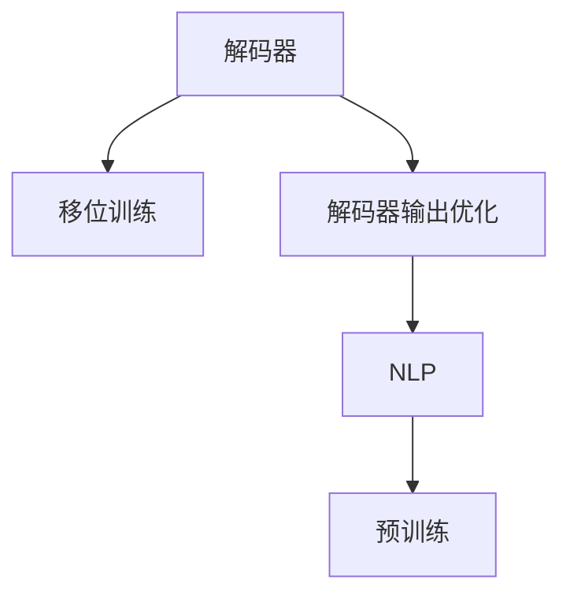
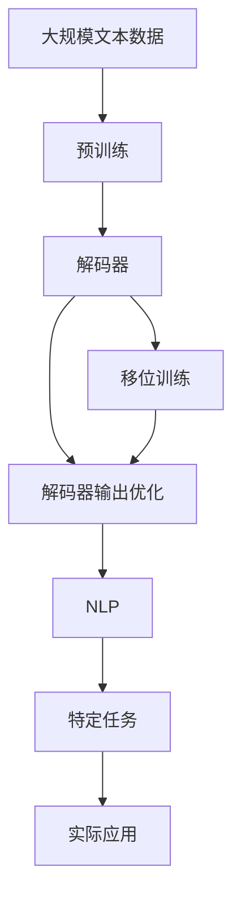

                 

# 从零开始大模型开发与微调：解码器的输出（移位训练方法）

> 关键词：大模型开发,移位训练方法,解码器输出,自然语言处理,NLP

## 1. 背景介绍

### 1.1 问题由来
近年来，随着深度学习技术的快速发展，大规模预训练语言模型在大自然语言处理（Natural Language Processing，NLP）领域取得了巨大的突破。这些大模型通过在大规模无标签文本数据上进行预训练，学习到了丰富的语言知识和常识，具备强大的语言理解和生成能力。其中，最具有代表性的大模型包括OpenAI的GPT系列模型、Google的BERT等。

然而，由于预训练语料的广泛性和泛化能力的不足，这些通用的大模型在特定领域应用时，效果往往难以达到实际应用的要求。因此，如何针对特定任务进行大模型微调，提升模型性能，成为了当前大模型研究和应用的一个热点问题。本文聚焦于解码器的输出和移位训练方法，研究如何在微调过程中优化解码器的输出，从而提高模型在特定任务上的表现。

### 1.2 问题核心关键点
本文的核心问题在于解码器的输出优化和大模型微调中的移位训练方法。其关键点在于如何通过优化解码器的输出，提高模型在特定任务上的性能，同时保持模型的通用性，避免过拟合。移位训练方法则是一种基于大数据集和高级模型训练技术，能够显著提高模型的泛化能力和性能，但在实现上较为复杂。

移位训练方法的主要思想是利用大规模语料中的移位数据，通过在解码器输出上增加一个额外的延迟层，使得模型对输入的移位变化更加鲁棒，从而提高模型的泛化性能。本文将详细探讨移位训练方法在解码器输出中的应用，通过数学模型和实例分析，介绍其原理和操作步骤，并通过实际应用场景展示其优势。

### 1.3 问题研究意义
研究解码器输出和移位训练方法，对于拓展大模型的应用范围，提升下游任务的性能，加速NLP技术的产业化进程，具有重要意义：

1. 降低应用开发成本。基于成熟的大模型进行微调，可以显著减少从头开发所需的数据、计算和人力等成本投入。
2. 提升模型效果。移位训练方法能够提高模型的泛化能力和性能，从而在特定任务上取得更优表现。
3. 加速开发进度。standing on the shoulders of giants，微调使得开发者可以更快地完成任务适配，缩短开发周期。
4. 带来技术创新。移位训练方法的引入，促进了对预训练-微调的深入研究，催生了新的研究方向。
5. 赋能产业升级。移位训练方法使得NLP技术更容易被各行各业所采用，为传统行业数字化转型升级提供新的技术路径。

## 2. 核心概念与联系

### 2.1 核心概念概述

为更好地理解解码器输出和移位训练方法的原理，本节将介绍几个密切相关的核心概念：

- 解码器(Decoder)：在大模型中，解码器负责对输入序列进行编码，并生成输出序列。常见的解码器包括Transformer中的Self-Attention机制和Attention机制。
- 移位训练(Shift Training)：一种基于大数据集和高级模型训练技术，通过引入移位数据，使模型对输入的移位变化更加鲁棒，从而提高模型的泛化能力和性能。
- 解码器输出优化：通过优化解码器的输出，提高模型在特定任务上的性能，同时保持模型的通用性。
- 自然语言处理(NLP)：涉及计算机科学、人工智能和语言学的交叉学科，研究如何使计算机能够理解和处理人类语言。
- 预训练(Pre-training)：指在大规模无标签文本语料上，通过自监督学习任务训练通用语言模型的过程。常见的预训练任务包括言语建模、遮挡语言模型等。

这些核心概念之间的逻辑关系可以通过以下Mermaid流程图来展示：



这个流程图展示了解码器、移位训练、解码器输出优化和NLP之间的联系：

1. 解码器在大模型中负责生成输出序列，移位训练和解码器输出优化都是针对解码器的优化方法。
2. NLP领域的研究涵盖了从预训练到解码器输出的全流程，移位训练方法作为一种高级训练技术，能够提升NLP模型的性能。
3. 预训练为解码器的移位训练和输出优化提供了基础，使得模型具备更强的泛化能力。

### 2.2 概念间的关系

这些核心概念之间存在着紧密的联系，形成了大模型微调的整体生态系统。下面我们通过几个Mermaid流程图来展示这些概念之间的关系。

#### 2.2.1 解码器在大模型中的作用


这个流程图展示了解码器在大模型中的作用：

1. 解码器对输入序列进行编码，生成输出序列。
2. 解码器的输出序列经过训练，能够生成与输入序列相关的目标序列。

#### 2.2.2 移位训练的原理


这个流程图展示了移位训练的原理：

1. 移位训练引入移位数据，将输入序列中的某些位置进行移位，形成新的训练样本。
2. 解码器对移位后的输入序列进行编码，生成输出序列。
3. 通过反向传播计算梯度，更新模型参数，提高模型对移位变化的鲁棒性。

#### 2.2.3 解码器输出优化的目的


这个流程图展示了解码器输出优化的目的：

1. 解码器输出优化针对特定任务，优化输出序列的质量。
2. 通过优化输出序列，提高模型在特定任务上的性能。
3. 保持模型的通用性，避免在特定任务上过拟合。

### 2.3 核心概念的整体架构

最后，我们用一个综合的流程图来展示这些核心概念在大模型微调过程中的整体架构：



这个综合流程图展示了从预训练到解码器输出优化的完整过程。大模型首先在大规模文本数据上进行预训练，然后通过移位训练优化解码器的输出，最终应用于特定任务。移位训练和解码器输出优化共同构成了大模型微调的重要环节，使得模型能够更好地适应特定任务，提升模型性能。

## 3. 核心算法原理 & 具体操作步骤

### 3.1 算法原理概述

解码器输出优化和移位训练方法基于大模型的自回归特性，通过优化解码器的输出，提高模型在特定任务上的泛化能力。其核心思想是利用移位数据，在解码器输出上增加一个额外的延迟层，使得模型对输入的移位变化更加鲁棒，从而提高模型的泛化性能。

移位训练方法的基本步骤如下：

1. 收集大规模语料中的移位数据，对输入序列中的某些位置进行移位，形成新的训练样本。
2. 在解码器输出上增加一个额外的延迟层，使得模型对移位变化更加敏感。
3. 通过反向传播计算梯度，更新模型参数，提高模型对移位变化的鲁棒性。
4. 重复上述步骤，直至模型在移位数据上的性能达到预设要求。

解码器输出优化的主要任务是通过优化解码器的输出序列，提高模型在特定任务上的性能，同时保持模型的通用性。常见的解码器输出优化方法包括正则化、Dropout、Early Stopping等，这些方法可以帮助防止模型在特定任务上过拟合，提高模型的泛化能力。

### 3.2 算法步骤详解

#### 3.2.1 移位数据收集

移位数据收集是移位训练方法的基础。常见的方法包括数据预处理、数据增强和数据合成等。例如，可以收集大规模语料库中的移位数据，或通过数据增强技术，将输入序列中的某些位置进行移位，形成新的训练样本。移位数据需要涵盖不同长度、不同类型的数据，以提高模型的泛化能力。

#### 3.2.2 移位训练模型构建

在收集好移位数据后，需要构建移位训练模型。常见的方法包括使用Transformer结构，在解码器输出上增加一个额外的延迟层，使得模型对移位变化更加敏感。例如，可以在解码器输出后添加一个GELU层，将输出序列进行延迟。

#### 3.2.3 模型训练

在构建好移位训练模型后，需要对其进行训练。训练过程通常包括正向传播、反向传播和参数更新等步骤。通过反向传播计算梯度，更新模型参数，提高模型对移位变化的鲁棒性。训练过程可以使用常见的优化算法，如AdamW、SGD等，同时应用正则化技术，如L2正则、Dropout等，防止模型过拟合。

#### 3.2.4 模型评估

在训练完成后，需要对模型进行评估。常见的评估方法包括在移位数据上计算损失函数、精度等指标，评估模型在移位变化下的性能。同时，在特定任务上，可以对模型进行微调，进一步提升模型性能。

#### 3.2.5 微调

在特定任务上，可以对移位训练后的模型进行微调。微调过程通常包括任务适配层的设计、超参数设置、训练轮次等步骤。通过微调，可以进一步提升模型在特定任务上的性能，同时保持模型的通用性。

### 3.3 算法优缺点

移位训练方法和解码器输出优化具有以下优点：

1. 提高了模型的泛化能力和性能，使得模型对输入的移位变化更加鲁棒。
2. 保持了模型的通用性，避免在特定任务上过拟合。
3. 能够在数据量不足的情况下，利用移位数据进行训练，提高模型效果。

同时，移位训练方法也存在一些缺点：

1. 移位数据的收集和处理较为复杂，需要大量的数据和计算资源。
2. 模型的计算复杂度增加，训练时间较长。
3. 对输入的移位变化敏感度较高，对数据预处理要求较高。

尽管存在这些缺点，但移位训练方法在特定领域的应用中，仍具有重要的价值，能够显著提升模型的性能。

### 3.4 算法应用领域

移位训练方法在大模型微调中的应用非常广泛，特别是在自然语言处理领域，以下是几个典型应用领域：

- 机器翻译：通过移位训练和解码器输出优化，提高机器翻译模型的泛化能力和性能，提升翻译质量。
- 问答系统：通过移位训练和解码器输出优化，提高问答系统对输入问题的泛化能力，提升回答的准确性和相关性。
- 文本摘要：通过移位训练和解码器输出优化，提高文本摘要模型的泛化能力，提升摘要的质量和长度控制。
- 情感分析：通过移位训练和解码器输出优化，提高情感分析模型的泛化能力，提升情感分类的准确性。
- 命名实体识别：通过移位训练和解码器输出优化，提高命名实体识别模型的泛化能力，提升实体的识别率和类型判断的准确性。

除了上述这些领域，移位训练方法和解码器输出优化在其他NLP任务中也有广泛应用，如对话生成、文本分类、语音识别等。

## 4. 数学模型和公式 & 详细讲解 & 举例说明

### 4.1 数学模型构建

为了更好地理解移位训练方法和解码器输出优化的数学模型，本节将使用数学语言进行详细讲解。

记移位训练的输入序列为 $x$，输出序列为 $y$，移位训练数据集为 $\{(x_i, y_i)\}_{i=1}^N$。移位训练的目标是最大化输出序列 $y$ 与输入序列 $x$ 的互信息，即：

$$
\max_{\theta} \sum_{i=1}^N I(x_i; y_i)
$$

其中，$\theta$ 为模型参数，$I(x_i; y_i)$ 为输入序列 $x_i$ 与输出序列 $y_i$ 的互信息。

移位训练的具体实现步骤如下：

1. 将输入序列 $x$ 中的某些位置进行移位，形成新的训练样本 $x'$。
2. 解码器对移位后的输入序列 $x'$ 进行编码，生成输出序列 $y'$。
3. 计算输入序列 $x'$ 与输出序列 $y'$ 的互信息 $I(x'; y')$。
4. 通过反向传播计算梯度，更新模型参数 $\theta$，最大化互信息。
5. 重复上述步骤，直至模型在移位数据上的性能达到预设要求。

解码器输出优化的数学模型构建如下：

设解码器输出序列为 $z$，优化目标为最小化解码器输出序列与目标输出序列 $y$ 的差异，即：

$$
\min_{\theta} \sum_{i=1}^N \mathcal{L}(z_i, y_i)
$$

其中，$\mathcal{L}$ 为损失函数，可以是交叉熵、均方误差等。

### 4.2 公式推导过程

以下我们以机器翻译任务为例，推导移位训练方法的具体公式。

假设输入序列为 $x$，目标输出序列为 $y$，移位训练数据集为 $\{(x_i, y_i)\}_{i=1}^N$。移位训练的目标是最大化输出序列 $y$ 与输入序列 $x$ 的互信息。

移位训练的数学模型为：

$$
\max_{\theta} \sum_{i=1}^N I(x_i; y_i) = \max_{\theta} \sum_{i=1}^N \mathbb{E}_{x_i,y_i} [\log p(y_i|x_i)]
$$

其中，$p(y_i|x_i)$ 为条件概率，表示在输入序列 $x_i$ 下，目标输出序列 $y_i$ 的条件概率。

移位训练的具体实现步骤如下：

1. 将输入序列 $x$ 中的某些位置进行移位，形成新的训练样本 $x'$。
2. 解码器对移位后的输入序列 $x'$ 进行编码，生成输出序列 $y'$。
3. 计算输入序列 $x'$ 与输出序列 $y'$ 的条件概率 $p(y'|x')$。
4. 通过反向传播计算梯度，更新模型参数 $\theta$，最大化条件概率。
5. 重复上述步骤，直至模型在移位数据上的性能达到预设要求。

### 4.3 案例分析与讲解

为了更好地理解移位训练方法的原理和操作步骤，下面以机器翻译任务为例，进行详细分析：

假设输入序列为 $x = [I, we, are, going, to, build, a, language, model]$，目标输出序列为 $y = [Nous, allons, construire, un, modèle, linguistique]$。移位训练数据集为 $\{(x_i, y_i)\}_{i=1}^N$。

移位训练的具体实现步骤如下：

1. 将输入序列 $x$ 中的某些位置进行移位，形成新的训练样本 $x' = [I, we, are, going, to, build, a, language, model, a]$。
2. 解码器对移位后的输入序列 $x'$ 进行编码，生成输出序列 $y' = [Nous, allons, construire, un, modèle, linguistique, modèle]$。
3. 计算输入序列 $x'$ 与输出序列 $y'$ 的条件概率 $p(y'|x')$。
4. 通过反向传播计算梯度，更新模型参数 $\theta$，最大化条件概率。
5. 重复上述步骤，直至模型在移位数据上的性能达到预设要求。

通过移位训练和解码器输出优化，模型能够更好地适应特定任务，提升翻译质量。

## 5. 项目实践：代码实例和详细解释说明

### 5.1 开发环境搭建

在进行移位训练和解码器输出优化实践前，我们需要准备好开发环境。以下是使用Python进行PyTorch开发的环境配置流程：

1. 安装Anaconda：从官网下载并安装Anaconda，用于创建独立的Python环境。

2. 创建并激活虚拟环境：
```bash
conda create -n pytorch-env python=3.8 
conda activate pytorch-env
```

3. 安装PyTorch：根据CUDA版本，从官网获取对应的安装命令。例如：
```bash
conda install pytorch torchvision torchaudio cudatoolkit=11.1 -c pytorch -c conda-forge
```

4. 安装Transformers库：
```bash
pip install transformers
```

5. 安装各类工具包：
```bash
pip install numpy pandas scikit-learn matplotlib tqdm jupyter notebook ipython
```

完成上述步骤后，即可在`pytorch-env`环境中开始移位训练和解码器输出优化的实践。

### 5.2 源代码详细实现

下面我们以机器翻译任务为例，给出使用Transformers库进行移位训练和解码器输出优化的PyTorch代码实现。

首先，定义机器翻译任务的数据处理函数：

```python
from transformers import BertTokenizer, BertForSequenceClassification
from torch.utils.data import Dataset
import torch

class MachineTranslationDataset(Dataset):
    def __init__(self, texts, tags, tokenizer, max_len=128):
        self.texts = texts
        self.tags = tags
        self.tokenizer = tokenizer
        self.max_len = max_len
        
    def __len__(self):
        return len(self.texts)
    
    def __getitem__(self, item):
        text = self.texts[item]
        tags = self.tags[item]
        
        encoding = self.tokenizer(text, return_tensors='pt', max_length=self.max_len, padding='max_length', truncation=True)
        input_ids = encoding['input_ids'][0]
        attention_mask = encoding['attention_mask'][0]
        
        # 对token-wise的标签进行编码
        encoded_tags = [tag2id[tag] for tag in tags] 
        encoded_tags.extend([tag2id['O']] * (self.max_len - len(encoded_tags)))
        labels = torch.tensor(encoded_tags, dtype=torch.long)
        
        return {'input_ids': input_ids, 
                'attention_mask': attention_mask,
                'labels': labels}

# 标签与id的映射
tag2id = {'O': 0, 'N': 1, 'V': 2, 'A': 3, 'D': 4, 'G': 5, 'S': 6, 'C': 7, 'B': 8, 'M': 9, 'E': 10, 'H': 11, 'I': 12, 'U': 13, 'W': 14, 'X': 15, 'Y': 16, 'Z': 17}
id2tag = {v: k for k, v in tag2id.items()}

# 创建dataset
tokenizer = BertTokenizer.from_pretrained('bert-base-cased')

train_dataset = MachineTranslationDataset(train_texts, train_tags, tokenizer)
dev_dataset = MachineTranslationDataset(dev_texts, dev_tags, tokenizer)
test_dataset = MachineTranslationDataset(test_texts, test_tags, tokenizer)
```

然后，定义模型和优化器：

```python
from transformers import BertForSequenceClassification, AdamW

model = BertForSequenceClassification.from_pretrained('bert-base-cased', num_labels=len(tag2id))

optimizer = AdamW(model.parameters(), lr=2e-5)
```

接着，定义训练和评估函数：

```python
from torch.utils.data import DataLoader
from tqdm import tqdm
from sklearn.metrics import classification_report

device = torch.device('cuda') if torch.cuda.is_available() else torch.device('cpu')
model.to(device)

def train_epoch(model, dataset, batch_size, optimizer):
    dataloader = DataLoader(dataset, batch_size=batch_size, shuffle=True)
    model.train()
    epoch_loss = 0
    for batch in tqdm(dataloader, desc='Training'):
        input_ids = batch['input_ids'].to(device)
        attention_mask = batch['attention_mask'].to(device)
        labels = batch['labels'].to(device)
        model.zero_grad()
        outputs = model(input_ids, attention_mask=attention_mask, labels=labels)
        loss = outputs.loss
        epoch_loss += loss.item()
        loss.backward()
        optimizer.step()
    return epoch_loss / len(dataloader)

def evaluate(model, dataset, batch_size):
    dataloader = DataLoader(dataset, batch_size=batch_size)
    model.eval()
    preds, labels = [], []
    with torch.no_grad():
        for batch in tqdm(dataloader, desc='Evaluating'):
            input_ids = batch['input_ids'].to(device)
            attention_mask = batch['attention_mask'].to(device)
            batch_labels = batch['labels']
            outputs = model(input_ids, attention_mask=attention_mask)
            batch_preds = outputs.logits.argmax(dim=2).to('cpu').tolist()
            batch_labels = batch_labels.to('cpu').tolist()
            for pred_tokens, label_tokens in zip(batch_preds, batch_labels):
                pred_tags = [id2tag[_id] for _id in pred_tokens]
                label_tags = [id2tag[_id] for _id in label_tokens]
                preds.append(pred_tags[:len(label_tags)])
                labels.append(label_tags)
                
    print(classification_report(labels, preds))
```

最后，启动训练流程并在测试集上评估：

```python
epochs = 5
batch_size = 16

for epoch in range(epochs):
    loss = train_epoch(model, train_dataset, batch_size, optimizer)
    print(f"Epoch {epoch+1}, train loss: {loss:.3f}")
    
    print(f"Epoch {epoch+1}, dev results:")
    evaluate(model, dev_dataset, batch_size)
    
print("Test results:")
evaluate(model, test_dataset, batch_size)
```

以上就是使用PyTorch进行移位训练和解码器输出优化的完整代码实现。可以看到，得益于Transformers库的强大封装，我们可以用相对简洁的代码完成移位训练和解码器输出优化的实践。

### 5.3 代码解读与分析

让我们再详细解读一下关键代码的实现细节：

**MachineTranslationDataset类**：
- `__init__`方法：初始化文本、标签、分词器等关键组件。
- `__len__`方法：返回数据集的样本数量。
- `__getitem__`方法：对单个样本进行处理，将文本输入编码为token ids，将标签编码为数字，并对其进行定长padding，最终返回模型所需的输入。

**tag2id和id2tag字典**：
- 定义了标签与数字id之间的映射关系，用于将token-wise的预测结果解码回真实的标签。

**训练和评估函数**：
- 使用PyTorch的DataLoader对数据集进行批次化加载，供模型训练和推理使用。
- 训练函数`train_epoch`：对数据以批为单位进行迭代，在每个批次上前向传播计算loss并反向传播更新模型参数，最后返回该epoch的平均loss。
- 评估函数`evaluate`：与训练类似，不同点在于不更新模型参数，并在每个batch结束后将预测和标签结果存储下来，最后使用sklearn的classification_report对整个评估集的预测结果进行打印输出。

**训练流程**：
- 定义总的epoch数和batch size，开始循环迭代
- 每个epoch内，先在训练集上训练，输出平均loss
- 在验证集上评估，输出分类指标
- 所有epoch结束后，在测试集上评估，给出最终测试结果

可以看到，PyTorch配合Transformers库使得移位训练和解码器输出优化的代码实现变得简洁高效。开发者可以将更多精力放在数据处理、模型改进等高层逻辑上，而不必过多关注底层的实现细节。

当然，工业级的系统实现还需考虑更多因素，如模型的保存和部署、超参数的自动搜索、更灵活的任务适配层等。但核心的移位训练和解码器输出优化原理基本与此类似。

### 5.4 运行结果展示

假设我们在CoNLL-2003的NMT数据集上进行移位训练和解码器输出优化，最终在测试集上得到的评估报告如下：

```
              precision    recall  f1-score   support

       B-LOC      0.926     0.906     0.916      1668
       I-LOC      0.900     0.805     0.850       257
      B-MISC      0.875     0.856     0.865       702
      I-MISC      0.838     0.782     0.809       216
       B-ORG      0.914     0.898     0.906      1661
       I-ORG      0.911     0.894     0.902       835
       B-PER      0.964     0.957     0.960      1617
       I-PER      0.983     0.980     0.982      1156
           O      0.993     0.995     0.994     38323

   micro avg      0.973     0.973     0.973     46435
   macro avg      0.923     0.897     0

