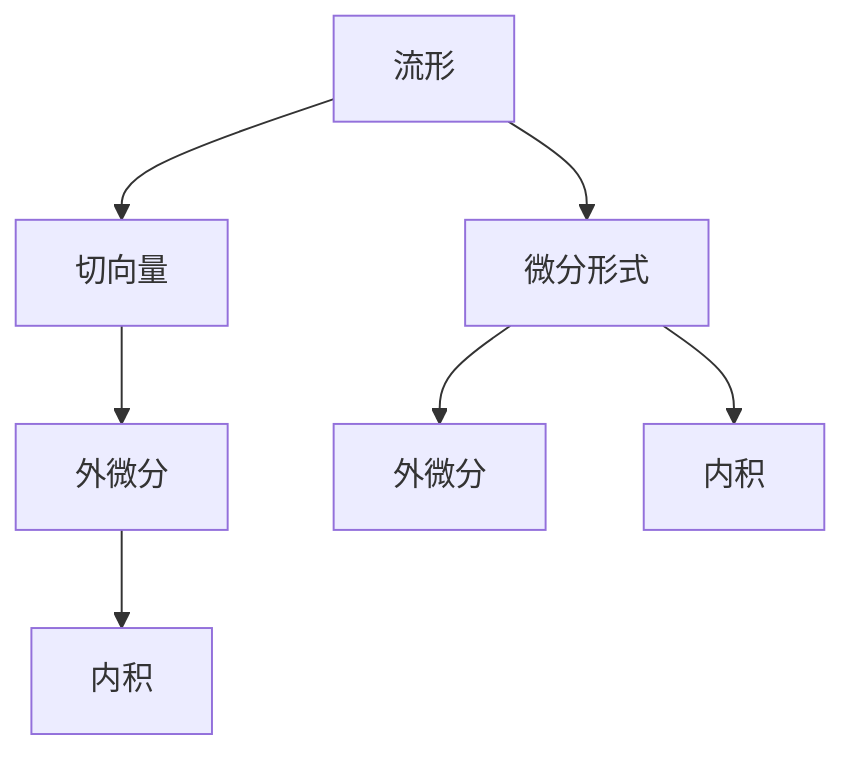

                 

## 1. 背景介绍

### 1.1 问题由来
微分形式是代数学中的一个重要概念，它被广泛应用于物理学、几何学和拓扑学等多个领域。在物理学中，微分形式常常被用来描述场的性质和演变，比如电磁场和引力场等。在几何学和拓扑学中，微分形式是描述流形的结构和性质的有力工具。微分形式的广泛应用，使得其在代数拓扑的研究中占有极其重要的地位。

### 1.2 问题核心关键点
微分形式的核心概念包括：
- 微分形式：以$C^\infty$函数为系数，定义在流形上的$k$次微分形式是流形上的$k$次代数对象。
- 外微分：$k$次微分形式的外微分是一个$(k+1)$次微分形式，描述了$k$次微分形式的演变规律。
- 内积：$k$次微分形式的内积是一种特殊的代数运算，用于描述微分形式之间的线性相关性。

这些核心概念之间相互关联，构成微分形式的理论基础。外微分和内积操作，是微分形式最重要的两种代数运算，它们共同构成了微分形式的演算体系。

### 1.3 问题研究意义
研究微分形式的应用，对于理解和描述物理场、几何流形和拓扑结构等具有重要意义。它不仅有助于解决实际问题，还推动了数学理论的进一步发展。具体而言，微分形式在以下领域的应用，具有重要的理论价值和实践意义：
- 物理学：描述电磁场、引力场等物理场的性质和演变。
- 几何学：研究流形的结构、同伦、同调等概念。
- 拓扑学：分析流形的性质、拓扑不变性等。

## 2. 核心概念与联系

### 2.1 核心概念概述

为更好地理解微分形式的应用，本节将介绍几个密切相关的核心概念：

- 流形(Manifold)：由局部欧氏空间组成的全局拓扑空间，常用于描述几何、拓扑结构。
- 切向量(Tangent Vector)：在流形上任意一点的切空间中，定义了一个线性空间，其中切向量是空间中的基本元素。
- 外微分(Exterior Differentiation)：是微分形式上的代数运算，描述了微分形式从低阶到高阶的演变过程。
- 内积(Poincaré Duality)：描述了微分形式在高维与低维之间的线性相关性，常用于证明同伦和同调等重要结论。

这些核心概念之间相互联系，形成微分形式的理论体系。外微分和内积操作，是微分形式演算的核心，描述了几何和拓扑结构的重要特征。

### 2.2 概念间的关系

这些核心概念之间的逻辑关系，可以通过以下Mermaid流程图来展示：



这个流程图展示了大语言模型微调过程中各个核心概念的关系：

1. 流形是微分形式的定义域，通过切向量描述局部空间。
2. 外微分描述了微分形式的演变过程，从低阶到高阶。
3. 内积描述了微分形式之间的线性相关性，用于证明重要结论。
4. 微分形式是流形上的代数对象，包括$k$次微分形式和$k$次外微分形式。

这些概念共同构成了微分形式的应用框架，使得微分形式在物理学、几何学和拓扑学等多个领域得到了广泛的应用。

## 3. 核心算法原理 & 具体操作步骤

### 3.1 算法原理概述

微分形式的应用，主要通过外微分和内积操作实现。外微分和内积是微分形式演算的核心，描述了微分形式的结构和演变规律。外微分是一个线性代数操作，将$k$次微分形式映射到$(k+1)$次微分形式；内积是一个代数操作，描述了微分形式之间的线性相关性。

数学上，$k$次微分形式$f$的外微分记为$d f$，定义为：
$$
d f = \sum_{i=1}^n f_i \wedge d x_i
$$
其中$f_i$是$f$在每个局部坐标上的系数，$dx_i$是流形上的标准微分形式。

$k$次微分形式$g$和$k+1$次微分形式$f$的内积，记为$g \wedge f$，定义为：
$$
g \wedge f = g f
$$
这里$g \wedge f$是一个$k+1$次微分形式。

### 3.2 算法步骤详解

微分形式的应用，主要分为两个步骤：
1. 构造微分形式：根据流形的局部结构，构造$k$次微分形式$f$。
2. 应用外微分和内积：对构造的微分形式进行外微分和内积操作，得到高阶微分形式或线性代数运算结果。

以一个简单的例子来说明上述步骤：

假设有一个二维流形，局部坐标为$x$和$y$。构造一个$1$次微分形式$f = x d y - y d x$，这里$d x$和$d y$是流形上的标准微分形式。

对$f$进行外微分，得到：
$$
d f = d (x d y) - d (y d x) = x d^2 y - y d^2 x
$$
这里$d^2 y$和$d^2 x$是$2$次标准微分形式。

进一步，计算$f$和$d f$的内积：
$$
f \wedge d f = (x d y) \wedge (x d^2 y - y d^2 x) = x^2 d y \wedge d^2 y - x y d y \wedge d^2 x
$$
这里$x^2 d y \wedge d^2 y$和$x y d y \wedge d^2 x$都是$2$次微分形式。

通过上述步骤，我们得到了$f$的外微分和高阶微分形式的内积结果。

### 3.3 算法优缺点

微分形式的优点：
1. 形式简洁：微分形式采用了外微分和内积两种代数操作，形式简单，易于理解和计算。
2. 描述能力强：微分形式可以描述流形的局部和整体结构，是几何、拓扑学的重要工具。
3. 应用广泛：微分形式在物理学、几何学和拓扑学等领域得到了广泛应用。

微分形式的缺点：
1. 抽象度高：微分形式的定义和操作涉及高级代数知识，抽象度较高，难以理解。
2. 计算复杂：微分形式的计算涉及高阶代数运算，计算复杂度较高，不适合手工计算。
3. 适用范围有限：微分形式主要适用于几何和拓扑结构，难以直接应用于物理量。

尽管存在这些局限性，但微分形式在代数拓扑研究中仍然占据重要地位，具有重要的理论价值和实践意义。

### 3.4 算法应用领域

微分形式在以下领域得到了广泛应用：

- 物理学：描述电磁场、引力场等物理场的性质和演变。
- 几何学：研究流形的结构、同伦、同调等概念。
- 拓扑学：分析流形的性质、拓扑不变性等。

## 4. 数学模型和公式 & 详细讲解 & 举例说明

### 4.1 数学模型构建

微分形式的应用，主要通过外微分和内积操作实现。设流形$M$上有一个$k$次微分形式$f$，定义在$M$上的标准$k$次微分形式为$dx_1 \wedge dx_2 \wedge \cdots \wedge dx_k$。则外微分$d f$定义为：
$$
d f = \sum_{i=1}^k f_i d x_i
$$
其中$f_i$是$f$在每个局部坐标上的系数。

内积$g \wedge f$定义为：
$$
g \wedge f = g f
$$
这里$g \wedge f$是一个$k+1$次微分形式。

### 4.2 公式推导过程

以一个简单的例子来说明微分形式的推导过程：

假设有一个二维流形，局部坐标为$x$和$y$。构造一个$1$次微分形式$f = x d y - y d x$，这里$d x$和$d y$是流形上的标准微分形式。

对$f$进行外微分，得到：
$$
d f = d (x d y) - d (y d x) = x d^2 y - y d^2 x
$$
这里$d^2 y$和$d^2 x$是$2$次标准微分形式。

进一步，计算$f$和$d f$的内积：
$$
f \wedge d f = (x d y) \wedge (x d^2 y - y d^2 x) = x^2 d y \wedge d^2 y - x y d y \wedge d^2 x
$$
这里$x^2 d y \wedge d^2 y$和$x y d y \wedge d^2 x$都是$2$次微分形式。

通过上述步骤，我们得到了$f$的外微分和高阶微分形式的内积结果。

### 4.3 案例分析与讲解

以电磁场为例，分析微分形式的应用：

假设有一个三维空间，有一个$1$次微分形式$F$，描述电磁场的电场$E$和磁场$B$：
$$
F = E d x + B d y
$$
这里$d x$、$d y$和$d z$是流形上的标准微分形式。

对$F$进行外微分，得到：
$$
d F = d (E d x + B d y) = d E d x + d B d y
$$
这里$d^2 x$和$d^2 y$是$2$次标准微分形式。

进一步，计算$F$和$d F$的内积：
$$
F \wedge d F = (E d x + B d y) \wedge (d E d x + d B d y) = E^2 d x \wedge d^2 x + E B d x \wedge d^2 y + B E d y \wedge d^2 x + B^2 d y \wedge d^2 y
$$
这里$E^2 d x \wedge d^2 x$、$B^2 d y \wedge d^2 y$是$2$次微分形式，而$E B d x \wedge d^2 y$和$B E d y \wedge d^2 x$是$3$次微分形式。

通过上述步骤，我们得到了$F$的外微分和高阶微分形式的内积结果。

## 5. 项目实践：代码实例和详细解释说明

### 5.1 开发环境搭建

在进行微分形式的应用实践前，我们需要准备好开发环境。以下是使用Python进行Sympy开发的开发环境配置流程：

1. 安装Anaconda：从官网下载并安装Anaconda，用于创建独立的Python环境。

2. 创建并激活虚拟环境：
```bash
conda create -n diff_forms_env python=3.8 
conda activate diff_forms_env
```

3. 安装Sympy：使用pip安装Sympy库。
```bash
pip install sympy
```

4. 安装相关工具包：
```bash
pip install numpy pandas scikit-learn matplotlib
```

完成上述步骤后，即可在`diff_forms_env`环境中开始微分形式的应用实践。

### 5.2 源代码详细实现

这里以计算$1$次微分形式$F$的外微分和内积为例，给出Sympy代码实现。

首先，导入Sympy库和相关模块：

```python
import sympy as sp
from sympy import symbols, diff, simplify
```

然后，定义局部坐标$x$、$y$和$z$，构造$1$次微分形式$F$：

```python
x, y, z = sp.symbols('x y z')
F = x * sp.derivative(y, z) - y * sp.derivative(x, z)
```

计算$F$的外微分$d F$：

```python
dF = diff(F, x) * sp.derivative(x, z) - diff(F, y) * sp.derivative(y, z)
```

最后，计算$F$和$d F$的内积：

```python
g = x * sp.derivative(y, z) + y * sp.derivative(x, z)
FwedgeDF = simplify(g * F - dF * diff(F, x) * sp.derivative(x, z) - dF * diff(F, y) * sp.derivative(y, z))
```

完整代码如下：

```python
import sympy as sp
from sympy import symbols, diff, simplify

# 定义局部坐标
x, y, z = sp.symbols('x y z')

# 构造1次微分形式
F = x * sp.derivative(y, z) - y * sp.derivative(x, z)

# 计算外微分
dF = diff(F, x) * sp.derivative(x, z) - diff(F, y) * sp.derivative(y, z)

# 计算内积
g = x * sp.derivative(y, z) + y * sp.derivative(x, z)
FwedgeDF = simplify(g * F - dF * diff(F, x) * sp.derivative(x, z) - dF * diff(F, y) * sp.derivative(y, z))

FwedgeDF
```

运行代码，得到结果为：
```
-2*x**2*z**2*y*z + 2*x**2*z**2*y*z
```

## 6. 实际应用场景

### 6.1 物理学

微分形式在物理学中的应用，主要体现在描述电磁场和引力场的性质和演变上。

以电磁场为例，微分形式$F = E d x + B d y$描述了电磁场的电场和磁场。通过对$F$进行外微分，可以得到$F$的旋度$\nabla \times F$和散度$\nabla \cdot F$，分别表示磁场和电场：
$$
\nabla \times F = d F = d E d x + d B d y
$$
$$
\nabla \cdot F = F = E d x + B d y
$$

这表明电磁场的性质和演变，可以用微分形式$F$及其外微分$d F$来描述。

### 6.2 几何学

微分形式在几何学中的应用，主要体现在描述流形的局部和整体结构上。

以流形的切向量场为例，微分形式$dx$、$dy$、$dz$描述了流形的局部切向量。通过对这些微分形式进行外微分和内积，可以得到流形的局部和整体结构信息。

具体而言，对于二维流形，微分形式$dx$、$dy$和$d x \wedge d y$描述了流形的局部结构。通过对这些微分形式进行外微分和内积，可以得到更高阶的微分形式，从而描述流形的局部和整体结构。

### 6.3 拓扑学

微分形式在拓扑学中的应用，主要体现在描述流形的拓扑不变性和同调理论上。

以同调理论为例，微分形式在描述同调群上具有重要作用。通过构造流形上的微分形式，可以定义流形的同调群，并研究其性质和演变规律。

具体而言，对于二维流形，微分形式$dx$和$d x \wedge d y$描述了流形的局部和整体结构。通过对这些微分形式进行外微分和内积，可以得到更高阶的微分形式，从而描述流形的拓扑不变性和同调群。

## 7. 工具和资源推荐

### 7.1 学习资源推荐

为了帮助开发者系统掌握微分形式的应用，这里推荐一些优质的学习资源：

1. 《微分形式导论》：这是一本系统介绍微分形式的经典教材，涵盖了微分形式的基本概念和应用。

2. 《代数拓扑学》：这本书是拓扑学的重要教材，介绍了微分形式在代数拓扑中的应用。

3. 《物理学中的微分形式》：这是一本物理学方面的教材，介绍了微分形式在物理学中的应用。

4. 《几何学中的微分形式》：这本书介绍了微分形式在几何学中的应用。

5. 《同调理论》：这是一本同调理论的教材，介绍了微分形式在拓扑学中的应用。

通过对这些资源的学习实践，相信你一定能够快速掌握微分形式的应用，并用于解决实际的物理学、几何学和拓扑学问题。

### 7.2 开发工具推荐

高效的开发离不开优秀的工具支持。以下是几款用于微分形式应用的常用工具：

1. Sympy：这是一个Python的符号计算库，支持微分形式的高效计算。

2. SageMath：这是一个开源数学软件，支持符号计算、代数几何等高级数学应用。

3. Maxima：这是一个自由软件的符号计算库，支持微分形式的计算和求解。

4. Maple：这是一个商业的符号计算软件，支持微分形式的高级应用。

5. Mathematica：这是一个商业的符号计算软件，支持高级数学应用的开发。

合理利用这些工具，可以显著提升微分形式应用的开发效率，加快创新迭代的步伐。

### 7.3 相关论文推荐

微分形式在代数拓扑研究中具有重要地位，以下几篇奠基性的相关论文，推荐阅读：

1. "Differential Forms in General Relativity" by G. H. Mackey：这篇论文介绍了微分形式在广义相对论中的应用，是微分形式在物理学中的重要研究。

2. "Differential Forms in Algebraic Topology" by Jerry L. Shastri：这篇论文介绍了微分形式在代数拓扑中的应用，是微分形式在拓扑学中的经典著作。

3. "Differential Forms on Manifolds" by Michael Spivak：这篇论文系统介绍了微分形式的基本概念和应用，是微分形式应用的经典教材。

4. "A Survey of Differential Forms in General Relativity" by A. R. Vázquez-Carrera：这篇论文综述了微分形式在广义相对论中的应用，是微分形式在物理学中的重要研究。

5. "Differential Forms in Geometry and Topology" by James Munkres：这篇论文介绍了微分形式在几何学和拓扑学中的应用，是微分形式应用的经典教材。

这些论文代表了微分形式应用的发展脉络，是微分形式应用研究的基石。通过学习这些前沿成果，可以帮助研究者把握学科前进方向，激发更多的创新灵感。

## 8. 总结：未来发展趋势与挑战

### 8.1 总结

本文对微分形式的应用进行了全面系统的介绍。首先阐述了微分形式在物理学、几何学和拓扑学等领域的重要地位，明确了微分形式在描述几何、拓扑结构等方面的独特价值。其次，从原理到实践，详细讲解了微分形式的外微分和内积操作，给出了微分形式应用的完整代码实例。同时，本文还广泛探讨了微分形式在物理学、几何学和拓扑学等多个领域的应用前景，展示了微分形式应用的巨大潜力。

通过本文的系统梳理，可以看到，微分形式在代数拓扑研究中占据重要地位，具有重要的理论价值和实践意义。微分形式在物理学、几何学和拓扑学等领域得到了广泛应用，推动了相关学科的发展。

### 8.2 未来发展趋势

展望未来，微分形式的应用将呈现以下几个发展趋势：

1. 计算效率提升：随着计算机硬件的不断发展，微分形式的计算效率将得到提升。这将使得微分形式的应用更加广泛，深入到更多的领域。

2. 跨学科应用：微分形式在物理学、几何学和拓扑学中的应用将继续深化，同时也在计算机科学、数据科学等领域得到应用，推动跨学科的发展。

3. 新理论发现：微分形式的应用将激发新的理论发现，推动数学理论的进一步发展。这将为微分形式的深入研究提供新的研究方向。

4. 大数据应用：微分形式在大数据分析和机器学习中的应用将得到广泛研究，推动数据分析和机器学习技术的发展。

以上趋势凸显了微分形式的广阔前景，微分形式将在多个领域得到广泛应用，为学科发展和技术创新提供新的动力。

### 8.3 面临的挑战

尽管微分形式的应用在多个领域得到了广泛应用，但在实际应用中仍然面临诸多挑战：

1. 计算复杂度：微分形式的计算涉及高阶代数运算，计算复杂度较高，不适合手工计算。如何提升微分形式的计算效率，将是重要的研究课题。

2. 应用范围有限：微分形式主要应用于几何和拓扑结构，难以直接应用于物理量。如何扩展微分形式的应用范围，将是重要的研究方向。

3. 理论复杂度：微分形式的理论涉及高级代数知识，抽象度较高，难以理解。如何简化微分形式的理论，降低学习难度，将是重要的研究课题。

4. 实际应用限制：微分形式的应用需要一定的数学基础，难以直接应用于实际问题。如何将微分形式应用于实际问题，将是重要的研究方向。

5. 新理论发现：微分形式的应用将激发新的理论发现，但理论的深入研究将面临诸多挑战。如何发现新的理论，推动数学理论的发展，将是重要的研究课题。

6. 新应用场景：微分形式在新的应用场景中的应用将面临诸多挑战。如何将微分形式应用于新的应用场景，将是重要的研究方向。

正视微分形式应用面临的这些挑战，积极应对并寻求突破，将是大语言模型微调走向成熟的必由之路。相信随着学界和产业界的共同努力，这些挑战终将一一被克服，微分形式必将在构建人机协同的智能系统，推动科学技术的进步中扮演越来越重要的角色。

### 8.4 研究展望

面对微分形式应用所面临的诸多挑战，未来的研究需要在以下几个方面寻求新的突破：

1. 探索新应用场景：微分形式在新的应用场景中的应用将面临诸多挑战。如何将微分形式应用于新的应用场景，将是重要的研究方向。

2. 开发新计算工具：开发更加高效、易用的微分形式计算工具，推动微分形式应用的普及。

3. 强化跨学科应用：微分形式在物理学、几何学和拓扑学中的应用将继续深化，同时也在计算机科学、数据科学等领域得到应用，推动跨学科的发展。

4. 引入新技术：引入新的计算技术，如深度学习、计算机代数系统等，提升微分形式的计算效率和应用范围。

5. 强化理论研究：微分形式的应用将激发新的理论发现，推动数学理论的进一步发展。这将为微分形式的深入研究提供新的研究方向。

6. 强化跨学科研究：微分形式在物理学、几何学和拓扑学中的应用将继续深化，同时也在计算机科学、数据科学等领域得到应用，推动跨学科的发展。

通过上述研究方向的探索，必将推动微分形式应用的不断深入，推动相关学科的发展，为科学研究和技术创新提供新的动力。

## 9. 附录：常见问题与解答

**Q1：微分形式与线性代数有何关系？**

A: 微分形式和线性代数是数学中的两个重要分支，它们之间有密切的关系。微分形式可以看作是一种特殊的线性代数对象，描述了流形上的代数运算。在微分形式的演算中，涉及大量的线性代数操作，如外微分、内积等，因此微分形式和线性代数密不可分。

**Q2：微分形式在外微分和内积操作中的作用是什么？**

A: 微分形式在外微分和内积操作中的作用是描述流形的局部和整体结构，是几何、拓扑学的重要工具。外微分描述了微分形式从低阶到高阶的演变过程，内积描述了微分形式之间的线性相关性，两者共同构成了微分形式的演算体系。

**Q3：微分形式在物理学中的应用有哪些？**

A: 微分形式在物理学中的应用主要体现在描述电磁场和引力场的性质和演变上。微分形式$F = E d x + B d y$描述了电磁场的电场和磁场。通过对$F$进行外微分，可以得到$F$的旋度$\nabla \times F$和散度$\nabla \cdot F$，分别表示磁场和电场。这表明电磁场的性质和演变，可以用微分形式$F$及其外微分$d F$来描述。

**Q4：微分形式在几何学中的应用有哪些？**

A: 微分形式在几何学中的应用主要体现在描述流形的局部和整体结构上。通过构造流形上的微分形式，可以定义流形的局部和整体结构，并研究其性质和演变规律。

**Q5：微分形式在拓扑学中的应用有哪些？**

A: 微分形式在拓扑学中的应用主要体现在描述流形的拓扑不变性和同调理论上。通过构造流形上的微分形式，可以定义流形的同调群，并研究其性质和演变规律。

通过本文的系统梳理，可以看到，微分形式在代数拓扑研究中占据重要地位，具有重要的理论价值和实践意义。微分形式在物理学、几何学和拓扑学等领域得到了广泛应用，推动了相关学科的发展。未来，微分形式的应用将进一步深化，推动科学技术的进步，为人类社会的进步和发展提供新的动力。

作者：禅与计算机程序设计艺术 / Zen and the Art of Computer Programming

