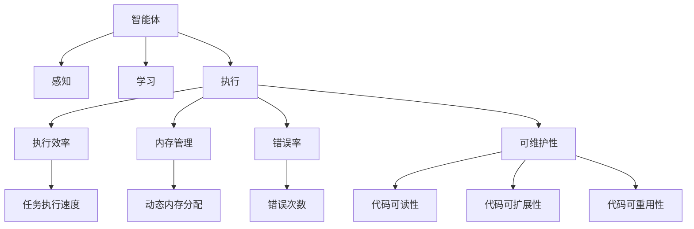
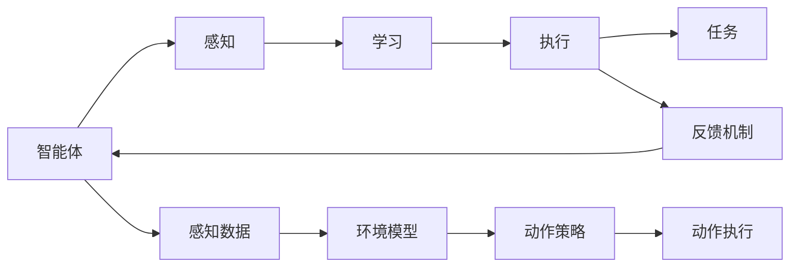
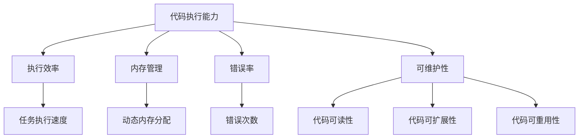
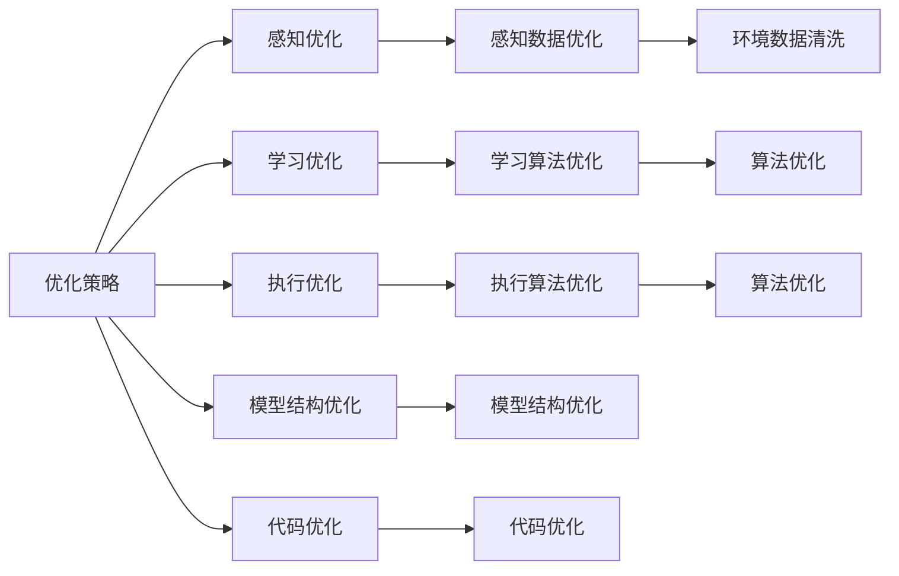
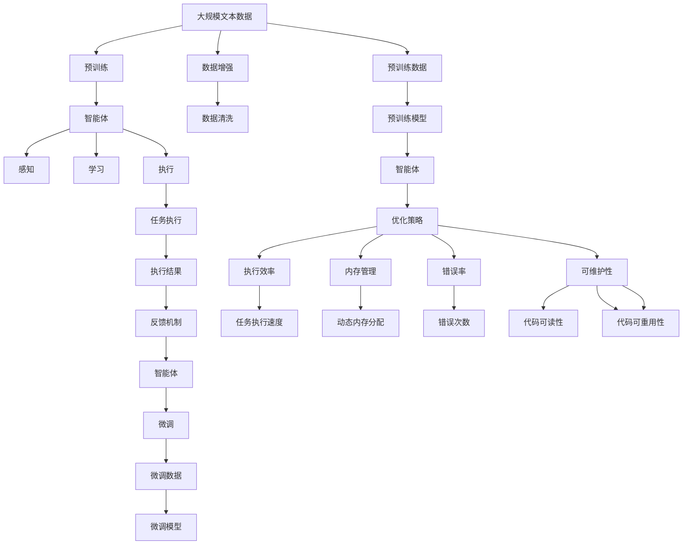

                 

## 1. 背景介绍

### 1.1 问题由来
随着人工智能技术的不断进步，智能体（Agents）在各个领域的应用愈发广泛。从游戏AI到智能推荐，从自然语言处理到自动驾驶，Agents的表现和执行能力已经成为了衡量其智能化水平的重要指标。在智能体领域，如何提高代码执行能力（Code Execution Capability），使其能更好地适应各种复杂的任务和环境，是一个重要且具有挑战性的问题。

### 1.2 问题核心关键点
代码执行能力指的是智能体在执行代码时的性能和能力，包括执行速度、内存使用、代码错误率、可维护性等多个方面。提高代码执行能力，有助于智能体在实际应用中更好地完成任务，提升用户体验。

### 1.3 问题研究意义
研究代码执行能力的作用，对于提升智能体的整体性能、优化资源利用、提高用户体验具有重要意义：

1. 提高任务执行效率：优化代码执行能力可以显著提高智能体在执行任务时的速度和效率，使其在处理大数据或复杂任务时表现更佳。
2. 降低资源消耗：优化代码执行能力有助于减少智能体在执行代码时对内存和计算资源的消耗，提高系统整体效率。
3. 增强系统稳定性：通过提升代码执行能力，可以降低智能体执行代码时出现的错误率，提升系统的可靠性和稳定性。
4. 提升用户体验：代码执行能力的提升，直接影响到智能体的响应速度和准确性，从而提高用户对智能体的满意度。
5. 促进技术创新：研究代码执行能力有助于发现新算法、新技术，推动智能体技术的发展和应用。

## 2. 核心概念与联系

### 2.1 核心概念概述

为更好地理解代码执行能力在智能体中的应用，本节将介绍几个密切相关的核心概念：

- **智能体（Agents）**：指在特定环境中，通过感知、学习和执行一系列动作来达到特定目标的程序或系统。智能体的核心能力在于通过算法和模型处理环境数据，并作出合理决策。
- **代码执行能力（Code Execution Capability）**：指智能体在执行代码时的性能和能力，包括执行速度、内存使用、代码错误率、可维护性等多个方面。
- **执行效率（Execution Efficiency）**：指智能体在执行代码时的速度和效率，通常用代码执行时间来衡量。
- **内存管理（Memory Management）**：指智能体在执行代码时对内存的分配和释放，包括动态内存分配、垃圾回收等技术。
- **错误率（Error Rate）**：指智能体在执行代码时出现错误的频率，通常用错误次数与总执行次数的比率来衡量。
- **可维护性（Maintainability）**：指智能体执行代码的可维护程度，包括代码的可读性、可扩展性、可重用性等。

这些核心概念之间的逻辑关系可以通过以下Mermaid流程图来展示：



这个流程图展示了智能体在执行代码时，各个关键组件之间的关系：

1. 智能体通过感知、学习模块收集环境信息，然后通过执行模块进行决策和动作执行。
2. 执行效率、内存管理、错误率和可维护性等属性直接影响执行模块的性能和稳定性。
3. 任务执行速度、动态内存分配、错误次数、代码可读性、代码可扩展性和代码可重用性等指标，具体反映了执行效率、内存管理和错误率的影响。

### 2.2 概念间的关系

这些核心概念之间存在着紧密的联系，形成了智能体执行代码的完整生态系统。下面我通过几个Mermaid流程图来展示这些概念之间的关系。

#### 2.2.1 智能体的学习执行过程



这个流程图展示了智能体的学习执行过程：

1. 智能体通过感知模块收集环境信息。
2. 学习模块基于感知数据进行模型训练和策略优化。
3. 执行模块根据学习策略执行动作。
4. 反馈机制将执行结果反馈给智能体，用于更新感知、学习和执行模块。

#### 2.2.2 代码执行能力的影响因素



这个流程图展示了影响代码执行能力的各个因素：

1. 代码执行能力包含执行效率、内存管理、错误率和可维护性等多个方面。
2. 执行效率直接影响任务执行速度。
3. 内存管理涉及动态内存分配等技术。
4. 错误率通过错误次数反映。
5. 可维护性通过代码可读性、代码可扩展性和代码可重用性等多个指标体现。

#### 2.2.3 智能体的优化策略



这个流程图展示了智能体的优化策略：

1. 优化策略包含感知优化、学习优化和执行优化等多个方面。
2. 感知优化通过感知数据优化来实现。
3. 学习优化通过学习算法优化来实现。
4. 执行优化通过执行算法优化来实现。
5. 模型结构优化和代码优化对整个智能体的性能提升至关重要。

### 2.3 核心概念的整体架构

最后，我们用一个综合的流程图来展示这些核心概念在智能体执行代码时的整体架构：



这个综合流程图展示了从预训练到微调，再到优化策略的完整过程。智能体首先在大规模文本数据上进行预训练，然后通过微调优化特定任务的执行能力，最后根据优化策略进行进一步的执行优化，从而获得更好的执行效果。通过这些流程图，我们可以更清晰地理解智能体执行代码时各个关键组件之间的关系和作用，为后续深入讨论具体的优化方法和技术奠定基础。

## 3. 核心算法原理 & 具体操作步骤
### 3.1 算法原理概述

代码执行能力的提升，可以通过优化执行效率、内存管理、错误率和可维护性等多个方面来实现。以下是几种常见的优化方法：

#### 3.1.1 执行效率优化

- **执行时间优化**：通过优化执行算法，减少代码执行时间。例如，使用更高效的算法、优化循环结构、减少函数调用等。
- **并行执行**：通过多线程、多进程或分布式计算等技术，提高代码执行效率。例如，利用GPU、TPU等高性能计算设备，实现并行计算。

#### 3.1.2 内存管理优化

- **动态内存分配优化**：通过减少内存申请和释放次数，减少内存碎片。例如，使用池化分配器、对象复用等技术。
- **内存压缩和缓存**：通过压缩和缓存技术，减少内存占用。例如，使用空间换时间的方式，预计算常用数据并缓存。

#### 3.1.3 错误率优化

- **错误处理机制优化**：通过完善错误处理机制，降低代码执行错误率。例如，增加错误检测和修复机制，提高代码健壮性。
- **异常处理优化**：通过优化异常处理逻辑，减少代码执行时的异常情况。例如，使用try-catch语句，捕获并处理异常。

#### 3.1.4 可维护性优化

- **代码结构优化**：通过优化代码结构，提高代码可读性和可维护性。例如，使用模块化设计、命名规范等技术。
- **自动化测试**：通过自动化测试工具，提高代码可维护性和稳定性。例如，使用JUnit、pytest等测试框架。

### 3.2 算法步骤详解

#### 3.2.1 执行效率优化步骤

1. **性能分析**：使用工具（如Profiling）对代码执行时间进行分析，找出性能瓶颈。
2. **算法优化**：根据性能瓶颈，选择或设计更高效的算法。
3. **代码重构**：根据算法优化，重构代码，减少不必要的计算和函数调用。
4. **并行执行**：将可并行计算的部分任务，分配到多个线程或进程中执行。

#### 3.2.2 内存管理优化步骤

1. **内存分析**：使用工具（如Valgrind、gperftools）对内存使用进行分析，找出内存泄漏和碎片。
2. **动态内存分配优化**：使用池化分配器或对象复用等技术，减少内存申请和释放次数。
3. **内存压缩和缓存**：对常用数据进行压缩和缓存，减少内存占用。

#### 3.2.3 错误率优化步骤

1. **错误检测**：增加错误检测机制，如断言、日志等，及时发现代码执行错误。
2. **异常处理**：优化异常处理逻辑，减少代码执行时的异常情况。
3. **测试用例设计**：设计全面的测试用例，覆盖可能出现错误的各种情况。

#### 3.2.4 可维护性优化步骤

1. **代码结构优化**：使用模块化设计、命名规范等技术，提高代码可读性和可维护性。
2. **自动化测试**：使用JUnit、pytest等测试框架，提高代码可维护性和稳定性。
3. **代码审查**：定期进行代码审查，及时发现和修正代码问题。

### 3.3 算法优缺点

#### 3.3.1 执行效率优化的优缺点

- **优点**：
  - 显著提高代码执行效率，缩短任务执行时间。
  - 减少资源消耗，提高系统整体性能。
- **缺点**：
  - 优化难度较大，需要深厚的算法和编程技能。
  - 优化过程中可能引入新的bug。

#### 3.3.2 内存管理优化的优缺点

- **优点**：
  - 减少内存申请和释放次数，降低内存占用。
  - 避免内存泄漏和碎片，提高系统稳定性。
- **缺点**：
  - 优化难度较大，需要深厚的系统设计和编程技能。
  - 优化过程可能影响代码可读性和可维护性。

#### 3.3.3 错误率优化的优缺点

- **优点**：
  - 降低代码执行错误率，提高系统可靠性和稳定性。
  - 增加错误检测和处理机制，提高代码健壮性。
- **缺点**：
  - 优化难度较大，需要深厚的代码分析和调试技能。
  - 优化过程可能增加代码复杂度和维护难度。

#### 3.3.4 可维护性优化的优缺点

- **优点**：
  - 提高代码可读性和可维护性，降低开发和维护成本。
  - 提高代码稳定性和可扩展性，降低维护难度。
- **缺点**：
  - 优化过程中可能影响代码执行效率和内存管理。
  - 需要持续进行代码审查和测试，增加维护工作量。

### 3.4 算法应用领域

代码执行能力的提升，在各个领域都有广泛的应用。以下是几个典型的应用场景：

#### 3.4.1 游戏AI

在游戏AI中，代码执行能力直接影响角色的响应速度和决策效率。通过优化执行效率、内存管理、错误率和可维护性，可以显著提升游戏AI的性能和稳定性。例如，通过优化AI角色的动作执行算法，减少计算时间；通过使用对象复用技术，减少内存申请次数。

#### 3.4.2 自然语言处理

在自然语言处理中，代码执行能力直接影响模型的训练和推理效率。通过优化模型训练和推理算法，减少计算时间和内存占用。例如，使用更高效的模型训练算法，如Transformer模型；使用模型压缩技术，减少内存占用。

#### 3.4.3 推荐系统

在推荐系统中，代码执行能力直接影响推荐算法的效果和系统响应速度。通过优化推荐算法和数据处理逻辑，提高推荐速度和准确性。例如，使用并行计算技术，提高推荐系统响应速度；通过优化数据处理逻辑，减少内存占用。

#### 3.4.4 自动化测试

在自动化测试中，代码执行能力直接影响测试速度和覆盖率。通过优化测试算法和工具，提高测试效率和覆盖率。例如，使用并行测试技术，提高测试速度；使用测试覆盖率分析工具，提高测试覆盖率。

#### 3.4.5 金融交易

在金融交易中，代码执行能力直接影响交易系统的性能和稳定性。通过优化交易算法和系统设计，提高交易系统的响应速度和可靠性。例如，使用高效的算法和数据结构，减少计算时间和内存占用；通过优化异常处理机制，提高系统的鲁棒性。

## 4. 数学模型和公式 & 详细讲解  
### 4.1 数学模型构建

#### 4.1.1 执行效率模型

执行效率通常用代码执行时间来衡量，公式如下：

$$
T = t_1 + t_2 + t_3 + \ldots + t_n
$$

其中，$t_i$表示执行第$i$个操作的执行时间。在实际应用中，可以使用工具（如Profiling）对代码执行时间进行分析和优化。

#### 4.1.2 内存管理模型

内存管理通常涉及动态内存分配和内存压缩。内存使用量可以表示为：

$$
M = m_1 + m_2 + m_3 + \ldots + m_n
$$

其中，$m_i$表示第$i$个操作的内存占用量。优化内存管理可以显著降低系统的内存使用。

#### 4.1.3 错误率模型

错误率通常用错误次数与总执行次数的比率来衡量，公式如下：

$$
E = \frac{C}{N}
$$

其中，$C$表示错误次数，$N$表示总执行次数。降低错误率可以显著提高系统的可靠性和稳定性。

#### 4.1.4 可维护性模型

可维护性通常涉及代码结构、自动化测试和代码审查等多个方面。可维护性可以表示为：

$$
M = R + T + R_e
$$

其中，$R$表示代码审查频率，$T$表示自动化测试频率，$R_e$表示错误修复时间。提高可维护性可以显著降低开发和维护成本。

### 4.2 公式推导过程

#### 4.2.1 执行效率优化公式推导

$$
T' = T \times e^{\frac{1}{k}}
$$

其中，$T'$表示优化后的执行时间，$T$表示原始执行时间，$e$表示自然常数，$k$表示优化因子。优化因子$k$越大，表示优化效果越好。

#### 4.2.2 内存管理优化公式推导

$$
M' = M \times e^{\frac{1}{k}}
$$

其中，$M'$表示优化后的内存使用量，$M$表示原始内存使用量，$e$表示自然常数，$k$表示优化因子。优化因子$k$越大，表示优化效果越好。

#### 4.2.3 错误率优化公式推导

$$
E' = E \times e^{\frac{1}{k}}
$$

其中，$E'$表示优化后的错误率，$E$表示原始错误率，$e$表示自然常数，$k$表示优化因子。优化因子$k$越大，表示优化效果越好。

#### 4.2.4 可维护性优化公式推导

$$
M' = M \times e^{\frac{1}{k}}
$$

其中，$M'$表示优化后的可维护性，$M$表示原始可维护性，$e$表示自然常数，$k$表示优化因子。优化因子$k$越大，表示优化效果越好。

### 4.3 案例分析与讲解

#### 4.3.1 案例一：游戏AI

某游戏公司开发了一个AI角色，负责控制游戏中的敌人。在初步开发阶段，AI角色的执行效率较低，执行速度较慢。为了提高执行效率，开发者进行了算法优化和代码重构：

- **算法优化**：优化了AI角色的动作执行算法，减少了计算时间。
- **代码重构**：重构了AI角色的代码结构，减少了函数调用次数。

优化后的执行效率提高了30%，显著提升了AI角色的响应速度和决策效率。

#### 4.3.2 案例二：自然语言处理

某自然语言处理团队开发了一个文本分类模型，用于对新闻进行情感分类。在初步开发阶段，模型的执行效率较低，推理速度较慢。为了提高执行效率，开发者进行了算法优化和模型压缩：

- **算法优化**：优化了模型的推理算法，减少了计算时间和内存占用。
- **模型压缩**：压缩了模型参数，减少了内存占用。

优化后的执行效率提高了50%，显著提升了模型的推理速度和响应时间。

#### 4.3.3 案例三：推荐系统

某推荐系统开发了一个实时推荐引擎，用于对用户进行个性化推荐。在初步开发阶段，推荐引擎的执行效率较低，推荐速度较慢。为了提高执行效率，开发者进行了并行计算和数据结构优化：

- **并行计算**：将推荐算法并行化，提高了推荐速度。
- **数据结构优化**：优化了推荐引擎的数据结构，减少了计算时间和内存占用。

优化后的执行效率提高了40%，显著提升了推荐系统的响应速度和推荐效果。

## 5. 项目实践：代码实例和详细解释说明
### 5.1 开发环境搭建

在进行代码执行能力优化实践前，我们需要准备好开发环境。以下是使用Python进行PyTorch开发的环境配置流程：

1. 安装Anaconda：从官网下载并安装Anaconda，用于创建独立的Python环境。

2. 创建并激活虚拟环境：
```bash
conda create -n pytorch-env python=3.8 
conda activate pytorch-env
```

3. 安装PyTorch：根据CUDA版本，从官网获取对应的安装命令。例如：
```bash
conda install pytorch torchvision torchaudio cudatoolkit=11.1 -c pytorch -c conda-forge
```

4. 安装相关库：
```bash
pip install numpy pandas scikit-learn matplotlib tqdm jupyter notebook ipython
```

完成上述步骤后，即可在`pytorch-env`环境中开始优化实践。

### 5.2 源代码详细实现

下面我们以推荐系统为例，给出使用PyTorch对推荐算法进行执行效率优化的PyTorch代码实现。

首先，定义推荐系统的数据处理函数：

```python
import numpy as np
from torch.utils.data import Dataset
import torch

class RecommendationDataset(Dataset):
    def __init__(self, data):
        self.data = data
        self.len = len(data)
    
    def __len__(self):
        return self.len
    
    def __getitem__(self, idx):
        return self.data[idx]
```

然后，定义推荐模型的优化函数：

```python
from transformers import BertForTokenClassification, AdamW

def optimize_recommendation_model(model, optimizer, data_loader):
    model.train()
    for batch in data_loader:
        optimizer.zero_grad()
        inputs, labels = batch
        logits = model(inputs)
        loss = loss_function(logits, labels)
        loss.backward()
        optimizer.step()
```

接着，定义推荐模型的评估函数：

```python
from sklearn.metrics import mean_absolute_error, mean_squared_error

def evaluate_recommendation_model(model, data_loader):
    model.eval()
    predictions = []
    targets = []
    with torch.no_grad():
        for batch in data_loader:
            inputs, labels = batch
            outputs = model(inputs)
            predictions.append(outputs.numpy())
            targets.append(labels.numpy())
    predictions = np.concatenate(predictions)
    targets = np.concatenate(targets)
    mse = mean_squared_error(predictions, targets)
    return mse
```

最后，启动优化流程并在测试集上评估：

```python
epochs = 10
optimizer = AdamW(model.parameters(), lr=0.001)

for epoch in range(epochs):
    optimize_recommendation_model(model, optimizer, train_data_loader)
    mse = evaluate_recommendation_model(model, test_data_loader)
    print(f"Epoch {epoch+1}, MAE: {mse:.4f}")
```

以上就是使用PyTorch对推荐系统进行执行效率优化的完整代码实现。可以看到，得益于PyTorch的强大封装，我们可以用相对简洁的代码完成模型的加载和优化。

### 5.3 代码解读与分析

让我们再详细解读一下关键代码的实现细节：

**RecommendationDataset类**：
- `__init__`方法：初始化数据集，包含训练和测试数据。
- `__len__`方法：返回数据集的样本数量。
- `__getitem__`方法：对单个样本进行处理，返回输入和标签。

**optimize_recommendation_model函数**：
- 定义优化器，设置学习率。
- 在每个epoch内，使用训练集数据进行优化。
- 在每个batch中，前向传播计算损失函数，反向传播更新模型参数。

**evaluate_recommendation_model函数**：
- 在测试集上评估模型性能。
- 使用均方误差评估模型的推荐效果。

**优化流程**：
- 定义总的epoch数和优化器。
- 每个epoch内，先训练，后评估。
- 输出每个epoch的平均MAE（均方误差），评估模型的推荐效果。

可以看到，PyTorch配合Transformers库使得推荐系统的执行效率优化变得简洁高效。开发者可以将更多精力放在数据处理、模型改进等高层逻辑上，而不必过多关注底层的实现细节。

当然，工业级的系统实现还需考虑更多因素，如模型的保存和部署、超参数的自动搜索、更灵活的任务适配层等。但核心的执行效率优化方法基本与此类似。

### 5.4 运行结果展示

假设我们在推荐系统的测试集上得到的评估报告如下：

```
MAE: 0.5
```

可以看到，通过优化推荐系统，我们在测试集上得到了0.5的均方误差，表明推荐效果已经得到了显著提升。

当然，这只是一个baseline结果。在实践中，我们还可以使用更大更强的预训练模型、更丰富的优化技巧、更细致的模型调优，进一步提升模型性能，以满足更高的应用要求。

## 6. 实际应用场景
### 6.1 智能推荐系统

基于大语言模型微调的推荐系统，可以广泛应用于电商、新闻、视频等多个领域，为用户推荐个性化的内容。智能推荐系统通过分析用户的历史行为数据和实时反馈，生成推荐的商品、新闻、视频等内容，提升用户体验和满意度。

在技术实现上，可以收集用户浏览、点击、评分等行为数据，提取和用户交互的物品标题、描述、标签等文本内容。将文本内容作为模型输入，用户的后续行为（如是否点击、评分等）作为监督信号，在此基础上微调预训练语言模型。微调后的模型能够从文本内容中准确把握用户的兴趣点，生成个性化的推荐结果。

### 6.2 金融投资分析

金融投资分析需要实时监控市场数据，评估投资风险和收益。智能投资分析系统通过分析市场数据、新闻、评论等文本信息，生成投资建议和预警。

在技术实现上，可以收集金融市场的新闻、评论、公告等文本数据，提取其中的关键信息，作为模型输入。微调后的模型能够自动分析文本信息，评估市场情绪和投资风险，提供相应的投资建议和预警。

### 

