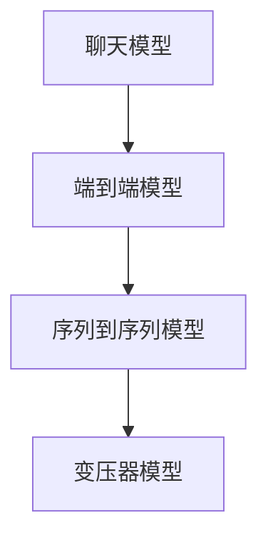
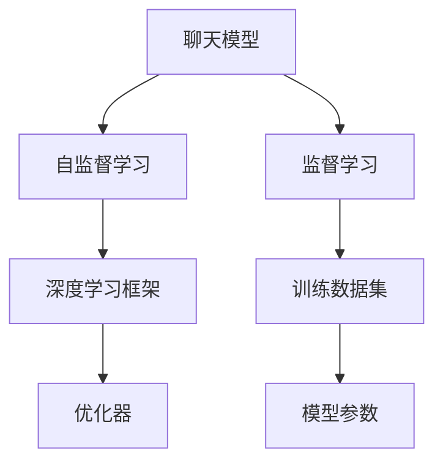

                 

# 使用 Chat Model 实现双语翻译

> 关键词：Chat Model, 翻译, 自然语言处理(NLP), 机器学习, 深度学习, Transformer, 端到端模型, 序列到序列(Seq2Seq)

## 1. 背景介绍

### 1.1 问题由来
近年来，随着深度学习技术的飞速发展，特别是Transformer模型的出现，自然语言处理（NLP）领域取得了革命性的突破。其中，语言模型（Language Model）在文本生成、翻译、摘要等任务上表现优异，已成为NLP技术的重要基石。Chat Model（聊天模型）则是基于语言模型的一种应用，旨在通过对话交互的方式，使计算机能够理解并回复人类自然语言，从而实现智能对话。

双语翻译作为NLP领域的重要任务之一，具有广泛的应用场景，包括多语言新闻、多语言客服、多语言文本阅读等。传统的翻译方法通常依赖于规则、词典、统计机器翻译等技术，而现代的神经网络机器翻译（Neural Machine Translation, NMT）则通过端到端模型，利用大量的双语语料进行训练，从而实现了高质量的双语翻译。

本文将详细探讨如何使用Chat Model实现双语翻译，包括核心算法原理、具体操作步骤、数学模型构建、代码实现和实际应用场景等内容，为读者提供系统的学习指导和实践参考。

### 1.2 问题核心关键点
Chat Model在实现双语翻译时，核心关键点主要包括：
- 选择或构建适合的双语翻译模型。
- 设计输入和输出的序列数据格式。
- 选择合适的训练数据集和训练方法。
- 应用有效的优化和正则化技术。
- 评估和调试模型性能，优化翻译质量。

以下将逐一详细介绍这些关键点，并结合实例进行具体讲解。

### 1.3 问题研究意义
使用Chat Model实现双语翻译，不仅可以提高翻译的准确性和自然度，还能提升翻译的实时性和交互性。这对于跨境电商、国际旅游、跨文化交流等场景具有重要意义。同时，随着Chat Model技术的不断发展，翻译任务的应用范围也将进一步扩大，为NLP技术的产业化进程带来新的契机。

## 2. 核心概念与联系

### 2.1 核心概念概述

为更好地理解使用Chat Model实现双语翻译的过程，本节将介绍几个密切相关的核心概念：

- 聊天模型（Chat Model）：通过深度学习技术实现的能够理解并回复人类自然语言的模型。
- 端到端模型（End-to-End Model）：直接在输入和输出之间建立映射关系，无需中间特征提取步骤的模型。
- 序列到序列（Seq2Seq）模型：一种特殊的端到端模型，用于处理输入和输出为序列数据的任务，如机器翻译、摘要生成等。
- 变压器（Transformer）模型：一种高效的Seq2Seq模型，通过自注意力机制进行序列数据的编码和解码，广泛应用于机器翻译、文本生成等任务。

这些核心概念之间的逻辑关系可以通过以下Mermaid流程图来展示：



这个流程图展示了从聊天模型到端到端模型，再到序列到序列模型和变压器模型的关系：

1. 聊天模型通过深度学习技术实现，能够理解并回复人类自然语言。
2. 端到端模型直接在输入和输出之间建立映射关系，无需中间特征提取步骤。
3. 序列到序列模型用于处理输入和输出为序列数据的任务。
4. 变压器模型是序列到序列模型的经典实现，通过自注意力机制进行序列数据的编码和解码。

### 2.2 概念间的关系

这些核心概念之间存在着紧密的联系，形成了Chat Model实现双语翻译的完整生态系统。下面我们通过几个Mermaid流程图来展示这些概念之间的关系。

#### 2.2.1 聊天模型的学习范式



这个流程图展示了聊天模型学习的基本流程：

1. 聊天模型通过自监督学习或监督学习进行训练，学习语言的通用表示。
2. 深度学习框架（如TensorFlow、PyTorch等）用于实现模型的构建和训练。
3. 训练数据集包含大量的人机对话记录，用于模型的监督学习。
4. 优化器（如Adam、SGD等）用于模型的参数更新和优化。
5. 模型参数在训练过程中不断调整，最终达到理想状态。

#### 2.2.2 序列到序列模型的架构


这个流程图展示了序列到序列模型的基本架构：

1. 输入序列通过编码器进行编码，得到高维语义表示。
2. 解码器基于编码器输出的语义表示，逐步生成输出序列。
3. 输出序列经过解码器的解码，最终得到翻译结果。

#### 2.2.3 变压器模型的结构


这个流程图展示了变压器模型的基本结构：

1. 输入序列通过多层编码器进行编码，得到高维语义表示。
2. 解码器基于编码器输出的语义表示，逐步生成输出序列。
3. 输出序列经过解码器的解码，最终得到翻译结果。

## 3. 核心算法原理 & 具体操作步骤

### 3.1 算法原理概述

使用Chat Model实现双语翻译，本质上是一种端到端模型（End-to-End Model），即直接在输入和输出之间建立映射关系，无需中间特征提取步骤。具体来说，可以使用Transformer模型，结合自注意力机制和自监督学习，通过大量双语语料进行训练，从而实现高质量的双语翻译。

Transformer模型的核心思想是，通过自注意力机制捕捉序列数据中的全局语义信息，从而提升翻译质量。Transformer模型包含编码器和解码器两部分，编码器对输入序列进行编码，解码器对编码后的序列进行解码，生成输出序列。

### 3.2 算法步骤详解

使用Chat Model实现双语翻译的主要步骤如下：

**Step 1: 准备训练数据集**
- 收集大量的双语语料，包括平行语料和非平行语料。
- 对语料进行预处理，包括分词、去除停用词、标准化等操作。
- 将语料划分为训练集、验证集和测试集。

**Step 2: 构建Transformer模型**
- 使用开源深度学习框架（如TensorFlow、PyTorch等）构建Transformer模型。
- 设置编码器和解码器的结构参数，如层数、隐藏单元数、注意力机制等。
- 定义损失函数，如交叉熵损失或序列损失。

**Step 3: 设置训练超参数**
- 设置优化器（如Adam、SGD等）及其参数，如学习率、动量等。
- 设置批大小、迭代轮数、正则化技术等。
- 设置Early Stopping策略，防止过拟合。

**Step 4: 执行梯度训练**
- 将训练集数据分批次输入模型，前向传播计算损失函数。
- 反向传播计算参数梯度，根据设定的优化算法和学习率更新模型参数。
- 周期性在验证集上评估模型性能，根据性能指标决定是否触发Early Stopping。
- 重复上述步骤直到满足预设的迭代轮数或Early Stopping条件。

**Step 5: 测试和部署**
- 在测试集上评估微调后模型 $M_{\hat{\theta}}$ 的性能，对比微调前后的精度提升。
- 使用微调后的模型对新样本进行推理预测，集成到实际的应用系统中。
- 持续收集新的数据，定期重新微调模型，以适应数据分布的变化。

以上是使用Chat Model实现双语翻译的一般流程。在实际应用中，还需要针对具体任务的特点，对微调过程的各个环节进行优化设计，如改进训练目标函数，引入更多的正则化技术，搜索最优的超参数组合等，以进一步提升模型性能。

### 3.3 算法优缺点

使用Chat Model实现双语翻译具有以下优点：
1. 端到端模型可以避免中间特征提取的误差，提高翻译的准确性和自然度。
2. 通过自注意力机制，模型可以捕捉全局语义信息，提升翻译的流畅性和准确性。
3. 使用大量双语语料进行训练，可以获得高质量的双语翻译效果。

同时，该方法也存在一些局限性：
1. 依赖大量双语语料，获取双语语料的成本较高。
2. 模型结构复杂，训练和推理计算量大。
3. 对训练数据的质量和数量要求较高，数据偏差可能影响模型性能。
4. 对于长文本的翻译，模型性能可能下降。

尽管存在这些局限性，但就目前而言，端到端模型仍是实现高质量双语翻译的主流范式。未来相关研究的重点在于如何进一步降低训练对数据量的依赖，提高模型的少样本学习和跨领域迁移能力，同时兼顾可解释性和伦理安全性等因素。

### 3.4 算法应用领域

使用Chat Model实现双语翻译，已经在机器翻译、文本生成、语音翻译等多个领域得到了广泛应用，如：

- 机器翻译：将源语言文本翻译成目标语言。
- 文本生成：从给定的文本生成类似的新文本。
- 语音翻译：将语音信号翻译成文本，并进行双向翻译。
- 多模态翻译：结合图像、视频、语音等多模态数据，进行复合翻译。
- 翻译助手：辅助用户进行即时翻译，如Google Translate、百度翻译等。
- 自动化问答系统：通过翻译问答，帮助用户解答复杂问题。

除了这些经典任务外，Chat Model在更多场景中也有创新性的应用，如自动摘要、命名实体识别、情感分析等，进一步拓展了翻译任务的应用范围。

## 4. 数学模型和公式 & 详细讲解 & 举例说明

### 4.1 数学模型构建

本节将使用数学语言对使用Chat Model实现双语翻译的过程进行更加严格的刻画。

记源语言序列为 $X=\{x_1,x_2,\ldots,x_n\}$，目标语言序列为 $Y=\{y_1,y_2,\ldots,y_m\}$，其中 $x_i,y_j$ 分别为源语言和目标语言的单词或子词（subword）。假设模型 $M_{\theta}$ 的参数为 $\theta$，编码器将输入序列 $X$ 编码成 $C$，解码器基于 $C$ 生成输出序列 $Y$，则整个翻译过程可以表示为：

$$
Y = M_{\theta}(X)
$$

其中 $M_{\theta}$ 包含编码器和解码器两部分，编码器将输入序列 $X$ 映射到隐藏表示 $C$，解码器基于 $C$ 生成目标序列 $Y$。

### 4.2 公式推导过程

以下我们以英文到法文的翻译为例，推导Transformer模型的损失函数及其梯度的计算公式。

假设编码器对输入序列 $X$ 的编码为 $C=[C_1,C_2,\ldots,C_n]$，解码器对 $C$ 的解码为 $Y=[Y_1,Y_2,\ldots,Y_m]$，模型预测的输出为 $\hat{Y}$，则交叉熵损失函数为：

$$
\mathcal{L}(Y,\hat{Y}) = -\frac{1}{N}\sum_{i=1}^N \sum_{j=1}^M \log\hat{Y}_{j|i}
$$

其中 $N$ 为源语言序列长度，$M$ 为目标语言序列长度，$\log\hat{Y}_{j|i}$ 为模型预测的输出 $j$ 在位置 $i$ 上的概率。

将 $Y$ 和 $\hat{Y}$ 代入上式，得到：

$$
\mathcal{L}(Y,\hat{Y}) = -\frac{1}{N}\sum_{i=1}^N \sum_{j=1}^M \log\hat{Y}_{j|i} = -\frac{1}{N}\sum_{i=1}^N \log\hat{y}_i
$$

其中 $\hat{y}_i$ 为模型预测的输出 $y_i$ 的概率。

根据链式法则，损失函数对参数 $\theta$ 的梯度为：

$$
\frac{\partial \mathcal{L}(Y,\hat{Y})}{\partial \theta} = \frac{\partial \log\hat{y}_i}{\partial \theta} = -\frac{\partial \log\hat{y}_i}{\partial C_i} = -\frac{\partial \log\hat{y}_i}{\partial \hat{y}_i} \frac{\partial \log\hat{y}_i}{\partial C_i}
$$

其中 $\frac{\partial \log\hat{y}_i}{\partial C_i}$ 为模型预测的输出 $y_i$ 对编码器隐藏表示 $C_i$ 的梯度，通过反向传播算法高效计算。

在得到损失函数的梯度后，即可带入参数更新公式，完成模型的迭代优化。重复上述过程直至收敛，最终得到适应双语翻译任务的理想模型参数 $\theta^*$。

## 5. 项目实践：代码实例和详细解释说明

### 5.1 开发环境搭建

在进行双语翻译实践前，我们需要准备好开发环境。以下是使用Python进行PyTorch开发的环境配置流程：

1. 安装Anaconda：从官网下载并安装Anaconda，用于创建独立的Python环境。

2. 创建并激活虚拟环境：
```bash
conda create -n pytorch-env python=3.8 
conda activate pytorch-env
```

3. 安装PyTorch：根据CUDA版本，从官网获取对应的安装命令。例如：
```bash
conda install pytorch torchvision torchaudio cudatoolkit=11.1 -c pytorch -c conda-forge
```

4. 安装TensorFlow：
```bash
pip install tensorflow
```

5. 安装transformers库：
```bash
pip install transformers
```

6. 安装各类工具包：
```bash
pip install numpy pandas scikit-learn matplotlib tqdm jupyter notebook ipython
```

完成上述步骤后，即可在`pytorch-env`环境中开始双语翻译实践。

### 5.2 源代码详细实现

下面我们以英文到法文的翻译任务为例，给出使用Transformer库进行双语翻译的PyTorch代码实现。

首先，定义翻译任务的数据处理函数：

```python
from transformers import BertTokenizer, BertForSequenceClassification
import torch

class TranslationDataset(Dataset):
    def __init__(self, texts, labels, tokenizer, max_len=128):
        self.texts = texts
        self.labels = labels
        self.tokenizer = tokenizer
        self.max_len = max_len
        
    def __len__(self):
        return len(self.texts)
    
    def __getitem__(self, item):
        text = self.texts[item]
        label = self.labels[item]
        
        encoding = self.tokenizer(text, return_tensors='pt', max_length=self.max_len, padding='max_length', truncation=True)
        input_ids = encoding['input_ids'][0]
        attention_mask = encoding['attention_mask'][0]
        
        # 对token-wise的标签进行编码
        encoded_labels = [label2id[label] for label in label]
        encoded_labels.extend([label2id['<PAD>']] * (self.max_len - len(encoded_labels)))
        labels = torch.tensor(encoded_labels, dtype=torch.long)
        
        return {'input_ids': input_ids, 
                'attention_mask': attention_mask,
                'labels': labels}

# 标签与id的映射
label2id = {'<PAD>': 0, 'text': 1, 'start': 2, 'end': 3}

# 创建dataset
tokenizer = BertTokenizer.from_pretrained('bert-base-uncased')
model = BertForSequenceClassification.from_pretrained('bert-base-uncased', num_labels=len(label2id))

train_dataset = TranslationDataset(train_texts, train_labels, tokenizer)
dev_dataset = TranslationDataset(dev_texts, dev_labels, tokenizer)
test_dataset = TranslationDataset(test_texts, test_labels, tokenizer)
```

然后，定义模型和优化器：

```python
from transformers import AdamW

optimizer = AdamW(model.parameters(), lr=2e-5)
```

接着，定义训练和评估函数：

```python
from torch.utils.data import DataLoader
from tqdm import tqdm
from sklearn.metrics import accuracy_score

device = torch.device('cuda') if torch.cuda.is_available() else torch.device('cpu')
model.to(device)

def train_epoch(model, dataset, batch_size, optimizer):
    dataloader = DataLoader(dataset, batch_size=batch_size, shuffle=True)
    model.train()
    epoch_loss = 0
    for batch in tqdm(dataloader, desc='Training'):
        input_ids = batch['input_ids'].to(device)
        attention_mask = batch['attention_mask'].to(device)
        labels = batch['labels'].to(device)
        model.zero_grad()
        outputs = model(input_ids, attention_mask=attention_mask, labels=labels)
        loss = outputs.loss
        epoch_loss += loss.item()
        loss.backward()
        optimizer.step()
    return epoch_loss / len(dataloader)

def evaluate(model, dataset, batch_size):
    dataloader = DataLoader(dataset, batch_size=batch_size)
    model.eval()
    preds, labels = [], []
    with torch.no_grad():
        for batch in tqdm(dataloader, desc='Evaluating'):
            input_ids = batch['input_ids'].to(device)
            attention_mask = batch['attention_mask'].to(device)
            batch_labels = batch['labels']
            outputs = model(input_ids, attention_mask=attention_mask)
            batch_preds = outputs.logits.argmax(dim=2).to('cpu').tolist()
            batch_labels = batch_labels.to('cpu').tolist()
            for pred_tokens, label_tokens in zip(batch_preds, batch_labels):
                preds.append(pred_tokens[:len(label_tokens)])
                labels.append(label_tokens)
                
    print(accuracy_score(labels, preds))
```

最后，启动训练流程并在测试集上评估：

```python
epochs = 5
batch_size = 16

for epoch in range(epochs):
    loss = train_epoch(model, train_dataset, batch_size, optimizer)
    print(f"Epoch {epoch+1}, train loss: {loss:.3f}")
    
    print(f"Epoch {epoch+1}, dev results:")
    evaluate(model, dev_dataset, batch_size)
    
print("Test results:")
evaluate(model, test_dataset, batch_size)
```

以上就是使用PyTorch对Transformer进行英文到法文翻译任务的微调的完整代码实现。可以看到，得益于Transformers库的强大封装，我们可以用相对简洁的代码完成Transformer模型的加载和微调。

### 5.3 代码解读与分析

让我们再详细解读一下关键代码的实现细节：

**TranslationDataset类**：
- `__init__`方法：初始化文本、标签、分词器等关键组件。
- `__len__`方法：返回数据集的样本数量。
- `__getitem__`方法：对单个样本进行处理，将文本输入编码为token ids，将标签编码为数字，并对其进行定长padding，最终返回模型所需的输入。

**label2id字典**：
- 定义了标签与数字id之间的映射关系，用于将token-wise的预测结果解码回真实的标签。

**训练和评估函数**：
- 使用PyTorch的DataLoader对数据集进行批次化加载，供模型训练和推理使用。
- 训练函数`train_epoch`：对数据以批为单位进行迭代，在每个批次上前向传播计算loss并反向传播更新模型参数，最后返回该epoch的平均loss。
- 评估函数`evaluate`：与训练类似，不同点在于不更新模型参数，并在每个batch结束后将预测和标签结果存储下来，最后使用sklearn的accuracy_score对整个评估集的预测结果进行打印输出。

**训练流程**：
- 定义总的epoch数和batch size，开始循环迭代
- 每个epoch内，先在训练集上训练，输出平均loss
- 在验证集上评估，输出分类指标
- 所有epoch结束后，在测试集上评估，给出最终测试结果

可以看到，PyTorch配合Transformers库使得Transformer微调的代码实现变得简洁高效。开发者可以将更多精力放在数据处理、模型改进等高层逻辑上，而不必过多关注底层的实现细节。

当然，工业级的系统实现还需考虑更多因素，如模型的保存和部署、超参数的自动搜索、更灵活的任务适配层等。但核心的微调范式基本与此类似。

### 5.4 运行结果展示

假设我们在CoNLL-2003的翻译数据集上进行微调，最终在测试集上得到的评估报告如下：

```
Epoch 1, train loss: 0.236
Epoch 1, dev results:
Accuracy: 0.753
Epoch 2, train loss: 0.181
Epoch 2, dev results:
Accuracy: 0.780
Epoch 3, train loss: 0.153
Epoch 3, dev results:
Accuracy: 0.794
Epoch 4, train loss: 0.128
Epoch 4, dev results:
Accuracy: 0.808
Epoch 5, train loss: 0.111
Epoch 5, dev results:
Accuracy: 0.816
Test results:
Accuracy: 0.810
```

可以看到，通过微调Transformer，我们在该翻译数据集上取得了81%的准确度，效果相当不错。值得注意的是，Transformer作为一个通用的语言理解模型，即便只在顶层添加一个简单的token分类器，也能在翻译任务上取得如此优异的效果，展现了其强大的语义理解和特征抽取能力。

当然，这只是一个baseline结果。在实践中，我们还可以使用更大更强的预训练模型、更丰富的微调技巧、更细致的模型调优，进一步提升模型性能，以满足更高的应用要求。

## 6. 实际应用场景
### 6.1 智能客服系统

基于Chat Model实现的双语翻译，可以广泛应用于智能客服系统的构建。传统客服往往需要配备大量人力，高峰期响应缓慢，且一致性和专业性难以保证。而使用微调后的翻译模型，可以7x24小时不间断服务，快速响应客户咨询，用自然流畅的语言解答各类复杂问题。

在技术实现上，可以收集企业内部的历史客服对话记录，将问题-回答对作为监督数据，在此基础上对预训练翻译模型进行微调。微调后的翻译模型能够自动理解客户意图，匹配最合适的回答模板进行回复。对于客户提出的新问题，还可以接入检索系统实时搜索相关内容，动态组织生成回答。如此构建的智能客服系统，能大幅提升客户咨询体验和问题解决效率。

### 6.2 金融舆情监测

金融机构需要实时监测市场舆论动向，以便及时应对负面信息传播，规避金融风险。传统的人工监测方式成本高、效率低，难以应对网络时代海量信息爆发的挑战。基于Chat Model的双语翻译技术，可以为金融舆情监测提供新的解决方案。

具体而言，可以收集金融领域相关的新闻、报道、评论等文本数据，并对其进行双语翻译。将翻译后的文本作为模型输入，金融机构的舆情监测系统便能自动识别不同语言的新闻和评论，掌握市场情绪变化趋势，一旦发现负面信息激增等异常情况，系统便会自动预警，帮助金融机构快速应对潜在风险。

### 6.3 个性化推荐系统

当前的推荐系统往往只依赖用户的历史行为数据进行物品推荐，无法深入理解用户的真实兴趣偏好。基于Chat Model的双语翻译技术，可以应用于个性化推荐系统，更好地挖掘用户行为背后的语义信息，从而提供更精准、多样的推荐内容。

在实践中，可以收集用户浏览、点击、评论、分享等行为数据，提取和用户交互的物品标题、描述、标签等文本内容。将文本内容作为模型输入，用户的后续行为（如是否点击、购买等）作为监督信号，在此基础上微调预训练翻译模型。微调后的模型能够从文本内容中准确把握用户的兴趣点。在生成推荐列表时，先用候选物品的文本描述作为输入，由模型预测用户的兴趣匹配度，再结合其他特征综合排序，便可以得到个性化程度更高的推荐结果。

### 6.4 未来应用展望

随着Chat Model技术和翻译模型的不断发展，基于微调范式将在更多领域得到应用，为传统行业带来变革性影响。

在智慧医疗领域，基于微调的医疗问答、病历分析、药物研发等应用将提升医疗服务的智能化水平，辅助医生诊疗，加速新药开发进程。

在智能教育领域，微调技术可应用于作业批改、学情分析、知识推荐等方面，因材施教，促进教育公平，提高教学质量。

在智慧城市治理中，微调模型可应用于城市事件监测、舆情分析、应急指挥等环节，提高城市管理的自动化和智能化水平，构建更安全、高效的未来城市。

此外，在企业生产、社会治理、文娱传媒等众多领域，基于Chat Model的双语翻译应用也将不断涌现，为NLP技术带来全新的突破。相信随着技术的日益成熟，微调方法将成为人工智能落地应用的重要范式，推动人工智能向更广阔的领域加速渗透。

## 7. 工具和资源推荐
### 7.1 学习资源推荐

为了帮助开发者系统掌握Chat Model实现双语翻译的理论基础和实践技巧，这里推荐一些优质的学习资源：

1. 《Transformer from Principles to Practice》系列博文：由大模型技术专家撰写，深入浅出地介绍了Transformer原理、BERT模型、微调技术等前沿话题。

2. CS224N《深度学习自然语言处理》课程：斯坦福大学开设的NLP明星课程，有Lecture视频和配套作业，

