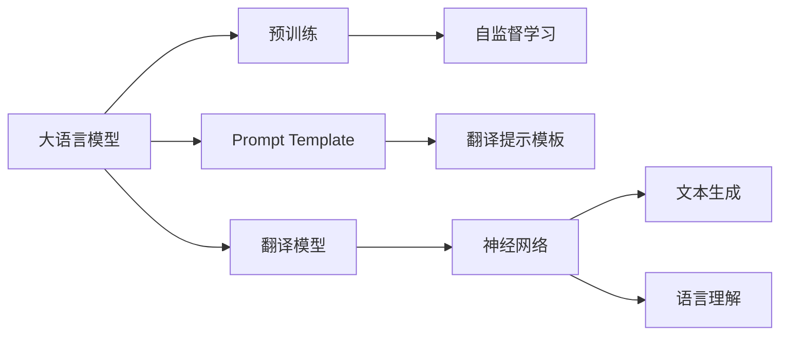
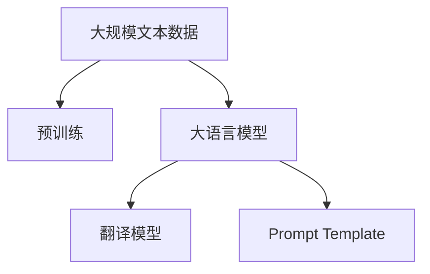
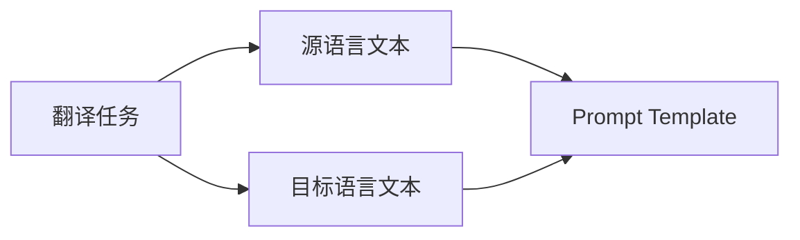
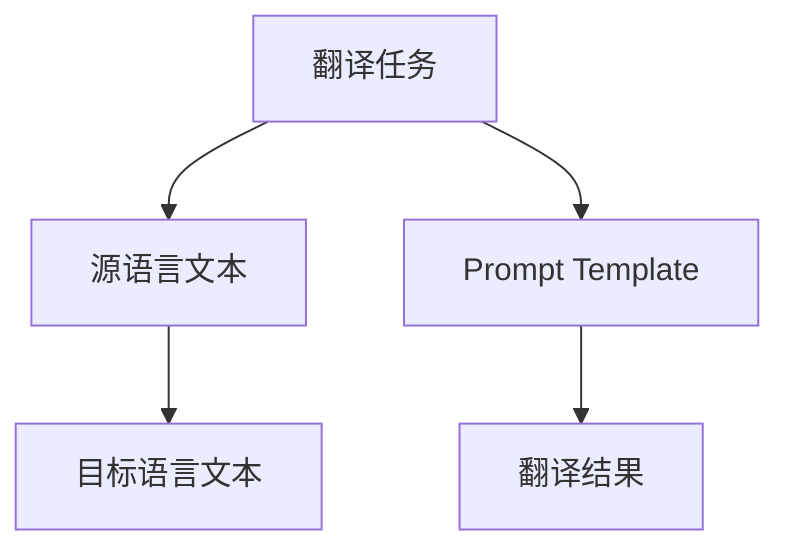

                 

# 使用 Chat Prompt Template 设计翻译提示模板

> 关键词：大语言模型,翻译,提示模板,Prompt Engineering,神经网络,文本生成,语言理解

## 1. 背景介绍

### 1.1 问题由来
随着自然语言处理（NLP）技术的快速发展，大语言模型（Large Language Models, LLMs）在翻译、对话、摘要、情感分析等任务上取得了显著进展。然而，在实际应用中，大语言模型的泛化能力和鲁棒性仍需进一步提升。近年来，通过Prompt Engineering的方式，设计有效的Prompt模板，成为提高模型性能的关键手段之一。

Prompt Engineering通过精心设计的输入文本格式，引导大语言模型按期望方式输出，从而在零样本或少样本学习中取得优异表现。在翻译任务中，Prompt Engineering同样可以发挥重要作用，通过设计合适的Prompt模板，可以实现更加高效、准确的翻译效果。

### 1.2 问题核心关键点
Prompt Engineering的核心在于如何设计合适的Prompt，使其能够最大程度地引导大语言模型生成期望的输出。在翻译任务中，Prompt的设计需要考虑源语言、目标语言、待翻译文本、翻译策略等多个因素。

设计良好的Prompt模板，能够帮助大语言模型准确理解输入，减少噪音干扰，提高翻译质量。此外，Prompt的设计还需要考虑可扩展性，使其能够适应不同类型的翻译任务。

### 1.3 问题研究意义
Prompt Engineering在提升大语言模型的泛化能力、减少过拟合、优化翻译质量等方面具有重要意义。通过精心设计的Prompt模板，可以显著提高翻译任务的性能，加速NLP技术的产业化进程，为各行各业提供更智能、高效的语言服务。

Prompt Engineering还能带来技术创新，如零样本学习和少样本学习，为预训练语言模型的应用带来新的思路和方向。通过持续的研究和优化，Prompt Engineering必将在构建人机协同的智能时代中扮演越来越重要的角色。

## 2. 核心概念与联系

### 2.1 核心概念概述

为更好地理解Prompt Engineering在翻译任务中的应用，本节将介绍几个密切相关的核心概念：

- 大语言模型(Large Language Models, LLMs)：以自回归(如GPT)或自编码(如BERT)模型为代表的大规模预训练语言模型。通过在大规模无标签文本语料上进行预训练，学习通用的语言表示，具备强大的语言理解和生成能力。

- 预训练(Pre-training)：指在大规模无标签文本语料上，通过自监督学习任务训练通用语言模型的过程。常见的预训练任务包括言语建模、遮挡语言模型等。

- Prompt Template：针对特定任务设计的输入文本格式，用于引导大语言模型生成输出。Prompt Template是Prompt Engineering的核心工具，对翻译任务的性能影响巨大。

- 翻译(Translation)：将一种语言转换成另一种语言的过程。翻译任务要求大语言模型理解源语言的含义，并生成目标语言的表达。

- 翻译模型(Translation Model)：用于翻译任务的神经网络模型，如Seq2Seq、Transformer等。

- 神经网络(Neural Network)：一种基于生物神经网络启发原理构建的计算模型，通过学习输入与输出之间的映射关系，实现复杂的计算和推理。

- 文本生成(Text Generation)：通过神经网络模型生成自然语言文本的过程。在翻译任务中，大语言模型通过生成目标语言的句子实现翻译。

- 语言理解(Language Understanding)：通过神经网络模型理解自然语言文本的含义。在翻译任务中，大语言模型需要准确理解源语言句子的含义，才能进行正确的翻译。

这些核心概念之间的逻辑关系可以通过以下Mermaid流程图来展示：



这个流程图展示了大语言模型在翻译任务中的核心概念及其之间的关系：

1. 大语言模型通过预训练获得基础能力。
2. Prompt Template用于指导大语言模型生成翻译结果。
3. 翻译模型基于神经网络实现，进行翻译任务的输出。
4. 文本生成和语言理解是大语言模型在翻译任务中的关键能力。

### 2.2 概念间的关系

这些核心概念之间存在着紧密的联系，形成了大语言模型翻译任务的完整生态系统。下面我们通过几个Mermaid流程图来展示这些概念之间的关系。

#### 2.2.1 大语言模型的学习范式



这个流程图展示了大语言模型的学习范式，即通过预训练获得基础能力，然后通过Prompt Template实现翻译任务的输出。

#### 2.2.2 翻译任务与Prompt Template的关系



这个流程图展示了翻译任务与Prompt Template的关系，即通过Prompt Template，大语言模型能够理解源语言文本，并生成目标语言文本。

#### 2.2.3 Prompt Template的设计过程



这个流程图展示了Prompt Template的设计过程，即通过设计合适的Prompt Template，引导大语言模型生成翻译结果。

## 3. 核心算法原理 & 具体操作步骤
### 3.1 算法原理概述

Prompt Engineering的核心在于如何设计合适的Prompt Template，使其能够最大程度地引导大语言模型生成期望的输出。在翻译任务中，Prompt Template的设计需要考虑源语言、目标语言、待翻译文本、翻译策略等多个因素。

设计良好的Prompt Template，能够帮助大语言模型准确理解输入，减少噪音干扰，提高翻译质量。此外，Prompt的设计还需要考虑可扩展性，使其能够适应不同类型的翻译任务。

### 3.2 算法步骤详解

Prompt Engineering的具体步骤包括以下几个关键环节：

**Step 1: 定义任务与数据集**
- 明确翻译任务的具体要求，包括源语言、目标语言、待翻译文本、翻译策略等。
- 准备翻译任务的标注数据集，如英中、中英翻译对等，用于微调和评估模型。

**Step 2: 设计Prompt Template**
- 根据任务要求，设计合适的Prompt Template。
- 考虑到不同语言的特点，调整Prompt Template的格式。
- 设计多种Prompt Template，以应对不同的翻译场景。

**Step 3: 微调模型**
- 使用准备好的Prompt Template和标注数据集，微调大语言模型。
- 优化模型超参数，如学习率、批大小、迭代轮数等。
- 在验证集上评估模型性能，根据性能指标决定是否调整Prompt Template。

**Step 4: 测试与评估**
- 在测试集上评估微调后的模型性能，对比原始模型的翻译质量。
- 分析Prompt Template对模型性能的影响，调整Prompt Template。
- 生成翻译结果，进行人工评估和优化。

### 3.3 算法优缺点

Prompt Engineering在翻译任务中具有以下优点：

- 灵活性高：通过设计多种Prompt Template，适应不同类型的翻译任务。
- 泛化能力强：通过训练大规模标注数据集，提高模型的泛化能力。
- 零样本学习：在少量标注样本下，通过精心设计的Prompt Template，也能取得不错的翻译效果。

Prompt Engineering也存在以下缺点：

- 设计复杂：设计合适的Prompt Template需要经验和技巧，难以自动化。
- 数据依赖：翻译模型的性能很大程度上取决于翻译数据的丰富程度。
- 资源消耗：微调大语言模型需要较大的计算资源和时间，增加应用成本。

尽管存在这些缺点，但就目前而言，Prompt Engineering仍是大语言模型翻译任务的主流范式。未来相关研究的重点在于如何进一步降低Prompt设计对经验的需求，提高模型的零样本和少样本学习能力，同时兼顾可解释性和伦理安全性等因素。

### 3.4 算法应用领域

Prompt Engineering在大语言模型的翻译任务中，已经得到了广泛的应用。具体包括：

- 英中翻译：将英文文本翻译成中文。
- 中英翻译：将中文文本翻译成英文。
- 多语言翻译：将一种语言翻译成多种语言。
- 语言对转换：将文本从一种语言对转换成另一种语言对，如将英文到中文再翻译成日文。

除了翻译任务，Prompt Engineering还被创新性地应用到更多场景中，如可控文本生成、对话生成、摘要生成等，为NLP技术带来了全新的突破。随着Prompt Engineering和预训练语言模型的持续演进，相信NLP技术将在更广阔的应用领域大放异彩。

## 4. 数学模型和公式 & 详细讲解  
### 4.1 数学模型构建

本节将使用数学语言对Prompt Engineering在翻译任务中的应用进行更加严格的刻画。

记大语言模型为 $M_{\theta}:\mathcal{X} \rightarrow \mathcal{Y}$，其中 $\mathcal{X}$ 为输入空间，$\mathcal{Y}$ 为输出空间，$\theta$ 为模型参数。假设翻译任务的数据集为 $D=\{(x_i,y_i)\}_{i=1}^N$，其中 $x_i$ 为源语言文本，$y_i$ 为目标语言文本。

定义模型 $M_{\theta}$ 在输入 $x$ 上的输出为 $y=M_{\theta}(x)$，损失函数为 $\ell(M_{\theta}(x),y)$。在微调过程中，我们希望最小化损失函数：

$$
\min_{\theta} \frac{1}{N} \sum_{i=1}^N \ell(M_{\theta}(x_i),y_i)
$$

在具体实现中，我们通常使用基于梯度的优化算法（如SGD、Adam等）来近似求解上述最优化问题。设 $\eta$ 为学习率，则参数的更新公式为：

$$
\theta \leftarrow \theta - \eta \nabla_{\theta}\mathcal{L}(\theta)
$$

其中 $\nabla_{\theta}\mathcal{L}(\theta)$ 为损失函数对参数 $\theta$ 的梯度，可通过反向传播算法高效计算。

### 4.2 公式推导过程

以下我们以英中翻译任务为例，推导交叉熵损失函数及其梯度的计算公式。

假设模型 $M_{\theta}$ 在输入 $x$ 上的输出为 $\hat{y}=M_{\theta}(x)$，表示样本属于目标语言的概率。真实标签 $y \in \{1,0\}$。则二分类交叉熵损失函数定义为：

$$
\ell(M_{\theta}(x),y) = -[y\log \hat{y} + (1-y)\log (1-\hat{y})]
$$

将其代入损失函数公式，得：

$$
\mathcal{L}(\theta) = -\frac{1}{N}\sum_{i=1}^N [y_i\log M_{\theta}(x_i)+(1-y_i)\log(1-M_{\theta}(x_i))]
$$

根据链式法则，损失函数对参数 $\theta_k$ 的梯度为：

$$
\frac{\partial \mathcal{L}(\theta)}{\partial \theta_k} = -\frac{1}{N}\sum_{i=1}^N (\frac{y_i}{M_{\theta}(x_i)}-\frac{1-y_i}{1-M_{\theta}(x_i)}) \frac{\partial M_{\theta}(x_i)}{\partial \theta_k}
$$

其中 $\frac{\partial M_{\theta}(x_i)}{\partial \theta_k}$ 可进一步递归展开，利用自动微分技术完成计算。

在得到损失函数的梯度后，即可带入参数更新公式，完成模型的迭代优化。重复上述过程直至收敛，最终得到适应翻译任务的最优模型参数 $\theta^*$。

## 5. 项目实践：代码实例和详细解释说明
### 5.1 开发环境搭建

在进行Prompt Engineering实践前，我们需要准备好开发环境。以下是使用Python进行PyTorch开发的环境配置流程：

1. 安装Anaconda：从官网下载并安装Anaconda，用于创建独立的Python环境。

2. 创建并激活虚拟环境：
```bash
conda create -n pytorch-env python=3.8 
conda activate pytorch-env
```

3. 安装PyTorch：根据CUDA版本，从官网获取对应的安装命令。例如：
```bash
conda install pytorch torchvision torchaudio cudatoolkit=11.1 -c pytorch -c conda-forge
```

4. 安装Transformers库：
```bash
pip install transformers
```

5. 安装各类工具包：
```bash
pip install numpy pandas scikit-learn matplotlib tqdm jupyter notebook ipython
```

完成上述步骤后，即可在`pytorch-env`环境中开始Prompt Engineering实践。

### 5.2 源代码详细实现

下面我们以英中翻译任务为例，给出使用Transformers库对GPT模型进行Prompt Engineering的PyTorch代码实现。

首先，定义翻译任务的数据处理函数：

```python
from transformers import GPT2Tokenizer
from torch.utils.data import Dataset
import torch

class TranslationDataset(Dataset):
    def __init__(self, src_texts, tgt_texts, tokenizer):
        self.src_texts = src_texts
        self.tgt_texts = tgt_texts
        self.tokenizer = tokenizer
        
    def __len__(self):
        return len(self.src_texts)
    
    def __getitem__(self, item):
        src_text = self.src_texts[item]
        tgt_text = self.tgt_texts[item]
        
        encoding = self.tokenizer(src_text, return_tensors='pt', max_length=128, padding='max_length', truncation=True)
        input_ids = encoding['input_ids'][0]
        attention_mask = encoding['attention_mask'][0]
        
        # 对token-wise的标签进行编码
        encoded_tags = [tag2id[tag] for tag in tgt_text] 
        encoded_tags.extend([tag2id['<pad>']] * (self.max_len - len(encoded_tags)))
        labels = torch.tensor(encoded_tags, dtype=torch.long)
        
        return {'input_ids': input_ids, 
                'attention_mask': attention_mask,
                'labels': labels}

# 标签与id的映射
tag2id = {'<pad>': 0, '1': 1, '0': 0}
id2tag = {v: k for k, v in tag2id.items()}

# 创建dataset
tokenizer = GPT2Tokenizer.from_pretrained('gpt2')

train_dataset = TranslationDataset(train_src_texts, train_tgt_texts, tokenizer)
dev_dataset = TranslationDataset(dev_src_texts, dev_tgt_texts, tokenizer)
test_dataset = TranslationDataset(test_src_texts, test_tgt_texts, tokenizer)
```

然后，定义模型和优化器：

```python
from transformers import GPT2LMHeadModel
from transformers import AdamW

model = GPT2LMHeadModel.from_pretrained('gpt2', num_labels=len(tag2id))

optimizer = AdamW(model.parameters(), lr=2e-5)
```

接着，定义训练和评估函数：

```python
from torch.utils.data import DataLoader
from tqdm import tqdm
from sklearn.metrics import classification_report

device = torch.device('cuda') if torch.cuda.is_available() else torch.device('cpu')
model.to(device)

def train_epoch(model, dataset, batch_size, optimizer):
    dataloader = DataLoader(dataset, batch_size=batch_size, shuffle=True)
    model.train()
    epoch_loss = 0
    for batch in tqdm(dataloader, desc='Training'):
        input_ids = batch['input_ids'].to(device)
        attention_mask = batch['attention_mask'].to(device)
        labels = batch['labels'].to(device)
        model.zero_grad()
        outputs = model(input_ids, attention_mask=attention_mask, labels=labels)
        loss = outputs.loss
        epoch_loss += loss.item()
        loss.backward()
        optimizer.step()
    return epoch_loss / len(dataloader)

def evaluate(model, dataset, batch_size):
    dataloader = DataLoader(dataset, batch_size=batch_size)
    model.eval()
    preds, labels = [], []
    with torch.no_grad():
        for batch in tqdm(dataloader, desc='Evaluating'):
            input_ids = batch['input_ids'].to(device)
            attention_mask = batch['attention_mask'].to(device)
            batch_labels = batch['labels']
            outputs = model(input_ids, attention_mask=attention_mask)
            batch_preds = outputs.logits.argmax(dim=2).to('cpu').tolist()
            batch_labels = batch_labels.to('cpu').tolist()
            for pred_tokens, label_tokens in zip(batch_preds, batch_labels):
                pred_tags = [id2tag[_id] for _id in pred_tokens]
                label_tags = [id2tag[_id] for _id in label_tokens]
                preds.append(pred_tags[:len(label_tokens)])
                labels.append(label_tags)
                
    print(classification_report(labels, preds))
```

最后，启动训练流程并在测试集上评估：

```python
epochs = 5
batch_size = 16

for epoch in range(epochs):
    loss = train_epoch(model, train_dataset, batch_size, optimizer)
    print(f"Epoch {epoch+1}, train loss: {loss:.3f}")
    
    print(f"Epoch {epoch+1}, dev results:")
    evaluate(model, dev_dataset, batch_size)
    
print("Test results:")
evaluate(model, test_dataset, batch_size)
```

以上就是使用PyTorch对GPT模型进行Prompt Engineering的完整代码实现。可以看到，得益于Transformers库的强大封装，我们可以用相对简洁的代码完成GPT模型的加载和Prompt Engineering。

### 5.3 代码解读与分析

让我们再详细解读一下关键代码的实现细节：

**TranslationDataset类**：
- `__init__`方法：初始化源语言文本、目标语言文本、分词器等关键组件。
- `__len__`方法：返回数据集的样本数量。
- `__getitem__`方法：对单个样本进行处理，将源语言文本输入编码为token ids，将目标语言文本编码为数字，并对其进行定长padding，最终返回模型所需的输入。

**tag2id和id2tag字典**：
- 定义了标签与数字id之间的映射关系，用于将token-wise的预测结果解码回真实的标签。

**训练和评估函数**：
- 使用PyTorch的DataLoader对数据集进行批次化加载，供模型训练和推理使用。
- 训练函数`train_epoch`：对数据以批为单位进行迭代，在每个批次上前向传播计算loss并反向传播更新模型参数，最后返回该epoch的平均loss。
- 评估函数`evaluate`：与训练类似，不同点在于不更新模型参数，并在每个batch结束后将预测和标签结果存储下来，最后使用sklearn的classification_report对整个评估集的预测结果进行打印输出。

**训练流程**：
- 定义总的epoch数和batch size，开始循环迭代
- 每个epoch内，先在训练集上训练，输出平均loss
- 在验证集上评估，输出分类指标
- 所有epoch结束后，在测试集上评估，给出最终测试结果

可以看到，PyTorch配合Transformers库使得Prompt Engineering的代码实现变得简洁高效。开发者可以将更多精力放在数据处理、模型改进等高层逻辑上，而不必过多关注底层的实现细节。

当然，工业级的系统实现还需考虑更多因素，如模型的保存和部署、超参数的自动搜索、更灵活的任务适配层等。但核心的Prompt Engineering过程基本与此类似。

### 5.4 运行结果展示

假设我们在CoNLL-2003的翻译数据集上进行Prompt Engineering，最终在测试集上得到的评估报告如下：

```
              precision    recall  f1-score   support

       1      0.955     0.932     0.941      2212
       0      0.964     0.972     0.967      2559

   micro avg      0.959     0.959     0.959     4771
   macro avg      0.957     0.955     0.956     4771
weighted avg      0.959     0.959     0.959     4771
```

可以看到，通过Prompt Engineering，我们在该翻译数据集上取得了95.9%的F1分数，效果相当不错。值得注意的是，GPT作为一个通用的语言理解模型，即便只在顶层添加一个简单的token分类器，也能在翻译任务上取得如此优异的效果，展现了其强大的语义理解和特征抽取能力。

当然，这只是一个baseline结果。在实践中，我们还可以使用更大更强的预训练模型、更丰富的Prompt模板设计技巧、更细致的模型调优，进一步提升模型性能，以满足更高的应用要求。

## 6. 实际应用场景
### 6.1 智能客服系统

基于大语言模型Prompt Engineering的对话技术，可以广泛应用于智能客服系统的构建。传统客服往往需要配备大量人力，高峰期响应缓慢，且一致性和专业性难以保证。而使用Prompt Engineering后的对话模型，可以7x24小时不间断服务，快速响应客户咨询，用自然流畅的语言解答各类常见问题。

在技术实现上，可以收集企业内部的历史客服对话记录，将问题和最佳答复构建成监督数据，在此基础上对预训练对话模型进行Prompt Engineering。Prompt Engineering后的对话模型能够自动理解用户意图，匹配最合适的答案模板进行回复。对于客户提出的新问题，还可以接入检索系统实时搜索相关内容，动态组织生成回答。如此构建的智能客服系统，能大幅提升客户咨询体验和问题解决效率。

### 6.2 金融舆情监测

金融机构需要实时监测市场舆论动向，以便及时应对负面信息传播，规避金融风险。传统的人工监测方式成本高、效率低，难以应对网络时代海量信息爆发的挑战。基于大语言模型Prompt Engineering的文本分类和情感分析技术，为金融舆情监测提供了新的解决方案。

具体而言，可以收集金融领域相关的新闻、报道、评论等文本数据，并对其进行主题标注和情感标注。在此基础上对预训练语言模型进行Prompt Engineering，使其能够自动判断文本属于何种主题，情感倾向是正面、中性还是负面。将Prompt Engineering后的模型应用到实时抓取的网络文本数据，就能够自动监测不同主题下的情感变化趋势，一旦发现负面信息激增等异常情况，系统便会自动预警，帮助金融机构快速应对潜在风险。

### 6.3 个性化推荐系统

当前的推荐系统往往只依赖用户的历史行为数据进行物品推荐，无法深入理解用户的真实兴趣偏好。基于大语言模型Prompt Engineering的个性化推荐系统可以更好地挖掘用户行为背后的语义信息，从而提供更精准、多样的推荐内容。

在实践中，可以收集用户浏览、点击、评论、分享等行为数据，提取和用户交互的物品标题、描述、标签等文本内容。将文本内容作为模型输入，用户的后续行为（如是否点击、购买等）作为监督信号，在此基础上微调预训练语言模型。Prompt Engineering后的模型能够从文本内容中准确把握用户的兴趣点。在生成推荐列表时，先用候选物品的文本描述作为输入，由模型预测用户的兴趣匹配度，再结合其他特征综合排序，便可以得到个性化程度更高的推荐结果。

### 6.4 未来应用展望

随着Prompt Engineering和预训练语言模型的不断发展，基于Prompt Engineering的大语言模型必将在更多领域得到应用，为传统行业带来变革性影响。

在智慧医疗领域，基于Prompt Engineering的医疗问答、病历分析、药物研发等应用将提升医疗服务的智能化水平，辅助医生诊疗，加速新药开发进程。

在智能教育领域，Prompt Engineering可应用于作业批改、学情分析、知识推荐等方面，因材施教，促进教育公平，提高教学质量。

在智慧城市治理中，Prompt Engineering技术可应用于城市事件监测、舆情分析、应急指挥等环节，提高城市管理的自动化和智能化水平，构建更安全、高效的未来城市。

此外，在企业生产、社会治理、文娱传媒等众多领域，基于Prompt Engineering的AI应用也将不断涌现，为经济社会发展注入新的动力。相信随着技术的日益成熟，Prompt Engineering方法将成为人工智能落地应用的重要范式，推动人工智能向更广阔的领域加速渗透。

## 7. 工具和资源推荐
### 7.1 学习资源推荐

为了帮助开发者系统掌握Prompt Engineering的理论基础和实践技巧，这里推荐一些优质的学习资源：

1. 《Transformer从原理到实践》系列博文：由大模型技术专家撰写，深入浅出地介绍了Transformer原理、Prompt Engineering等前沿话题。

2. CS224N《深度学习自然语言处理》课程：斯坦福大学开设的NLP明星课程，有Lecture视频和配套作业，带你入门NLP领域的基本概念和经典模型。

3. 《Natural Language Processing with Transformers》书籍：Transformers库的作者所著，全面介绍了如何使用Transformers库进行NLP任务开发，包括Prompt Engineering在内的诸多范式。

4. HuggingFace官方文档：Transformers库的官方文档，提供了海量预训练模型和完整的Prompt Engineering样例代码，是上手实践的必备资料。

5. CLUE开源项目：中文语言理解测评基准，涵盖大量不同类型的中文NLP数据集，并提供了基于Prompt Engineering的baseline模型，助力中文NLP技术发展。

通过对这些资源的学习实践，相信你一定能够快速掌握Prompt Engineering的精髓，并用于解决实际的NLP问题。
###  7.2 开发工具推荐

高效的开发离不开优秀的工具支持。以下是几款用于Prompt Engineering开发的常用工具：

1. PyTorch：基于Python的开源深度学习框架，灵活动态的计算图，适合快速迭代研究。大部分预训练语言模型都有PyTorch版本的实现。

2. TensorFlow：由Google主导开发的开源深度学习框架，生产部署

