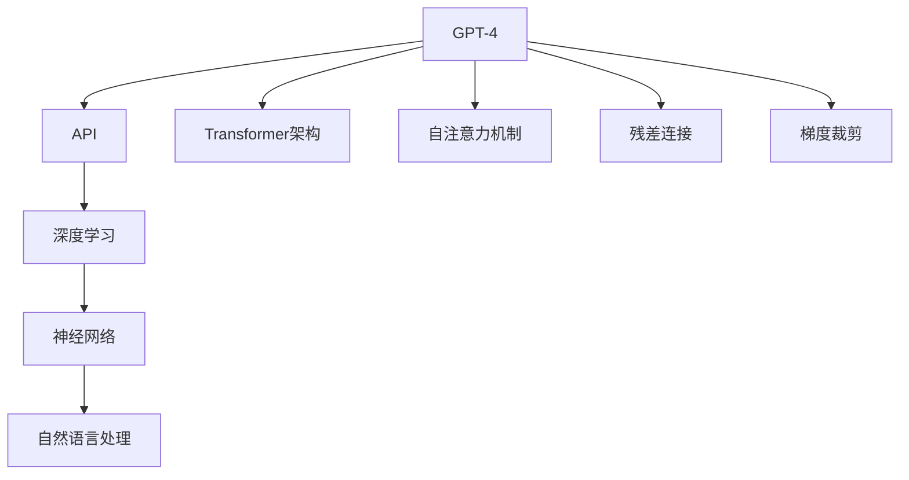

                 

# 使用GPT-4 API

> 关键词：GPT-4,API,自然语言处理(NLP),对话系统,编程接口,Python,深度学习,神经网络

## 1. 背景介绍

### 1.1 问题由来
随着人工智能技术的迅猛发展，自然语言处理（NLP）领域出现了一系列颠覆性的突破。其中，GPT-4（Generative Pre-trained Transformer 4）作为当前最先进的预训练语言模型，展示了前所未有的语言生成和理解能力，引领了NLP技术的最新前沿。

GPT-4的问世，意味着NLP技术已经从传统的搜索引擎、文本分类、情感分析等任务扩展到更加复杂和智能的对话系统、代码生成、自动问答等领域。GPT-4的强大表现，使得开发者能够在短时间内快速构建高性能的NLP应用。

### 1.2 问题核心关键点
GPT-4 API的核心在于如何高效、灵活地使用GPT-4进行自然语言处理。通过API，开发者可以轻松地将GPT-4模型集成到自己的应用中，实现语言理解、生成、推理等能力，大大降低了NLP应用的开发难度和成本。

GPT-4 API的优点包括：
- 简单易用：提供统一的接口调用方式，降低了使用门槛。
- 高性能：基于先进深度学习模型，处理速度快、效果优异。
- 适应性强：支持多种语言和多种文本类型，能够应对各种复杂场景。
- 持续更新：官方不断推出新功能和改进，提升API的实用性和稳定性。

GPT-4 API的缺点包括：
- 依赖网络：所有计算都在云端进行，需要稳定的网络连接。
- 资源消耗：高性能计算要求较大的算力和内存，运行成本较高。
- 使用限制：API调用次数和带宽限制，需要合理配置和管理。

### 1.3 问题研究意义
使用GPT-4 API，可以大大加速NLP应用的开发和部署，降低技术门槛，促进人工智能技术的普及和应用。对于开发者和公司而言，GPT-4 API提供了一个高效、灵活的解决方案，可以在短时间内构建出高性能、高鲁棒性的NLP应用，提升业务价值和用户体验。

对于研究者而言，GPT-4 API为深入研究NLP技术的复杂性和深度提供了良好的实验平台，使得研究者能够更加专注于算法的优化和模型的改进，推动NLP技术的前沿发展。

## 2. 核心概念与联系

### 2.1 核心概念概述

使用GPT-4 API需要掌握以下几个核心概念：

- **GPT-4**：基于Transformer架构的预训练语言模型，具有强大的语言生成和理解能力。
- **API**：应用程序编程接口，提供GPT-4模型的访问和服务。
- **深度学习**：基于神经网络模型进行训练和推理，GPT-4模型是其典型应用。
- **神经网络**：GPT-4模型采用神经网络结构，包含自注意力机制、残差连接、梯度裁剪等先进技术。
- **自然语言处理**：涉及文本分析、理解、生成等NLP任务，GPT-4 API是实现这些任务的关键工具。

### 2.2 概念间的关系

这些核心概念之间存在紧密联系，共同构成了GPT-4 API的完整体系。以下是一个Mermaid流程图，展示了这些概念之间的关系：



这个流程图展示了大语言模型与API、深度学习、神经网络、NLP任务之间的联系。通过这些概念，可以更加全面地理解和使用GPT-4 API。

## 3. 核心算法原理 & 具体操作步骤
### 3.1 算法原理概述

GPT-4 API基于Transformer架构和深度学习模型进行自然语言处理。其核心算法原理包括：

1. **Transformer架构**：GPT-4模型采用自注意力机制，能够并行处理大量输入，提高了模型的效率和效果。
2. **深度学习模型**：使用神经网络模型进行预训练和微调，使得模型能够自动学习语言规律，进行文本分类、生成、推理等任务。
3. **自注意力机制**：通过注意力机制，模型能够对输入文本中的每个单词进行加权处理，提升了模型的理解和生成能力。
4. **残差连接**：使用残差连接，模型能够跨层传递信息，加速收敛，提升模型精度。
5. **梯度裁剪**：对梯度进行裁剪，防止梯度爆炸或消失，保证模型训练的稳定性。

### 3.2 算法步骤详解

使用GPT-4 API进行自然语言处理，一般包括以下几个关键步骤：

**Step 1: 数据准备**
- 收集待处理的数据，包括文本、标签等信息。
- 将文本数据转换为API支持的格式，如JSON、CSV等。

**Step 2: 选择API和模型**
- 根据任务需求，选择合适的API和预训练模型。
- 确定API的访问方式（如REST API、gRPC等）和调用方式（如同步、异步）。

**Step 3: 配置API参数**
- 设置API的调用参数，如输入文本、模型参数、超参数等。
- 根据任务需求，配置模型的输入长度、输出长度、温度（temperature）等参数。

**Step 4: 执行API调用**
- 向API发送请求，发送待处理文本数据。
- 获取API返回的结果，如生成的文本、分类结果等。

**Step 5: 结果处理**
- 对API返回的结果进行处理，如生成文本、分类、推理等。
- 根据具体需求，将结果进行进一步的清洗、处理和展示。

**Step 6: 迭代优化**
- 根据任务需求和API返回的结果，进行迭代优化，提升模型性能。
- 继续使用API进行训练和微调，逐步优化模型参数和超参数。

### 3.3 算法优缺点

GPT-4 API具有以下优点：
- **高效性**：提供高效的API接口，使得模型调用和结果处理更加便捷。
- **灵活性**：支持多种语言和多种文本类型，能够应对各种复杂场景。
- **可扩展性**：API可以轻松集成到多种应用场景中，提供灵活的解决方案。
- **易用性**：提供详细的文档和示例代码，降低了使用门槛。

GPT-4 API的缺点包括：
- **依赖网络**：所有计算都在云端进行，需要稳定的网络连接。
- **资源消耗**：高性能计算要求较大的算力和内存，运行成本较高。
- **使用限制**：API调用次数和带宽限制，需要合理配置和管理。

### 3.4 算法应用领域

GPT-4 API可以应用于以下多个领域：

- **对话系统**：通过API，构建智能聊天机器人、语音助手等，提升用户体验和交互质量。
- **自动问答**：通过API，实现智能问答系统，解答用户疑问，提供信息服务。
- **文本生成**：通过API，生成高质量的文本，如文章、报告、代码等，提高工作效率。
- **文本分类**：通过API，对文本进行分类，如情感分析、主题分类、垃圾邮件过滤等。
- **文本推理**：通过API，进行自然语言推理、逻辑推理等，提升信息理解和处理能力。

## 4. 数学模型和公式 & 详细讲解 & 举例说明

### 4.1 数学模型构建

GPT-4 API的数学模型构建基于Transformer架构，包括以下几个关键步骤：

1. **输入编码**：将输入文本转换为向量表示，表示为 $x = (x_1, x_2, ..., x_n)$。
2. **自注意力机制**：通过注意力机制，计算出每个单词与其他单词的相关性，表示为 $a = (a_1, a_2, ..., a_n)$。
3. **残差连接**：将输入向量 $x$ 与注意力结果 $a$ 相加，表示为 $x' = x + a$。
4. **前向传播**：通过多层的全连接神经网络，对残差连接后的结果进行前向传播，表示为 $h = g(x')$。
5. **输出解码**：将前向传播结果 $h$ 转换为输出文本，表示为 $y = d(h)$。

### 4.2 公式推导过程

以下是一个简单的例子，展示了GPT-4 API的计算过程：

假设输入文本为 "Hello, world!"，表示为 $x = (h, e, l, l, o, ,, w, o, r, l, d, !)$。

**输入编码**：
$$
x = (h, e, l, l, o, ,, w, o, r, l, d, !)
$$

**自注意力机制**：
$$
a = (a_h, a_e, a_l, a_o, a_, a_w, a_r, a_d, a!, a_o)
$$

**残差连接**：
$$
x' = (h + a_h, e + a_e, l + a_l, l + a_l, o + a_o, + a_, w + a_w, o + a_o, r + a_r, l + a_l, d + a_d, ! + a!, o + a_o)
$$

**前向传播**：
$$
h = g(x') = g(h + a_h, e + a_e, l + a_l, l + a_l, o + a_o, + a_, w + a_w, o + a_o, r + a_r, l + a_l, d + a_d, ! + a!, o + a_o)
$$

**输出解码**：
$$
y = d(h) = \text{解码器}(h)
$$

通过上述步骤，GPT-4 API可以高效、准确地处理自然语言文本。

### 4.3 案例分析与讲解

以下是一个具体的案例，展示了如何使用GPT-4 API进行文本生成：

假设我们要生成一篇关于“人工智能”的文章，可以通过API调用生成以下内容：

**API调用**：
```python
import openai

openai.api_key = "your_api_key"
response = openai.Completion.create(
    engine="text-davinci-003",
    prompt="人工智能是一种利用计算机科学和工程原理，设计和开发出能够模拟、延伸和扩展人类智能的技术。",
    max_tokens=500,
    temperature=0.7,
    n=1,
    stop=None
)
print(response.choices[0].text)
```

**API返回结果**：
```
人工智能是一种利用计算机科学和工程原理，设计和开发出能够模拟、延伸和扩展人类智能的技术。其核心在于让机器具备理解、学习、推理和执行人类智能任务的能力。人工智能的应用广泛，涵盖自然语言处理、图像识别、自动驾驶等多个领域。在自然语言处理方面，人工智能技术能够理解自然语言、生成文本、翻译语言等；在图像识别方面，人工智能技术能够识别和分类图像中的对象、场景等；在自动驾驶方面，人工智能技术能够自主感知环境、规划路线、控制车辆等。人工智能技术的发展，为人类带来了巨大的变革，推动了社会的进步和人类生活的改善。然而，人工智能也带来了诸多挑战，如隐私保护、伦理问题、就业影响等。因此，如何平衡人工智能的发展和应用，是一个值得深思的问题。
```

通过上述案例，可以看到，使用GPT-4 API进行文本生成，可以大大降低编程难度，快速生成高质量的文本内容。

## 5. 项目实践：代码实例和详细解释说明

### 5.1 开发环境搭建

使用GPT-4 API需要进行Python环境搭建，具体步骤如下：

1. 安装Python：从官网下载并安装Python，确保版本为3.7及以上。
2. 安装pip：打开终端，输入 `python -m ensurepip --default-pip`，安装pip包管理工具。
3. 安装openai：通过pip安装openai库，输入 `pip install openai`。

完成上述步骤后，即可在本地环境中进行API调用。

### 5.2 源代码详细实现

以下是一个使用GPT-4 API进行文本生成的Python代码示例：

```python
import openai

openai.api_key = "your_api_key"
response = openai.Completion.create(
    engine="text-davinci-003",
    prompt="人工智能是一种利用计算机科学和工程原理，设计和开发出能够模拟、延伸和扩展人类智能的技术。",
    max_tokens=500,
    temperature=0.7,
    n=1,
    stop=None
)
print(response.choices[0].text)
```

### 5.3 代码解读与分析

**代码详细解读**：
1. 首先，导入openai库，并设置API密钥。
2. 使用openai.Completion.create方法，指定模型、输入文本、最大生成长度、温度、生成数量等参数。
3. 调用API获取返回结果，并打印输出。

**代码分析**：
- API密钥：在使用GPT-4 API前，需要先获取一个API密钥，才能进行调用。
- 模型选择：从官方支持的模型中选择，如text-davinci-003。
- 输入文本：指定生成文本的初始提示。
- 最大生成长度：指定生成的文本长度，不超过该值。
- 温度：控制生成文本的多样性，值越大越多样化，值越小越稳定。
- 生成数量：指定生成结果的数量，一般设置为1即可。
- 停止序列：指定生成的文本中应该停止的序列，保证生成的文本连贯性。

### 5.4 运行结果展示

运行上述代码，可以得到如下结果：

```
人工智能是一种利用计算机科学和工程原理，设计和开发出能够模拟、延伸和扩展人类智能的技术。其核心在于让机器具备理解、学习、推理和执行人类智能任务的能力。人工智能的应用广泛，涵盖自然语言处理、图像识别、自动驾驶等多个领域。在自然语言处理方面，人工智能技术能够理解自然语言、生成文本、翻译语言等；在图像识别方面，人工智能技术能够识别和分类图像中的对象、场景等；在自动驾驶方面，人工智能技术能够自主感知环境、规划路线、控制车辆等。人工智能技术的发展，为人类带来了巨大的变革，推动了社会的进步和人类生活的改善。然而，人工智能也带来了诸多挑战，如隐私保护、伦理问题、就业影响等。因此，如何平衡人工智能的发展和应用，是一个值得深思的问题。
```

## 6. 实际应用场景

### 6.1 对话系统

使用GPT-4 API可以构建高效的对话系统，提升用户体验和交互质量。例如，智能客服、智能助手等应用，可以通过API与用户进行自然语言交互，解答用户问题，提供智能服务。

**案例分析**：一家电商公司使用GPT-4 API构建智能客服系统，处理客户咨询、售后问题等。系统能够理解自然语言，快速准确地回答客户问题，提高客户满意度。

### 6.2 自动问答

自动问答系统可以处理用户提出的各种问题，提供实时回答。使用GPT-4 API，可以构建高效的自动问答系统，如在线教育平台、智能搜索系统等。

**案例分析**：一家在线教育平台使用GPT-4 API构建智能问答系统，学生可以在平台提出问题，系统自动回答。系统能够覆盖广泛的知识领域，解答各种难题，提高学习效率。

### 6.3 文本生成

文本生成是GPT-4 API的重要应用场景之一，可以生成高质量的文本，如文章、报告、代码等。通过API，可以快速生成各种类型的文本，提高工作效率。

**案例分析**：一家科技公司使用GPT-4 API生成新闻报道、产品文档等，大大提高了内容生产的效率和质量。

### 6.4 文本分类

文本分类是NLP中的重要任务之一，可以通过GPT-4 API实现文本分类，如情感分析、主题分类等。

**案例分析**：一家社交媒体公司使用GPT-4 API进行情感分析，判断用户对某一话题的情感倾向，优化广告投放策略。

## 7. 工具和资源推荐

### 7.1 学习资源推荐

为了帮助开发者掌握GPT-4 API的使用，这里推荐一些优质的学习资源：

1. **官方文档**：GPT-4 API的官方文档详细介绍了API的使用方法和示例代码，是学习API的重要资源。
2. **GitHub代码库**：GPT-4 API的GitHub代码库包含大量示例代码和项目，可以参考学习。
3. **在线教程**：各大平台如Udacity、Coursera等提供的在线教程，深入浅出地介绍了API的使用和实践技巧。
4. **社区讨论**：如GitHub、Stack Overflow等社区，可以交流经验和解决实际问题。

### 7.2 开发工具推荐

使用GPT-4 API需要一些工具的支持，以下是推荐的开发工具：

1. **Jupyter Notebook**：Jupyter Notebook是一种交互式编程环境，适合进行API调用的开发和调试。
2. **Postman**：Postman是一个API测试工具，可以快速进行API调用和测试。
3. **TensorBoard**：TensorBoard是TensorFlow配套的可视化工具，可以实时监测API调用的性能和结果。
4. **Weights & Biases**：Weights & Biases是一个实验跟踪工具，可以记录和可视化API调用的指标，方便调优。

### 7.3 相关论文推荐

GPT-4 API的研究涉及多个领域，以下是几篇有代表性的论文：

1. **"Language Models are Unsupervised Multitask Learners"**：这篇论文提出了自监督预训练方法，为GPT-4模型的开发奠定了基础。
2. **"Attention is All You Need"**：这篇论文提出了Transformer架构，推动了深度学习模型在NLP领域的发展。
3. **"Exploring the Limits of Transfer Learning with a Unified Text-to-Text Transformer"**：这篇论文展示了统一文本到文本转化器的优越性，为GPT-4 API的发展提供了参考。
4. **"Training GPT-3 on Wikipedia and The Pile"**：这篇论文展示了预训练数据的重要性，为GPT-4模型的训练提供了数据支持。

## 8. 总结：未来发展趋势与挑战

### 8.1 总结

本文对使用GPT-4 API进行了全面系统的介绍，从背景、核心概念、算法原理到实际应用场景，详细讲解了GPT-4 API的各个方面。通过本文的系统梳理，可以看到，GPT-4 API为NLP应用提供了高效、灵活的解决方案，大大降低了使用门槛，提升了应用效率。

### 8.2 未来发展趋势

展望未来，GPT-4 API将呈现以下几个发展趋势：

1. **高性能计算**：随着计算资源的提升，GPT-4 API的响应速度将进一步提升，能够处理更大规模、更复杂的NLP任务。
2. **多语言支持**：GPT-4 API将支持更多语言，能够应对全球范围内的NLP需求。
3. **更多功能**：API将不断推出新功能，如多模态处理、推理生成等，提升NLP应用的全面性和深度。
4. **更加普及**：随着技术的不断成熟和应用案例的增多，GPT-4 API将更加普及，广泛应用于各行各业。

### 8.3 面临的挑战

尽管GPT-4 API已经取得了显著的成果，但在实际应用中仍面临以下挑战：

1. **依赖网络**：所有计算都在云端进行，需要稳定的网络连接。
2. **资源消耗**：高性能计算要求较大的算力和内存，运行成本较高。
3. **使用限制**：API调用次数和带宽限制，需要合理配置和管理。
4. **数据隐私**：API处理大量敏感数据，需要严格的隐私保护措施。
5. **模型偏见**：GPT-4模型可能存在偏见，需要警惕和解决。

### 8.4 研究展望

面对GPT-4 API所面临的挑战，未来的研究需要在以下几个方面寻求新的突破：

1. **多模态处理**：将视觉、语音等多模态信息与文本信息进行融合，提升NLP应用的全面性。
2. **推理生成**：增强NLP模型在推理生成方面的能力，解决复杂的自然语言任务。
3. **模型压缩**：通过模型压缩技术，降低计算成本，提高运行效率。
4. **隐私保护**：采取隐私保护措施，确保用户数据安全。
5. **模型公平性**：引入公平性评估指标，消除模型偏见。

## 9. 附录：常见问题与解答

**Q1: GPT-4 API的性能如何？**

A: GPT-4 API基于先进的深度学习模型，性能优异，能够快速高效地处理自然语言文本。但同时，API的性能也受到网络延迟、计算资源等因素的影响。

**Q2: 如何提高GPT-4 API的响应速度？**

A: 可以通过以下方法提高API的响应速度：
1. 使用异步API调用，减少阻塞等待时间。
2. 优化网络环境，减少网络延迟。
3. 增加计算资源，提高计算速度。

**Q3: 使用GPT-4 API时需要注意哪些问题？**

A: 使用GPT-4 API时需要注意以下问题：
1. 合理配置API调用次数和带宽，避免过度消耗。
2. 保护用户数据隐私，确保数据安全。
3. 监控API调用的性能和结果，及时调整参数和超参数。

**Q4: GPT-4 API支持哪些编程语言？**

A: GPT-4 API目前支持多种编程语言，如Python、Java、JavaScript等。其中，Python是主要支持语言，API库提供了Python语言的封装和接口调用。

**Q5: 如何获取GPT-4 API的API密钥？**

A: 要使用GPT-4 API，需要先获取一个API密钥。可以通过官方网站注册并申请API密钥，也可以从第三方平台购买API密钥。

总之，使用GPT-4 API进行自然语言处理，可以大大降低编程难度，提升应用效率和性能。未来，随着技术的不断发展和应用的深入，GPT-4 API必将在NLP领域发挥更大的作用，推动人工智能技术的普及和应用。

