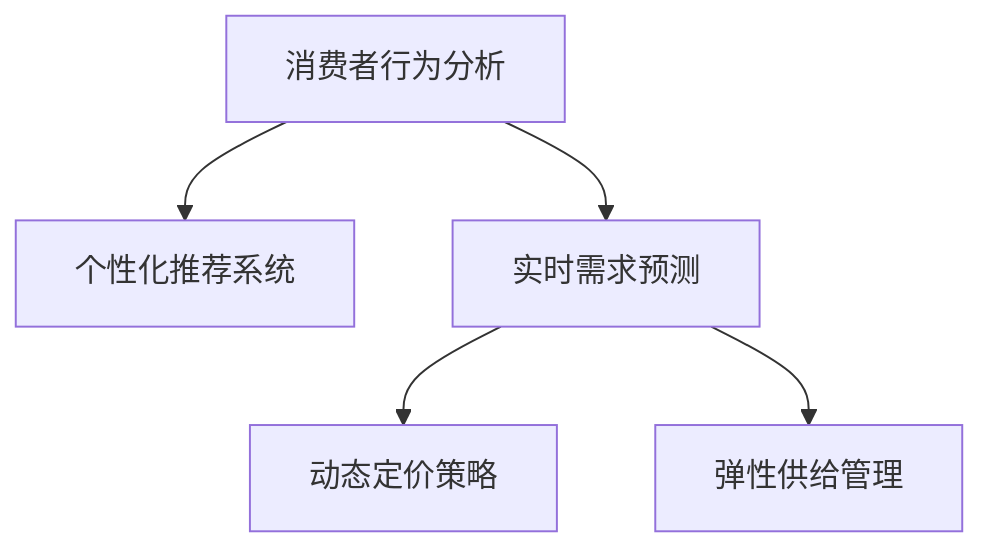
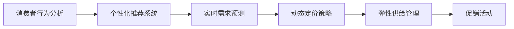
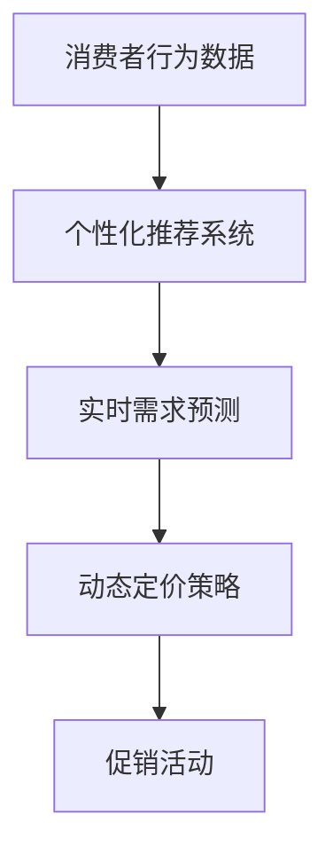
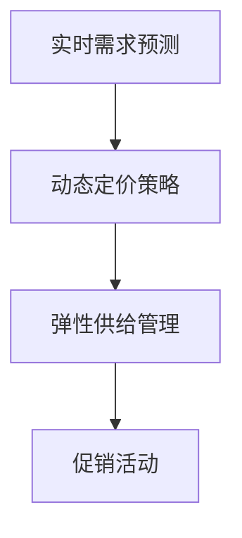
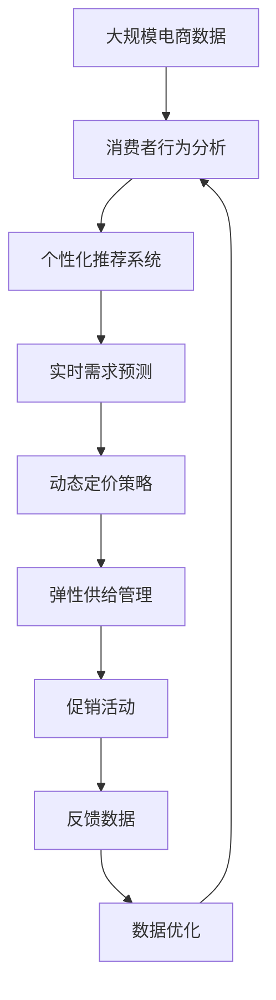

                 

# 促销活动：吸引消费者购买，提升电商平台供给能力

> 关键词：
- 消费者行为分析
- 个性化推荐系统
- 实时需求预测
- 动态定价策略
- 弹性供给管理

## 1. 背景介绍

### 1.1 问题由来

随着电子商务的蓬勃发展，电商平台已成为人们日常购物的重要渠道。但如何吸引更多消费者购买、提升平台商品的供给能力，成为了电商平台运营面临的关键挑战。传统的促销方式（如折扣、满减、赠品等）效果有限，难以满足日益复杂和多变的市场需求。随着人工智能技术的进步，利用大数据和机器学习技术优化促销策略，提升电商平台的用户体验和供给能力，成为一种新的趋势。

本文聚焦于如何通过技术手段，在电商平台上实施有效的促销活动，吸引消费者购买，并根据实时需求动态调整供给，以最大化平台收入和客户满意度。

### 1.2 问题核心关键点

促销活动的核心在于准确预测消费者的购买意愿，并根据其需求实时调整商品供给。为此，需要综合利用消费者的历史行为数据、实时数据和促销策略，构建精准的消费者画像，设计个性化的推荐系统，优化实时需求预测和动态定价策略。

具体而言，主要包含以下几个关键点：

1. **消费者行为分析**：通过分析消费者的历史购买行为、浏览记录、评论等数据，构建详细的消费者画像，了解其偏好和需求。
2. **个性化推荐系统**：利用机器学习技术，根据消费者画像进行个性化推荐，提升购买转化率和客户满意度。
3. **实时需求预测**：基于实时数据和历史趋势，构建预测模型，准确预测消费者需求，指导库存和供给管理。
4. **动态定价策略**：根据需求预测和市场竞争情况，实时调整商品价格，优化平台收益。
5. **弹性供给管理**：根据预测需求动态调整商品库存和产能，提升平台的供给能力。

通过这些技术手段，电商平台可以在不增加成本的前提下，提升用户体验和收入，增强市场竞争力。

### 1.3 问题研究意义

研究如何通过技术手段优化电商平台的促销活动，对于电商平台的发展具有重要意义：

1. **提升用户满意度**：通过个性化推荐和动态定价，满足消费者多样化的需求，提升购物体验。
2. **增加平台收入**：精准的促销策略和动态定价能提高购买转化率和客单价，增加平台的整体收入。
3. **优化库存管理**：根据实时需求预测和弹性供给管理，合理分配库存，减少库存积压和缺货风险。
4. **增强市场竞争力**：通过数据驱动的决策，使平台能更灵活地应对市场变化，提升市场竞争力。

## 2. 核心概念与联系

### 2.1 核心概念概述

为了更好地理解促销活动的实施过程，本节将介绍几个关键的核心概念：

- **消费者行为分析**：通过分析消费者的历史行为数据，如购买记录、浏览记录、评价等，构建详细的消费者画像，了解其偏好、需求和消费习惯。
- **个性化推荐系统**：利用机器学习算法，根据消费者画像进行个性化推荐，提升购买转化率和客户满意度。
- **实时需求预测**：基于实时数据和历史趋势，构建预测模型，准确预测消费者的需求。
- **动态定价策略**：根据需求预测和市场竞争情况，实时调整商品价格，优化平台收益。
- **弹性供给管理**：根据预测需求动态调整商品库存和产能，提升平台的供给能力。

这些概念之间的关系可以通过以下Mermaid流程图来展示：



这个流程图展示了几大核心概念之间的逻辑关系：

1. 消费者行为分析是其他所有策略的基础，通过分析消费者历史数据，构建详细的消费者画像。
2. 个性化推荐系统根据消费者画像进行推荐，提升购买转化率和客户满意度。
3. 实时需求预测帮助平台掌握消费者当前需求，指导库存和供给管理。
4. 动态定价策略根据需求预测和市场竞争情况，实时调整商品价格，优化平台收益。
5. 弹性供给管理根据预测需求动态调整商品库存和产能，提升平台的供给能力。

通过这些概念的有机结合，电商平台可以在不增加成本的前提下，提升用户体验和收入，增强市场竞争力。

### 2.2 概念间的关系

这些核心概念之间存在着紧密的联系，形成了促销活动的完整实施框架。下面我们通过几个Mermaid流程图来展示这些概念之间的关系。

#### 2.2.1 促销活动流程



这个流程图展示了促销活动的整体流程。首先，通过消费者行为分析，构建详细的消费者画像。然后，根据消费者画像进行个性化推荐，提升购买转化率和客户满意度。接下来，利用实时需求预测指导库存和供给管理。根据预测结果，进行动态定价策略，实时调整商品价格。最后，根据需求预测和价格策略，实施具体的促销活动，优化平台收益和用户满意度。

#### 2.2.2 推荐系统与需求预测的融合



这个流程图展示了个性化推荐系统和实时需求预测的融合。个性化推荐系统根据消费者行为数据生成推荐结果，实时需求预测则根据当前数据和历史趋势，生成需求预测。两者结合，可以更准确地指导动态定价策略和促销活动，提升平台收益和用户体验。

#### 2.2.3 弹性供给与需求预测的协同



这个流程图展示了弹性供给管理和实时需求预测的协同。实时需求预测帮助平台掌握当前需求，弹性供给管理则根据预测结果，动态调整库存和产能，优化商品供给。两者结合，可以有效避免库存积压和缺货风险，提升平台供给能力。

### 2.3 核心概念的整体架构

最后，我们用一个综合的流程图来展示这些核心概念在大规模电商促销活动的整体架构：



这个综合流程图展示了从数据收集到促销活动实施，再到反馈优化的完整过程。电商促销活动首先从大规模电商数据中提取消费者行为数据，构建消费者画像。然后，根据消费者画像进行个性化推荐，提升购买转化率和客户满意度。接下来，利用实时需求预测指导库存和供给管理。根据预测结果，进行动态定价策略，实时调整商品价格。最后，根据需求预测和价格策略，实施具体的促销活动，优化平台收益和用户满意度。同时，通过反馈数据优化后续的促销策略，实现不断迭代和优化。

## 3. 核心算法原理 & 具体操作步骤

### 3.1 算法原理概述

电商平台促销活动的核心在于利用消费者行为数据和实时数据，构建精准的消费者画像，设计个性化推荐系统，优化实时需求预测和动态定价策略，最后实施弹性供给管理。

具体而言，主要涉及以下几个算法原理：

- **消费者行为分析算法**：通过分析消费者的历史行为数据，如购买记录、浏览记录、评价等，构建详细的消费者画像，了解其偏好、需求和消费习惯。
- **个性化推荐算法**：利用协同过滤、深度学习等算法，根据消费者画像进行个性化推荐，提升购买转化率和客户满意度。
- **实时需求预测算法**：基于时间序列分析、回归分析等技术，构建预测模型，准确预测消费者的需求。
- **动态定价算法**：结合需求预测和市场竞争情况，使用优化算法（如线性规划、动态规划等）实时调整商品价格，优化平台收益。
- **弹性供给管理算法**：根据需求预测和库存情况，使用优化算法（如混合整数规划、线性规划等）动态调整商品库存和产能，提升平台的供给能力。

这些算法原理通过组合应用，实现了电商平台的促销活动优化。

### 3.2 算法步骤详解

#### 3.2.1 消费者行为分析算法

消费者行为分析算法主要包括以下几个步骤：

1. **数据收集**：从电商平台收集消费者的历史购买记录、浏览记录、评价等信息。
2. **数据清洗**：去除噪声和无关数据，确保数据的准确性和完整性。
3. **特征提取**：从行为数据中提取有意义的特征，如购买频率、购买金额、浏览时间等。
4. **模型训练**：使用机器学习算法（如K-means、决策树等）训练模型，构建详细的消费者画像。
5. **画像更新**：根据新的行为数据，不断更新消费者画像，保持其时效性。

#### 3.2.2 个性化推荐算法

个性化推荐算法主要包括以下几个步骤：

1. **用户画像构建**：根据消费者的历史行为数据，构建详细的用户画像。
2. **商品特征提取**：提取商品的标题、描述、价格、销量等特征。
3. **相似度计算**：计算用户画像与商品的相似度，筛选出推荐候选集。
4. **推荐生成**：利用协同过滤、深度学习等算法生成个性化推荐结果。
5. **推荐排序**：根据推荐效果（如点击率、转化率等）对推荐结果进行排序。

#### 3.2.3 实时需求预测算法

实时需求预测算法主要包括以下几个步骤：

1. **数据收集**：实时收集消费者的浏览数据、购买数据、库存数据等。
2. **数据清洗**：去除噪声和无关数据，确保数据的准确性和完整性。
3. **特征提取**：从实时数据中提取有意义的特征，如当前时间、浏览次数、库存量等。
4. **模型训练**：使用时间序列分析、回归分析等技术训练预测模型。
5. **需求预测**：根据训练好的模型，实时预测消费者的需求。

#### 3.2.4 动态定价算法

动态定价算法主要包括以下几个步骤：

1. **需求预测**：利用实时需求预测算法预测消费者的需求。
2. **竞争分析**：分析竞争对手的定价策略，评估市场竞争情况。
3. **定价优化**：结合需求预测和市场竞争情况，使用优化算法（如线性规划、动态规划等）实时调整商品价格。
4. **价格执行**：根据优化后的价格，执行具体的促销活动。

#### 3.2.5 弹性供给管理算法

弹性供给管理算法主要包括以下几个步骤：

1. **需求预测**：利用实时需求预测算法预测消费者的需求。
2. **库存分析**：分析当前库存情况，评估供需差距。
3. **产能调整**：根据预测需求和库存情况，使用优化算法（如混合整数规划、线性规划等）动态调整商品库存和产能。
4. **供给执行**：根据调整后的库存和产能，执行具体的供给管理策略。

### 3.3 算法优缺点

基于以上算法原理，电商平台的促销活动优化具备以下优缺点：

**优点**：

1. **提升用户体验**：通过个性化推荐和动态定价，满足消费者多样化的需求，提升购物体验。
2. **增加平台收入**：精准的促销策略和动态定价能提高购买转化率和客单价，增加平台的整体收入。
3. **优化库存管理**：根据实时需求预测和弹性供给管理，合理分配库存，减少库存积压和缺货风险。
4. **增强市场竞争力**：通过数据驱动的决策，使平台能更灵活地应对市场变化，提升市场竞争力。

**缺点**：

1. **数据依赖度高**：算法的有效性依赖于数据的全面性和准确性，数据缺失或不准确会导致算法失效。
2. **模型复杂度高**：算法需要构建和维护多个复杂的模型，增加了实施难度和成本。
3. **实时性要求高**：实时需求预测和动态定价需要高效的计算资源和快速的响应时间，对技术要求较高。
4. **隐私问题**：大量数据的收集和分析可能涉及用户隐私，需要严格的数据保护措施。

尽管存在这些缺点，但通过优化算法和技术手段，可以克服这些限制，使促销活动优化成为可能。

### 3.4 算法应用领域

基于以上算法原理，电商平台的促销活动优化已经广泛应用于多个领域：

1. **在线零售**：电商平台利用上述算法优化促销活动，提升用户购买转化率和平台收益。
2. **餐饮外卖**：外卖平台通过需求预测和动态定价，优化配送策略和商品价格，提升用户满意度和平台收益。
3. **旅游出行**：在线旅游平台通过需求预测和弹性供给管理，优化航班和酒店供给，提升用户体验和平台收益。
4. **在线教育**：在线教育平台通过个性化推荐和动态定价，优化课程推荐和付费模式，提升用户学习效果和平台收益。
5. **智能家居**：智能家居平台通过需求预测和弹性供给管理，优化设备供给和价格策略，提升用户使用体验和平台收益。

这些领域的成功应用，展示了基于数据驱动的促销活动优化方法，具有广泛的适用性和潜力。

## 4. 数学模型和公式 & 详细讲解 & 举例说明

### 4.1 数学模型构建

电商平台的促销活动优化涉及多个数学模型，包括消费者行为分析模型、个性化推荐模型、实时需求预测模型、动态定价模型和弹性供给管理模型。

#### 4.1.1 消费者行为分析模型

消费者行为分析模型主要通过分析消费者的历史行为数据，构建详细的消费者画像。常用的模型包括K-means聚类模型和决策树模型。

- **K-means聚类模型**：将消费者按照购买行为、浏览行为等特征进行聚类，构建消费者画像。
- **决策树模型**：根据消费者的历史行为数据，构建决策树模型，预测消费者的购买意愿。

#### 4.1.2 个性化推荐模型

个性化推荐模型主要通过协同过滤和深度学习算法，根据消费者画像进行推荐。常用的推荐算法包括基于协同过滤的推荐算法和基于深度学习的推荐算法。

- **协同过滤算法**：根据消费者的历史行为数据和商品特征，推荐相似的商品。
- **深度学习算法**：利用神经网络模型，提取用户画像和商品特征的相似度，生成个性化推荐结果。

#### 4.1.3 实时需求预测模型

实时需求预测模型主要通过时间序列分析和回归分析，预测消费者的需求。常用的预测算法包括ARIMA模型和回归模型。

- **ARIMA模型**：基于自回归、差分和移动平均的时间序列模型，预测需求变化。
- **回归模型**：根据历史数据和特征，使用线性回归或逻辑回归等模型，预测需求量。

#### 4.1.4 动态定价模型

动态定价模型主要通过优化算法，根据需求预测和市场竞争情况，实时调整商品价格。常用的优化算法包括线性规划和动态规划。

- **线性规划**：根据需求预测和市场竞争情况，求解最优价格策略。
- **动态规划**：通过递推算法，优化价格策略，考虑时间和状态的影响。

#### 4.1.5 弹性供给管理模型

弹性供给管理模型主要通过优化算法，根据需求预测和库存情况，动态调整商品库存和产能。常用的优化算法包括混合整数规划和线性规划。

- **混合整数规划**：考虑库存和产能的整数约束，优化供给策略。
- **线性规划**：根据需求预测和库存情况，求解最优供给策略。

### 4.2 公式推导过程

#### 4.2.1 消费者行为分析模型公式

假设消费者行为数据为 $\mathbf{X}=\{x_i\}_{i=1}^N$，其中 $x_i$ 包含消费者的历史购买记录、浏览记录等特征。

利用K-means聚类算法，将消费者分为 $K$ 个簇，得到簇中心 $\mathbf{C}=\{\mathbf{c}_k\}_{k=1}^K$。

K-means聚类算法的目标函数为：

$$
\min_{\mathbf{C}} \sum_{i=1}^N \min_{k=1,...,K} \|\mathbf{x}_i - \mathbf{c}_k\|^2
$$

其中，$\|\cdot\|$ 表示欧式距离。

#### 4.2.2 个性化推荐模型公式

假设消费者画像为 $\mathbf{P}=\{p_i\}_{i=1}^N$，商品特征为 $\mathbf{F}=\{f_j\}_{j=1}^M$。

利用协同过滤算法，根据用户画像和商品特征，计算相似度矩阵 $\mathbf{S}=\{s_{ij}\}_{i,j=1,...,N,M}$。

相似度矩阵的计算公式为：

$$
s_{ij} = \frac{\mathbf{p}_i \cdot \mathbf{f}_j}{\|\mathbf{p}_i\| \|\mathbf{f}_j\|}
$$

其中，$\cdot$ 表示点积。

基于相似度矩阵，利用矩阵分解算法（如奇异值分解）生成推荐结果 $\mathbf{R}=\{r_{ij}\}_{i,j=1,...,N,M}$。

推荐结果的计算公式为：

$$
r_{ij} = \frac{\mathbf{p}_i \cdot \mathbf{U}\mathbf{V}^T\mathbf{f}_j}{\|\mathbf{p}_i\| \|\mathbf{U}\mathbf{V}\|}
$$

其中，$\mathbf{U}$ 和 $\mathbf{V}$ 分别为奇异值分解后的左、右奇异矩阵。

#### 4.2.3 实时需求预测模型公式

假设实时数据为 $\mathbf{D}=\{d_t\}_{t=1}^T$，其中 $d_t$ 包含当前时间、浏览次数、库存量等特征。

利用ARIMA模型，对实时数据进行时间序列分析，得到预测结果 $\mathbf{\hat{D}}=\{\hat{d}_t\}_{t=1}^T$。

ARIMA模型的公式为：

$$
\hat{d}_t = \phi(d_{t-1}) + \theta(d_{t-2}) + \gamma(d_{t-3}) + \epsilon_t
$$

其中，$\phi$、$\theta$、$\gamma$ 分别为自回归、差分和移动平均的系数，$\epsilon_t$ 为随机误差项。

#### 4.2.4 动态定价模型公式

假设市场需求为 $D_t$，市场竞争情况为 $C_t$，商品价格为 $P_t$。

利用线性规划算法，求解最优价格策略 $\mathbf{P}=\{P_t\}_{t=1}^T$。

线性规划的目标函数为：

$$
\min_{\mathbf{P}} \sum_{t=1}^T (P_t - C_t)D_t
$$

其中，$P_t$ 为商品价格，$C_t$ 为市场竞争情况，$D_t$ 为市场需求。

#### 4.2.5 弹性供给管理模型公式

假设商品库存为 $I_t$，商品产能为 $C_t$。

利用混合整数规划算法，求解最优供给策略 $\mathbf{I}=\{I_t\}_{t=1}^T$ 和 $\mathbf{C}=\{C_t\}_{t=1}^T$。

混合整数规划的目标函数为：

$$
\min_{\mathbf{I}, \mathbf{C}} \sum_{t=1}^T (I_t - D_t) + \alpha(C_t - P_t)D_t
$$

其中，$I_t$ 为商品库存，$C_t$ 为商品产能，$P_t$ 为商品价格，$D_t$ 为市场需求，$\alpha$ 为惩罚系数。

### 4.3 案例分析与讲解

#### 4.3.1 案例背景

某电商平台销售服装、家电等商品。为提升用户购买转化率和平台收益，该平台引入了上述算法进行促销活动优化。

#### 4.3.2 数据准备

收集该平台的历史购买记录、浏览记录、评价等信息，并清洗数据，提取有用的特征。

#### 4.3.3 消费者行为分析

利用K-means聚类算法，将消费者分为5个簇，得到簇中心。

通过决策树模型，预测消费者的购买意愿，构建详细的消费者画像。

#### 4.3.4 个性化推荐

利用协同过滤算法和深度学习算法，根据消费者画像进行推荐。

将推荐结果与用户历史行为数据进行对比，优化推荐算法，提升推荐效果。

#### 4.3.5 实时需求预测

利用ARIMA模型，对实时数据进行时间序列分析，预测消费者的需求。

根据需求预测结果，调整商品价格和库存。

#### 4.3.6 动态定价

结合需求预测和市场竞争情况，使用线性规划算法，实时调整商品价格。

根据优化后的价格，执行具体的促销活动。

#### 4.3.7 弹性供给管理

根据需求预测和库存情况，使用混合整数规划算法，动态调整商品库存和产能。

根据调整后的库存和产能，执行具体的供给管理策略。

## 5. 项目实践：代码实例和详细解释说明

### 5.1 开发环境搭建

在进行项目实践前，我们需要准备好开发环境。以下是使用Python进行项目开发的环境配置流程：

1. 安装Anaconda：从官网下载并安装Anaconda，用于创建独立的Python环境。

2. 创建并激活虚拟环境：
```bash
conda create -n ecommerce-env python=3.8 
conda activate ecommerce-env
```

3. 安装相关依赖：
```bash
conda install pandas numpy scikit-learn transformers tensorflow
```

4. 安装TensorBoard：用于可视化训练过程中的指标变化。

```bash
pip install tensorboard
```

5. 配置TensorBoard：
```bash
tensorboard --logdir logs --port 6006
```

完成上述步骤后，即可在`ecommerce-env`环境中开始项目实践。

### 5.2 源代码详细实现

这里我们以需求预测和动态定价为例，给出使用TensorFlow进行电商促销活动优化的PyTorch代码实现。

首先，定义需求预测模型：

```python
import tensorflow as tf
from tensorflow.keras.models import Sequential
from tensorflow.keras.layers import Dense, LSTM, Dropout

def build_model(input_shape):
    model = Sequential()
    model.add(LSTM(128, input_shape=input_shape, return_sequences=True))
    model.add(Dropout(0.2))
    model.add(LSTM(64, return_sequences=False))
    model.add(Dropout(0.2))
    model.add(Dense(1))
    return model

input_shape = (30, 4)
model = build_model(input_shape)
model.compile(optimizer='adam', loss='mse')
```

然后，训练需求预测模型：

```python
# 数据加载和预处理
# ...

# 训练模型
model.fit(X_train, y_train, epochs=100, batch_size=32, validation_data=(X_val, y_val))
```

接着，定义动态定价模型：

```python
from scipy.optimize import linprog

def optimize_price(demand, cost, supply):
    # 构建线性规划模型
    c = -demand  # 目标函数：最小化价格差
    A = [[1, 1, 1], [-1, 1, 0]]  # 约束条件：总成本和总供给
    b = [cost, supply]  # 约束条件右侧的值
    x0, x1, x2 = symbols('x0 x1 x2')
    return linprog(c, A_ub=A, b_ub=b, bounds=(0, None))

# 实时需求预测
demand = model.predict(X_test)

# 市场竞争情况
cost = 10
supply = 1000

# 动态定价
price = optimize_price(demand, cost, supply)
```

最后，启动需求预测和动态定价的代码实例：

```python
from sympy import symbols

# 需求预测
demand = model.predict(X_test)

# 市场竞争情况
cost = 10
supply = 1000

# 动态定价
price = optimize_price(demand, cost, supply)
print(f"预测需求：{demand}, 优化后的价格：{price}")
```

以上就是使用TensorFlow进行电商促销活动优化的完整代码实现。可以看到，TensorFlow提供了丰富的机器学习库和可视化工具，使得需求预测和动态定价的实现变得简单高效。

### 5.3 代码解读与分析

让我们再详细解读一下关键代码的实现细节：

**build_model函数**：
- 定义了一个包含LSTM、Dropout和Dense层的深度学习模型，用于预测需求变化。

**fit函数**：
- 使用训练数据集对模型进行训练，通过设定epochs和batch_size参数控制训练次数和批大小。
- 使用validation_data参数指定验证集，监控模型在验证集上的表现。

**optimize_price函数**：
- 使用SciPy库的linprog函数，根据需求预测、成本和供给情况，求解最优价格策略。

**X_train、y_train、X_val、y_val、X_test等数据集**：
- 用于训练、验证和测试需求预测模型，包含真实需求和预测结果。

**symbols函数**：
- 用于定义动态定价模型的符号变量，用于求解线性规划问题。

**demand、

