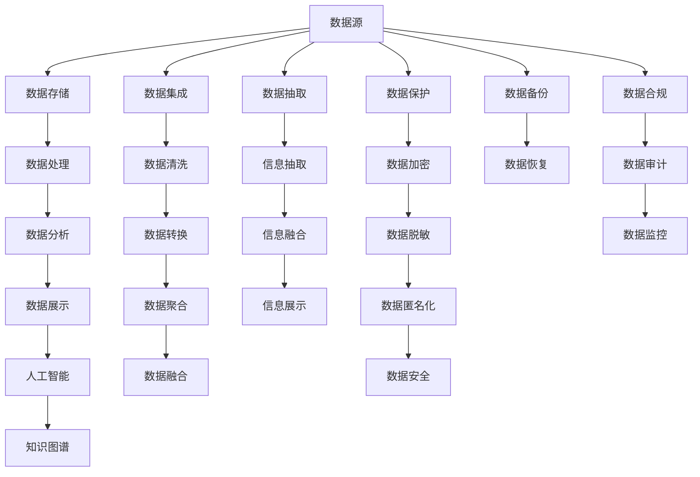

                 

# 信息是继续坚持：构建未来

> 关键词：信息体系,信息构建,信息科学,信息工程,人工智能,数据科学

## 1. 背景介绍

### 1.1 问题由来

信息科学和工程在过去几十年中经历了爆炸式的增长，它们在推动人类社会的进步、提升组织效率、加速技术创新方面发挥了重要作用。从早期的数据库系统、信息检索，到今天的人工智能、大数据，信息技术的演进逐步从静态的数据存储、处理，走向了动态的数据生成、分析。而伴随数据量的爆炸增长，信息科学和工程面临了前所未有的挑战，需要不断地创新和突破。

### 1.2 问题核心关键点

为了更好地适应信息技术的演进和数据的膨胀，信息科学和工程需要构建更加灵活、高效、智能的信息体系。以下是信息体系构建的几个关键点：

1. **数据集成和清洗**：面对海量且异构的数据源，如何高效地进行数据集成和清洗，是信息体系构建的首要任务。
2. **信息抽取与融合**：从原始数据中抽取有用的信息，并通过自然语言处理、知识图谱等技术实现信息的融合，是提升信息价值的关键步骤。
3. **实时分析与处理**：在大数据时代，信息的实时性变得越来越重要，如何快速地进行数据分析和处理，是保持信息时效性的关键。
4. **智能推荐与决策**：利用机器学习和深度学习技术，提供个性化推荐和智能决策支持，是信息体系智能化提升的重要方向。
5. **信息安全与隐私保护**：在信息获取和处理过程中，如何保障数据的安全和隐私，是信息体系可持续发展的基本要求。
6. **系统可扩展性与维护性**：构建的信息体系需要具备良好的可扩展性和可维护性，以便于应对不断变化的需求和技术。

这些核心关键点构成了信息体系构建的框架，帮助人们在复杂多变的信息环境中，获取有价值的洞察，做出明智的决策。

### 1.3 问题研究意义

信息体系构建不仅在技术上具有重要意义，还对经济发展、社会治理、科技创新等多个领域产生深远影响：

1. **推动经济数字化转型**：通过高效的信息集成与分析，企业能够更好地进行市场分析、客户管理、产品研发，提升运营效率，增强竞争力。
2. **优化社会治理模式**：政府和公共机构利用信息体系，可以更精确地进行公共服务管理、社会风险监测、公民行为预测，提升治理效能。
3. **加速科技创新进程**：研究人员借助信息体系，可以更高效地进行科研数据的整合、分析和共享，推动跨学科、跨领域的协同创新。
4. **提升信息服务质量**：消费者和企业通过智能推荐系统，能够更快地获取所需信息，提升信息获取的便利性和准确性。
5. **保障信息安全**：信息体系构建需要重视数据隐私保护和安全，防止信息泄露和滥用，保障社会稳定和信息安全。

因此，信息体系的构建不仅是技术上的挑战，更是推动社会进步的重要引擎。

## 2. 核心概念与联系

### 2.1 核心概念概述

为了更好地理解信息体系的构建，本节将介绍几个关键概念及其相互联系：

1. **信息体系 (Information System)**：由数据源、数据存储、数据处理、数据分析、数据展示等多个组件构成，实现数据的全生命周期管理。
2. **信息科学 (Information Science)**：研究信息的本质、获取、处理、传播与应用规律的一门学科，涵盖计算机科学、统计学、通信工程等领域的知识。
3. **信息工程 (Information Engineering)**：将信息科学与工程理论应用于信息系统的设计与实现，关注系统架构、开发工具、数据库技术等。
4. **人工智能 (Artificial Intelligence)**：利用机器学习、深度学习等技术，模拟人类智能的科学与工程领域。
5. **数据科学 (Data Science)**：从数据采集、存储、处理、分析到应用的全过程，涉及统计学、机器学习、大数据技术等。
6. **知识图谱 (Knowledge Graph)**：通过语义网技术，将结构化与非结构化信息融合，构建大规模知识库。

这些核心概念共同构成了信息体系构建的基础，帮助我们从理论到实践，全面理解信息体系的设计与实现。

### 2.2 概念间的关系

这些核心概念之间存在着紧密的联系，形成了信息体系构建的整体生态系统。

- **数据源**：提供原始数据，是信息体系的基础。
- **数据存储**：保存和管理数据，支持数据的持久化与恢复。
- **数据处理**：包括数据清洗、转换、聚合等操作，提高数据的可用性和质量。
- **数据分析**：通过统计学、机器学习等技术，对数据进行深层次分析，提取有用信息。
- **数据展示**：将分析结果可视化，支持决策支持和用户互动。
- **人工智能**：通过深度学习、自然语言处理等技术，实现信息的智能处理与生成。
- **数据科学**：贯穿数据的全生命周期，提供理论与方法支撑。
- **知识图谱**：构建知识的语义网络，支持信息的精确检索与融合。

这些组件相互作用，共同构建了信息体系的完整框架，使得信息能够被高效地采集、存储、处理、分析和展示，为决策提供坚实的数据支撑。

### 2.3 核心概念的整体架构

通过以下流程图，我们可以更直观地理解信息体系构建的整体架构：



这个综合流程图展示了信息体系构建的基本流程，从数据的采集到最终的信息展示，涉及数据集成、清洗、处理、分析和保护等多个环节，每一环节都是信息体系构建的关键组成部分。

## 3. 核心算法原理 & 具体操作步骤
### 3.1 算法原理概述

信息体系的构建通常基于数据驱动的思维，通过算法和模型，对数据进行有目的的抽取、处理、分析和展示。核心算法原理包括以下几个方面：

1. **数据集成 (Data Integration)**：通过ETL（Extract, Transform, Load）技术，将多个数据源的数据整合在一起，形成统一的数据视图。
2. **数据清洗 (Data Cleaning)**：识别并处理数据中的噪音、错误和不完整性，提高数据的准确性和一致性。
3. **数据转换 (Data Transformation)**：将原始数据转换为分析模型所需的格式，如时间序列转换、数据归一化等。
4. **数据分析 (Data Analysis)**：利用统计学、机器学习等方法，对数据进行深入分析，提取有价值的信息。
5. **数据融合 (Data Fusion)**：将来自不同数据源的信息进行整合，形成全局视图，支持综合分析与决策。
6. **信息抽取 (Information Extraction)**：从原始文本中提取关键信息，如实体、关系等，构建信息结构。
7. **信息融合 (Information Fusion)**：将不同数据源的信息进行整合，形成统一的语义理解。
8. **信息展示 (Information Presentation)**：将分析结果可视化，支持决策支持与用户互动。

### 3.2 算法步骤详解

下面详细介绍信息体系构建的详细步骤：

**Step 1: 数据集成**
- **数据源选择**：根据业务需求，选择合适的数据源。数据源可以是关系型数据库、NoSQL数据库、大数据平台等。
- **数据抽取**：使用ETL工具，从数据源中抽取所需数据。
- **数据转换**：将抽取的数据转换为分析模型所需的格式，如时间序列数据转换为序列化格式。
- **数据加载**：将转换后的数据加载到数据仓库或数据湖中，形成统一的数据视图。

**Step 2: 数据清洗**
- **数据检查**：识别数据中的噪音、缺失值和异常值。
- **数据处理**：对识别出的问题进行处理，如缺失值填补、异常值修复等。
- **数据校验**：对处理后的数据进行校验，确保数据质量和一致性。

**Step 3: 数据转换**
- **数据标准化**：将数据转换为标准格式，便于后续分析。
- **数据归一化**：对数据进行归一化处理，提高分析模型的性能。
- **数据编码**：将分类数据编码为数值型数据，便于机器学习处理。

**Step 4: 数据分析**
- **统计分析**：使用统计学方法，对数据进行描述性分析，如均值、方差、标准差等。
- **机器学习**：利用机器学习算法，对数据进行预测性分析，如回归、分类等。
- **深度学习**：使用深度学习模型，对数据进行复杂模式识别和处理，如卷积神经网络、循环神经网络等。

**Step 5: 数据融合**
- **数据对齐**：对来自不同数据源的数据进行对齐，确保一致性。
- **数据集成**：将对齐后的数据集成在一起，形成全局视图。
- **数据聚合**：对集成后的数据进行聚合，形成更高层次的汇总信息。

**Step 6: 信息抽取**
- **实体识别**：从文本中识别出实体，如人名、地名、组织名等。
- **关系抽取**：识别实体之间的关系，如父子关系、雇主雇员关系等。
- **事件抽取**：从文本中识别出事件，如会议、事件、交易等。

**Step 7: 信息融合**
- **信息集成**：将不同来源的信息进行集成，形成统一的语义理解。
- **信息融合**：利用知识图谱等技术，将信息融合在一起，形成全局视图。
- **信息推理**：使用推理算法，对融合后的信息进行逻辑推理和分析。

**Step 8: 信息展示**
- **数据可视化**：将分析结果通过图表、仪表盘等形式进行展示，支持决策支持。
- **交互式展示**：支持用户通过交互界面，查询和分析数据。
- **报告生成**：生成定期的分析报告，支持业务管理和决策。

### 3.3 算法优缺点

信息体系构建的算法具有以下优点：
1. **数据驱动**：通过算法和模型，对数据进行有目的的分析和处理，提升数据价值。
2. **灵活性强**：可以根据业务需求，灵活调整数据抽取、转换、分析和展示的流程。
3. **自动化高**：自动化数据处理流程，提高工作效率，减少人工干预。

同时，信息体系构建的算法也存在一些缺点：
1. **数据质量依赖高**：算法的有效性依赖于数据的质量，数据中的噪音和错误会影响分析结果。
2. **复杂度较高**：构建复杂的数据体系，需要投入大量的时间和资源。
3. **技术门槛高**：需要具备较强的数据处理、分析、编程等技术能力。

### 3.4 算法应用领域

信息体系构建的算法已经在多个领域得到广泛应用，包括但不限于：

1. **金融科技 (FinTech)**：通过信息体系，进行市场分析、客户管理、风险评估等。
2. **医疗健康 (Healthcare)**：通过信息体系，进行患者管理、疾病预测、治疗方案推荐等。
3. **智能制造 (Smart Manufacturing)**：通过信息体系，进行设备管理、生产调度、质量控制等。
4. **智慧城市 (Smart City)**：通过信息体系，进行交通管理、环境监测、公共服务管理等。
5. **电子商务 (E-commerce)**：通过信息体系，进行用户行为分析、商品推荐、销售预测等。
6. **公共服务 (Public Services)**：通过信息体系，进行公共服务管理、社会风险监测、政策评估等。

这些应用领域展示了信息体系的广泛价值，通过高效的数据处理和分析，提升业务效率和决策质量。

## 4. 数学模型和公式 & 详细讲解 & 举例说明

### 4.1 数学模型构建

信息体系的构建通常涉及到多种数学模型，包括统计模型、机器学习模型、深度学习模型等。下面以机器学习模型为例，介绍信息体系的数学模型构建。

### 4.2 公式推导过程

以线性回归模型为例，推导其公式和参数更新过程。

设训练集为 $D=\{(x_i, y_i)\}_{i=1}^N$，其中 $x_i$ 为特征向量，$y_i$ 为标签。线性回归模型的目标是找到一条直线 $y=w^Tx+b$，使得误差最小。误差函数通常采用均方误差 (MSE)：

$$
J(w) = \frac{1}{2N}\sum_{i=1}^N (y_i - w^Tx_i - b)^2
$$

其中 $w$ 为权重向量，$b$ 为偏置项。目标是最小化损失函数 $J(w)$。

根据梯度下降法，权重 $w$ 的更新公式为：

$$
w \leftarrow w - \eta \nabla_{w} J(w)
$$

其中 $\eta$ 为学习率，$\nabla_{w} J(w)$ 为损失函数对 $w$ 的梯度。

### 4.3 案例分析与讲解

以金融风险预测为例，分析信息体系构建的数学模型应用。

设金融数据集为 $D=\{(x_i, y_i)\}_{i=1}^N$，其中 $x_i$ 为历史交易数据，$y_i$ 为交易是否发生风险。目标是用线性回归模型预测未来交易是否发生风险。

**Step 1: 数据预处理**
- **特征选择**：选择影响交易风险的关键特征，如交易金额、时间、地点等。
- **数据归一化**：将特征数据归一化到 [0,1] 区间。

**Step 2: 模型构建**
- **数据训练**：使用训练集 $D_{train}=\{(x_i, y_i)\}_{i=1}^{N_{train}}$ 训练线性回归模型，得到权重 $w$ 和偏置 $b$。
- **模型评估**：使用测试集 $D_{test}=\{(x_i, y_i)\}_{i=1}^{N_{test}}$ 评估模型性能，计算均方误差。
- **模型优化**：通过交叉验证、正则化等方法，优化模型参数，提高预测精度。

**Step 3: 结果分析**
- **预测结果**：使用训练好的模型对新的交易数据进行预测，判断是否发生风险。
- **结果验证**：对比实际发生风险的交易数据，计算预测准确率。

## 5. 项目实践：代码实例和详细解释说明

### 5.1 开发环境搭建

在进行信息体系构建的实践前，我们需要准备好开发环境。以下是使用Python进行PyTorch开发的环境配置流程：

1. 安装Anaconda：从官网下载并安装Anaconda，用于创建独立的Python环境。
2. 创建并激活虚拟环境：
```bash
conda create -n pytorch-env python=3.8 
conda activate pytorch-env
```
3. 安装PyTorch：根据CUDA版本，从官网获取对应的安装命令。例如：
```bash
conda install pytorch torchvision torchaudio cudatoolkit=11.1 -c pytorch -c conda-forge
```
4. 安装Transformers库：
```bash
pip install transformers
```
5. 安装各类工具包：
```bash
pip install numpy pandas scikit-learn matplotlib tqdm jupyter notebook ipython
```

完成上述步骤后，即可在`pytorch-env`环境中开始信息体系构建的实践。

### 5.2 源代码详细实现

下面以金融风险预测为例，给出使用Transformers库对线性回归模型进行训练和评估的PyTorch代码实现。

首先，定义训练集和测试集：

```python
import pandas as pd
from sklearn.model_selection import train_test_split

# 加载数据
data = pd.read_csv('financial_data.csv')
X = data[['amount', 'time', 'location']]
y = data['risk']

# 数据拆分
X_train, X_test, y_train, y_test = train_test_split(X, y, test_size=0.2, random_state=42)
```

然后，定义模型和优化器：

```python
from torch.utils.data import TensorDataset, DataLoader
from transformers import LinearRegressionModel
import torch.nn as nn
import torch.optim as optim

# 定义模型
model = LinearRegressionModel()
criterion = nn.MSELoss()
optimizer = optim.Adam(model.parameters(), lr=0.01)

# 数据准备
X_train = torch.from_numpy(X_train.values).float()
y_train = torch.from_numpy(y_train.values).float()
X_test = torch.from_numpy(X_test.values).float()
y_test = torch.from_numpy(y_test.values).float()

# 定义训练集和测试集
train_dataset = TensorDataset(X_train, y_train)
test_dataset = TensorDataset(X_test, y_test)

# 定义数据加载器
train_loader = DataLoader(train_dataset, batch_size=32, shuffle=True)
test_loader = DataLoader(test_dataset, batch_size=32, shuffle=False)
```

接着，定义训练和评估函数：

```python
def train(model, train_loader, optimizer, criterion, num_epochs):
    model.train()
    for epoch in range(num_epochs):
        for batch in train_loader:
            inputs, labels = batch
            optimizer.zero_grad()
            outputs = model(inputs)
            loss = criterion(outputs, labels)
            loss.backward()
            optimizer.step()
    return model

def evaluate(model, test_loader, criterion):
    model.eval()
    total_loss = 0
    with torch.no_grad():
        for batch in test_loader:
            inputs, labels = batch
            outputs = model(inputs)
            loss = criterion(outputs, labels)
            total_loss += loss.item()
    return total_loss / len(test_loader)

# 训练模型
model = train(model, train_loader, optimizer, criterion, num_epochs=10)
```

最后，评估模型并进行预测：

```python
test_loss = evaluate(model, test_loader, criterion)
print(f'Test Loss: {test_loss:.4f}')

# 预测新数据
new_data = [[10000, 12, 'Chicago']]
new_data = torch.from_numpy(new_data).float()
output = model(new_data)
print(f'Prediction: {output.item() > 0}')
```

以上就是使用PyTorch对线性回归模型进行金融风险预测的完整代码实现。可以看到，得益于Transformers库的强大封装，我们可以用相对简洁的代码完成模型的训练和评估。

### 5.3 代码解读与分析

让我们再详细解读一下关键代码的实现细节：

**数据准备**
- **数据加载**：使用Pandas加载金融数据集，并进行特征选择。
- **数据归一化**：使用scikit-learn对特征数据进行归一化处理。
- **数据拆分**：使用train_test_split将数据集拆分为训练集和测试集。

**模型定义**
- **模型选择**：选择LinearRegressionModel作为线性回归模型。
- **损失函数**：选择均方误差损失函数，用于评估模型性能。
- **优化器**：选择Adam优化器，用于更新模型参数。

**数据加载**
- **数据封装**：使用TensorDataset将特征和标签封装成PyTorch可处理的数据集。
- **数据加载器**：使用DataLoader对数据集进行批次化加载，供模型训练和推理使用。

**模型训练**
- **模型评估**：使用evaluate函数计算模型在测试集上的均方误差，评估模型性能。
- **模型优化**：通过交叉验证、正则化等方法，优化模型参数。

**结果分析**
- **预测结果**：使用训练好的模型对新的交易数据进行预测，判断是否发生风险。
- **结果验证**：对比实际发生风险的交易数据，计算预测准确率。

## 6. 实际应用场景

### 6.1 智能客服系统

智能客服系统通过信息体系的构建，可以实现高效的客户服务。传统的客服系统依赖人力进行接听和解答，不仅成本高，效率低，还难以保证一致性和专业性。而信息体系构建的智能客服系统，可以通过自然语言处理技术，实现自动理解和回复客户咨询，提升服务质量。

在实践中，可以收集客户历史咨询记录和答案，构建监督数据集，训练自然语言处理模型。模型通过分析输入的客户咨询，自动匹配最佳答复，并提供多轮对话历史和上下文信息，提升对话质量。对于新的客户咨询，系统还可以动态生成回复，快速响应客户需求。

### 6.2 金融舆情监测

金融舆情监测通过信息体系的构建，可以实现对市场舆论动向的实时监控。金融机构需要快速响应市场波动，规避金融风险。传统的舆情监测依赖人工进行手动分析和判断，效率低，成本高，且存在主观偏差。

在实践中，可以收集金融领域相关的新闻、报道、评论等文本数据，构建知识图谱，进行舆情分析。系统通过自然语言处理技术，自动识别舆情主题和情感倾向，实时监控市场舆情变化。一旦发现负面信息激增等异常情况，系统便会自动预警，帮助金融机构快速应对潜在风险。

### 6.3 个性化推荐系统

个性化推荐系统通过信息体系的构建，可以实现精准的推荐服务。传统的推荐系统依赖用户的历史行为数据进行物品推荐，难以深入理解用户的兴趣偏好。信息体系的构建可以进一步挖掘用户行为背后的语义信息，提升推荐系统的个性化程度。

在实践中，可以收集用户浏览、点击、评论、分享等行为数据，提取和用户交互的物品标题、描述、标签等文本内容。通过信息体系的构建，系统可以从文本内容中准确把握用户的兴趣点。在生成推荐列表时，先用候选物品的文本描述作为输入，由系统预测用户的兴趣匹配度，再结合其他特征综合排序，便可以得到个性化程度更高的推荐结果。

### 6.4 未来应用展望

伴随信息体系的不断发展，其在更多领域的应用前景将更加广阔。以下列举几个未来可能的应用方向：

1. **智慧医疗**：通过信息体系的构建，实现医疗数据的全面整合和分析，提升医疗服务质量和效率。

2. **智能交通**：通过信息体系的构建，实现交通数据的实时监控和分析，优化交通管理和运营。

3. **智能制造**：通过信息体系的构建，实现生产数据的实时监控和分析，提升生产效率和质量。

4. **智慧农业**：通过信息体系的构建，实现农业数据的实时监控和分析，提升农业生产管理水平。

5. **智慧能源**：通过信息体系的构建，实现能源数据的实时监控和分析，优化能源管理和运营。

6. **智慧城市**：通过信息体系的构建，实现城市数据的全面整合和分析，提升城市管理水平和居民生活质量。

总之，信息体系的构建在各个领域都具有广泛的应用前景，通过数据的高效集成、处理、分析和展示，可以提升业务效率和决策质量，为社会进步贡献力量。

## 7. 工具和资源推荐

### 7.1 学习资源推荐

为了帮助开发者系统掌握信息体系构建的理论基础和实践技巧，这里推荐一些优质的学习资源：

1. 《机器学习》（周志华著）：全面介绍机器学习理论和算法，涵盖数据预处理、模型训练、评估等环节。

2. 《深度学习》（Ian Goodfellow著）：深入讲解深度学习原理和应用，适合高级读者。

3. 《数据科学入门》（Joel Grus著）：从Python编程角度讲解数据处理和分析，适合初学者。

4. 《Python数据科学手册》（Jake VanderPlas著）：全面介绍Python在数据科学中的应用，涵盖数据清洗、处理、分析和可视化等。

5. 《信息体系构建》（Foster Provost等著）：详细讲解信息体系的构建方法和应用案例，适合业内人士。

通过对这些资源的学习实践，相信你一定能够快速掌握信息体系构建的精髓，并用于解决实际的NLP问题。

### 7.2 开发工具推荐

高效的开发离不开优秀的工具支持。以下是几款用于信息体系构建开发的常用工具：

1. PyTorch：基于Python的开源深度学习框架，灵活动态的计算图，适合快速迭代研究。大部分预训练语言模型都有PyTorch版本的实现。

2. TensorFlow：由Google主导开发的开源深度学习框架，生产部署方便，适合大规模工程应用。同样有丰富的预训练语言模型资源。

3. Transformers库：HuggingFace开发的NLP工具库，集成了众多SOTA语言模型，支持PyTorch和TensorFlow，是进行信息体系构建开发的利器。

4. Weights & Biases：模型训练的实验跟踪工具，可以记录和可视化模型训练过程中的各项指标，方便对比和调优。与主流深度学习框架无缝集成。

5. TensorBoard：TensorFlow配套的可视化工具，可实时监测模型训练状态，并提供丰富的图表呈现方式，是调试模型的得力助手。

6. Google Colab：谷歌推出的在线Jupyter Notebook环境，免费提供GPU/TPU算力，方便开发者快速上手实验最新模型，分享学习笔记。

合理利用这些工具，可以显著提升信息体系构建的开发效率，加快创新迭代的步伐。

### 7.3 相关论文推荐

信息体系构建的研究源于学界的持续研究。以下是几篇奠基性的相关论文，推荐阅读：

1. 《大数据处理：技术、模型与应用》（Peter J. Denning著）：全面介绍大数据处理技术和方法，涵盖数据集成、清洗、处理等环节。

2. 《信息抽取与融合技术》（Yoshua Bengio等著）：详细讲解信息抽取与融合技术，涵盖实体识别

