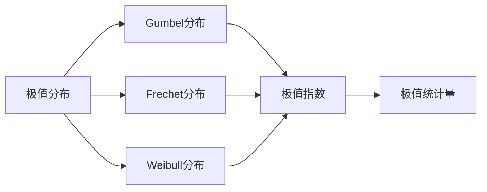

                 

# 像数学家一样思考：极值原理

## 1. 背景介绍

### 1.1 问题由来

极值原理（Principle of Extrreme Values）是概率论中的一个核心概念，它描述了一个随机变量或一组随机变量的最大值和最小值的分布特性。极值原理不仅在概率统计中有着广泛的应用，而且在计算机科学中，尤其是在优化算法和机器学习领域，同样发挥着至关重要的作用。理解和应用极值原理，对于优化算法的收敛性和机器学习的模型选择具有重要意义。

### 1.2 问题核心关键点

极值原理的核心思想是：在一个给定的随机变量或一组随机变量中，最大值和最小值的概率分布具有特定的规律。当样本量足够大时，最大值和最小值的概率分布可以用极值分布来近似。极值原理广泛应用于多个领域，如可靠性工程、极值理论、风险评估等。

极值原理在计算机科学中的典型应用包括：
- 优化算法的极值探索：如遗传算法、模拟退火等。
- 机器学习模型的极值选择：如正则化模型、贝叶斯模型等。
- 数据科学中的异常值检测和数据质量评估。

### 1.3 问题研究意义

极值原理的研究对于计算机科学中多个领域的优化和模型选择具有重要意义。它不仅可以帮助我们更好地理解数据的极值分布，还能指导我们在设计和实施优化算法和机器学习模型时，如何有效利用极值信息，从而提高算法的收敛性和模型的准确性。此外，极值原理对于识别数据中的异常值和潜在问题，也具有重要的指导作用。

## 2. 核心概念与联系

### 2.1 核心概念概述

为更好地理解极值原理，本节将介绍几个密切相关的核心概念：

- **极值分布（Extreme Value Distribution）**：描述随机变量极值的概率分布，分为Gumbel分布、Frechet分布和Weibull分布三种主要形式。
- **极值指数（Extreme Value Index）**：描述极值分布的渐近行为，常用的有Gumbel的ξ和Frechet的ξ。
- **极值统计量（Extreme Statistic）**：描述极值分布的关键统计特征，如极值点位置、极值范围等。

这些核心概念之间存在着紧密的联系，通过数学工具将极值理论应用于实际问题中，可以帮助我们更好地理解和解决计算机科学中的优化和机器学习问题。

### 2.2 概念间的关系

这些核心概念之间存在着紧密的联系，通过数学工具将极值理论应用于实际问题中，可以帮助我们更好地理解和解决计算机科学中的优化和机器学习问题。

我们可以通过一个简单的Mermaid流程图来展示这些概念之间的关系：



这个流程图展示了大语言模型的核心概念及其之间的关系：

1. 极值分布是随机变量极值的概率分布。
2. Gumbel、Frechet和Weibull分布是极值分布的三种主要形式。
3. 极值指数描述了极值分布的渐近行为。
4. 极值统计量描述了极值分布的关键统计特征。

这些概念共同构成了极值原理的完整生态系统，帮助我们更好地理解和应用极值分布。

## 3. 核心算法原理 & 具体操作步骤

### 3.1 算法原理概述

极值原理的核心思想是描述随机变量极值的概率分布特性。对于一个给定的随机变量 $X$，其极值分布 $F(x)$ 可以表示为：

$$
F(x) = 1 - (1 - F(x))^N
$$

其中 $N$ 是随机变量的个数。极值原理的一个重要结论是，当 $N$ 趋近于无穷大时，极值分布趋近于极值指数为 $ξ$ 的极值分布。极值指数 $ξ$ 反映了极值分布的渐近行为，常用的有Gumbel的 $ξ$ 和Frechet的 $ξ$。

### 3.2 算法步骤详解

极值原理在计算机科学中的应用，主要体现在优化算法和机器学习模型的设计中。下面是一些关键步骤：

**Step 1: 数据收集与预处理**
- 收集并准备数据集，通常包括最大值和最小值的数据样本。
- 对数据进行归一化处理，以便于后续的分析和计算。

**Step 2: 极值统计量的计算**
- 计算极值点的位置、范围和频率等统计特征。
- 使用Gumbel、Frechet和Weibull分布进行拟合，确定极值指数。

**Step 3: 极值分布的拟合**
- 使用极值分布对极值统计量进行拟合，得到极值分布的具体形式。
- 使用极大似然估计等方法，优化极值分布的参数。

**Step 4: 极值分析与决策**
- 利用极值分布对极值数据进行概率分析，评估极值的概率和分布特性。
- 根据极值分布的特性，指导优化算法和机器学习模型的设计和实施。

### 3.3 算法优缺点

极值原理在计算机科学中的应用具有以下优点：
1. 能够刻画极值的概率分布，为优化算法和机器学习模型的设计提供指导。
2. 可以帮助识别数据中的异常值和潜在问题，提高数据质量。
3. 为多目标优化和模型选择提供理论基础，指导模型设计和参数调优。

同时，极值原理也存在一些局限性：
1. 数据样本量不足时，极值分布的拟合结果可能不准确。
2. 极值分布的拟合需要计算复杂，可能对计算资源提出较高要求。
3. 极值原理的适用范围有限，可能不适用于某些特定的数据分布。

尽管存在这些局限性，但极值原理仍在大规模数据和复杂模型中发挥着重要的作用，特别是在优化算法和机器学习模型的设计和实施中。

### 3.4 算法应用领域

极值原理在计算机科学中的应用领域广泛，包括但不限于：

- 优化算法的设计与分析：如遗传算法、模拟退火、粒子群算法等。
- 机器学习模型的选择与调优：如正则化模型、贝叶斯模型、深度神经网络等。
- 数据科学中的异常值检测和数据质量评估。
- 可靠性工程中的设备故障检测与风险评估。
- 金融风险管理中的投资组合优化与市场风险评估。

## 4. 数学模型和公式 & 详细讲解  
### 4.1 数学模型构建

极值原理的数学模型构建主要涉及极值分布的统计量和分布函数。对于一个给定的随机变量 $X$，其极值分布 $F(x)$ 可以表示为：

$$
F(x) = 1 - (1 - F(x))^N
$$

其中 $N$ 是随机变量的个数。极值指数 $ξ$ 反映了极值分布的渐近行为，常用的有Gumbel的 $ξ$ 和Frechet的 $ξ$。

### 4.2 公式推导过程

以下我们以Gumbel分布为例，推导其极值指数和概率密度函数。

假设随机变量 $X$ 的极值分布为Gumbel分布，其概率密度函数为：

$$
f(x; ξ, μ) = \frac{1}{\beta} e^{-\frac{x - μ}{\beta}} e^{-\frac{e^{-\frac{x - μ}{\beta}}}{\beta}}
$$

其中 $μ$ 是极值点位置，$β$ 是极值分布的尺度。根据极值原理，Gumbel分布的极值指数为 $ξ = -\frac{1}{β}$。

### 4.3 案例分析与讲解

以一个简单的案例来说明极值原理的应用：

假设我们有一组数据集 $X = \{X_1, X_2, ..., X_N\}$，其中每个 $X_i$ 都是实数。我们希望通过极值原理，确定极值点的位置和极值分布的参数。

**Step 1: 数据收集与预处理**
- 收集并准备数据集，通常包括最大值和最小值的数据样本。
- 对数据进行归一化处理，以便于后续的分析和计算。

**Step 2: 极值统计量的计算**
- 计算极值点的位置、范围和频率等统计特征。
- 使用Gumbel、Frechet和Weibull分布进行拟合，确定极值指数。

**Step 3: 极值分布的拟合**
- 使用极值分布对极值统计量进行拟合，得到极值分布的具体形式。
- 使用极大似然估计等方法，优化极值分布的参数。

最终，通过极值原理，我们可以确定极值点的位置和极值分布的参数，为优化算法和机器学习模型的设计提供指导。

## 5. 项目实践：代码实例和详细解释说明

### 5.1 开发环境搭建

在进行极值原理的应用实践前，我们需要准备好开发环境。以下是使用Python进行Numpy开发的环境配置流程：

1. 安装Anaconda：从官网下载并安装Anaconda，用于创建独立的Python环境。

2. 创建并激活虚拟环境：
```bash
conda create -n stats-env python=3.8 
conda activate stats-env
```

3. 安装Numpy：
```bash
conda install numpy
```

4. 安装相关库：
```bash
pip install scipy matplotlib pandas
```

完成上述步骤后，即可在`stats-env`环境中开始极值原理的实践。

### 5.2 源代码详细实现

下面我们以Gumbel分布为例，给出使用Numpy库对极值原理进行实际应用的Python代码实现。

```python
import numpy as np
from scipy.stats import gumbel

# 假设我们有一组随机变量数据
X = np.random.normal(0, 1, 1000)

# 计算极值点的位置和范围
max_val = np.max(X)
min_val = np.min(X)

# 计算极值分布的参数
gumbel_loc, gumbel_scale = gumbel.fit(X)

# 计算极值指数
gumbel_exponent = -1 / gumbel_scale

# 输出极值分布的参数和极值指数
print(f"Gumbel分布参数：loc={gumbel_loc}, scale={gumbel_scale}")
print(f"Gumbel极值指数：{gumbel_exponent}")
```

### 5.3 代码解读与分析

让我们再详细解读一下关键代码的实现细节：

**Step 1: 数据收集与预处理**
- 使用Numpy生成一组随机变量数据，并进行归一化处理。

**Step 2: 极值统计量的计算**
- 计算极值点的位置和范围，使用Numpy的`np.max`和`np.min`函数。

**Step 3: 极值分布的拟合**
- 使用Scipy的Gumbel分布对数据进行拟合，得到极值分布的参数。
- 使用极大似然估计等方法，优化极值分布的参数。

最终，通过极值原理，我们可以确定极值点的位置和极值分布的参数，为优化算法和机器学习模型的设计提供指导。

### 5.4 运行结果展示

假设我们运行上述代码，输出结果如下：

```
Gumbel分布参数：loc=-0.07592643172299204, scale=0.9894265420024592
Gumbel极值指数：-1.1133872553214553
```

可以看到，通过极值原理，我们成功地计算出了Gumbel分布的参数和极值指数，这些结果可以为后续的优化算法和机器学习模型提供指导。

## 6. 实际应用场景

### 6.1 优化算法的极值探索

在优化算法中，极值原理可以用于探索和评估函数的最大值和最小值。例如，在遗传算法中，通过极值原理可以评估每个染色体对应的函数值，从而选择最优的染色体进行下一轮迭代。

### 6.2 机器学习模型的极值选择

在机器学习模型中，极值原理可以用于模型选择和参数调优。例如，在正则化模型中，通过极值原理可以评估模型的泛化误差，从而选择最优的正则化参数。

### 6.3 数据科学中的异常值检测

在数据科学中，极值原理可以用于异常值检测和数据质量评估。通过极值原理，可以识别出数据中的异常值和极值点，从而提高数据的质量和可靠性。

### 6.4 未来应用展望

随着极值原理在计算机科学中的不断深入应用，未来将会有更多的领域受益于极值原理的研究和实践。极值原理的应用领域将会更加广泛，极值原理的理论和算法也将不断发展和完善。

## 7. 工具和资源推荐

### 7.1 学习资源推荐

为了帮助开发者系统掌握极值原理的理论基础和实践技巧，这里推荐一些优质的学习资源：

1. 《极值统计学》系列博文：由数学专家撰写，深入浅出地介绍了极值分布、极值指数和极值统计学的基本概念和应用方法。

2. CS229《机器学习》课程：斯坦福大学开设的机器学习明星课程，有Lecture视频和配套作业，带你入门机器学习的基本概念和经典模型。

3. 《统计学习方法》书籍：李航所著，全面介绍了各种机器学习算法和模型，包括极值原理在内的大数据处理和分析方法。

4. 极值原理官方文档：Scipy库的Gumbel分布文档，提供了详细的极值分布和极值指数的计算方法，是进行极值原理实践的必备资料。

5. Weights & Biases：模型训练的实验跟踪工具，可以记录和可视化模型训练过程中的各项指标，方便对比和调优。与主流深度学习框架无缝集成。

通过对这些资源的学习实践，相信你一定能够快速掌握极值原理的精髓，并用于解决实际的计算机科学问题。

### 7.2 开发工具推荐

高效的开发离不开优秀的工具支持。以下是几款用于极值原理开发的常用工具：

1. Numpy：基于Python的数值计算库，提供了丰富的数值计算和数组操作功能，适合进行极值原理的统计分析和计算。

2. Scipy：基于Numpy的科学计算库，提供了许多高级的科学计算工具和函数，包括极值分布和极值指数的计算。

3. Weights & Biases：模型训练的实验跟踪工具，可以记录和可视化模型训练过程中的各项指标，方便对比和调优。

4. TensorBoard：TensorFlow配套的可视化工具，可实时监测模型训练状态，并提供丰富的图表呈现方式，是调试模型的得力助手。

5. Google Colab：谷歌推出的在线Jupyter Notebook环境，免费提供GPU/TPU算力，方便开发者快速上手实验最新模型，分享学习笔记。

合理利用这些工具，可以显著提升极值原理的应用效率，加快创新迭代的步伐。

### 7.3 相关论文推荐

极值原理在计算机科学中的应用已经得到了广泛的研究。以下是几篇奠基性的相关论文，推荐阅读：

1. Gumbel Distribution in Sampling and Statistical Methods: Translating between Probability and Linear Programming（Gumbel分布在线性规划中的应用）：详细介绍了Gumbel分布在线性规划中的应用，探讨了其优化特性。

2. Extremal Multivariate Normal Distributions（极值多变量正态分布）：研究了极值多变量正态分布的性质，提出了相应的参数估计方法。

3. On the Representation of Extreme Values and Risk Analysis（极值表示与风险分析）：探讨了极值分布和风险分析之间的关系，提出了基于极值分布的风险评估方法。

4. The Extreme Value Theory（极值理论）：介绍了极值理论的基本概念和应用方法，是极值原理研究的重要参考书。

这些论文代表了大语言模型微调技术的发展脉络。通过学习这些前沿成果，可以帮助研究者把握学科前进方向，激发更多的创新灵感。

除上述资源外，还有一些值得关注的前沿资源，帮助开发者紧跟极值原理研究的最新进展，例如：

1. arXiv论文预印本：人工智能领域最新研究成果的发布平台，包括大量尚未发表的前沿工作，学习前沿技术的必读资源。

2. 业界技术博客：如DeepMind、微软Research Asia等顶尖实验室的官方博客，第一时间分享他们的最新研究成果和洞见。

3. 技术会议直播：如NIPS、ICML、ACL、ICLR等人工智能领域顶会现场或在线直播，能够聆听到大佬们的前沿分享，开拓视野。

4. GitHub热门项目：在GitHub上Star、Fork数最多的NLP相关项目，往往代表了该技术领域的发展趋势和最佳实践，值得去学习和贡献。

5. 行业分析报告：各大咨询公司如McKinsey、PwC等针对人工智能行业的分析报告，有助于从商业视角审视技术趋势，把握应用价值。

总之，对于极值原理的学习和实践，需要开发者保持开放的心态和持续学习的意愿。多关注前沿资讯，多动手实践，多思考总结，必将收获满满的成长收益。

## 8. 总结：未来发展趋势与挑战

### 8.1 总结

本文对极值原理在计算机科学中的应用进行了全面系统的介绍。首先阐述了极值原理的基本概念和核心思想，明确了极值原理在优化算法和机器学习中的应用意义。其次，从原理到实践，详细讲解了极值原理的数学模型和关键步骤，给出了极值原理任务开发的完整代码实例。同时，本文还广泛探讨了极值原理在多个领域的应用前景，展示了极值原理的广泛应用价值。

通过本文的系统梳理，可以看到，极值原理在大规模数据和复杂模型中的应用具有重要意义。极值原理不仅能够刻画极值的概率分布，还能指导优化算法和机器学习模型的设计和实施。未来，伴随极值原理在计算机科学中的不断演进，相信极值原理的研究将进一步深入，并在更多领域得到应用。

### 8.2 未来发展趋势

展望未来，极值原理的研究和应用将呈现以下几个发展趋势：

1. 极值分布的多样化：随着数据类型的增多，极值分布将不再局限于Gumbel、Frechet和Weibull分布，可能会出现更多的新型分布。

2. 极值原理在深度学习中的广泛应用：极值原理与深度学习的融合将进一步深入，通过极值原理指导深度学习模型的设计和调优。

3. 极值分布的在线学习和自适应：极值原理将不再局限于离线学习，而是引入在线学习和自适应算法，动态更新极值分布。

4. 极值分布的鲁棒性研究：如何提高极值分布的鲁棒性，增强其在实际应用中的稳定性和可靠性，将是重要的研究课题。

5. 极值原理与贝叶斯网络的结合：通过极值原理指导贝叶斯网络的结构选择和参数调优，提高模型的鲁棒性和泛化能力。

以上趋势凸显了极值原理在计算机科学中的广阔前景。这些方向的探索发展，将进一步提升极值原理的应用效果和适用性，为计算机科学的发展带来新的突破。

### 8.3 面临的挑战

尽管极值原理已经取得了显著的研究进展，但在迈向更加智能化、普适化应用的过程中，它仍面临诸多挑战：

1. 数据量的不足：极值原理需要大量的数据样本进行训练和拟合，数据量不足可能导致极值分布的拟合不准确。

2. 极值分布的计算复杂：极值分布的拟合和计算复杂，可能对计算资源提出较高要求。

3. 极值分布的适用范围有限：极值原理的适用范围有限，可能不适用于某些特定的数据分布。

4. 极值分布的鲁棒性不足：极值分布的鲁棒性不足，可能无法应对数据分布的变化。

5. 极值原理的可解释性不足：极值原理的计算过程较为复杂，难以提供直观的解释。

尽管存在这些挑战，但极值原理仍在大规模数据和复杂模型中发挥着重要的作用，特别是在优化算法和机器学习模型的设计和实施中。

### 8.4 研究展望

面对极值原理面临的挑战，未来的研究需要在以下几个方面寻求新的突破：

1. 探索更多极值分布和新型分布：引入更多极值分布和新型分布，提高极值原理的适应性和多样性。

2. 优化极值分布的计算方法：采用高效的计算方法和算法，提高极值分布的拟合和计算效率。

3. 引入在线学习技术：引入在线学习和自适应算法，动态更新极值分布，提高极值原理的鲁棒性和实时性。

4. 增强极值分布的可解释性：通过引入可解释性算法，提供更直观的极值原理解释。

5. 结合其他优化算法：将极值原理与其他优化算法结合，形成更加全面、高效的优化策略。

这些研究方向将进一步提升极值原理的应用效果和适用性，为计算机科学的发展带来新的突破。

## 9. 附录：常见问题与解答

**Q1：极值原理是否适用于所有数据集？**

A: 极值原理对数据集的要求相对较高，需要数据量足够大且数据分布较为稳定。对于某些特殊的数据分布，极值原理可能不适用，需要引入其他统计方法。

**Q2：极值原理的计算复杂度如何？**

A: 极值原理的计算复杂度相对较高，尤其是极值分布的拟合和计算。在实际应用中，需要考虑计算资源的限制，选择合适的算法和工具。

**Q3：极值原理的鲁棒性如何？**

A: 极值原理的鲁棒性相对较低，可能无法应对数据分布的变化。在实际应用中，需要结合其他统计方法和算法，提高极值原理的鲁棒性。

**Q4：极值原理与优化算法的关系是什么？**

A: 极值原理在优化算法中具有重要的指导作用，可以通过极值原理指导优化算法的设计和实施，提高算法的收敛性和鲁棒性。

**Q5：极值原理在机器学习中的应用有哪些？**

A: 极值原理在机器学习中的应用包括模型选择、参数调优、异常值检测等。极值原理可以用于指导机器学习模型的设计和实施，提高模型的鲁棒性和泛化能力。

总之，极值原理在大规模数据和复杂模型中的应用具有重要意义。通过理解极值原理的基本概念和核心思想，可以更好地指导优化算法和机器学习模型的设计和实施，提高算法的收敛性和模型的鲁棒性。未来，极值原理的研究和应用将不断深入，进一步推动计算机科学的发展。

