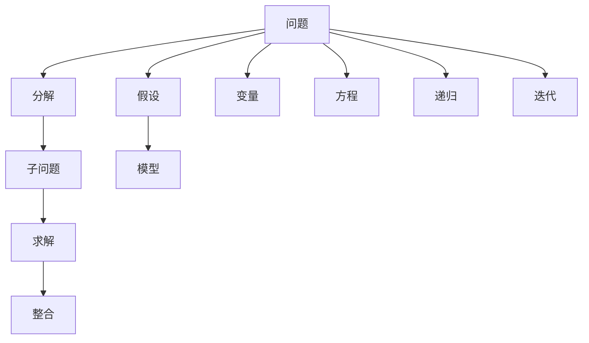
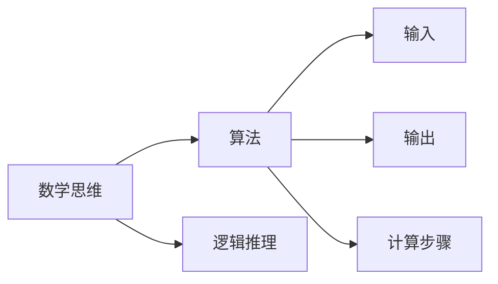
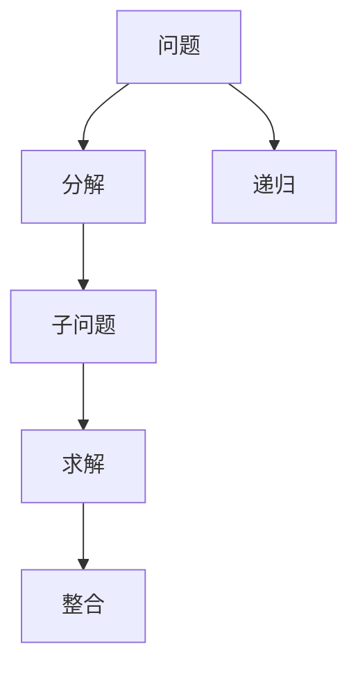
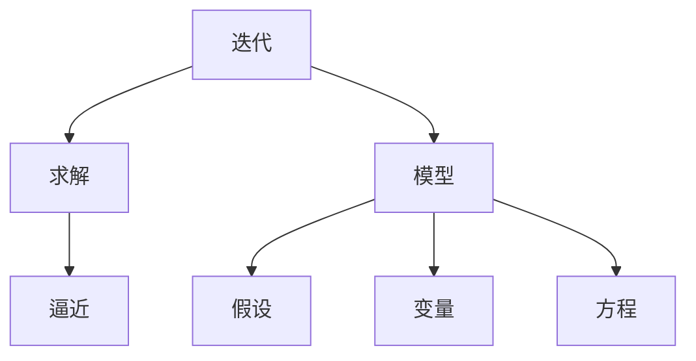

                 

# 像数学家一样思考：步步逼近原则

> 关键词：数学思维, 原则, 算法, 问题解决, 案例分析, 技术实践

## 1. 背景介绍

### 1.1 问题由来
在当今这个信息化和数字化快速发展的时代，我们正面临前所未有的技术挑战。从人工智能到量子计算，从大数据到区块链，每一步技术进步都离不开数学家的智慧。然而，数学不仅仅是科学家们研究的领域，更是工程师们解决问题的基础。无论是在软件开发、系统设计还是产品运营中，数学思维的重要性不言而喻。

### 1.2 问题核心关键点
数学思维的核心是“步步逼近”的原则。这一原则要求我们面对复杂问题时，通过不断分解和逐步求解，最终逼近问题本质，找到最优解决方案。这一原则在软件开发和系统设计中尤为关键。在本文中，我们将通过一系列案例和实例，探讨如何像数学家一样思考，逐步逼近问题，并给出基于数学原则的解决方案。

### 1.3 问题研究意义
掌握数学思维和“步步逼近”的原则，对软件开发和系统设计者有着重要意义。它不仅能提高问题解决能力，还能促进团队协作，提升产品质量。同时，这一原则也是数据驱动决策的基础，帮助我们从海量数据中提取有价值的信息。本文旨在帮助读者理解和应用这一原则，通过数学思维，推动技术创新和实践突破。

## 2. 核心概念与联系

### 2.1 核心概念概述

为更好地理解“步步逼近”原则在问题解决中的应用，本节将介绍几个密切相关的核心概念：

- **数学思维**：基于逻辑和推理的思考方式，通过逐步推理逼近问题本质。
- **算法**：解决特定问题的计算方法，通常由输入、输出和计算步骤组成。
- **问题分解**：将复杂问题分解为若干子问题，逐步求解。
- **递归**：问题分解的一种特殊形式，通过重复解决子问题逼近总体问题。
- **迭代**：在特定条件下重复执行一个算法，逐步逼近问题的最优解。
- **模型构建**：建立数学模型来描述和解决问题，通常包括假设、变量和方程。
- **案例分析**：通过具体案例研究，揭示问题的本质和解决方法。

这些核心概念之间的逻辑关系可以通过以下Mermaid流程图来展示：



这个流程图展示了数学思维在问题解决中的整体架构：

1. 确定问题，并对其进行分解。
2. 求解子问题。
3. 整合子问题的结果，逼近问题的整体解决方案。
4. 建立数学模型，进一步分析问题。
5. 使用递归和迭代方法逐步逼近问题的最优解。

### 2.2 概念间的关系

这些核心概念之间存在着紧密的联系，形成了数学思维和问题解决的完整生态系统。下面我通过几个Mermaid流程图来展示这些概念之间的关系。

#### 2.2.1 数学思维与算法的关系



这个流程图展示了数学思维与算法之间的关系：数学思维通过逻辑推理确定算法的输入、输出和计算步骤，从而形成有效的算法。

#### 2.2.2 问题分解与递归的关系



这个流程图展示了问题分解和递归之间的关系：通过分解将复杂问题转换为子问题，并使用递归逐步逼近问题的最优解。

#### 2.2.3 迭代与模型构建的关系



这个流程图展示了迭代和模型构建之间的关系：通过迭代逐步逼近问题的解，并在此基础上建立数学模型，进一步分析问题的本质。

### 2.3 核心概念的整体架构

最后，我们用一个综合的流程图来展示这些核心概念在大问题解决中的整体架构：


这个综合流程图展示了从问题定义到求解的完整过程：

1. 确定问题，并对其进行分解。
2. 求解子问题。
3. 整合子问题的结果，逼近问题的整体解决方案。
4. 建立数学模型，进一步分析问题。
5. 使用递归和迭代方法逐步逼近问题的最优解。

这些核心概念共同构成了数学思维和问题解决的框架，帮助我们通过逐步推理逼近问题的本质，找到最优解决方案。通过理解这些核心概念，我们可以更好地把握数学思维和问题解决的基本原则。

## 3. 核心算法原理 & 具体操作步骤
### 3.1 算法原理概述

“步步逼近”原则在算法设计中通常通过迭代和递归的方式体现。在面对复杂问题时，算法通过不断分解和逐步求解，逐步逼近问题的最优解。

以排序算法为例，如快速排序算法，其基本思想是通过递归地分割和合并两个子数组，逐步逼近排序的最终结果。这种逐步逼近的方式，使得快速排序算法在面对大规模数据时仍能保持高效。

### 3.2 算法步骤详解

下面以二分查找算法为例，详细讲解其具体步骤：

1. **输入定义**：给定一个有序数组 $A$ 和一个目标值 $x$，需要在数组中找到目标值的位置。

2. **问题分解**：将问题分解为两个子问题：在数组的左半部分查找目标值，或在数组的右半部分查找目标值。

3. **求解子问题**：
   - 如果目标值等于数组中间元素，则返回中间元素的位置。
   - 如果目标值小于中间元素，则在左半部分继续查找。
   - 如果目标值大于中间元素，则在右半部分继续查找。

4. **整合结果**：返回目标值的位置。

### 3.3 算法优缺点

**优点**：
- 简单高效。通过递归和迭代，逐步逼近问题的最优解，算法实现相对简单。
- 时间复杂度低。二分查找算法的时间复杂度为 $O(\log n)$，比线性查找效率更高。
- 适用范围广。适用于各种有序数组的查找问题，如整数、浮点数、字符串等。

**缺点**：
- 需要预处理数组。只有有序数组才能使用二分查找算法。
- 不适合随机查找。如果数组元素随机分布，则无法使用二分查找算法。

### 3.4 算法应用领域

二分查找算法在计算机科学中有着广泛的应用，包括：

- 数据搜索：在有序数组中快速查找特定元素。
- 数值逼近：通过逐步逼近逼近函数零点，解决方程求解问题。
- 游戏AI：在棋类游戏或策略游戏中，通过逐步逼近最优策略，提高游戏智能水平。

## 4. 数学模型和公式 & 详细讲解 & 举例说明

### 4.1 数学模型构建

在数学思维中，构建数学模型是解决问题的重要步骤。通过建立数学模型，可以更清晰地描述问题，并提出解决方案。

假设我们有一个函数 $f(x) = x^2 + bx + c$，需要通过求解方程 $f(x) = 0$ 找到函数的零点。我们可以建立以下数学模型：

- **输入**：函数 $f(x)$ 和目标值 $0$。
- **变量**：$x$，零点。
- **方程**：$f(x) = 0$。

### 4.2 公式推导过程

根据数学模型，我们可以推导出求解方程的方法。假设我们有两个零点 $x_1$ 和 $x_2$，则有：

$$
x_1 + x_2 = -\frac{b}{a}, \quad x_1x_2 = \frac{c}{a}
$$

其中 $a$, $b$, $c$ 为函数 $f(x) = ax^2 + bx + c$ 的系数。

### 4.3 案例分析与讲解

假设我们需要求解函数 $f(x) = x^2 + 2x + 1$ 的零点，通过上述方法，我们可以得到：

$$
x_1 + x_2 = -\frac{2}{1} = -2, \quad x_1x_2 = \frac{1}{1} = 1
$$

因此，零点为 $x_1 = -1$ 和 $x_2 = -1$。

## 5. 项目实践：代码实例和详细解释说明
### 5.1 开发环境搭建

在进行项目实践前，我们需要准备好开发环境。以下是使用Python进行二分查找的开发环境配置流程：

1. 安装Anaconda：从官网下载并安装Anaconda，用于创建独立的Python环境。

2. 创建并激活虚拟环境：
```bash
conda create -n binary-search python=3.8 
conda activate binary-search
```

3. 安装必要的库：
```bash
pip install numpy
```

完成上述步骤后，即可在`binary-search`环境中开始项目实践。

### 5.2 源代码详细实现

下面我们以二分查找算法为例，给出Python代码实现。

```python
import numpy as np

def binary_search(arr, target):
    left, right = 0, len(arr) - 1
    
    while left <= right:
        mid = (left + right) // 2
        
        if arr[mid] == target:
            return mid
        
        if arr[mid] < target:
            left = mid + 1
        else:
            right = mid - 1
    
    return -1
```

### 5.3 代码解读与分析

让我们再详细解读一下关键代码的实现细节：

**binary_search函数**：
- 定义输入数组 `arr` 和目标值 `target`。
- 初始化左边界 `left` 和右边界 `right`。
- 在 while 循环中不断逼近目标值，更新左边界和右边界。
- 返回目标值在数组中的位置，或 -1 表示目标值不存在。

**代码解释**：
- `(left + right) // 2` 用于计算中间位置 `mid`，避免浮点数除法带来的精度问题。
- 通过比较中间值与目标值的大小，逐步逼近目标值的位置。
- 最终返回目标值的位置，或 -1 表示未找到。

### 5.4 运行结果展示

假设我们在数组 `[1, 2, 3, 4, 5, 6, 7, 8, 9, 10]` 中查找值为 `5` 的元素，运行结果如下：

```python
print(binary_search([1, 2, 3, 4, 5, 6, 7, 8, 9, 10], 5))
```

输出：

```python
4
```

可以看到，通过二分查找算法，我们在数组中成功找到了目标值 `5` 的位置。

## 6. 实际应用场景
### 6.1 数学教学

在数学教学中，二分查找算法可以用于教授学生如何通过逐步逼近的方法解决复杂问题。通过课堂演示和互动练习，学生可以更好地理解算法的原理和应用。

### 6.2 数据库搜索

数据库中的数据通常按某种顺序存储，可以使用二分查找算法快速定位数据。例如，在SQL查询中，可以使用二分查找算法优化索引搜索，提高查询效率。

### 6.3 金融市场分析

金融市场中的价格变化通常呈现出某种规律性，可以通过二分查找算法分析历史数据，预测未来的价格走势。例如，在技术分析中，可以使用二分查找算法找出价格波动的关键点，指导交易决策。

### 6.4 未来应用展望

未来，二分查找算法将在更多领域得到应用，为问题解决提供新的思路。

- 生物信息学：通过逐步逼近的方法，分析基因序列和蛋白质结构，发现生物学规律。
- 天文学：通过二分查找算法，处理和分析大型天文数据集，发现宇宙中的新现象。
- 物理学：通过逐步逼近的方法，模拟和分析复杂物理系统，解决计算物理问题。

## 7. 工具和资源推荐
### 7.1 学习资源推荐

为了帮助开发者系统掌握数学思维和“步步逼近”的原则，这里推荐一些优质的学习资源：

1. 《算法导论》（Introduction to Algorithms）：经典算法教材，详细讲解了各种算法的设计和实现方法，是算法学习的必备资源。
2. Coursera《计算机科学导论》（CS50's Introduction to Computer Science）：哈佛大学的计算机科学入门课程，涵盖了算法、数据结构、编程基础等内容。
3. edX《算法设计与分析》（Algorithm Design and Analysis）：斯坦福大学的算法设计课程，介绍了常见的算法设计和分析方法。
4. LeetCode算法题库：包含了各种难度级别的算法题，可以帮助开发者提高算法实现和问题解决能力。
5. HackerRank算法挑战：提供大量的算法题和挑战，帮助开发者提升算法思维和编程技能。

通过对这些资源的学习实践，相信你一定能够快速掌握数学思维和“步步逼近”的原则，并用于解决实际的算法问题。

### 7.2 开发工具推荐

高效的开发离不开优秀的工具支持。以下是几款用于算法实践开发的常用工具：

1. PyCharm：功能强大的Python IDE，支持代码高亮、代码提示、调试等，适合算法开发和测试。
2. Visual Studio Code：轻量级的编辑器，支持多种语言和插件，适合快速编写和调试代码。
3. Jupyter Notebook：交互式的编程环境，适合进行数据处理和算法验证。
4. GitHub：代码托管平台，方便开发者进行版本控制和协作开发。
5. Anaconda：Python环境管理工具，支持创建虚拟环境和依赖包管理。

合理利用这些工具，可以显著提升算法开发和测试的效率，加快创新迭代的步伐。

### 7.3 相关论文推荐

数学思维和算法设计的研究不断推陈出新，以下是几篇奠基性的相关论文，推荐阅读：

1. "Algorithm 163: Binary Search"（算法163：二分查找）：Coursera《计算机科学导论》中的经典算法案例，详细介绍了二分查找算法的实现和应用。
2. "Algorithm 161: Selection Sort"（算法161：选择排序）：Coursera《计算机科学导论》中的经典算法案例，介绍了选择排序算法的实现和优化方法。
3. "Algorithm 108: Merge Sort"（算法108：归并排序）：Coursera《计算机科学导论》中的经典算法案例，介绍了归并排序算法的实现和优化方法。
4. "Algorithm 100: Bubble Sort"（算法100：冒泡排序）：Coursera《计算机科学导论》中的经典算法案例，介绍了冒泡排序算法的实现和优化方法。
5. "Algorithm 101: Insertion Sort"（算法101：插入排序）：Coursera《计算机科学导论》中的经典算法案例，介绍了插入排序算法的实现和优化方法。

这些论文代表了大规模算法设计的发展脉络。通过学习这些前沿成果，可以帮助研究者把握学科前进方向，激发更多的创新灵感。

除上述资源外，还有一些值得关注的前沿资源，帮助开发者紧跟算法设计技术的最新进展，例如：

1. arXiv论文预印本：人工智能领域最新研究成果的发布平台，包括大量尚未发表的前沿工作，学习前沿技术的必读资源。
2. 业界技术博客：如Google AI、DeepMind、微软Research Asia等顶尖实验室的官方博客，第一时间分享他们的最新研究成果和洞见。
3. 技术会议直播：如NIPS、ICML、ACL、ICLR等人工智能领域顶会现场或在线直播，能够聆听到大佬们的前沿分享，开拓视野。
4. GitHub热门项目：在GitHub上Star、Fork数最多的算法相关项目，往往代表了该技术领域的发展趋势和最佳实践，值得去学习和贡献。
5. 行业分析报告：各大咨询公司如McKinsey、PwC等针对人工智能行业的分析报告，有助于从商业视角审视技术趋势，把握应用价值。

总之，对于数学思维和算法设计的学习和实践，需要开发者保持开放的心态和持续学习的意愿。多关注前沿资讯，多动手实践，多思考总结，必将收获满满的成长收益。

## 8. 总结：未来发展趋势与挑战
### 8.1 总结

本文对“步步逼近”原则在数学思维和算法设计中的应用进行了全面系统的介绍。首先阐述了“步步逼近”原则在问题解决中的重要性和应用场景，明确了算法设计和数学思维的基本原则。其次，通过二分查找算法的详细讲解，展示了“步步逼近”原则在算法实现中的具体应用。同时，本文还探讨了数学思维在多个实际领域中的应用，展示了其广泛的影响力。

通过本文的系统梳理，可以看到，“步步逼近”原则是问题解决和算法设计中的核心思想，通过逐步推理逼近问题的本质，可以高效地解决复杂问题。掌握这一原则，对于软件开发、系统设计、数据科学等领域都有着重要的应用价值。

### 8.2 未来发展趋势

展望未来，数学思维和算法设计将继续在各个领域得到广泛应用。

1. 算法自动化：随着人工智能和机器学习的发展，算法的自动化设计和优化将逐渐普及，帮助开发者更高效地解决复杂问题。
2. 数据驱动决策：数据科学将成为决策制定的重要依据，数学思维和算法设计将进一步应用于数据分析和建模中，帮助企业做出更科学合理的决策。
3. 跨学科融合：数学思维和算法设计将与其他学科进行更深入的融合，如生物信息学、天文学、物理学等，推动相关领域的技术突破。
4. 人机协同：随着人工智能技术的发展，人机协同将成为未来的主流趋势，数学思维和算法设计将在人机交互和智能系统设计中发挥重要作用。

### 8.3 面临的挑战

尽管数学思维和算法设计已经取得了显著成就，但在未来发展过程中，仍面临诸多挑战：

1. 复杂度增加：随着数据量的增大和问题规模的扩展，算法设计和优化将变得越来越复杂。如何保持算法的高效性和可扩展性，将是未来的重要课题。
2. 数据质量问题：数据的真实性和可靠性直接影响算法的性能和应用效果。如何提高数据质量，保障算法的稳健性和可靠性，将是重要的研究方向。
3. 人机协作：在人机协作中，算法需要更好地理解和响应人类需求，提升人机交互的自然性和智能性。如何设计更好的算法模型，实现人机协作的优化，将是重要的挑战。
4. 伦理和隐私：在算法设计中，需要考虑伦理和隐私问题，确保算法的公正性和安全性。如何设计伦理导向的算法模型，保护用户隐私，将是重要的研究方向。

### 8.4 研究展望

面对数学思维和算法设计面临的挑战，未来的研究需要在以下几个方面寻求新的突破：

1. 算法自动化：开发更加智能和自适应的算法设计工具，帮助开发者更高效地解决问题。
2. 数据质量控制：开发高效的数据清洗和预处理算法，提升数据质量和可靠性。
3. 人机协作优化：通过算法和人工智能技术，提升人机协作的效率和效果。
4. 伦理导向设计：设计伦理导向的算法模型，确保算法的公正性和安全性。

这些研究方向将推动数学思维和算法设计向更高的台阶迈进，为智能系统的优化和升级提供新的技术支持。总之，只有不断创新、勇于突破，才能更好地应对未来技术发展带来的挑战，推动数学思维和算法设计的持续进步。

## 9. 附录：常见问题与解答
----------------------------------------------------------------

**Q1：二分查找算法是否适用于所有有序数组？**

A: 二分查找算法仅适用于有序数组。如果数组是无序的，则需要先进行排序操作，才能使用二分查找算法。

**Q2：二分查找算法的时间复杂度是多少？**

A: 二分查找算法的时间复杂度为 $O(\log n)$，其中 $n$ 是数组的长度。这是因为每次迭代都将查找范围缩小一半，时间复杂度对数级别。

**Q3：二分查找算法的空间复杂度是多少？**

A: 二分查找算法的空间复杂度为 $O(1)$，因为只需要存储常数个变量，不随数组大小变化。

**Q4：二分查找算法能否在数组中查找重复元素？**

A: 二分查找算法可以查找重复元素，但只能找到一个重复元素的位置。如果需要查找所有重复元素，则需要在查找过程中进行特殊处理。

**Q5：二分查找算法是否适用于链表结构？**

A: 二分查找算法不适用于链表结构，因为链表的访问方式不同于数组。如果需要查找链表中的元素，则需要使用其他算法，如二叉查找树等。

---

作者：禅与计算机程序设计艺术 / Zen and the Art of Computer Programming

