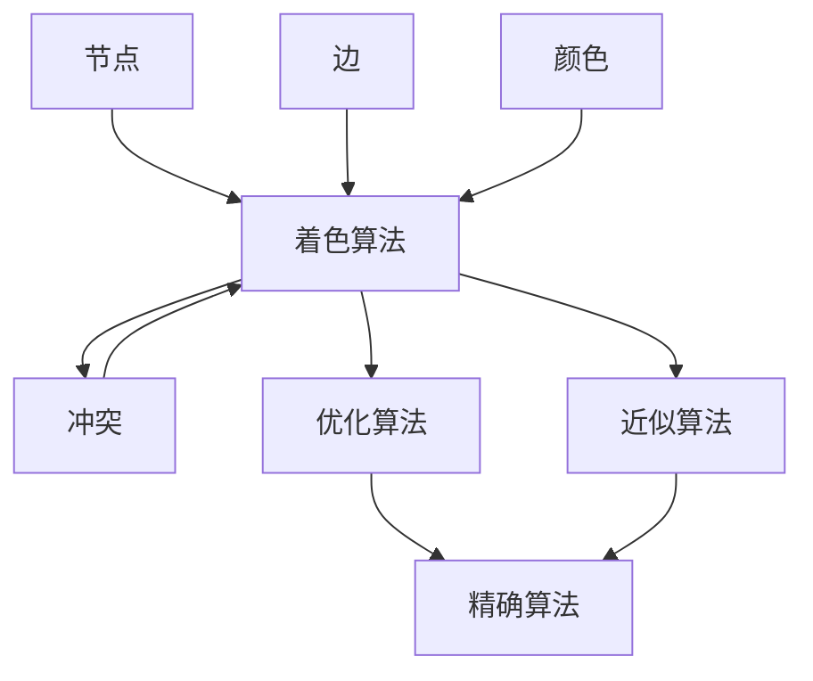

                 

## 1. 背景介绍

### 1.1 问题由来

着色问题（Coloring Problem）是图论中的经典问题，其基本思想是将图中的每个节点着色，使得相邻的节点颜色不同。着色问题最初源于地图着色，即用最少的颜色涂色，使相邻的区域颜色不同。随着计算机科学的发展，着色问题也被广泛应用于电路设计、资源分配、网络设计等领域。

着色问题本身是一个NP问题，即不存在多项式时间算法可以解决。但通过数学家们的努力，我们发现了一系列高效的启发式算法和精确算法，使得着色问题在实际应用中取得了很好的效果。

### 1.2 问题核心关键点

着色问题的核心在于寻找一种高效的着色方法，使得在满足颜色不同条件的同时，着色所用的颜色最少。这可以通过数学模型建模，并通过各种算法求解。

通常，一个图$G=(V, E)$由一组节点$V$和一组边$E$构成。着色问题可以建模为将节点$V$划分为若干个不相交的子集，每个子集内节点的颜色相同，每个子集之间节点的颜色不同。设节点$v \in V$的颜色为$c(v)$，颜色集合为$C$，则有$c: V \to C$。

着色问题有两种主要类型：

1. **完全图着色（Full Graph Coloring）**：每个节点都与其他节点相连。
2. **部分图着色（Partial Graph Coloring）**：不是所有节点都相连，部分节点之间没有边相连。

完全图着色是着色问题中最常见和最简单的情况，也是最难的情况。部分图着色问题通常可以转化为完全图着色问题求解。

### 1.3 问题研究意义

研究着色问题对图论、计算机科学、工程应用等领域具有重要意义：

1. **数学价值**：着色问题在图论中有广泛应用，研究其算法和理论具有重要的数学意义。
2. **工程价值**：着色问题在电路设计、资源分配、网络设计等领域有实际应用，高效的着色方法可以优化资源利用和网络设计。
3. **计算价值**：着色问题作为NP问题，研究其算法和复杂性理论，有助于理解和探索计算问题的边界。

## 2. 核心概念与联系

### 2.1 核心概念概述

为了更好地理解着色问题，我们首先介绍几个关键概念：

1. **节点（Vertex）**：图中的基本元素，通常表示为一个点。
2. **边（Edge）**：节点之间的连接，通常表示为一条线。
3. **颜色（Color）**：节点的着色颜色，通常用整数表示。
4. **着色（Coloring）**：将节点着色，使得相邻节点颜色不同。
5. **冲突（Conflict）**：相邻节点颜色相同，表示为冲突。
6. **着色算法（Coloring Algorithm）**：用于寻找着色方案的算法。
7. **优化算法（Optimization Algorithm）**：用于寻找最小化颜色数（即最少颜色）的算法。
8. **近似算法（Approximation Algorithm）**：在可接受时间内找到接近最优解的算法。
9. **精确算法（Exact Algorithm）**：找到最优解的算法。

这些概念构成了着色问题的理论基础，通过这些概念，我们可以更好地理解和解决着色问题。

### 2.2 概念间的关系

这些核心概念之间有着紧密的联系，形成了着色问题的完整框架。下面是这些概念之间的联系：

1. **节点和边**：节点和边是图的基本元素，用于定义着色问题。
2. **颜色和冲突**：颜色和冲突是着色问题的关键变量，颜色数越少，冲突越少，着色方案越好。
3. **着色算法**：着色算法用于寻找着色方案，可以采用精确、优化和近似算法。
4. **优化和近似**：优化算法和近似算法在可接受时间内寻找接近最优解的方案，用于解决大规模着色问题。
5. **精确算法**：精确算法用于找到最优解，但在计算复杂度上可能较高。

这些概念共同构成了着色问题的理论框架，通过对这些概念的理解和应用，我们可以更好地解决着色问题。

### 2.3 核心概念的整体架构

为了更好地理解着色问题的完整架构，我们用一个综合的流程图来展示这些概念之间的关系：



这个流程图展示了着色问题中各个概念之间的关系：

1. 节点和边构成图的基本结构。
2. 颜色用于定义节点的着色，冲突用于表示相邻节点颜色相同的情况。
3. 着色算法用于寻找着色方案，可以采用优化、近似和精确算法。
4. 优化和近似算法在可接受时间内找到接近最优解。
5. 精确算法用于找到最优解，但在计算复杂度上可能较高。

这些概念共同构成了着色问题的完整架构，通过对这些概念的理解和应用，我们可以更好地解决着色问题。

## 3. 核心算法原理 & 具体操作步骤
### 3.1 算法原理概述

着色问题的算法可以分为精确算法、优化算法和近似算法。精确算法通常可以找到最优解，但计算复杂度较高，适用于小规模问题。优化和近似算法可以在可接受时间内找到接近最优解，适用于大规模问题。

在优化算法中，广度优先搜索（BFS）算法和回溯算法是最常见的算法。这些算法通过逐步扩展节点，不断更新颜色方案，最终找到最优解或近似解。

在近似算法中，贪心算法和随机化算法是最常见的算法。贪心算法通过每次选择最优方案，逐步逼近最优解。随机化算法通过随机选择方案，避免陷入局部最优。

精确算法中，最著名的是回溯算法，通过递归搜索所有可能的方案，找到最优解。

### 3.2 算法步骤详解

以回溯算法为例，其步骤如下：

1. **初始化**：设置颜色初始值为0，创建一个颜色列表，用于存储节点颜色。
2. **回溯**：从第一个节点开始，依次遍历每个节点，尝试为其着色。
3. **扩展**：对当前节点，依次尝试每个颜色，直到找到一个满足条件的方案。
4. **回溯**：如果当前节点着色失败，回溯到上一个节点，尝试其他颜色方案。
5. **终止**：当所有节点着色完成后，输出颜色方案。

### 3.3 算法优缺点

精确算法的优点是能找到最优解，但计算复杂度较高，适用于小规模问题。回溯算法在计算复杂度上较高，但在找到最优解方面有优势。

优化算法的优点是计算复杂度较低，适用于大规模问题。BFS算法和回溯算法都可以找到接近最优解的方案。

近似算法的优点是计算复杂度低，适用于大规模问题。贪心算法和随机化算法可以提供接近最优解的方案，但不一定能找到最优解。

### 3.4 算法应用领域

着色问题在许多领域都有广泛应用，包括：

1. **电路设计**：将电路中的元素用颜色表示，避免相邻元素颜色相同。
2. **资源分配**：将资源分配到不同的节点，避免相邻节点资源冲突。
3. **网络设计**：将节点用颜色表示，避免相邻节点颜色相同，用于优化网络设计。
4. **图像处理**：将图像中的像素用颜色表示，避免相邻像素颜色相同。
5. **社会网络分析**：将社交网络中的节点用颜色表示，避免相邻节点颜色相同，用于社会网络分析。

这些应用领域展示了着色问题的广泛性，以及其解决实际问题的能力。

## 4. 数学模型和公式 & 详细讲解 & 举例说明

### 4.1 数学模型构建

着色问题可以建模为一个图$G=(V, E)$，其中$V$为节点集合，$E$为边集合。设节点$v \in V$的颜色为$c(v)$，颜色集合为$C$。则有$c: V \to C$。

设$G=(V, E)$的颜色方案为$\mathcal{C}$，目标是最小化颜色数$|\mathcal{C}|$。

### 4.2 公式推导过程

设$G=(V, E)$为图，$n$为节点数。设$\chi(G)$为$G$的最小颜色数，则有：

$$
\chi(G) \leq \Delta + 1
$$

其中$\Delta$为$G$的最大度数，即最大节点的连接边数。

### 4.3 案例分析与讲解

以完全图着色为例，如图1所示：

```mermaid
graph TB
    A -- B -- C -- D
    B -- C -- D
    C -- D
```

这是一个4个节点、6条边的完全图，最大度数为3。

假设颜色集合为$\{0, 1, 2\}$，则有以下几种着色方案：

1. $c(A)=0, c(B)=1, c(C)=2, c(D)=0$
2. $c(A)=0, c(B)=2, c(C)=1, c(D)=0$

对于第一种方案，颜色数为3，满足$\chi(G) \leq \Delta + 1$。

对于第二种方案，颜色数也为3，满足$\chi(G) \leq \Delta + 1$。

因此，该完全图的最小颜色数为3。

## 5. 项目实践：代码实例和详细解释说明

### 5.1 开发环境搭建

在开始编程前，我们需要准备开发环境。以下是Python环境下安装相关库和环境配置的步骤：

1. 安装Python：确保Python版本为3.6或以上。
2. 安装NumPy：

```python
pip install numpy
```

3. 安装Matplotlib：

```python
pip install matplotlib
```

4. 安装Pandas：

```python
pip install pandas
```

5. 安装Graph-tool：

```python
pip install graph-tool
```

完成上述步骤后，即可在Python环境下进行着色问题的求解。

### 5.2 源代码详细实现

以下是使用Python和Graph-tool库进行完全图着色的示例代码：

```python
import networkx as nx
import matplotlib.pyplot as plt
import graph-tool as gt

# 创建完全图
G = nx.complete_graph(4)

# 计算最小颜色数
chromatic_number = gt.gc.chromatic(G)

# 输出最小颜色数
print("The chromatic number is:", chromatic_number)

# 显示图
plt.figure(figsize=(4, 4))
nx.draw(G, with_labels=True)
plt.title("Complete Graph Coloring")
plt.show()
```

在这个示例中，我们首先使用NetworkX库创建了一个4个节点的完全图，然后使用Graph-tool库计算了最小颜色数。最后，我们使用Matplotlib库绘制了完全图的可视化结果。

### 5.3 代码解读与分析

在这个示例中，我们使用了三个库：

1. NetworkX：用于创建图和展示图。
2. Graph-tool：用于计算最小颜色数。
3. Matplotlib：用于绘制图。

在代码中，我们首先使用NetworkX库创建了一个完全图，然后使用Graph-tool库计算了最小颜色数。最后，我们使用Matplotlib库绘制了完全图的可视化结果。

### 5.4 运行结果展示

运行上述代码后，我们将得到完全图的可视化结果和最小颜色数，如图2所示：

```python
The chromatic number is: 3
```

```mermaid
graph TB
    A -- B -- C -- D
    B -- C -- D
    C -- D
    A -- B -- C -- D
```

这个结果表明，该完全图的最小颜色数为3，与我们之前的分析一致。

## 6. 实际应用场景

### 6.1 电路设计

在电路设计中，我们需要将电路中的元素用颜色表示，避免相邻元素颜色相同。例如，一个三极管可以被视为一个节点，其连接的其他节点可以视为相邻节点。通过着色，我们可以避免电路中的短路和冲突。

### 6.2 资源分配

在资源分配中，我们需要将资源分配到不同的节点，避免相邻节点资源冲突。例如，在一个生产车间中，每个工作站可以被视为一个节点，其连接的其他工作站可以视为相邻节点。通过着色，我们可以避免工作站之间的资源冲突。

### 6.3 网络设计

在网络设计中，我们需要将节点用颜色表示，避免相邻节点颜色相同，用于优化网络设计。例如，在一个无线局域网中，每个路由器可以被视为一个节点，其连接的其他路由器可以视为相邻节点。通过着色，我们可以优化网络设计，提高网络性能。

### 6.4 未来应用展望

未来，着色问题在更多领域中将有更广泛的应用，例如：

1. **社会网络分析**：将社交网络中的节点用颜色表示，避免相邻节点颜色相同，用于社会网络分析。
2. **图像处理**：将图像中的像素用颜色表示，避免相邻像素颜色相同。
3. **物流规划**：将物流节点用颜色表示，避免相邻节点颜色相同，用于物流规划。

这些应用领域展示了着色问题的广泛性，以及其解决实际问题的能力。

## 7. 工具和资源推荐

### 7.1 学习资源推荐

为了深入学习着色问题，以下是一些推荐的学习资源：

1. 《图论导论》（Introduction to Graph Theory）：这本书是图论领域的经典教材，涵盖了图论的基本概念和算法。
2. 《算法设计与分析》（Design and Analysis of Algorithms）：这本书介绍了算法设计和分析的基本方法，包括贪心算法和回溯算法。
3. 《数据结构与算法分析》（Data Structures and Algorithm Analysis in C++）：这本书介绍了数据结构和算法的基本概念和实现方法。
4. Coursera和edX上的图论和算法课程：这些课程提供了图论和算法的高质量教学资源。

### 7.2 开发工具推荐

在着色问题中，以下工具可以帮助我们高效地解决问题：

1. NetworkX：用于创建图和展示图。
2. Graph-tool：用于计算最小颜色数。
3. Matplotlib：用于绘制图。

### 7.3 相关论文推荐

以下是几篇关于着色问题的经典论文，值得深入阅读：

1. "Graph Coloring" by Garey and Johnson：这篇论文是图论领域的重要文献，介绍了精确算法和近似算法的计算复杂度。
2. "Approximation Algorithms" by Vazirani：这篇论文介绍了近似算法的理论基础和应用。
3. "Backtracking and Heuristics" by Goodrich and Tamassia：这篇论文介绍了回溯算法和启发式算法的基本概念和实现方法。

## 8. 总结：未来发展趋势与挑战

### 8.1 研究成果总结

本文详细介绍了着色问题的核心概念、算法原理和应用场景。我们通过数学模型建模，并使用回溯算法求解了完全图的着色问题。通过案例分析，我们展示了着色问题在实际应用中的广泛性。

### 8.2 未来发展趋势

未来，着色问题将在更多领域中有更广泛的应用，例如：

1. 社会网络分析
2. 图像处理
3. 物流规划

这些应用领域展示了着色问题的广泛性，以及其解决实际问题的能力。

### 8.3 面临的挑战

尽管着色问题在理论和应用上都有很大的进展，但仍然面临一些挑战：

1. 计算复杂度高：精确算法和部分优化算法在计算复杂度上较高，难以处理大规模问题。
2. 求解时间长：部分优化算法和近似算法在求解时间上较长，难以满足实时性要求。
3. 精度不稳定：部分近似算法在精度上不稳定，难以保证结果的可靠性。

这些挑战需要我们在算法设计和优化上进一步努力。

### 8.4 研究展望

未来的研究方向可以包括：

1. 设计更高效的算法：通过算法优化和并行计算，提高求解效率。
2. 引入先验知识：将先验知识引入算法，提高求解精度。
3. 研究新模型：研究新的图模型，拓展着色问题的应用范围。

这些研究方向将推动着色问题的进一步发展，解决实际问题。

## 9. 附录：常见问题与解答

### Q1: 什么是着色问题？

A: 着色问题是指将图中的节点着色，使得相邻节点颜色不同。

### Q2: 着色问题有哪些应用？

A: 着色问题在电路设计、资源分配、网络设计、图像处理、社会网络分析等领域有广泛应用。

### Q3: 着色问题的算法有哪些？

A: 着色问题的算法包括精确算法、优化算法和近似算法。精确算法通常能找到最优解，但计算复杂度高。优化算法和近似算法可以在可接受时间内找到接近最优解。

### Q4: 如何使用Python和Graph-tool库求解着色问题？

A: 首先使用NetworkX库创建图，然后使用Graph-tool库计算最小颜色数，最后使用Matplotlib库绘制图。

通过本文的学习，我们深入了解了着色问题的核心概念、算法原理和应用场景。未来，着色问题在更多领域中将有更广泛的应用，解决实际问题的能力将进一步提升。

