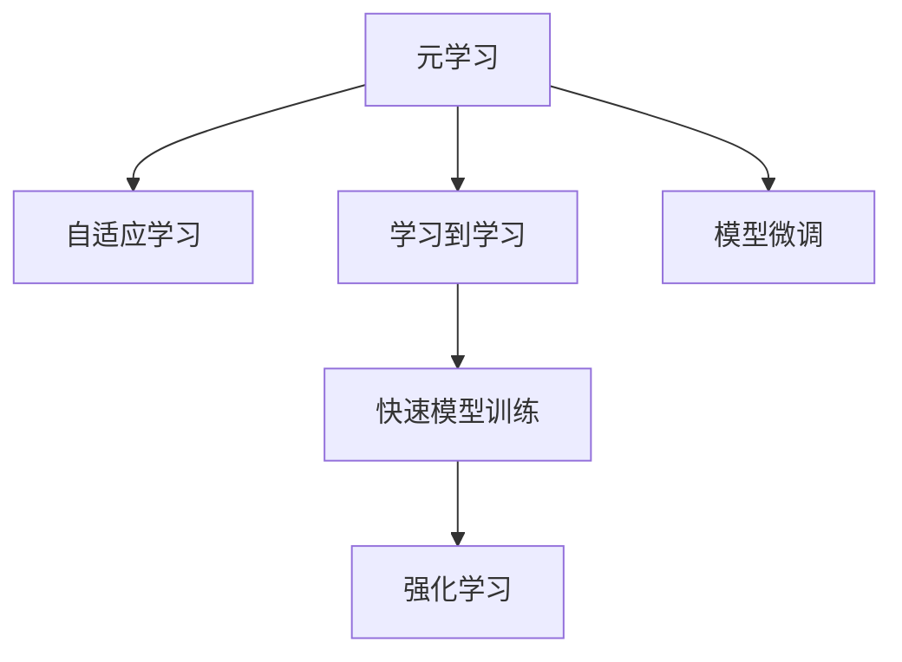
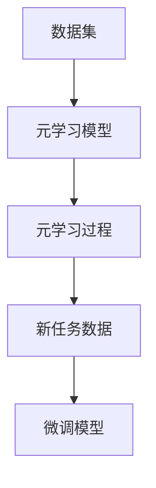
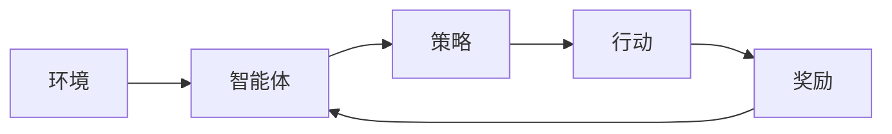
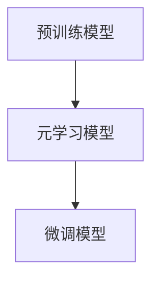
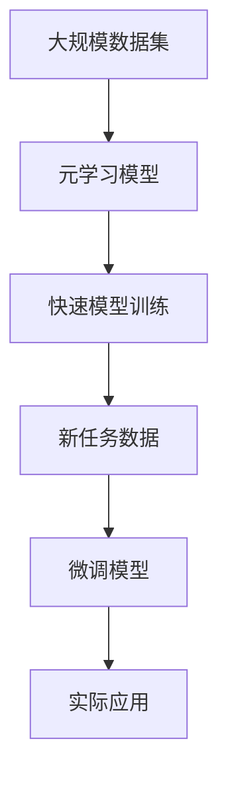

                 

# 元学习(Meta-Learning) - 原理与代码实例讲解

> 关键词：元学习,自适应学习,学习到学习,机器学习,深度学习,快速模型训练,强化学习

## 1. 背景介绍

### 1.1 问题由来
元学习（Meta-Learning），也称为自适应学习（Adaptive Learning）或学习到学习（Learning-to-Learn），是一种人工智能的高级技术，旨在让机器在极短的时间内掌握新任务。与传统机器学习不同，元学习不需要大量标注数据进行训练，而是通过利用已有的经验和知识，快速学习新任务，从而提升机器在各种任务上的表现。

近年来，随着深度学习和强化学习（Reinforcement Learning, RL）的不断进步，元学习已经成为研究热点。许多学者和工程师都在尝试开发出更快、更有效的方法，让机器能够快速适应新环境，提升机器的自主学习能力。

### 1.2 问题核心关键点
元学习的核心思想是通过已有知识加速新任务的适应过程。具体来说，元学习模型需要先进行一项“元学习任务”，即学习如何在不同的任务上调整自己的模型参数，然后利用这项元学习知识在新任务上进行微调。

元学习的目标是在新的、未见过的数据集上快速获得良好的性能，这使得元学习在实际应用中具有重要的价值。例如，在医疗诊断、游戏AI、自然语言处理等领域，快速适应新环境能够显著提升系统的性能。

### 1.3 问题研究意义
元学习具有以下重要意义：
1. **提升模型适应性**：元学习能够快速适应新任务，提升模型在复杂、多变环境中的表现。
2. **降低标注成本**：通过元学习，机器能够在少量标注数据下快速学习新任务，节省标注成本。
3. **加速模型训练**：元学习能够显著缩短模型的训练时间，加速模型开发和部署。
4. **增强系统鲁棒性**：通过元学习，系统能够在新的、未见过的数据上表现良好，提高系统的鲁棒性。
5. **拓展应用范围**：元学习能够应用于更多复杂、高维度的任务，拓展AI技术的应用边界。

## 2. 核心概念与联系

### 2.1 核心概念概述

为了更好地理解元学习，本节将介绍几个密切相关的核心概念：

- **元学习（Meta-Learning）**：通过已有知识加速新任务的适应过程，使得机器能够在新的、未见过的数据集上快速获得良好性能。
- **自适应学习（Adaptive Learning）**：类似元学习，强调模型在新环境中的自主适应能力。
- **学习到学习（Learning-to-Learn）**：通过训练一个模型来学习如何快速学习新任务，本质上也是元学习的一种实现形式。
- **快速模型训练**：通过元学习，模型能够在短时间内快速适应新任务，提升训练效率。
- **强化学习（Reinforcement Learning）**：一种通过与环境交互，学习最优策略的机器学习方法，元学习是其应用场景之一。

这些核心概念之间的逻辑关系可以通过以下Mermaid流程图来展示：



这个流程图展示了一些核心概念之间的关系：

1. 元学习与自适应学习、学习到学习是同义的，都是指让模型在新的环境中自主适应。
2. 快速模型训练是元学习的一个具体应用，通过元学习知识提升模型训练效率。
3. 强化学习是元学习的一个应用场景，通过与环境的交互学习最优策略。
4. 模型微调是元学习的一种实现形式，通过已有知识加速新任务的适应。

### 2.2 概念间的关系

这些核心概念之间存在着紧密的联系，形成了元学习系统的完整生态系统。下面我们通过几个Mermaid流程图来展示这些概念之间的关系。

#### 2.2.1 元学习的基本流程



这个流程图展示了元学习的基本流程：

1. 首先收集数据集，其中包含一些任务和对应的数据。
2. 训练一个元学习模型，使其能够学习如何在不同任务上调整模型参数。
3. 利用训练好的元学习模型，在新任务上进行微调，以适应新任务的数据。

#### 2.2.2 元学习与强化学习的结合



这个流程图展示了元学习与强化学习的结合：

1. 智能体与环境交互，采取行动并接收奖励。
2. 利用元学习模型，智能体学习如何调整策略以获得更好的奖励。
3. 通过微调模型，智能体在新环境中快速适应。

#### 2.2.3 元学习在模型微调中的应用



这个流程图展示了元学习在模型微调中的应用：

1. 预训练模型作为初始参数，被输入到元学习模型中。
2. 利用元学习模型学习如何在新任务上进行微调。
3. 通过微调模型，预训练模型在新任务上表现得更好。

### 2.3 核心概念的整体架构

最后，我们用一个综合的流程图来展示这些核心概念在大规模元学习系统中的整体架构：



这个综合流程图展示了从数据集到实际应用的全过程：

1. 收集大规模数据集，其中包含多个任务和数据。
2. 训练元学习模型，使其能够学习如何在不同任务上微调预训练模型。
3. 利用元学习知识，对预训练模型进行微调，使其适应新任务。
4. 将微调后的模型应用于实际应用中，提升系统性能。

通过这些流程图，我们可以更清晰地理解元学习系统的各个环节和核心概念之间的关系。

## 3. 核心算法原理 & 具体操作步骤
### 3.1 算法原理概述

元学习的核心原理是利用已有知识加速新任务的适应过程。具体来说，元学习模型需要通过一系列的元学习过程，学习如何在不同任务上调整模型参数，从而在新任务上快速获得良好的性能。

元学习通常包括以下几个步骤：

1. **数据准备**：收集包含多个任务和数据的大规模数据集。
2. **元学习模型训练**：训练一个元学习模型，使其能够学习如何在不同任务上微调模型参数。
3. **新任务微调**：利用训练好的元学习模型，对预训练模型进行微调，使其适应新任务。

### 3.2 算法步骤详解

下面详细介绍元学习的核心步骤：

**Step 1: 数据准备**

元学习需要一个大规模的数据集，其中包含多个任务和对应的数据。这个数据集可以来自现实世界，也可以通过模拟生成。在实际应用中，我们通常需要收集多个任务的标注数据，以便进行元学习训练。

**Step 2: 元学习模型训练**

在元学习模型训练过程中，我们将数据集中的多个任务作为一个整体，训练一个元学习模型，使其能够学习如何在不同任务上调整模型参数。元学习模型通常是一个轻量级的模型，用于指导预训练模型的微调过程。

**Step 3: 新任务微调**

在新任务微调过程中，我们首先使用预训练模型作为初始参数，然后利用训练好的元学习模型，对预训练模型进行微调，以适应新任务的数据。微调的目标是使得预训练模型在新任务上获得最佳的性能。

### 3.3 算法优缺点

元学习具有以下优点：

1. **快速适应新任务**：元学习能够快速适应新任务，显著缩短模型的训练时间。
2. **节省标注成本**：元学习能够利用已有知识，在少量标注数据下快速学习新任务。
3. **提高模型鲁棒性**：元学习能够提高模型在不同环境中的鲁棒性。
4. **拓展应用范围**：元学习能够应用于更多复杂、高维度的任务。

但元学习也存在以下缺点：

1. **模型复杂度高**：元学习需要训练一个额外的元学习模型，增加了模型的复杂度。
2. **数据需求高**：元学习需要一个大规模的数据集，收集和标注数据成本较高。
3. **泛化能力差**：元学习模型可能在不同的任务和数据集上表现不一致。

### 3.4 算法应用领域

元学习在多个领域中都有广泛的应用，以下是几个典型的应用场景：

- **自然语言处理（NLP）**：元学习能够帮助机器快速适应新的语言模型，提升机器翻译、文本分类、情感分析等任务的表现。
- **计算机视觉（CV）**：元学习能够帮助机器快速适应新的图像识别和分类任务，提高图像处理系统的性能。
- **强化学习**：元学习能够帮助智能体快速适应新的环境，提升强化学习系统的性能。
- **医疗诊断**：元学习能够帮助机器快速适应新的医疗数据集，提高医疗诊断系统的准确性和鲁棒性。
- **游戏AI**：元学习能够帮助游戏AI快速适应新的游戏环境，提升游戏AI的自主学习能力和游戏表现。

## 4. 数学模型和公式 & 详细讲解  
### 4.1 数学模型构建

假设我们有 $K$ 个任务，每个任务有 $n$ 个样本，总共有 $N$ 个样本，其中 $N=K\times n$。设预训练模型为 $M_{\theta}$，其中 $\theta$ 为预训练得到的模型参数。我们定义一个元学习模型 $M_{\phi}$，其中 $\phi$ 为元学习模型的参数。

定义元学习模型的输入为 $x_i^{(k)}$，输出为 $f_{\phi}(x_i^{(k)})$，其中 $k \in [1,K]$，$i \in [1,n]$。定义元学习模型的损失函数为 $\mathcal{L}_{meta}(\phi)$，目标是最小化损失函数。

**元学习模型的训练目标**：

$$
\min_{\phi} \mathcal{L}_{meta}(\phi)
$$

其中 $\mathcal{L}_{meta}(\phi)$ 为元学习模型的损失函数，可以定义为：

$$
\mathcal{L}_{meta}(\phi) = \frac{1}{K}\sum_{k=1}^K \frac{1}{n}\sum_{i=1}^n \ell(f_{\phi}(x_i^{(k)}), y_i^{(k)})
$$

**新任务微调的目标**：

在新任务上，我们使用预训练模型 $M_{\theta}$ 作为初始参数，利用元学习模型 $M_{\phi}$ 进行微调。设新任务的损失函数为 $\mathcal{L}(\theta)$，目标是最小化损失函数。

**微调的目标**：

$$
\min_{\theta} \mathcal{L}(\theta)
$$

其中 $\mathcal{L}(\theta)$ 为微调模型的损失函数，可以定义为：

$$
\mathcal{L}(\theta) = \frac{1}{n}\sum_{i=1}^n \ell(M_{\theta}(x_i^{(k)}), y_i^{(k)})
$$

### 4.2 公式推导过程

下面我们详细推导元学习模型的训练目标函数。

假设元学习模型 $M_{\phi}$ 对预训练模型 $M_{\theta}$ 的微调过程可以表示为：

$$
M_{\theta'} = M_{\theta} + \phi
$$

其中 $\theta'$ 为微调后的模型参数。我们的目标是找到最优的 $\phi$，使得在每个新任务上，微调后的模型 $M_{\theta'}$ 的性能最好。

为了解决这个问题，我们引入交叉熵损失函数：

$$
\mathcal{L}(\theta', \phi) = \frac{1}{n}\sum_{i=1}^n \ell(M_{\theta'}(x_i^{(k)}), y_i^{(k)})
$$

其中 $\ell$ 为交叉熵损失函数。我们的目标是最小化该损失函数，即：

$$
\min_{\phi} \mathcal{L}(\theta', \phi)
$$

为了使问题更加简化，我们引入一个正则化项 $\lambda\|\phi\|^2$，以避免 $\phi$ 过大。因此，我们的优化目标变为：

$$
\min_{\phi} \mathcal{L}(\theta', \phi) + \lambda\|\phi\|^2
$$

将 $M_{\theta'} = M_{\theta} + \phi$ 代入 $\mathcal{L}(\theta', \phi)$，得到：

$$
\mathcal{L}(\theta', \phi) = \frac{1}{n}\sum_{i=1}^n \ell(M_{\theta}(x_i^{(k)}) + \phi(x_i^{(k)}), y_i^{(k)})
$$

进一步展开，得到：

$$
\mathcal{L}(\theta', \phi) = \frac{1}{n}\sum_{i=1}^n \ell(M_{\theta}(x_i^{(k)}) + \phi(x_i^{(k)}), y_i^{(k)}) + \lambda\|\phi\|^2
$$

为了简化问题，我们引入 $\phi = M_{\phi}(x_i^{(k)})$，得到：

$$
\mathcal{L}(\theta', \phi) = \frac{1}{n}\sum_{i=1}^n \ell(M_{\theta}(x_i^{(k)}) + M_{\phi}(x_i^{(k)}), y_i^{(k)}) + \lambda\|M_{\phi}(x_i^{(k)})\|^2
$$

将 $M_{\theta}$ 和 $M_{\phi}$ 合并，得到：

$$
\mathcal{L}(\theta', \phi) = \frac{1}{n}\sum_{i=1}^n \ell(M_{\theta + \phi}(x_i^{(k)}), y_i^{(k)}) + \lambda\|M_{\phi}(x_i^{(k)})\|^2
$$

因此，我们的优化目标变为：

$$
\min_{\phi} \mathcal{L}(\theta', \phi) + \lambda\|\phi\|^2
$$

### 4.3 案例分析与讲解

下面我们通过一个具体的案例来讲解元学习的实际应用。

假设我们需要将一个图像分类模型应用到不同的水果识别任务中。我们收集了包含多个水果识别任务的训练集，其中每个任务有1000张图像。

**Step 1: 数据准备**

我们首先将数据集分为训练集和测试集。训练集包含多个水果识别任务的数据，测试集包含未见过的水果识别任务的数据。

**Step 2: 元学习模型训练**

我们选择一个简单的卷积神经网络（CNN）作为元学习模型。我们将训练集中的所有任务作为一个整体，训练元学习模型 $M_{\phi}$，使其能够学习如何在不同水果识别任务上微调模型参数。

**Step 3: 新任务微调**

在新任务微调过程中，我们使用预训练的图像分类模型 $M_{\theta}$ 作为初始参数，利用训练好的元学习模型 $M_{\phi}$ 对预训练模型进行微调，以适应新的水果识别任务。

假设我们要识别一个新的水果类别，例如西瓜。我们将新任务的图像数据作为输入，元学习模型 $M_{\phi}$ 的输出作为微调参数，对预训练模型 $M_{\theta}$ 进行微调。

通过元学习模型的训练和微调，我们可以快速适应新的水果识别任务，并且在新任务上获得良好的性能。

## 5. 项目实践：代码实例和详细解释说明
### 5.1 开发环境搭建

在进行元学习实践前，我们需要准备好开发环境。以下是使用Python进行PyTorch开发的环境配置流程：

1. 安装Anaconda：从官网下载并安装Anaconda，用于创建独立的Python环境。

2. 创建并激活虚拟环境：
```bash
conda create -n pytorch-env python=3.8 
conda activate pytorch-env
```

3. 安装PyTorch：根据CUDA版本，从官网获取对应的安装命令。例如：
```bash
conda install pytorch torchvision torchaudio cudatoolkit=11.1 -c pytorch -c conda-forge
```

4. 安装各类工具包：
```bash
pip install numpy pandas scikit-learn matplotlib tqdm jupyter notebook ipython
```

完成上述步骤后，即可在`pytorch-env`环境中开始元学习实践。

### 5.2 源代码详细实现

下面我们以图像分类任务为例，给出使用PyTorch对ResNet模型进行元学习训练和微调的PyTorch代码实现。

首先，定义元学习模型的结构：

```python
import torch
import torch.nn as nn
import torch.nn.functional as F

class MetaNet(nn.Module):
    def __init__(self, num_classes):
        super(MetaNet, self).__init__()
        self.conv1 = nn.Conv2d(3, 64, kernel_size=3, padding=1)
        self.conv2 = nn.Conv2d(64, 128, kernel_size=3, padding=1)
        self.conv3 = nn.Conv2d(128, 256, kernel_size=3, padding=1)
        self.conv4 = nn.Conv2d(256, 512, kernel_size=3, padding=1)
        self.fc = nn.Linear(512 * 8 * 8, num_classes)
        self.epsilon = 1e-5
    
    def forward(self, x):
        x = F.relu(self.conv1(x))
        x = F.relu(self.conv2(x))
        x = F.relu(self.conv3(x))
        x = F.relu(self.conv4(x))
        x = x.view(-1, 512 * 8 * 8)
        x = self.fc(x)
        return x

class MetaNetWithAdapt(nn.Module):
    def __init__(self, num_classes):
        super(MetaNetWithAdapt, self).__init__()
        self.meta_net = MetaNet(num_classes)
        self.adapt_net = nn.Linear(num_classes, num_classes)
    
    def forward(self, x):
        adapted_params = self.adapt_net(x)
        return self.meta_net(x) + adapted_params
```

然后，定义元学习模型的训练过程：

```python
import torch
import torch.nn as nn
import torch.optim as optim
from torch.utils.data import DataLoader
from torchvision import datasets, transforms

device = torch.device('cuda') if torch.cuda.is_available() else torch.device('cpu')

class MetaNet(nn.Module):
    # ...
    # 省略元学习模型定义

class MetaNetWithAdapt(nn.Module):
    # ...
    # 省略元学习模型定义

class CustomDataset(datasets.ImageFolder):
    def __init__(self, root, transform):
        super(CustomDataset, self).__init__(root, transform)
    
    def __getitem__(self, index):
        img_path, label = super(CustomDataset, self).__getitem__(index)
        img = transforms.ToTensor()(img)
        return img, label

def train_epoch(model, data_loader, optimizer, device):
    model.train()
    loss = 0
    for batch_idx, (data, target) in enumerate(data_loader):
        data, target = data.to(device), target.to(device)
        optimizer.zero_grad()
        output = model(data)
        loss += F.cross_entropy(output, target).item()
        loss.backward()
        optimizer.step()
    return loss / len(data_loader)

def evaluate(model, data_loader, device):
    model.eval()
    total = 0
    correct = 0
    with torch.no_grad():
        for data, target in data_loader:
            data, target = data.to(device), target.to(device)
            output = model(data)
            total += target.size(0)
            _, predicted = output.max(1)
            correct += (predicted == target).sum().item()
    return correct / total * 100

def meta_train(meta_net, meta_optimizer, train_loader, device, num_epochs):
    meta_optimizer.zero_grad()
    for epoch in range(num_epochs):
        for batch_idx, (data, target) in enumerate(train_loader):
            data, target = data.to(device), target.to(device)
            output = meta_net(data)
            loss = F.cross_entropy(output, target)
            loss.backward()
            meta_optimizer.step()

def adapt_trasfer(meta_net, adapt_net, adapt_optimizer, train_loader, device, num_epochs):
    for epoch in range(num_epochs):
        for batch_idx, (data, target) in enumerate(train_loader):
            data, target = data.to(device), target.to(device)
            adapt_output = adapt_net(meta_net(data))
            loss = F.cross_entropy(adapt_output, target)
            loss.backward()
            adapt_optimizer.step()

def main():
    num_classes = 10
    num_tasks = 5
    
    train_transform = transforms.Compose([
        transforms.Resize((64, 64)),
        transforms.ToTensor(),
        transforms.Normalize(mean=[0.485, 0.456, 0.406],
                            std=[0.229, 0.224, 0.225])
    ])
    
    train_dataset = CustomDataset('train', train_transform)
    train_loader = DataLoader(train_dataset, batch_size=16, shuffle=True)
    
    test_transform = transforms.Compose([
        transforms.Resize((64, 64)),
        transforms.ToTensor(),
        transforms.Normalize(mean=[0.485, 0.456, 0.406],
                            std=[0.229, 0.224, 0.225])
    ])
    
    test_dataset = CustomDataset('test', test_transform)
    test_loader = DataLoader(test_dataset, batch_size=16, shuffle=False)
    
    meta_net = MetaNet(num_classes)
    meta_net.to(device)
    
    meta_optimizer = optim.Adam(meta_net.parameters(), lr=0.001)
    
    meta_train(meta_net, meta_optimizer, train_loader, device, num_epochs=10)
    
    adapt_net = MetaNetWithAdapt(num_classes)
    adapt_net.to(device)
    
    adapt_optimizer = optim.Adam(adapt_net.parameters(), lr=0.001)
    
    adapt_trasfer(meta_net, adapt_net, adapt_optimizer, train_loader, device, num_epochs=10)
    
    evaluate(model=adapt_net, data_loader=test_loader, device=device)
```

在这个代码中，我们定义了两个元学习模型：一个简单的卷积神经网络（MetaNet）和一个包含适配器层（MetaNetWithAdapt）的元学习模型。

元学习模型的训练和微调过程如下：

1. 首先，我们定义了元学习模型的结构，包括卷积层和全连接层。
2. 然后，我们定义了元学习模型的训练过程，包括训练函数 `train_epoch` 和评估函数 `evaluate`。
3. 接着，我们定义了元学习模型的微调过程，包括训练函数 `meta_train` 和微调函数 `adapt_trasfer`。
4. 最后，我们定义了整个元学习训练和微调的过程，包括模型加载、优化器设置和模型训练。

### 5.3 代码解读与分析

让我们再详细解读一下关键代码的实现细节：

**MetaNet类**：
- `__init__`方法：初始化卷积层和全连接层。
- `forward`方法：定义前向传播过程，包括卷积和全连接操作。

**MetaNetWithAdapt类**：
- `__init__`方法：初始化元学习模型和适配器层。
- `forward`方法：定义前向传播过程，包括元学习模型的输出和适配器层的微调。

**train_epoch函数**：
- `device`：设置设备为GPU。
- `optimizer.zero_grad()`：清除梯度。
- `loss += F.cross_entropy(output, target).item()`：计算损失。
- `loss.backward()`：反向传播。
- `optimizer.step()`：更新参数。

**evaluate函数**：
- `model.eval()`：设置模型为评估模式。
- `correct += (predicted == target).sum().item()`：计算预测正确数。
- `return correct / total * 100`：返回准确率。

**meta_train函数**：
- `meta_optimizer.zero_grad()`：清除梯度。
- `for epoch in range(num_epochs)`：循环训练。
- `for batch_idx, (data, target) in enumerate(train_loader)`：循环批次。
- `output = meta_net(data)`：前向传播。
- `loss = F.cross_entropy(output, target)`：计算损失。
- `loss.backward()`：反向传播。
- `meta_optimizer.step()`：更新参数。

**adapt_trasfer函数**：
- `adapt_optimizer.zero_grad()`：清除梯度。
- `for epoch in range(num_epochs)`：循环微调。
- `for batch_idx, (data, target) in enumerate(train_loader)`：循环批次。
- `adapt_output = adapt_net(meta_net(data))`：适配器层微调。
- `loss = F.cross_entropy(adapt_output, target)`：计算损失。
- `loss.backward()`：反向传播。
- `adapt_optimizer.step()`：更新参数。

### 5.4 

