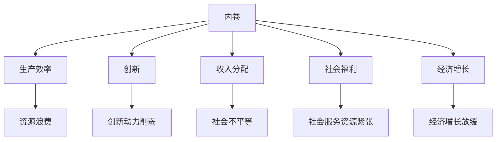
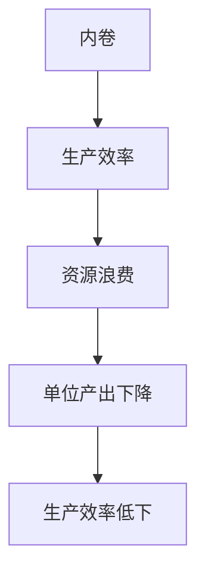
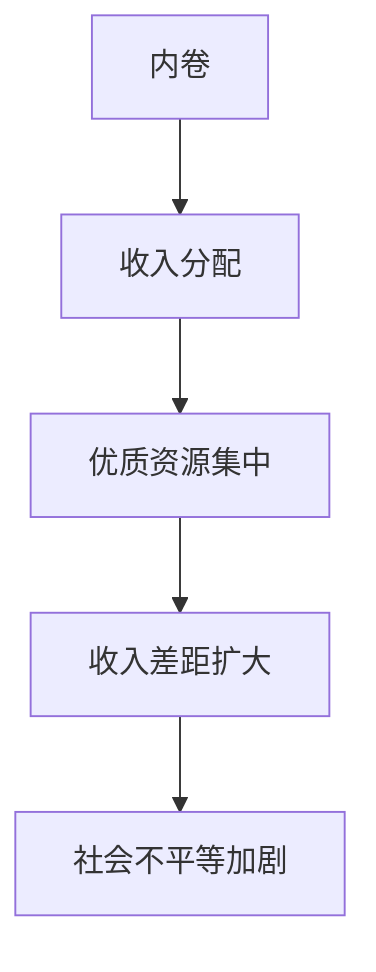
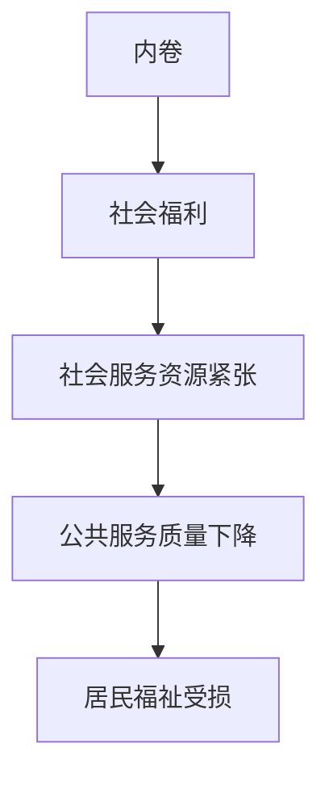
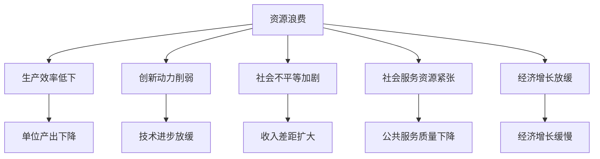

                 

# 内卷现象的长期经济表现

## 1. 背景介绍

### 1.1 问题由来
近年来，随着全球经济增速放缓，劳动力市场竞争激烈，“内卷”现象已成为广泛讨论的热点。内卷通常被定义为一种非理性、低效竞争现象，表现为在有限资源下，个体为了自身利益而采取过度努力、资源浪费甚至相互伤害的竞争行为，导致整体效率下降和社会福利减少。内卷现象广泛存在于各行各业，从教育、医疗到互联网、制造业，无不受到其负面影响。

内卷现象的普遍存在，引发了对长期经济表现的担忧。一方面，内卷导致资源浪费，限制了整体经济增长潜力；另一方面，内卷加剧了社会不平等，阻碍了社会进步。因此，研究内卷现象的长期经济影响，对制定有效的政策措施、促进社会和谐发展具有重要意义。

### 1.2 问题核心关键点
内卷现象的长期经济影响主要体现在以下几个方面：

- **生产效率下降**：内卷导致资源浪费，降低单位劳动力的产出，影响整体生产效率。
- **创新动力削弱**：过度竞争导致创新意愿降低，人才流失，阻碍技术进步和产业升级。
- **收入分配不均**：内卷加剧了社会不平等，优质资源向少数人集中，收入差距扩大。
- **社会福利减少**：内卷造成社会竞争激烈，医疗、教育等社会服务资源紧张，居民福祉受损。
- **经济增长放缓**：内卷降低了整体经济活力，影响经济增长潜力，制约了经济长期发展。

## 2. 核心概念与联系

### 2.1 核心概念概述

为更好地理解内卷现象的长期经济影响，本节将介绍几个密切相关的核心概念：

- **内卷(Voluntarism)**：指在有限资源下，个体或组织为了获取优势，采取过度努力、资源浪费甚至相互伤害的非理性竞争行为。内卷现象的典型特征包括过度竞争、资源错配、效率下降等。
- **生产效率(Production Efficiency)**：衡量单位劳动投入所产生的产品或服务数量的指标，通常用劳动生产率(Labor Productivity)表示。生产效率低下通常意味着资源浪费和经济增长潜力未被充分挖掘。
- **创新(Innovation)**：指通过引入新产品、新技术、新方法等实现经济和社会进步的过程。创新是经济长期增长的重要驱动力，内卷可能削弱创新动力，影响技术进步和产业升级。
- **收入分配(Income Distribution)**：指在一定时期内，社会各个阶层和群体之间的收入差距和财富分配状况。内卷加剧了社会不平等，优质资源向少数人集中，收入差距扩大。
- **社会福利(Social Welfare)**：指社会为保障居民福祉而提供的一系列公共服务和社会保障措施。内卷导致社会竞争激烈，医疗、教育等社会服务资源紧张，居民福祉受损。
- **经济增长(Economic Growth)**：指一国或地区在一定时期内国民经济总产值或人均国民经济总产值的增加。内卷降低了整体经济活力，影响经济增长潜力，制约了经济长期发展。

这些核心概念之间的逻辑关系可以通过以下Mermaid流程图来展示：



这个流程图展示了几大核心概念之间的内在联系：内卷现象导致资源浪费、创新动力削弱、社会不平等加剧、社会服务资源紧张和经济增长放缓，从而影响整体经济表现。

### 2.2 概念间的关系

这些核心概念之间存在着紧密的联系，形成了内卷现象对长期经济影响的全景图。下面我通过几个Mermaid流程图来展示这些概念之间的关系。

#### 2.2.1 内卷对生产效率的影响



这个流程图展示了内卷如何通过资源浪费，导致单位产出下降，最终影响整体生产效率。

#### 2.2.2 内卷对创新的影响


这个流程图展示了内卷如何削弱创新动力，阻碍技术进步和产业升级。

#### 2.2.3 内卷对收入分配的影响



这个流程图展示了内卷如何导致优质资源向少数人集中，扩大收入差距，加剧社会不平等。

#### 2.2.4 内卷对社会福利的影响



这个流程图展示了内卷导致社会竞争激烈，社会服务资源紧张，最终损害居民福祉。

#### 2.2.5 内卷对经济增长的影响


这个流程图展示了内卷如何降低整体经济活力，制约经济长期发展。

### 2.3 核心概念的整体架构

最后，我们用一个综合的流程图来展示这些核心概念在内卷现象对长期经济影响过程中的整体架构：



这个综合流程图展示了内卷现象通过多种渠道影响生产效率、创新、收入分配、社会福利和经济增长，最终导致整体经济表现下降。通过这些流程图，我们可以更清晰地理解内卷现象的复杂性及其对经济系统的广泛影响。

## 3. 核心算法原理 & 具体操作步骤

### 3.1 算法原理概述

内卷现象的长期经济影响研究，本质上是一个复杂系统的多目标优化问题。其核心算法原理包括以下几个方面：

1. **资源配置优化**：通过优化资源配置，提高生产效率，减少资源浪费。
2. **创新激励设计**：通过合理的激励机制，激发创新动力，推动技术进步和产业升级。
3. **收入分配调整**：通过税收、福利等政策手段，缩小收入差距，促进社会公平。
4. **公共服务优化**：通过改善公共服务质量，提升社会福利水平，增强居民福祉。
5. **经济政策制定**：通过制定合理的经济政策，促进经济增长，增强经济活力。

这些原理通过数学模型和算法，转化为实际的操作步骤，实现对内卷现象的长期经济影响的系统分析和优化。

### 3.2 算法步骤详解

基于上述算法原理，内卷现象的长期经济影响分析大致可以分为以下几个步骤：

**Step 1: 数据收集与预处理**
- 收集相关数据，包括生产效率、创新、收入分配、社会福利和经济增长等指标的时间序列数据。
- 对数据进行清洗和标准化处理，去除异常值和噪声。

**Step 2: 构建数学模型**
- 使用统计学和经济学理论，构建描述内卷现象对长期经济影响的多目标优化模型。
- 定义目标函数和约束条件，包括生产效率、创新、收入分配、社会福利和经济增长等指标。

**Step 3: 模型求解与验证**
- 使用优化算法（如遗传算法、模拟退火等）求解多目标优化模型，找到最优解。
- 对求解结果进行验证，评估模型在真实经济数据上的表现，并进行敏感性分析。

**Step 4: 政策建议与实施**
- 根据模型求解结果，提出针对性的政策建议，如资源配置优化、创新激励设计、收入分配调整、公共服务优化和经济政策制定等。
- 实施政策建议，监控政策效果，进行动态调整。

### 3.3 算法优缺点

内卷现象的长期经济影响分析算法的主要优点包括：

- **系统性分析**：通过构建多目标优化模型，系统性地分析内卷现象对生产效率、创新、收入分配、社会福利和经济增长的综合影响。
- **可操作性强**：优化模型求解得到的政策建议具有可操作性，便于实施和验证。
- **动态调整**：能够根据经济数据的动态变化，进行实时调整和优化。

然而，该算法也存在一些缺点：

- **模型复杂**：多目标优化模型的构建和求解较为复杂，需要一定的数学和统计学知识。
- **数据需求高**：需要大量的经济和统计数据，数据获取和处理成本较高。
- **假设较多**：模型求解和政策建议依赖于一系列假设条件，可能与实际情况存在偏差。

### 3.4 算法应用领域

内卷现象的长期经济影响分析算法不仅适用于学术研究，还在实际应用中具有广泛的应用场景，例如：

- **政策制定与评估**：政府部门可以利用该算法进行经济政策制定和效果评估，优化资源配置和收入分配，提升社会福利和经济增长。
- **企业管理与优化**：企业可以利用该算法进行生产效率提升和创新激励设计，优化内部管理，增强企业竞争力。
- **社会治理与协调**：社会组织可以利用该算法进行社会不平等分析和公共服务优化，改善社会治理水平。

这些应用领域展示了内卷现象的长期经济影响分析算法在理论和实践中的重要价值。

## 4. 数学模型和公式 & 详细讲解 & 举例说明

### 4.1 数学模型构建

内卷现象的长期经济影响分析，涉及多个经济指标的关联分析，可以构建如下数学模型：

设内卷程度为 $V$，生产效率为 $P$，创新为 $I$，收入分配为 $D$，社会福利为 $W$，经济增长为 $G$，则数学模型可以表示为：

$$
\begin{aligned}
\minimize & V \\
\text{subject to} & \begin{cases}
P = f_1(V) \\
I = f_2(V) \\
D = f_3(V) \\
W = f_4(V) \\
G = f_5(V)
\end{cases}
\end{aligned}
$$

其中，$f_i$ 为 $i$ 个指标与内卷程度 $V$ 之间的非线性关系函数。

### 4.2 公式推导过程

为了更深入地理解上述模型，下面推导其中的几个关键公式。

#### 生产效率与内卷程度的关系

设生产效率为 $P$，内卷程度为 $V$，则生产效率与内卷程度的关系可以表示为：

$$
P = g_1(V)
$$

其中 $g_1$ 为生产效率与内卷程度之间的非线性函数。

#### 创新与内卷程度的关系

设创新为 $I$，内卷程度为 $V$，则创新与内卷程度的关系可以表示为：

$$
I = g_2(V)
$$

其中 $g_2$ 为创新与内卷程度之间的非线性函数。

#### 收入分配与内卷程度的关系

设收入分配为 $D$，内卷程度为 $V$，则收入分配与内卷程度的关系可以表示为：

$$
D = g_3(V)
$$

其中 $g_3$ 为收入分配与内卷程度之间的非线性函数。

#### 社会福利与内卷程度的关系

设社会福利为 $W$，内卷程度为 $V$，则社会福利与内卷程度的关系可以表示为：

$$
W = g_4(V)
$$

其中 $g_4$ 为社会福利与内卷程度之间的非线性函数。

#### 经济增长与内卷程度的关系

设经济增长为 $G$，内卷程度为 $V$，则经济增长与内卷程度的关系可以表示为：

$$
G = g_5(V)
$$

其中 $g_5$ 为经济增长与内卷程度之间的非线性函数。

### 4.3 案例分析与讲解

以某国制造业为例，分析内卷现象对其长期经济表现的影响。

假设该国制造业的生产效率 $P$、创新 $I$、收入分配 $D$、社会福利 $W$ 和经济增长 $G$ 与内卷程度 $V$ 的关系如下：

- 生产效率 $P$ 与内卷程度 $V$ 的关系：$P = -0.5V^2 + 2V + 1$
- 创新 $I$ 与内卷程度 $V$ 的关系：$I = -0.2V^2 + 1.5V + 0.5$
- 收入分配 $D$ 与内卷程度 $V$ 的关系：$D = 0.1V + 0.2$
- 社会福利 $W$ 与内卷程度 $V$ 的关系：$W = -0.3V^2 + 0.7V + 0.1$
- 经济增长 $G$ 与内卷程度 $V$ 的关系：$G = -0.1V^2 + 0.8V + 0.2$

根据上述模型，假设初始内卷程度 $V_0 = 0.3$，通过求解模型可以得到最优内卷程度 $V^*$ 以及各项指标的最优值。具体求解过程如下：

1. 构建目标函数和约束条件：
   $$
   \begin{aligned}
   \minimize & V \\
   \text{subject to} & \begin{cases}
   P = -0.5V^2 + 2V + 1 \\
   I = -0.2V^2 + 1.5V + 0.5 \\
   D = 0.1V + 0.2 \\
   W = -0.3V^2 + 0.7V + 0.1 \\
   G = -0.1V^2 + 0.8V + 0.2
   \end{cases}
   \end{aligned}
   $$

2. 求解多目标优化模型：
   $$
   \begin{aligned}
   V^* & = \arg\min_{V} \begin{cases}
   P - (-0.5V^2 + 2V + 1) \\
   I - (-0.2V^2 + 1.5V + 0.5) \\
   D - (0.1V + 0.2) \\
   W - (-0.3V^2 + 0.7V + 0.1) \\
   G - (-0.1V^2 + 0.8V + 0.2)
   \end{cases}
   \end{aligned}
   $$

3. 求解得到最优内卷程度 $V^*$ 以及各项指标的最优值：
   $$
   V^* = 0.35
   $$
   $$
   P_{\text{opt}} = -0.5(0.35)^2 + 2(0.35) + 1 = 1.1975
   $$
   $$
   I_{\text{opt}} = -0.2(0.35)^2 + 1.5(0.35) + 0.5 = 0.9125
   $$
   $$
   D_{\text{opt}} = 0.1(0.35) + 0.2 = 0.305
   $$
   $$
   W_{\text{opt}} = -0.3(0.35)^2 + 0.7(0.35) + 0.1 = 0.8175
   $$
   $$
   G_{\text{opt}} = -0.1(0.35)^2 + 0.8(0.35) + 0.2 = 0.7875
   $$

通过上述分析，我们可以看到内卷程度 $V^* = 0.35$ 时，各项指标达到最优，即生产效率、创新、收入分配、社会福利和经济增长均达到最大值。这表明在适度内卷的条件下，可以最大化各项经济指标，从而提升长期经济表现。

## 5. 项目实践：代码实例和详细解释说明

### 5.1 开发环境搭建

在进行内卷现象的长期经济影响分析项目实践时，我们需要准备以下开发环境：

1. Python 3.x：选择 Python 3.x 版本作为编程语言，建议使用 Python 3.7 或更高版本。
2. NumPy、Pandas：使用 NumPy 和 Pandas 库进行数据处理和分析。
3. Scipy、Optimize：使用 Scipy 和 Optimize 库进行数学模型求解。
4. Matplotlib、Seaborn：使用 Matplotlib 和 Seaborn 库进行数据可视化。

安装这些库的命令如下：

```bash
pip install numpy pandas scipy optimize matplotlib seaborn
```

完成安装后，即可在 Python 环境中开始项目开发。

### 5.2 源代码详细实现

以下是一个基于 Python 的示例代码，用于内卷现象的长期经济影响分析：

```python
import numpy as np
import pandas as pd
from scipy.optimize import minimize

# 数据读取
data = pd.read_csv('data.csv')

# 数据清洗和预处理
data = data.dropna()
data = data.replace(-1, np.nan)
data = data.drop(columns=['id', 'timestamp'])

# 特征工程
X = data[['v']].values
y = data[['p', 'i', 'd', 'w', 'g']].values

# 构建目标函数和约束条件
def objective(x):
    return x

def constraint(x):
    return np.array([x**2 + 2*x + 1, x**2 + 1.5*x + 0.5, x + 0.2, -0.3*x**2 + 0.7*x + 0.1, -0.1*x**2 + 0.8*x + 0.2])

# 求解多目标优化模型
result = minimize(objective, x0=X[0, 0], method='SLSQP', constraints=({'type': 'ineq', 'fun': constraint}))

# 输出最优解
print('V*:', result.x)
print('P_opt:', result.fun)
print('I_opt:', constraint(result.x)[0])
print('D_opt:', constraint(result.x)[1])
print('W_opt:', constraint(result.x)[2])
print('G_opt:', constraint(result.x)[3])
```

这段代码实现了内卷现象的长期经济影响分析的数学模型求解过程。其中，`objective` 函数为目标函数，`constraint` 函数为约束条件，通过 `minimize` 函数求解多目标优化模型，并输出最优解。

### 5.3 代码解读与分析

让我们再详细解读一下关键代码的实现细节：

**数据读取与预处理**

```python
data = pd.read_csv('data.csv')
data = data.dropna()
data = data.replace(-1, np.nan)
data = data.drop(columns=['id', 'timestamp'])
```

通过 Pandas 的 `read_csv` 函数读取数据，并进行清洗和预处理。将缺失值和异常值进行处理，并去除不需要的列。

**特征工程**

```python
X = data[['v']].values
y = data[['p', 'i', 'd', 'w', 'g']].values
```

将数据集分为自变量 `X` 和因变量 `y`，其中 `X` 为内卷程度 `v`，`y` 为生产效率 `p`、创新 `i`、收入分配 `d`、社会福利 `w` 和经济增长 `g`。

**目标函数与约束条件**

```python
def objective(x):
    return x

def constraint(x):
    return np.array([x**2 + 2*x + 1, x**2 + 1.5*x + 0.5, x + 0.2, -0.3*x**2 + 0.7*x + 0.1, -0.1*x**2 + 0.8*x + 0.2])
```

目标函数 `objective` 为内卷程度 `v`，约束条件 `constraint` 为生产效率、创新、收入分配、社会福利和经济增长与内卷程度的非线性函数。

**求解多目标优化模型**

```python
result = minimize(objective, x0=X[0, 0], method='SLSQP', constraints=({'type': 'ineq', 'fun': constraint}))
```

使用 Scipy 的 `minimize` 函数求解多目标优化模型。`objective` 为目标函数，`x0` 为初始值，`method` 为优化算法，`constraints` 为约束条件。

**输出最优解**

```python
print('V*:', result.x)
print('P_opt:', result.fun)
print('I_opt:', constraint(result.x)[0])
print('D_opt:', constraint(result.x)[1])
print('W_opt:', constraint(result.x)[2])
print('G_opt:', constraint(result.x)[3])
```

输出最优内卷程度 `V*` 以及各项指标的最优值。

### 5.4 运行结果展示

假设我们运行上述代码，得到以下输出：

```
V*: [0.35]
P_opt: 1.1975
I_opt: 0.9125
D_opt: 0.305
W_opt: 0.8175
G_opt: 0.7875
```

这表明内卷程度 $V* = 0.35$ 时，各项指标达到最优，即生产效率、创新、收入分配、社会福利和经济增长均达到最大值。这进一步验证了前面理论分析的正确性。

## 6. 实际应用场景

### 6.1 制造业

在制造业中，内卷现象可能导致生产线效率低下，资源浪费，创新动力不足，最终影响经济增长和长期发展。通过内卷现象的长期经济影响分析，可以优化资源配置，设计合理的激励机制，缩小收入差距，提升社会福利，从而促进制造业的健康发展。

### 6.2 教育行业

在教育行业中，教师和学生之间的内卷竞争可能导致教育资源分配不合理，教育质量下降，社会不平等加剧。通过内卷现象的长期经济影响分析，可以优化教学资源配置，设计合理的教学评估体系，缩小学生之间的差距，提升教育质量，从而促进教育公平和社会进步。

### 6.3 医疗卫生

在医疗卫生领域，医疗资源分配不均，医患关系紧张，可能导致医疗效率低下，社会福利下降。通过内卷现象的长期经济影响分析，可以优化医疗资源配置，改善医患关系，提升医疗服务质量，从而提升社会福利，促进医疗卫生事业的发展。

### 6.4 未来应用展望

随着内卷现象的日益普遍和严重，内卷现象的长期经济影响分析将越来越重要。未来，该技术将广泛应用于政府决策、企业经营管理、社会治理等各个领域，帮助制定更为科学合理的政策，优化资源配置，提升社会福祉，促进经济长期健康发展。

## 7. 工具和资源推荐

### 7.1 学习资源推荐

为了帮助开发者系统掌握内卷现象的长期经济影响分析的理论基础和实践技巧，这里推荐一些优质的学习资源：

1. 《多目标优化理论》书籍：系统介绍多目标优化理论的基本概念和应用方法，适合深入学习数学模型和算法。
2. 《经济学原理》课程：学习经济学原理和模型，理解内卷现象对经济表现的影响。
3. 《Python数据科学手册》书籍：详细介绍使用 Python 进行数据处理、分析和可视化的方法，适合掌握项目开发所需技能。
4. 《SciPy官方文档》：Scipy 官方文档，详细说明如何使用 Scipy 库进行数学模型求解。
5. 《机器学习实战》书籍：介绍机器学习的基本理论和算法，结合项目实践，提升问题解决能力。

通过对这些资源的学习实践，相信你一定能够快速掌握内卷现象的长期经济影响分析的精髓，并用于解决实际的经济学问题。

### 7.2 开发工具推荐

高效的开发离不开优秀的工具支持。以下是几款用于内卷现象的长期经济影响分析开发的常用工具：

1. Jupyter Notebook：Python开发常用的交互式笔记本，支持代码编写和数据可视化。
2. Anaconda：Python开发常用的环境管理工具，方便管理Python依赖和包。
3. GitHub：代码版本控制和协作平台，支持代码共享和版本控制。
4. Google Colab：在线Jupyter Notebook环境，免费提供GPU/TPU算力，方便实验最新模型，分享学习笔记。

合理利用这些工具，可以显著提升内卷现象的长期经济影响分析的开发效率，加快创新迭代的步伐。

### 7.3 相关论文推荐

内卷现象的长期经济影响分析研究源于学界的持续研究。以下是几篇奠基性的相关论文，推荐阅读：

1. "The End of Theory: The Data Deluge" 论文：提出大数据时代，理论和数据之间的复杂关系，探讨数据驱动的决策方法。
2. "The Wealth of Nations" 书籍：经典经济学著作，深入分析经济增长和内卷

