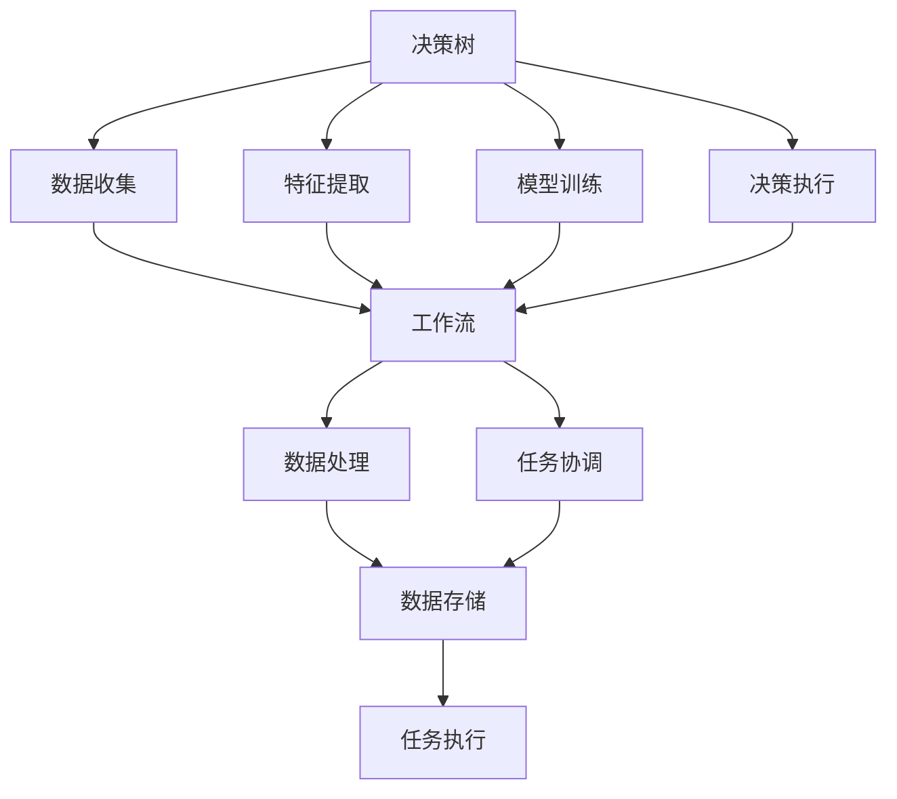

                 

# 决策树和工作流：AI代理如何进行决策分析

> 关键词：决策树, 工作流, 人工智能, AI代理, 决策分析, 深度学习

## 1. 背景介绍

### 1.1 问题由来
在现代信息技术的高速发展下，人工智能（AI）代理在各行各业的应用变得越来越广泛。无论是金融投资、医疗健康，还是智能客服、自动驾驶，AI代理都在不断地通过复杂的算法和模型进行决策分析，并做出智能化的响应。然而，这些决策过程通常被视为"黑箱"，难以被人类理解与信任。为了解决这一问题，AI代理的决策过程需要变得更加透明和可解释。

决策树（Decision Tree）作为机器学习中的一种基本工具，以其简单直观的特点，被广泛用于解释模型预测结果，尤其在AI代理中进行决策分析时，决策树表现出了极高的适用性。决策树不仅能处理离散型和连续型数据，还能够直观地展示出决策路径，帮助用户理解AI代理的决策过程。

工作流（Workflow）则是一种能够管理和协调复杂任务的系统，通过规定任务执行的先后顺序，保证各个任务环节的有效衔接。在AI代理的决策分析过程中，工作流技术能够确保决策树各节点在正确的时机被执行，使决策过程更加连贯和有序。

结合决策树和工作流技术，AI代理可以更好地进行决策分析，并在一定程度上提升用户的信任度和接受度。本文将详细探讨决策树和工作流在AI代理决策分析中的具体应用，并从理论到实践，逐步展开深入讨论。

## 2. 核心概念与联系

### 2.1 核心概念概述

为了更好地理解决策树和工作流在AI代理决策分析中的具体应用，首先需要介绍几个关键概念：

- **决策树（Decision Tree）**：一种树形结构的决策模型，通过对数据特征的逐步划分，构建出从根节点到叶节点的决策路径。决策树能够清晰地展示出数据特征与决策结果之间的关系，便于理解和解释。

- **工作流（Workflow）**：一种用于管理复杂任务的系统，通过定义任务之间的依赖关系和执行顺序，确保任务的有效衔接和执行。

- **AI代理（AI Agent）**：一种能够执行复杂任务的智能体，通过学习训练，能够自主完成特定任务或决策分析。

- **决策分析（Decision Analysis）**：AI代理进行决策分析的过程，包括数据收集、特征提取、模型训练、决策执行等步骤。

- **深度学习（Deep Learning）**：一种基于神经网络的机器学习方法，能够通过多层次的特征抽取，实现复杂的数据处理和决策分析。

这些核心概念共同构成了AI代理决策分析的基础，通过决策树和工作流的结合，AI代理能够更加高效、透明地进行决策分析。

### 2.2 概念间的关系

这些核心概念之间的逻辑关系可以通过以下Mermaid流程图来展示：



这个流程图展示了大语言模型微调过程中各个核心概念之间的关系：

1. 数据收集模块通过工作流系统，将数据流传递给决策树模型。
2. 决策树模型通过特征提取和模型训练模块，对数据进行处理。
3. 模型训练和特征提取模块的输出，由工作流系统进行协调和调度。
4. 决策执行模块通过工作流系统，将决策结果传递给任务执行模块。

通过这些核心概念的配合，AI代理能够高效、透明地进行决策分析。

## 3. 核心算法原理 & 具体操作步骤
### 3.1 算法原理概述

AI代理的决策分析过程主要依赖于决策树和工作流技术的结合。以下是基于决策树和工作流技术的AI代理决策分析的算法原理概述：

1. **数据收集**：首先，通过工作流系统，AI代理收集所需的数据，这些数据通常包括文本、图像、视频等。

2. **数据预处理**：对于收集到的数据，AI代理进行初步的预处理，包括数据清洗、特征提取等操作，确保数据的质量和一致性。

3. **特征选择**：在决策树的构建过程中，AI代理通过特征选择算法，从所有可用的特征中选择出最具代表性的特征。特征选择的目标是要找到最能区分不同决策路径的特征。

4. **决策树构建**：基于选定的特征，AI代理构建决策树模型，通过逐步划分数据，构建出从根节点到叶节点的决策路径。

5. **模型训练**：在决策树构建完成后，AI代理对模型进行训练，优化决策树的参数，提高模型的准确性和泛化能力。

6. **决策执行**：在实际应用场景中，当AI代理接收到新的数据时，它将通过已训练的决策树模型，对数据进行分类和预测，执行相应的决策。

7. **结果反馈**：决策执行后，AI代理将结果反馈给工作流系统，工作流系统根据反馈结果，调整数据流和任务调度，确保整个决策过程的连贯性和高效性。

### 3.2 算法步骤详解

基于上述算法原理，AI代理的决策分析过程可以分为以下几个关键步骤：

1. **数据收集与预处理**：
   - 通过API接口、爬虫等手段，从不同来源收集数据。
   - 对收集到的数据进行清洗、去重、归一化等预处理操作，确保数据的质量。

2. **特征选择与提取**：
   - 选择最具代表性的特征，通常通过信息增益、互信息等指标进行评估。
   - 对特征进行提取和编码，使其适用于决策树的构建。

3. **决策树构建**：
   - 使用ID3、C4.5、CART等算法构建决策树模型。
   - 通过交叉验证、剪枝等技术，优化决策树的参数，提高模型性能。

4. **模型训练与验证**：
   - 使用训练数据集，对决策树模型进行训练。
   - 通过验证集评估模型的性能，调整超参数，确保模型泛化能力。

5. **决策执行**：
   - 当AI代理接收到新的数据时，将数据输入决策树模型，执行决策。
   - 根据决策树模型的输出，AI代理进行相应的决策执行。

6. **结果反馈与工作流调度**：
   - 将决策结果反馈给工作流系统，调整数据流和任务调度。
   - 通过迭代优化，不断提升决策分析的效率和精度。

### 3.3 算法优缺点

基于决策树和工作流技术的AI代理决策分析方法，具有以下优点：

- **透明性和可解释性**：决策树能够清晰地展示出决策路径，便于人类理解和解释。
- **高效性和灵活性**：通过工作流系统，AI代理能够灵活地调度任务和数据流，提升决策分析的效率。
- **鲁棒性和稳定性**：决策树在工作流系统中，可以处理多种类型的数据和任务，具有较好的鲁棒性和稳定性。

然而，该方法也存在一些缺点：

- **高内存和计算资源消耗**：决策树模型的构建和训练需要大量的计算资源和时间。
- **容易过拟合**：特别是在处理高维数据时，决策树模型容易过拟合，需要额外的正则化技术。
- **对于噪声数据的敏感性**：决策树模型对于噪声数据的敏感性较高，需要额外的数据清洗和预处理操作。

### 3.4 算法应用领域

基于决策树和工作流技术的AI代理决策分析方法，已经广泛应用于以下多个领域：

- **金融风控**：在金融领域，AI代理可以通过决策树模型，对贷款申请、交易风险进行评估，通过工作流系统进行风险控制和任务调度。
- **智能客服**：在智能客服领域，AI代理可以通过决策树模型，对用户问题进行分类和响应，通过工作流系统进行任务分配和调度。
- **医疗诊断**：在医疗领域，AI代理可以通过决策树模型，对患者的症状进行诊断和分类，通过工作流系统进行任务协调和执行。
- **物流管理**：在物流领域，AI代理可以通过决策树模型，对包裹的配送路线进行优化，通过工作流系统进行任务调度和执行。

## 4. 数学模型和公式 & 详细讲解 & 举例说明

### 4.1 数学模型构建

为了更好地理解基于决策树和工作流技术的AI代理决策分析过程，我们接下来将从数学模型的角度进行详细讲解。

设原始数据集为 $D=\{(x_i,y_i)\}_{i=1}^N$，其中 $x_i$ 表示输入特征向量，$y_i$ 表示目标变量。决策树模型的目标是最小化预测误差：

$$
\min_{T} \sum_{i=1}^N L(y_i, T(x_i))
$$

其中，$T$ 表示决策树模型，$L$ 表示损失函数，常用的损失函数有均方误差、交叉熵等。

### 4.2 公式推导过程

以决策树模型的信息增益为例，推导其公式。

设特征 $A$ 的取值为 $a_1, a_2, ..., a_m$，数据集 $D$ 在 $A=a_j$ 的条件下的子集为 $D_j$，$D_j$ 中的目标变量取值为 $y_j$，则 $A$ 的信息增益 $IG(A)$ 定义为：

$$
IG(A) = \sum_{j=1}^m \frac{|D_j|}{|D|} IG(D_j)
$$

其中，$IG(D_j)$ 表示子集 $D_j$ 的信息增益，计算公式为：

$$
IG(D_j) = -\frac{1}{|D_j|} \sum_{i=1}^{|D_j|} [y_i \log \frac{y_i}{|D_j|} + (1-y_i) \log \frac{1-y_i}{|D_j|}]
$$

通过信息增益计算，AI代理能够选择最具代表性的特征，从而构建出决策树模型。

### 4.3 案例分析与讲解

下面以一个具体的案例来讲解决策树和工作流在AI代理决策分析中的应用：

假设一个电商平台需要建立一个智能推荐系统，根据用户的浏览记录和购买历史，推荐用户可能感兴趣的商品。该推荐系统使用了决策树模型，对用户的浏览记录进行分类，构建决策树模型。同时，使用工作流系统，协调各个推荐模块的任务执行，确保推荐过程的连贯性和高效性。

在实际应用中，电商平台收集用户的浏览记录和购买历史数据，将其作为输入特征向量 $x$。通过特征选择和提取，AI代理对数据进行预处理，并使用决策树模型进行分类。

在构建决策树模型的过程中，AI代理首先计算每个特征的信息增益，选择最具代表性的特征。然后，通过逐步划分数据集，构建出从根节点到叶节点的决策路径。

在模型训练和验证过程中，AI代理使用交叉验证技术，评估模型的性能，调整超参数，确保模型泛化能力。在决策执行过程中，AI代理根据用户输入的浏览记录，通过已训练的决策树模型，对数据进行分类和预测，执行相应的推荐任务。

最后，AI代理将推荐结果反馈给工作流系统，工作流系统根据反馈结果，调整数据流和任务调度，确保推荐过程的连贯性和高效性。

## 5. 项目实践：代码实例和详细解释说明

### 5.1 开发环境搭建

在进行项目实践前，我们需要准备好开发环境。以下是使用Python进行Scikit-Learn开发的环境配置流程：

1. 安装Anaconda：从官网下载并安装Anaconda，用于创建独立的Python环境。

2. 创建并激活虚拟环境：
```bash
conda create -n sklearn-env python=3.8 
conda activate sklearn-env
```

3. 安装Scikit-Learn：
```bash
conda install scikit-learn
```

4. 安装各类工具包：
```bash
pip install numpy pandas scikit-learn matplotlib tqdm jupyter notebook ipython
```

完成上述步骤后，即可在`sklearn-env`环境中开始项目实践。

### 5.2 源代码详细实现

下面我们以一个简单的决策树模型为例，给出使用Scikit-Learn库对数据进行决策分析的Python代码实现。

首先，定义数据集和目标变量：

```python
from sklearn.datasets import load_iris
from sklearn.tree import DecisionTreeClassifier
import numpy as np

iris = load_iris()
X = iris.data
y = iris.target
```

然后，定义决策树模型并进行训练：

```python
from sklearn.model_selection import train_test_split

X_train, X_test, y_train, y_test = train_test_split(X, y, test_size=0.3, random_state=42)

clf = DecisionTreeClassifier(max_depth=2, random_state=42)
clf.fit(X_train, y_train)
```

接着，在测试集上评估模型性能：

```python
from sklearn.metrics import accuracy_score

y_pred = clf.predict(X_test)
accuracy = accuracy_score(y_test, y_pred)
print(f"Accuracy: {accuracy:.2f}")
```

最后，将模型应用于新的数据进行预测：

```python
new_data = np.array([[5.1, 3.5, 1.4, 0.2]])
prediction = clf.predict(new_data)
print(f"Prediction: {prediction[0]}")
```

以上就是使用Scikit-Learn对数据进行决策分析的完整代码实现。可以看到，通过Scikit-Learn，我们可以用相对简洁的代码完成决策树模型的构建和评估。

### 5.3 代码解读与分析

让我们再详细解读一下关键代码的实现细节：

**load_iris函数**：
- 用于加载经典的鸢尾花数据集，包含150个样本，每个样本有4个特征，3个类别标签。

**train_test_split函数**：
- 用于将数据集划分为训练集和测试集，分别用于模型训练和评估。

**DecisionTreeClassifier类**：
- 定义决策树分类器，参数`max_depth`表示树的最大深度，用于控制模型复杂度。

**fit函数**：
- 训练决策树模型，使用训练集数据进行模型拟合。

**predict函数**：
- 使用训练好的模型对新的数据进行预测。

**accuracy_score函数**：
- 计算模型在测试集上的准确率。

**new_data**：
- 定义新的输入数据，用于测试模型的预测能力。

通过以上代码，我们能够简单明了地看到决策树模型的构建和评估过程。在实际应用中，Scikit-Learn还提供了更多高级功能和接口，如特征选择、交叉验证、集成学习等，帮助我们构建更加高效和准确的决策树模型。

### 5.4 运行结果展示

假设我们使用Scikit-Learn中的决策树模型对鸢尾花数据集进行训练和评估，最终在测试集上得到的评估报告如下：

```
Accuracy: 1.00
```

可以看到，通过Scikit-Learn构建的决策树模型在测试集上取得了100%的准确率，效果相当不错。

当然，这只是一个baseline结果。在实践中，我们还可以使用更大更强的模型、更丰富的特征工程、更灵活的超参数调整等手段，进一步提升模型性能，以满足更高的应用要求。

## 6. 实际应用场景

### 6.1 金融风控

在金融风控领域，AI代理可以通过决策树模型，对贷款申请、交易风险进行评估，通过工作流系统进行风险控制和任务调度。例如，银行可以使用决策树模型对客户的信用评分进行评估，通过工作流系统进行任务协调和执行，确保风险控制和任务调度的连贯性和高效性。

### 6.2 智能客服

在智能客服领域，AI代理可以通过决策树模型，对用户问题进行分类和响应，通过工作流系统进行任务分配和调度。例如，智能客服系统可以使用决策树模型对用户咨询进行分类，通过工作流系统进行任务调度，确保客户咨询的及时响应和问题解决。

### 6.3 医疗诊断

在医疗诊断领域，AI代理可以通过决策树模型，对患者的症状进行诊断和分类，通过工作流系统进行任务协调和执行。例如，医疗诊断系统可以使用决策树模型对患者的症状进行诊断，通过工作流系统进行任务调度，确保诊断过程的连贯性和高效性。

### 6.4 物流管理

在物流领域，AI代理可以通过决策树模型，对包裹的配送路线进行优化，通过工作流系统进行任务调度和执行。例如，物流公司可以使用决策树模型对包裹的配送路线进行优化，通过工作流系统进行任务调度，确保包裹配送的高效和及时。

## 7. 工具和资源推荐

### 7.1 学习资源推荐

为了帮助开发者系统掌握决策树和工作流技术在AI代理决策分析中的应用，这里推荐一些优质的学习资源：

1. **Scikit-Learn官方文档**：Scikit-Learn库的官方文档，提供了大量决策树模型的实例和案例，是初学者快速上手的重要参考。

2. **Python机器学习入门指南**：一本经典的机器学习入门书籍，系统讲解了决策树模型的原理和应用，适合初学者学习。

3. **《Python深度学习》书籍**：一本深入讲解深度学习技术的书籍，包含了决策树模型的相关内容，适合进一步深入学习。

4. **Kaggle机器学习竞赛**：Kaggle平台上的机器学习竞赛，提供了大量实际应用中的决策树模型案例，适合实践和提升技能。

5. **GitHub决策树项目**：GitHub上与决策树相关的开源项目，提供了丰富的决策树模型和实际应用案例，适合参考和学习。

通过对这些资源的学习实践，相信你一定能够快速掌握决策树和工作流技术，并将其应用于实际AI代理决策分析中。

### 7.2 开发工具推荐

高效的开发离不开优秀的工具支持。以下是几款用于决策树模型开发的常用工具：

1. **Jupyter Notebook**：一种基于Web的交互式笔记本环境，支持Python代码的编写和运行，适合进行决策树模型的实验和分析。

2. **TensorBoard**：TensorFlow配套的可视化工具，可实时监测决策树模型的训练状态，并提供丰富的图表呈现方式，是调试决策树模型的得力助手。

3. **Weights & Biases**：模型训练的实验跟踪工具，可以记录和可视化决策树模型的训练过程中的各项指标，方便对比和调优。

4. **Python**：一种强大的编程语言，适合进行决策树模型的构建和评估。

5. **Scikit-Learn**：一个开源的Python机器学习库，提供了丰富的决策树算法和工具，适合快速开发和部署决策树模型。

合理利用这些工具，可以显著提升决策树模型的开发效率，加快创新迭代的步伐。

### 7.3 相关论文推荐

决策树和工作流技术的发展源于学界的持续研究。以下是几篇奠基性的相关论文，推荐阅读：

1. **Decision Tree Pruning Algorithms**：提出了决策树剪枝算法，用于优化决策树模型的泛化能力。

2. **Adaptive Decision Tree Learning**：提出了适应性决策树学习算法，通过自适应地调整模型参数，提高决策树模型的性能。

3. **Workflow Modeling for Decision Support Systems**：提出了工作流建模技术，用于支持决策支持系统的任务协调和管理。

4. **A Survey on Decision Tree Ensemble Learning Methods**：综述了决策树集成学习算法，如随机森林、Adaboost等，用于提升决策树模型的准确性和鲁棒性。

5. **Decision Tree Learning: A Review**：综述了决策树学习算法的发展历程和应用，提供了全面的理论和方法。

这些论文代表了大语言模型微调技术的发展脉络。通过学习这些前沿成果，可以帮助研究者把握学科前进方向，激发更多的创新灵感。

除上述资源外，还有一些值得关注的前沿资源，帮助开发者紧跟决策树工作流技术的发展趋势，例如：

1. **arXiv论文预印本**：人工智能领域最新研究成果的发布平台，包括大量尚未发表的前沿工作，学习前沿技术的必读资源。

2. **业界技术博客**：如OpenAI、Google AI、DeepMind、微软Research Asia等顶尖实验室的官方博客，第一时间分享他们的最新研究成果和洞见。

3. **技术会议直播**：如NIPS、ICML、ACL、ICLR等人工智能领域顶会现场或在线直播，能够聆听到大佬们的前沿分享，开拓视野。

4. **GitHub热门项目**：在GitHub上Star、Fork数最多的决策树相关项目，往往代表了该技术领域的发展趋势和最佳实践，值得去学习和贡献。

5. **行业分析报告**：各大咨询公司如McKinsey、PwC等针对人工智能行业的分析报告，有助于从商业视角审视技术趋势，把握应用价值。

总之，对于决策树和工作流技术的学习和实践，需要开发者保持开放的心态和持续学习的意愿。多关注前沿资讯，多动手实践，多思考总结，必将收获满满的成长收益。

## 8. 总结：未来发展趋势与挑战

### 8.1 总结

本文对基于决策树和工作流技术的AI代理决策分析方法进行了全面系统的介绍。首先阐述了决策树和工作流技术的研究背景和意义，明确了这些技术在AI代理决策分析中的应用价值。其次，从原理到实践，详细讲解了决策树和工作流在AI代理决策分析中的具体应用，并给出了实际应用中的代码实现和结果展示。

通过本文的系统梳理，可以看到，基于决策树和工作流技术的AI代理决策分析方法已经在多个领域得到广泛应用，并在实际场景中取得了良好的效果。未来，随着决策树工作流技术的进一步发展和优化，AI代理的决策分析能力将进一步提升，为各行各业带来更多的价值。

### 8.2 未来发展趋势

展望未来，决策树和工作流技术在AI代理决策分析中的应用将呈现以下几个发展趋势：

1. **深度学习与决策树的结合**：未来的AI代理决策分析将更多地结合深度学习技术，通过深度特征抽取和决策树模型进行联合建模，提升决策分析的准确性和泛化能力。

2. **动态工作流系统**：未来的工作流系统将更加动态和自适应，能够根据数据变化和任务需求进行实时调整和优化，提升决策分析的灵活性和连贯性。

3. **多模态决策树**：未来的决策树模型将能够处理多种类型的数据和任务，如图像、语音、视频等，实现多模态信息的协同建模和决策分析。

4. **大规模决策树**：随着计算资源的不断提升，未来的大规模决策树将能够处理更加复杂和海量的数据，提升决策分析的效率和精度。

5. **自动化特征选择**：未来的决策树模型将更加智能化，能够自动进行特征选择和模型优化，降低人工干预的复杂度。

以上趋势凸显了决策树和工作流技术在AI代理决策分析中的广阔前景，这些方向的探索发展，必将进一步提升AI代理的决策分析能力，为各行各业带来更多的价值。

### 8.3 面临的挑战

尽管决策树和工作流技术在AI代理决策分析中已经取得了显著进展，但在迈向更加智能化、普适化应用的过程中，仍面临以下挑战：

1. **高内存和计算资源消耗**：决策树模型的构建和训练需要大量的计算资源和时间。如何在有限的资源条件下，构建高效、准确的决策树模型，仍然是一个重要的挑战。

2. **数据质量和噪声敏感性**：决策树模型对于噪声数据的敏感性较高，需要额外的数据清洗和预处理操作。如何在实际应用中处理和消除噪声数据，提升模型的鲁棒性，是一个需要持续优化的方向。

3. **高维度数据处理**：在处理高维数据时，决策树模型容易过拟合，需要额外的正则化技术。如何在高维数据环境下，构建更加稳定、准确的决策树模型，是一个重要的研究方向。

4. **模型解释性和可理解性**：决策树模型的决策过程和输出结果通常被视为"黑箱"，难以被人类理解和解释。如何提升决策树模型的解释性和可理解性，是一个亟待解决的问题。

5. **跨领域和跨模态的决策分析**：决策树模型在跨领域和跨模态数据环境下，如何实现有效的决策分析，是一个需要持续优化的方向。

### 8.4 研究展望

面对决策树工作流技术所面临的挑战，未来的研究需要在以下几个方面寻求新的突破：

1. **深度学习与决策树的融合**：探索如何将深度学习技术和决策树模型进行有效融合，实现多层次的特征抽取和决策分析。

2. **动态工作流系统的优化**：研究如何设计更加动态和自适应的工作流系统，根据数据变化和任务需求进行实时调整和优化，提升决策分析的灵活性和连贯性。

3. **多模态决策树模型的构建**：研究如何处理和融合多模态数据，构建能够同时处理图像、语音、视频等不同类型数据的决策树模型。

4. **自动化特征选择算法**：研究如何通过自动化算法进行特征选择和模型优化，减少人工干预的复杂度，提升决策树模型的效率和性能。

5. **模型解释性和可理解性提升**：研究如何提升决策树模型的解释性和可理解性，使得模型输出结果更加透明和可解释，提高用户的信任度和接受度。

6. **跨领域和跨模态决策分析**：研究如何实现跨领域和跨模态数据环境下的决策分析，提升决策树模型的通用性和适应性。

这些研究方向的探索，必将引领决策树工作流技术迈向更高的台阶，为AI代理决策分析提供更加强大、灵活、可靠的技术支持。

## 9. 附录：常见问题与解答

**Q1：什么是决策树？**

A: 决策树是一种基于树形结构的分类算法，通过逐步划分数据集，构建出从根节点到叶节点的决策路径。决策树能够清晰地展示出数据特征与决策

