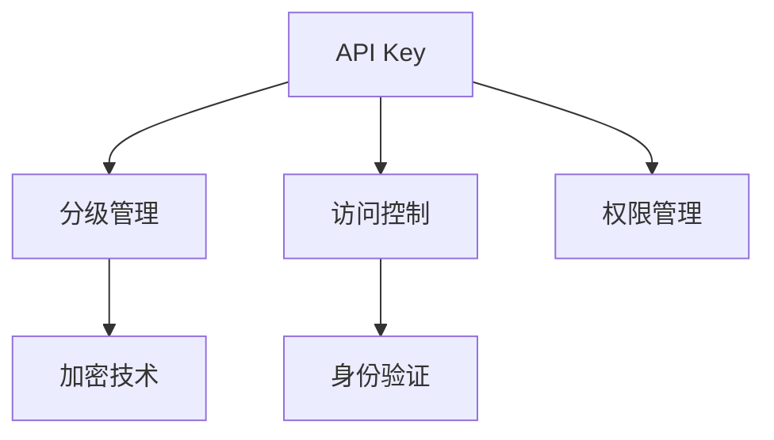

                 

# 分级 API Key 的实现细节

> 关键词：API Key管理、安全分级、访问控制、权限管理、加密技术、身份验证

## 1. 背景介绍

在当今数字化时代，API（应用程序接口）成为了企业与外部世界沟通的重要桥梁，通过API，第三方应用能够访问企业内部数据、调用企业内部服务，大大提升了企业数字化转型的效率。然而，API的安全性问题也随之而来。一旦API被恶意利用，企业的商业机密、用户隐私都有可能遭到泄露。因此，如何安全、有效地管理API Key，成为了企业IT管理中的重要课题。

分级API Key的实现是一种常见的API安全管理方案，通过将API Key按等级划分，不同等级的API Key拥有不同的权限，从而实现细粒度的访问控制。这一方案在众多云服务提供商、SaaS企业中得到了广泛应用，大大提高了API的安全性和可用性。

## 2. 核心概念与联系

### 2.1 核心概念概述

1. **API Key**：API Key是一个字符串，通常与API使用者身份绑定，用于身份验证和授权。通过API Key，API可以识别出请求的来源，并根据Key的权限控制访问资源。

2. **分级管理**：分级管理是将API Key按照权限级别进行划分，不同级别的API Key拥有不同的访问权限。例如，企业可以定义“开发版”、“测试版”和“生产版”等不同等级的API Key，各个版本分别对应不同的访问权限。

3. **访问控制**：访问控制是指对API Key的权限进行配置，确定其可以访问哪些资源、执行哪些操作。例如，可以对某个API Key只允许访问特定的路由、请求特定的HTTP方法、访问特定的数据。

4. **权限管理**：权限管理是指对API Key的权限进行管理，包括创建、修改、删除、分配等操作。企业需要根据API Key的使用者角色、所属团队、所属项目等信息，动态调整其权限。

5. **加密技术**：加密技术是指对API Key进行加密，防止其在传输和存储过程中被窃取或篡改。常见的加密技术包括AES、RSA等。

6. **身份验证**：身份验证是指对API Key的真实性进行验证，确认其来源是否合法。常见的身份验证方式包括基本认证、OAuth2、JWT等。

### 2.2 核心概念间的关系

这些核心概念之间的逻辑关系可以通过以下Mermaid流程图来展示：



这个流程图展示了分级API Key管理的整体架构：

1. **API Key**：是API管理的核心，用于识别API请求的来源。
2. **分级管理**：根据API Key的权限级别进行管理，不同级别的API Key拥有不同的权限。
3. **访问控制**：对API Key的权限进行配置，确定其可以访问哪些资源、执行哪些操作。
4. **权限管理**：根据API Key的使用者角色、所属团队、所属项目等信息，动态调整其权限。
5. **加密技术**：对API Key进行加密，防止其在传输和存储过程中被窃取或篡改。
6. **身份验证**：对API Key的真实性进行验证，确认其来源是否合法。

通过这些核心概念的相互配合，分级API Key管理实现了细粒度的访问控制，大大提高了API的安全性和可用性。

## 3. 核心算法原理 & 具体操作步骤

### 3.1 算法原理概述

分级API Key的实现主要涉及以下几个步骤：

1. **API Key的创建**：为每个API使用者生成一个唯一的API Key，并将其分配给相应的级别。
2. **API Key的加密**：对生成的API Key进行加密，防止其在传输和存储过程中被窃取或篡改。
3. **API Key的分级管理**：根据API Key的使用者角色、所属团队、所属项目等信息，动态调整其权限。
4. **API Key的访问控制**：配置API Key的访问权限，确定其可以访问哪些资源、执行哪些操作。
5. **API Key的身份验证**：对API Key的真实性进行验证，确认其来源是否合法。

### 3.2 算法步骤详解

#### 3.2.1 API Key的创建

1. **用户注册**：API使用者需要首先注册成为API用户，填写基本信息，包括姓名、邮箱、角色等。

2. **生成API Key**：在用户注册完成后，生成一个唯一的API Key，并将其分配给相应的级别。例如，可以将新注册用户的API Key设置为“测试版”，待其通过审核后，再升级为“生产版”。

3. **存储API Key**：将生成的API Key存储到数据库中，并为其分配一个唯一的ID。

#### 3.2.2 API Key的加密

1. **选择合适的加密算法**：根据API Key的敏感程度，选择合适的加密算法，例如AES、RSA等。

2. **加密API Key**：对生成的API Key进行加密，生成加密后的API Key。

3. **存储加密后的API Key**：将加密后的API Key存储到数据库中，并为其分配一个唯一的ID。

#### 3.2.3 API Key的分级管理

1. **定义级别**：根据API Key的使用者角色、所属团队、所属项目等信息，定义不同级别的API Key。例如，可以定义“开发版”、“测试版”和“生产版”等不同等级的API Key。

2. **分配级别**：将新创建的API Key分配到相应的级别中。例如，将新注册用户的API Key设置为“测试版”，待其通过审核后，再升级为“生产版”。

3. **动态调整级别**：根据API Key的使用情况，动态调整其级别。例如，根据API Key的使用频率、调用次数、错误率等指标，对API Key进行降级或升级。

#### 3.2.4 API Key的访问控制

1. **配置权限**：根据API Key的级别，配置其访问权限。例如，可以将“开发版”的API Key设置为只能访问测试环境，而“生产版”的API Key可以访问生产环境。

2. **配置路由**：根据API Key的级别，配置其可以访问的路由。例如，可以将“开发版”的API Key只能访问特定的开发接口，而“生产版”的API Key可以访问所有的生产接口。

3. **配置HTTP方法**：根据API Key的级别，配置其可以执行的HTTP方法。例如，可以将“开发版”的API Key只能执行GET请求，而“生产版”的API Key可以执行所有HTTP方法。

#### 3.2.5 API Key的身份验证

1. **身份验证方式**：选择合适的身份验证方式，例如基本认证、OAuth2、JWT等。

2. **验证API Key**：在每次API请求中，验证API Key的真实性。如果API Key不合法，则拒绝请求。

3. **记录访问日志**：对每次API请求进行记录，包括请求时间、请求IP、API Key、请求参数、响应结果等信息。

### 3.3 算法优缺点

分级API Key的实现有以下优点：

1. **细粒度访问控制**：通过分级管理，可以细粒度地控制API Key的访问权限，大大提高了API的安全性和可用性。

2. **权限动态调整**：根据API Key的使用情况，动态调整其级别和权限，提高了API Key管理的灵活性和可控性。

3. **安全性高**：对API Key进行加密，防止其在传输和存储过程中被窃取或篡改，提高了API Key的安全性。

4. **身份验证严格**：通过身份验证方式，确保API Key的真实性，防止恶意用户访问API。

然而，分级API Key的实现也存在一些缺点：

1. **复杂度较高**：分级管理、访问控制、权限调整等操作较为复杂，增加了API Key管理的难度。

2. **灵活性不足**：级别和权限的划分需要根据业务需求进行定制，不够灵活。

3. **管理成本高**：分级API Key的管理需要配置权限、调整级别、加密存储等操作，增加了API Key管理的成本。

4. **维护难度大**：随着API Key的增加和级别的变化，API Key管理的维护难度加大，需要定期进行清理和整理。

### 3.4 算法应用领域

分级API Key的实现主要应用于以下领域：

1. **云服务提供商**：例如AWS、Azure、Google Cloud等云服务提供商，通过分级API Key管理，实现细粒度的访问控制。

2. **SaaS企业**：例如Salesforce、Slack、Zoom等SaaS企业，通过分级API Key管理，确保API的安全性和可用性。

3. **第三方应用集成**：例如电商平台、金融平台、在线教育平台等，通过分级API Key管理，实现对第三方应用的访问控制。

4. **企业内部API管理**：例如企业内部各个部门之间，通过分级API Key管理，实现细粒度的访问控制和权限管理。

## 4. 数学模型和公式 & 详细讲解 & 举例说明

### 4.1 数学模型构建

假设有一个API Key管理系统的数据模型，其中包含API Key的ID、级别、权限、创建时间、更新时间、使用次数等字段。可以用如下表格表示：

| ID | 级别 | 权限 | 创建时间 | 更新时间 | 使用次数 |
|----|------|------|----------|----------|----------|

### 4.2 公式推导过程

1. **API Key的创建**：

$$
\text{ID} = \text{generate\_ID}()
$$

2. **API Key的加密**：

$$
\text{加密\_ID} = \text{encrypt}(\text{ID})
$$

3. **API Key的分级管理**：

$$
\text{级别} = \text{get\_level}(\text{用户ID}, \text{角色}, \text{所属团队}, \text{所属项目})
$$

4. **API Key的访问控制**：

$$
\text{权限} = \text{get\_permission}(\text{API Key级别}, \text{API KeyID})
$$

5. **API Key的身份验证**：

$$
\text{验证结果} = \text{validate\_ID}(\text{请求API Key}, \text{存储API Key}, \text{请求IP}, \text{请求时间})
$$

### 4.3 案例分析与讲解

假设某个API管理系统的API Key级别包括“开发版”、“测试版”和“生产版”，权限包括“读取”、“写入”、“删除”和“执行”。某API Key被创建时，其级别设置为“开发版”，权限设置为“读取”。用户A使用该API Key，请求访问API时，需要进行如下步骤：

1. **身份验证**：用户A提供API Key，系统验证该API Key的真实性。如果API Key不合法，则拒绝请求。

2. **获取API Key的权限**：系统根据API Key的级别，获取其权限。该API Key的权限为“读取”。

3. **访问控制**：系统根据API Key的权限，判断用户A是否可以访问请求的API。例如，用户A请求访问API时，API Key的权限为“读取”，而API只允许“写入”权限的用户访问。因此，系统拒绝该请求。

## 5. 项目实践：代码实例和详细解释说明

### 5.1 开发环境搭建

#### 5.1.1 数据库搭建

选择一个支持事务处理的数据库，例如MySQL、PostgreSQL等。可以使用Docker或Kubernetes等容器化技术搭建数据库，方便管理和扩展。

#### 5.1.2 身份验证搭建

选择一个支持身份验证的Web框架，例如Flask、Spring Boot等。在Web框架中，配置身份验证方式，例如基本认证、OAuth2、JWT等。

### 5.2 源代码详细实现

#### 5.2.1 数据库模型

```python
from sqlalchemy import Column, Integer, String, DateTime
from sqlalchemy.ext.declarative import declarative_base

Base = declarative_base()

class APIKey(Base):
    __tablename__ = 'api_keys'
    id = Column(Integer, primary_key=True)
    level = Column(String(50), nullable=False)
    permission = Column(String(50), nullable=False)
    create_time = Column(DateTime, nullable=False)
    update_time = Column(DateTime, nullable=False)
    use_count = Column(Integer, nullable=False)
```

#### 5.2.2 数据库操作

```python
def create_api_key():
    new_api_key = APIKey(level='开发版', permission='读取', create_time=datetime.now(), update_time=datetime.now(), use_count=0)
    Base.session.add(new_api_key)
    Base.session.commit()
    return new_api_key.id

def update_api_key(level, permission, use_count, api_key_id):
    api_key = Base.session.query(APIKey).filter(APIKey.id == api_key_id).first()
    api_key.level = level
    api_key.permission = permission
    api_key.use_count += use_count
    api_key.update_time = datetime.now()
    Base.session.commit()
```

#### 5.2.3 加密操作

```python
def encrypt_key(api_key):
    # 使用AES加密算法对API Key进行加密
    key = b'secret_key'
    iv = os.urandom(16)
    cipher = AES.new(key, AES.MODE_CBC, iv)
    encrypted_key = iv + cipher.encrypt(api_key.encode('utf-8'))
    return encrypted_key

def decrypt_key(encrypted_key):
    # 使用AES加密算法对API Key进行解密
    key = b'secret_key'
    iv = encrypted_key[:16]
    cipher = AES.new(key, AES.MODE_CBC, iv)
    decrypted_key = cipher.decrypt(encrypted_key[16:]).decode('utf-8')
    return decrypted_key
```

#### 5.2.4 身份验证操作

```python
def validate_api_key(request_api_key, stored_api_key, request_ip, request_time):
    # 对API Key进行身份验证
    if request_api_key == stored_api_key:
        return True
    else:
        return False
```

### 5.3 代码解读与分析

#### 5.3.1 数据库模型

使用SQLAlchemy定义API Key的数据库模型，包括ID、级别、权限、创建时间、更新时间和使用次数等字段。

#### 5.3.2 数据库操作

定义API Key的创建和更新操作，分别更新API Key的级别、权限、使用次数和更新时间。

#### 5.3.3 加密操作

使用AES加密算法对API Key进行加密和解密，防止其在传输和存储过程中被窃取或篡改。

#### 5.3.4 身份验证操作

对API Key进行身份验证，确认API Key的真实性，防止恶意用户访问API。

### 5.4 运行结果展示

假设某用户A通过API管理系统的接口创建了一个API Key，并将其设置为“开发版”，权限设置为“读取”。用户A使用该API Key，请求访问API时，需要进行如下步骤：

1. **身份验证**：用户A提供API Key，系统验证该API Key的真实性。

2. **获取API Key的权限**：系统根据API Key的级别，获取其权限。该API Key的权限为“读取”。

3. **访问控制**：系统根据API Key的权限，判断用户A是否可以访问请求的API。

## 6. 实际应用场景

### 6.1 云服务提供商

云服务提供商通过分级API Key管理，实现细粒度的访问控制。例如，AWS的API管理服务，用户可以根据API Key的级别，设置不同的访问权限，确保API的安全性和可用性。

### 6.2 SaaS企业

SaaS企业通过分级API Key管理，实现对第三方应用的访问控制。例如，Slack的API管理服务，用户可以根据API Key的级别，设置不同的访问权限，确保API的安全性和可用性。

### 6.3 第三方应用集成

第三方应用集成通过分级API Key管理，实现对第三方应用的访问控制。例如，电商平台的API管理服务，用户可以根据API Key的级别，设置不同的访问权限，确保API的安全性和可用性。

### 6.4 企业内部API管理

企业内部API管理通过分级API Key管理，实现细粒度的访问控制和权限管理。例如，企业内部各个部门之间，通过分级API Key管理，确保API的安全性和可用性。

## 7. 工具和资源推荐

### 7.1 学习资源推荐

#### 7.1.1 书籍推荐

1. 《API接口设计》：介绍API接口的设计原则、最佳实践、安全性等内容，是API管理的经典之作。

2. 《API接口安全》：介绍API接口的安全设计、加密技术、身份验证等内容，是API安全的权威指南。

#### 7.1.2 在线课程推荐

1. 《API接口设计》课程：由Coursera平台提供，由Khan Academy负责讲授，涵盖API接口的设计、安全性等内容。

2. 《API接口管理》课程：由Udemy平台提供，由Alberto Fernandez讲授，涵盖API接口的访问控制、权限管理等内容。

### 7.2 开发工具推荐

#### 7.2.1 Web框架

1. Flask：轻量级的Python Web框架，支持RESTful API开发，方便快速搭建API管理平台。

2. Spring Boot：Java Web框架，支持Spring Cloud，方便搭建可扩展、高可用的API管理平台。

#### 7.2.2 数据库

1. MySQL：开源的关系型数据库，支持事务处理，方便存储和管理API Key数据。

2. PostgreSQL：开源的关系型数据库，支持事务处理，方便存储和管理API Key数据。

### 7.3 相关论文推荐

#### 7.3.1 API管理

1. 《API接口设计原则》：介绍API接口的设计原则和最佳实践，帮助开发者设计出高性能、高可用、高安全的API。

2. 《API接口安全性》：介绍API接口的安全设计，包括身份验证、访问控制、加密技术等内容。

#### 7.3.2 身份验证

1. 《OAuth2身份验证》：介绍OAuth2身份验证机制，帮助开发者实现安全的API访问控制。

2. 《JWT身份验证》：介绍JWT身份验证机制，帮助开发者实现高效的API访问控制。

## 8. 总结：未来发展趋势与挑战

### 8.1 未来发展趋势

1. **自动化管理**：未来的API管理将更加自动化，实现API Key的自动创建、更新和分级，减少人工干预。

2. **智能管理**：未来的API管理将更加智能化，根据API Key的使用情况，自动调整其级别和权限，提高API Key管理的效率。

3. **多云管理**：未来的API管理将支持多云环境，实现跨云、跨区域API Key的统一管理。

4. **微服务管理**：未来的API管理将支持微服务架构，实现微服务的细粒度访问控制和权限管理。

### 8.2 未来发展趋势

1. **细粒度管理**：未来的API管理将更加细粒度，实现对API的每个接口、每个方法的访问控制。

2. **多维度管理**：未来的API管理将支持多维度管理，包括用户角色、所属团队、所属项目等。

3. **零信任架构**：未来的API管理将支持零信任架构，通过微分段、最小权限原则等技术，提升API的安全性。

4. **实时监控**：未来的API管理将支持实时监控，实现API调用的实时统计和告警。

### 8.3 面临的挑战

1. **复杂度增加**：随着API Key的分级和管理粒度的细化，API管理系统的复杂度将增加。

2. **安全性挑战**：API管理系统的安全性问题仍需进一步解决，防止API Key被窃取或篡改。

3. **运维成本增加**：API管理系统的运维成本将增加，需要定期进行清理和维护。

4. **系统可用性**：API管理系统的可用性需要进一步提升，防止系统故障导致API服务中断。

### 8.4 研究展望

1. **自动化管理**：研究自动化管理技术，减少人工干预，提高API管理系统的效率。

2. **智能化管理**：研究智能化管理技术，根据API Key的使用情况，自动调整其级别和权限。

3. **多云管理**：研究多云管理技术，实现跨云、跨区域API Key的统一管理。

4. **微服务管理**：研究微服务管理技术，实现微服务的细粒度访问控制和权限管理。

5. **零信任架构**：研究零信任架构技术，提升API的安全性。

6. **实时监控**：研究实时监控技术，实现API调用的实时统计和告警。

## 9. 附录：常见问题与解答

**Q1：分级API Key的实现涉及哪些关键组件？**

A: 分级API Key的实现涉及以下几个关键组件：

1. **数据库**：用于存储API Key数据，支持事务处理和数据一致性。

2. **Web框架**：用于搭建API管理平台，支持RESTful API开发，方便API Key的创建、更新和访问控制。

3. **加密算法**：用于对API Key进行加密，防止其在传输和存储过程中被窃取或篡改。

4. **身份验证**：用于对API Key的真实性进行验证，防止恶意用户访问API。

5. **访问控制**：用于配置API Key的访问权限，确定其可以访问哪些资源、执行哪些操作。

**Q2：分级API Key的实现流程是怎样的？**

A: 分级API Key的实现流程包括以下步骤：

1. **API Key的创建**：为每个API使用者生成一个唯一的API Key，并将其分配给相应的级别。

2. **API Key的加密**：对生成的API Key进行加密，防止其在传输和存储过程中被窃取或篡改。

3. **API Key的分级管理**：根据API Key的使用者角色、所属团队、所属项目等信息，动态调整其权限。

4. **API Key的访问控制**：配置API Key的访问权限，确定其可以访问哪些资源、执行哪些操作。

5. **API Key的身份验证**：对API Key的真实性进行验证，防止恶意用户访问API。

**Q3：分级API Key的实现有哪些优点和缺点？**

A: 分级API Key的实现有以下优点：

1. **细粒度访问控制**：通过分级管理，可以细粒度地控制API Key的访问权限，大大提高了API的安全性和可用性。

2. **权限动态调整**：根据API Key的使用情况，动态调整其级别和权限，提高了API Key管理的灵活性和可控性。

3. **安全性高**：对API Key进行加密，防止其在传输和存储过程中被窃取或篡改，提高了API Key的安全性。

4. **身份验证严格**：通过身份验证方式，确保API Key的真实性，防止恶意用户访问API。

然而，分级API Key的实现也存在一些缺点：

1. **复杂度较高**：分级管理、访问控制、权限调整等操作较为复杂，增加了API Key管理的难度。

2. **灵活性不足**：级别和权限的划分需要根据业务需求进行定制，不够灵活。

3. **管理成本高**：分级API Key的管理需要配置权限、调整级别、加密存储等操作，增加了API Key管理的成本。

4. **维护难度大**：随着API Key的增加和级别的变化，API Key管理的维护难度加大，需要定期进行清理和整理。

**Q4：如何实现分级API Key的自动化管理？**

A: 实现分级API Key的自动化管理，可以通过以下方法：

1. **API Key的自动化创建**：使用自动化工具或脚本，根据API使用者信息，自动生成API Key，并分配到相应的级别。

2. **API Key的自动化更新**：使用自动化工具或脚本，根据API Key的使用情况，自动调整其级别和权限。

3. **API Key的自动化分级**：使用自动化工具或脚本，根据API Key的使用者角色、所属团队、所属项目等信息，自动分配级别和权限。

4. **API Key的自动化访问控制**：使用自动化工具或脚本，根据API Key的级别和权限，自动配置访问控制规则。

5. **API Key的自动化身份验证**：使用自动化工具或脚本，自动对API Key进行身份验证，防止恶意用户访问API。

通过以上方法，可以实现API Key的自动化管理，减少人工干预，提高API Key管理的效率。

**Q5：如何提升分级API Key的可用性？**

A: 提升分级API Key的可用性，可以通过以下方法：

1. **高可用架构**：使用高可用架构，确保API管理系统的稳定性和可靠性，防止系统故障导致API服务中断。

2. **实时监控**：使用实时监控工具，对API管理系统的运行状态进行监控，及时发现和解决问题。

3. **故障恢复**：使用故障恢复机制，在系统故障时快速恢复，保证API服务的连续性。

4. **自动化部署**：使用自动化部署工具，快速部署API管理系统的更新和升级，减少人工干预，提高部署效率。

通过以上方法，可以提升分级API Key的可用性，确保API管理系统的稳定性和可靠性。

---

作者：禅与计算机程序设计艺术 / Zen and the Art of Computer Programming

