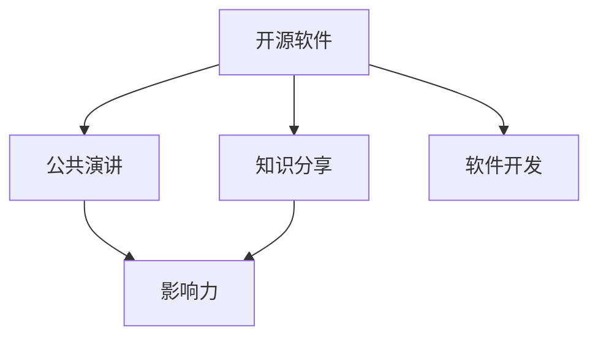
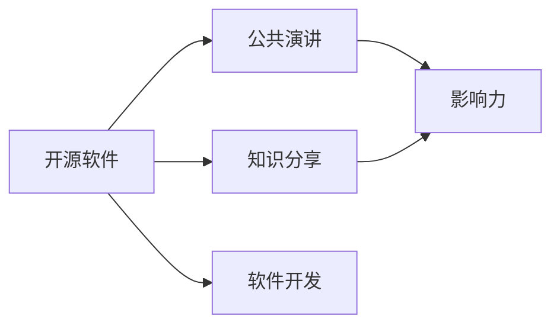
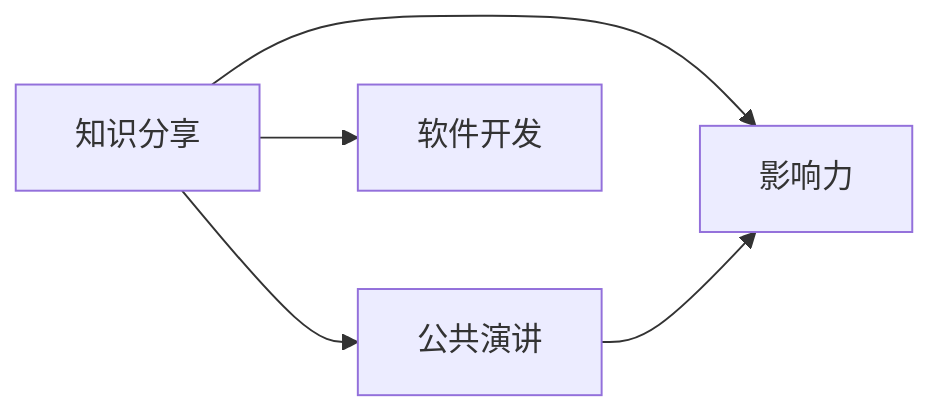
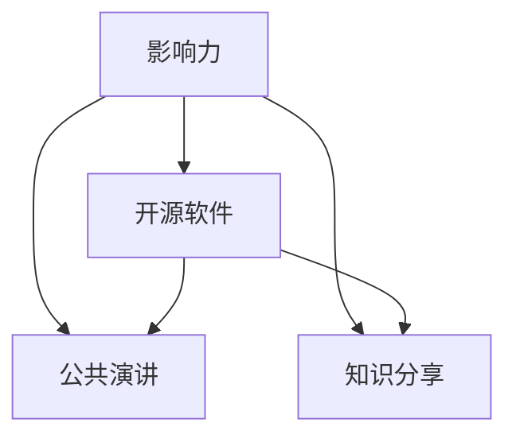
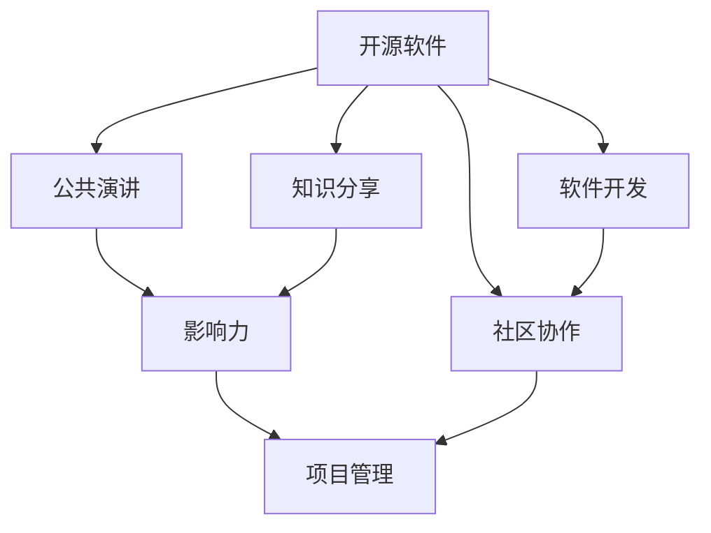

                 

# 利用开源影响力进行公开演讲和知识分享

> 关键词：开源软件, 公共演讲, 知识分享, 影响力, 软件开发

## 1. 背景介绍

### 1.1 问题由来
在过去的几十年里，开源软件逐渐成为软件开发的主流模式。开源项目不仅提供了广泛的功能、高度的可定制性以及持续的创新，更重要的是它提供了一个社群，让世界各地的人们能够共享知识和资源。随着开源项目在各个领域的广泛应用，开源影响力逐渐成为推动技术进步和社会发展的关键力量。

### 1.2 问题核心关键点
开源项目成功的核心在于其社区的力量，包括持续的贡献、活跃的讨论、有效的协作以及透明的管理。公共演讲和知识分享作为开源项目成功的关键环节，具有以下几个特点：

- **知识共享**：通过演讲和分享，将项目的技术细节、实践经验以及创新理念传播出去，帮助更多人理解和使用开源项目。
- **社群建设**：公共演讲和知识分享活动能够聚集和培养一批忠实的用户和贡献者，从而形成稳定的社区支持。
- **影响扩大**：高质量的演讲和分享活动不仅能够提升开源项目的知名度，还能吸引更多的开发者和资源，推动项目的持续发展。
- **反馈循环**：演讲和分享活动为社区成员提供了直接反馈和改进的机会，有助于项目不断优化和进步。

### 1.3 问题研究意义
研究如何利用开源影响力进行公开演讲和知识分享，不仅有助于提升开源项目的传播效果和用户基数，还能促进社区成员之间的交流与合作，推动技术创新和知识共享。这种研究和实践对于促进软件技术的开放性和普惠性，以及推动社会经济的发展具有重要意义。

## 2. 核心概念与联系

### 2.1 核心概念概述

为更好地理解如何进行公开演讲和知识分享，本节将介绍几个密切相关的核心概念：

- **开源软件(Open Source Software, OSS)**：指在一定的开源协议下，可以自由使用、修改和分享的源代码软件。开源软件通常具有开放、协作、持续创新的特点。

- **公共演讲(Public Speaking)**：指在公开场合进行的以知识传播、观念引导为主要目的的演讲活动。公共演讲需要良好的表达能力、丰富的知识和互动技巧。

- **知识分享(Knowledge Sharing)**：指通过各种方式将知识和信息传递给需要的个体的过程。知识分享有助于知识的积累和传播，提升整体技术水平。

- **影响力(Influence)**：指个人或项目对他人或社会产生的影响力，包括知识传播、技术推广、社群发展等方面。

- **软件开发(Software Development)**：指从需求分析、系统设计、编码实现到测试部署的软件开发全流程。开源软件通常采用敏捷开发和社区协作的方式。

这些核心概念之间的逻辑关系可以通过以下Mermaid流程图来展示：



这个流程图展示了一个开源软件项目从开发到传播的过程。开源软件通过持续的软件开发，获得丰富的知识和功能，通过公共演讲和知识分享将这些知识和功能传播出去，最终形成良好的影响力。

### 2.2 概念间的关系

这些核心概念之间存在着紧密的联系，形成了开源项目成功的完整生态系统。下面我通过几个Mermaid流程图来展示这些概念之间的关系。

#### 2.2.1 开源软件的学习范式



这个流程图展示了一个开源软件项目从开发到传播的过程。开源软件通过持续的软件开发，获得丰富的知识和功能，通过公共演讲和知识分享将这些知识和功能传播出去，最终形成良好的影响力。

#### 2.2.2 知识分享与公共演讲的关系



这个流程图展示了一个开源项目知识分享与公共演讲之间的关系。知识分享通过公共演讲的方式进行传播，进一步扩大影响力。公共演讲则通过知识的分享，进一步提升开源项目的知名度和用户基数。

#### 2.2.3 影响力在开源项目中的应用



这个流程图展示了一个开源项目中影响力的应用。影响力通过对公共演讲和知识分享的应用，促进了开源软件项目的持续发展和用户扩展。

### 2.3 核心概念的整体架构

最后，我们用一个综合的流程图来展示这些核心概念在大语言模型微调过程中的整体架构：



这个综合流程图展示了开源项目从开发到传播的整体过程。开源软件通过持续的软件开发，获得丰富的知识和功能，通过公共演讲和知识分享将这些知识和功能传播出去，最终形成良好的影响力。影响力通过社区协作和项目管理得到进一步巩固，确保开源项目的持续发展和成功。

## 3. 核心算法原理 & 具体操作步骤
### 3.1 算法原理概述

基于开源影响力的公开演讲和知识分享，本质上是一个以知识传播和社群建设为目标的过程。其核心思想是：通过高质量的演讲和分享，将项目的技术细节、实践经验以及创新理念传播出去，吸引更多的开发者和用户，形成稳定的社区支持，并不断提升项目的影响力和知名度。

### 3.2 算法步骤详解

基于开源影响力的公共演讲和知识分享一般包括以下几个关键步骤：

**Step 1: 收集和整理演讲素材**

- 收集项目的技术文档、案例分析、项目经验等素材。
- 邀请项目核心开发者进行内容创作，形成演讲稿和分享材料。

**Step 2: 设计演讲和分享活动**

- 确定演讲和分享的主题和目标受众。
- 设计互动环节，如问答、讨论、工作坊等，增加参与者的互动性。

**Step 3: 选择演讲和分享平台**

- 选择合适的演讲和分享平台，如线上线下会议、社交媒体、技术博客等。
- 发布活动信息，吸引目标受众参与。

**Step 4: 执行演讲和分享活动**

- 在选定的平台上进行演讲和分享。
- 实时收集参与者的反馈和提问，并给予解答和互动。

**Step 5: 总结和推广**

- 活动结束后，整理演讲和分享的内容和反馈，形成报告和总结。
- 推广总结报告，继续吸引新的开发者和用户。

### 3.3 算法优缺点

基于开源影响力的公开演讲和知识分享方法具有以下优点：

- **传播效果好**：高质量的演讲和分享能够有效传播项目的技术和理念，吸引更多关注。
- **社群建设快**：通过互动和讨论，可以快速建立稳定的社区，增强用户粘性。
- **影响力强**：高影响力的演讲和分享活动能够提升项目的知名度和用户基数。

同时，该方法也存在一些局限性：

- **资源消耗高**：高质量的演讲和分享需要投入大量的时间和精力，包括内容创作、平台选择等。
- **结果不确定**：演讲和分享的效果受多种因素影响，如受众反馈、演讲者表现等。
- **内容标准化**：过于标准化和一致的演讲和分享内容，可能导致用户参与度下降。

### 3.4 算法应用领域

基于开源影响力的公开演讲和知识分享方法，在软件开发领域得到了广泛应用，例如：

- **开源社区建设**：通过公共演讲和分享活动，聚集和培养一批忠实的用户和贡献者，从而形成稳定的社区支持。
- **技术推广和培训**：通过专题讲座、技术培训班等方式，推广开源技术，提升开发者的技术水平。
- **开源项目推广**：通过技术博客、开源会议等方式，提升开源项目的知名度和用户基数。

除了上述这些经典应用外，公共演讲和知识分享方法也被创新性地应用到更多场景中，如开源项目的在线课程、技术沙龙、黑客松等，为开源技术的应用和创新提供了新的途径。

## 4. 数学模型和公式 & 详细讲解 & 举例说明

### 4.1 数学模型构建

本节将使用数学语言对基于开源影响力的公开演讲和知识分享过程进行更加严格的刻画。

记演讲和分享活动为 $S$，其中 $x$ 表示演讲或分享的内容，$y$ 表示受众的反应和反馈。设 $x$ 为随机变量，其概率分布为 $p(x)$。设 $y$ 为接收到的反馈，由 $x$ 决定，其分布为 $p(y|x)$。

定义 $S$ 的成功率为：

$$
P(Succ) = \int p(y|x)dy
$$

在实践中，我们通常使用AUC（Area Under Curve）和F1分数来评估 $S$ 的成功率。

### 4.2 公式推导过程

以下我们以开源项目推广为例，推导成功率的计算公式。

假设 $S$ 为推广活动，推广目标受众为 $N$，成功推广的用户数为 $n$。则成功率 $P(Succ)$ 可以表示为：

$$
P(Succ) = \frac{n}{N}
$$

在推广活动期间，受众会收到关于项目的各种信息，包括演讲、文章、邮件等。假设 $P(x)$ 表示演讲或分享的内容 $x$ 的分布概率，则接收该内容的受众概率为 $P(x)$。设 $p(y|x)$ 表示受众对内容 $x$ 的反应概率分布，则成功推广的概率为：

$$
P(Succ|x) = \int p(y|x)dy
$$

推广活动 $S$ 的成功率可以表示为：

$$
P(Succ) = \int P(x)P(Succ|x)dx
$$

在实际推广中，通常通过AUC和F1分数来评估成功率，这些指标衡量了接收内容的受众反应和反馈的平均水平。AUC表示模型在不同阈值下的曲线下面积，F1分数则综合考虑了准确率和召回率。

### 4.3 案例分析与讲解

假设我们推广一个开源项目 $S$，其中 $P(x)$ 表示受众接收演讲或分享内容的概率分布，$P(y|x)$ 表示受众的反应概率分布。在推广活动 $S$ 期间，我们收集了 $N$ 个受众的反馈，其中 $n$ 个反馈为正面反应。

1. **计算AUC值**：
   - 首先，对 $N$ 个受众的反馈进行排序，按反应的积极程度从高到低排列。
   - 计算每个阈值下的ROC曲线下的面积（AUC），即：

     | 阈值 | 真阳性率（TPR） | 假阳性率（FPR） |
     |------|----------------|----------------|
     | 0.1  | 0.9            | 0.1            |
     | 0.2  | 0.8            | 0.1            |
     | ...  | ...            | ...            |

   - 最后，将每个阈值下的ROC曲线下的面积（AUC）加权平均，得到整体AUC值：

     | 阈值 | 权重       |
     |------|------------|
     | 0.1  | 0.1        |
     | 0.2  | 0.1        |
     | ...  | ...        |

     | AUC | 平均权重 |
     |-----|---------|

   AUC值越高，表示演讲和分享活动的效果越好，受众的反馈和反应越积极。

2. **计算F1分数**：
   - 假设 $TP$ 表示真正例（成功推广的用户）的数量，$FP$ 表示假正例（未成功推广但被误认为成功的用户）的数量，$FN$ 表示假反例（已成功推广但被忽略的用户）的数量。
   - F1分数定义为：

     $$
     F1 = \frac{2 \times TP}{2 \times TP + FP + FN}
     $$

   F1分数越高，表示成功推广的用户越多，推广活动的有效性越强。

通过上述分析，可以看到，AUC和F1分数是衡量演讲和分享活动效果的重要指标。在实际应用中，通常需要同时使用这些指标来全面评估活动的效果，以确保达到预期的推广目标。

## 5. 项目实践：代码实例和详细解释说明

### 5.1 开发环境搭建

在进行演讲和分享实践前，我们需要准备好开发环境。以下是使用Python进行PyTorch开发的环境配置流程：

1. 安装Anaconda：从官网下载并安装Anaconda，用于创建独立的Python环境。

2. 创建并激活虚拟环境：
```bash
conda create -n pytorch-env python=3.8 
conda activate pytorch-env
```

3. 安装PyTorch：根据CUDA版本，从官网获取对应的安装命令。例如：
```bash
conda install pytorch torchvision torchaudio cudatoolkit=11.1 -c pytorch -c conda-forge
```

4. 安装Transformers库：
```bash
pip install transformers
```

5. 安装各类工具包：
```bash
pip install numpy pandas scikit-learn matplotlib tqdm jupyter notebook ipython
```

完成上述步骤后，即可在`pytorch-env`环境中开始演讲和分享实践。

### 5.2 源代码详细实现

下面我们以开源项目推广为例，给出使用Transformers库进行演讲和分享效果的评估代码实现。

首先，定义数据处理函数：

```python
import pandas as pd
import numpy as np
from sklearn.metrics import roc_auc_score, f1_score

def compute_metrics(y_true, y_pred):
    auc = roc_auc_score(y_true, y_pred)
    f1 = f1_score(y_true, y_pred)
    return auc, f1
```

然后，加载示例数据：

```python
# 加载数据
df = pd.read_csv('feedback.csv')
```

接着，计算AUC和F1分数：

```python
# 计算AUC和F1分数
auc, f1 = compute_metrics(df['y'], df['y_pred'])
print(f"AUC: {auc}, F1: {f1}")
```

最后，生成可视化图表：

```python
import matplotlib.pyplot as plt

# 绘制ROC曲线
y_true = np.array(df['y'])
y_pred = np.array(df['y_pred'])
fpr, tpr, _ = roc_curve(y_true, y_pred)
plt.plot(fpr, tpr)
plt.xlabel('False Positive Rate')
plt.ylabel('True Positive Rate')
plt.title('ROC Curve')
plt.show()

# 绘制混淆矩阵
y_true = np.array(df['y'])
y_pred = np.array(df['y_pred'])
cm = confusion_matrix(y_true, y_pred)
print(f"Confusion Matrix:\n{cm}")
```

以上就是使用PyTorch和Scikit-learn进行开源项目推广效果评估的代码实现。可以看到，借助Python和各种数据处理和可视化工具，演讲和分享效果可以轻松进行评估和展示。

### 5.3 代码解读与分析

让我们再详细解读一下关键代码的实现细节：

**data_process函数**：
- 定义了一个数据处理函数，用于计算AUC和F1分数。
- 使用Scikit-learn的roc_auc_score和f1_score函数计算AUC和F1分数。

**load_data函数**：
- 加载示例数据，包括真实标签和预测标签。

**计算AUC和F1分数**：
- 调用data_process函数，计算AUC和F1分数。
- 输出计算结果。

**可视化图表**：
- 使用Matplotlib绘制ROC曲线和混淆矩阵。
- 通过可视化图表直观展示模型的性能。

在实际应用中，我们还可以进一步扩展代码，实现更复杂的演讲和分享效果的评估和展示。例如，可以引入更多的评估指标，如准确率、召回率等，或者结合更多可视化工具，如Tableau、PowerBI等，进行更全面的分析。

## 6. 实际应用场景

### 6.1 开源社区建设

基于开源影响力的公共演讲和知识分享，可以在开源社区建设中发挥重要作用。开放社区通常由志同道合的开发者组成，通过持续的知识分享和协作，形成稳定的社区支持。

在技术实现上，可以定期组织社区会议、技术讲座、代码审查等活动，分享项目进展和技术心得。同时，通过建立开源社区网站、论坛和博客，提供技术文档、代码示例和问题解答，吸引和留住社区成员。

### 6.2 技术推广和培训

公共演讲和知识分享在技术推广和培训中具有不可替代的作用。高质量的演讲和分享活动能够深入浅出地介绍技术原理和实现细节，帮助开发者理解和掌握新技术。

在技术推广中，可以举办线上线下的技术研讨会、黑客松、代码马拉松等活动，吸引更多的开发者参与。同时，通过编写技术手册、开发教程和视频课程，提供系统化的学习资源，提升开发者技术水平。

### 6.3 开源项目推广

公共演讲和知识分享是开源项目推广的重要手段。通过高影响力的演讲和分享活动，提升开源项目的知名度和用户基数，吸引更多的开发者和用户。

在项目推广中，可以借助社交媒体、博客、新闻发布会等渠道，推广开源项目的核心功能和优势。同时，通过建立开源项目的官方网站、GitHub仓库和邮件列表，提供下载、文档和社区支持，增强用户粘性和项目活跃度。

### 6.4 未来应用展望

随着开源项目和技术的不断进步，基于开源影响力的公共演讲和知识分享方法将发挥更大的作用，为技术传播和社群建设带来新的机遇。

在智慧医疗领域，开源软件和公共演讲可以为医生和开发者提供最新的医疗技术应用，提升医疗服务质量和效率。

在智能教育领域，公共演讲和知识分享可以为学生和教师提供优质的教学资源和实践案例，促进教育公平和个性化教学。

在智慧城市治理中，开源软件和公共演讲可以为城市管理者提供智能化的治理方案和数据支持，提升城市管理水平。

除了上述这些应用领域外，开源软件和公共演讲还将在更多场景中得到广泛应用，为技术创新和知识传播提供新的途径。

## 7. 工具和资源推荐
### 7.1 学习资源推荐

为了帮助开发者系统掌握基于开源影响力的公共演讲和知识分享技术，这里推荐一些优质的学习资源：

1. 《公共演讲的艺术》系列书籍：由公共演讲大师撰写，深入浅出地介绍了公共演讲的原理、技巧和实践。

2. Coursera《公共演讲与交流技巧》课程：由知名大学开设，提供系统的公共演讲和交流技巧培训。

3. 《开源软件最佳实践》系列书籍：介绍开源软件的开发、管理和推广的最佳实践，为开源项目提供参考。

4. 《软件开发生命周期》课程：介绍软件开发的全流程和最佳实践，为技术传播提供理论支持。

5. GitHub开源项目：查找和学习优秀的开源项目，了解其开发和管理经验。

通过对这些资源的学习实践，相信你一定能够快速掌握基于开源影响力的公共演讲和知识分享技术，并用于解决实际的NLP问题。

### 7.2 开发工具推荐

高效的开发离不开优秀的工具支持。以下是几款用于基于开源影响力的公共演讲和知识分享开发的常用工具：

1. Jupyter Notebook：支持Python代码的在线编辑和运行，非常适合数据处理和模型评估。

2. GitHub：全球最大的代码托管平台，适合版本控制、代码协作和项目管理。

3. Conda：Python环境的打包和部署工具，支持虚拟环境和包管理。

4. TensorFlow：由Google开发的开源深度学习框架，支持多种模型训练和优化。

5. PyTorch：Facebook开源的深度学习框架，支持动态计算图和高效的GPU加速。

6. PyTorch Lightning：基于PyTorch的快速模型构建和训练框架，适合快速迭代研究。

合理利用这些工具，可以显著提升基于开源影响力的公共演讲和知识分享任务的开发效率，加快创新迭代的步伐。

### 7.3 相关论文推荐

基于开源影响力的公共演讲和知识分享技术的发展源于学界的持续研究。以下是几篇奠基性的相关论文，推荐阅读：

1. "Open Source Software: A New Economics of Production and Collaboration"：阐述开源软件的发展历程和成功因素。

2. "The State of the Art in Public Speaking"：介绍公共演讲的历史、理论和实践，为技术传播提供理论支持。

3. "Best Practices for Software Development"：介绍软件开发的最佳实践，为技术推广提供指导。

4. "The Economics of Knowledge Sharing in Open Source Communities"：研究开源社区中知识共享的经济性和有效性。

5. "Effective Communication in Software Development"：介绍软件开发中的有效沟通方法和工具。

这些论文代表了大语言模型微调技术的发展脉络。通过学习这些前沿成果，可以帮助研究者把握学科前进方向，激发更多的创新灵感。

除上述资源外，还有一些值得关注的前沿资源，帮助开发者紧跟基于开源影响力的公共演讲和知识分享技术的最新进展，例如：

1. arXiv论文预印本：人工智能领域最新研究成果的发布平台，包括大量尚未发表的前沿工作，学习前沿技术的必读资源。

2. 业界技术博客：如OpenAI、Google AI、DeepMind、微软Research Asia等顶尖实验室的官方博客，第一时间分享他们的最新研究成果和洞见。

3. 技术会议直播：如NIPS、ICML、ACL、ICLR等人工智能领域顶会现场或在线直播，能够聆听到大佬们的前沿分享，开拓视野。

4. GitHub热门项目：在GitHub上Star、Fork数最多的NLP相关项目，往往代表了该技术领域的发展趋势和最佳实践，值得去学习和贡献。

5. 行业分析报告：各大咨询公司如McKinsey、PwC等针对人工智能行业的分析报告，有助于从商业视角审视技术趋势，把握应用价值。

总之，对于基于开源影响力的公共演讲和知识分享技术的学习和实践，需要开发者保持开放的心态和持续学习的意愿。多关注前沿资讯，多动手实践，多思考总结，必将收获满满的成长收益。

## 8. 总结：未来发展趋势与挑战

### 8.1 总结

本文对基于开源影响力的公共演讲和知识分享方法进行了全面系统的介绍。首先阐述了基于开源影响力的公共演讲和知识分享的研究背景和意义，明确了技术传播和社群建设的目标。其次，从原理到实践，详细讲解了演讲和分享的效果评估和实践方法，给出了演讲和分享效果的代码实现。同时，本文还广泛探讨了演讲和分享方法在开源社区建设、技术推广、项目推广等多个领域的应用前景，展示了开源技术的强大传播能力。此外，本文精选了演讲和分享技术的各类学习资源，力求为读者提供全方位的技术指引。

通过本文的系统梳理，可以看到，基于开源影响力的公共演讲和知识分享方法在大规模技术传播和社群建设中发挥着重要作用。这种技术和方法不仅能够提升开源项目的知名度和用户基数，还能够增强社区成员之间的交流与合作，推动技术创新和知识共享。未来，随着开源项目和技术的不断进步，基于开源影响力的公共演讲和知识分享方法将发挥更大的作用，为技术传播和社群建设带来新的机遇。

### 8.2 未来发展趋势

展望未来，基于开源影响力的公共演讲和知识分享技术将呈现以下几个发展趋势：

1. **技术传播普及化**：随着开源项目的不断发展和技术的不断进步，开源技术的应用将越来越广泛。高质量的公共演讲和知识分享活动将逐渐普及，进一步提升开源技术的传播效果。

2. **技术传播多渠道化**：未来的技术传播将不再局限于线下会议和线上视频，而是将利用社交媒体、在线论坛、博客等多种渠道进行传播，提升传播效率和覆盖范围。

3. **技术传播全球化**：随着互联网的普及和全球化进程的加快，开源技术和公共演讲活动将跨越国界，服务于全球用户。开放技术的多样性和包容性将进一步提升。

4. **技术传播智能化**：借助AI和机器学习技术，未来的公共演讲和知识分享活动将更加智能化和个性化。通过数据分析和预测，提升演讲和分享的效果。

5. **技术传播协同化**：未来的技术传播将更加注重协同合作，通过跨领域的知识共享和协作，推动技术创新和应用。

以上趋势凸显了基于开源影响力的公共演讲和知识分享技术的广阔前景。这些方向的探索发展，必将进一步提升技术传播的效果，推动开源技术的广泛应用和普及。

### 8.3 面临的挑战

尽管基于开源影响力的公共演讲和知识分享技术已经取得了显著成效，但在迈向更加智能化、普惠化应用的过程中，它仍面临诸多挑战：

1. **资源消耗高**：高质量的公共演讲和知识分享活动需要投入大量的时间和精力，包括内容创作、平台选择等，对资源消耗较大。

2. **效果不确定**：演讲和分享的效果受多种因素影响，如受众反馈、演讲者表现等，难以预料。

3. **内容标准化**：过于标准化和一致的演讲和分享内容，可能导致用户参与度下降。

4. **知识传播成本高**：在实际传播中，需要支付各种平台费用、活动费用等，增加了知识传播的成本。

5. **国际化挑战**：全球化的技术传播面临语言障碍、文化差异等挑战，需要更加注重本地化适配。

6. **伦理和安全问题**：公共演讲和知识分享活动可能涉及数据隐私、版权等伦理和安全问题，需要更加注重规范和监管。

这些挑战需要开发者和组织者共同努力，通过技术创新和管理优化，不断提升演讲和分享的效果和影响力。

### 8.4 研究展望

面对基于开源影响力的公共演讲和知识分享技术所面临的挑战，未来的研究需要在以下几个方面寻求新的突破：

1. **多渠道协同传播**：探索利用多种渠道进行技术传播，提升传播效率和覆盖范围。

2

