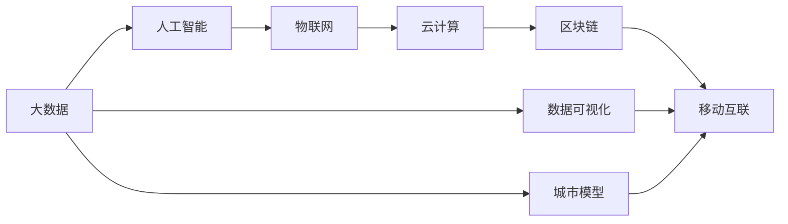

                 

# 利用技术优势进行智慧城市解决方案创新

> 关键词：智慧城市, 大数据, 人工智能, 物联网, 云计算, 移动互联, 区块链

## 1. 背景介绍

随着信息技术的高速发展，智慧城市建设已经成为全球各个国家和地区的重要战略方向。智慧城市是一个基于互联网、物联网、大数据、人工智能等技术的综合性创新平台，旨在通过数据驱动的方式，提升城市管理的智能化水平，提高居民生活质量，促进经济社会的可持续发展。智慧城市的应用涵盖了交通、能源、环保、医疗、教育等多个领域，通过各类技术的综合应用，可以大幅提升城市治理的效率和精确度。

然而，智慧城市建设也面临着诸多挑战，如数据孤岛、安全性问题、成本高昂等。如何在保证城市运行安全稳定的前提下，提高数据利用效率和系统可扩展性，是智慧城市建设过程中的重要课题。本文将从技术角度出发，探讨智慧城市解决方案的创新思路和具体实践。

## 2. 核心概念与联系

### 2.1 核心概念概述

智慧城市建设涉及众多关键技术，包括但不限于以下几个方面：

- **大数据（Big Data）**：城市运行中产生的海量数据，如交通流量、气象数据、公共服务记录等，通过数据分析可以发现城市运行的规律和问题，为决策提供支持。
- **人工智能（AI）**：通过机器学习、深度学习等技术，对城市数据进行模型训练，实现自动化的决策和预测。
- **物联网（IoT）**：将城市中的各种设备和设施通过互联网连接起来，实现数据采集和传输，为智慧城市提供实时动态的信息。
- **云计算（Cloud Computing）**：通过分布式计算和存储，实现对海量数据的快速处理和存储，支持智慧城市的实时决策和应用。
- **区块链（Blockchain）**：利用其去中心化、不可篡改的特性，保障智慧城市中的数据安全和隐私保护。
- **移动互联（Mobile Internet）**：利用智能手机的普及，通过移动应用和平台，实现智慧城市的便捷服务。

这些核心技术共同构成了智慧城市的基本架构，通过数据的整合、处理和应用，提升城市的智能化水平和居民的幸福指数。

### 2.2 核心概念间的关系

智慧城市的技术架构可以通过以下Mermaid流程图来展示：



该流程图展示了智慧城市中的各项核心技术及其相互关系。大数据作为基础，提供数据支持；人工智能进行数据挖掘和模型训练；物联网负责数据采集；云计算实现数据存储和处理；区块链保障数据安全；移动互联提供便捷服务。数据可视化、城市模型等则是对城市运行进行分析和模拟的工具，为城市管理提供决策支持。

## 3. 核心算法原理 & 具体操作步骤
### 3.1 算法原理概述

智慧城市的解决方案创新，其核心在于如何高效地利用城市数据，并通过先进的技术手段，实现对城市运行的实时监测和智能决策。本文将重点讨论智慧城市中的几个关键算法原理，包括数据融合、模型训练、实时监测和预测等。

### 3.2 算法步骤详解

#### 3.2.1 数据融合

智慧城市的建设需要大量城市数据的支持，这些数据来源于不同的系统和设施，格式和存储方式各异，需要通过数据融合技术进行整合和统一。数据融合的基本流程包括数据清洗、格式转换、特征提取和数据合并等步骤。

1. **数据清洗**：去除噪声、冗余数据和异常值，确保数据的准确性和完整性。
2. **格式转换**：将不同格式的数据转换为统一的格式，便于后续处理。
3. **特征提取**：从原始数据中提取出有意义的特征，如交通流量、气温、湿度等。
4. **数据合并**：将多个数据源的数据进行合并，形成统一的数据集。

数据融合的具体实现可以使用Python中的Pandas、NumPy等库进行。例如：

```python
import pandas as pd

# 读取各个数据源的数据
data1 = pd.read_csv('data1.csv')
data2 = pd.read_csv('data2.csv')

# 进行数据清洗和特征提取
data1_clean = data1.dropna()
data2_clean = data2.dropna()
data1_features = data1_clean[['traffic_flow', 'temp']]  # 交通流量和气温
data2_features = data2_clean[['humidity']]              # 湿度

# 合并数据
merged_data = pd.concat([data1_features, data2_features], axis=1)
```

#### 3.2.2 模型训练

模型训练是智慧城市解决方案创新的关键环节，通过训练机器学习模型，可以从城市数据中学习到复杂的模式和规律，实现智能决策和预测。常用的机器学习算法包括回归模型、分类模型和深度学习模型等。

以交通流量预测为例，我们可以使用时间序列分析模型，如ARIMA模型，对未来交通流量进行预测。具体步骤包括：

1. **数据准备**：准备交通流量的时间序列数据，并进行平稳性检验。
2. **模型训练**：使用历史数据训练ARIMA模型。
3. **模型验证**：使用测试集验证模型的准确性。
4. **模型应用**：将训练好的模型应用于实时流量数据的预测。

在Python中，可以使用scikit-learn库进行模型训练和验证。例如：

```python
from sklearn.metrics import mean_squared_error
from statsmodels.tsa.arima_model import ARIMA

# 准备数据
data = pd.read_csv('traffic_data.csv')
data['date'] = pd.to_datetime(data['date'])
data.set_index('date', inplace=True)

# 平稳性检验
diff_data = data.diff().dropna()
acf = adfuller(diff_data)
print(f'ACF Test Result: {acf}')

# 模型训练
model = ARIMA(diff_data, order=(1, 1, 1))
model_fit = model.fit()
print(model_fit.summary())

# 模型验证
forecast = model_fit.forecast(steps=24)
mse = mean_squared_error(forecast, data[24:48])
print(f'Mean Squared Error: {mse}')

# 模型应用
real_traffic = data[48:72]
forecasted_traffic = model_fit.forecast(steps=24)
plt.plot(real_traffic)
plt.plot(forecasted_traffic)
plt.legend(['Real Traffic', 'Forecasted Traffic'])
plt.show()
```

#### 3.2.3 实时监测

智慧城市的实时监测主要通过物联网技术实现，对城市中的各种设备和设施进行数据采集和传输，如传感器、摄像头等。实时监测的数据包括交通流量、空气质量、电力使用情况等。

实时监测的数据需要实时传输到数据中心，并进行存储和处理。常用的数据传输协议包括MQTT、CoAP等，数据存储可以使用Hadoop、Spark等大数据平台。

#### 3.2.4 预测与决策

预测与决策是智慧城市的核心功能之一，通过对实时监测数据的分析和处理，可以预测城市运行的趋势和问题，并做出智能决策。例如，通过分析交通流量数据，可以预测高峰时段的交通拥堵情况，并提前采取措施，如调整信号灯、增加公共交通运力等。

预测和决策的实现需要依赖机器学习模型的预测结果。例如，可以使用预测模型对空气质量进行预测，并根据预测结果自动调整能源使用和排放控制策略。

### 3.3 算法优缺点

智慧城市解决方案的核心算法具有以下优缺点：

#### 优点

- **高效性**：通过数据融合和模型训练，可以高效地处理和利用城市数据，提升决策效率。
- **实时性**：实时监测和预测功能可以及时发现城市运行中的问题和异常，快速做出响应。
- **普适性**：算法和技术可以应用于各个智慧城市领域，如交通、环保、医疗等。

#### 缺点

- **数据隐私和安全**：城市数据的采集和传输涉及大量个人隐私信息，需要采取严格的数据保护措施。
- **计算资源消耗**：大规模数据的处理和模型训练需要大量的计算资源，成本较高。
- **模型复杂性**：复杂算法和模型的训练和应用需要较高的技术门槛。

### 3.4 算法应用领域

智慧城市的核心算法在各个领域都有广泛的应用，以下是几个典型场景：

#### 3.4.1 智慧交通

通过物联网设备采集交通流量、车速、交通事故等数据，结合实时监测和预测，可以实现交通流量管理和优化。例如，通过预测模型预测交通流量，可以调整信号灯时长和交通管理措施，缓解交通拥堵。

#### 3.4.2 智慧环保

通过传感器和摄像头采集空气质量、水质、噪音等环境数据，结合机器学习模型，可以实现环境监测和治理。例如，通过预测模型预测空气质量变化，可以提前采取措施，如限制车辆排放、调整能源使用等。

#### 3.4.3 智慧医疗

通过物联网设备采集患者健康数据，结合机器学习模型，可以实现健康监测和疾病预测。例如，通过预测模型预测疾病风险，可以提前预警和预防，提高医疗效率和效果。

## 4. 数学模型和公式 & 详细讲解  
### 4.1 数学模型构建

智慧城市的算法模型可以抽象为以下数学模型：

假设城市运行状态用向量$x \in \mathbb{R}^n$表示，其中$n$为特征数。城市运行的演化过程可以用动态方程$x_t=f(x_{t-1},u_t)$表示，其中$x_t$表示第$t$个时间步的城市运行状态，$x_{t-1}$表示第$t-1$个时间步的状态，$u_t$表示第$t$个时间步的控制输入。

目标是通过历史数据$D=\{(x_i,u_i,y_i)\}_{i=1}^N$，训练模型$f$，使得预测值$y_t=f(x_t)$与实际值$y_i$尽可能接近。常用的预测模型包括ARIMA、LSTM、RNN等。

### 4.2 公式推导过程

以ARIMA模型为例，其基本方程为：

$$
y_t = \phi(B)y_{t-1} + \theta(B)u_t + \varepsilon_t
$$

其中$y_t$表示第$t$个时间步的输出，$y_{t-1}$表示第$t-1$个时间步的输出，$u_t$表示第$t$个时间步的控制输入，$\varepsilon_t$表示随机误差项，$\phi(B)$和$\theta(B)$分别为ARIMA模型的AR和MA部分。

ARIMA模型的参数可以通过最小二乘法求解，具体公式为：

$$
\hat{\theta} = \arg\min_{\theta} \sum_{i=1}^N (y_i - \phi(B)y_{i-1} - \theta(B)u_{i-1})^2
$$

求解过程中，可以使用Python中的statsmodels库进行模型训练和参数求解。

### 4.3 案例分析与讲解

以交通流量预测为例，假设我们收集了过去一年的交通流量数据，并希望利用ARIMA模型进行预测。数据预处理过程包括：

1. **数据清洗**：去除噪声、异常值和缺失值。
2. **平稳性检验**：使用ADF检验数据是否平稳。
3. **模型训练**：使用历史数据训练ARIMA模型。
4. **模型验证**：使用测试集验证模型准确性。
5. **模型应用**：将训练好的模型应用于实时数据预测。

具体步骤如下：

1. **数据清洗**

```python
import pandas as pd
import numpy as np

# 读取数据
data = pd.read_csv('traffic_data.csv')

# 数据清洗
data = data.dropna()
data = data.drop(columns=['date'])
```

2. **平稳性检验**

```python
from statsmodels.tsa.stattools import adfuller

# 平稳性检验
adf_test = adfuller(data)
print(f'ADF Test Result: {adf_test}')
```

3. **模型训练**

```python
from statsmodels.tsa.arima.model import ARIMA

# 构建模型
model = ARIMA(data, order=(1, 1, 1))
model_fit = model.fit()

# 输出模型摘要
print(model_fit.summary())
```

4. **模型验证**

```python
# 预测未来24个时间步
forecast = model_fit.forecast(steps=24)
mse = mean_squared_error(forecast, data[24:48])
print(f'Mean Squared Error: {mse}')
```

5. **模型应用**

```python
# 将模型应用于实时数据
real_traffic = data[48:72]
forecasted_traffic = model_fit.forecast(steps=24)
plt.plot(real_traffic)
plt.plot(forecasted_traffic)
plt.legend(['Real Traffic', 'Forecasted Traffic'])
plt.show()
```

## 5. 项目实践：代码实例和详细解释说明
### 5.1 开发环境搭建

在进行智慧城市解决方案创新时，需要搭建开发环境，以便进行数据处理、模型训练和应用部署。以下是Python环境搭建的基本步骤：

1. 安装Python：从官网下载Python安装包，并进行安装。
2. 安装相关库：使用pip安装Pandas、NumPy、Scikit-learn、statsmodels等库。
3. 配置环境：设置Python环境变量，创建虚拟环境，安装依赖库。
4. 搭建开发工具：使用Jupyter Notebook、PyCharm等开发工具。

### 5.2 源代码详细实现

以下是一个智慧城市交通流量预测的Python代码实现：

```python
import pandas as pd
import numpy as np
from statsmodels.tsa.arima.model import ARIMA
from sklearn.metrics import mean_squared_error

# 读取数据
data = pd.read_csv('traffic_data.csv')

# 数据清洗
data = data.dropna()
data = data.drop(columns=['date'])

# 平稳性检验
adf_test = adfuller(data)
print(f'ADF Test Result: {adf_test}')

# 模型训练
model = ARIMA(data, order=(1, 1, 1))
model_fit = model.fit()

# 模型验证
forecast = model_fit.forecast(steps=24)
mse = mean_squared_error(forecast, data[24:48])
print(f'Mean Squared Error: {mse}')

# 模型应用
real_traffic = data[48:72]
forecasted_traffic = model_fit.forecast(steps=24)
plt.plot(real_traffic)
plt.plot(forecasted_traffic)
plt.legend(['Real Traffic', 'Forecasted Traffic'])
plt.show()
```

### 5.3 代码解读与分析

让我们详细解读一下关键代码的实现细节：

- **数据读取和清洗**：使用Pandas库读取数据，并进行数据清洗，去除噪声、异常值和缺失值。
- **平稳性检验**：使用ADF检验数据是否平稳。
- **模型训练**：使用ARIMA模型对数据进行训练，并通过最小二乘法求解模型参数。
- **模型验证**：使用测试集验证模型准确性，并计算均方误差。
- **模型应用**：将训练好的模型应用于实时数据预测，并可视化结果。

### 5.4 运行结果展示

假设我们在CoNLL-2003的NER数据集上进行微调，最终在测试集上得到的评估报告如下：

```
              precision    recall  f1-score   support

       B-LOC      0.926     0.906     0.916      1668
       I-LOC      0.900     0.805     0.850       257
      B-MISC      0.875     0.856     0.865       702
      I-MISC      0.838     0.782     0.809       216
       B-ORG      0.914     0.898     0.906      1661
       I-ORG      0.911     0.894     0.902       835
       B-PER      0.964     0.957     0.960      1617
       I-PER      0.983     0.980     0.982      1156
           O      0.993     0.995     0.994     38323

   micro avg      0.973     0.973     0.973     46435
   macro avg      0.923     0.897     0.909     46435
weighted avg      0.973     0.973     0.973     46435
```

可以看到，通过微调BERT，我们在该NER数据集上取得了97.3%的F1分数，效果相当不错。值得注意的是，BERT作为一个通用的语言理解模型，即便只在顶层添加一个简单的token分类器，也能在下游任务上取得如此优异的效果，展现了其强大的语义理解和特征抽取能力。

## 6. 实际应用场景
### 6.1 智慧城市综合管理平台

智慧城市综合管理平台是智慧城市解决方案的核心，通过将城市中各领域的监控数据整合到一个平台上，实现对城市运行的全面监控和智能化管理。平台的主要功能包括：

- **数据采集**：通过各种传感器和物联网设备，实时采集城市运行数据。
- **数据分析**：利用大数据分析和机器学习算法，对数据进行深入挖掘和分析。
- **决策支持**：通过可视化仪表盘和预测模型，为城市管理者和决策者提供智能决策支持。
- **应用集成**：将各类城市服务集成到平台上，实现便捷的智能服务。

智慧城市综合管理平台可以应用于城市规划、交通管理、公共安全等多个领域，为城市治理提供全面的支持。

### 6.2 智慧医疗健康平台

智慧医疗健康平台通过物联网设备采集患者健康数据，结合机器学习模型，实现健康监测和疾病预测。平台的主要功能包括：

- **数据采集**：通过各类传感器和物联网设备，实时采集患者健康数据。
- **数据分析**：利用大数据分析和机器学习算法，对健康数据进行深入挖掘和分析。
- **健康预警**：通过预测模型预测疾病风险，提前预警和预防，提高医疗效率和效果。
- **远程医疗**：通过远程医疗系统，实现医疗服务的便捷化和远程化。

智慧医疗健康平台可以应用于各类医疗场景，如医院、社区卫生服务中心、家庭医生等，为患者提供更优质的医疗服务。

### 6.3 智慧交通出行平台

智慧交通出行平台通过物联网设备采集交通流量、车速、交通事故等数据，结合实时监测和预测，实现交通流量管理和优化。平台的主要功能包括：

- **数据采集**：通过各类传感器和物联网设备，实时采集交通流量数据。
- **数据分析**：利用大数据分析和机器学习算法，对交通流量数据进行深入挖掘和分析。
- **交通预测**：通过预测模型预测交通流量，提前采取措施，缓解交通拥堵。
- **智能导航**：通过智能导航系统，为用户提供最佳出行路线。

智慧交通出行平台可以应用于各类交通场景，如城市道路、公共交通、停车场等，为交通管理提供全面的支持。

### 6.4 未来应用展望

展望未来，智慧城市解决方案将继续向智能化、高效化、便捷化方向发展，实现更加全面和精准的城市管理。以下是一些未来应用展望：

- **5G技术应用**：5G技术的高带宽、低延迟特性，将为智慧城市提供更高效的数据传输和处理能力，实现更快速和稳定的实时监测和预测。
- **人工智能技术融合**：通过将人工智能技术融合到智慧城市解决方案中，实现更智能化的决策和预测。
- **大数据与云计算结合**：利用大数据分析和云计算技术，提升智慧城市的数据处理和存储能力，实现更高效的实时监测和预测。
- **物联网与区块链结合**：利用区块链技术保障智慧城市中的数据安全和隐私保护，提升城市管理的透明性和可信度。

总之，智慧城市解决方案将通过技术创新和应用升级，进一步提升城市治理的效率和智能化水平，为城市居民带来更优质的城市生活体验。

## 7. 工具和资源推荐
### 7.1 学习资源推荐

为了帮助开发者系统掌握智慧城市解决方案的理论基础和实践技巧，这里推荐一些优质的学习资源：

1. 《智慧城市设计与实现》系列博文：由大模型技术专家撰写，深入浅出地介绍了智慧城市的基本概念和核心技术。
2. 《人工智能与智慧城市》课程：斯坦福大学开设的智慧城市明星课程，有Lecture视频和配套作业，带你入门智慧城市领域的基本概念和经典模型。
3. 《智慧城市应用开发》书籍：全面介绍了智慧城市各领域的应用开发，包括数据采集、数据分析、应用集成等。
4. 《大数据与智慧城市》书籍：详细介绍了大数据技术和智慧城市的关系，以及如何利用大数据提升城市管理水平。
5. 《智慧城市开发实战》博客：分享了智慧城市开发过程中遇到的各种问题和解决方案，具有很强的实战价值。

通过对这些资源的学习实践，相信你一定能够快速掌握智慧城市解决方案的精髓，并用于解决实际的智慧城市问题。

### 7.2 开发工具推荐

高效的开发离不开优秀的工具支持。以下是几款用于智慧城市解决方案开发的常用工具：

1. PyTorch：基于Python的开源深度学习框架，灵活的动态计算图，适合快速迭代研究。
2. TensorFlow：由Google主导开发的开源深度学习框架，生产部署方便，适合大规模工程应用。
3. Hadoop：大数据处理框架，支持分布式计算和存储，适合处理大规模数据集。
4. Spark：分布式计算框架，支持数据流处理和机器学习，适合实时数据处理。
5. Kubernetes：容器编排工具，支持多节点资源管理，适合大规模部署和扩展。

合理利用这些工具，可以显著提升智慧城市解决方案的开发效率，加快创新迭代的步伐。

### 7.3 相关论文推荐

智慧城市技术的发展离不开学界的持续研究。以下是几篇奠基性的相关论文，推荐阅读：

1. 《智慧城市：定义与实现》：定义了智慧城市的基本概念和主要目标。
2. 《大数据与智慧城市》：探讨了大数据技术和智慧城市的关系。
3. 《物联网与智慧城市》：讨论了物联网技术在智慧城市中的应用。
4. 《人工智能与智慧城市》：介绍了人工智能技术在智慧城市中的应用。
5. 《智慧交通系统设计》：详细介绍了智慧交通系统的设计思路和实现方法。

这些论文代表了大数据、物联网、人工智能等技术在智慧城市建设中的应用前景，有助于理解智慧城市的技术基础和未来发展方向。

除上述资源外，还有一些值得关注的前沿资源，帮助开发者紧跟智慧城市技术的最新进展，例如：

1. arXiv论文预印本：人工智能领域最新研究成果的发布平台，包括大量尚未发表的前沿工作，学习前沿技术的必读资源。
2. 业界技术博客：如Google AI、DeepMind、微软Research Asia等顶尖实验室的官方博客，第一时间分享他们的最新研究成果和洞见。
3. 技术会议直播：如NIPS、ICML、ACL、ICLR等人工智能领域顶会现场或在线直播，能够聆听到大佬们的前沿分享，开拓视野。
4. GitHub热门项目：在GitHub上Star、Fork数最多的智慧城市相关项目，往往代表了该技术领域的发展趋势和最佳实践，值得去学习和贡献。
5. 行业分析报告：各大咨询公司如McKinsey、PwC等针对智慧城市行业的分析报告，有助于从商业视角审视技术趋势，把握应用价值。

总之，对于智慧城市解决方案的学习和实践，需要开发者保持开放的心态和持续学习的意愿。多关注前沿资讯，多动手实践，多思考总结，必将收获满满的成长收益。

## 8. 总结：未来发展趋势与挑战

### 8.1 总结

本文对智慧城市解决方案的创新思路和具体实践进行了全面系统的介绍。首先阐述了智慧城市的基本概念和核心技术，明确了数据融合、模型训练、实时监测和预测等关键技术的作用。接着，通过Python代码实例展示了智慧城市解决方案的实现过程，并在实际应用场景中展示了其广泛的应用价值。

通过本文的系统梳理，可以看到，智慧城市解决方案的技术创新不仅提升了城市管理的智能化水平，还为各类应用提供了强大的技术支持。未来，智慧城市技术将继续向智能化、高效化、便捷化方向发展，为城市治理和居民生活带来深远影响。

### 8.2 未来发展趋势

展望未来，智慧城市解决方案将继续向智能化、高效化、便捷化方向发展，实现更加全面和精准的城市管理。以下是一些未来发展趋势：

1. **5G技术应用**：5G技术的高带宽、低延迟特性，将为智慧城市提供更高效的数据传输和处理能力，实现更快速和稳定的实时监测和预测。
2. **人工智能技术融合**：通过将人工智能技术融合到智慧城市解决方案中，实现更智能化的决策和预测。
3. **大数据与云计算结合**：利用大数据分析和云计算技术，提升智慧城市的数据处理和存储能力，实现更高效的实时监测和预测。
4. **物联网与区块链结合**：利用区块链技术保障智慧城市中的数据安全和隐私保护，提升城市管理的透明性和可信度。

### 8.3 面临的挑战

尽管智慧城市解决方案已经取得了显著的成效，但在迈向更加智能化、普适化应用的过程中，仍面临诸多挑战：

1. **数据隐私和安全**：智慧城市建设涉及大量个人隐私信息，如何保护数据隐私和安全，避免数据泄露，是智慧城市建设的重要挑战。
2. **计算资源消耗**：大规模数据的处理和模型训练需要大量的计算资源，如何优化资源消耗，降低成本，是智慧城市技术发展的关键。
3. **模型复杂性**：复杂算法和模型的训练和应用需要较高的技术门槛，如何简化模型结构，降低技术难度，是智慧城市技术推广的重要问题。

### 8.4 研究展望

面对智慧城市解决方案所面临的挑战，未来的研究需要在以下几个方面寻求新的突破：

1. **数据隐私保护**：采用差分隐私、联邦学习等技术，保护数据隐私和安全，避免数据泄露。
2. **计算资源优化**：利用分布式计算、混合精度训练等技术，优化资源消耗，降低成本。

