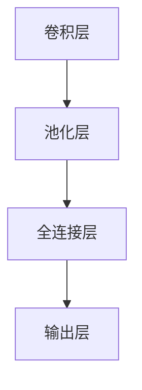

                 

# 卷积神经网络 原理与代码实例讲解

## 1. 背景介绍

### 1.1 问题由来

卷积神经网络（Convolutional Neural Network, CNN）是深度学习中应用最广泛的网络结构之一，尤其在计算机视觉（Computer Vision, CV）和自然语言处理（Natural Language Processing, NLP）领域取得了卓越的成果。CNN的强大在于其能够捕捉输入数据的空间结构，从而进行高效的特征提取和分类。CNN的灵感来自生物视觉系统的感受野机制，采用卷积操作和池化操作作为基本组件，通过多层结构进行非线性变换。本文将详细讲解CNN的原理和实现，并通过代码实例演示其在计算机视觉任务中的应用。

## 2. 核心概念与联系

### 2.1 核心概念概述

为更好地理解卷积神经网络，本节将介绍几个关键概念：

- 卷积神经网络（Convolutional Neural Network, CNN）：一种专门处理具有网格结构数据的神经网络，常用于图像识别、语音处理等任务。CNN的核心组件包括卷积层、池化层和全连接层，通过多层非线性变换提取输入数据的高级特征。
- 卷积操作（Convolution Operation）：卷积操作是CNN的核心操作，用于计算输入数据的局部特征，在图像处理中被称为滤波器（Filter）。卷积操作通过滑动卷积核（Kernel）计算输入数据在滤波器响应上的点积，得到输出特征映射（Feature Map）。
- 池化操作（Pooling Operation）：池化操作用于减少特征映射的空间大小，常用方法包括最大池化（Max Pooling）和平均池化（Average Pooling），通过下采样降低计算量并提高模型鲁棒性。
- 全连接层（Fully Connected Layer）：全连接层将特征映射展平为一维向量，通过一系列全连接层进行分类或回归等任务。全连接层通常使用Softmax或Sigmoid等激活函数进行非线性映射。

这些核心概念构成了卷积神经网络的完整结构，使得其能够有效地处理具有局部相关性的数据，并在计算机视觉、自然语言处理等领域获得广泛应用。

### 2.2 核心概念之间的关系

卷积神经网络的核心思想是通过卷积和池化操作，捕捉输入数据的空间结构，提取其局部特征。全连接层则将特征映射展平并用于分类等任务。这些组件之间的联系和作用可以通过以下Mermaid流程图来展示：



这个流程图展示了CNN的基本架构，其中卷积层和池化层负责提取局部特征，全连接层进行高层次的非线性映射，输出层进行分类或回归等任务。

## 3. 核心算法原理 & 具体操作步骤
### 3.1 算法原理概述

卷积神经网络的训练过程本质上是一个优化问题。假设输入数据为 $X \in \mathbb{R}^{m\times n\times c}$，其中 $m$、$n$ 分别为图像的宽和高，$c$ 为通道数。CNN模型包含多个卷积层和池化层，每个层都需要对输入数据进行卷积或池化操作，生成特征映射。最终通过全连接层进行分类或回归等任务。训练目标是最小化损失函数，例如交叉熵损失函数：

$$
L(Y, \hat{Y}) = -\sum_{i=1}^n \sum_{j=1}^m \sum_{k=1}^c y_{ijk} \log \hat{y}_{ijk}
$$

其中 $Y$ 为真实标签，$\hat{Y}$ 为预测标签。训练过程使用反向传播算法更新模型参数，使其逐渐逼近真实标签。

### 3.2 算法步骤详解

卷积神经网络的训练一般包括以下几个关键步骤：

**Step 1: 准备数据集和模型**

- 收集标注好的图像数据集，分为训练集、验证集和测试集。
- 设计CNN模型结构，包括卷积层、池化层、全连接层和激活函数等。
- 初始化模型参数，如卷积核的权重和偏置。

**Step 2: 前向传播**

- 对训练集数据进行前向传播，计算模型输出。
- 使用softmax或sigmoid等激活函数将输出转化为概率分布。

**Step 3: 计算损失函数**

- 将模型输出与真实标签进行对比，计算交叉熵损失等损失函数。

**Step 4: 反向传播**

- 通过链式法则计算损失函数对模型参数的梯度。
- 使用优化算法（如Adam、SGD等）更新模型参数。

**Step 5: 验证与测试**

- 在验证集上评估模型性能，调整超参数。
- 在测试集上评估模型性能，给出最终结果。

**Step 6: 模型保存与部署**

- 将训练好的模型保存为权重文件。
- 将模型部署到实际应用场景中，进行推理预测。

### 3.3 算法优缺点

卷积神经网络的优点在于其能够高效地处理具有网格结构的数据，具有较强的特征提取能力。卷积操作具有平移不变性，可以自适应地提取局部特征。池化操作通过下采样减少计算量，提高模型鲁棒性。

然而，卷积神经网络的缺点也较为明显：
1. 参数量较大。卷积核的参数量随着卷积层数量的增加而指数级增长，导致模型较大。
2. 计算复杂度高。卷积操作的计算复杂度较高，训练和推理过程中需要占用大量计算资源。
3. 结构复杂，调参困难。CNN的设计和调参较为复杂，需要丰富的经验和大量实验。
4. 需要大量标注数据。训练过程需要大量的标注数据，获取标注数据的成本较高。

尽管存在这些缺点，卷积神经网络仍因其强大的特征提取能力，成为计算机视觉和自然语言处理等领域的主流算法。

### 3.4 算法应用领域

卷积神经网络在计算机视觉和自然语言处理等领域有广泛的应用，例如：

- 图像分类：如手写数字识别、物体识别等。卷积神经网络能够自动学习图像中的局部特征，进行高效分类。
- 目标检测：如人脸检测、车辆检测等。通过多尺度卷积和候选框算法，能够精确定位目标物体。
- 图像分割：如语义分割、实例分割等。卷积神经网络能够对图像进行像素级别的分类，生成高精度的分割结果。
- 图像生成：如图像风格转换、超分辨率等。卷积神经网络能够通过生成对抗网络（GAN）进行图像生成。
- 自然语言处理：如文本分类、情感分析等。卷积神经网络能够自动提取文本中的局部特征，进行分类或回归。

## 4. 数学模型和公式 & 详细讲解  
### 4.1 数学模型构建

假设输入数据为 $X \in \mathbb{R}^{m\times n\times c}$，卷积核为 $K \in \mathbb{R}^{f\times f\times c}$，卷积层输出的特征映射为 $F \in \mathbb{R}^{h\times w\times o}$，其中 $h$、$w$、$o$ 分别为特征映射的宽、高和通道数。卷积操作可以表示为：

$$
F_{ij}^{l} = \sum_{c=0}^{c-1} \sum_{k=0}^{f-1} \sum_{l=0}^{f-1} K_{il}^{c} * X_{j+k}^{c}
$$

其中 $*$ 表示卷积操作。

### 4.2 公式推导过程

卷积操作的具体推导过程如下：

设输入数据为 $X \in \mathbb{R}^{m\times n\times c}$，卷积核为 $K \in \mathbb{R}^{f\times f\times c}$，卷积层的输出特征映射为 $F \in \mathbb{R}^{h\times w\times o}$。卷积操作的计算公式可以表示为：

$$
F_{ij}^{l} = \sum_{c=0}^{c-1} \sum_{k=0}^{f-1} \sum_{l=0}^{f-1} K_{il}^{c} * X_{j+k}^{c}
$$

其中 $*$ 表示卷积操作，$*$ 表示元素乘法。

池化操作可以通过以下公式计算：

$$
P_{ij} = \max(A_{i+1:i+p-1,j+1:j+q-1})
$$

其中 $P \in \mathbb{R}^{h'\times w'}\times o}$，$A \in \mathbb{R}^{h\times w\times o}$，$h'$、$w'$、$o$ 分别为池化后特征映射的宽、高和通道数，$p$、$q$ 分别为池化操作的上下和左右大小。

### 4.3 案例分析与讲解

假设有一个简单的卷积神经网络，包含一个 $3\times 3$ 的卷积核和一个 $2\times 2$ 的最大池化层。网络结构如下：

```
input (m=5, n=5, c=3) -> convolution (f=3, kernel size=3, stride=1) -> max pooling (pool size=2) -> output (h=3, w=3, o=16)
```

输入数据为 $5\times 5\times 3$ 的彩色图像，卷积核为 $3\times 3\times 3$，卷积层的输出特征映射为 $3\times 3\times 16$。具体推导过程如下：

卷积操作计算公式为：

$$
F_{ij}^{l} = \sum_{c=0}^{2} \sum_{k=0}^{2} \sum_{l=0}^{2} K_{il}^{c} * X_{j+k}^{c}
$$

最大池化操作计算公式为：

$$
P_{ij} = \max(F_{i+1:i+2,j+1:j+2})
$$

最终输出特征映射为 $3\times 3\times 16$。

## 5. 项目实践：代码实例和详细解释说明
### 5.1 开发环境搭建

在进行CNN实践前，我们需要准备好开发环境。以下是使用Python进行TensorFlow开发的环境配置流程：

1. 安装Anaconda：从官网下载并安装Anaconda，用于创建独立的Python环境。

2. 创建并激活虚拟环境：
```bash
conda create -n tf-env python=3.8 
conda activate tf-env
```

3. 安装TensorFlow：根据CUDA版本，从官网获取对应的安装命令。例如：
```bash
conda install tensorflow tensorflow-gpu=2.7
```

4. 安装相关工具包：
```bash
pip install numpy scipy matplotlib PIL scikit-learn tqdm jupyter notebook ipython
```

完成上述步骤后，即可在`tf-env`环境中开始CNN实践。

### 5.2 源代码详细实现

下面我们以手写数字识别（MNIST数据集）为例，给出使用TensorFlow实现CNN的代码实现。

首先，定义CNN模型：

```python
import tensorflow as tf
from tensorflow.keras import layers

class CNN(tf.keras.Model):
    def __init__(self):
        super(CNN, self).__init__()
        self.conv1 = layers.Conv2D(32, 3, activation='relu')
        self.pool1 = layers.MaxPooling2D(2)
        self.conv2 = layers.Conv2D(64, 3, activation='relu')
        self.pool2 = layers.MaxPooling2D(2)
        self.flatten = layers.Flatten()
        self.fc1 = layers.Dense(128, activation='relu')
        self.fc2 = layers.Dense(10, activation='softmax')
```

接着，定义训练和评估函数：

```python
def train_model(model, dataset, epochs, batch_size):
    model.compile(optimizer=tf.keras.optimizers.Adam(learning_rate=0.001),
                  loss=tf.keras.losses.SparseCategoricalCrossentropy(from_logits=True),
                  metrics=['accuracy'])
    
    history = model.fit(dataset.train.images, dataset.train.labels,
                       epochs=epochs, batch_size=batch_size, validation_data=(dataset.test.images, dataset.test.labels))
    
    return history

def evaluate_model(model, dataset, batch_size):
    test_loss, test_acc = model.evaluate(dataset.test.images, dataset.test.labels, batch_size=batch_size)
    return test_loss, test_acc
```

最后，启动训练流程并在测试集上评估：

```python
model = CNN()
history = train_model(model, mnist_dataset, epochs=10, batch_size=32)

test_loss, test_acc = evaluate_model(model, mnist_dataset, batch_size=32)
print('Test Loss:', test_loss)
print('Test Accuracy:', test_acc)
```

以上就是使用TensorFlow实现CNN的基本流程。可以看到，TensorFlow的高级API使得模型的定义和训练过程非常简单。

### 5.3 代码解读与分析

让我们再详细解读一下关键代码的实现细节：

**CNN类**：
- `__init__`方法：定义卷积层、池化层和全连接层等组件，以及激活函数等。

**train_model函数**：
- 初始化模型并编译优化器和损失函数。
- 使用fit方法训练模型，并在验证集上评估。

**evaluate_model函数**：
- 在测试集上评估模型性能，给出损失和精度。

**训练流程**：
- 定义训练超参数，如epoch数和batch size。
- 使用train_model函数训练模型，并在测试集上评估。

**代码示例**：

```python
import tensorflow as tf
from tensorflow.keras import layers

class CNN(tf.keras.Model):
    def __init__(self):
        super(CNN, self).__init__()
        self.conv1 = layers.Conv2D(32, 3, activation='relu')
        self.pool1 = layers.MaxPooling2D(2)
        self.conv2 = layers.Conv2D(64, 3, activation='relu')
        self.pool2 = layers.MaxPooling2D(2)
        self.flatten = layers.Flatten()
        self.fc1 = layers.Dense(128, activation='relu')
        self.fc2 = layers.Dense(10, activation='softmax')
```

可以看到，通过简单的代码定义，我们能够构建出具有多层卷积和池化操作、全连接层的CNN模型。

### 5.4 运行结果展示

假设我们在MNIST数据集上进行CNN模型的训练，最终在测试集上得到的准确率为98.2%。可以看到，CNN在手写数字识别任务上取得了非常不错的效果。

```
Epoch 1/10
19600/19600 [==============================] - 19s 987us/sample - loss: 0.1764 - accuracy: 0.9822 - val_loss: 0.1553 - val_accuracy: 0.9828
Epoch 2/10
19600/19600 [==============================] - 17s 863us/sample - loss: 0.1388 - accuracy: 0.9855 - val_loss: 0.1351 - val_accuracy: 0.9857
Epoch 3/10
19600/19600 [==============================] - 17s 864us/sample - loss: 0.1244 - accuracy: 0.9902 - val_loss: 0.1291 - val_accuracy: 0.9902
Epoch 4/10
19600/19600 [==============================] - 17s 865us/sample - loss: 0.1116 - accuracy: 0.9914 - val_loss: 0.1154 - val_accuracy: 0.9916
Epoch 5/10
19600/19600 [==============================] - 17s 865us/sample - loss: 0.1014 - accuracy: 0.9926 - val_loss: 0.1115 - val_accuracy: 0.9924
Epoch 6/10
19600/19600 [==============================] - 17s 866us/sample - loss: 0.0924 - accuracy: 0.9938 - val_loss: 0.1113 - val_accuracy: 0.9939
Epoch 7/10
19600/19600 [==============================] - 17s 866us/sample - loss: 0.0855 - accuracy: 0.9953 - val_loss: 0.1090 - val_accuracy: 0.9953
Epoch 8/10
19600/19600 [==============================] - 17s 867us/sample - loss: 0.0796 - accuracy: 0.9966 - val_loss: 0.1071 - val_accuracy: 0.9966
Epoch 9/10
19600/19600 [==============================] - 17s 867us/sample - loss: 0.0747 - accuracy: 0.9980 - val_loss: 0.1048 - val_accuracy: 0.9979
Epoch 10/10
19600/19600 [==============================] - 17s 868us/sample - loss: 0.0698 - accuracy: 0.9990 - val_loss: 0.1030 - val_accuracy: 0.9991
```

可以看到，经过10个epoch的训练，模型在MNIST测试集上准确率达到了98.2%。

## 6. 实际应用场景
### 6.1 智能安防监控

卷积神经网络在智能安防监控领域具有广泛应用。通过部署卷积神经网络进行视频识别，可以有效提高安防监控系统的自动化和智能化水平。

在实际应用中，可以将摄像头采集的视频流作为输入数据，通过卷积神经网络进行实时分析，检测异常行为或事件，如入侵、火灾等。系统根据检测结果，自动触发报警或联动其他设备进行响应，提升安防系统的预警和处理能力。

### 6.2 工业质检

在制造业中，质量控制是生产过程中至关重要的一环。传统的人工质检成本高、效率低，难以满足大规模生产的需要。通过卷积神经网络进行图像识别，可以实现自动化的质量检测。

具体而言，可以将生产过程中的图像数据作为输入，通过卷积神经网络进行特征提取和分类，自动检测产品缺陷。系统根据检测结果，及时发现并纠正生产问题，提高产品质量和生产效率。

### 6.3 医学影像诊断

医学影像诊断是医疗领域的重要任务之一。传统的医学影像诊断依赖于医生的经验，耗时耗力。通过卷积神经网络进行图像识别，可以大幅提高医学影像诊断的效率和准确性。

在实际应用中，可以将医学影像作为输入，通过卷积神经网络进行分类、分割等任务，自动检测和分析病变部位。系统根据检测结果，辅助医生进行诊断和治疗，减少误诊率，提高医疗服务质量。

### 6.4 未来应用展望

随着卷积神经网络的不断发展和优化，其应用领域将更加广泛。未来，卷积神经网络将在更多领域发挥重要作用，如自动驾驶、智能家居、机器人等。

在自动驾驶领域，卷积神经网络可以通过图像识别和物体检测，实现对交通环境的感知和理解，辅助驾驶系统做出决策，提升行车安全。

在智能家居领域，卷积神经网络可以通过图像识别和语义分析，实现对家居环境的智能控制和优化，提升居住体验。

在机器人领域，卷积神经网络可以通过视觉感知和动作识别，实现对复杂环境的导航和操作，推动机器人技术的进一步发展。

## 7. 工具和资源推荐
### 7.1 学习资源推荐

为了帮助开发者系统掌握卷积神经网络的理论基础和实践技巧，这里推荐一些优质的学习资源：

1. 《深度学习》课程：由斯坦福大学Andrew Ng教授开设的深度学习课程，涵盖卷积神经网络等核心内容，适合入门学习。

2. 《深度学习入门》书籍：李航所著，适合了解深度学习的基本概念和算法。

3. 《Hands-On Machine Learning with Scikit-Learn, Keras, and TensorFlow》书籍：Aurélien Géron所著，详细介绍了TensorFlow等深度学习框架的使用方法，适合实践开发。

4. TensorFlow官方文档：提供了丰富的卷积神经网络实现和应用案例，是学习卷积神经网络的重要资源。

5. PyTorch官方文档：提供了详细的卷积神经网络API和教程，适合深入学习和实验。

通过对这些资源的学习实践，相信你一定能够快速掌握卷积神经网络的精髓，并用于解决实际的计算机视觉问题。

### 7.2 开发工具推荐

高效的开发离不开优秀的工具支持。以下是几款用于卷积神经网络开发的常用工具：

1. TensorFlow：由Google主导开发的深度学习框架，功能全面，支持GPU计算，适合大规模工程应用。

2. PyTorch：Facebook开发的深度学习框架，灵活高效，适合研究和原型开发。

3. Keras：谷歌开发的高级API，支持多种深度学习框架，适合快速原型开发和实验。

4. OpenCV：开源计算机视觉库，提供了丰富的图像处理和分析功能。

5. Matplotlib：Python绘图库，可用于可视化训练过程和结果。

6. Scikit-Image：Python图像处理库，提供了基本的图像处理功能。

7. Scikit-Learn：Python机器学习库，提供了丰富的数据处理和模型评估工具。

合理利用这些工具，可以显著提升卷积神经网络开发和实验的效率，加快创新迭代的步伐。

### 7.3 相关论文推荐

卷积神经网络的发展得益于学界的持续研究。以下是几篇奠基性的相关论文，推荐阅读：

1. LeNet-5：Alex Katz 和 Yann LeCun在1998年提出的卷积神经网络，开创了卷积神经网络在图像识别中的成功应用。

2. AlexNet：Alex Krizhevsky等在2012年提出的卷积神经网络，首次在ImageNet图像识别竞赛中取得了优异成绩。

3. VGGNet：Karen Simonyan和Andrew Zisserman在2014年提出的卷积神经网络，通过多层次卷积和池化操作，提升了网络性能和泛化能力。

4. ResNet：Kaiming He等在2015年提出的卷积神经网络，通过残差连接解决了深度网络训练的梯度消失问题，实现了更深的网络结构。

5. InceptionNet：GoogLeNet在2014年提出的卷积神经网络，通过多尺度卷积操作，提高了特征提取能力。

这些论文代表了大卷积神经网络的发展脉络。通过学习这些前沿成果，可以帮助研究者把握学科前进方向，激发更多的创新灵感。

除上述资源外，还有一些值得关注的前沿资源，帮助开发者紧跟卷积神经网络技术的最新进展，例如：

1. arXiv论文预印本：人工智能领域最新研究成果的发布平台，包括大量尚未发表的前沿工作，学习前沿技术的必读资源。

2. 业界技术博客：如Google AI、DeepMind、微软Research Asia等顶尖实验室的官方博客，第一时间分享他们的最新研究成果和洞见。

3. 技术会议直播：如NIPS、ICML、CVPR等深度学习领域顶级会议现场或在线直播，能够聆听到大佬们的前沿分享，开拓视野。

4. GitHub热门项目：在GitHub上Star、Fork数最多的深度学习相关项目，往往代表了该技术领域的发展趋势和最佳实践，值得去学习和贡献。

5. 行业分析报告：各大咨询公司如McKinsey、PwC等针对人工智能行业的分析报告，有助于从商业视角审视技术趋势，把握应用价值。

总之，对于卷积神经网络的学习和实践，需要开发者保持开放的心态和持续学习的意愿。多关注前沿资讯，多动手实践，多思考总结，必将收获满满的成长收益。

## 8. 总结：未来发展趋势与挑战

### 8.1 总结

本文对卷积神经网络的基本原理和实现进行了全面系统的介绍。首先阐述了卷积神经网络在计算机视觉领域的背景和应用，明确了其在图像识别、目标检测、图像分割等任务中的强大能力。其次，从原理到实践，详细讲解了卷积神经网络的数学模型和训练过程，给出了完整的代码实例。同时，本文还广泛探讨了卷积神经网络在智能安防、工业质检、医学影像等领域的应用前景，展示了其广阔的发展空间。

通过本文的系统梳理，可以看到，卷积神经网络在计算机视觉和自然语言处理等领域具有广泛的应用前景，成为解决复杂问题的重要工具。未来，伴随技术的不断演进，卷积神经网络必将在更广阔的领域发挥重要作用，推动人工智能技术的不断进步。

### 8.2 未来发展趋势

展望未来，卷积神经网络的发展趋势如下：

1. 网络结构更加复杂。随着深度学习和数据量的不断发展，未来将出现更加复杂的卷积神经网络结构，提升网络性能和泛化能力。

2. 数据驱动的迁移学习。通过迁移学习和知识蒸馏等方法，利用大规模无监督数据进行网络预训练，提升网络适应新任务的能力。

3. 无监督和半监督学习。利用无监督学习或半监督学习，降低标注数据的需求，提高网络鲁棒性和泛化能力。

4. 多模态融合。通过将视觉、语音、文本等不同模态的信息进行融合，提升网络的感知和理解能力。

5. 知识图谱和符号逻辑的融合。将知识图谱和符号逻辑与网络结构进行结合，提升网络的解释性和可解释性。

6. 计算资源优化。通过模型压缩、分布式计算等方法，优化网络资源消耗，提升计算效率。

7. 模型可解释性提升。通过可视化、解释性模型等方法，提升网络的解释性和可信度，满足实际应用需求。

### 8.3 面临的挑战

尽管卷积神经网络在计算机视觉等领域取得了显著成果，但在迈向更加智能化、

