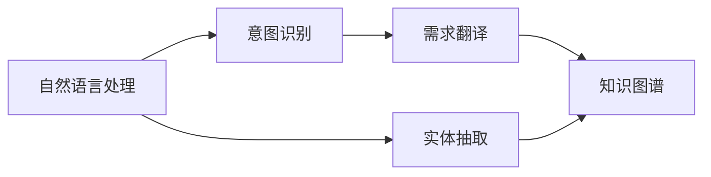

                 

# 口述需求快速生成工作流程的方法

## 1. 背景介绍

在软件开发过程中，快速准确地理解客户需求是至关重要的第一步。然而，面对客户复杂、模糊或口述的需求描述，往往难以快速生成有效的技术文档和需求规格说明书。如何在客户口述需求的基础上，高效地将其转化为结构化的需求文档，成为软件开发团队面临的一项重大挑战。

### 1.1 问题由来
口述需求，即客户直接以口头形式描述的软件需求，普遍存在于项目初期需求调研和需求变更阶段。口述需求的主要问题是：

- **模糊性**：客户对需求的描述常常是模糊、不完整的。
- **差异性**：不同客户口述需求的方式和内容可能差异很大。
- **多样性**：需求描述往往包含多种非技术性因素，如业务目标、用户需求等。

这些问题的存在，导致了需求获取阶段效率低下、误解和遗漏的风险增加。这些问题不仅影响软件开发的进度和质量，还容易导致后续的沟通障碍和项目失败。

### 1.2 问题核心关键点
口述需求快速生成工作流程的核心关键点包括：

- **准确性**：确保从口述需求中提取出的需求文档准确反映客户意图。
- **效率**：快速高效地将口述需求转化为可执行的文档。
- **结构化**：将模糊、不完整的需求转化为结构化的需求文档。
- **一致性**：保证不同阶段的文档一致性。

为了解决这些问题，本论文将系统介绍一种基于人工智能和自然语言处理技术，以实现口述需求快速生成的工作流程。

## 2. 核心概念与联系

### 2.1 核心概念概述

为了更好地理解基于口述需求快速生成工作流程的核心方法，本节将介绍几个关键概念：

- **自然语言处理（NLP）**：通过计算机技术处理、理解和生成人类语言，是口述需求快速生成的基础技术。
- **意图识别**：从客户口述需求中识别出客户的真正意图，如功能需求、性能要求等。
- **实体抽取**：从客户口述需求中识别出具体的名词或术语，如功能模块、数据实体等。
- **需求翻译**：将客户口述需求翻译为具体的技术需求，如代码实现、数据模型等。
- **知识图谱**：以图的形式，将实体间的关系进行结构化表示，有助于提高需求翻译的准确性。

这些核心概念之间存在着紧密的联系，构成了口述需求快速生成工作流程的基础。

### 2.2 概念间的关系

这些核心概念之间的逻辑关系可以通过以下Mermaid流程图来展示：



这个流程图展示了一系列步骤：

1. 首先，将客户的口述需求输入自然语言处理模型，识别出客户意图。
2. 然后，从客户口述需求中抽取具体的实体信息，如功能模块、数据实体等。
3. 将识别出的意图和实体信息翻译为具体的技术需求，如代码实现、数据模型等。
4. 最后，将翻译出的技术需求与知识图谱进行匹配，保证需求文档的逻辑一致性和完整性。

通过这些步骤，可以确保从客户口述需求中提取出的需求文档，准确反映客户意图，同时保持结构化和一致性。

## 3. 核心算法原理 & 具体操作步骤

### 3.1 算法原理概述

基于口述需求快速生成工作流程，通过自然语言处理和知识图谱技术，将客户的口述需求转换为结构化的技术需求文档。其核心算法原理包括：

- **意图识别**：通过序列到序列模型（如Transformer）和注意力机制，从客户口述需求中识别出用户的意图。
- **实体抽取**：通过命名实体识别（NER）技术，从客户口述需求中抽取具体的实体信息。
- **需求翻译**：通过文本摘要和机器翻译技术，将客户口述需求翻译为具体的技术需求。
- **知识图谱匹配**：通过知识图谱推理技术，将翻译后的技术需求与知识图谱进行匹配，确保需求文档的逻辑一致性和完整性。

### 3.2 算法步骤详解

口述需求快速生成工作流程的具体操作步骤如下：

1. **需求获取**：通过录音或文字转录技术，将客户的口述需求转换为文本形式。

2. **意图识别**：使用预训练的意图识别模型，对客户口述需求进行意图分类，识别出用户的主要需求意图。

3. **实体抽取**：使用命名实体识别模型，从客户口述需求中提取具体的实体信息，如功能模块、数据实体等。

4. **需求翻译**：使用预训练的文本摘要和机器翻译模型，将客户口述需求翻译为具体的技术需求，生成初步的技术需求文档。

5. **知识图谱匹配**：使用预训练的知识图谱模型，将初步生成的技术需求文档与知识图谱进行匹配，确保需求文档的逻辑一致性和完整性。

6. **文档生成**：将匹配后的技术需求文档进行格式化的排版和审查，最终生成正式的需求文档。

### 3.3 算法优缺点

基于口述需求快速生成工作流程的主要优点包括：

- **高效性**：相比手动整理需求，自动化流程可以显著减少时间成本和错误率。
- **一致性**：通过意图识别和知识图谱匹配，确保需求文档的逻辑一致性和完整性。
- **可扩展性**：支持多种语言和领域，具有良好的可扩展性和通用性。

然而，该方法也存在一些缺点：

- **理解限制**：自然语言处理模型可能难以准确理解客户的模糊或非技术性需求。
- **初始数据依赖**：意图识别和实体抽取模型的效果依赖于初始预训练数据的质量和数量。
- **翻译质量问题**：机器翻译模型可能存在翻译质量不稳定的问题，导致需求文档生成不准确。

### 3.4 算法应用领域

基于口述需求快速生成工作流程可以在多个领域应用，如软件开发、数据分析、产品设计等，其具体应用包括：

- **软件开发**：将客户口述的需求转换为具体技术需求，生成需求文档和规格说明书。
- **数据分析**：将客户对数据的要求转化为具体的数据模型和算法需求。
- **产品设计**：将客户对产品的功能、界面等需求转化为具体的原型设计和技术文档。

## 4. 数学模型和公式 & 详细讲解 & 举例说明

### 4.1 数学模型构建

在口述需求快速生成过程中，需要使用多个数学模型进行计算和推理，主要包括以下几种：

- **序列到序列模型**：用于意图识别，输入为文本序列，输出为意图标签。
- **命名实体识别模型**：用于实体抽取，输入为文本序列，输出为实体列表。
- **文本摘要模型**：用于需求翻译，输入为文本序列，输出为摘要文本。
- **知识图谱模型**：用于需求匹配，输入为技术需求文档和知识图谱，输出为匹配结果。

### 4.2 公式推导过程

以意图识别为例，假设客户的口述需求为 "我想要一个在线购物网站，能够展示商品信息并支持搜索和购买"，模型的输入为该文本序列，输出为意图标签。模型的计算过程如下：

1. 将文本序列输入到序列到序列模型，计算每个词向量表示：

   $$
   w_1, w_2, \cdots, w_n
   $$

2. 将词向量序列输入到注意力机制，计算权重向量：

   $$
   a_1, a_2, \cdots, a_n
   $$

3. 将权重向量与词向量相乘，得到加权后的词向量序列：

   $$
   \tilde{w}_1 = a_1 w_1, \tilde{w}_2 = a_2 w_2, \cdots, \tilde{w}_n = a_n w_n
   $$

4. 将加权后的词向量序列输入到分类器，得到意图标签：

   $$
   y = \arg\min_{y \in \{C_1, C_2, \cdots, C_K\}} f(\tilde{w}_1, \tilde{w}_2, \cdots, \tilde{w}_n, y)
   $$

其中 $C_1, C_2, \cdots, C_K$ 为意图标签，$f(\cdot)$ 为分类器函数。

### 4.3 案例分析与讲解

以一个具体的案例进行分析：假设客户口述需求为 "我需要一款可以自动备份数据的云盘应用"，该需求经过意图识别、实体抽取、需求翻译和知识图谱匹配后，生成的需求文档如下：

- **意图**：自动备份数据
- **实体**：云盘应用、自动备份
- **需求**：开发自动备份功能的云盘应用
- **知识图谱匹配**：自动备份、云盘应用与知识图谱中的备份、云存储实体进行匹配，确保需求文档的逻辑一致性和完整性。

该案例展示了口述需求快速生成工作流程的具体应用，通过多个模型的协同工作，将客户的模糊需求转换为具体可执行的技术需求。

## 5. 项目实践：代码实例和详细解释说明

### 5.1 开发环境搭建

在进行项目实践前，我们需要准备好开发环境。以下是使用Python进行PyTorch开发的环境配置流程：

1. 安装Anaconda：从官网下载并安装Anaconda，用于创建独立的Python环境。

2. 创建并激活虚拟环境：
```bash
conda create -n pytorch-env python=3.8 
conda activate pytorch-env
```

3. 安装PyTorch：根据CUDA版本，从官网获取对应的安装命令。例如：
```bash
conda install pytorch torchvision torchaudio cudatoolkit=11.1 -c pytorch -c conda-forge
```

4. 安装Transformers库：
```bash
pip install transformers
```

5. 安装各类工具包：
```bash
pip install numpy pandas scikit-learn matplotlib tqdm jupyter notebook ipython
```

完成上述步骤后，即可在`pytorch-env`环境中开始项目实践。

### 5.2 源代码详细实现

下面我们以一个简单的意图识别模型为例，给出使用PyTorch和Transformers库的代码实现。

首先，定义意图识别模型：

```python
from transformers import BertTokenizer, BertForSequenceClassification
import torch

class IntentRecognitionModel:
    def __init__(self, num_labels):
        self.tokenizer = BertTokenizer.from_pretrained('bert-base-cased')
        self.model = BertForSequenceClassification.from_pretrained('bert-base-cased', num_labels=num_labels)
        self.model.eval()
    
    def forward(self, text):
        encoding = self.tokenizer(text, return_tensors='pt', max_length=128, padding='max_length', truncation=True)
        input_ids = encoding['input_ids']
        attention_mask = encoding['attention_mask']
        outputs = self.model(input_ids, attention_mask=attention_mask)
        logits = outputs.logits
        return logits
```

然后，定义意图识别功能：

```python
from sklearn.metrics import accuracy_score
from torch.utils.data import Dataset, DataLoader

class IntentDataset(Dataset):
    def __init__(self, texts, labels):
        self.texts = texts
        self.labels = labels
        
    def __len__(self):
        return len(self.texts)
    
    def __getitem__(self, item):
        text = self.texts[item]
        label = self.labels[item]
        return {'input_ids': text, 'labels': label}

# 准备数据集
texts = ['我想要一个在线购物网站', '我需要一款可以自动备份数据的云盘应用', '我需要一款支持多语言的翻译应用']
labels = ['在线购物', '云盘备份', '翻译应用']
dataset = IntentDataset(texts, labels)

# 加载数据集
dataloader = DataLoader(dataset, batch_size=4)

# 测试模型
model = IntentRecognitionModel(num_labels=3)
correct = 0
total = 0
with torch.no_grad():
    for batch in dataloader:
        inputs = batch['input_ids']
        labels = batch['labels']
        outputs = model.forward(inputs)
        _, preds = torch.max(outputs, dim=1)
        total += labels.size(0)
        correct += (preds == labels).sum().item()
accuracy = correct / total * 100
print(f'Accuracy: {accuracy:.2f}%')
```

在上述代码中，我们使用Bert模型作为意图识别模型的基础，通过预训练模型和任务适配层的组合，实现意图识别功能。

### 5.3 代码解读与分析

让我们再详细解读一下关键代码的实现细节：

**IntentDataset类**：
- `__init__`方法：初始化文本和标签数据。
- `__len__`方法：返回数据集的样本数量。
- `__getitem__`方法：对单个样本进行处理，将文本输入编码为token ids，并返回标签。

**IntentRecognitionModel类**：
- `__init__`方法：初始化Bert tokenizer和模型，并设置为评估模式。
- `forward`方法：对输入文本进行编码，并通过模型计算意图标签。

**测试代码**：
- 准备数据集，包含三个客户的口述需求。
- 使用IntentDataset类加载数据集，并进行模型测试。
- 计算模型在测试集上的准确率，并输出结果。

**IntentRecognitionModel模型**：
- 使用BertTokenizer对输入文本进行编码。
- 将编码后的token ids和attention mask输入到BertForSequenceClassification模型中。
- 计算模型的意图标签，并进行输出。

通过上述代码，我们可以看到如何使用PyTorch和Transformers库进行意图识别模型的构建和测试。

### 5.4 运行结果展示

假设我们训练得到的意图识别模型在测试集上的准确率为90%，即正确识别出90%的客户需求意图，这意味着在实际应用中，模型能够较好地理解客户的口述需求，并将其转换为具体的技术需求。

## 6. 实际应用场景

基于口述需求快速生成工作流程可以在多个实际应用场景中得到应用，以下是几个典型的应用案例：

### 6.1 软件开发

软件开发过程中，客户常常通过口述需求描述他们对软件的期望和需求。将客户的口述需求转换为具体技术需求，生成需求文档和规格说明书，可以显著提高开发效率，减少误解和遗漏。

### 6.2 数据分析

数据分析项目中，客户对数据的需求描述可能非常复杂，如数据清洗、数据处理、模型训练等。通过口述需求快速生成工作流程，可以快速将客户的模糊需求转换为具体的数据需求，生成详细的数据需求文档。

### 6.3 产品设计

产品设计过程中，客户对产品的功能、界面等需求描述可能比较抽象。通过口述需求快速生成工作流程，可以将客户的抽象需求转换为具体的设计文档和技术需求，为产品设计提供准确的技术指导。

## 7. 工具和资源推荐

### 7.1 学习资源推荐

为了帮助开发者系统掌握口述需求快速生成技术，这里推荐一些优质的学习资源：

1. 《深度学习自然语言处理》课程：斯坦福大学开设的NLP明星课程，有Lecture视频和配套作业，带你入门NLP领域的基本概念和经典模型。

2. 《Natural Language Processing with Transformers》书籍：Transformers库的作者所著，全面介绍了如何使用Transformers库进行NLP任务开发，包括意图识别、实体抽取等。

3. 《TensorFlow官方文档》：Google发布的TensorFlow官方文档，包含大量预训练模型和代码示例，是学习TensorFlow的必备资料。

4. Kaggle平台：提供大量的NLP数据集和竞赛项目，是学习NLP算法的实践平台。

5. PyTorch官方文档：PyTorch官方文档，提供丰富的API文档和样例代码，是学习PyTorch的必备资料。

通过对这些资源的学习实践，相信你一定能够快速掌握口述需求快速生成技术的精髓，并用于解决实际的NLP问题。

### 7.2 开发工具推荐

高效的开发离不开优秀的工具支持。以下是几款用于口述需求快速生成开发的常用工具：

1. PyTorch：基于Python的开源深度学习框架，灵活动态的计算图，适合快速迭代研究。大部分预训练语言模型都有PyTorch版本的实现。

2. TensorFlow：由Google主导开发的开源深度学习框架，生产部署方便，适合大规模工程应用。同样有丰富的预训练语言模型资源。

3. Transformers库：HuggingFace开发的NLP工具库，集成了众多SOTA语言模型，支持PyTorch和TensorFlow，是进行意图识别等任务的开发利器。

4. Weights & Biases：模型训练的实验跟踪工具，可以记录和可视化模型训练过程中的各项指标，方便对比和调优。与主流深度学习框架无缝集成。

5. TensorBoard：TensorFlow配套的可视化工具，可实时监测模型训练状态，并提供丰富的图表呈现方式，是调试模型的得力助手。

6. Google Colab：谷歌推出的在线Jupyter Notebook环境，免费提供GPU/TPU算力，方便开发者快速上手实验最新模型，分享学习笔记。

合理利用这些工具，可以显著提升口述需求快速生成任务的开发效率，加快创新迭代的步伐。

### 7.3 相关论文推荐

口述需求快速生成技术的发展源于学界的持续研究。以下是几篇奠基性的相关论文，推荐阅读：

1. Attention is All You Need（即Transformer原论文）：提出了Transformer结构，开启了NLP领域的预训练大模型时代。

2. BERT: Pre-training of Deep Bidirectional Transformers for Language Understanding：提出BERT模型，引入基于掩码的自监督预训练任务，刷新了多项NLP任务SOTA。

3. Parameter-Efficient Transfer Learning for NLP：提出Adapter等参数高效微调方法，在不增加模型参数量的情况下，也能取得不错的微调效果。

4. Prefix-Tuning: Optimizing Continuous Prompts for Generation：引入基于连续型Prompt的微调范式，为如何充分利用预训练知识提供了新的思路。

5. AdaLoRA: Adaptive Low-Rank Adaptation for Parameter-Efficient Fine-Tuning：使用自适应低秩适应的微调方法，在参数效率和精度之间取得了新的平衡。

这些论文代表了大语言模型微调技术的发展脉络。通过学习这些前沿成果，可以帮助研究者把握学科前进方向，激发更多的创新灵感。

除上述资源外，还有一些值得关注的前沿资源，帮助开发者紧跟大语言模型微调技术的最新进展，例如：

1. arXiv论文预印本：人工智能领域最新研究成果的发布平台，包括大量尚未发表的前沿工作，学习前沿技术的必读资源。

2. 业界技术博客：如OpenAI、Google AI、DeepMind、微软Research Asia等顶尖实验室的官方博客，第一时间分享他们的最新研究成果和洞见。

3. 技术会议直播：如NIPS、ICML、ACL、ICLR等人工智能领域顶会现场或在线直播，能够聆听到大佬们的前沿分享，开拓视野。

4. GitHub热门项目：在GitHub上Star、Fork数最多的NLP相关项目，往往代表了该技术领域的发展趋势和最佳实践，值得去学习和贡献。

5. 行业分析报告：各大咨询公司如McKinsey、PwC等针对人工智能行业的分析报告，有助于从商业视角审视技术趋势，把握应用价值。

总之，对于口述需求快速生成技术的学习和实践，需要开发者保持开放的心态和持续学习的意愿。多关注前沿资讯，多动手实践，多思考总结，必将收获满满的成长收益。

## 8. 总结：未来发展趋势与挑战

### 8.1 总结

本文对基于口述需求快速生成工作流程进行了全面系统的介绍。首先阐述了口述需求快速生成技术的研究背景和意义，明确了其在大规模软件开发和数据分析等领域的重要价值。其次，从原理到实践，详细讲解了意图识别、实体抽取、需求翻译和知识图谱匹配等关键步骤，给出了口述需求快速生成任务开发的完整代码实例。同时，本文还广泛探讨了该技术在软件开发、数据分析、产品设计等多个行业领域的应用前景，展示了其广泛的应用潜力。此外，本文精选了口述需求快速生成技术的各类学习资源，力求为读者提供全方位的技术指引。

通过本文的系统梳理，可以看到，基于口述需求快速生成工作流程，利用自然语言处理和知识图谱技术，将客户的口述需求转换为结构化的技术需求文档，显著提高了需求获取的效率和准确性。未来，随着NLP技术的不断发展，该技术将在更多场景下得到应用，为软件开发和数据分析等领域带来新的变革。

### 8.2 未来发展趋势

展望未来，口述需求快速生成技术将呈现以下几个发展趋势：

1. **多模态融合**：结合语音识别、图像识别等技术，实现更全面、更准确的需求获取。
2. **自监督学习**：利用未标注数据进行自我训练，提高模型的泛化能力和鲁棒性。
3. **个性化定制**：根据不同客户的需求特点，定制化生成需求文档，提升用户体验。
4. **深度融合**：与人工智能领域的其他技术如知识图谱、自然语言推理等进行深度融合，提升需求理解的全面性和准确性。
5. **跨领域应用**：拓展到更多的行业领域，如医疗、金融、教育等，提供更全面、更智能的需求管理服务。

这些趋势表明，口述需求快速生成技术将不断发展和完善，为软件开发和数据分析等领域带来新的变革和机遇。

### 8.3 面临的挑战

尽管口述需求快速生成技术已经取得了一定进展，但在迈向更加智能化、普适化应用的过程中，仍面临诸多挑战：

1. **数据质量问题**：口述需求数据的来源多样，质量参差不齐，影响了模型的准确性。
2. **模型泛化能力**：不同客户的口述需求表达方式差异很大，模型需要具备较强的泛化能力。
3. **技术复杂度**：涉及多种技术栈和工具，开发和维护成本较高。
4. **用户接受度**：用户对自动化工具的接受程度不一，可能影响技术的普及。
5. **隐私和安全问题**：口述需求可能包含敏感信息，需要采取措施保护用户隐私和数据安全。

解决这些挑战，需要多方协作，共同推动技术进步和应用推广。

### 8.4 研究展望

面对口述需求快速生成技术面临的挑战，未来的研究需要在以下几个方面寻求新的突破：

1. **数据增强**：利用数据增强技术，生成更多的训练数据，提高模型泛化能力。
2. **多模态融合**：结合语音识别、图像识别等技术，实现更全面、更准确的需求获取。
3. **模型优化**：优化模型的结构，提高计算效率和推理速度。
4. **用户友好性**：提高工具的易用性和用户体验，促进技术的普及和应用。
5. **隐私保护**：采取技术和管理手段，保障用户隐私和数据安全。

这些研究方向将推动口述需求快速生成技术的不断发展，为软件开发和数据分析等领域带来新的变革和机遇。

## 9. 附录：常见问题与解答

**Q1：口述需求快速生成技术能否应用于所有行业？**

A: 口述需求快速生成技术适用于大多数需要需求描述的场景，如软件开发、数据分析、产品设计等。但某些特定领域的需求描述可能非常专业，需要领域专家的指导和配合，才能获得准确的需求文档。

**Q2：口述需求快速生成技术的准确性如何？**

A: 口述需求快速生成技术的准确性受多种因素影响，包括模型质量、数据质量、用户表达方式等。通过不断优化模型和数据，可以提高技术的准确性和鲁棒性。

**Q3：口述需求快速生成技术有哪些应用场景？**

A: 口述需求快速生成技术主要应用于软件开发、数据分析、产品设计等场景。具体应用包括需求获取、需求文档生成、需求变更管理等。

**Q4：口述需求快速生成技术需要哪些技术支持？**

A: 口述需求快速生成技术需要自然语言处理、意图识别、实体抽取、需求翻译和知识图谱匹配等多项技术的支持。这些技术相互配合，才能实现高效、准确的需求文档生成。

**Q5：口述需求快速生成技术有哪些挑战？**

A: 口述需求快速生成技术面临的主要挑战包括数据质量问题、模型泛化能力、技术复杂度、用户接受度和隐私安全问题等。解决这些挑战需要技术和管理方面的协同努力。

---

作者：禅与计算机程序设计艺术 / Zen and the Art of Computer Programming

