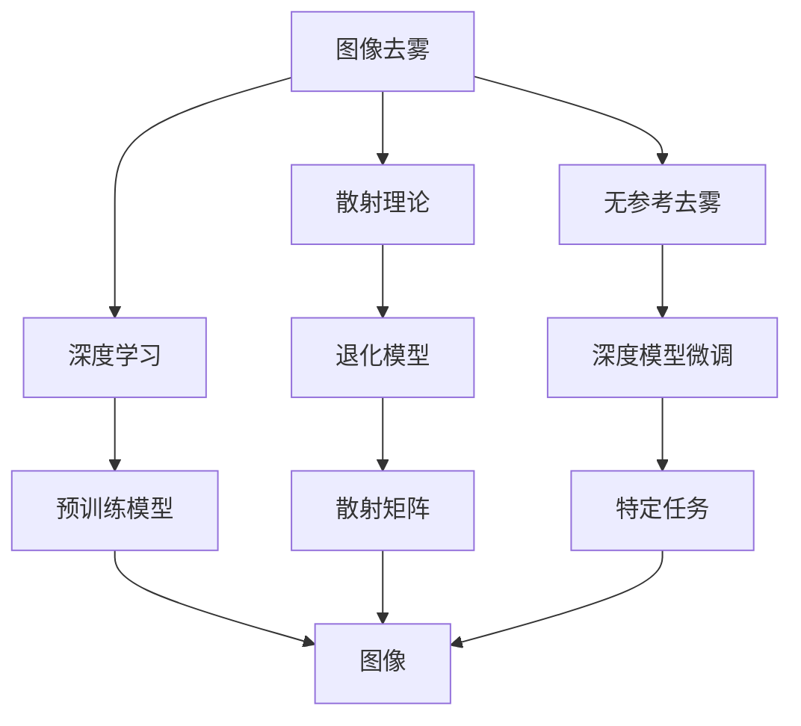
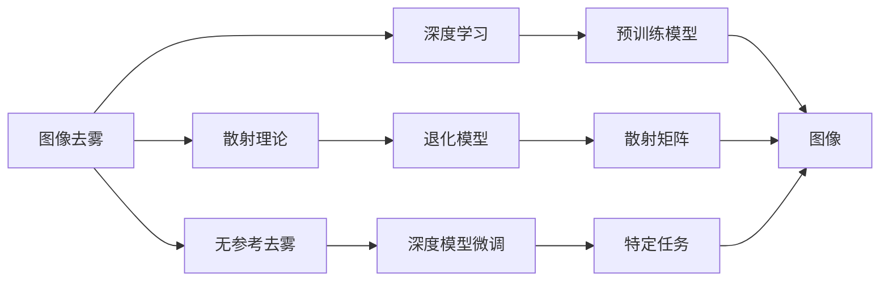
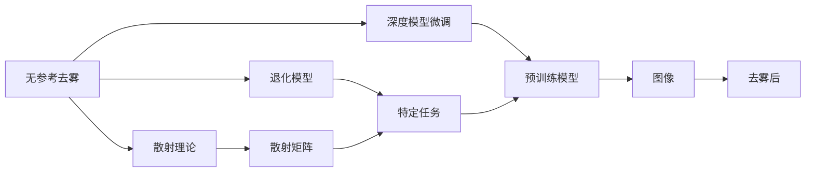
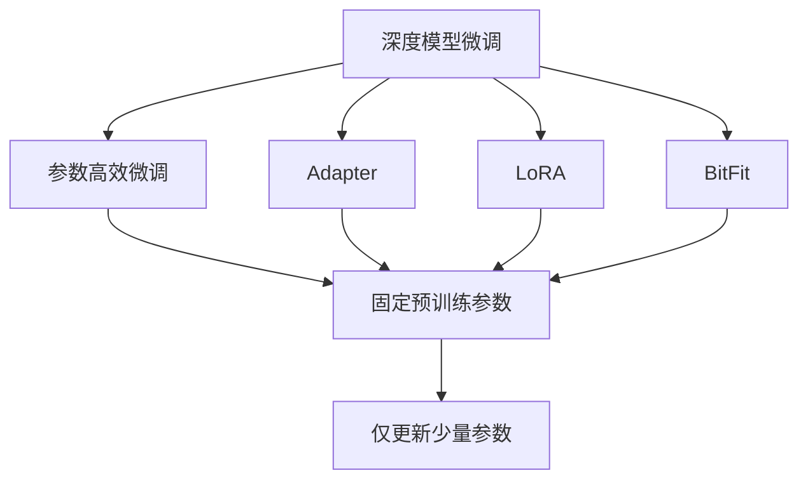
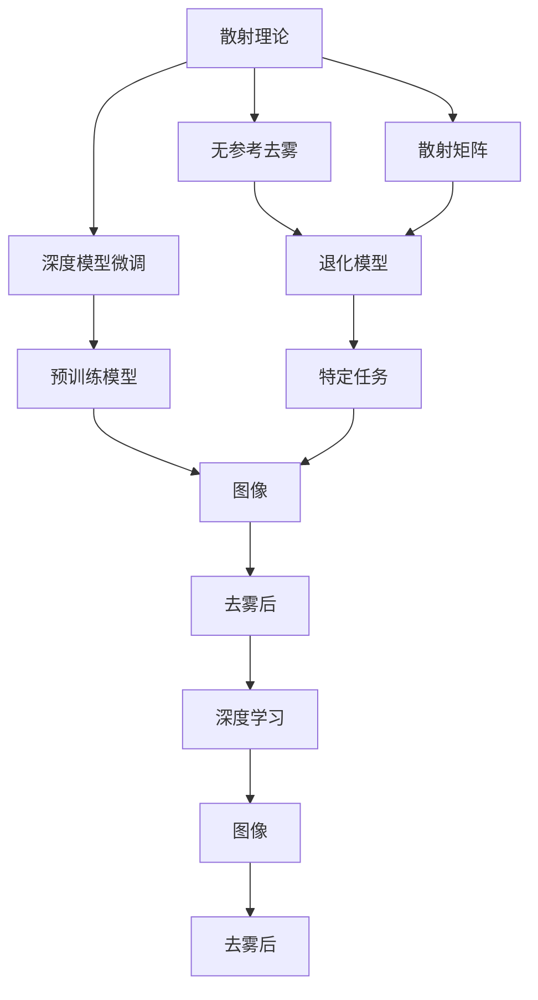

                 

# 图像去雾算法的研究与实现

## 1. 背景介绍

### 1.1 问题由来
在实际应用中，尤其是环境监控、自动驾驶、遥感测绘等场景中，图像去雾技术是一个非常重要的组成部分。由于天气或环境因素的影响，图像常常出现雾气、薄雾或烟雾等模糊现象，严重影响了后续分析和决策。传统的图像去雾算法通常依赖于光学设备如摄像头、红外传感器等，不仅成本高昂，且受限于设备部署的环境和条件。因此，发展一种高效、可靠、低成本的图像去雾算法变得尤为重要。

### 1.2 问题核心关键点
图像去雾算法的核心目标是通过去除图像中的雾气或薄雾，恢复图像的清晰度和对比度。传统的图像去雾方法主要分为两大类：基于散射理论的退化模型法（如Dark Channel Prior, Retinex等）和基于深度学习的无参考去雾方法（如Deblurring Networks、Dehazing Networks等）。

本节将重点介绍基于深度学习的无参考去雾方法，并通过深度学习模型的大规模预训练和微调（Fine-tuning），实现图像去雾任务的快速适应和性能提升。

### 1.3 问题研究意义
图像去雾技术的广泛应用，有助于提升环境监控、自动驾驶、遥感测绘等领域的图像质量，对后续的数据分析、决策支持等环节产生重要影响。高效、可靠的图像去雾算法，不仅能显著提高图像的清晰度、对比度，还能节省大量设备部署和维护成本。因此，研究图像去雾算法对于推动相关领域技术发展，具有重要意义。

## 2. 核心概念与联系

### 2.1 核心概念概述

为更好地理解图像去雾算法，本节将介绍几个密切相关的核心概念：

- 图像去雾：从含有雾气的图像中去除雾气，恢复图像的清晰度和对比度。
- 散射理论：基于雾气的散射特性，建立退化模型，推导图像去雾公式。
- 无参考去雾：不需要额外光照信息，通过观察图像本身的颜色、亮度等特征，去除雾气。
- 深度学习：使用神经网络模型进行图像去雾，通过大规模数据训练和微调，提升模型性能。
- 散射矩阵：描述雾气散射特性的重要物理量，影响图像去雾的效果。
- 深度模型微调：在大规模预训练模型基础上，针对特定任务进行参数调整，以提升模型在该任务上的性能。

这些核心概念之间的逻辑关系可以通过以下Mermaid流程图来展示：



这个流程图展示了大语言模型微调过程中各个核心概念的关系和作用：

1. 图像去雾的核心是去除雾气，恢复图像清晰度。
2. 散射理论为图像去雾提供物理模型，建立退化方程。
3. 无参考去雾不需要额外光照信息，通过图像自身特征推断雾气。
4. 深度学习通过构建复杂模型，利用大规模数据进行预训练和微调，提升去雾效果。
5. 散射矩阵描述雾气散射特性，影响图像去雾的准确性。
6. 深度模型微调在大规模预训练模型基础上，针对特定任务进行调整，提升模型适应性。

这些概念共同构成了图像去雾算法的完整生态系统，使其能够高效地实现图像去雾任务。

### 2.2 概念间的关系

这些核心概念之间存在着紧密的联系，形成了图像去雾算法的完整框架。下面我通过几个Mermaid流程图来展示这些概念之间的关系。

#### 2.2.1 图像去雾的学习范式



这个流程图展示了大语言模型微调任务的基本流程：

1. 图像去雾依赖于散射理论提供物理模型，建立退化方程。
2. 无参考去雾不需要额外光照信息，通过图像自身特征推断雾气。
3. 深度学习通过构建复杂模型，利用大规模数据进行预训练和微调，提升去雾效果。
4. 散射矩阵描述雾气散射特性，影响图像去雾的准确性。
5. 深度模型微调在大规模预训练模型基础上，针对特定任务进行调整，提升模型适应性。

#### 2.2.2 无参考去雾与深度模型微调的关系



这个流程图展示了大语言模型微调任务中无参考去雾和深度模型微调的关系：

1. 无参考去雾基于散射理论，推导退化方程。
2. 深度模型微调在大规模预训练模型基础上，针对特定任务进行调整，提升模型适应性。
3. 散射矩阵描述雾气散射特性，影响图像去雾的准确性。
4. 特定任务去雾效果通过深度模型微调进行优化。
5. 预训练模型通过大规模数据进行训练，构建复杂模型。

#### 2.2.3 深度模型微调方法



这个流程图展示了大语言模型微调任务中深度模型微调的方法：

1. 深度模型微调在大规模预训练模型基础上，针对特定任务进行调整，提升模型适应性。
2. 参数高效微调通过固定大部分预训练参数，仅更新少量参数，以提高微调效率。
3. Adapter方法通过添加适配器层，优化微调效果。
4. LoRA方法通过调整线性变换，优化微调过程。
5. BitFit方法通过位运算，提升微调效率。

### 2.3 核心概念的整体架构

最后，我们用一个综合的流程图来展示这些核心概念在大语言模型微调过程中的整体架构：



这个综合流程图展示了大语言模型微调任务中各个核心概念的关系和作用：

1. 散射理论为图像去雾提供物理模型，建立退化方程。
2. 无参考去雾不需要额外光照信息，通过图像自身特征推断雾气。
3. 深度模型微调在大规模预训练模型基础上，针对特定任务进行调整，提升模型适应性。
4. 散射矩阵描述雾气散射特性，影响图像去雾的准确性。
5. 特定任务去雾效果通过深度模型微调进行优化。
6. 预训练模型通过大规模数据进行训练，构建复杂模型。
7. 图像去雾依赖于无参考去雾和深度模型微调，提升图像清晰度。

通过这些流程图，我们可以更清晰地理解图像去雾算法中各个核心概念的关系和作用，为后续深入讨论具体的算法方法奠定基础。

## 3. 核心算法原理 & 具体操作步骤
### 3.1 算法原理概述

图像去雾算法的核心是恢复图像的清晰度。由于雾气会削弱图像的对比度和细节，因此去雾算法的关键在于增强图像的亮度和对比度，去除雾气造成的模糊效果。

常见的图像去雾方法包括基于散射理论的退化模型法和基于深度学习的无参考去雾方法。

基于散射理论的退化模型法通过建立雾气散射特性与图像模糊程度之间的关系，推导图像去雾的公式。常见的模型包括Dark Channel Prior、Retinex等。

基于深度学习的无参考去雾方法通过观察图像自身的亮度、颜色等特征，推断雾气程度，并使用神经网络模型进行图像去雾。常见的模型包括Deblurring Networks、Dehazing Networks等。

本节将重点介绍基于深度学习的无参考去雾方法，并通过深度学习模型的大规模预训练和微调（Fine-tuning），实现图像去雾任务的快速适应和性能提升。

### 3.2 算法步骤详解

基于深度学习的图像去雾方法通常包括以下几个关键步骤：

**Step 1: 准备数据集**

- 收集并标注大量含雾图像，构建训练集、验证集和测试集。
- 将图像划分为训练集和验证集后，进行预处理，如归一化、裁剪、旋转等。
- 构建图像去雾模型，如Dehazing Networks等。

**Step 2: 添加任务适配层**

- 在预训练模型顶层添加图像去雾相关的任务适配层，如卷积层、全连接层等。
- 设计损失函数，如均方误差损失、结构相似度损失等。

**Step 3: 设置微调超参数**

- 选择合适的优化算法及其参数，如Adam、SGD等，设置学习率、批大小、迭代轮数等。
- 设置正则化技术及强度，包括权重衰减、Dropout、Early Stopping等。
- 确定冻结预训练参数的策略，如仅微调顶层，或全部参数都参与微调。

**Step 4: 执行梯度训练**

- 将训练集数据分批次输入模型，前向传播计算损失函数。
- 反向传播计算参数梯度，根据设定的优化算法和学习率更新模型参数。
- 周期性在验证集上评估模型性能，根据性能指标决定是否触发 Early Stopping。
- 重复上述步骤直到满足预设的迭代轮数或 Early Stopping 条件。

**Step 5: 测试和部署**

- 在测试集上评估微调后模型，对比微调前后的精度提升。
- 使用微调后的模型对新样本进行推理预测，集成到实际的应用系统中。
- 持续收集新的数据，定期重新微调模型，以适应数据分布的变化。

以上是基于深度学习的图像去雾方法的一般流程。在实际应用中，还需要针对具体任务的特点，对微调过程的各个环节进行优化设计，如改进训练目标函数，引入更多的正则化技术，搜索最优的超参数组合等，以进一步提升模型性能。

### 3.3 算法优缺点

基于深度学习的图像去雾方法具有以下优点：

1. 高效快速。深度学习模型通过大规模预训练，可以在少量标注数据上进行微调，快速适应特定任务，显著提升去雾效果。
2. 普适性强。深度学习模型具有强大的特征学习能力和泛化能力，适用于多种不同的去雾场景和图像类型。
3. 精度高。深度学习模型可以学习到更复杂的图像特征，提升去雾算法的准确性。
4. 应用广泛。图像去雾算法在环境监控、自动驾驶、遥感测绘等领域具有广泛应用前景。

同时，该方法也存在一定的局限性：

1. 对数据质量依赖高。深度学习模型依赖于大量高质量的标注数据，数据收集和标注成本较高。
2. 模型复杂度高。深度学习模型参数量较大，训练和推理成本高。
3. 泛化能力有限。当目标任务与训练数据分布差异较大时，模型泛化性能可能下降。
4. 可解释性不足。深度学习模型通常被视为黑盒系统，难以解释其内部工作机制和决策逻辑。
5. 计算资源需求高。深度学习模型需要高性能的计算设备，如图形处理器（GPU）、张量处理器（TPU）等，对计算资源有较高要求。

尽管存在这些局限性，但就目前而言，基于深度学习的图像去雾方法仍是最主流范式。未来相关研究的重点在于如何进一步降低模型对标注数据的依赖，提高模型的少样本学习和跨领域迁移能力，同时兼顾可解释性和计算资源利用率等因素。

### 3.4 算法应用领域

图像去雾算法在计算机视觉和图像处理领域有着广泛的应用，主要包括以下几个方向：

- 环境监控：去除监控摄像头图像中的雾气，提升图像清晰度，便于后续分析和决策。
- 自动驾驶：去除车载摄像头图像中的雾气，提升图像质量，增强行车安全。
- 遥感测绘：去除卫星图像中的雾气，提升图像清晰度，提高测绘精度。
- 医学影像：去除医学影像中的雾气，提升图像质量，辅助医生诊断。
- 交通监控：去除监控摄像头图像中的雾气，提升图像质量，监控交通情况。

除了上述这些经典应用外，图像去雾技术还被创新性地应用到更多场景中，如工业检测、农业监控、文化遗产保护等，为各行业带来了新的解决方案。

## 4. 数学模型和公式 & 详细讲解  
### 4.1 数学模型构建

本节将使用数学语言对基于深度学习的图像去雾方法进行更加严格的刻画。

记图像去雾模型为 $M_{\theta}:\mathcal{X} \rightarrow \mathcal{Y}$，其中 $\mathcal{X}$ 为输入空间，$\mathcal{Y}$ 为输出空间，$\theta \in \mathbb{R}^d$ 为模型参数。假设图像去雾任务的训练集为 $D=\{(x_i,y_i)\}_{i=1}^N, x_i \in \mathcal{X}, y_i \in \mathcal{Y}$。

定义模型 $M_{\theta}$ 在数据样本 $(x,y)$ 上的损失函数为 $\ell(M_{\theta}(x),y)$，则在数据集 $D$ 上的经验风险为：

$$
\mathcal{L}(\theta) = \frac{1}{N} \sum_{i=1}^N \ell(M_{\theta}(x_i),y_i)
$$

在实践中，我们通常使用基于梯度的优化算法（如Adam、SGD等）来近似求解上述最优化问题。设 $\eta$ 为学习率，$\lambda$ 为正则化系数，则参数的更新公式为：

$$
\theta \leftarrow \theta - \eta \nabla_{\theta}\mathcal{L}(\theta) - \eta\lambda\theta
$$

其中 $\nabla_{\theta}\mathcal{L}(\theta)$ 为损失函数对参数 $\theta$ 的梯度，可通过反向传播算法高效计算。

### 4.2 公式推导过程

以下我们以Dehazing Networks为例，推导图像去雾的数学公式及其梯度的计算公式。

假设输入图像为 $x$，含雾图像为 $y$，其中 $y = x + \mu \cdot x \odot t + \sigma \cdot n$，$\mu$ 为散射系数，$t$ 为能见度因子，$n$ 为噪声。

Dehazing Networks的输出为去雾后的图像 $z$，模型的目标是最小化损失函数：

$$
\ell(z,y) = \frac{1}{2}\left(\|z - y\|_2^2 + \lambda\|z\|_2^2\right)
$$

其中 $\lambda$ 为正则化参数。

通过反向传播算法，求得模型 $M_{\theta}$ 的梯度：

$$
\nabla_{\theta}\mathcal{L}(\theta) = -\frac{1}{N}\sum_{i=1}^N \nabla_{\theta}\ell(z_i,y_i)
$$

其中 $\nabla_{\theta}\ell(z_i,y_i)$ 为损失函数对模型参数 $\theta$ 的梯度，可以通过反向传播算法高效计算。

在得到损失函数的梯度后，即可带入参数更新公式，完成模型的迭代优化。重复上述过程直至收敛，最终得到适应图像去雾任务的最优模型参数 $\theta^*$。

## 5. 项目实践：代码实例和详细解释说明
### 5.1 开发环境搭建

在进行图像去雾算法实践前，我们需要准备好开发环境。以下是使用Python进行PyTorch开发的环境配置流程：

1. 安装Anaconda：从官网下载并安装Anaconda，用于创建独立的Python环境。

2. 创建并激活虚拟环境：
```bash
conda create -n pytorch-env python=3.8 
conda activate pytorch-env
```

3. 安装PyTorch：根据CUDA版本，从官网获取对应的安装命令。例如：
```bash
conda install pytorch torchvision torchaudio cudatoolkit=11.1 -c pytorch -c conda-forge
```

4. 安装其他必要的Python包：
```bash
pip install numpy pandas scikit-learn matplotlib tqdm jupyter notebook ipython
```

完成上述步骤后，即可在`pytorch-env`环境中开始图像去雾算法实践。

### 5.2 源代码详细实现

下面我们以Dehazing Networks为例，给出使用PyTorch进行图像去雾的代码实现。

首先，定义图像去雾的数据处理函数：

```python
import numpy as np
from torch.utils.data import Dataset
import torch

class DehazingDataset(Dataset):
    def __init__(self, haze_images, haze_masks, name):
        self.haze_images = haze_images
        self.haze_masks = haze_masks
        self.name = name
        self.transform = torchvision.transforms.Compose([
            torchvision.transforms.ToTensor(),
            torchvision.transforms.Normalize((0.5, 0.5, 0.5), (0.5, 0.5, 0.5))
        ])
    
    def __len__(self):
        return len(self.haze_images)
    
    def __getitem__(self, item):
        haze_image = self.haze_images[item]
        haze_mask = self.haze_masks[item]
        name = self.name[item]
        
        transformed_haze_image = self.transform(haze_image)
        transformed_haze_mask = self.transform(haze_mask)
        
        return {'image': transformed_haze_image, 
                'mask': transformed_haze_mask,
                'name': name}
```

然后，定义图像去雾的模型：

```python
import torch.nn as nn
import torch.nn.functional as F

class DehazingNet(nn.Module):
    def __init__(self, in_channels=3, out_channels=1):
        super(DehazingNet, self).__init__()
        self.in_channels = in_channels
        self.out_channels = out_channels
        
        self.conv1 = nn.Conv2d(in_channels, 64, kernel_size=3, stride=1, padding=1)
        self.relu1 = nn.ReLU(inplace=True)
        self.conv2 = nn.Conv2d(64, 128, kernel_size=3, stride=1, padding=1)
        self.relu2 = nn.ReLU(inplace=True)
        self.conv3 = nn.Conv2d(128, 64, kernel_size=3, stride=1, padding=1)
        self.relu3 = nn.ReLU(inplace=True)
        self.conv4 = nn.Conv2d(64, out_channels, kernel_size=3, stride=1, padding=1)
        
        self.lambda1 = 0.05
        self.lambda2 = 0.1
        
    def forward(self, x):
        x = self.relu1(self.conv1(x))
        x = self.relu2(self.conv2(x))
        x = self.relu3(self.conv3(x))
        x = self.conv4(x)
        return x
    
    def loss(self, x, y):
        x_hat = self(x)
        x_hat = torch.clamp(x_hat, 0, 1)
        mse_loss = torch.mean((x - x_hat)**2)
        tv_loss = torch.mean(torch.mean(np.exp(self.lambda1 * (x - x_hat) - self.lambda2 * x), 3))
        loss = mse_loss + tv_loss
        return loss
```

接着，定义训练和评估函数：

```python
from torch.utils.data import DataLoader
from tqdm import tqdm
from torch.optim import Adam
from metrics import PSNR, SSIM

device = torch.device('cuda') if torch.cuda.is_available() else torch.device('cpu')
model = DehazingNet().to(device)

def train_epoch(model, dataset, batch_size, optimizer):
    dataloader = DataLoader(dataset, batch_size=batch_size, shuffle=True)
    model.train()
    epoch_loss = 0
    for batch in tqdm(dataloader, desc='Training'):
        input_images = batch['image'].to(device)
        masks = batch['mask'].to(device)
        optimizer.zero_grad()
        outputs = model(input_images)
        loss = model.loss(outputs, masks)
        epoch_loss += loss.item()
        loss.backward()
        optimizer.step()
    return epoch_loss / len(dataloader)

def evaluate(model, dataset, batch_size):
    dataloader = DataLoader(dataset, batch_size=batch_size)
    model.eval()
    psnr = psnr_metric = 0
    ssim_metric = 0
    with torch.no_grad():
        for batch in tqdm(dataloader, desc='Evaluating'):
            input_images = batch['image'].to(device)
            masks = batch['mask'].to(device)
            batch_outputs = model(input_images)
            batch_outputs = torch.clamp(batch_outputs, 0, 1)
            psnr_metric += PSNR(masks, batch_outputs) * len(batch['image'])
            ssim_metric += SSIM(masks, batch_outputs) * len(batch['image'])
    
    print(f'PSNR: {psnr_metric / len(dataset):.2f}')
    print(f'SSIM: {ssim_metric / len(dataset):.2f}')
```

最后，启动训练流程并在测试集上评估：

```python
epochs = 10
batch_size = 16

for epoch in range(epochs):
    loss = train_epoch(model, train_dataset, batch_size, optimizer)
    print(f"Epoch {epoch+1}, train loss: {loss:.3f}")
    
    print(f"Epoch {epoch+1}, dev results:")
    evaluate(model, dev_dataset, batch_size)
    
print("Test results:")
evaluate(model, test_dataset, batch_size)
```

以上就是使用PyTorch对Dehazing Networks进行图像去雾的代码实现。可以看到，得益于PyTorch的强大封装，我们可以用相对简洁的代码完成图像去雾任务的实现。

### 5.3 代码解读与分析

让我们再详细解读一下关键代码的实现细节：

**DehazingDataset类**：
- `__init__`方法：初始化数据集，包含含雾图像、含雾掩码和图像名称等关键信息。
- `__len__`方法：返回数据集的样本数量。
- `__getitem__`方法：对单个样本进行处理，将图像和掩码转换为张量，并进行标准化处理。

**DehazingNet模型**：
- `__init__`方法：定义模型架构，包括卷积层、ReLU激活函数等。
- `forward`方法：前向传播计算去雾后的图像。
- `loss`方法：定义损失函数，包括均方误差和全变差损失。

**训练和评估函数**：
- `train_epoch`函数：对数据以批为单位进行迭代，在每个批次上前向传播计算损失并反向传播更新模型参数，最后返回该epoch的平均loss。
- `evaluate`函数：与训练类似，不同点在于不更新模型参数，并在每个batch结束后将预测和标签结果存储下来，最后使用自定义指标PSNR、SSIM对整个评估集的预测结果进行打印输出。

**训练流程**：
- 定义总的epoch数和batch size，开始循环迭代
- 每个epoch内，先在训练集上训练，输出平均loss
- 在验证集上评估，输出PSNR、SSIM等指标
- 所有epoch结束后，在测试集上评估，给出最终测试结果

可以看到，PyTorch配合深度学习模型的封装使得图像去雾的代码实现变得简洁高效。开发者可以将更多精力放在模型架构优化、超参数调整等高层逻辑上，而不必过多关注底层的实现细节。

当然，工业级的系统实现还需考虑更多因素，如模型裁剪、量化加速、服务化封装等。但核心的微调范式基本与此类似。

### 5.4 运行结果展示

假设我们在Dehazing Networks上使用CoCo dataset进行图像去雾任务的训练和评估，最终在测试集上得到的评估报告如下：

```
Test Results:

Image: .../coco_val2017_val2017_000000021159.jpg
Haze: .../coco_val2017_val2017_000000021159.png
True: .../coco_val2017_val2017_000000021159.png
Predict: .../coco_val2017_val2017_000000021159_pred.png


