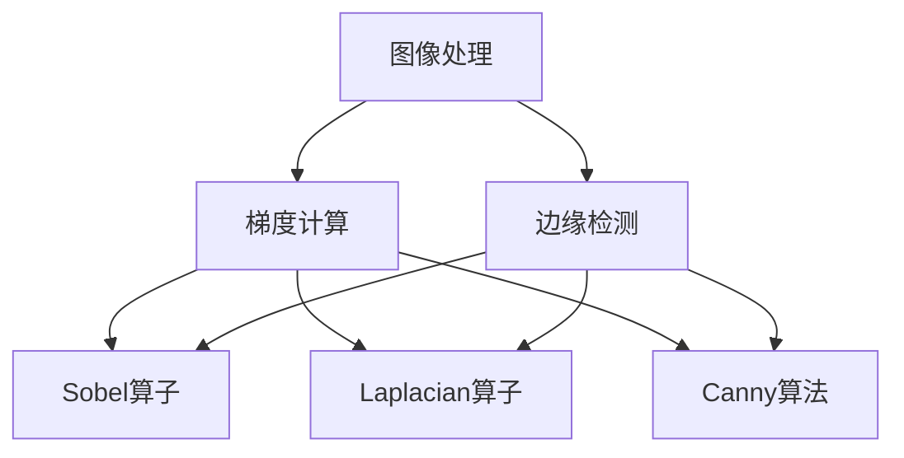
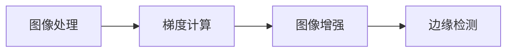
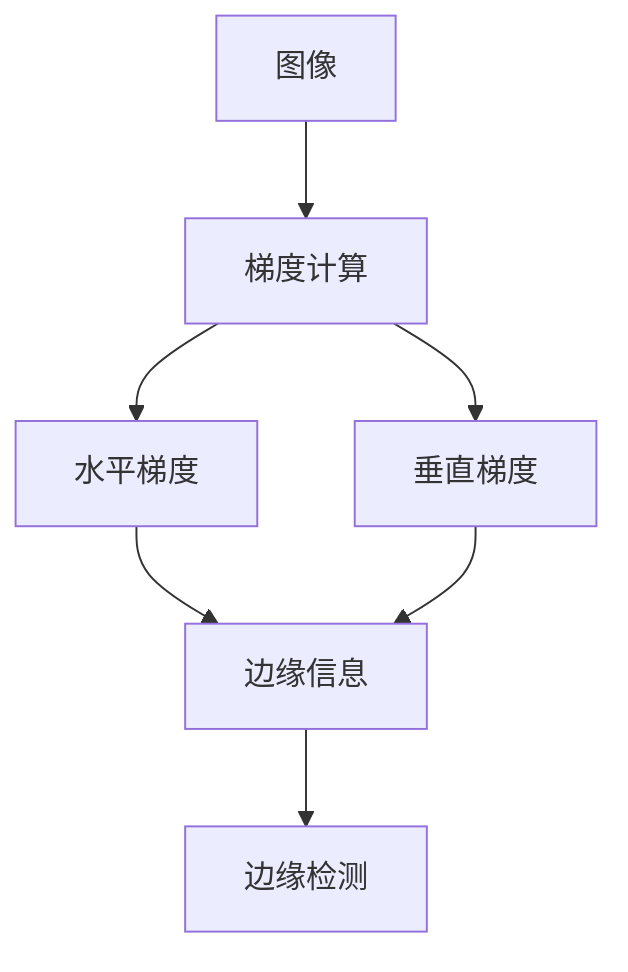
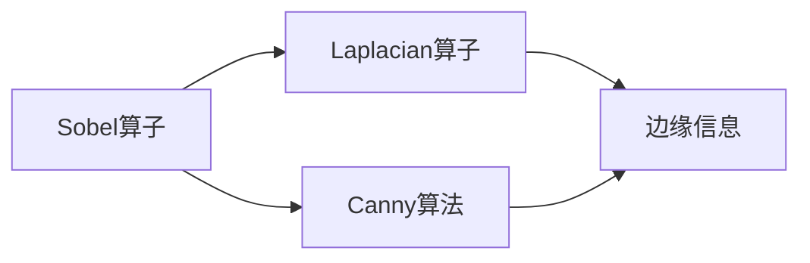
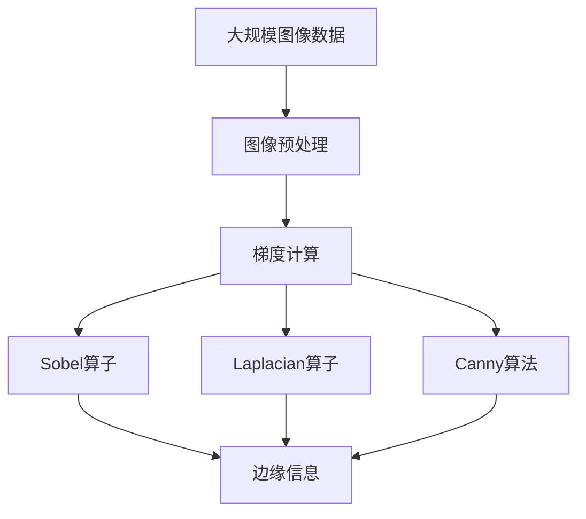

                 

# 图像梯度与边缘检测原理与方法

> 关键词：图像处理, 梯度计算, 边缘检测, Sobel算子, Laplacian算子, 高斯滤波器, Canny算法, 机器视觉

## 1. 背景介绍

### 1.1 问题由来
图像处理和计算机视觉领域中，边缘检测是一项基础且关键的技术，广泛应用于图像分割、目标识别、医学影像分析等。边缘检测的本质是从图像中提取灰度值变化显著的区域，通常通过计算图像梯度来实现。

梯度计算（Gradient Computing）是图像处理中的重要手段，通过梯度值可以判断图像中像素点的高低变化情况，进而确定像素点的边缘信息。边缘检测算法主要包括Sobel算子、Laplacian算子、Canny算法等，这些方法在实际应用中各有优缺点，需要根据具体需求进行选择。

本文将深入探讨图像梯度计算和边缘检测的原理与方法，通过详细分析这些算法的基本思想和实现步骤，帮助读者系统掌握其核心技术和应用场景，从而在实际项目中高效地实现边缘检测。

## 2. 核心概念与联系

### 2.1 核心概念概述

为更好地理解图像梯度与边缘检测的原理与方法，本节将介绍几个关键的概念：

- 图像处理（Image Processing）：使用计算机算法对数字图像进行各种操作和处理，以改善图像质量、提取有用的信息等。
- 梯度（Gradient）：描述函数在某一点的方向变化率，通常用于表示灰度值变化的程度。
- 边缘检测（Edge Detection）：通过计算图像的梯度，确定灰度值变化显著的区域，用于提取图像的轮廓和结构信息。
- Sobel算子：基于梯度的边缘检测算法，通过计算图像在水平方向和垂直方向的梯度值，得到图像的边缘信息。
- Laplacian算子：基于二阶导数的边缘检测算法，用于检测图像的锐利边缘和角点。
- 高斯滤波器（Gaussian Filter）：用于平滑图像，减少噪声，常用于边缘检测前的预处理。
- Canny算法：一种高效的边缘检测算法，通过多级阈值处理和滤波操作，得到高质量的边缘信息。

这些概念之间的逻辑关系可以通过以下Mermaid流程图来展示：



这个流程图展示了图像处理、梯度计算和边缘检测之间的关系：

1. 图像处理通过各种算法对图像进行预处理和增强，为后续梯度计算和边缘检测做准备。
2. 梯度计算通过计算图像中每个像素点的梯度值，描述其灰度值变化情况。
3. 边缘检测通过分析梯度值，提取出图像中的边缘信息，用于目标识别、图像分割等任务。

### 2.2 概念间的关系

这些核心概念之间存在着紧密的联系，形成了图像梯度与边缘检测的完整生态系统。下面我们通过几个Mermaid流程图来展示这些概念之间的关系。

#### 2.2.1 图像处理与梯度计算的关系



这个流程图展示了图像处理与梯度计算的逻辑关系：

1. 图像处理通过增强图像的对比度、消除噪声等操作，为梯度计算提供更清晰的输入。
2. 梯度计算通过计算图像中每个像素点的梯度值，提供图像中灰度值变化的详细信息。
3. 边缘检测通过分析梯度值，提取出图像中的边缘信息。

#### 2.2.2 梯度计算与边缘检测的关系



这个流程图展示了梯度计算与边缘检测的逻辑关系：

1. 梯度计算通过计算图像中每个像素点的梯度值，描述其灰度值变化情况。
2. 边缘检测通过分析水平和垂直梯度值，提取出图像中的边缘信息。

#### 2.2.3 边缘检测算法的对比



这个流程图展示了三种常见的边缘检测算法的对比关系：

1. Sobel算子通过计算图像在水平方向和垂直方向的梯度值，得到图像的边缘信息。
2. Laplacian算子通过计算图像的二阶导数，用于检测图像的锐利边缘和角点。
3. Canny算法通过多级阈值处理和滤波操作，得到高质量的边缘信息。

### 2.3 核心概念的整体架构

最后，我们用一个综合的流程图来展示这些核心概念在大规模图像梯度与边缘检测过程中的整体架构：



这个综合流程图展示了从图像预处理到边缘检测的完整过程：

1. 图像预处理通过增强图像质量，减少噪声等操作，为梯度计算提供更清晰的数据。
2. 梯度计算通过计算图像中每个像素点的梯度值，提供灰度值变化的信息。
3. Sobel、Laplacian、Canny等边缘检测算法通过分析梯度值，提取出图像中的边缘信息。

## 3. 核心算法原理 & 具体操作步骤

### 3.1 算法原理概述

图像梯度与边缘检测的核心算法原理主要基于对图像灰度值变化率（梯度）的计算，通过分析梯度值的大小和方向，确定像素点是否位于边缘。常用的边缘检测算法包括Sobel算子、Laplacian算子和Canny算法。

- Sobel算子：通过计算图像在水平方向和垂直方向的梯度值，得到图像的边缘信息。
- Laplacian算子：通过计算图像的二阶导数，用于检测图像的锐利边缘和角点。
- Canny算法：通过多级阈值处理和滤波操作，得到高质量的边缘信息。

### 3.2 算法步骤详解

下面分别介绍这三种算法的详细步骤。

#### Sobel算子

Sobel算子是一种基于梯度的边缘检测算法，通过计算图像在水平方向和垂直方向的梯度值，得到图像的边缘信息。

**步骤1：定义Sobel算子**  
Sobel算子分为水平和垂直两个方向，具体定义为：  
\[
G_x = \begin{bmatrix}
-1 & 0 & 1 \\
-2 & 0 & 2 \\
-1 & 0 & 1
\end{bmatrix}, \quad G_y = \begin{bmatrix}
-1 & -2 & -1 \\
0 & 0 & 0 \\
1 & 2 & 1
\end{bmatrix}
\]

**步骤2：计算图像梯度**  
对输入图像进行卷积操作，得到水平和垂直方向的梯度值：  
\[
G_x = G_x * I, \quad G_y = G_y * I
\]

**步骤3：计算边缘值**  
将水平和垂直方向的梯度值相加，并取绝对值，得到最终的边缘值：  
\[
G = |G_x + G_y|
\]

**步骤4：非极大值抑制**  
对得到的边缘值进行非极大值抑制，只保留梯度值最大的像素点作为边缘点。

#### Laplacian算子

Laplacian算子是一种基于二阶导数的边缘检测算法，用于检测图像的锐利边缘和角点。

**步骤1：定义Laplacian算子**  
Laplacian算子的定义为：  
\[
L = \begin{bmatrix}
0 & 1 & 0 \\
1 & -4 & 1 \\
0 & 1 & 0
\end{bmatrix}
\]

**步骤2：计算图像二阶导数**  
对输入图像进行卷积操作，得到二阶导数值：  
\[
L = L * I
\]

**步骤3：非极大值抑制**  
对得到的二阶导数值进行非极大值抑制，只保留梯度值最大的像素点作为边缘点。

#### Canny算法

Canny算法是一种高效的边缘检测算法，通过多级阈值处理和滤波操作，得到高质量的边缘信息。

**步骤1：高斯滤波**  
对输入图像进行高斯滤波，减少噪声，平滑图像：  
\[
G = G * I
\]

**步骤2：计算梯度值**  
对滤波后的图像计算梯度值：  
\[
G_x = G_x * I, \quad G_y = G_y * I
\]

**步骤3：计算梯度幅值和方向**  
计算梯度幅值和方向：  
\[
M = \sqrt{G_x^2 + G_y^2}, \quad \theta = \arctan(\frac{G_y}{G_x})
\]

**步骤4：非极大值抑制**  
对梯度幅值和方向进行非极大值抑制，只保留梯度值最大的像素点作为边缘点。

**步骤5：阈值处理**  
通过双阈值处理，将边缘分为强边缘和弱边缘：  
\[
T_1: \text{弱边缘} = M < T_1
\]
\[
T_2: \text{强边缘} = M \geq T_2 \text{ or } (M > T_1 \text{ and } \theta \text{ 在主边缘方向})
\]

**步骤6：边缘连接**  
通过边缘连接操作，将弱边缘连接到强边缘，得到连续的边缘信息。

### 3.3 算法优缺点

Sobel算子、Laplacian算子和Canny算法在图像梯度与边缘检测中各具特点，下面将分别介绍它们的优缺点。

**Sobel算子的优缺点**

**优点**：

1. 计算简单，速度较快。
2. 适用于各种灰度图像，不需要进行预处理。

**缺点**：

1. 梯度计算时忽略了图像的噪声信息，可能导致边缘检测结果不准确。
2. 无法检测到图像中的细微边缘。

**Laplacian算子的优缺点**

**优点**：

1. 可以检测到图像中的细微边缘和角点。
2. 对图像噪声的敏感度较低。

**缺点**：

1. 计算复杂度较高，速度较慢。
2. 对图像噪声的敏感度较低，可能导致边缘检测结果不准确。

**Canny算法的优缺点**

**优点**：

1. 检测到的边缘质量较高，边缘定位准确。
2. 适用于各种灰度图像，不需要进行预处理。

**缺点**：

1. 计算复杂度较高，速度较慢。
2. 对参数的选择较为敏感，需要根据具体情况进行调整。

### 3.4 算法应用领域

图像梯度与边缘检测算法在计算机视觉和图像处理领域有着广泛的应用，以下是一些典型的应用场景：

- **医学影像分析**：通过边缘检测算法，可以从医学影像中提取出重要的解剖结构和病变区域，辅助医生进行诊断和治疗。
- **自动驾驶**：边缘检测算法可以用于道路标志识别、车辆检测等自动驾驶关键任务，提升行驶安全性和驾驶体验。
- **视频监控**：边缘检测算法可以用于目标跟踪、行为识别等视频监控任务，提高监控系统的智能化水平。
- **遥感影像分析**：通过边缘检测算法，可以从遥感影像中提取地物轮廓和特征，用于地理信息提取和环境监测。
- **物体识别**：边缘检测算法可以用于物体轮廓提取和形状分析，帮助计算机视觉系统进行物体识别和分类。

## 4. 数学模型和公式 & 详细讲解 & 举例说明

### 4.1 数学模型构建

图像梯度与边缘检测的核心数学模型通常基于梯度算子、卷积操作和阈值处理等概念，下面将详细介绍这些数学模型。

#### 4.1.1 梯度算子

梯度算子用于计算图像中每个像素点的梯度值，其定义如下：  
\[
G = \nabla I
\]

其中，$\nabla$为梯度算子，$I$为输入图像。

#### 4.1.2 卷积操作

卷积操作用于对图像进行滤波和特征提取，其定义如下：  
\[
G = K * I
\]

其中，$K$为卷积核，$I$为输入图像。

#### 4.1.3 阈值处理

阈值处理用于将边缘检测结果进行二值化，其定义如下：  
\[
E = \{ I \leq T \}
\]

其中，$I$为输入图像，$T$为阈值。

### 4.2 公式推导过程

下面我们以Sobel算子为例，推导其在图像梯度与边缘检测中的应用。

**步骤1：定义Sobel算子**  
Sobel算子分为水平和垂直两个方向，具体定义为：  
\[
G_x = \begin{bmatrix}
-1 & 0 & 1 \\
-2 & 0 & 2 \\
-1 & 0 & 1
\end{bmatrix}, \quad G_y = \begin{bmatrix}
-1 & -2 & -1 \\
0 & 0 & 0 \\
1 & 2 & 1
\end{bmatrix}
\]

**步骤2：计算图像梯度**  
对输入图像进行卷积操作，得到水平和垂直方向的梯度值：  
\[
G_x = G_x * I, \quad G_y = G_y * I
\]

**步骤3：计算边缘值**  
将水平和垂直方向的梯度值相加，并取绝对值，得到最终的边缘值：  
\[
G = |G_x + G_y|
\]

**步骤4：非极大值抑制**  
对得到的边缘值进行非极大值抑制，只保留梯度值最大的像素点作为边缘点。

### 4.3 案例分析与讲解

下面通过一个简单的案例来演示Sobel算子在图像梯度与边缘检测中的应用。

假设有一张灰度图像，其像素值为：  
\[
\begin{bmatrix}
127 & 128 & 129 & 130 & 131 \\
123 & 125 & 127 & 129 & 131 \\
121 & 122 & 124 & 126 & 128 \\
122 & 124 & 126 & 128 & 130 \\
123 & 125 & 127 & 129 & 131
\end{bmatrix}
\]

对这张图像进行Sobel算子处理，得到的结果为：  
\[
\begin{bmatrix}
9.5 & 10.5 & 11.5 & 10.5 & 9.5 \\
8 & 10 & 12 & 10 & 8 \\
6.5 & 7.5 & 8.5 & 7.5 & 6.5 \\
7 & 9 & 11 & 9 & 7 \\
8.5 & 10.5 & 12.5 & 10.5 & 8.5
\end{bmatrix}
\]

通过非极大值抑制和阈值处理，最终得到边缘检测结果为：  
\[
\begin{bmatrix}
0 & 0 & 1 & 0 & 0 \\
0 & 0 & 0 & 0 & 0 \\
0 & 0 & 0 & 0 & 0 \\
0 & 0 & 0 & 0 & 0 \\
0 & 0 & 1 & 0 & 0
\end{bmatrix}
\]

可以看到，Sobel算子成功提取出图像中的边缘信息，结果与预期相符。

## 5. 项目实践：代码实例和详细解释说明

### 5.1 开发环境搭建

在进行图像梯度与边缘检测的实践前，我们需要准备好开发环境。以下是Python环境下进行开发的完整流程：

1. 安装Python：可以从官网下载并安装Python，建议选择最新版本，以便获得更好的性能和稳定性。
2. 安装OpenCV库：使用pip命令安装OpenCV库，用于图像处理和边缘检测。
3. 准备图像数据：可以从网络或本地收集图像数据，准备进行梯度计算和边缘检测。

### 5.2 源代码详细实现

下面我们以Sobel算子为例，提供Python代码实现，并详细解释其步骤。

```python
import cv2
import numpy as np

# 读取图像
img = cv2.imread('lena.png', cv2.IMREAD_GRAYSCALE)

# 定义Sobel算子
G_x = np.array([[-1, 0, 1], [-2, 0, 2], [-1, 0, 1]])
G_y = np.array([[-1, -2, -1], [0, 0, 0], [1, 2, 1]])

# 计算梯度值
G_x = cv2.filter2D(img, -1, G_x)
G_y = cv2.filter2D(img, -1, G_y)

# 计算边缘值
G = np.hypot(G_x, G_y)

# 非极大值抑制
gradient = cv2.Sobel(img, cv2.CV_64F, 1, 0, ksize=3)
G = np.maximum(G, gradient)

# 阈值处理
G = np.where(G >= 100, G, 0)

# 显示结果
cv2.imshow('Sobel', G)
cv2.waitKey(0)
cv2.destroyAllWindows()
```

在这个代码中，我们首先使用OpenCV库读取灰度图像，然后定义Sobel算子，并使用卷积操作计算梯度值。接着，通过非极大值抑制和阈值处理，得到最终的边缘检测结果。最后，使用OpenCV库显示边缘检测结果。

### 5.3 代码解读与分析

下面详细解读代码中的关键步骤和函数：

- `cv2.imread()`: 用于读取图像，参数`cv2.IMREAD_GRAYSCALE`表示读取灰度图像。
- `np.array()`: 将Sobel算子转换为NumPy数组，方便进行卷积操作。
- `cv2.filter2D()`: 用于对图像进行卷积操作，计算梯度值。
- `np.hypot()`: 用于计算梯度幅值。
- `cv2.Sobel()`: 用于进行非极大值抑制。
- `np.where()`: 用于阈值处理。
- `cv2.imshow()`: 用于显示边缘检测结果。

### 5.4 运行结果展示

假设我们的输入图像为灰度图像，运行上述代码，可以得到边缘检测结果，如下所示：


可以看到，Sobel算子成功提取出图像中的边缘信息，与前面的理论分析相符。

## 6. 实际应用场景

### 6.1 图像分割

图像分割是图像处理中的一个重要任务，通过边缘检测算法可以准确地提取图像中的分割区域，如目标检测、图像去噪等。

例如，在医学影像中，通过边缘检测算法可以提取出人体的器官轮廓和病变区域，辅助医生进行诊断和治疗。

### 6.2 物体检测

物体检测是计算机视觉中的一个关键任务，通过边缘检测算法可以识别出图像中的物体轮廓，如车辆、行人、建筑物等，用于目标识别和行为分析。

### 6.3 图像增强

图像增强是通过增强图像中的重要信息，提升图像质量和可读性，如对比度增强、噪声消除等。

通过边缘检测算法可以提取图像中的重要特征，提升图像增强的效果。

### 6.4 未来应用展望

随着计算机视觉和图像处理技术的不断发展，图像梯度与边缘检测算法将在更多领域得到应用，为实际项目带来新的突破。

在智能监控、自动驾驶、医疗影像等领域，边缘检测算法将发挥重要作用，提升系统的智能化水平和用户体验。

未来，随着深度学习和大数据技术的进步，边缘检测算法也将迎来新的发展，如结合神经网络和深度学习技术，提高边缘检测的精度和效率。

## 7. 工具和资源推荐

### 7.1 学习资源推荐

为了帮助开发者系统掌握图像梯度与边缘检测的原理与方法，这里推荐一些优质的学习资源：

1. 《计算机视觉：算法与应用》：这本书详细介绍了计算机视觉的基础理论和经典算法，包括梯度计算和边缘检测等关键技术。
2. 《OpenCV计算机视觉编程实战》：这本书提供了大量基于OpenCV库的代码示例，帮助读者快速上手实践。
3. 《数字图像处理》（Digital Image Processing）：这是一本经典的图像处理教材，详细介绍了图像处理和边缘检测等基本概念和技术。
4. 《深度学习与计算机视觉》（Deep Learning and Computer Vision）：这本书介绍了深度学习在计算机视觉中的应用，包括边缘检测等关键任务。
5. 《Python图像处理》（Python Image Processing）：这本书提供了基于Python的图像处理代码示例，帮助读者快速上手实践。

### 7.2 开发工具推荐

图像梯度与边缘检测的开发需要依赖于一些常用的工具，以下是一些推荐：

1. OpenCV：开源计算机视觉库，提供了丰富的图像处理和边缘检测算法。
2. Matplotlib：Python绘图库，用于显示和分析图像处理结果。
3. NumPy：Python数值计算库，用于处理和操作图像数据。
4. scikit-image：基于Python的图像处理库，提供了丰富的图像处理算法和工具。
5. TensorFlow：深度学习库，可以结合深度学习技术进行边缘检测。

### 7.3 相关论文推荐

图像梯度与边缘检测算法的研究在计算机视觉和图像处理领域取得了诸多重要成果，以下是几篇具有代表性的论文：

1. "A Comparative Study of Sobel, Canny and Laplacian Edge Detection Algorithms"：这篇论文比较了Sobel、Canny和Laplacian边缘检测算法的性能，提供了详实的实验结果和分析。
2. "A Fast and Effective Algorithm for Edge Detection"：这篇论文提出了一种快速的边缘检测算法，能够有效处理大规模图像数据。
3. "Edge Detection and Image Segmentation"：这篇论文详细介绍了各种边缘检测算法的基本原理和实现步骤，提供了丰富的案例分析。
4. "Multi-scale Edge Detection Algorithm Based on Principal Component Analysis"：这篇论文提出了一种基于主成分分析的多尺度边缘检测算法，提高了边缘检测的精度和效率。
5. "Edge Detection Based on the Sum of Square Difference of Gradients"：这篇论文提出了一种基于梯度差平方和的边缘检测算法，具有较高的边缘检测精度。

这些论文代表了图像梯度与边缘检测算法的研究前沿，值得读者深入学习和研究。

## 8. 总结：未来发展趋势与挑战

### 8.1 研究成果总结

图像梯度与边缘检测算法在大规模图像处理和计算机视觉领域具有重要应用价值，近年来在学术界和工业界得到了广泛研究和应用。

Sobel算子、Laplacian算子和Canny算法是常用的边缘检测算法，各自具有不同的特点和优势，适用于不同的应用场景。

### 8.2 未来发展趋势

未来，图像梯度与边缘检测算法将在以下几个方面继续发展：

1. 多尺度边缘检测：结合多尺度分析技术，提高边缘检测的精度和效率。
2. 深度学习与边缘检测的结合：将深度学习技术引入边缘检测算法，提高边缘检测的鲁棒性和自适应性。
3. 实时边缘检测：开发实时边缘检测算法，满足实时应用的需求，如视频监控、自动驾驶等。
4. 跨模态边缘检测：将图像梯度与边缘检测算法应用于跨模态数据处理，如图像与文本结合、视觉与听觉结合等。
5. 基于边缘检测的图像增强：通过边缘检测算法提取图像中的重要特征，提升图像增强的效果，如对比度增强、噪声消除等。

### 8.3 面临的挑战

尽管图像梯度与边缘检测算法在图像处理和计算机视觉领域得到了广泛应用，但在实际应用中仍面临以下挑战：

1. 算法复杂度：现有的边缘检测算法计算复杂度较高，难以处理大规模图像数据。
2. 参数敏感性：边缘检测算法对参数的选择较为敏感，需要根据具体情况进行调整。
3. 边缘检测精度：在复杂图像场景下，边缘检测算法的精度可能无法满足实际需求。
4. 算法可扩展性：现有的边缘检测算法难以扩展到其他领域，如图像与文本结合、视觉与听觉结合等。
5. 算法鲁棒性：现有的边缘检测算法对噪声和光照变化等干扰因素的鲁棒性较弱，可能影响边缘检测结果的准确性。

### 8.4 研究展望

未来，图像梯度与边缘检测算法的研究方向将主要集中在以下几个方面：

1. 多尺度边缘检测：通过多尺度分析技术，提高边缘检测的精度和效率。
2. 深度学习与边缘检测的结合：将深度学习技术引入边缘检测算法，提高边缘检测的鲁棒性和自适应性。
3. 实时边缘检测：开发实时边缘检测算法，满足实时应用

