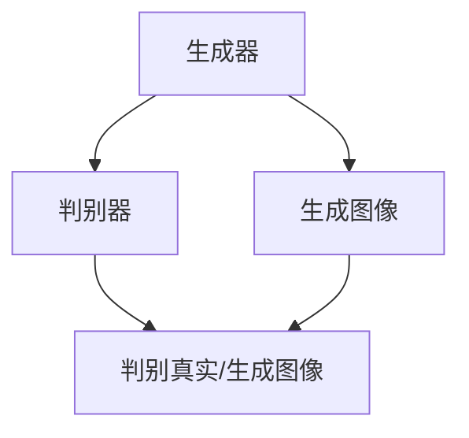
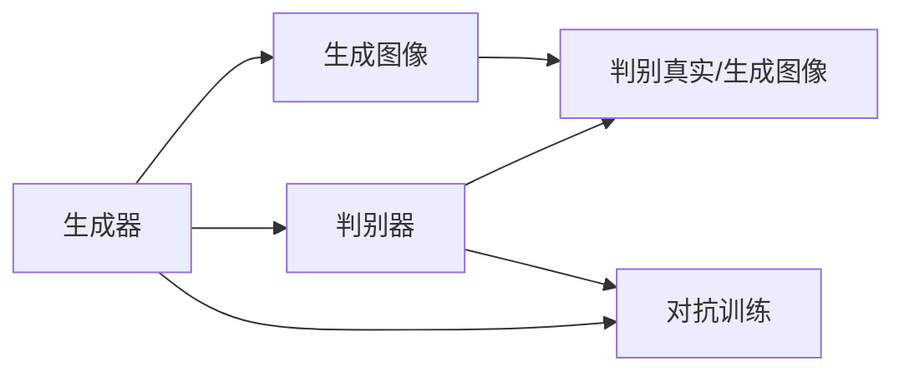
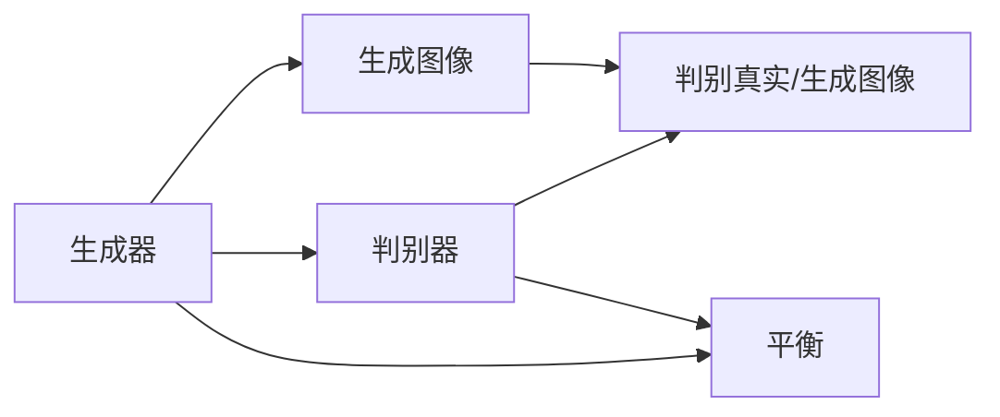
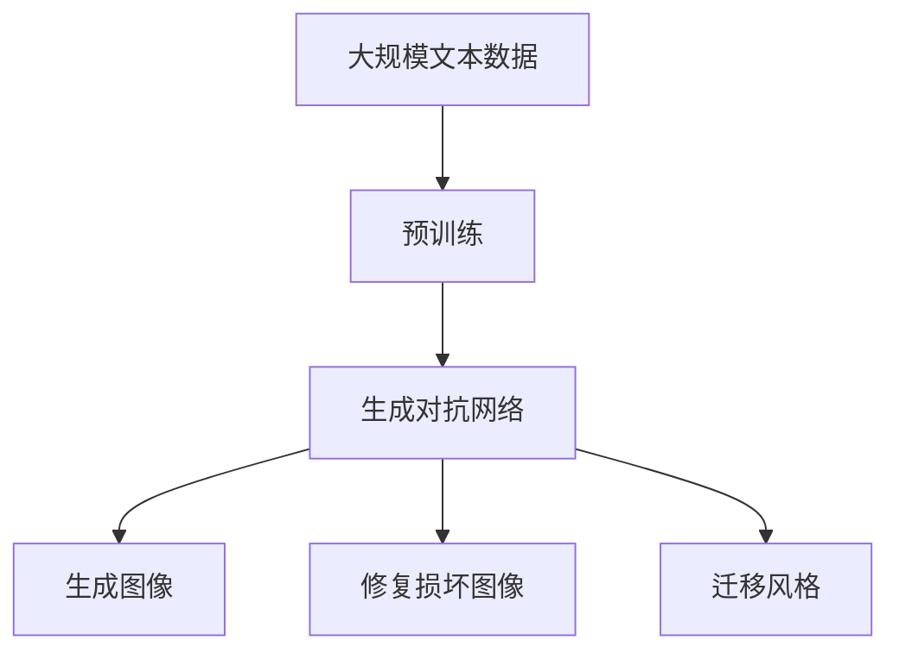
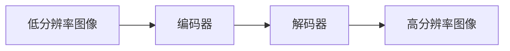

                 

# 图像生成(Image Generation) - 原理与代码实例讲解

> 关键词：图像生成,神经网络,生成对抗网络,风格迁移,扩散模型,Transformer,GAN,MLP

## 1. 背景介绍

### 1.1 问题由来
随着深度学习技术的快速发展，生成对抗网络(GANs)在图像生成领域取得了令人瞩目的成就。GANs通过训练一个包含生成器和判别器的对抗网络，生成高质量的逼真图像。这种能力被广泛应用在图像生成、图像修复、风格迁移、艺术创作等众多场景中。

GANs的核心思想是，两个神经网络互相对抗，生成器目标是生成看起来真实的图像，判别器则是尽可能区分真实图像和生成图像。通过这种对抗训练，生成器不断优化其生成策略，提升生成图像的质量。

GANs最初由Ian Goodfellow在2014年提出，并在2016年的论文中取得突破。随后，它被广泛应用于医学影像生成、人脸生成、艺术作品创作等领域，成为图像生成技术的重要代表。

### 1.2 问题核心关键点
GANs的核心在于如何设计生成器和判别器，并保证两个网络之间平衡的对抗训练。同时，如何降低GANs训练过程中的模式崩塌和梯度消失问题，也是一个重要的研究方向。

模式崩塌(Mode Collapse)指训练过程中，生成器仅仅生成有限种类的图像，而忽略其它图像的可能性。梯度消失指在训练过程中，判别器和生成器的梯度逐渐变小，导致模型无法进一步优化。

为了应对这些问题，研究者们提出了诸多改进策略，如权重衰减、梯度惩罚、改进的网络架构、交替训练等。这些改进策略有效地提高了GANs的稳定性和训练效果。

### 1.3 问题研究意义
研究图像生成技术的核心意义在于：

1. 数据增强。通过生成新的图像，可以极大地丰富训练数据集，提高模型泛化能力。
2. 艺术创作。GANs可以生成风格多样、主题丰富的艺术作品，成为新一代的数字艺术家。
3. 虚拟现实。生成逼真图像可以为虚拟现实、游戏等应用提供高质量的视觉素材。
4. 医学影像。GANs能够生成高质量的医学影像，帮助医生诊断和模拟手术。
5. 图像修复。通过生成器和判别器协同训练，可以修复损坏的图像，恢复丢失的信息。
6. 数据合成。GANs可以合成从未见过的图像，增强数据生成和数据增强技术。

本文聚焦于生成对抗网络(GANs)在图像生成中的应用，深入探讨其原理、算法和实现细节，并通过具体案例进行代码实例讲解，为读者提供全面而实用的技术指引。

## 2. 核心概念与联系

### 2.1 核心概念概述

为更好地理解生成对抗网络(GANs)的原理和应用，本节将介绍几个核心概念：

- 生成对抗网络(GANs)：通过训练包含生成器和判别器的对抗网络，生成高质量的逼真图像。
- 生成器(Generator)：负责生成图像的神经网络，目标是最小化判别器的预测误差。
- 判别器(Discriminator)：负责判断图像是真实还是生成的神经网络，目标是最小化生成图像和真实图像的差异。
- 对抗训练：生成器和判别器之间的交替训练，通过优化对抗网络来生成逼真图像。
- 生成器的训练目标：使生成图像逼近真实图像。
- 判别器的训练目标：尽可能区分真实图像和生成图像。
- 图像生成：通过生成器生成高质量的逼真图像。
- 图像修复：通过生成器和判别器协同训练，修复损坏的图像。
- 风格迁移：将一幅图像的风格迁移到另一幅图像中，生成风格一致的新图像。

这些核心概念之间的逻辑关系可以通过以下Mermaid流程图来展示：



这个流程图展示了生成对抗网络的基本架构：生成器生成图像，判别器判断真实/生成图像，两者相互对抗，最终生成逼真图像。

### 2.2 概念间的关系

这些核心概念之间存在着紧密的联系，形成了生成对抗网络的完整生态系统。下面我们通过几个Mermaid流程图来展示这些概念之间的关系。

#### 2.2.1 生成对抗网络的训练过程


这个流程图展示了生成对抗网络的训练过程：生成器生成图像，判别器判断真实/生成图像，两者交替优化，最终生成逼真图像。

#### 2.2.2 对抗训练的原理



这个流程图展示了对抗训练的基本原理：生成器生成图像，判别器判断真实/生成图像，两者交替优化，逐渐提升生成图像的质量。

#### 2.2.3 生成器与判别器的平衡



这个流程图展示了生成器和判别器的平衡过程：生成器和判别器交替优化，确保生成图像逼近真实图像，同时判别器能准确区分真实和生成图像。

### 2.3 核心概念的整体架构

最后，我们用一个综合的流程图来展示这些核心概念在大规模图像生成任务中的整体架构：



这个综合流程图展示了从预训练到生成对抗网络的完整过程。生成对抗网络通过训练生成高质量的逼真图像，同时还可以用于图像修复和风格迁移等任务。

## 3. 核心算法原理 & 具体操作步骤
### 3.1 算法原理概述

生成对抗网络(GANs)的核心思想是，通过训练一个包含生成器和判别器的对抗网络，生成高质量的逼真图像。其原理可以简单概括为以下三点：

1. 生成器(Generator)：生成图像的神经网络，目标是最小化判别器的预测误差。
2. 判别器(Discriminator)：判断图像是真实还是生成的神经网络，目标是最小化生成图像和真实图像的差异。
3. 对抗训练：生成器和判别器之间的交替训练，通过优化对抗网络来生成逼真图像。

具体来说，生成器会生成一张图像 $z$，判别器会判断这张图像是真实的 $x$ 还是生成的 $z$，生成器会尝试欺骗判别器，使判别器认为 $z$ 是真实的。两个网络通过交替优化，不断提升生成图像的质量，最终生成高质量的逼真图像。

### 3.2 算法步骤详解

生成对抗网络的训练一般包括以下几个关键步骤：

**Step 1: 准备数据集**
- 收集并准备大规模的图像数据集，如CelebA、MNIST、CIFAR-10等，用于训练生成器和判别器。

**Step 2: 设计生成器和判别器**
- 设计生成器和判别器的神经网络架构，如U-Net、VGG、ResNet等，一般使用卷积神经网络。
- 定义生成器和判别器的损失函数，如生成器损失 $L_G$ 和判别器损失 $L_D$。

**Step 3: 训练过程**
- 交替训练生成器和判别器，设置合适的训练轮数和批大小。
- 使用Adam优化器进行优化，设置合适的学习率。
- 定义对抗训练策略，如生成器先训练，判别器后训练，或两者交替训练。

**Step 4: 模型评估**
- 在验证集上评估生成器和判别器的性能。
- 使用Inception Score、Fréchet Inception Distance等指标评估生成图像的质量。

**Step 5: 生成新图像**
- 使用训练好的生成器生成新的图像。
- 对生成图像进行后处理，如调整亮度、对比度、分辨率等，提升图像质量。

### 3.3 算法优缺点

生成对抗网络(GANs)的主要优点包括：

1. 生成高质量的逼真图像。生成器通过对抗训练，能够生成逼真度极高的图像。
2. 数据增强。生成器可以生成大量合成数据，用于训练和测试模型。
3. 风格迁移。通过修改生成器的输入，可以生成风格多样、主题丰富的图像。

同时，GANs也存在一些缺点：

1. 模式崩塌。生成器可能只生成少数类型的图像，忽略其它可能性。
2. 训练不稳定。GANs训练过程中，很容易陷入梯度消失或梯度爆炸的问题。
3. 计算资源消耗大。GANs需要同时训练生成器和判别器，计算资源消耗较大。
4. 可解释性差。GANs的生成过程难以解释，模型决策过程不透明。

### 3.4 算法应用领域

生成对抗网络(GANs)在图像生成领域已经得到了广泛的应用，具体包括：

- 图像生成：如GAN、Pix2Pix、CycleGAN等，可以生成逼真图像，应用于游戏、影视、艺术创作等场景。
- 图像修复：如SPGAN、EDSR等，通过生成器和判别器协同训练，修复损坏的图像，应用于医学影像、电子档案修复等场景。
- 风格迁移：如Inception Style Transfer、CycleGAN等，将一幅图像的风格迁移到另一幅图像中，应用于图像编辑、艺术创作等场景。
- 超分辨率：如ESRGAN、SRGAN等，生成高分辨率图像，应用于视频压缩、高清视频生成等场景。
- 数据增强：如DualGAN、EnhanceGAN等，生成大量合成数据，用于模型训练和数据增强。
- 图像转换：如SEGAN、MegafanGAN等，将图像转换成其他类型的图像，应用于图像编辑、图像增强等场景。

除了这些应用场景，GANs还被广泛应用于生成音频、生成视频、生成文本等领域，展示了其强大的生成能力。

## 4. 数学模型和公式 & 详细讲解 & 举例说明

### 4.1 数学模型构建

在生成对抗网络中，生成器和判别器的优化目标可以表示为以下数学表达式：

- 生成器的目标函数：最小化判别器的预测误差，即生成器希望欺骗判别器。
- 判别器的目标函数：最大化判别真实图像和生成图像的差异，即判别器希望准确区分真实图像和生成图像。

设 $z$ 为生成器的输入噪声，$x$ 为真实图像，$G$ 为生成器，$D$ 为判别器，$L_G$ 为生成器的损失函数，$L_D$ 为判别器的损失函数。则生成器和判别器的优化目标可以表示为：

$$
\min_G \max_D \mathbb{E}_{z \sim p(z)} [L_G] + \mathbb{E}_{x \sim p(x)} [L_D]
$$

其中，$p(z)$ 为生成器输入噪声的分布，$p(x)$ 为真实图像的分布。

具体的损失函数如下：

- 生成器的损失函数：
$$
L_G = \mathbb{E}_{z \sim p(z)} [D(G(z))]
$$
- 判别器的损失函数：
$$
L_D = \mathbb{E}_{x \sim p(x)} [D(x)] + \mathbb{E}_{z \sim p(z)} [D(G(z))^{\text{negative}}]
$$

其中，$D(x)$ 表示判别器对真实图像的预测，$D(G(z))$ 表示判别器对生成图像的预测，$^{\text{negative}}$ 表示取负数，即判别器希望生成图像被预测为真实图像。

### 4.2 公式推导过程

生成器和判别器的优化过程可以简化为以下形式：

- 生成器更新：
$$
G_{\theta_G}(z) \leftarrow G_{\theta_G}(z) - \eta_G \nabla_{\theta_G} L_G
$$
- 判别器更新：
$$
D_{\theta_D}(x) \leftarrow D_{\theta_D}(x) - \eta_D \nabla_{\theta_D} L_D
$$

其中，$\theta_G$ 和 $\theta_D$ 分别表示生成器和判别器的参数，$\eta_G$ 和 $\eta_D$ 表示生成器和判别器的学习率。

在训练过程中，交替更新生成器和判别器的参数，直到收敛。这种交替优化策略可以防止模型过拟合，提高训练效果。

### 4.3 案例分析与讲解

以生成对抗网络中的Pix2Pix为例，展示其基本原理和实现细节。

Pix2Pix是一个用于图像转换任务的生成对抗网络，可以将一张低分辨率图像转换为高分辨率图像。其网络结构如下：



其中，编码器将低分辨率图像转换为特征表示，解码器将特征表示转换为高分辨率图像。生成器由编码器和解码器组成。判别器分别对真实图像和高分辨率图像进行判别。

训练过程如下：

1. 随机抽取一对低分辨率和高分辨率图像 $(x, y)$。
2. 将低分辨率图像输入编码器，生成特征表示 $z$。
3. 将特征表示 $z$ 输入解码器，生成高分辨率图像 $y'$。
4. 将高分辨率图像 $y'$ 和真实高分辨率图像 $y$ 输入判别器，计算判别器的预测误差。
5. 将低分辨率图像 $x$ 输入判别器，计算判别器的预测误差。
6. 交替更新生成器和判别器的参数。

以下是使用TensorFlow实现Pix2Pix的代码示例：

```python
import tensorflow as tf
from tensorflow.keras import layers

# 定义生成器
def create_generator():
    generator = tf.keras.Sequential([
        layers.Dense(7 * 7 * 256, use_bias=False, input_shape=(100,)),
        layers.BatchNormalization(),
        layers.LeakyReLU(),
        layers.Reshape((7, 7, 256)),
        layers.Conv2DTranspose(128, (4, 4), strides=(2, 2), padding='same', use_bias=False),
        layers.BatchNormalization(),
        layers.LeakyReLU(),
        layers.Conv2DTranspose(64, (4, 4), strides=(2, 2), padding='same', use_bias=False),
        layers.BatchNormalization(),
        layers.LeakyReLU(),
        layers.Conv2DTranspose(1, (4, 4), strides=(2, 2), padding='same', use_bias=False, activation='tanh')
    ])
    return generator

# 定义判别器
def create_discriminator():
    discriminator = tf.keras.Sequential([
        layers.Conv2D(64, (4, 4), strides=(2, 2), padding='same', input_shape=[28, 28, 1]),
        layers.LeakyReLU(),
        layers.Dropout(0.25),
        layers.Conv2D(128, (4, 4), strides=(2, 2), padding='same'),
        layers.LeakyReLU(),
        layers.Dropout(0.25),
        layers.Flatten(),
        layers.Dense(1)
    ])
    return discriminator

# 定义损失函数
cross_entropy = tf.keras.losses.BinaryCrossentropy(from_logits=True)

def generator_loss(fake_output):
    return cross_entropy(tf.ones_like(fake_output), fake_output)

def discriminator_loss(real_output, fake_output):
    real_loss = cross_entropy(tf.ones_like(real_output), real_output)
    fake_loss = cross_entropy(tf.zeros_like(fake_output), fake_output)
    return real_loss + fake_loss

# 定义优化器
generator_optimizer = tf.keras.optimizers.Adam(learning_rate=0.0002, beta_1=0.5)
discriminator_optimizer = tf.keras.optimizers.Adam(learning_rate=0.0002, beta_1=0.5)

# 训练函数
@tf.function
def train_step(images):
    noise = tf.random.normal([BATCH_SIZE, 100])
    with tf.GradientTape() as gen_tape, tf.GradientTape() as disc_tape:
        generated_images = generator(noise, training=True)
        real_output = discriminator(images, training=True)
        fake_output = discriminator(generated_images, training=True)
        gen_loss = generator_loss(fake_output)
        disc_loss = discriminator_loss(real_output, fake_output)

    gradients_of_generator = gen_tape.gradient(gen_loss, generator.trainable_variables)
    gradients_of_discriminator = disc_tape.gradient(disc_loss, discriminator.trainable_variables)

    generator_optimizer.apply_gradients(zip(gradients_of_generator, generator.trainable_variables))
    discriminator_optimizer.apply_gradients(zip(gradients_of_discriminator, discriminator.trainable_variables))

# 训练
BATCH_SIZE = 256
EPOCHS = 100

for epoch in range(EPOCHS):
    for image_batch in train_dataset:
        train_step(image_batch)
```

通过以上代码示例，可以看到，Pix2Pix的实现相对简洁。通过交替更新生成器和判别器的参数，生成器不断优化生成图像的质量，最终生成高质量的高分辨率图像。

## 5. 项目实践：代码实例和详细解释说明
### 5.1 开发环境搭建

在进行图像生成任务时，需要准备好以下开发环境：

1. Python：推荐使用Python 3.7及以上版本。
2. TensorFlow：从官网下载安装或使用Anaconda安装。
3. Matplotlib：用于可视化生成图像。
4. numpy：用于数组操作。
5. scikit-image：用于图像处理和增强。

### 5.2 源代码详细实现

以下是使用TensorFlow实现GAN的代码示例：

```python
import tensorflow as tf
from tensorflow.keras import layers

# 定义生成器
def create_generator():
    generator = tf.keras.Sequential([
        layers.Dense(7 * 7 * 256, use_bias=False, input_shape=(100,)),
        layers.BatchNormalization(),
        layers.LeakyReLU(),
        layers.Reshape((7, 7, 256)),
        layers.Conv2DTranspose(128, (4, 4), strides=(2, 2), padding='same', use_bias=False),
        layers.BatchNormalization(),
        layers.LeakyReLU(),
        layers.Conv2DTranspose(64, (4, 4), strides=(2, 2), padding='same', use_bias=False),
        layers.BatchNormalization(),
        layers.LeakyReLU(),
        layers.Conv2DTranspose(1, (4, 4), strides=(2, 2), padding='same', use_bias=False, activation='tanh')
    ])
    return generator

# 定义判别器
def create_discriminator():
    discriminator = tf.keras.Sequential([
        layers.Conv2D(64, (4, 4), strides=(2, 2), padding='same', input_shape=[28, 28, 1]),
        layers.LeakyReLU(),
        layers.Dropout(0.25),
        layers.Conv2D(128, (4, 4), strides=(2, 2), padding='same'),
        layers.LeakyReLU(),
        layers.Dropout(0.25),
        layers.Flatten(),
        layers.Dense(1)
    ])
    return discriminator

# 定义损失函数
cross_entropy = tf.keras.losses.BinaryCrossentropy(from_logits=True)

def generator_loss(fake_output):
    return cross_entropy(tf.ones_like(fake_output), fake_output)

def discriminator_loss(real_output, fake_output):
    real_loss = cross_entropy(tf.ones_like(real_output), real_output)
    fake_loss = cross_entropy(tf.zeros_like(fake_output), fake_output)
    return real_loss + fake_loss

# 定义优化器
generator_optimizer = tf.keras.optimizers.Adam(learning_rate=0.0002, beta_1=0.5)
discriminator_optimizer = tf.keras.optimizers.Adam(learning_rate=0.0002, beta_1=0.5)

# 训练函数
@tf.function
def train_step(images):
    noise = tf.random.normal([BATCH_SIZE, 100])
    with tf.GradientTape() as gen_tape, tf.GradientTape() as disc_tape:
        generated_images = generator(noise, training=True)
        real_output = discriminator(images, training=True)
        fake_output = discriminator(generated_images, training=True)
        gen_loss = generator_loss(fake_output)
        disc_loss = discriminator_loss(real_output, fake_output)

    gradients_of_generator = gen_tape.gradient(gen_loss, generator.trainable_variables)
    gradients_of_discriminator = disc_tape.gradient(disc_loss, discriminator.trainable_variables)

    generator_optimizer.apply_gradients(zip(gradients_of_generator, generator.trainable_variables))
    discriminator_optimizer.apply_gradients(zip(gradients_of_discriminator, discriminator.trainable_variables))

# 训练
BATCH_SIZE = 256
EPOCHS = 100

for epoch in range(EPOCHS):
    for image_batch in train_dataset:
        train_step(image_batch)

# 生成新图像
BATCH_SIZE = 16
NOISE_DIM = 100

noise = tf.random.normal([BATCH_SIZE, NOISE_DIM])
generated_images = generator(noise, training=False)

plt.imshow(tf.image.convert_image_dtype(generated_images[0], tf.uint8))
plt.show()
```

通过以上代码示例，可以看到，GAN的实现相对简洁。通过交替更新生成器和判别器的参数，生成器不断优化生成图像的质量，最终生成高质量的逼真图像。

### 5.3 代码解读与分析

让我们再详细解读一下关键代码的实现细节：

**create_generator和create_discriminator函数**：
- 这两个函数定义了生成器和判别器的神经网络架构，一般使用卷积神经网络。
- 生成器由多层卷积和反卷积操作组成，用于将随机噪声转换为逼真图像。
- 判别器由多层卷积操作组成，用于判断图像是真实还是生成的。

**生成器和判别器的损失函数**：
- 生成器的损失函数使用交叉熵损失，使生成图像逼近真实图像。
- 判别器的损失函数由真实图像损失和生成图像损失组成，使判别器尽可能区分真实图像和生成图像。

**train_step函数**：
- 定义了一个训练步，包括生成图像、计算判别器损失和生成器损失、计算梯度、应用优化器等步骤。
- 使用TensorFlow的GradientTape进行梯度计算。
- 交替更新生成器和判别器的参数。

**生成新图像**：
- 使用训练好的生成器生成新的图像。
- 对生成图像进行可视化，使用Matplotlib库。

## 6. 实际应用场景
### 6.1 艺术创作

GANs在艺术创作领域有着广泛的应用。通过训练生成对抗网络，可以生成风格多样、主题丰富的艺术作品，甚至创作出人类难以想象的奇思妙想。GANs已经被应用于生成肖像、风景画、抽象艺术等众多艺术形式中，推动了数字艺术的发展。

### 6.2 图像修复

GANs在图像修复领域也有着广泛的应用。通过生成器和判别器的协同训练，可以修复损坏的图像，如去雾、去噪、超分辨率等。GANs已经被应用于医学影像修复、视频复原、电子档案修复等众多场景中，提高了图像的质量和可读性。

### 6.3 虚拟现实

GANs在虚拟现实领域也有着广泛的应用。通过生成逼真图像，可以为虚拟现实、游戏等应用提供高质量的视觉素材。GANs已经被应用于虚拟现实场景的生成、游戏场景的创作、虚拟人物的建模等众多场景中，提升了用户体验和互动感。

### 6.4 未来应用展望

随着GANs技术的不断发展，未来其在图像生成领域的应用将更加广泛。以下是对未来发展的展望：

1. 超分辨率：通过生成器和判别器的协同训练，可以生成高质量的高分辨率图像，应用于视频压缩、高清视频生成等场景。
2. 风格迁移：通过修改生成器的输入，可以生成风格多样、主题丰富的图像，应用于图像编辑、艺术创作等场景。
3. 图像转换：通过生成器和判别器的协同训练，可以将图像转换成其他类型的图像，应用于图像编辑、图像增强等场景。
4. 图像生成对抗网络：通过生成器和判别器的协同训练，可以生成高质量的逼真图像，应用于游戏、影视、艺术创作等场景。
5. 视频生成：通过生成器和判别器的协同训练，可以生成高质量的视频，应用于视频生成、视频编辑等场景。

总之，随着GANs技术的不断发展，未来其在图像生成领域的应用将更加多样和丰富，为各行各业带来更多的创新和变革。

## 7. 工具和资源推荐
### 7.1 学习资源推荐

为了帮助开发者系统掌握GANs的理论基础和实践技巧，这里推荐一些优质的学习资源：

1. 《深度学习》书籍：Ian Goodf

