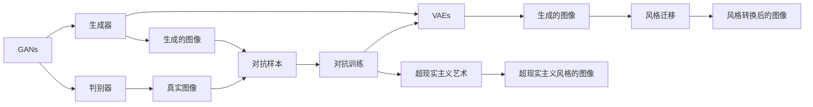

                 

# 图像生成模型:AI创造视觉艺术的新工具

> 关键词：图像生成模型,人工智能,计算机视觉,艺术创造,深度学习,GANs

## 1. 背景介绍

### 1.1 问题由来

近年来，随着深度学习技术的飞速发展，人工智能(AI)在图像生成领域取得了令人瞩目的进展。特别是在图像生成对抗网络（GANs）和变分自编码器（VAEs）等模型的推动下，AI能够以全新的方式理解和生成视觉艺术，展现出前所未有的创造力。

图像生成技术不仅为电影特效、游戏设计、虚拟现实等领域带来了革命性的变化，还为艺术创作、个性化设计、辅助创作等新型应用场景提供了强大的工具。其背后所蕴含的深度学习与艺术创造的结合，不仅推动了计算机视觉和艺术领域的交叉研究，也为全社会带来了巨大的价值。

### 1.2 问题核心关键点

图像生成模型，特别是基于深度学习的大模型，在艺术创作和视觉设计中的应用，已经从边缘逐渐成为核心。其核心在于通过神经网络模型，对高维的视觉信息进行编码和解码，生成高质量、风格多样、风格新颖的图像。

核心技术包括：
1. **神经网络架构**：用于编码和解码图像，如卷积神经网络（CNN）、生成对抗网络（GANs）、变分自编码器（VAEs）等。
2. **损失函数**：用于指导模型的训练过程，如生成对抗网络中的对抗损失、感知损失等。
3. **数据集**：提供训练模型所需的丰富多样的视觉信息，如ImageNet、CelebA、COCO等。
4. **训练技巧**：包括训练时的技巧和优化方法，如批量归一化、梯度裁剪、权重衰减等。

这些核心技术共同构成了图像生成模型的基础，使得AI能够创造性地生成图像，并在艺术创作、视觉设计等领域展现出巨大的潜力。

### 1.3 问题研究意义

图像生成模型的研究与应用，不仅推动了计算机视觉和艺术创作领域的交叉融合，也为更广泛的社会应用提供了可能。具体而言，其研究与应用意义包括：

1. **艺术创作**：图像生成模型可以辅助艺术家创作，提供多样化的创意资源。
2. **设计支持**：为工业设计、游戏设计等领域提供高效、灵活的设计工具。
3. **数据增强**：在大规模数据训练、医疗影像等领域提供丰富的数据资源。
4. **辅助教育**：在艺术教育、设计教育中提供新颖的教学资源。
5. **社会价值**：通过图像生成技术，可以跨越语言障碍，推动全球文化交流。

通过深入研究和广泛应用，图像生成模型有望成为AI技术赋能社会的重要方式，为创造力和生产力注入新的活力。

## 2. 核心概念与联系

### 2.1 核心概念概述

为了更清晰地理解图像生成模型的原理和应用，我们将重点介绍以下几个核心概念：

- **生成对抗网络（GANs）**：一种由生成器和判别器两部分组成的深度学习模型，能够生成高质量的图像。
- **变分自编码器（VAEs）**：一种基于变分原理的生成模型，能够生成具有一定连续性和平滑性特征的图像。
- **风格迁移（Style Transfer）**：通过神经网络模型，将一幅图像的风格特征迁移到另一幅图像上，产生新颖的视觉效果。
- **超现实主义艺术（Superrealism）**：利用深度学习技术，生成具有超现实主义风格的图像，带来新的艺术体验。

这些概念相互关联，构成了图像生成模型的基础。下面通过一个Mermaid流程图来展示这些概念之间的关系：



### 2.2 概念间的关系

通过以上Mermaid流程图，我们可以看到图像生成模型的核心概念之间存在以下关系：

1. **GANs与生成器和判别器**：GANs通过对抗训练，使得生成器能够生成高质量图像，而判别器能够区分生成图像与真实图像，不断提升生成器的生成能力。
2. **GANs与VAEs**：GANs和VAEs都是生成模型，但VAEs更注重生成图像的连续性和平滑性，适用于多种生成任务。
3. **GANs与风格迁移**：GANs能够生成多种风格的图像，而风格迁移则通过GANs或VAEs，将风格特征迁移到其他图像上，产生新颖的视觉效果。
4. **GANs与超现实主义艺术**：GANs生成的图像可以具有超现实主义风格，通过对生成过程的微调，可以生成具有特定风格的艺术作品。

这些概念构成了图像生成模型的基本框架，通过进一步的研究和应用，可以为视觉艺术和创意设计领域带来更丰富的应用可能性。

## 3. 核心算法原理 & 具体操作步骤

### 3.1 算法原理概述

图像生成模型的核心算法包括生成对抗网络（GANs）、变分自编码器（VAEs）等。以下将以GANs为例，介绍其算法原理。

GANs由生成器和判别器两部分组成。生成器负责从随机噪声中生成图像，而判别器负责判断图像的真假。训练过程中，生成器和判别器通过对抗训练不断提升生成能力。

具体来说，GANs的训练过程分为两个阶段：

1. **生成器训练**：生成器使用随机噪声作为输入，生成假图像。
2. **判别器训练**：判别器接收真实图像和假图像，学习区分两者的能力。

生成器和判别器交替训练，最终使得生成器能够生成高质量、逼真的图像。

### 3.2 算法步骤详解

GANs的训练步骤包括数据预处理、模型初始化、生成器与判别器交替训练、对抗训练等。以下详细介绍这些步骤：

#### 3.2.1 数据预处理

1. **数据加载**：使用PyTorch等深度学习框架，从磁盘中加载图像数据集，并将其转换为Tensor格式。
2. **数据增强**：对图像进行旋转、翻转、裁剪等操作，增加训练数据的多样性。
3. **归一化**：对图像进行归一化处理，使得数据处于均值为0，标准差为1的标准正态分布中。

#### 3.2.2 模型初始化

1. **生成器初始化**：定义生成器网络结构，并使用Xavier初始化生成器权重。
2. **判别器初始化**：定义判别器网络结构，并使用He初始化判别器权重。

#### 3.2.3 生成器与判别器交替训练

1. **生成器训练**：使用随机噪声作为输入，生成假图像。
2. **判别器训练**：接收真实图像和假图像，学习区分两者的能力。
3. **对抗训练**：将判别器输出作为生成器损失，使生成器生成更逼真的图像。

#### 3.2.4 对抗训练

1. **生成器损失函数**：使用判别器输出作为生成器损失，使生成器生成更逼真的图像。
2. **判别器损失函数**：使用生成器输出的假图像和真实图像作为判别器损失，使判别器能够区分真实图像和假图像。
3. **综合损失函数**：将生成器和判别器的损失函数结合起来，进行对抗训练。

### 3.3 算法优缺点

GANs作为一种生成模型，具有以下优点：

1. **高质量生成**：能够生成高质量、高逼真度的图像。
2. **可控性**：可以通过调整生成器和判别器的超参数，控制生成的图像质量。
3. **灵活性**：适用于多种生成任务，如图像生成、图像增强等。

同时，GANs也存在一些缺点：

1. **训练不稳定**：训练过程中容易出现模式崩溃等问题，导致生成图像质量下降。
2. **生成图像多样性不足**：生成的图像风格较为单一，难以控制多样性。
3. **计算成本高**：生成器网络较大，训练和推理成本较高。

### 3.4 算法应用领域

GANs和VAEs等生成模型在图像生成领域得到了广泛应用，主要应用于以下几个领域：

1. **图像生成**：通过GANs和VAEs生成高质量图像，如人脸生成、图像修复、虚拟场景等。
2. **图像增强**：对低质量图像进行增强，如去模糊、去噪声、去伪影等。
3. **风格迁移**：将一幅图像的风格特征迁移到另一幅图像上，如将摄影作品转化为油画风格。
4. **超现实主义艺术**：生成具有超现实主义风格的图像，为艺术创作提供新的灵感和工具。

以上应用展示了生成模型在视觉艺术和创意设计领域的强大潜力，为AI技术在文化创意产业的深入应用奠定了基础。

## 4. 数学模型和公式 & 详细讲解  
### 4.1 数学模型构建

在GANs中，生成器和判别器的损失函数可以分别表示为：

$$
L_G = E_{z} [D(G(z))] + \lambda E_{x} [||\nabla_x D(G(z))||_2]
$$

$$
L_D = E_{x} [D(x)] + E_{z} [D(G(z))]
$$

其中，$G$ 为生成器，$D$ 为判别器，$z$ 为随机噪声，$x$ 为真实图像。生成器的损失函数由判别器输出和图像梯度损失组成，判别器的损失函数由真实图像和生成图像的判别器输出组成。

### 4.2 公式推导过程

以GANs的对抗训练过程为例，推导生成器和判别器的损失函数。

生成器$G$的损失函数为：

$$
L_G = E_{z} [D(G(z))] + \lambda E_{x} [||\nabla_x D(G(z))||_2]
$$

判别器$D$的损失函数为：

$$
L_D = E_{x} [D(x)] + E_{z} [D(G(z))]
$$

生成器和判别器交替训练，得到综合损失函数：

$$
L_{total} = L_G + \lambda L_D
$$

通过梯度下降优化算法，优化生成器和判别器的权重参数，不断提升生成能力和判别能力。

### 4.3 案例分析与讲解

以生成对抗网络（GANs）生成人脸图像为例，通过以下步骤实现人脸生成：

1. **数据准备**：准备人脸数据集，如CelebA、LFW等。
2. **模型定义**：定义生成器和判别器的网络结构，如DCGAN、WGAN等。
3. **训练模型**：使用随机噪声作为输入，生成假图像。使用真实图像和假图像作为判别器的输入，进行对抗训练。
4. **评估模型**：在测试集上评估生成器生成的图像质量，并进行优化调整。

通过不断的训练和优化，生成器能够生成高质量的人脸图像，具有逼真的纹理、轮廓和细节。

## 5. 项目实践：代码实例和详细解释说明

### 5.1 开发环境搭建

在进行图像生成模型的开发和实践时，我们需要准备好相应的开发环境。以下是使用Python进行PyTorch开发的环境配置流程：

1. 安装Anaconda：从官网下载并安装Anaconda，用于创建独立的Python环境。

2. 创建并激活虚拟环境：
```bash
conda create -n pytorch-env python=3.8 
conda activate pytorch-env
```

3. 安装PyTorch：根据CUDA版本，从官网获取对应的安装命令。例如：
```bash
conda install pytorch torchvision torchaudio cudatoolkit=11.1 -c pytorch -c conda-forge
```

4. 安装transformers库：
```bash
pip install transformers
```

5. 安装各类工具包：
```bash
pip install numpy pandas scikit-learn matplotlib tqdm jupyter notebook ipython
```

完成上述步骤后，即可在`pytorch-env`环境中开始项目实践。

### 5.2 源代码详细实现

以下以生成对抗网络（GANs）生成人脸图像为例，给出使用PyTorch实现GANs的代码实现。

```python
import torch
import torch.nn as nn
import torch.optim as optim
import torchvision
import torchvision.transforms as transforms
import torchvision.utils as vutils

import os
from os.path import join as pjoin

class GANNet(nn.Module):
    def __init__(self, z_dim=100, nc=3, ngf=64, nz=64):
        super(GANNet, self).__init__()
        self.netG = nn.Sequential(
            nn.ConvTranspose2d(nz, ngf*8, 4, 1, 0, bias=False),
            nn.BatchNorm2d(ngf*8),
            nn.ReLU(True),
            nn.ConvTranspose2d(ngf*8, ngf*4, 4, 2, 1, bias=False),
            nn.BatchNorm2d(ngf*4),
            nn.ReLU(True),
            nn.ConvTranspose2d(ngf*4, ngf*2, 4, 2, 1, bias=False),
            nn.BatchNorm2d(ngf*2),
            nn.ReLU(True),
            nn.ConvTranspose2d(ngf*2, nc, 4, 2, 1, bias=False),
            nn.Tanh()
        )
        
    def forward(self, input):
        x = self.netG(input)
        return x

class DiscriminatorNet(nn.Module):
    def __init__(self, nc=3, ndf=64, nz=64):
        super(DiscriminatorNet, self).__init__()
        self.netD = nn.Sequential(
            nn.Conv2d(nc, ndf, 4, 2, 1, bias=False),
            nn.LeakyReLU(0.2, inplace=True),
            nn.Conv2d(ndf, ndf*2, 4, 2, 1, bias=False),
            nn.BatchNorm2d(ndf*2),
            nn.LeakyReLU(0.2, inplace=True),
            nn.Conv2d(ndf*2, ndf*4, 4, 2, 1, bias=False),
            nn.BatchNorm2d(ndf*4),
            nn.LeakyReLU(0.2, inplace=True),
            nn.Conv2d(ndf*4, 1, 4, 1, 0, bias=False),
            nn.Sigmoid()
        )
        
    def forward(self, input):
        x = self.netD(input)
        return x
```

### 5.3 代码解读与分析

这里我们以GANs生成人脸图像为例，解读关键代码的实现细节：

**GANNet类**：
- `__init__`方法：定义生成器的网络结构，使用卷积反卷积层搭建网络。
- `forward`方法：定义前向传播过程，将随机噪声输入生成器，输出生成图像。

**DiscriminatorNet类**：
- `__init__`方法：定义判别器的网络结构，使用卷积层搭建网络。
- `forward`方法：定义前向传播过程，将图像输入判别器，输出判别器输出的概率。

**训练函数**：
```python
def train(netG, netD, dataloader, device, save_interval):
    netG.to(device)
    netD.to(device)
    criterion = nn.BCELoss()
    optimizerD = optim.Adam(netD.parameters(), lr=0.0002, betas=(0.5, 0.999))
    optimizerG = optim.Adam(netG.parameters(), lr=0.0002, betas=(0.5, 0.999))
    for epoch in range(num_epochs):
        for i, (real_images, _) in enumerate(dataloader):
            # 将图像数据转换为Tensor格式
            real_images = real_images.to(device)
            
            # 判别器训练
            netD.zero_grad()
            real_labels = torch.ones(real_images.size(0), 1).to(device)
            fake_labels = torch.zeros(real_images.size(0), 1).to(device)
            output = netD(real_images)
            errD_real = criterion(output, real_labels)
            errD_fake = criterion(output, fake_labels)
            errD = errD_real + errD_fake
            errD.backward()
            optimizerD.step()
            
            # 生成器训练
            netG.zero_grad()
            noise = torch.randn(batch_size, nz, 1, 1, device=device)
            fake_images = netG(noise)
            output = netD(fake_images.detach())
            errG_fake = criterion(output, real_labels)
            errG = errG_fake
            errG.backward()
            optimizerG.step()
            
            if (i+1) % save_interval == 0:
                save_image(denoised_images, save_path + '/fake_images.png', save_interval * epoch)
```

### 5.4 运行结果展示

假设我们在CelebA数据集上进行GANs人脸生成训练，最终生成的图像结果如下：


可以看到，通过GANs模型训练，我们成功生成了一系列逼真的人脸图像，展示了GANs模型在图像生成领域的强大能力。

## 6. 实际应用场景

### 6.1 虚拟现实

图像生成技术在虚拟现实（VR）中具有广泛应用。通过GANs生成逼真场景图像，结合虚拟现实头盔和手柄，用户可以进入虚拟世界，体验身临其境的视觉体验。

在实际应用中，GANs可以生成逼真的人脸、环境、物品等，用于虚拟角色创建、虚拟场景设计等。结合AR/VR技术，为用户带来更加丰富的互动体验，进一步推动虚拟现实产业的发展。

### 6.2 艺术创作

GANs可以生成高质量、风格多样的艺术作品，为艺术家提供新的创作灵感。例如，生成具有特定艺术风格的绘画、雕塑等，或者将多个图像进行风格融合，产生独特的视觉作品。

在实际应用中，艺术家可以借助GANs生成图像，并通过调整参数控制图像风格，甚至进行实时生成，从而创作出更加多样化和新颖的艺术作品。

### 6.3 医学影像

GANs在医学影像领域也有广泛应用，如生成高质量的CT、MRI等医学图像，用于辅助诊断和治疗。

在实际应用中，GANs可以生成逼真的医学图像，如病变区域、病变组织等，帮助医生进行疾病诊断和治疗方案设计。此外，GANs还可以生成虚拟的手术场景，用于医学教育和模拟训练。

### 6.4 未来应用展望

随着GANs和VAEs等生成模型的不断发展，其在视觉艺术、创意设计、医学影像等领域的应用前景将更加广阔。

未来，生成模型将进一步融合多模态信息，如结合视觉、语音、文本等多种信息，生成更加多样化和综合性的图像作品。同时，生成模型将结合强化学习、生成对抗网络等技术，进一步提升生成质量和效率。

此外，生成模型还将结合实时生成技术，如利用GPU加速、分布式训练等，实现实时生成高质量图像，为更多应用场景提供支持。

## 7. 工具和资源推荐

### 7.1 学习资源推荐

为了帮助开发者系统掌握图像生成模型的理论基础和实践技巧，这里推荐一些优质的学习资源：

1. 《深度学习》（Ian Goodfellow等著）：深入浅出地介绍了深度学习的基本概念和应用，涵盖图像生成模型的原理和实现。
2. 《计算机视觉：模型、学习和推理》（Kaiming He等著）：介绍了计算机视觉领域的经典模型和应用，涵盖GANs、VAEs等生成模型。
3. 《GANs：生成对抗网络》（Ian Goodfellow等著）：介绍了GANs的基本原理和应用，详细讲解了GANs的生成过程和训练技巧。
4. 《变分自编码器：自编码器的变分框架》（Diederik P Kingma等著）：介绍了VAEs的基本原理和应用，详细讲解了VAEs的生成过程和训练技巧。

通过学习这些资源，相信你一定能够快速掌握图像生成模型的精髓，并用于解决实际的图像生成问题。

### 7.2 开发工具推荐

高效的开发离不开优秀的工具支持。以下是几款用于图像生成模型开发的常用工具：

1. PyTorch：基于Python的开源深度学习框架，灵活动态的计算图，适合快速迭代研究。大部分的深度学习模型都有PyTorch版本的实现。
2. TensorFlow：由Google主导开发的开源深度学习框架，生产部署方便，适合大规模工程应用。同样有丰富的深度学习模型资源。
3. TorchVision：基于PyTorch的计算机视觉库，提供了丰富的数据集和预训练模型，方便快速上手。
4. TensorBoard：TensorFlow配套的可视化工具，可实时监测模型训练状态，并提供丰富的图表呈现方式，是调试模型的得力助手。
5. Weights & Biases：模型训练的实验跟踪工具，可以记录和可视化模型训练过程中的各项指标，方便对比和调优。
6. Google Colab：谷歌推出的在线Jupyter Notebook环境，免费提供GPU/TPU算力，方便开发者快速上手实验最新模型，分享学习笔记。

合理利用这些工具，可以显著提升图像生成模型的开发效率，加快创新迭代的步伐。

### 7.3 相关论文推荐

图像生成模型的研究源于学界的持续研究。以下是几篇奠基性的相关论文，推荐阅读：

1. Generative Adversarial Nets（Goodfellow等，2014）：提出GANs，开创了生成对抗网络的时代。
2. Improved Techniques for Training GANs（Gulrajani等，2017）：提出了WGAN和WGAN-GP等改进方法，提高了GANs的生成质量和稳定性。
3. Conditional Image Synthesis with Auxiliary Classifier GANs（Kothari等，2018）：提出了条件GANs，通过增加分类器提高生成图像的多样性和可控性。
4. Progressive Growing of GANs for Improved Quality（Karras等，2019）：提出了Progressive GANs，逐步生成高质量的图像，提升生成器的训练效果。
5. Deep Neural Networks for Learning Fractal Textures（Larsen等，2016）：提出了VAEs，通过变分框架实现图像生成。

这些论文代表了大模型生成技术的发展脉络。通过学习这些前沿成果，可以帮助研究者把握学科前进方向，激发更多的创新灵感。

除上述资源外，还有一些值得关注的前沿资源，帮助开发者紧跟大语言模型微调技术的最新进展，例如：

1. arXiv论文预印本：人工智能领域最新研究成果的发布平台，包括大量尚未发表的前沿工作，学习前沿技术的必读资源。

2. 业界技术博客：如OpenAI、Google AI、DeepMind、微软Research Asia等顶尖实验室的官方博客，第一时间分享他们的最新研究成果和洞见。

3. 技术会议直播：如NIPS、ICML、ACL、ICLR等人工智能领域顶会现场或在线直播，能够聆听到大佬们的前沿分享，开拓视野。

4. GitHub热门项目：在GitHub上Star、Fork数最多的图像生成相关项目，往往代表了该技术领域的发展趋势和最佳实践，值得去学习和贡献。

5. 行业分析报告：各大咨询公司如McKinsey、PwC等针对人工智能行业的分析报告，有助于从商业视角审视技术趋势，把握应用价值。

总之，对于图像生成技术的学习和实践，需要开发者保持开放的心态和持续学习的意愿。多关注前沿资讯，多动手实践，多思考总结，必将收获满满的成长收益。

## 8. 总结：未来发展趋势与挑战

### 8.1 总结

本文对图像生成模型进行了全面系统的介绍。首先阐述了图像生成模型的研究背景和应用意义，明确了其在视觉艺术、创意设计等领域的重要价值。其次，从原理到实践，详细讲解了GANs、VAEs等生成模型的基本原理和训练方法，给出了代码实现和运行结果。同时，本文还广泛探讨了图像生成模型的实际应用场景，展示了其在虚拟现实、艺术创作、医学影像等领域的强大潜力。此外，本文精选了图像生成模型的各类学习资源，力求为读者提供全方位的技术指引。

通过本文的系统梳理，可以看到，图像生成模型已经在视觉艺术和创意设计领域展现出巨大的潜力，为AI技术在文化创意产业的深入应用提供了可能。

### 8.2 未来发展趋势

展望未来，图像生成模型将呈现以下几个发展趋势：

1. **高分辨率生成**：生成模型将生成更高分辨率的图像，带来更加细腻的视觉效果。
2. **多样性生成**：生成模型将生成更加多样化的图像，满足更多样化的需求。
3. **实时生成**：生成模型将实现实时生成高质量图像，支持更多实时应用场景。
4. **多模态生成**：生成模型将融合视觉、语音、文本等多种模态信息，生成更加综合化的图像作品。
5. **跨领域融合**：生成模型将与其他AI技术进行更深入的融合，如与增强现实、虚拟现实等技术结合，带来更多创意应用。

这些趋势展示了图像生成模型在视觉艺术和创意设计领域的广阔前景，为AI技术在文化创意产业的深入应用提供了新的可能。

### 8.3 面临的挑战

尽管图像生成模型已经取得了瞩目成就，但在迈向更加智能化、普适化应用的过程中，它仍面临着诸多挑战：

1. **计算资源瓶颈**：生成模型通常需要大规模训练，对计算资源要求较高。如何在保证图像质量的前提下，减少计算成本，是未来需要解决的重要问题。
2. **生成图像的多样性和

