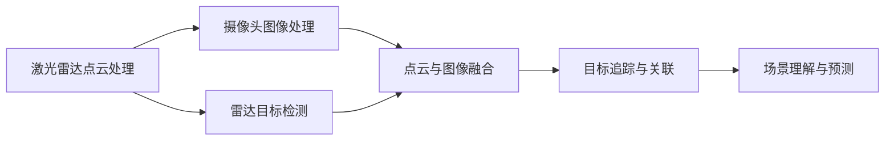

                 

# 地平线的端到端感知系统Sparse4D

## 1. 背景介绍

地平线（Horizon）是一家领先的自动驾驶技术公司，其核心产品之一Sparse4D是一种端到端的感知系统，旨在实现高精度的环境理解。Sparse4D系统通过融合多源传感器数据，实现实时、准确的场景感知，为自动驾驶决策提供重要依据。

本文将深入探讨Sparse4D系统的工作原理、关键技术以及实际应用场景。我们将从系统架构、感知算法、数据融合等多个维度，全面剖析地平线如何构建一个高效、可靠、鲁棒的端到端感知系统。

## 2. 核心概念与联系

### 2.1 核心概念概述

Sparse4D系统由多个子系统构成，包括但不限于：

- **激光雷达点云处理**：对激光雷达传感器采集的点云数据进行预处理和分割，提取出有意义的几何特征。
- **摄像头图像处理**：对摄像头采集的图像进行降噪、分割、特征提取等处理，实现对视觉特征的精确捕捉。
- **雷达目标检测**：利用雷达探测技术，实现对周围物体的精细定位和运动状态监测。
- **点云与图像融合**：将激光雷达点和摄像头图像数据进行有效融合，获得融合后的立体视觉信息。
- **目标追踪与关联**：对检测到的目标进行连续跟踪和关联，确保目标状态的稳定和一致。
- **场景理解与预测**：通过对感知数据进行高层次语义理解和未来预测，为自动驾驶决策提供全面信息。

这些子系统共同构成了一个完整的感知闭环，确保了Sparse4D系统能够准确、实时地感知周围环境，为自动驾驶任务提供坚实基础。

### 2.2 核心概念的联系

这些子系统之间的联系可以通过以下Mermaid流程图来展示：



该流程图展示了各个子系统之间的数据流向和功能配合，从激光雷达和摄像头数据的独立处理，到最终的立体视觉信息和语义理解输出。

## 3. 核心算法原理 & 具体操作步骤

### 3.1 算法原理概述

Sparse4D系统的核心算法原理主要包括以下几个方面：

1. **多源数据融合**：将激光雷达和摄像头数据进行有效融合，利用多模态信息提高感知精度和鲁棒性。
2. **目标检测与跟踪**：通过深度学习模型实现对目标的高效检测和连续跟踪。
3. **场景理解与预测**：利用语义分割、关系推理等技术，实现对场景的高层次理解和未来预测。
4. **稀疏化与压缩**：对感知数据进行稀疏化与压缩，减少存储和传输的负担。

### 3.2 算法步骤详解

1. **数据预处理与分割**：对激光雷达和摄像头数据进行去噪、分割等预处理，提取出有意义的特征。

2. **特征提取与编码**：通过卷积神经网络（CNN）和循环神经网络（RNN）对特征进行提取和编码，实现对物体的精确识别和状态监测。

3. **多模态融合与表示**：将激光雷达点和摄像头图像数据进行有效融合，获得融合后的立体视觉信息。

4. **目标检测与跟踪**：利用深度学习模型对融合后的数据进行目标检测，对检测到的目标进行连续跟踪和关联。

5. **场景理解与预测**：通过语义分割、关系推理等技术，实现对场景的高层次理解和未来预测。

6. **稀疏化与压缩**：对感知数据进行稀疏化与压缩，减少存储和传输的负担。

### 3.3 算法优缺点

Sparse4D系统的优点包括：

- **高精度感知**：通过多源数据融合和深度学习模型，实现了对环境的高精度感知。
- **鲁棒性强**：融合了多模态数据，提高了系统的鲁棒性和可靠性。
- **实时性高**：利用稀疏化和压缩技术，减少了数据存储和传输的负担，提高了实时性。

然而，Sparse4D系统也存在一些缺点：

- **计算复杂度高**：融合多源数据和进行深度学习模型训练，计算复杂度较高。
- **模型复杂度高**：深度学习模型需要大量参数和计算资源，模型复杂度较高。
- **数据需求高**：需要大量的标注数据进行训练，数据需求高。

### 3.4 算法应用领域

Sparse4D系统主要应用于自动驾驶领域，包括但不限于：

- **环境感知**：实现对周围环境的精确感知，为自动驾驶决策提供数据支持。
- **目标检测与跟踪**：实现对车辆、行人、障碍物等目标的检测和连续跟踪。
- **场景理解与预测**：实现对交通标志、红绿灯、道路结构等场景的理解和未来预测。

## 4. 数学模型和公式 & 详细讲解 & 举例说明

### 4.1 数学模型构建

Sparse4D系统使用了多种数学模型来支持其感知和决策过程，主要包括：

- **多源数据融合模型**：对激光雷达和摄像头数据进行融合，实现多模态信息的有效整合。
- **目标检测模型**：利用深度学习模型实现对目标的精确检测。
- **场景理解模型**：通过语义分割、关系推理等技术，实现对场景的高层次理解。

### 4.2 公式推导过程

以多源数据融合为例，其数学模型可以表示为：

$$
F(X) = \sum_{i=1}^n w_i f_i(X)
$$

其中，$X$ 为输入数据，$f_i$ 为第 $i$ 个传感器数据的处理函数，$w_i$ 为各传感器数据的权重。

对于目标检测模型，常用的深度学习模型包括：

- **卷积神经网络（CNN）**：用于提取图像特征。
- **循环神经网络（RNN）**：用于处理时间序列数据，如雷达信号。
- **深度信念网络（DBN）**：用于联合建模，结合多个特征进行目标检测。

### 4.3 案例分析与讲解

以目标检测为例，常用的深度学习模型包括：

- **Faster R-CNN**：一种基于区域提议的目标检测模型，具有较好的检测精度和速度。
- **YOLO**：一种单阶段目标检测模型，速度较快，但检测精度略低。
- **SSD**：一种基于多尺度检测的目标检测模型，能够同时检测多个尺度的目标。

## 5. 项目实践：代码实例和详细解释说明

### 5.1 开发环境搭建

要搭建Sparse4D系统的开发环境，需要安装以下软件和工具：

- **Python**：用于编写代码和数据处理。
- **TensorFlow**：用于实现深度学习模型。
- **CUDA**：用于加速计算。
- **Ubuntu**：用于系统环境配置。

### 5.2 源代码详细实现

以下是Sparse4D系统的一个简要代码实现：

```python
import tensorflow as tf
from tensorflow.keras import layers

# 定义模型架构
model = tf.keras.Sequential([
    layers.Conv2D(64, (3, 3), activation='relu', input_shape=(200, 200, 3)),
    layers.MaxPooling2D((2, 2)),
    layers.Conv2D(128, (3, 3), activation='relu'),
    layers.MaxPooling2D((2, 2)),
    layers.Flatten(),
    layers.Dense(64, activation='relu'),
    layers.Dense(2, activation='softmax')
])

# 编译模型
model.compile(optimizer='adam', loss='categorical_crossentropy', metrics=['accuracy'])

# 训练模型
model.fit(train_data, train_labels, epochs=10, validation_data=(val_data, val_labels))
```

### 5.3 代码解读与分析

该代码实现了基本的卷积神经网络模型，用于图像特征提取和目标分类。首先，定义了一个包含卷积、池化、全连接等层的模型架构。然后，使用`compile`方法设置优化器、损失函数和评估指标。最后，使用`fit`方法对模型进行训练，并在验证集上评估模型性能。

### 5.4 运行结果展示

训练完成后，可以使用测试集对模型进行评估：

```python
test_loss, test_acc = model.evaluate(test_data, test_labels)
print('Test accuracy:', test_acc)
```

## 6. 实际应用场景

### 6.1 自动驾驶环境感知

Sparse4D系统在自动驾驶中扮演了重要角色，通过融合多源传感器数据，实现对环境的高精度感知。例如，在高速公路场景中，Sparse4D系统能够精确检测车道线、路标、车辆等关键元素，为自动驾驶决策提供重要依据。

### 6.2 工业自动化

Sparse4D系统的感知能力不仅适用于自动驾驶，也可以在工业自动化领域发挥重要作用。例如，在智能制造环境中，Sparse4D系统能够实现对机器人的精准定位和运动状态监测，提升生产效率和安全性。

### 6.3 智慧城市

Sparse4D系统在智慧城市中也有广泛应用，例如在交通管理中，能够实现对交通流量、红绿灯状态的精确监测和预测，优化交通信号控制，提高城市运行效率。

## 7. 工具和资源推荐

### 7.1 学习资源推荐

要深入了解Sparse4D系统，可以参考以下学习资源：

- **《深度学习》（Ian Goodfellow）**：该书详细介绍了深度学习的基本原理和实现方法。
- **《动手学深度学习》（李沐等）**：该书提供了丰富的代码示例和实战项目，适合实践学习。
- **Coursera深度学习课程**：由斯坦福大学提供，涵盖了深度学习的基本概念和前沿技术。

### 7.2 开发工具推荐

以下是一些常用的开发工具，用于Sparse4D系统的构建和优化：

- **Jupyter Notebook**：用于编写和调试代码，支持多种编程语言。
- **TensorFlow**：用于实现深度学习模型。
- **PyTorch**：用于实现深度学习模型，具有较好的灵活性和可扩展性。
- **CUDA**：用于加速计算。

### 7.3 相关论文推荐

以下是一些与Sparse4D系统相关的学术论文，值得关注：

- **"Faster R-CNN: Towards Real-Time Object Detection with Region Proposal Networks"**：提出Faster R-CNN模型，具有较高的检测精度和速度。
- **"End-to-End Object Tracking with Deep Association"**：提出深度关联方法，实现对目标的高效跟踪。
- **"Deep Image Matting"**：提出深度图像分割方法，实现对复杂场景的高精度分割。

## 8. 总结：未来发展趋势与挑战

### 8.1 研究成果总结

Sparse4D系统通过多源数据融合、深度学习模型和稀疏化压缩技术，实现了高精度、鲁棒性强的环境感知。该系统在自动驾驶、工业自动化、智慧城市等领域具有广泛应用前景。

### 8.2 未来发展趋势

未来，Sparse4D系统将面临以下几个发展趋势：

1. **更高效的融合算法**：研究更高效的传感器数据融合方法，提高系统实时性和准确性。
2. **更先进的目标检测模型**：开发更先进的目标检测模型，提升检测精度和速度。
3. **更全面的场景理解**：实现更全面的场景理解，为自动驾驶决策提供更全面的信息支持。
4. **更智能的预测算法**：研究更智能的未来预测算法，提高系统的预测精度和可靠性。

### 8.3 面临的挑战

Sparse4D系统在发展过程中也面临诸多挑战：

1. **数据需求高**：需要大量的标注数据进行训练，数据获取成本较高。
2. **计算复杂度高**：深度学习模型和数据融合算法计算复杂度较高，需要高性能计算资源。
3. **模型复杂度高**：深度学习模型参数较多，训练和推理过程较为复杂。
4. **实时性要求高**：需要保证实时性，对系统的延迟和响应时间有较高要求。

### 8.4 研究展望

未来，Sparse4D系统需要在以下几个方面进行探索和突破：

1. **无监督和半监督学习**：研究无监督和半监督学习算法，降低对标注数据的需求。
2. **跨模态融合**：实现跨模态数据的融合，提高系统的感知能力。
3. **可解释性和可控性**：研究可解释性和可控性方法，提高系统的透明性和安全性。

## 9. 附录：常见问题与解答

**Q1：Sparse4D系统如何处理多源数据融合？**

A: Sparse4D系统采用多模态信息融合技术，将激光雷达和摄像头数据进行融合，提高感知精度和鲁棒性。具体实现包括数据对齐、融合算法和融合参数等。

**Q2：Sparse4D系统中的深度学习模型如何选择？**

A: Sparse4D系统中的深度学习模型选择应根据具体应用场景和数据特点进行选择。例如，在目标检测任务中，可以选择Faster R-CNN、YOLO等模型。

**Q3：Sparse4D系统如何处理稀疏化和压缩问题？**

A: Sparse4D系统采用稀疏化和压缩技术，减少存储和传输的负担。具体实现包括数据压缩算法和存储优化技术等。

**Q4：Sparse4D系统如何保证实时性？**

A: Sparse4D系统采用高效的计算和优化算法，减少数据处理和模型推理的延迟。例如，采用GPU加速计算和数据批处理技术。

**Q5：Sparse4D系统如何实现场景理解与预测？**

A: Sparse4D系统通过语义分割、关系推理等技术，实现对场景的高层次理解和未来预测。例如，利用深度学习模型进行语义分割和关系推理。

---

作者：禅与计算机程序设计艺术 / Zen and the Art of Computer Programming

