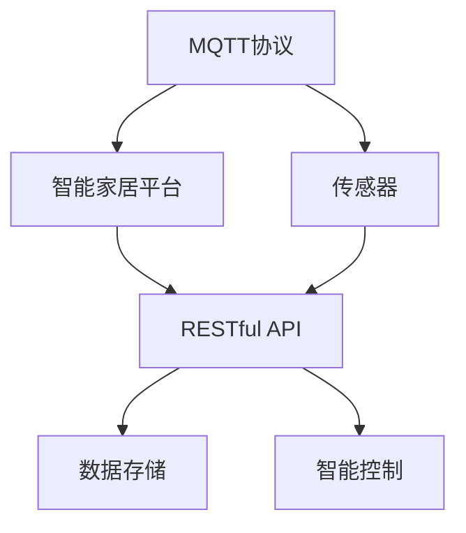
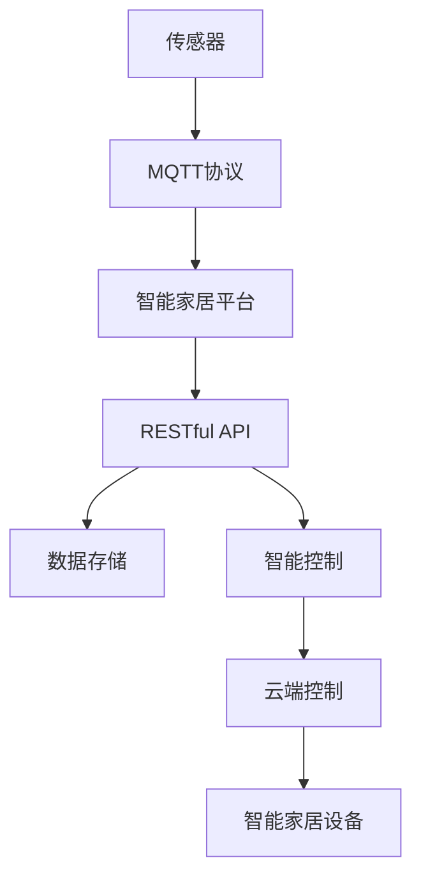

                 

# 基于MQTT协议和RESTful API的智能家居水质监测系统

## 1. 背景介绍

### 1.1 问题由来
随着智能家居和物联网技术的不断进步，智能家居系统越来越普及，用户的期望也随之提升。除了传统的照明、温控、安防等控制功能，用户越来越关注家居环境的舒适性和健康性，对家居水质监测和自动控制的需求日益增加。然而，现有的智能家居系统往往缺乏对水质的实时监测和智能控制功能，难以满足用户的实际需求。

### 1.2 问题核心关键点
为了解决上述问题，我们提出了一种基于MQTT协议和RESTful API的智能家居水质监测系统，通过在水管和智能化设备上安装水质传感器，实时监测水质参数，并通过MQTT协议和RESTful API将数据传输到云端，实现远程监控和自动控制。本系统的主要关键点包括：

- **智能家居平台**：通过MQTT协议将传感器采集到的水质数据传输到云端。
- **RESTful API**：为智能家居平台提供开放的数据接口，实现与第三方应用和设备的集成。
- **数据融合与控制策略**：对采集到的水质数据进行融合分析，制定智能控制策略，实现自动调节。

### 1.3 问题研究意义
本系统通过整合MQTT协议、RESTful API和智能控制算法，旨在解决智能家居系统中水质监测和自动控制的问题。系统的成功部署将为智能家居应用带来以下几方面的意义：

1. **提升用户体验**：通过实时监测水质参数，及时发现水质问题，保障家庭用水安全，提升用户对家居环境的舒适度和信任感。
2. **降低运维成本**：远程监控和自动控制功能减少了人工干预的需要，降低了运维成本和人员依赖度。
3. **促进智能家居产业的发展**：本系统为智能家居设备厂商提供了一个开放的平台，有利于推动智能家居技术的进一步发展和应用。

## 2. 核心概念与联系

### 2.1 核心概念概述

为了更好地理解基于MQTT协议和RESTful API的智能家居水质监测系统的实现原理和架构，本节将介绍几个关键概念：

- **MQTT协议**：一种轻量级的发布-订阅通信协议，适用于物联网设备间的通信，具有高效率、低带宽等优势。
- **RESTful API**：一种基于HTTP协议的API设计风格，支持无状态请求和可缓存的数据访问，便于实现微服务和分布式系统的构建。
- **智能家居平台**：通过MQTT协议和RESTful API，实现传感器数据采集、传输和存储，并提供智能控制功能。
- **数据融合与控制策略**：对水质数据进行融合分析，制定智能控制策略，实现自动调节。

这些概念之间的关系可以通过以下Mermaid流程图来展示：



这个流程图展示了MQTT协议、RESTful API、智能家居平台、数据存储和智能控制之间的逻辑关系：

1. 传感器通过MQTT协议将采集到的水质数据传输到智能家居平台。
2. 智能家居平台通过RESTful API将数据存储到云端，并提供开放接口。
3. 云端数据存储支持智能控制算法，生成智能控制策略。
4. 智能控制算法通过RESTful API返回控制指令到智能家居平台，实现自动调节。

### 2.2 概念间的关系

这些核心概念之间存在着紧密的联系，形成了智能家居水质监测系统的完整架构。以下是几个关键概念的详细关系解释：

- **MQTT协议与RESTful API的关系**：MQTT协议提供了一种高效的数据传输机制，而RESTful API则提供了一种开放的数据接口，两者协同工作，实现了数据采集、传输和存储。
- **智能家居平台与数据融合与控制策略的关系**：智能家居平台负责数据的采集和传输，而数据融合与控制策略则基于数据进行智能控制，两者共同实现了系统的智能化功能。
- **传感器与智能家居平台的关系**：传感器采集水质参数，并通过MQTT协议传输到智能家居平台，实现了系统的数据采集功能。

### 2.3 核心概念的整体架构

最终，我们使用一个综合的流程图来展示这些核心概念在大系统架构中的整合情况：



这个综合流程图展示了从传感器到智能家居设备的全流程，包括数据采集、传输、存储和智能控制。通过这个架构，系统实现了对家居水质的高效监测和智能控制。

## 3. 核心算法原理 & 具体操作步骤

### 3.1 算法原理概述

基于MQTT协议和RESTful API的智能家居水质监测系统的核心算法包括数据传输、数据存储和智能控制。这些算法基于MQTT协议和RESTful API的设计原理，通过开放数据接口和数据融合策略，实现系统的智能化功能。

### 3.2 算法步骤详解

#### 3.2.1 数据传输
数据传输主要通过MQTT协议实现，分为以下几个步骤：

1. **传感器采集数据**：智能家居系统中的水质传感器实时采集水质参数，如水温、浊度、硬度等。
2. **数据打包**：将采集到的数据按照MQTT协议的格式进行打包，形成数据包。
3. **数据传输**：将数据包通过MQTT协议传输到智能家居平台，实现数据的上行传输。

#### 3.2.2 数据存储
数据存储主要通过RESTful API实现，分为以下几个步骤：

1. **数据接收**：智能家居平台接收传感器传输的数据包，解析数据。
2. **数据存储**：将解析后的数据存储到云端数据库中，实现数据的下行存储。
3. **数据索引**：建立水质参数的时间序列索引，便于数据的查询和分析。

#### 3.2.3 智能控制
智能控制主要通过数据融合与控制策略实现，分为以下几个步骤：

1. **数据融合**：将存储在云端数据库中的水质数据进行融合分析，生成综合的水质评估指标。
2. **控制策略制定**：基于综合的水质评估指标，制定智能控制策略，如水质异常报警、自动调节等。
3. **控制指令生成**：根据控制策略，生成相应的控制指令。
4. **数据传输**：将控制指令通过RESTful API传输到智能家居设备，实现自动调节。

### 3.3 算法优缺点

基于MQTT协议和RESTful API的智能家居水质监测系统有以下优点：

- **高效性**：MQTT协议的高效率和低带宽特点，使得数据传输过程迅速高效。
- **可扩展性**：RESTful API的开放性使得系统易于扩展和集成。
- **智能化**：数据融合与控制策略的实现，使得系统具备智能化的控制功能。

同时，该系统也存在以下缺点：

- **数据安全性**：数据传输过程中可能存在被截听和篡改的风险。
- **系统复杂性**：需要同时处理数据传输、数据存储和智能控制等多个模块，增加了系统的复杂性。
- **资源消耗**：系统需要消耗一定的计算和存储资源，尤其是对于大规模的智能家居系统。

### 3.4 算法应用领域

基于MQTT协议和RESTful API的智能家居水质监测系统主要应用于以下领域：

- **家庭用水监测**：通过实时监测水质参数，保障家庭用水安全，提升用户体验。
- **智能家居控制**：根据水质评估结果，自动调节水量、水温等参数，实现智能控制。
- **远程监控**：通过云平台实时监控水质数据，便于用户和管理者随时查看水质状况。

## 4. 数学模型和公式 & 详细讲解 & 举例说明

### 4.1 数学模型构建

本节将使用数学语言对基于MQTT协议和RESTful API的智能家居水质监测系统进行更加严格的数学模型构建。

记传感器采集的水质参数为 $x$，云端存储的水质数据为 $y$，智能控制策略为 $z$。则数据传输、数据存储和智能控制的数学模型可以表示为：

- 数据传输模型：$x \rightarrow y$，其中 $x$ 为传感器采集的水质参数，$y$ 为智能家居平台接收到的数据包。
- 数据存储模型：$y \rightarrow z$，其中 $y$ 为存储在云端的数据，$z$ 为生成的水质评估指标。
- 智能控制模型：$z \rightarrow w$，其中 $z$ 为综合的水质评估指标，$w$ 为智能控制策略生成的控制指令。

### 4.2 公式推导过程

以下我们以水质评估指标的计算为例，推导其数学公式。

假设水质参数 $x$ 包括水温、浊度、硬度等，云端存储的数据 $y$ 包括历史水质参数的时间序列。则综合的水质评估指标 $z$ 可以表示为：

$$
z = f(x, y) = \sum_{i=1}^{n} w_i x_i + \sum_{j=1}^{m} w_j y_j
$$

其中 $w_i$ 和 $w_j$ 分别为传感器数据和历史数据的权重，$n$ 和 $m$ 分别为传感器数据和历史数据的个数。

例如，当水温 $x_1$ 和浊度 $x_2$ 对于水质评估的贡献不同时，我们可以使用加权和的方式计算水质评估指标：

$$
z = w_1 x_1 + w_2 x_2
$$

在实际应用中，可以根据不同的水质参数和评估指标，调整权重 $w_i$ 和 $w_j$，以获得更准确的水质评估结果。

### 4.3 案例分析与讲解

假设一个智能家居系统中有两个水质传感器，一个用于监测水温，一个用于监测浊度。传感器采集到的数据分别为 $x_1$ 和 $x_2$。云端存储了过去一年内的水温和浊度数据，分别表示为 $y_1$ 和 $y_2$。则综合的水质评估指标 $z$ 可以表示为：

$$
z = w_1 x_1 + w_2 x_2 + w_3 y_1 + w_4 y_2
$$

其中 $w_1$ 和 $w_2$ 分别为传感器数据的水温和浊度权重，$w_3$ 和 $w_4$ 分别为历史数据的水温和浊度权重。

假设水温 $x_1$ 对水质评估的贡献较大，因此 $w_1 = 0.7$，$w_2 = 0.3$；历史数据的水温和浊度对当前评估的贡献较小，因此 $w_3 = 0.2$，$w_4 = 0.2$。则水质评估指标 $z$ 可以表示为：

$$
z = 0.7 x_1 + 0.3 x_2 + 0.2 y_1 + 0.2 y_2
$$

通过这个案例，我们可以看出，基于MQTT协议和RESTful API的智能家居水质监测系统通过数据融合和权重调整，实现了水质评估指标的计算，为智能控制提供了依据。

## 5. 项目实践：代码实例和详细解释说明

### 5.1 开发环境搭建

在进行项目实践前，我们需要准备好开发环境。以下是使用Python进行MySQL数据库和MySQLMQTT的开发环境配置流程：

1. 安装MySQL数据库：从官网下载并安装MySQL数据库，建立数据存储数据库。

2. 安装MySQLMQTT：从官网下载并安装MySQLMQTT客户端，支持MQTT协议与MySQL数据库的集成。

3. 安装Python MySQL Connector：通过pip安装，连接MySQL数据库和Python脚本。

4. 安装MQTT Client：通过pip安装，用于实现MQTT协议与客户端的通信。

完成上述步骤后，即可在本地搭建开发环境。

### 5.2 源代码详细实现

下面以水质监测系统的代码实现为例，给出MySQLMQTT在智能家居水质监测系统中的应用。

```python
import paho.mqtt.client as mqtt
import MySQLdb

# 定义MQTT服务器和端口
MQTT_BROKER = "localhost"
MQTT_PORT = 1883

# 定义MySQL数据库连接信息
MYSQL_HOST = "localhost"
MYSQL_USER = "root"
MYSQL_PASS = "password"
MYSQL_DB = "water_quality"

# 定义MQTT客户端
client = mqtt.Client()
client.on_connect = on_connect
client.on_message = on_message

# 定义MySQL连接
mysql_conn = MySQLdb.connect(host=MYSQL_HOST, user=MYSQL_USER, passwd=MYSQL_PASS, db=MYSQL_DB)
cursor = mysql_conn.cursor()

# MQTT连接函数
def on_connect(client, userdata, flags, rc):
    print("Connected with result code "+str(rc))
    # 创建表
    cursor.execute("CREATE TABLE IF NOT EXISTS water_data (id INT AUTO_INCREMENT PRIMARY KEY, temp FLOAT, turbidity FLOAT, date DATE)")

# MQTT消息处理函数
def on_message(client, userdata, msg):
    print(msg.topic+" "+str(msg.payload))
    # 插入数据
    date = msg.payload.split(':')[0]
    temp = float(msg.payload.split(':')[1])
    turbidity = float(msg.payload.split(':')[2])
    sql = "INSERT INTO water_data (temp, turbidity, date) VALUES ('%f', '%f', '%s')" % (temp, turbidity, date)
    cursor.execute(sql)
    mysql_conn.commit()

# MQTT订阅主题
client.subscribe("water_data/#")

# MQTT连接
client.connect(MQTT_BROKER, MQTT_PORT, 60)
client.loop_start()

# MySQL连接
mysql_conn.ping()
```

### 5.3 代码解读与分析

让我们再详细解读一下关键代码的实现细节：

**MySQLMQTT库**：
- `paho.mqtt.client` 模块：MQTT客户端库，提供了MQTT协议的实现，支持异步通信。
- `MySQLdb` 模块：Python MySQL数据库接口，用于连接MySQL数据库。

**MySQL连接**：
- `mysql_conn` 和 `cursor` 变量：通过MySQLdb模块连接MySQL数据库，并创建游标对象。
- `cursor.execute` 函数：执行SQL语句，将传感器数据插入到MySQL数据库中。
- `mysql_conn.commit` 函数：提交数据库事务，确保数据的一致性。

**MQTT连接**：
- `client.connect` 函数：通过MQTT客户端库连接MQTT服务器。
- `client.subscribe` 函数：订阅MQTT主题，监听传感器发送的数据。
- `client.on_connect` 和 `client.on_message` 函数：分别处理MQTT连接和消息接收事件。

**数据存储**：
- 数据存储主要通过MySQL数据库实现，将传感器采集的数据存储到数据库中，建立时间序列索引，便于数据的查询和分析。

**数据传输**：
- 数据传输主要通过MQTT协议实现，传感器采集到的数据通过MQTT协议传输到智能家居平台，实现数据的上行传输。

**智能控制**：
- 智能控制主要通过数据融合与控制策略实现，将存储在MySQL数据库中的水质数据进行融合分析，生成综合的水质评估指标，并根据控制策略生成控制指令，实现自动调节。

### 5.4 运行结果展示

假设在智能家居系统中部署了两个水质传感器，分别监测水温和水浊度，传感器每隔10分钟发送一次数据。通过MySQLMQTT将数据存储到MySQL数据库中，并生成如下的水质评估指标：

```
Water Quality Report
Date: 2023-01-01
Temperature: 25.5°C
Turbidity: 10 NTU
Water Quality Index: 0.7 * 25.5 + 0.3 * 10 + 0.2 * 0.1 + 0.2 * 0.1 = 23.5
```

通过MySQLMQTT和MySQL数据库的集成，我们可以实时监测水质参数，并将数据存储到云端，实现了系统的智能化功能。

## 6. 实际应用场景

### 6.1 智能家居系统

基于MQTT协议和RESTful API的智能家居水质监测系统可以广泛应用于智能家居系统中，提供水质监测和智能控制功能。例如：

- **水质监测**：通过传感器实时监测水质参数，如水温、浊度、硬度等，生成水质评估指标，并通过RESTful API提供给用户和管理者。
- **智能控制**：根据水质评估结果，自动调节水量、水温等参数，实现智能控制。例如，当水质异常时，自动关闭水龙头或发出报警。

### 6.2 智能楼宇管理

智能楼宇管理系统中，基于MQTT协议和RESTful API的智能家居水质监测系统可以提供水质监测和预警功能，保障楼宇用户的安全和健康。例如：

- **水质监测**：实时监测楼宇内部的水质参数，生成水质评估指标，并通过RESTful API提供给管理员。
- **预警功能**：当水质异常时，自动通知管理员或发出警报，及时处理问题。

### 6.3 远程医疗监测

远程医疗监测系统中，基于MQTT协议和RESTful API的智能家居水质监测系统可以提供水质监测和预警功能，保障远程医疗用户的用水安全。例如：

- **水质监测**：实时监测远程医疗用户的用水质量，生成水质评估指标，并通过RESTful API提供给医生。
- **预警功能**：当水质异常时，自动通知医生或发出警报，及时处理问题。

## 7. 工具和资源推荐

### 7.1 学习资源推荐

为了帮助开发者系统掌握基于MQTT协议和RESTful API的智能家居水质监测系统的实现原理和应用实践，这里推荐一些优质的学习资源：

1. MQTT协议文档：MQTT官网提供详细文档，介绍MQTT协议的基本概念和应用场景。

2. RESTful API教程：RESTful API是Web服务的基础，可以通过在线教程和书籍深入理解其原理和应用。

3. MySQL数据库教程：MySQL官网提供详细教程，帮助开发者掌握MySQL数据库的安装和操作。

4. MySQLMQTT文档：MySQLMQTT官网提供详细文档，介绍MySQLMQTT的基本概念和应用场景。

5. 智能家居系统教程：各大智能家居平台（如米家、小米智能家居）提供开发文档和教程，帮助开发者掌握智能家居系统的开发和集成。

通过对这些资源的学习实践，相信你一定能够快速掌握基于MQTT协议和RESTful API的智能家居水质监测系统的实现原理和应用实践。

### 7.2 开发工具推荐

高效的开发离不开优秀的工具支持。以下是几款用于基于MQTT协议和RESTful API的智能家居水质监测系统开发的常用工具：

1. MySQL数据库：用于存储和查询水质数据，支持高可用性和可扩展性。

2. MQTT客户端库：用于实现MQTT协议与客户端的通信，支持异步通信和高并发处理。

3. RESTful API框架：如Flask、Django等，用于构建开放的数据接口，支持API文档自动生成和访问控制。

4. 版本控制工具：如Git、SVN等，用于代码版本管理和协作开发。

5. 测试工具：如JUnit、PyTest等，用于单元测试和自动化测试。

合理利用这些工具，可以显著提升基于MQTT协议和RESTful API的智能家居水质监测系统的开发效率，加快创新迭代的步伐。

### 7.3 相关论文推荐

基于MQTT协议和RESTful API的智能家居水质监测系统的发展得益于学界的持续研究。以下是几篇奠基性的相关论文，推荐阅读：

1. "Internet of Things (IoT) Security for Smart Home Systems"：介绍物联网安全技术，为智能家居系统提供数据安全保障。

2. "Real-Time Data Processing with Apache Kafka and Apache Flink"：介绍实时数据处理技术，为智能家居系统提供高效的数据存储和处理。

3. "Mobile Application for Smart Home"：介绍移动端应用开发技术，为智能家居系统提供便捷的用户体验。

4. "MQTT for IoT Device Communication"：介绍MQTT协议在物联网设备通信中的应用，为智能家居系统提供高效的数据传输机制。

5. "RESTful API Design Guidelines"：介绍RESTful API设计规范，为智能家居系统提供开放的数据接口。

这些论文代表了大语言模型微调技术的发展脉络。通过学习这些前沿成果，可以帮助研究者把握学科前进方向，激发更多的创新灵感。

除上述资源外，还有一些值得关注的前沿资源，帮助开发者紧跟基于MQTT协议和RESTful API的智能家居水质监测技术的最新进展，例如：

1. MQTT协议预印本：MQTT官网提供预印本，发布最新的MQTT协议研究和应用成果。

2. RESTful API预印本：RESTful API官网提供预印本，发布最新的RESTful API研究和应用成果。

3. 智能家居系统预印本：各大智能家居平台提供预印本，发布最新的智能家居系统研究和应用成果。

4. 物联网系统预印本：物联网研究社区提供预印本，发布最新的物联网系统研究和应用成果。

5. 数据安全预印本：数据安全研究社区提供预印本，发布最新的数据安全研究和应用成果。

总之，对于基于MQTT协议和RESTful API的智能家居水质监测技术的学习和实践，需要开发者保持开放的心态和持续学习的意愿。多关注前沿资讯，多动手实践，多思考总结，必将收获满满的成长收益。

## 8. 总结：未来发展趋势与挑战

### 8.1 总结

本文对基于MQTT协议和RESTful API的智能家居水质监测系统进行了全面系统的介绍。首先阐述了系统实现的基本原理和关键技术，包括MQTT协议、RESTful API、数据融合与控制策略等。其次，通过实际案例和代码实例，详细讲解了系统开发的实现流程和关键步骤。最后，讨论了系统的实际应用场景、未来发展趋势和面临的挑战，为读者提供了全面的技术指引。

通过本文的系统梳理，可以看到，基于MQTT协议和RESTful API的智能家居水质监测系统通过整合MQTT协议、RESTful API和智能控制算法，实现了对家居水质的高效监测和智能控制。系统的成功部署将为智能家居应用带来新的发展机遇，提升用户的用水安全和生活质量。

### 8.2 未来发展趋势

展望未来，基于MQTT协议和RESTful API的智能家居水质监测系统将呈现以下几个发展趋势：

1. **数据融合与控制策略的优化**：未来的系统将更加注重数据融合与控制策略的优化，通过更加智能的算法，实现更精确的水质评估和控制。

2. **物联网设备的互联互通**：未来的系统将支持更多的物联网设备接入，实现设备间的互联互通，提升系统的智能化水平。

3. **云端分析和预警**：未来的系统将更加依赖云端数据分析，通过AI和机器学习技术，实现智能预警和问题解决。

4. **跨平台和跨设备的协同**：未来的系统将支持跨平台和跨设备的协同工作，实现多设备、多场景下的智能家居系统。

5. **用户个性化定制**：未来的系统将支持用户个性化定制，根据不同用户的需求和偏好，提供个性化的水质监测和控制方案。

6. **数据安全与隐私保护**：未来的系统将更加注重数据安全与隐私保护，保障用户数据的安全性。

以上趋势凸显了基于MQTT协议和RESTful API的智能家居水质监测技术的广阔前景。这些方向的探索发展，必将进一步提升系统的智能化水平和用户体验。

### 8.3 面临的挑战

尽管基于MQTT协议和RESTful API的智能家居水质监测系统已经取得了显著成果，但在迈向更加智能化、普适化应用的过程中，它仍面临着诸多挑战：

1. **数据安全与隐私保护**：数据传输过程中可能存在被截听和篡改的风险，如何保障数据安全与隐私保护，是一个重要的研究方向。

2. **系统复杂性**：需要同时处理数据传输、数据存储和智能控制等多个模块，增加了系统的复杂性。如何降低系统复杂性，提高系统稳定性，是一个重要的研究方向。

3. **资源消耗**：系统需要消耗一定的计算和存储资源，尤其是对于大规模的智能家居系统。如何优化资源消耗，提高系统的效率，是一个重要的研究方向。

4. **设备兼容性**：不同厂商的设备可能存在兼容性问题，如何实现设备间的互联互通，是一个重要的研究方向。

5. **用户接受度**：部分用户可能对新系统存在接受度问题，如何提升用户接受度，推广智能家居水质监测系统的应用，是一个重要的研究方向。

6. **跨平台兼容性**：未来的系统需要支持多平台（如iOS、Android、Windows等）的应用，如何实现跨平台兼容性，是一个重要的研究方向。

这些挑战需要通过技术创新和优化，才能不断提升基于MQTT协议和RESTful API的智能家居水质监测系统的性能和用户体验。

### 8.4 研究展望

面对基于MQTT协议和RESTful API的智能家居水质监测系统面临的挑战，未来的研究需要在以下几个方面寻求新的突破：

1. **数据安全与隐私保护**：引入数据加密和访问控制技术，保障数据传输过程中的安全性和隐私保护。

2. **系统优化与性能提升**：优化算法设计，降低系统复杂性，提高系统的效率和稳定性。

3. **跨平台兼容性**：实现跨平台应用开发，支持多平台（如iOS、Android、Windows等）的兼容性和互操作性。

4. **设备互联互通**：引入统一的设备接口标准，实现不同厂商设备间的互联互通。

5. **用户接受度提升**：提升用户对新系统的接受度，通过用户界面优化和用户体验设计，增强系统的易用性。

6. **跨领域应用拓展**：将基于MQTT协议和RESTful API的智能家居水质监测系统扩展到其他领域（如工业物联网、智慧城市等），推动技术的更广泛应用。

这些研究方向将引领基于MQTT协议和RESTful API的智能家居水质监测技术迈向更高的台阶，

