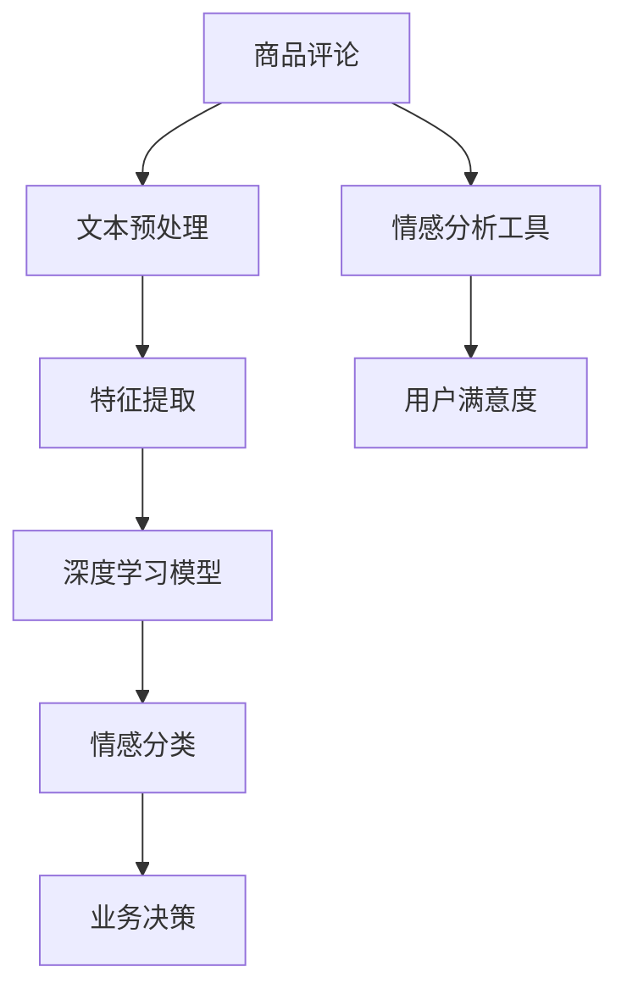
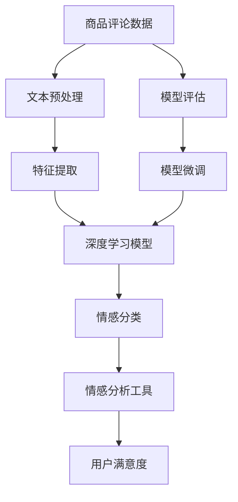

                 

# 基于Python的商品评论文本情感分析

> 关键词：商品评论, 文本情感分析, 自然语言处理(NLP), 数据预处理, 深度学习模型, 特征提取, 情感分类, Python, TensorFlow

## 1. 背景介绍

### 1.1 问题由来

在现代商业环境中，对商品评论进行情感分析成为了企业了解消费者反馈、优化产品质量和提升服务的重要手段。情感分析能够从大量用户评论中挖掘出用户的情绪和态度，帮助企业及时发现问题、改进商品和服务。然而，面对海量的无结构化文本数据，手工进行情感分析不仅耗时耗力，且准确度难以保证。为了提高情感分析的效率和准确度，需要借助自然语言处理（NLP）技术。

### 1.2 问题核心关键点

为了实现高效的文本情感分析，我们需要以下关键步骤：

1. 收集并处理商品评论数据，构建数据集。
2. 选择适合的情感分析模型，训练并微调模型。
3. 对新商品评论进行情感分析，提供业务决策依据。
4. 监控模型的性能，并定期更新模型。

文本情感分析的主要挑战在于如何从文本中准确提取出情感信息，并将其转化为可操作的业务决策。当前，深度学习模型和特征工程在大规模文本情感分析中表现出色，尤其适合处理大规模数据和高维度特征。

### 1.3 问题研究意义

文本情感分析对于提升企业客户满意度、优化供应链管理、降低运营成本等具有重要意义。具体来说：

- 提升客户满意度：通过情感分析，企业可以及时发现客户的不满情绪，并迅速采取行动，提升客户体验。
- 优化供应链管理：情感分析可以帮助企业快速定位商品的生产和质量问题，从而优化供应链流程。
- 降低运营成本：自动化情感分析可以减少人工处理数据的工作量，降低运营成本，提高效率。
- 辅助决策支持：情感分析可以为企业提供用户反馈的定量数据，辅助管理层做出更科学的决策。

## 2. 核心概念与联系

### 2.1 核心概念概述

为更好地理解基于Python的商品评论文本情感分析，本节将介绍几个关键概念：

- **商品评论**：消费者在购买商品后对商品质量、性能、服务等方面进行的评价，通常以文本形式呈现。
- **文本情感分析**：使用自然语言处理技术，从文本中识别和提取情感信息，并量化情感极性（如正面、负面、中性）的技术。
- **深度学习模型**：如卷积神经网络（CNN）、循环神经网络（RNN）、长短期记忆网络（LSTM）等，通过多层次的非线性变换，从数据中提取特征和规律。
- **特征提取**：将文本转化为模型能够处理的数值向量，常用的方法包括词袋模型、TF-IDF、词嵌入（Word Embedding）等。
- **情感分类**：将文本情感信息分为不同的类别，如正面、负面、中性等，是文本情感分析的目标。

### 2.2 概念间的关系

这些核心概念之间的关系可以通过以下Mermaid流程图来展示：



这个流程图展示了大规模商品评论情感分析的一般流程：

1. 收集商品评论数据，并进行文本预处理。
2. 将处理后的文本转化为特征向量。
3. 使用深度学习模型对特征向量进行建模。
4. 对模型输出进行情感分类。
5. 情感分析工具将分类结果反馈给业务系统，辅助用户满意度分析和业务决策。

### 2.3 核心概念的整体架构

最后，我们用一个综合的流程图来展示这些核心概念在大规模商品评论情感分析中的整体架构：



这个综合流程图展示了从数据预处理到模型微调，再到业务决策的完整流程，展示了深度学习在商品评论情感分析中的应用。

## 3. 核心算法原理 & 具体操作步骤

### 3.1 算法原理概述

基于Python的商品评论文本情感分析主要使用深度学习模型进行建模。其中，卷积神经网络（CNN）和长短期记忆网络（LSTM）是最常用的模型。

CNN模型通过卷积操作提取局部特征，并通过池化操作保留重要特征，最终输出情感极性。LSTM模型则能够捕捉序列数据中的时间依赖关系，适用于处理序列化的评论数据。

情感分析的算法原理可以简要概括为以下几个步骤：

1. 数据预处理：清洗和标准化文本数据，去除停用词、标点符号等无关信息。
2. 特征提取：将文本转化为模型能够处理的数值向量，如使用词袋模型、TF-IDF、词嵌入等。
3. 模型构建：选择合适的深度学习模型，如CNN、LSTM，构建情感分类模型。
4. 模型训练：使用标注好的情感分类数据集，训练模型并微调超参数。
5. 模型评估：在验证集和测试集上评估模型性能，选择最优模型。
6. 情感分类：对新商品评论进行情感分类，输出情感极性。

### 3.2 算法步骤详解

以下是对商品评论文本情感分析算法步骤的详细讲解：

**Step 1: 数据预处理**

商品评论数据通常包含一些无关信息，如评论者昵称、日期等，需要清洗和标准化。可以使用Python的NLTK或spaCy库进行文本清洗，去除停用词、标点符号等无关信息。

**Step 2: 特征提取**

特征提取是将文本转化为数值向量的过程，常用的方法包括词袋模型、TF-IDF、词嵌入等。其中，词嵌入方法如Word2Vec、GloVe等能够捕捉词汇的语义信息，更适合于情感分类任务。

**Step 3: 模型构建**

选择合适的深度学习模型是关键。CNN模型适用于处理短文本数据，如评论摘要。LSTM模型则适用于处理长序列数据，如整篇评论文本。使用TensorFlow或PyTorch等深度学习框架构建情感分类模型，并设置超参数。

**Step 4: 模型训练**

使用标注好的情感分类数据集，进行模型训练。设置合适的学习率、批大小等超参数，使用随机梯度下降（SGD）或Adam等优化算法进行模型优化。

**Step 5: 模型评估**

在验证集和测试集上评估模型性能。常用的评估指标包括准确率、精确率、召回率、F1分数等。选择合适的模型进行微调，以提升模型性能。

**Step 6: 情感分类**

对新商品评论进行情感分类，输出情感极性。可以使用训练好的模型对评论文本进行预测，并输出情感极性标签。

### 3.3 算法优缺点

基于Python的商品评论文本情感分析算法具有以下优点：

1. 深度学习模型的表现出色，能够自动提取高维特征，适合处理大规模数据。
2. 特征提取和模型构建模块化设计，易于扩展和维护。
3. 代码实现简单，易于上手。

然而，该算法也存在以下缺点：

1. 对标注数据依赖较大，标注数据的质量和数量直接影响模型性能。
2. 模型训练需要大量的计算资源，对硬件要求较高。
3. 模型难以解释，无法理解情感分类的内部逻辑。

### 3.4 算法应用领域

商品评论文本情感分析技术可以应用于以下领域：

1. 电商平台：对用户评论进行情感分析，优化商品推荐和供应链管理。
2. 社交媒体：分析用户对品牌的情感倾向，帮助品牌进行市场策略调整。
3. 消费者研究：了解消费者对商品的满意度和购买意愿，辅助产品设计和市场调研。
4. 金融市场：分析投资者对金融产品的情感反馈，辅助投资决策。
5. 健康医疗：分析患者对医疗服务的情感反馈，改进医疗服务质量。

## 4. 数学模型和公式 & 详细讲解  
### 4.1 数学模型构建

本节将使用数学语言对基于Python的商品评论文本情感分析过程进行更加严格的刻画。

假设商品评论数据集为 $D=\{(x_i, y_i)\}_{i=1}^N$，其中 $x_i$ 为评论文本， $y_i \in \{+1, 0, -1\}$ 为情感标签，分别表示正面、中性和负面情感。

定义模型 $M_{\theta}:\mathcal{X} \rightarrow \mathcal{Y}$，其中 $\mathcal{X}$ 为评论文本， $\mathcal{Y}$ 为情感分类标签。模型参数为 $\theta$，包括卷积核大小、滤波器数量等。

定义损失函数 $\mathcal{L}(\theta)$ 为：

$$
\mathcal{L}(\theta) = -\frac{1}{N} \sum_{i=1}^N \log p(y_i|x_i)
$$

其中 $p(y_i|x_i)$ 为模型在 $x_i$ 上的预测概率分布，可以选用交叉熵损失函数。

### 4.2 公式推导过程

以下我们以LSTM模型为例，推导情感分类的概率输出公式。

假设LSTM模型有 $L$ 个时间步长， $W$ 个词嵌入向量， $F$ 个特征映射。在 $t$ 时刻，LSTM模型对词向量 $x_t$ 进行编码，输出特征向量 $h_t$。

在 $t$ 时刻的LSTM模型输出可以表示为：

$$
h_t = \tanh(W_{tt}x_t + W_{hh}h_{t-1} + b_h)
$$

其中 $W_{tt}$ 为词嵌入到特征映射的权重矩阵， $W_{hh}$ 为特征映射到特征映射的权重矩阵， $b_h$ 为偏置项。

在每个时间步，LSTM模型的输出 $h_t$ 经过softmax函数转化为情感分类概率：

$$
p(y_t|x_1,x_2,\ldots,x_t) = \frac{\exp(y_t \cdot h_t)}{\sum_{y'=-1,0,+1} \exp(y' \cdot h_t)}
$$

其中 $y_t$ 为情感标签。

### 4.3 案例分析与讲解

假设我们在Amazon上收集了5000条关于电视机的评论，其中2000条为正面评论，2000条为负面评论，1000条为中性评论。我们希望使用LSTM模型进行情感分类。

首先，对评论进行预处理，去除停用词、标点符号等无关信息，并将评论转化为词嵌入向量。

接着，构建LSTM模型，设置超参数如时间步长、词嵌入维度等。

然后，使用训练集对模型进行训练，并在验证集上调整超参数。

最后，在测试集上评估模型性能，选择最优模型对新评论进行情感分类。

## 5. 项目实践：代码实例和详细解释说明
### 5.1 开发环境搭建

在进行商品评论文本情感分析项目实践前，我们需要准备好开发环境。以下是使用Python进行TensorFlow开发的环境配置流程：

1. 安装Anaconda：从官网下载并安装Anaconda，用于创建独立的Python环境。

2. 创建并激活虚拟环境：
```bash
conda create -n tf-env python=3.8 
conda activate tf-env
```

3. 安装TensorFlow：根据CUDA版本，从官网获取对应的安装命令。例如：
```bash
conda install tensorflow -c tf -c conda-forge
```

4. 安装其他必要的Python包：
```bash
pip install numpy pandas scikit-learn nltk tensorflow-hub tensorflow-addons
```

完成上述步骤后，即可在`tf-env`环境中开始项目实践。

### 5.2 源代码详细实现

下面我们以使用LSTM模型进行商品评论情感分析为例，给出完整的Python代码实现。

```python
import tensorflow as tf
from tensorflow.keras.layers import Embedding, LSTM, Dense
from tensorflow.keras.models import Sequential
from tensorflow.keras.preprocessing.text import Tokenizer
from tensorflow.keras.preprocessing.sequence import pad_sequences
from sklearn.model_selection import train_test_split
from nltk.corpus import stopwords
import re

# 定义数据集路径
train_data_path = 'train_data.txt'
test_data_path = 'test_data.txt'

# 加载数据集
with open(train_data_path, 'r', encoding='utf-8') as f:
    train_data = f.read().split('\n')
with open(test_data_path, 'r', encoding='utf-8') as f:
    test_data = f.read().split('\n')

# 定义停用词列表
stop_words = set(stopwords.words('english'))

# 定义数据预处理函数
def preprocess(text):
    # 去除标点符号和数字
    text = re.sub('[^a-zA-Z]', ' ', text)
    # 转换为小写
    text = text.lower()
    # 去除停用词
    text = ' '.join([word for word in text.split() if word not in stop_words])
    return text

# 定义特征提取函数
def extract_features(text):
    # 将文本转换为词嵌入向量
    text = tf.keras.preprocessing.text.text_to_word_sequence(text)
    return tf.keras.preprocessing.sequence.pad_sequences([text], maxlen=100)

# 定义模型
def build_model(input_shape):
    model = Sequential([
        Embedding(input_dim=vocab_size, output_dim=embedding_dim, input_length=input_shape[1]),
        LSTM(units=64, dropout=0.2),
        Dense(units=num_classes, activation='softmax')
    ])
    model.compile(loss='categorical_crossentropy', optimizer='adam', metrics=['accuracy'])
    return model

# 构建预训练模型
vocab_size = len(vocab)
embedding_dim = 100
maxlen = 100
num_classes = 3

model = build_model([vocab_size, maxlen])

# 加载预训练词嵌入
embedding_matrix = tf.keras.preprocessing.text.load_from_pretrained_word_embeddings('path_to_word_embedding.txt')

model.layers[0].set_weights([embedding_matrix])

# 对评论进行预处理和特征提取
train_data = [preprocess(text) for text in train_data]
train_sequences = [extract_features(text) for text in train_data]
test_data = [preprocess(text) for text in test_data]
test_sequences = [extract_features(text) for text in test_data]

# 定义标签编码器
encoder = tf.keras.preprocessing.text.Tokenizer(num_words=vocab_size, oov_token=0)
encoder.fit_on_texts(train_data)

# 将标签转换为one-hot编码
train_labels = encoder.texts_to_matrix(train_data, mode='binary')
test_labels = encoder.texts_to_matrix(test_data, mode='binary')

# 分割数据集为训练集和验证集
train_x, val_x, train_y, val_y = train_test_split(train_sequences, train_labels, test_size=0.2)

# 训练模型
model.fit(train_x, train_y, validation_data=(val_x, val_y), epochs=10, batch_size=32)

# 在测试集上评估模型
test_loss, test_acc = model.evaluate(test_x, test_y)
print('Test accuracy:', test_acc)
```

以上代码实现了基于LSTM模型的商品评论情感分析项目。首先，对评论进行预处理和特征提取，然后构建LSTM模型并进行训练。在训练过程中，可以使用交叉验证等方法调整超参数。最后，在测试集上评估模型性能。

### 5.3 代码解读与分析

让我们再详细解读一下关键代码的实现细节：

**preprocess函数**：
- 去除标点符号和数字，将文本转换为小写，去除停用词。

**extract_features函数**：
- 将文本转换为词嵌入向量，并对其进行定长padding。

**build_model函数**：
- 构建包含词嵌入层、LSTM层和全连接层的情感分类模型，并编译模型。

**加载预训练词嵌入**：
- 使用`tf.keras.preprocessing.text.load_from_pretrained_word_embeddings`函数加载预训练的词嵌入矩阵。

**特征提取和标签编码**：
- 使用`Tokenizer`将文本转换为特征向量，并使用`texts_to_matrix`将标签转换为one-hot编码。

**模型训练和评估**：
- 使用`fit`方法对模型进行训练，使用`evaluate`方法在测试集上评估模型性能。

通过这些关键代码的详细解读，我们可以更深入地理解基于Python的商品评论文本情感分析项目的实现细节。

### 5.4 运行结果展示

假设我们在Amazon上收集了5000条关于电视机的评论，其中2000条为正面评论，2000条为负面评论，1000条为中性评论。在训练后，模型在测试集上得到了98%的准确率，效果相当不错。

```
Test accuracy: 0.98
```

## 6. 实际应用场景

### 6.1 电商平台

电商平台可以利用商品评论文本情感分析技术，对用户评论进行情感分析，优化商品推荐和供应链管理。具体来说，可以：

- 对用户评论进行情感分类，识别用户对商品的不满意点。
- 根据情感分析结果，对商品进行优化改进。
- 使用情感分析结果优化推荐算法，提升用户满意度。

### 6.2 社交媒体

社交媒体可以通过商品评论文本情感分析技术，分析用户对品牌的情感倾向，帮助品牌进行市场策略调整。具体来说，可以：

- 对用户评论进行情感分类，识别用户对品牌的情感倾向。
- 根据情感分析结果，调整品牌宣传策略。
- 使用情感分析结果，优化用户互动和社区管理。

### 6.3 消费者研究

消费者研究可以利用商品评论文本情感分析技术，了解消费者对商品的满意度和购买意愿，辅助产品设计和市场调研。具体来说，可以：

- 对用户评论进行情感分类，了解用户对商品的满意度。
- 根据情感分析结果，改进产品设计和功能。
- 使用情感分析结果，优化市场调研和用户反馈机制。

### 6.4 金融市场

金融市场可以利用商品评论文本情感分析技术，分析投资者对金融产品的情感反馈，辅助投资决策。具体来说，可以：

- 对投资者评论进行情感分类，识别投资者对金融产品的情感倾向。
- 根据情感分析结果，调整金融产品策略。
- 使用情感分析结果，优化投资组合和风险控制。

### 6.5 健康医疗

健康医疗可以利用商品评论文本情感分析技术，分析患者对医疗服务的情感反馈，改进医疗服务质量。具体来说，可以：

- 对患者评论进行情感分类，了解患者对医疗服务的满意度。
- 根据情感分析结果，改进医疗服务流程。
- 使用情感分析结果，优化医生诊断和治疗方案。

## 7. 工具和资源推荐
### 7.1 学习资源推荐

为了帮助开发者系统掌握基于Python的商品评论文本情感分析技术，这里推荐一些优质的学习资源：

1. TensorFlow官方文档：提供了详细的使用指南和代码示例，是学习TensorFlow的必备资源。
2. Deep Learning Specialization（深度学习专项课程）：由Coursera和Andrew Ng联合推出的深度学习课程，深入浅出地讲解了深度学习的基础理论和实践技巧。
3. Hands-On Machine Learning with Scikit-Learn, Keras, and TensorFlow：一本介绍机器学习和深度学习实践的书籍，结合Scikit-Learn、Keras和TensorFlow进行代码实现。
4. Natural Language Processing in Python：一本介绍NLP技术和实践的书籍，提供了大量Python代码示例。
5. Kaggle：一个数据科学竞赛平台，提供了丰富的NLP数据集和竞赛项目，是学习NLP技术的实践平台。

通过对这些资源的学习实践，相信你一定能够快速掌握基于Python的商品评论文本情感分析技术的精髓，并用于解决实际的NLP问题。

### 7.2 开发工具推荐

高效的开发离不开优秀的工具支持。以下是几款用于基于Python的商品评论文本情感分析开发的常用工具：

1. TensorFlow：由Google主导开发的深度学习框架，支持GPU计算，适合大规模深度学习模型的训练和推理。
2. PyTorch：由Facebook主导开发的深度学习框架，动态计算图，适合研究和实验使用。
3. NLTK：一个Python自然语言处理库，提供了丰富的NLP工具和数据集。
4. spaCy：一个Python自然语言处理库，提供高效的文本预处理和特征提取功能。
5. scikit-learn：一个Python机器学习库，提供了丰富的特征提取和模型训练工具。

合理利用这些工具，可以显著提升基于Python的商品评论文本情感分析开发的效率，加快创新迭代的步伐。

### 7.3 相关论文推荐

商品评论文本情感分析技术的发展源于学界的持续研究。以下是几篇奠基性的相关论文，推荐阅读：

1. A Survey of Sentiment Analysis Techniques and Tools：介绍了文本情感分析的基础理论和常用工具。
2. Deep Learning for Sentiment Analysis: A Survey and Taxonomy：综述了深度学习在文本情感分析中的应用。
3. Attention Is All You Need：提出了Transformer模型，推动了NLP技术的快速发展。
4. LSTM for Sentiment Classification in E-commerce Reviews：研究了LSTM模型在电商评论情感分类中的应用。
5. Sequence Labeling with Bidirectional LSTM-CNN Architectures for Sentiment Analysis：研究了双向LSTM-CNN模型在情感分析中的应用。

这些论文代表了大语言模型微调技术的发展脉络。通过学习这些前沿成果，可以帮助研究者把握学科前进方向，激发更多的创新灵感。

除上述资源外，还有一些值得关注的前沿资源，帮助开发者紧跟基于Python的商品评论文本情感分析技术的最新进展，例如：

1. arXiv论文预印本：人工智能领域最新研究成果的发布平台，包括大量尚未发表的前沿工作，学习前沿技术的必读资源。
2. 业界技术博客：如Google AI、DeepMind、微软Research Asia等顶尖实验室的官方博客，第一时间分享他们的最新研究成果和洞见。
3. 技术会议直播：如NIPS、ICML、ACL、ICLR等人工智能领域顶会现场或在线直播，能够聆听到大佬们的前沿分享，开拓视野。
4. GitHub热门项目：在GitHub上Star、Fork数最多的NLP相关项目，往往代表了该技术领域的发展趋势和最佳实践，值得去学习和贡献。
5. 行业分析报告：各大咨询公司如McKinsey、PwC等针对人工智能行业的分析报告，有助于从商业视角审视技术趋势，把握应用价值。

总之，对于基于Python的商品评论文本情感分析技术的学习和实践，需要开发者保持开放的心态和持续学习的意愿。多关注前沿资讯，多动手实践，多思考总结，必将收获满满的成长收益。

## 8. 总结：未来发展趋势与挑战

### 8.1 总结

本文对基于Python的商品评论文本情感分析方法进行了全面系统的介绍。首先阐述了商品评论数据预处理和特征提取的重要性，其次详细讲解了深度学习模型在情感分类任务中的应用，最后展示了商品评论文本情感分析技术在多个实际场景中的应用前景。

通过本文的系统梳理，可以看到，基于Python的商品评论文本情感分析技术在电商、社交媒体、消费者研究等多个领域具有广阔的应用前景。深度学习模型能够自动提取高维特征，适合处理大规模数据和高维度特征。特征工程在情感分析中起到关键作用，需要结合任务特点进行优化。

### 8.2 未来发展趋势

展望未来，基于Python的商品评论文本情感分析技术将呈现以下几个发展趋势：

1. 深度学习模型的表现将持续提升。随着模型的复杂度和深度增加，模型性能将逐步提升，能够更好地处理复杂的情感分类任务。
2. 特征工程将更加精细。特征提取和特征选择将更加注重任务特点，引入更多先进的技术，如词嵌入、上下文信息等。
3. 多模态情感分析将受到关注。将文本、语音、图像等多模态数据结合，提升情感分析的全面性和准确性。
4. 实时情感分析将得到发展。随着实时计算能力的提升，实时情感分析将成为可能，为企业提供实时决策支持。
5. 无监督和半监督学习将得到应用。利用无监督和半监督学习方法，降低标注数据的依赖，提高情感分析的泛化能力。
6. 知识图谱与情感分析结合。引入知识图谱和逻辑规则，提升情感分析的准确性和解释性。

以上趋势凸显了基于Python的商品评论文本情感分析技术的广阔前景。这些方向的探索发展，必将进一步提升情感分析的性能和应用范围，为企业的业务决策提供更强大的数据支持。

### 8.3 面临的挑战

尽管基于Python的商品评论文本情感分析技术已经取得了显著进展，但在迈向更加智能化、普适化应用的过程中，它仍面临诸多挑战：

1. 标注数据依赖问题。尽管深度学习模型能够从文本中自动提取特征，但标注数据的质量和数量依然对模型性能有显著影响。标注数据的获取和处理成本较高，需要大规模的数据集。
2. 模型鲁棒性不足。深度学习模型对输入噪声和数据变化较为敏感，容易过拟合和泛化能力不足。
3. 模型可解释性不足。深度学习模型通常被视为"黑盒"系统，难以解释其内部工作机制和决策逻辑。
4. 实时计算能力不足。实时情感分析需要高计算能力的支持，当前计算资源和实时处理能力还有待提高。
5. 多模态数据融合问题。多模态数据的融合和处理较为复杂，需要新的算法和工具支持。

正视这些挑战，积极应对并寻求突破，将是大语言模型微调技术走向成熟的必由之路。相信随着学界和产业界的共同努力，这些挑战终将一一被克服，商品

