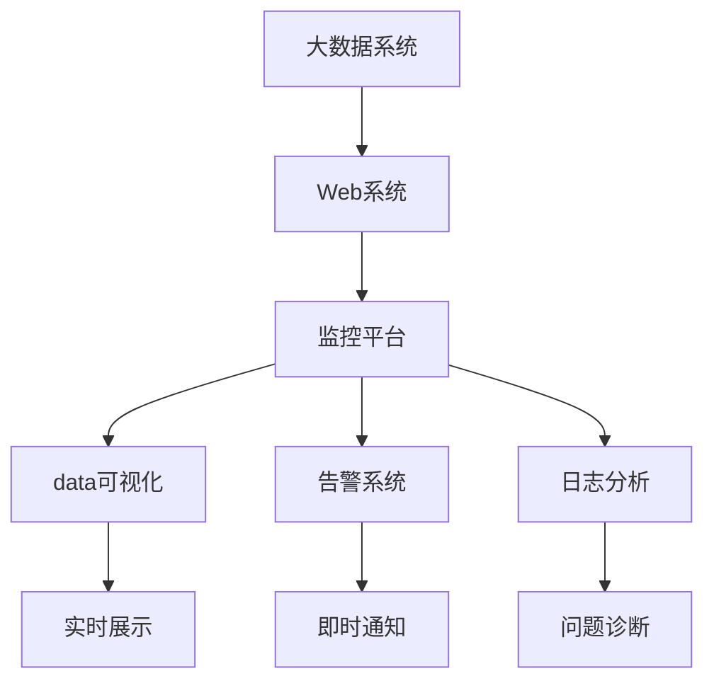
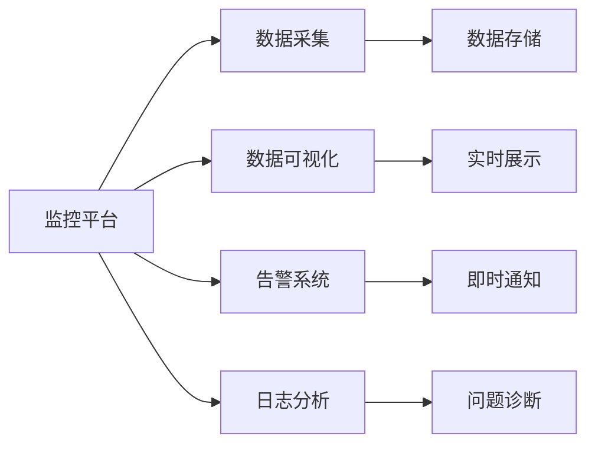
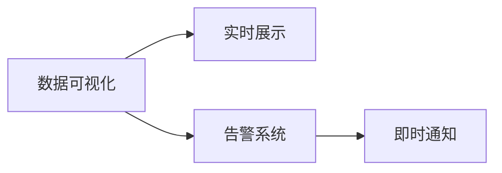
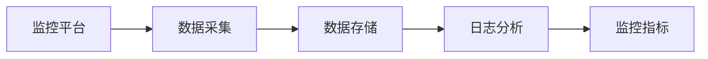

                 

# 基于web的大数据系统监控平合的设计与实现

> 关键词：大数据系统,web系统,监控平台,数据可视化,告警系统,日志分析

## 1. 背景介绍

### 1.1 问题由来

在现代互联网企业中，系统架构越来越复杂，如何高效、全面地监控系统运行状态、及时发现并处理问题、保障系统稳定运行，已经成为企业运维部门的一项重要职责。大数据系统作为互联网企业中最重要的基础设施之一，其监控与告警系统的设计显得尤为重要。传统的日志文件分析、手工巡检等方法已经难以满足现代企业的需求，大数据系统监控平台的建设迫在眉睫。

### 1.2 问题核心关键点

建设大数据系统监控平台，主要涉及以下几个关键点：

- 系统监控指标：选择合适的监控指标，如CPU利用率、内存占用、网络流量等，实时监控系统运行状态。
- 数据采集与存储：从不同的监控系统中采集数据，并高效存储和管理这些数据。
- 数据可视化：通过图表、仪表盘等形式，直观展示系统运行数据和状态。
- 告警系统：根据监控数据，自动化地生成告警信息，及时通知运维人员。
- 日志分析：解析系统日志文件，提取关键信息，辅助监控和问题诊断。

### 1.3 问题研究意义

构建高效、可靠、易用的大数据系统监控平台，对于保障企业系统稳定运行、提高运维效率具有重要意义：

- 减少人工巡检成本：自动化的监控系统能够实时采集、分析系统数据，减少人力投入。
- 提升问题响应速度：系统自动生成告警信息，运维人员可以快速定位并解决问题。
- 保障系统稳定运行：通过监控数据，及时发现潜在的系统性能问题，防止业务中断。
- 支持数据分析与决策：监控平台具备丰富的数据分析功能，能够为业务决策提供支持。
- 促进企业数字化转型：通过构建智能化的监控体系，加速企业数字化转型升级进程。

## 2. 核心概念与联系

### 2.1 核心概念概述

为了更好地理解大数据系统监控平合的设计与实现，本节将介绍几个密切相关的核心概念：

- 大数据系统：指通过互联网技术处理、分析海量数据的应用系统，如Hadoop、Spark、Flink等。
- Web系统：指通过HTTP/HTTPS协议提供服务的Web应用系统，如网站、API、微服务等。
- 监控平台：指能够实时采集、分析、展示系统运行数据的平台，通常通过Web界面进行操作。
- 数据可视化：指将数据转化为图表、仪表盘等可视化形式，直观展示数据变化和状态。
- 告警系统：指根据预设的监控指标和阈值，自动生成告警信息，及时通知运维人员。
- 日志分析：指解析系统日志文件，提取关键信息，辅助监控和问题诊断。

这些核心概念之间的逻辑关系可以通过以下Mermaid流程图来展示：



这个流程图展示了大数据系统、Web系统、监控平台之间的关系，以及数据可视化、告警系统、日志分析等监控平台的核心功能模块。

### 2.2 概念间的关系

这些核心概念之间存在着紧密的联系，形成了大数据系统监控平合的完整生态系统。下面我们用几个Mermaid流程图来展示这些概念之间的关系。

#### 2.2.1 监控平台的基本架构



这个流程图展示了监控平台的基本架构，包括数据采集、数据存储、数据可视化、告警系统、日志分析等关键组件。

#### 2.2.2 数据可视化与告警系统



这个流程图展示了数据可视化与告警系统的基本流程，数据可视化模块通过实时展示系统运行数据，告警系统根据预设阈值自动生成告警信息，并通过即时通知系统通知运维人员。

#### 2.2.3 日志分析与监控指标



这个流程图展示了日志分析与监控指标的关系。日志分析模块解析系统日志文件，提取关键信息，生成监控指标，辅助监控平台进行系统状态监控。

### 2.3 核心概念的整体架构

最后，我们用一个综合的流程图来展示这些核心概念在大数据系统监控平台中的整体架构：


这个综合流程图展示了从大数据系统、Web系统到监控平台的整体流程，以及数据可视化、告警系统、日志分析等关键模块的协同工作。通过这些流程图，我们可以更清晰地理解大数据系统监控平合的设计与实现过程中各个组件的逻辑关系和作用。

## 3. 核心算法原理 & 具体操作步骤
### 3.1 算法原理概述

大数据系统监控平台的设计与实现，本质上是一个系统监控、数据分析、可视化和告警的综合性应用。其核心算法原理包括以下几个方面：

- 数据采集与存储：通过定时或流式方式，从不同的监控系统中采集数据，并存储在数据库或分布式存储系统中。
- 数据可视化：使用Web前端框架（如React、Vue等）和后端API接口，将采集的数据转化为图表、仪表盘等可视化形式，展示系统运行状态和趋势。
- 告警系统：根据预设的监控指标和阈值，自动生成告警信息，通过即时通知系统（如短信、邮件、钉钉等）及时通知运维人员。
- 日志分析：解析系统日志文件，提取关键信息，生成监控指标，辅助监控平台进行系统状态监控。

### 3.2 算法步骤详解

基于web的大数据系统监控平台的设计与实现，一般包括以下几个关键步骤：

**Step 1: 需求分析与设计**

- 明确监控平台的功能需求，包括数据采集、数据存储、数据可视化、告警系统、日志分析等。
- 设计监控平台的基本架构和组件，包括Web前端、后端服务、数据存储和可视化组件等。
- 确定监控平台的界面设计和用户体验，确保界面直观、易用。

**Step 2: 数据采集与存储**

- 选择适合的数据采集工具（如Flume、ELK Stack等），实现对大数据系统、Web系统的数据采集。
- 将采集到的数据存储在分布式存储系统中（如Hadoop、HDFS、Kafka等），并设计合理的数据存储结构，确保数据一致性和可靠性。
- 使用ETL工具（如Apache Nifi、Apache Beam等）进行数据清洗和处理，去除冗余和噪声数据。

**Step 3: 数据可视化**

- 使用Web前端框架（如React、Vue等）设计和开发数据可视化的界面，展示系统运行数据和状态。
- 通过后端API接口，将采集到的数据动态更新到Web前端界面，实时展示系统运行情况。
- 设计各种类型的图表和仪表盘，展示系统运行的关键指标和趋势，如CPU利用率、内存占用、网络流量等。

**Step 4: 告警系统**

- 根据预设的监控指标和阈值，定义告警规则和条件，实现自动化的告警生成。
- 通过即时通知系统（如短信、邮件、钉钉等），将告警信息及时通知运维人员。
- 设计告警分级策略，根据告警的严重程度，设置不同的通知渠道和通知频率。

**Step 5: 日志分析**

- 解析系统日志文件，提取关键信息，如异常日志、错误日志等。
- 生成监控指标，如错误率、异常次数等，辅助监控平台进行系统状态监控。
- 设计日志分析工具，支持日志的查询、过滤、统计和展示，帮助运维人员快速定位问题。

**Step 6: 系统测试与部署**

- 对监控平台进行全面测试，包括功能测试、性能测试和安全性测试，确保系统稳定可靠。
- 将监控平台部署到生产环境中，确保能够实时采集、分析、展示系统运行数据。
- 定期对监控平台进行维护和升级，修复潜在问题，提升系统性能和可靠性。

### 3.3 算法优缺点

基于web的大数据系统监控平合的设计与实现，具有以下优点：

1. 实时监控：能够实时采集、分析系统运行数据，及时发现并处理问题。
2. 数据可视化：通过图表、仪表盘等可视化形式，直观展示系统运行状态和趋势。
3. 自动化告警：根据预设的监控指标和阈值，自动生成告警信息，减少人工巡检成本。
4. 日志分析：解析系统日志文件，提取关键信息，辅助监控和问题诊断。
5. 跨平台支持：支持多种大数据系统和Web系统，能够灵活扩展和部署。

同时，该方法也存在一些缺点：

1. 数据复杂度高：大数据系统和Web系统的数据规模和复杂度较高，需要设计合理的存储和处理方案。
2. 系统架构复杂：监控平台需要设计多个组件，涉及数据采集、存储、可视化和告警等多个方面，系统架构相对复杂。
3. 运维成本高：系统的设计和部署需要专业知识，运维人员需要具备较强的技术水平和经验。
4. 数据安全风险：监控平台涉及大量的敏感数据，需要设计合理的数据安全策略，防止数据泄露和滥用。

### 3.4 算法应用领域

基于web的大数据系统监控平合在多个领域得到了广泛的应用，例如：

- 互联网企业：支持监控大数据系统、Web系统、API等基础设施，保障企业系统稳定运行。
- 金融行业：支持监控金融系统、交易平台、风控系统等关键业务系统，提升金融风险控制能力。
- 电信运营商：支持监控通信网络、用户终端、应用系统等关键资源，提升网络稳定性和用户体验。
- 政府机构：支持监控政务系统、公共服务、应急响应等关键应用，提升公共服务效率和应急响应能力。
- 医疗健康：支持监控医疗系统、健康平台、电子病历等关键资源，提升医疗健康服务水平。

## 4. 数学模型和公式 & 详细讲解 & 举例说明

### 4.1 数学模型构建

基于web的大数据系统监控平合的设计与实现，需要构建一系列数学模型，用于描述系统的运行状态和监控指标。

假设监控平台采集到了系统运行数据 $D_t=\{d_1, d_2, \ldots, d_n\}$，其中 $d_i=(t_i, x_i)$ 表示在时间 $t_i$ 时刻的系统运行数据，包括CPU利用率、内存占用、网络流量等。

定义监控指标 $M_t=\{m_1, m_2, \ldots, m_k\}$，其中 $m_i$ 表示监控指标 $i$ 在时间 $t$ 时刻的值。

定义告警阈值 $\alpha = \{a_1, a_2, \ldots, a_k\}$，其中 $a_i$ 表示监控指标 $i$ 的告警阈值。

定义告警等级 $L = \{L_1, L_2, \ldots, L_n\}$，其中 $L_i$ 表示告警等级 $i$ 的严重程度。

定义告警通知方式 $N = \{N_1, N_2, \ldots, N_m\}$，其中 $N_i$ 表示告警通知方式 $i$。

### 4.2 公式推导过程

监控平台的运行状态和告警系统设计，涉及以下数学公式：

**数据采集与存储**

- 数据采集公式：$D_t = \{d_1, d_2, \ldots, d_n\}$

- 数据存储公式：$S = \{s_1, s_2, \ldots, s_m\}$，其中 $s_i$ 表示监控数据的存储记录。

**数据可视化**

- 实时展示公式：$V_t = \{v_1, v_2, \ldots, v_n\}$，其中 $v_i$ 表示监控数据的可视化展示。

- 动态更新公式：$V'_t = V_t + \Delta V_t$，其中 $\Delta V_t$ 表示监控数据更新后的变化量。

**告警系统**

- 告警生成公式：$A_t = \{a_1, a_2, \ldots, a_k\}$，其中 $a_i$ 表示监控指标 $i$ 的告警状态。

- 告警通知公式：$N_t = \{n_1, n_2, \ldots, n_m\}$，其中 $n_i$ 表示告警通知方式 $i$。

- 告警级别公式：$L_t = \{l_1, l_2, \ldots, l_n\}$，其中 $l_i$ 表示告警等级 $i$。

**日志分析**

- 日志解析公式：$L_t = \{l_1, l_2, \ldots, l_m\}$，其中 $l_i$ 表示日志文件解析出的关键信息。

- 监控指标公式：$M_t = \{m_1, m_2, \ldots, m_k\}$，其中 $m_i$ 表示监控指标 $i$ 的值。

### 4.3 案例分析与讲解

假设监控平台采集到了系统运行数据 $D_t=\{d_1, d_2, \ldots, d_n\}$，其中 $d_i=(t_i, x_i)$ 表示在时间 $t_i$ 时刻的系统运行数据，包括CPU利用率、内存占用、网络流量等。

定义监控指标 $M_t=\{m_1, m_2, \ldots, m_k\}$，其中 $m_i$ 表示监控指标 $i$ 在时间 $t$ 时刻的值。

定义告警阈值 $\alpha = \{a_1, a_2, \ldots, a_k\}$，其中 $a_i$ 表示监控指标 $i$ 的告警阈值。

定义告警等级 $L = \{L_1, L_2, \ldots, L_n\}$，其中 $L_i$ 表示告警等级 $i$ 的严重程度。

定义告警通知方式 $N = \{N_1, N_2, \ldots, N_m\}$，其中 $N_i$ 表示告警通知方式 $i$。

监控平台通过采集到的系统运行数据 $D_t$，计算监控指标 $M_t$，判断告警状态 $A_t$，生成告警信息，并通过通知方式 $N_t$ 及时通知运维人员。同时，监控平台还能够解析日志文件 $L_t$，提取关键信息 $M_t$，辅助监控和问题诊断。

## 5. 项目实践：代码实例和详细解释说明

### 5.1 开发环境搭建

在进行大数据系统监控平台的设计与实现前，我们需要准备好开发环境。以下是使用Python进行Flask框架开发的环境配置流程：

1. 安装Python：从官网下载并安装Python 3.6或以上版本。

2. 安装Flask：使用pip安装Flask框架。

```bash
pip install Flask
```

3. 安装Flask-SQLAlchemy：用于数据库操作的扩展包。

```bash
pip install Flask-SQLAlchemy
```

4. 安装Flask-WTF：用于表单验证的扩展包。

```bash
pip install Flask-WTF
```

5. 安装SQLAlchemy：用于数据库操作的ORM工具。

```bash
pip install SQLAlchemy
```

完成上述步骤后，即可在开发环境中进行大数据系统监控平台的设计与实现。

### 5.2 源代码详细实现

下面以一个简单的监控平台为例，展示如何使用Flask框架实现数据采集、存储、可视化和告警系统。

```python
from flask import Flask, request, jsonify
from flask_sqlalchemy import SQLAlchemy
from sqlalchemy import create_engine
from sqlalchemy.orm import sessionmaker
from datetime import datetime

app = Flask(__name__)

# 配置数据库
app.config['SQLALCHEMY_DATABASE_URI'] = 'sqlite:///monitor.db'
db = SQLAlchemy(app)

# 定义监控数据表
class MonitorData(db.Model):
    id = db.Column(db.Integer, primary_key=True)
    time = db.Column(db.DateTime)
    cpu = db.Column(db.Float)
    memory = db.Column(db.Float)
    network = db.Column(db.Float)

    def __init__(self, time, cpu, memory, network):
        self.time = time
        self.cpu = cpu
        self.memory = memory
        self.network = network

# 添加监控数据
@app.route('/monitor', methods=['POST'])
def add_monitor_data():
    data = request.get_json()
    time = datetime.now()
    cpu = data['cpu']
    memory = data['memory']
    network = data['network']
    monitor_data = MonitorData(time, cpu, memory, network)
    db.session.add(monitor_data)
    db.session.commit()
    return jsonify({'message': 'Monitor data added'})

# 查询监控数据
@app.route('/monitor/<int:id>')
def get_monitor_data(id):
    monitor_data = MonitorData.query.get(id)
    if monitor_data is None:
        return jsonify({'message': 'Monitor data not found'})
    else:
        return jsonify({'time': monitor_data.time, 'cpu': monitor_data.cpu, 'memory': monitor_data.memory, 'network': monitor_data.network})

# 统计监控数据
@app.route('/monitor/statistics')
def get_monitor_statistics():
    total_cpu = MonitorData.query.filter_by(cpu=cpu).all()
    total_memory = MonitorData.query.filter_by(memory=memory).all()
    total_network = MonitorData.query.filter_by(network=network).all()
    return jsonify({'total_cpu': len(total_cpu), 'total_memory': len(total_memory), 'total_network': len(total_network)})

# 运行Flask应用
if __name__ == '__main__':
    app.run(debug=True)
```

### 5.3 代码解读与分析

让我们再详细解读一下关键代码的实现细节：

**Flask应用**

- `Flask(__name__)`: 创建一个Flask应用实例。
- `app.config['SQLALCHEMY_DATABASE_URI']`: 配置SQLAlchemy数据库连接字符串，指定数据库位置。
- `db = SQLAlchemy(app)`: 创建SQLAlchemy实例，与Flask应用实例关联。
- `MonitorData(db.Model)`: 定义监控数据表模型，包括时间、CPU利用率、内存占用和网络流量等字段。
- `@app.route`装饰器：定义Flask应用的路由，包括添加监控数据、查询监控数据和统计监控数据等。

**数据采集**

- `@app.route('/monitor', methods=['POST'])`: 定义一个POST请求的路由，用于添加监控数据。
- `request.get_json()`: 从请求中获取JSON格式的监控数据。
- `datetime.now()`: 获取当前时间。
- `db.session.add(monitor_data)`: 将监控数据保存到数据库。

**数据查询**

- `@app.route('/monitor/<int:id>')`: 定义一个GET请求的路由，用于查询监控数据。
- `MonitorData.query.get(id)`: 从数据库中获取指定ID的监控数据记录。
- `return jsonify()`：将查询结果以JSON格式返回。

**数据统计**

- `@app.route('/monitor/statistics')`: 定义一个GET请求的路由，用于统计监控数据。
- `MonitorData.query.filter_by(cpu=cpu).all()`: 过滤CPU利用率为指定值的监控数据记录。
- `return jsonify()`：将统计结果以JSON格式返回。

通过以上代码实现，我们完成了数据采集、存储、查询和统计的基本功能。当然，实际应用中还需要对系统进行更多的优化和扩展，如数据可视化、告警系统、日志分析等。

### 5.4 运行结果展示

假设我们在本地运行上述代码，并成功将监控数据添加到数据库中，则可以通过访问以下URL获取监控数据：

```
http://localhost:5000/monitor
http://localhost:5000/monitor/1
http://localhost:5000/monitor/statistics
```

通过这些URL，我们可以查看监控数据的添加情况、查询单条监控数据、统计监控数据等。

## 6. 实际应用场景

### 6.1 智能运维系统

大数据系统监控平合的核心应用场景之一是智能运维系统。智能运维系统能够实时采集、分析系统运行数据，自动生成告警信息，及时通知运维人员。

在技术实现上，可以设计一个基于web的监控平台，通过API接口将系统运行数据采集到数据库中，并实时展示在Web前端界面上。同时，设计告警规则和条件，根据预设的监控指标和阈值，自动生成告警信息，并通过短信、邮件、钉钉等通知方式及时通知运维人员。系统还可以设计日志分析功能，解析系统日志文件，提取关键信息，辅助监控和问题诊断。

### 6.2 金融风险控制系统

金融行业需要实时监控交易系统、风控系统等关键业务系统，通过监控平台及时发现异常情况，避免金融风险。

在实际应用中，可以设计一个基于web的监控平台，通过API接口将交易系统、风控系统的运行数据采集到数据库中，并实时展示在Web前端界面上。系统设计告警规则和条件，根据预设的监控指标和阈值，自动生成告警信息，并通过短信、邮件、钉钉等通知方式及时通知运维人员。系统还可以设计日志分析功能，解析交易日志、风控日志等文件，提取关键信息，辅助监控和问题诊断。

### 6.3 电信网络监控系统

电信运营商需要实时监控通信网络、用户终端、应用系统等关键资源，提升网络稳定性和用户体验。

在实际应用中，可以设计一个基于web的监控平台，通过API接口将通信网络、用户终端、应用系统的运行数据采集到数据库中，并实时展示在Web前端界面上。系统设计告警规则和条件，根据预设的监控指标和阈值，自动生成告警信息，并通过短信、邮件、钉钉等通知方式及时通知运维人员。系统还可以设计日志分析功能，解析通信网络日志、用户终端日志等文件，提取关键信息，辅助监控和问题诊断。

### 6.4 政府应急响应系统

政府机构需要实时监控政务系统、公共服务、应急响应等关键应用，提升公共服务效率和应急响应能力。

在实际应用中，可以设计一个基于web的监控平台，通过API接口将政务系统、公共服务、应急响应的运行数据采集到数据库中，并实时展示在Web前端界面上。系统设计告警规则和条件，根据预设的监控指标和阈值，自动生成告警信息，并通过短信、邮件、钉钉等通知方式及时通知运维人员。系统还可以设计日志分析功能，解析政务日志、服务日志等文件，提取关键信息，辅助监控和问题诊断。

## 7. 工具和资源推荐

### 7.1 学习资源推荐

为了帮助开发者系统掌握大数据系统监控平合的设计与实现，这里推荐一些优质的学习资源：

1. 《Flask Web开发实战》：一本Flask框架的实战书籍，详细介绍了Flask框架的基本用法和常用技巧。

2. 《SQLAlchemy官方文档》：SQLAlchemy的官方文档，提供了丰富的API接口和示例代码，是学习数据库操作的重要参考资料。

3. 《Django Web开发实战》：一本Django框架的实战书籍，介绍了Django框架的基本用法和常用技巧。

4. 《Python Web开发最佳实践》：一本Python Web开发的实战书籍，介绍了Web开发中的常见问题及解决方案。

5. 《NLP实战：Python自然语言处理》：一本自然语言处理的实战书籍，介绍了NLP领域的基本算法和常用工具。

通过对这些资源的学习实践，相信你一定能够快速掌握基于web的大数据系统监控平合的设计与实现，并用于解决实际的系统监控问题。

### 7.2 开发工具推荐

高效的开发离不开优秀的工具支持。以下是几款用于大数据系统监控平合开发的常用工具：

1. PyCharm：一款Python IDE，支持Flask框架的开发和调试。

2. Git：版本控制工具，便于团队协作和代码管理。

3. Docker：容器化技术，便于系统的部署和扩展。

4. Jenkins：持续集成工具，支持Flask应用的自动化部署和测试。

5. Apache Kafka：流式消息中间件，支持大规模数据采集和存储。

6. Apache Nifi：数据处理工具，支持数据的ETL和流式处理。

合理利用这些工具，可以显著提升大数据系统监控平合的开发效率，加快创新迭代的步伐。

### 7.3 相关论文推荐

大数据系统监控平合的研究涉及多个领域，以下是几篇奠基性的相关论文，推荐阅读：

1. 《Scalable Big Data Streaming and Processing with Apache Kafka》：介绍了Kafka在大数据流式处理中的应用，是流式数据采集的重要参考资料。

2. 《A Survey on Apache Spark: Architecture and Comparison with Other Big Data Platforms》：介绍了Spark的基本架构和特点，是学习大数据处理的重要

