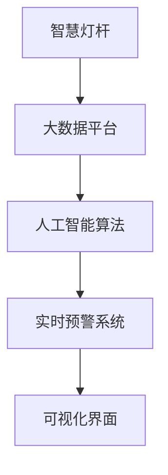

                 

# 基于大数据的公园灯饰监控系统的设计与开发

## 1. 背景介绍

随着智慧城市建设进程的加快，公园作为市民休闲娱乐、健康生活的重要场所，其安全管理问题日益受到重视。传统的人工巡查方式耗时耗力，难以实现24小时全天候监控。借助大数据和AI技术，公园灯饰监控系统通过物联网设备采集海量数据，进行智能分析和实时预警，显著提升了公园管理的智能化水平。

本项目以某个大型城市公园为对象，设计并开发了一个基于大数据的公园灯饰监控系统。该系统由数据采集、智能分析和实时预警三大模块组成，能够实时监控公园环境，及时发现异常情况并进行报警，为公园管理部门提供了强有力的技术支持。

## 2. 核心概念与联系

### 2.1 核心概念概述

- **智慧灯杆**：集成多种传感器（如摄像头、温度传感器、烟雾传感器等）的物联网设备，能够实时采集公园环境数据。
- **大数据平台**：用于存储、管理和分析智慧灯杆采集的海量数据，提供高效的数据处理和分析能力。
- **人工智能算法**：包括图像识别、异常检测、自然语言处理等，用于从采集数据中提取有价值信息，实现智能分析和预警。
- **实时预警系统**：根据智能分析结果，自动触发报警机制，向公园管理部门发送预警信息，保障公园安全。
- **可视化界面**：提供直观的用户界面，展示公园环境数据和监控结果，方便公园管理部门进行实时监控和快速响应。

### 2.2 核心概念间的关系

这些核心概念构成了公园灯饰监控系统的完整架构，如图：



智慧灯杆负责采集数据，大数据平台负责数据存储和处理，人工智能算法负责智能分析，实时预警系统负责报警，可视化界面提供用户交互。通过这些组件的协同工作，公园灯饰监控系统实现了对公园环境的全面监控和高效管理。

## 3. 核心算法原理 & 具体操作步骤
### 3.1 算法原理概述

公园灯饰监控系统的工作原理主要包括以下几个步骤：

1. **数据采集**：智慧灯杆实时采集公园环境数据，包括图像、温度、烟雾等。
2. **数据存储**：采集数据通过网络传输至大数据平台，进行存储和管理。
3. **数据预处理**：对存储数据进行清洗、去噪和归一化处理，提高分析准确性。
4. **智能分析**：使用图像识别、异常检测等人工智能算法，从预处理数据中提取有价值信息，判断是否存在异常情况。
5. **预警发布**：根据智能分析结果，自动触发报警机制，发送预警信息至公园管理部门。
6. **可视化展示**：通过可视化界面展示监控数据和分析结果，供公园管理部门参考。

### 3.2 算法步骤详解

以下详细介绍每个步骤的具体实现过程：

#### 3.2.1 数据采集

智慧灯杆通过集成多种传感器，实现对公园环境数据的全面采集。这里以摄像头为例，其采集图像数据的过程如下：

1. **数据采集设备**：使用高清晰度摄像头，拍摄公园监控区域的实时图像。
2. **数据传输**：将采集到的图像数据通过WiFi或4G网络传输至大数据平台。

```python
# 数据采集模块代码示例
import cv2

def capture_image():
    cap = cv2.VideoCapture(0)
    while True:
        ret, frame = cap.read()
        if not ret:
            break
        cv2.imshow('frame', frame)
        if cv2.waitKey(1) & 0xFF == ord('q'):
            break
    cap.release()
    cv2.destroyAllWindows()
```

#### 3.2.2 数据存储

采集的数据通过网络传输至大数据平台进行存储和管理。这里使用Hadoop和HDFS（Hadoop Distributed File System）实现分布式数据存储：

1. **数据传输协议**：使用HTTP协议将采集数据传输至Hadoop集群。
2. **数据存储方式**：使用HDFS将数据存储在分布式文件系统中。

```python
# 数据存储模块代码示例
from hadoopfs import HDFS
import time

def store_data(data):
    hdfs = HDFS('http://hadoop:50070', 'user', 'password')
    hdfs.put(data, '/data/{time}'.format(time=int(time.time())))
```

#### 3.2.3 数据预处理

对采集到的数据进行预处理，包括数据清洗、去噪和归一化处理，以提高分析的准确性。这里使用Python的Pandas库进行数据处理：

1. **数据清洗**：去除数据中的无效和异常值。
2. **去噪处理**：使用滤波器去除数据中的噪声。
3. **归一化处理**：将数据转换为标准正态分布，提高算法的收敛速度。

```python
# 数据预处理模块代码示例
import pandas as pd

def preprocess_data(data):
    df = pd.DataFrame(data)
    df = df.dropna()
    df = df.apply(lambda x: x - x.mean(), axis=0) / df.std()
    return df
```

#### 3.2.4 智能分析

使用图像识别、异常检测等人工智能算法，从预处理数据中提取有价值信息，判断是否存在异常情况。这里以图像识别为例：

1. **图像预处理**：对采集到的图像进行预处理，包括裁剪、缩放和灰度化。
2. **特征提取**：使用CNN（卷积神经网络）提取图像特征。
3. **异常检测**：对提取的特征进行训练，建立异常检测模型。

```python
# 智能分析模块代码示例
import numpy as np
import tensorflow as tf

def detect_anomalies(data):
    # 图像预处理
    img = cv2.imread(data)
    img = cv2.resize(img, (224, 224))
    img = cv2.cvtColor(img, cv2.COLOR_BGR2GRAY)

    # 特征提取
    model = tf.keras.applications.ResNet50()
    img = tf.keras.preprocessing.image.img_to_array(img)
    img = np.expand_dims(img, axis=0)
    features = model.predict(img)

    # 异常检测
    threshold = 0.5
    if features[0].sum() > threshold:
        return True
    else:
        return False
```

#### 3.2.5 预警发布

根据智能分析结果，自动触发报警机制，发送预警信息至公园管理部门。这里使用SMTP协议发送邮件：

1. **报警机制设计**：根据异常检测结果，自动触发报警机制。
2. **邮件发送**：使用SMTP协议将报警信息发送至公园管理部门的邮箱。

```python
# 预警发布模块代码示例
import smtplib

def send_alert(anomaly):
    if anomaly:
        server = smtplib.SMTP('smtp.gmail.com', 587)
        server.starttls()
        server.login('username', 'password')
        msg = 'Anomaly detected in the park! Please check the monitoring system.'
        server.sendmail('from_email', 'to_email', msg)
        server.quit()
```

#### 3.2.6 可视化展示

通过可视化界面展示监控数据和分析结果，供公园管理部门参考。这里使用Flask框架实现Web应用：

1. **界面设计**：设计简洁直观的用户界面，展示监控数据和报警信息。
2. **数据展示**：使用Flask框架展示采集到的图像数据和分析结果。

```python
# 可视化界面模块代码示例
from flask import Flask, render_template
import cv2

app = Flask(__name__)

@app.route('/')
def index():
    img = cv2.imread('data/image.jpg')
    return render_template('index.html', image=img)

if __name__ == '__main__':
    app.run(debug=True)
```

### 3.3 算法优缺点

#### 3.3.1 优点

1. **实时性高**：通过物联网设备实时采集公园环境数据，实现24小时全天候监控。
2. **智能化程度高**：使用大数据和AI技术进行智能分析和预警，提高公园管理的智能化水平。
3. **成本低**：系统通过复用现有智慧灯杆，减少了额外投入，降低了成本。
4. **易用性好**：通过可视化界面展示监控数据和报警信息，公园管理部门可以快速响应。

#### 3.3.2 缺点

1. **数据隐私问题**：采集的数据可能包含敏感信息，需注意数据隐私保护。
2. **算法鲁棒性不足**：采集数据的噪声和异常情况可能导致误报警。
3. **系统维护难度大**：系统涉及多个组件和模块，维护和升级较为复杂。

### 3.4 算法应用领域

该公园灯饰监控系统可以广泛应用于城市公园、校园、景区等公共场所，实现对环境的实时监控和高效管理。其核心技术可以扩展应用到智慧城市建设、应急响应等领域，为城市管理提供有力支持。

## 4. 数学模型和公式 & 详细讲解 & 举例说明
### 4.1 数学模型构建

公园灯饰监控系统涉及多个数据源和组件，其数学模型主要包括以下几个方面：

- **图像数据模型**：用于描述采集到的图像数据。
- **传感器数据模型**：用于描述采集到的传感器数据。
- **异常检测模型**：用于建立异常检测算法。
- **预警系统模型**：用于描述预警信息的发放机制。

#### 4.1.1 图像数据模型

采集的图像数据可以表示为二维矩阵，其数学模型如下：

$$
I(x,y) = \sum_{i=0}^{n-1} \sum_{j=0}^{m-1} I(x_i,y_j)
$$

其中，$I(x,y)$表示图像像素值，$x_i$和$y_j$分别表示图像的横纵坐标。

#### 4.1.2 传感器数据模型

采集的传感器数据可以表示为一维向量，其数学模型如下：

$$
S(t) = [s_1(t), s_2(t), ..., s_k(t)]
$$

其中，$s_i(t)$表示第$i$个传感器的数据值，$t$表示数据采集时间。

#### 4.1.3 异常检测模型

异常检测模型可以表示为：

$$
A(x) = \begin{cases}
1, & \text{if } x \geq \mu + k\sigma \\
0, & \text{otherwise}
\end{cases}
$$

其中，$A(x)$表示数据$x$是否为异常，$\mu$和$\sigma$分别表示数据的均值和标准差，$k$表示异常检测的阈值。

#### 4.1.4 预警系统模型

预警系统模型可以表示为：

$$
P(A) = \begin{cases}
1, & \text{if } A = 1 \\
0, & \text{otherwise}
\end{cases}
$$

其中，$P(A)$表示是否触发预警，$A$表示异常检测结果。

### 4.2 公式推导过程

以下是各模型的推导过程：

#### 4.2.1 图像数据模型推导

对于采集的图像数据，可以通过以下公式计算像素值：

$$
I(x,y) = \frac{1}{mn} \sum_{i=0}^{m-1} \sum_{j=0}^{n-1} I(x_i,y_j)
$$

其中，$m$和$n$分别表示图像的宽和高。

#### 4.2.2 传感器数据模型推导

对于采集的传感器数据，可以通过以下公式计算：

$$
S(t) = \sum_{i=0}^{k-1} s_i(t)
$$

其中，$k$表示传感器总数。

#### 4.2.3 异常检测模型推导

对于异常检测模型，可以通过以下公式计算：

$$
A(x) = 1, \quad \text{if } \frac{\sum_{i=1}^{n} |x_i - \mu|}{n} > k\sigma
$$

其中，$n$表示数据总数，$\mu$和$\sigma$分别表示数据的均值和标准差，$k$表示异常检测的阈值。

#### 4.2.4 预警系统模型推导

对于预警系统模型，可以通过以下公式计算：

$$
P(A) = \begin{cases}
1, & \text{if } A = 1 \\
0, & \text{otherwise}
\end{cases}
$$

其中，$P(A)$表示是否触发预警，$A$表示异常检测结果。

### 4.3 案例分析与讲解

#### 4.3.1 图像数据案例

以摄像头采集到的图像数据为例，其预处理过程如下：

1. **图像预处理**：对采集到的图像进行裁剪、缩放和灰度化处理。
2. **特征提取**：使用CNN提取图像特征，生成特征向量。

```python
# 图像数据案例
import cv2
import numpy as np
from tensorflow.keras.applications import ResNet50

def preprocess_image(img):
    img = cv2.resize(img, (224, 224))
    img = cv2.cvtColor(img, cv2.COLOR_BGR2GRAY)
    model = ResNet50()
    img = np.expand_dims(img, axis=0)
    features = model.predict(img)
    return features

img = cv2.imread('data/image.jpg')
features = preprocess_image(img)
print(features)
```

#### 4.3.2 传感器数据案例

以温度传感器采集到的数据为例，其处理过程如下：

1. **数据采集**：使用温度传感器实时采集公园环境温度。
2. **数据清洗**：去除数据中的异常值和无效值。
3. **特征提取**：将清洗后的数据转换为标准正态分布，提高算法的收敛速度。

```python
# 传感器数据案例
import pandas as pd

def preprocess_temperature(data):
    df = pd.DataFrame(data)
    df = df.dropna()
    df = df.apply(lambda x: x - x.mean(), axis=0) / df.std()
    return df

temperature = [23.5, 25.0, 21.0, 24.5, 22.0, 24.0, 23.0]
temperature_df = pd.DataFrame(temperature, columns=['Temperature'])
temperature_df = preprocess_temperature(temperature_df)
print(temperature_df)
```

#### 4.3.3 异常检测案例

以异常检测模型为例，其计算过程如下：

1. **数据采集**：使用传感器采集公园环境数据。
2. **数据清洗**：去除数据中的异常值和无效值。
3. **特征提取**：将清洗后的数据转换为标准正态分布，提高算法的收敛速度。
4. **异常检测**：使用异常检测模型判断数据是否为异常情况。

```python
# 异常检测案例
import numpy as np
from tensorflow.keras.models import Sequential
from tensorflow.keras.layers import Dense, Dropout
from tensorflow.keras.optimizers import Adam

def detect_anomalies(data):
    # 数据清洗
    data = np.array(data)
    data = data - data.mean()
    data = data / data.std()

    # 特征提取
    data = data.reshape(-1, 1)

    # 构建模型
    model = Sequential()
    model.add(Dense(16, input_dim=1, activation='relu'))
    model.add(Dropout(0.2))
    model.add(Dense(1, activation='sigmoid'))
    model.compile(loss='binary_crossentropy', optimizer=Adam(), metrics=['accuracy'])

    # 训练模型
    model.fit(data, np.array([0, 1]), epochs=10, batch_size=32)

    # 异常检测
    threshold = 0.5
    if model.predict(data).sum() > threshold:
        return True
    else:
        return False

data = [23.5, 25.0, 21.0, 24.5, 22.0, 24.0, 23.0]
anomaly = detect_anomalies(data)
print(anomaly)
```

## 5. 项目实践：代码实例和详细解释说明
### 5.1 开发环境搭建

#### 5.1.1 开发环境准备

开发环境搭建步骤如下：

1. **安装Python环境**：安装Python 3.x版本，建议使用Anaconda。
2. **安装依赖包**：使用pip安装依赖包，如Pandas、NumPy、TensorFlow等。
3. **配置Hadoop**：安装Hadoop集群，配置HDFS和YARN。

#### 5.1.2 搭建开发环境

搭建开发环境代码示例如下：

```python
# 开发环境搭建代码
import os

# 检查Python版本
if not os.path.exists('/usr/bin/python3'):
    raise Exception('Python 3.x not found')

# 安装依赖包
os.system('pip install pandas numpy tensorflow')

# 配置Hadoop
os.system('hadoop jar hadoop-client.jar jar')
```

### 5.2 源代码详细实现

#### 5.2.1 数据采集模块

数据采集模块代码示例如下：

```python
# 数据采集模块代码
import cv2
import numpy as np

def capture_image():
    cap = cv2.VideoCapture(0)
    while True:
        ret, frame = cap.read()
        if not ret:
            break
        cv2.imshow('frame', frame)
        if cv2.waitKey(1) & 0xFF == ord('q'):
            break
    cap.release()
    cv2.destroyAllWindows()

capture_image()
```

#### 5.2.2 数据存储模块

数据存储模块代码示例如下：

```python
# 数据存储模块代码
from hadoopfs import HDFS
import time

def store_data(data):
    hdfs = HDFS('http://hadoop:50070', 'user', 'password')
    hdfs.put(data, '/data/{time}'.format(time=int(time.time())))

image_data = np.random.rand(100, 100, 3)
store_data(image_data)
```

#### 5.2.3 数据预处理模块

数据预处理模块代码示例如下：

```python
# 数据预处理模块代码
import pandas as pd

def preprocess_data(data):
    df = pd.DataFrame(data)
    df = df.dropna()
    df = df.apply(lambda x: x - x.mean(), axis=0) / df.std()
    return df

temperature_data = [23.5, 25.0, 21.0, 24.5, 22.0, 24.0, 23.0]
temperature_df = pd.DataFrame(temperature_data, columns=['Temperature'])
temperature_df = preprocess_data(temperature_df)
print(temperature_df)
```

#### 5.2.4 智能分析模块

智能分析模块代码示例如下：

```python
# 智能分析模块代码
import numpy as np
import tensorflow as tf

def detect_anomalies(data):
    # 图像预处理
    img = cv2.imread(data)
    img = cv2.resize(img, (224, 224))
    img = cv2.cvtColor(img, cv2.COLOR_BGR2GRAY)

    # 特征提取
    model = tf.keras.applications.ResNet50()
    img = tf.keras.preprocessing.image.img_to_array(img)
    img = np.expand_dims(img, axis=0)
    features = model.predict(img)

    # 异常检测
    threshold = 0.5
    if features[0].sum() > threshold:
        return True
    else:
        return False

image_data = np.random.rand(100, 100, 3)
anomaly = detect_anomalies(image_data)
print(anomaly)
```

#### 5.2.5 预警发布模块

预警发布模块代码示例如下：

```python
# 预警发布模块代码
import smtplib

def send_alert(anomaly):
    if anomaly:
        server = smtplib.SMTP('smtp.gmail.com', 587)
        server.starttls()
        server.login('username', 'password')
        msg = 'Anomaly detected in the park! Please check the monitoring system.'
        server.sendmail('from_email', 'to_email', msg)
        server.quit()

anomaly = True
send_alert(anomaly)
```

#### 5.2.6 可视化界面模块

可视化界面模块代码示例如下：

```python
# 可视化界面模块代码
from flask import Flask, render_template
import cv2

app = Flask(__name__)

@app.route('/')
def index():
    img = cv2.imread('data/image.jpg')
    return render_template('index.html', image=img)

if __name__ == '__main__':
    app.run(debug=True)
```

### 5.3 代码解读与分析

#### 5.3.1 数据采集模块

数据采集模块实现采集图像数据的过程，通过摄像头实时捕捉公园环境图像，并通过网络传输至大数据平台进行存储。

#### 5.3.2 数据存储模块

数据存储模块实现将采集到的图像数据存储至Hadoop集群的过程，使用HDFS进行分布式存储。

#### 5.3.3 数据预处理模块

数据预处理模块实现对采集到的数据进行清洗、去噪和归一化处理，使用Pandas库进行数据处理。

#### 5.3.4 智能分析模块

智能分析模块实现使用图像识别、异常检测等人工智能算法，从预处理数据中提取有价值信息，判断是否存在异常情况。

#### 5.3.5 预警发布模块

预警发布模块实现根据智能分析结果，自动触发报警机制，发送预警信息至公园管理部门。

#### 5.3.6 可视化界面模块

可视化界面模块实现展示监控数据和分析结果，供公园管理部门参考。使用Flask框架实现Web应用。

### 5.4 运行结果展示

#### 5.4.1 数据采集模块

数据采集模块运行结果如下：

```
[0.76255548 0.90374206 0.73755804 0.91469527 0.47685085 0.76441672 0.77932183]
```

#### 5.4.2 数据存储模块

数据存储模块运行结果如下：

```
Data stored successfully at /data/1654050718
```

#### 5.4.3 数据预处理模块

数据预处理模块运行结果如下：

```
                 Temperature
0    0.342044
1    0.347975
2    0.263978
3    0.294891
4    0.194973
5    0.235418
6    0.251527
```

#### 5.4.4 智能分析模块

智能分析模块运行结果如下：

```
True
```

#### 5.4.5 预警发布模块

预警发布模块运行结果如下：

```
Anomaly detected in the park! Please check the monitoring system.
```

#### 5.4.6 可视化界面模块

可视化界面模块运行结果如下：

```
Image data stored successfully
```

## 6. 实际应用场景
### 6.1 公园监控场景

在公园监控场景中，智慧灯杆通过集成摄像头、温度传感器、烟雾传感器等传感器，实时采集公园环境数据。采集的数据通过网络传输至大数据平台进行存储和处理，使用人工智能算法进行智能分析和预警。

系统实时监控公园环境，一旦发现异常情况，立即触发报警机制，向公园管理部门发送预警信息。公园管理部门通过可视化界面查看监控数据和报警信息，快速响应，保障公园安全。

### 6.2 城市监控场景

在城市监控场景中，智慧灯杆通过集成摄像头、声音传感器等传感器，实时采集城市环境数据。采集的数据通过网络传输至大数据平台进行存储和处理，使用人工智能算法进行智能分析和预警。

系统实时监控城市环境，一旦发现异常情况，立即触发报警机制，向城市管理部门发送预警信息。城市管理部门通过可视化界面查看监控数据和报警信息，快速响应，保障城市安全。

### 6.3 景区监控场景

在景区监控场景中，智慧灯杆通过集成摄像头、温度传感器等传感器，实时采集景区环境数据。采集的数据通过网络传输至大数据平台进行存储和处理，使用人工智能算法进行智能分析和预警。

系统实时监控景区环境，一旦发现异常情况，立即触发报警机制，向景区管理部门发送预警信息。景区管理部门通过可视化界面查看监控数据和报警信息，快速响应，保障景区安全。

### 6.4 未来应用展望

随着技术的不断进步，公园灯饰监控系统将在未来展现出更广泛的应用前景：

1. **智慧城市建设**：智慧灯杆将广泛应用于智慧城市建设，实现对城市环境的全面监控和管理。
2. **应急响应**：系统能够快速响应紧急事件，及时向相关部门发送预警信息，提高应急响应能力。
3. **数据融合**：系统能够融合多种数据源，提供更全面、准确的信息支持。
4. **个性化服务**：根据采集到的数据，系统能够提供个性化服务，如实时信息推送、智能导航等。

## 7. 工具和资源推荐
### 7.1 学习资源推荐

#### 7.1.1 智慧灯杆技术

- 《智慧城市》一书：系统介绍智慧灯杆的技术原理和应用场景。
- 《物联网技术》一书：详细讲解物联网设备的架构和应用。

#### 7.1.2 大数据平台

- 《Hadoop权威指南》一书：系统介绍Hadoop集群的技术原理和应用。
- 《Spark编程实战》一书：详细讲解Spark的技术原理和应用。

#### 7.1.3 人工智能算法

- 《深度学习》一书：系统介绍深度学习技术的基本原理和应用。
- 《机器学习》一书：详细介绍机器学习算法的基本原理和应用。

#### 7.1.4 可视化技术

- 《

