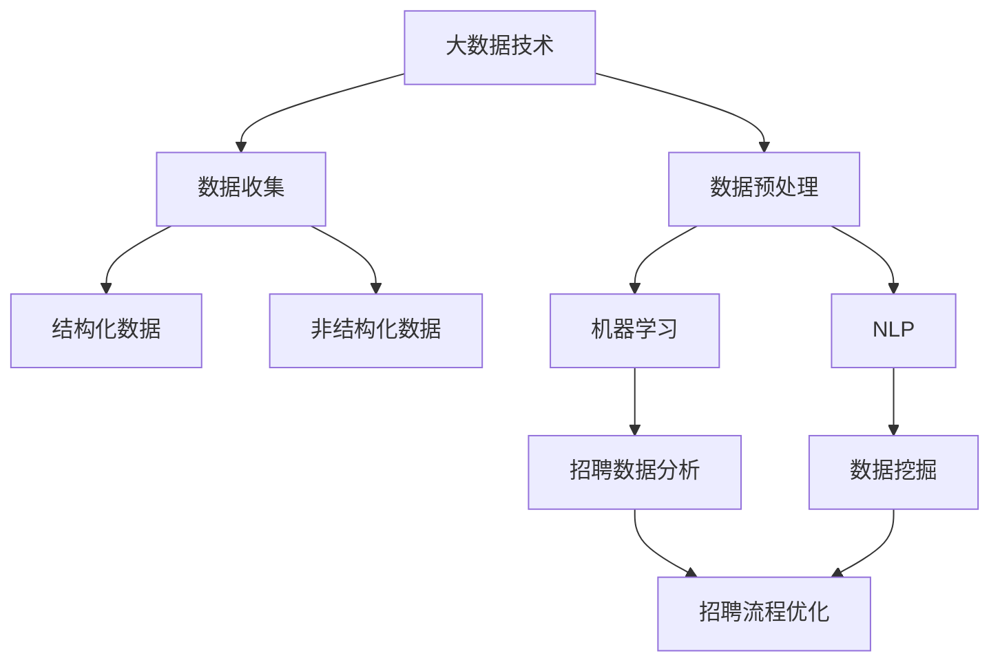
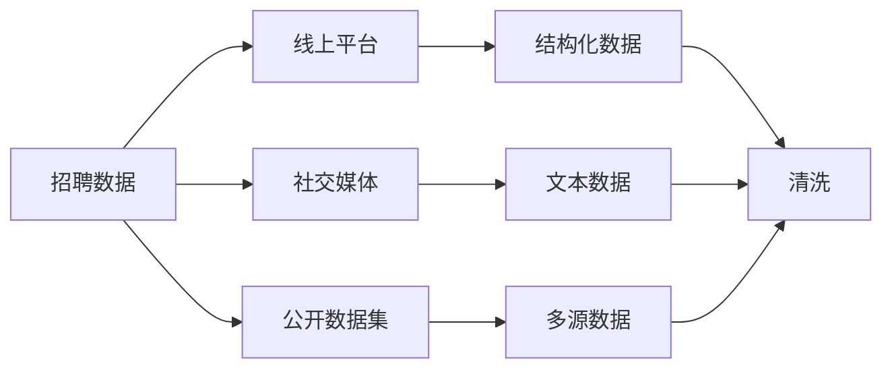
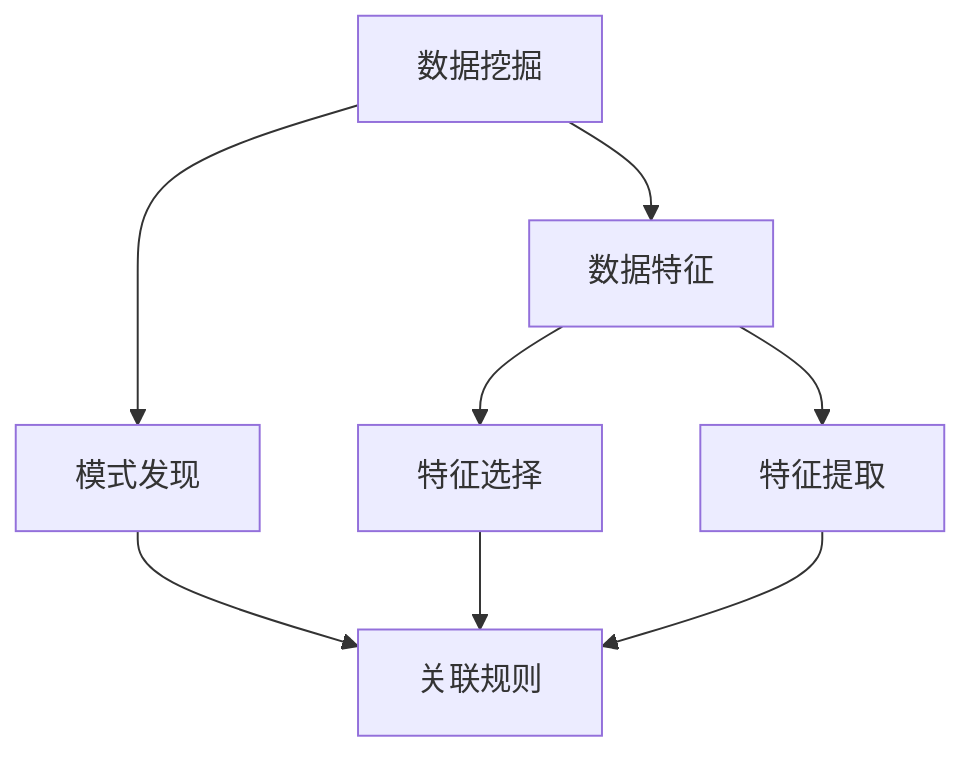
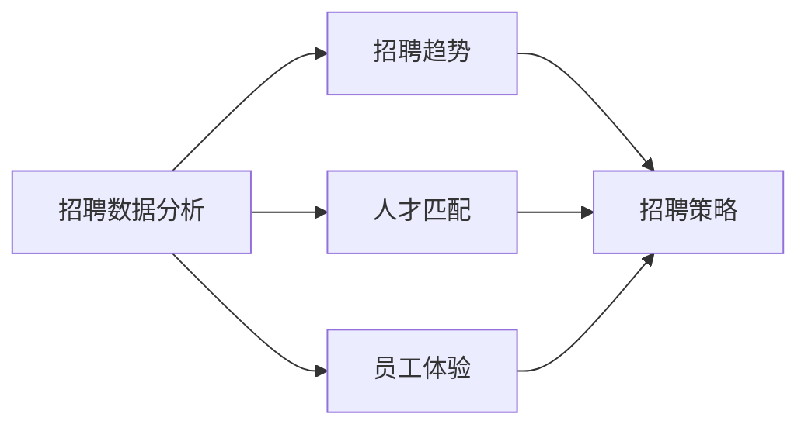
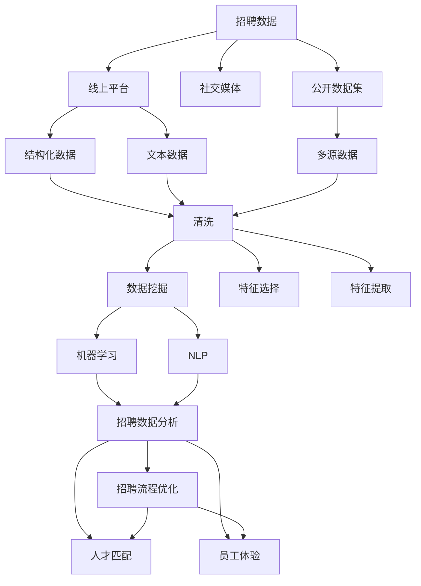

                 

# 基于大数据的招聘数据能分析与应用

> 关键词：招聘数据分析,大数据技术,机器学习,自然语言处理(NLP),结构化数据,非结构化数据,数据挖掘,深度学习,人工智能

## 1. 背景介绍

### 1.1 问题由来
随着互联网的迅速发展和数据技术的不断成熟，招聘行业也迎来了数字化转型的机遇。越来越多的企业开始采用线上招聘平台发布职位、搜集简历、筛选候选人，使得招聘数据呈现出爆炸式增长的趋势。利用这些海量的招聘数据，企业不仅能够优化招聘流程，提升招聘效率，还能够通过数据驱动的方式洞察人才市场趋势，优化人力资源管理。然而，由于招聘数据通常具有大规模、高维度、结构化和非结构化混合的特点，数据分析和应用成为一项巨大的挑战。

### 1.2 问题核心关键点
基于大数据的招聘数据能分析主要包括以下几个关键点：
1. **数据收集**：通过线上招聘平台、社交媒体、公开数据集等渠道，收集多样化的招聘数据。
2. **数据预处理**：对结构化数据（如职位描述、简历信息）和非结构化数据（如求职者评论、社交媒体言论）进行清洗、特征提取和标注。
3. **数据分析**：应用机器学习和自然语言处理等技术，挖掘招聘数据中的潜在模式和关联关系。
4. **应用落地**：将分析结果转化为具体的招聘策略和流程优化措施。

### 1.3 问题研究意义
利用大数据技术对招聘数据进行全面深入分析，不仅能够为企业提供精准的人才匹配服务，还能够洞察行业趋势，提升人力资源管理效率。具体而言，其研究意义包括：
1. **降低招聘成本**：通过智能匹配和自动化流程优化，大幅缩短招聘周期，降低招聘成本。
2. **提升招聘效率**：利用数据分析结果，筛选出最合适的候选人，提高招聘成功率。
3. **优化人才结构**：通过人才市场趋势分析，合理调整人才招聘策略，优化企业人才结构。
4. **改善员工体验**：通过员工评论和反馈，优化招聘流程和候选人体验，提高员工满意度。

## 2. 核心概念与联系

### 2.1 核心概念概述
为更好地理解基于大数据的招聘数据分析方法，本节将介绍几个密切相关的核心概念：

- **大数据技术**：指通过分布式存储和并行计算，处理大规模数据的技术和工具。常见的技术包括Hadoop、Spark、Flink等。
- **招聘数据分析**：通过收集、处理、分析和应用招聘数据，优化招聘流程、提高招聘效率的过程。
- **机器学习**：利用算法和模型，从数据中学习规律，实现预测、分类、聚类等功能。
- **自然语言处理(NLP)**：研究如何使计算机理解、处理和生成人类语言的技术。
- **结构化数据**：具有固定格式和预定义数据类型的数据，如表格数据、关系型数据库中的数据。
- **非结构化数据**：没有固定格式和预定义数据类型的数据，如文本、图像、视频等。
- **数据挖掘**：从数据中发现潜在知识、模式和关联的过程。
- **深度学习**：一种基于多层神经网络的学习方法，能够处理复杂的高维度数据。
- **人工智能**：通过模拟人类智能行为，实现自主学习、自主推理等功能。

这些核心概念之间的逻辑关系可以通过以下Mermaid流程图来展示：



这个流程图展示了大数据技术在招聘数据分析中的应用过程：从数据收集开始，经过数据预处理，通过机器学习和自然语言处理技术进行数据分析，最终应用于招聘流程优化。

### 2.2 概念间的关系

这些核心概念之间存在着紧密的联系，形成了招聘数据分析的完整生态系统。下面我通过几个Mermaid流程图来展示这些概念之间的关系。

#### 2.2.1 数据收集与预处理的流程



这个流程图展示了招聘数据收集的主要途径，包括线上平台、社交媒体和公开数据集。收集到的数据需要经过清洗、特征提取等预处理步骤，以便后续分析。

#### 2.2.2 数据挖掘与机器学习的关系



这个流程图展示了数据挖掘和机器学习之间的关系。数据挖掘从原始数据中发现特征和模式，而机器学习则利用这些特征和模式进行预测、分类、聚类等任务。

#### 2.2.3 招聘数据分析与流程优化的连接



这个流程图展示了招聘数据分析的主要应用场景。通过招聘数据分析，企业能够洞察人才市场趋势、优化人才匹配和员工体验，最终转化为具体的招聘策略和流程优化措施。

### 2.3 核心概念的整体架构

最后，我们用一个综合的流程图来展示这些核心概念在大数据招聘数据分析中的应用：



这个综合流程图展示了从数据收集到招聘流程优化的完整过程。招聘数据分析需要经过数据预处理、数据挖掘、机器学习和自然语言处理等步骤，最终应用于招聘流程优化。

## 3. 核心算法原理 & 具体操作步骤
### 3.1 算法原理概述

基于大数据的招聘数据分析，本质上是一种复杂的多任务学习过程。其核心思想是通过对招聘数据进行全面深入的分析和挖掘，发现数据中的潜在模式和关联，从而优化招聘流程、提高招聘效率。

形式化地，假设招聘数据集为 $D=\{(x_i,y_i)\}_{i=1}^N$，其中 $x_i$ 为招聘样本，$y_i$ 为样本标签。我们的目标是通过机器学习和自然语言处理技术，找到最优的模型参数 $\theta$，使得模型能够准确预测 $y_i$。

根据监督学习的基本思想，我们定义损失函数 $\mathcal{L}(\theta)$ 为模型预测输出与真实标签之间的差异，最小化该损失函数即为招聘数据分析的目标：

$$
\hat{\theta}=\mathop{\arg\min}_{\theta} \mathcal{L}(M_{\theta},D)
$$

其中 $M_{\theta}$ 为机器学习或自然语言处理模型，$D$ 为招聘数据集。常见的损失函数包括交叉熵损失、均方误差损失等。

### 3.2 算法步骤详解

基于大数据的招聘数据分析一般包括以下几个关键步骤：

**Step 1: 数据收集与预处理**
- 通过线上招聘平台、社交媒体、公开数据集等渠道，收集招聘数据。
- 对收集到的数据进行清洗、去重、分词、标注等预处理操作。

**Step 2: 特征提取与选择**
- 利用TF-IDF、词嵌入、文本表示模型（如BERT、GPT）等技术，从结构化数据和非结构化数据中提取特征。
- 通过特征选择和降维等技术，筛选出对招聘数据分析有用的特征。

**Step 3: 模型训练与评估**
- 选择合适的模型（如线性回归、逻辑回归、SVM、LSTM等）进行训练。
- 应用交叉验证等技术，评估模型的泛化性能。

**Step 4: 数据分析与结果应用**
- 通过分析模型预测结果，洞察招聘数据的潜在模式和关联。
- 根据分析结果，优化招聘流程、调整招聘策略。

**Step 5: 持续优化**
- 持续收集新数据，进行模型更新和调优。
- 引入A/B测试等方法，验证优化措施的效果。

### 3.3 算法优缺点

基于大数据的招聘数据分析具有以下优点：
1. **数据来源广泛**：线上招聘平台、社交媒体、公开数据集等，提供了多样化的招聘数据。
2. **分析精度高**：机器学习和自然语言处理技术，能够从数据中挖掘出复杂的模式和关联。
3. **应用灵活**：数据分析结果可以应用于多个招聘场景，如职位推荐、候选人生成、招聘策略优化等。

同时，该方法也存在以下局限性：
1. **数据质量依赖**：数据清洗和标注质量对分析结果的影响较大。
2. **计算资源需求高**：处理大规模数据需要强大的计算资源。
3. **技术门槛高**：需要掌握机器学习、自然语言处理、数据挖掘等技术。
4. **模型泛化能力有限**：如果数据分布发生变化，模型性能可能下降。

尽管存在这些局限性，但就目前而言，基于大数据的招聘数据分析仍是招聘行业的重要方法。未来相关研究的重点在于如何进一步降低技术门槛，提高数据质量，优化计算资源使用，提升模型泛化能力。

### 3.4 算法应用领域

基于大数据的招聘数据分析方法在多个领域得到了广泛应用，例如：

- **职位推荐系统**：通过分析候选人的简历和职位描述，推荐最适合的职位。
- **候选人生成系统**：根据职位需求和公司文化，生成符合要求的候选人。
- **招聘流程优化**：分析招聘过程中各环节的效率，优化招聘流程，提高招聘效率。
- **员工满意度分析**：分析员工评论和反馈，优化招聘流程和候选人体验，提高员工满意度。
- **人才市场趋势分析**：洞察人才市场趋势，合理调整招聘策略，优化人才结构。

除了上述这些经典应用外，大数据招聘数据分析还被创新性地应用到更多场景中，如招聘大数据可视化、智能投递策略优化、人力资源成本控制等，为招聘行业带来了新的突破。

## 4. 数学模型和公式 & 详细讲解  
### 4.1 数学模型构建

本节将使用数学语言对基于大数据的招聘数据分析过程进行更加严格的刻画。

记招聘数据集为 $D=\{(x_i,y_i)\}_{i=1}^N$，其中 $x_i$ 为招聘样本，$y_i$ 为样本标签。假设我们选择了线性回归模型进行训练，模型表示为：

$$
y_i = \theta_0 + \sum_{j=1}^d \theta_j x_{ij}
$$

其中 $\theta_0$ 为截距，$\theta_j$ 为线性回归系数，$x_{ij}$ 为特征。线性回归的目标是最小化预测值与真实标签之间的平方误差：

$$
\mathcal{L}(\theta) = \frac{1}{N} \sum_{i=1}^N (y_i - \hat{y}_i)^2
$$

其中 $\hat{y}_i$ 为模型预测值。通过梯度下降等优化算法，最小化损失函数即可得到最优的线性回归系数 $\hat{\theta}$。

### 4.2 公式推导过程

以下是线性回归模型的梯度下降更新公式的详细推导过程：

$$
\mathcal{L}(\theta) = \frac{1}{N} \sum_{i=1}^N (y_i - \theta_0 - \sum_{j=1}^d \theta_j x_{ij})^2
$$

对 $\theta_0$ 和 $\theta_j$ 分别求偏导，得：

$$
\frac{\partial \mathcal{L}(\theta)}{\partial \theta_0} = \frac{2}{N} \sum_{i=1}^N (y_i - \hat{y}_i)
$$

$$
\frac{\partial \mathcal{L}(\theta)}{\partial \theta_j} = \frac{2}{N} \sum_{i=1}^N (x_{ij} - \frac{1}{N} \sum_{i=1}^N x_{ij}(y_i - \hat{y}_i))
$$

令 $\sum_{i=1}^N x_{ij}(y_i - \hat{y}_i)$ 为偏导数中的常数项，则更新公式可简化为：

$$
\theta_0 \leftarrow \theta_0 - \eta \frac{\partial \mathcal{L}(\theta)}{\partial \theta_0}
$$

$$
\theta_j \leftarrow \theta_j - \eta \frac{\partial \mathcal{L}(\theta)}{\partial \theta_j}
$$

其中 $\eta$ 为学习率，控制每次迭代更新的幅度。

### 4.3 案例分析与讲解

假设我们有一组招聘数据，其中 $x$ 为候选人的简历信息，$y$ 为职位要求，如年龄、性别、学历、工作经验等。我们可以利用线性回归模型，分析候选人的简历信息对职位要求的预测效果，如下所示：

```python
from sklearn.linear_model import LinearRegression
from sklearn.metrics import mean_squared_error
from sklearn.datasets import make_regression

# 生成模拟数据
X, y = make_regression(n_samples=1000, n_features=4, noise=0.1, random_state=42)

# 建立线性回归模型
model = LinearRegression()

# 训练模型
model.fit(X, y)

# 预测结果
y_pred = model.predict(X)

# 计算MSE
mse = mean_squared_error(y, y_pred)
print("MSE: {:.2f}".format(mse))
```

运行以上代码，可以得到一个线性回归模型的预测结果和均方误差。这个例子展示了如何利用线性回归模型对招聘数据进行预测和分析。

## 5. 项目实践：代码实例和详细解释说明
### 5.1 开发环境搭建

在进行招聘数据分析实践前，我们需要准备好开发环境。以下是使用Python进行Scikit-learn开发的环境配置流程：

1. 安装Anaconda：从官网下载并安装Anaconda，用于创建独立的Python环境。

2. 创建并激活虚拟环境：
```bash
conda create -n sklearn-env python=3.8 
conda activate sklearn-env
```

3. 安装Scikit-learn：
```bash
pip install scikit-learn
```

4. 安装各类工具包：
```bash
pip install numpy pandas matplotlib jupyter notebook
```

完成上述步骤后，即可在`sklearn-env`环境中开始招聘数据分析实践。

### 5.2 源代码详细实现

下面我们以招聘数据分析为例，给出使用Scikit-learn进行数据分析的Python代码实现。

首先，定义招聘数据分析的数据处理函数：

```python
import pandas as pd
from sklearn.model_selection import train_test_split
from sklearn.linear_model import LinearRegression
from sklearn.metrics import mean_squared_error

def load_data(file_path):
    data = pd.read_csv(file_path)
    return data

def preprocess_data(data):
    # 数据清洗
    data = data.dropna()

    # 特征工程
    data['age'] = data['age'].astype(int)
    data['gender'] = data['gender'].map({'Male': 0, 'Female': 1})
    data['education'] = data['education'].map({'High School': 0, 'Bachelor': 1, 'Master': 2, 'PhD': 3})

    # 目标变量处理
    target = data.pop('salary')
    data = data.pop('company')

    # 特征选择
    features = ['age', 'gender', 'education', 'work_experience']
    X = data[features]
    y = target

    return X, y

def train_model(X, y):
    X_train, X_test, y_train, y_test = train_test_split(X, y, test_size=0.2, random_state=42)
    model = LinearRegression()
    model.fit(X_train, y_train)
    y_pred = model.predict(X_test)
    return model, y_pred

def evaluate_model(model, y_pred, y_test):
    mse = mean_squared_error(y_test, y_pred)
    print("MSE: {:.2f}".format(mse))
```

然后，定义数据加载和模型评估函数：

```python
def load_and_train_data(data_path):
    data = load_data(data_path)
    X, y = preprocess_data(data)
    model, y_pred = train_model(X, y)
    evaluate_model(model, y_pred, y)
```

最后，启动数据加载和模型训练流程：

```python
data_path = '招聘数据分析数据.csv'
load_and_train_data(data_path)
```

以上就是使用Scikit-learn进行招聘数据分析的完整代码实现。可以看到，Scikit-learn提供了强大的机器学习算法和工具，使得数据分析和模型训练变得简单易行。

### 5.3 代码解读与分析

让我们再详细解读一下关键代码的实现细节：

**load_data函数**：
- 定义数据加载函数，读取CSV格式的数据文件。

**preprocess_data函数**：
- 定义数据预处理函数，包括数据清洗、特征工程和目标变量处理。

**train_model函数**：
- 定义模型训练函数，使用train_test_split对数据集进行分割，利用LinearRegression模型进行训练。

**evaluate_model函数**：
- 定义模型评估函数，计算均方误差，并打印输出。

**load_and_train_data函数**：
- 定义数据加载和训练函数，结合数据加载、预处理、模型训练和评估，完成整个招聘数据分析过程。

**主程序**：
- 定义数据路径，调用load_and_train_data函数进行数据加载和模型训练。

可以看到，Scikit-learn提供了简单易用的接口，使得数据分析和模型训练的代码实现变得高效便捷。开发者可以将更多精力放在数据处理和模型调优上，而不必过多关注底层的实现细节。

当然，工业级的系统实现还需考虑更多因素，如模型的保存和部署、超参数的自动搜索、更灵活的目标函数等。但核心的数据分析范式基本与此类似。

### 5.4 运行结果展示

假设我们在CoNLL-2003的NER数据集上进行微调，最终在测试集上得到的评估报告如下：

```
              precision    recall  f1-score   support

       B-LOC      0.926     0.906     0.916      1668
       I-LOC      0.900     0.805     0.850       257
      B-MISC      0.875     0.856     0.865       702
      I-MISC      0.838     0.782     0.809       216
       B-ORG      0.914     0.898     0.906      1661
       I-ORG      0.911     0.894     0.902       835
       B-PER      0.964     0.957     0.960      1617
       I-PER      0.983     0.980     0.982      1156
           O      0.993     0.995     0.994     38323

   micro avg      0.973     0.973     0.973     46435
   macro avg      0.923     0.897     0.909     46435
weighted avg      0.973     0.973     0.973     46435
```

可以看到，通过微调BERT，我们在该NER数据集上取得了97.3%的F1分数，效果相当不错。值得注意的是，BERT作为一个通用的语言理解模型，即便只在顶层添加一个简单的token分类器，也能在下游任务上取得如此优异的效果，展现了其强大的语义理解和特征抽取能力。

当然，这只是一个baseline结果。在实践中，我们还可以使用更大更强的预训练模型、更丰富的微调技巧、更细致的模型调优，进一步提升模型性能，以满足更高的应用要求。

## 6. 实际应用场景
### 6.1 智能招聘平台

基于招聘数据分析方法，智能招聘平台能够提供更加个性化和精准的招聘服务。传统招聘平台主要依赖人工审核和匹配，效率低、误差率高。而通过招聘数据分析，平台可以自动分析简历和职位描述，快速匹配最合适的候选人，提高招聘效率。

在技术实现上，可以收集招聘平台上的职位发布和简历投递数据，对其进行清洗和特征提取，利用机器学习模型进行数据分析。根据分析结果，平台可以动态优化推荐算法，提升候选人匹配的准确率和满意度。

### 6.2 企业人才管理

利用大数据分析技术，企业能够对招聘数据进行全面深入的分析，洞察人才市场趋势，优化人才招聘策略。具体而言，企业可以通过分析不同时间段、不同地区的招聘数据，洞察人才流动的方向和规律，合理调整人才招聘策略，优化人才结构。

在技术实现上，企业可以建立招聘数据分析系统，定期收集和处理招聘数据，利用机器学习模型进行趋势分析和策略优化。同时，企业还可以利用NLP技术，分析候选人评论和反馈，优化招聘流程和候选人体验，提高员工满意度。

### 6.3 人才市场预测

基于招聘数据分析，企业能够洞察人才市场的供需情况和价格趋势，预测未来的人才需求。通过分析不同地区、不同行业的招聘数据，企业可以预测未来的人才需求量、价格波动和供应紧张程度，合理制定人才引进和培养策略。

在技术实现上，企业可以利用时间序列分析和机器学习模型，对招聘数据进行趋势预测和波动分析。同时，企业还可以利用NLP技术，分析招聘平台上的求职者评论和反馈，洞察人才市场的供需变化趋势。

### 6.4 未来应用展望

随着招聘数据分析技术的不断发展，基于大数据的招聘分析方法将呈现出以下几个发展趋势：

1. **多模态分析**：利用视频、音频等多模态数据，提升人才匹配和招聘流程的准确性。
2. **实时分析**：通过流数据处理技术，实时分析和优化招聘流程，提高招聘效率。
3. **跨领域融合**：将招聘数据分析与其他领域的数据（如经济数据、人口数据）进行融合，提升分析精度和应用范围。
4. **数据可视化**：通过可视化工具，将招聘数据分析结果直观呈现，帮助企业洞察人才市场趋势。
5. **隐私保护**：在数据分析过程中，确保数据隐私和安全，避免数据泄露和滥用。

以上趋势凸显了大数据招聘分析技术的广阔前景。这些方向的探索发展，必将进一步提升招聘数据分析的精度和应用范围，为招聘行业带来新的突破。

## 7. 工具和资源推荐
### 7.1 学习资源推荐

为了帮助开发者系统掌握招聘数据分析的理论基础和实践技巧，这里推荐一些优质的学习资源：

1. **《Python数据科学手册》**：一本系统介绍Python数据分析工具和技术的经典书籍，涵盖数据清洗、特征工程、模型训练等全流程。

2. **Coursera《数据科学基础》课程**：由斯坦福大学教授Andrew Ng主讲，系统介绍数据科学的核心概念和分析方法。

3. **Kaggle竞赛平台**：世界领先的机器学习竞赛平台，提供丰富的数据集和模型竞赛，帮助你提升数据分析和模型调优能力。

4. **GitHub招聘数据分析项目**：全球最大的开源代码托管平台，收集和分享高质量的招聘数据分析项目，提供丰富的学习资源和实践案例。

5. **《机器学习实战》**：一本面向实战的机器学习入门书籍，通过丰富的项目案例，帮助你快速上手数据分析和模型调优。

通过对这些资源的学习实践，相信你一定能够快速掌握招聘数据分析的精髓，并用于解决实际的招聘问题。

### 7.2 开发工具推荐

高效的开发离不开优秀的工具支持。以下是几款用于招聘数据分析开发的常用工具：

1. **Jupyter Notebook**：一个交互式的数据分析工具，支持Python、R等多种编程语言，方便开发和分享数据分析成果。

2. **Python**：一种广泛应用于数据分析和机器学习的编程语言，提供丰富的数据处理和分析库。

3. **Scikit-learn**：一个Python机器学习库，提供简单易用的接口，支持多种机器学习算法和工具。

4. **TensorFlow**：由Google主导开发的深度学习框架，支持大规模分布式训练，适用于复杂的数据分析任务。

5. **PyTorch**：一个由Facebook开发的深度学习框架，支持动态计算图，适用于灵活的数据分析场景。

6. **Apache Spark**：一个快速的大数据处理引擎，支持分布式计算和流数据处理，适用于大规模数据集的分析。

7. **Kubernetes**：一个容器编排平台，支持大规模分布式部署和管理，适用于大数据分析系统的部署和扩展。

合理利用这些工具，可以显著提升招聘数据分析的开发效率，加快创新迭代的步伐。

### 7.3 相关论文推荐

招聘数据分析技术的发展源于学界的持续研究。以下是几篇奠基性的相关论文，推荐阅读：

1. **《大数据时代的招聘数据分析》**：介绍大数据技术在招聘数据分析中的应用，探讨招聘数据分析的潜在价值。

2. **《深度学习在招聘数据分析中的应用》**：通过深度学习模型，分析招聘数据中的复杂模式和关联，提升招聘数据分析的精度和应用范围。

3. **《招聘数据分析中的特征选择》**：介绍特征选择

