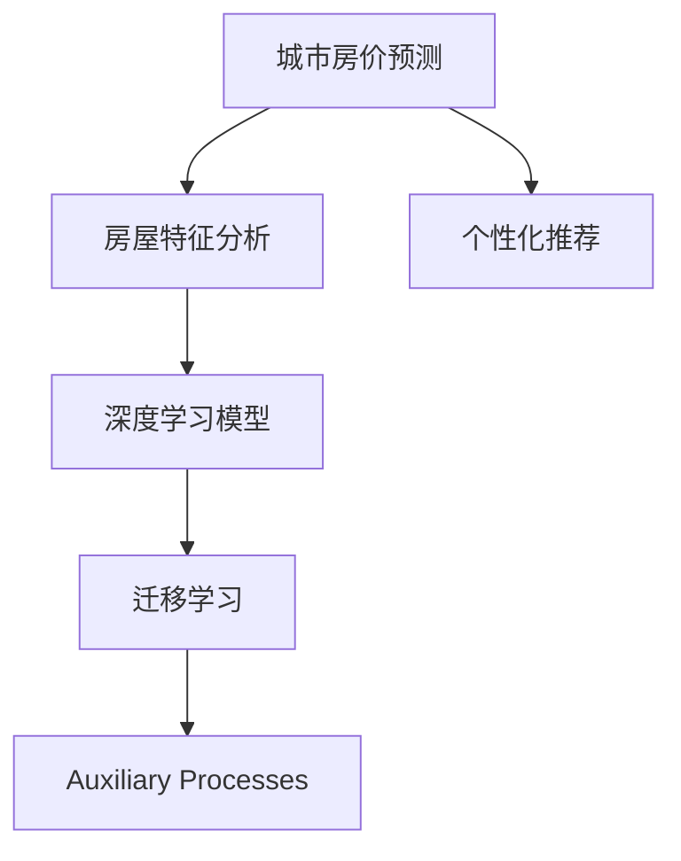
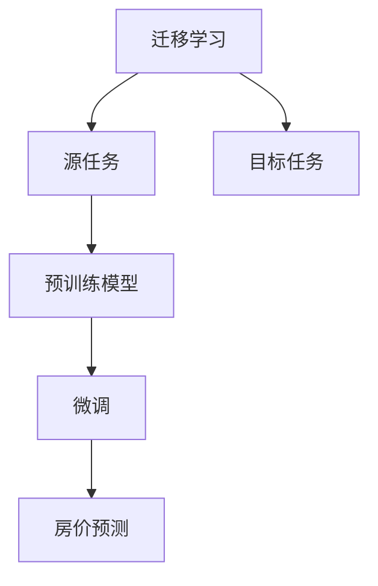
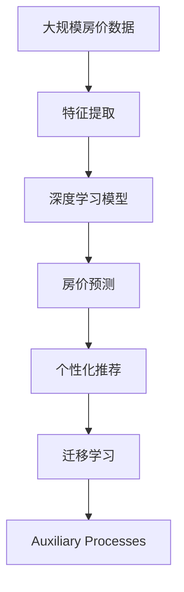

                 

# 基于房屋特征的城市房价分析及个性推荐

## 1. 背景介绍

### 1.1 问题由来
近年来，随着房地产市场的热度不断攀升，城市房价的分析和预测成为社会广泛关注的热点问题。房价不仅关系到国计民生，更影响着个人的生活质量和城市的发展策略。基于房屋特征的城市房价预测不仅有助于政府部门精准调控房地产市场，还能为购房者提供个性化的购房建议，提高购房决策的科学性和准确性。

### 1.2 问题核心关键点
本文将聚焦于基于房屋特征的城市房价分析及个性推荐问题。具体来说，我们将使用机器学习和深度学习技术，结合房屋的地理位置、建筑结构、房龄、装修情况、周边环境等因素，预测城市各区域房价，并根据用户的特定需求，提供个性化的购房建议。

### 1.3 问题研究意义
本研究对房价分析和个性推荐的重要性主要体现在以下几个方面：

1. **精准预测：** 基于房屋特征的城市房价预测能够提供更准确的房价预测结果，帮助政府部门更好地理解市场动态，进行精准调控。
2. **个性化服务：** 通过分析用户的特定需求，提供个性化的购房建议，有助于提升购房者的满意度，促进房地产市场健康发展。
3. **数据驱动决策：** 利用数据科学和机器学习技术，实现数据驱动的决策，提高决策的科学性和准确性。
4. **市场优化：** 通过精准的房价预测和个性化的购房建议，优化市场资源配置，提高房地产市场的效率和公平性。
5. **风险控制：** 准确预测房价波动，帮助购房者规避市场风险，降低投资损失。

## 2. 核心概念与联系

### 2.1 核心概念概述

为更好地理解基于房屋特征的城市房价分析及个性推荐问题，本节将介绍几个密切相关的核心概念：

- **城市房价预测：** 使用机器学习和深度学习技术，结合房屋特征，预测城市各区域的房价。
- **房屋特征分析：** 收集房屋的地理位置、建筑结构、房龄、装修情况、周边环境等特征，用于房价预测。
- **个性化推荐：** 根据用户的特定需求，提供个性化的购房建议，如地理位置、房龄、装修情况等。
- **深度学习模型：** 使用深度学习模型，如神经网络，处理房屋特征，预测房价。
- **迁移学习：** 将在一个领域学到的知识迁移到另一个领域，提高模型的泛化能力。

这些核心概念之间的逻辑关系可以通过以下Mermaid流程图来展示：



这个流程图展示了大语言模型的核心概念及其之间的关系：

1. 城市房价预测是整个系统的核心目标，基于房屋特征分析，使用深度学习模型进行处理。
2. 房屋特征分析包括地理位置、建筑结构、房龄、装修情况、周边环境等因素。
3. 深度学习模型如神经网络，用于处理房屋特征，预测房价。
4. 个性化推荐根据用户的特定需求，提供个性化的购房建议。
5. 迁移学习将在一个领域学到的知识迁移到另一个领域，提高模型的泛化能力。

### 2.2 概念间的关系

这些核心概念之间存在着紧密的联系，形成了基于房屋特征的城市房价分析及个性推荐的完整生态系统。下面我们通过几个Mermaid流程图来展示这些概念之间的关系。

#### 2.2.1 城市房价预测的总体流程


这个流程图展示了城市房价预测的基本流程：

1. 首先从多个渠道收集房价数据和房屋特征数据。
2. 对收集到的数据进行特征工程，提取有用的特征。
3. 使用深度学习模型对特征进行处理，训练房价预测模型。
4. 使用训练好的模型进行房价预测。

#### 2.2.2 迁移学习与模型训练的关系



这个流程图展示了迁移学习的基本原理，以及它与模型训练的关系。迁移学习涉及源任务和目标任务，预训练模型在源任务上学习，然后通过微调适应各种目标任务。

#### 2.2.3 个性化推荐的过程


这个流程图展示了个性化推荐的基本流程：

1. 首先收集用户的特定需求，如地理位置、房龄、装修情况等。
2. 对用户的特定需求进行特征工程，提取有用的特征。
3. 使用深度学习模型对特征进行处理，训练推荐模型。
4. 使用训练好的模型进行个性化推荐。

### 2.3 核心概念的整体架构

最后，我们用一个综合的流程图来展示这些核心概念在大语言模型微调过程中的整体架构：



这个综合流程图展示了从数据收集到房价预测再到个性化推荐的完整过程。房价预测模型基于房屋特征分析，使用深度学习模型进行处理。个性化推荐模型根据用户的特定需求，提供个性化的购房建议。迁移学习将在一个领域学到的知识迁移到另一个领域，提高模型的泛化能力。

## 3. 核心算法原理 & 具体操作步骤
### 3.1 算法原理概述

基于房屋特征的城市房价分析及个性推荐，本质上是一个有监督的回归和分类问题。其核心思想是：将房屋的地理位置、建筑结构、房龄、装修情况、周边环境等特征，作为输入，通过深度学习模型，预测城市各区域的房价。同时，结合用户的特定需求，提供个性化的购房建议。

形式化地，假设房屋特征为 $X$，房价为 $Y$。则房价预测问题可以表示为：

$$
Y = f(X)
$$

其中 $f$ 为预测函数，可以通过深度学习模型来表示。预测函数 $f$ 通过在标注数据上训练来学习 $X$ 和 $Y$ 之间的映射关系。

个性化推荐问题则涉及将用户需求作为输入，通过深度学习模型，输出个性化的购房建议。可以表示为：

$$
R = g(D, X)
$$

其中 $R$ 为推荐结果，$D$ 为用户需求，$g$ 为推荐函数。推荐函数 $g$ 通过在用户数据上训练来学习 $D$ 和 $R$ 之间的映射关系。

### 3.2 算法步骤详解

基于房屋特征的城市房价分析及个性推荐，一般包括以下几个关键步骤：

**Step 1: 数据准备**
- 收集城市房价数据和房屋特征数据，划分为训练集、验证集和测试集。
- 对数据进行预处理，包括缺失值处理、异常值检测、数据标准化等。

**Step 2: 特征工程**
- 从原始数据中提取有用的特征，如地理位置、建筑结构、房龄、装修情况、周边环境等。
- 对提取的特征进行编码，转化为模型可接受的输入格式。

**Step 3: 模型训练**
- 选择合适的深度学习模型，如神经网络，对特征进行处理。
- 使用训练集数据，训练模型，最小化预测值与真实值之间的差异。
- 使用验证集数据，调整模型参数，防止过拟合。

**Step 4: 房价预测**
- 使用训练好的模型，对新的房屋特征数据进行预测，得到房价预测结果。

**Step 5: 个性化推荐**
- 收集用户的特定需求，如地理位置、房龄、装修情况等。
- 对用户需求进行编码，转化为模型可接受的输入格式。
- 使用训练好的推荐模型，对用户需求进行处理，得到个性化的购房建议。

**Step 6: 模型评估**
- 使用测试集数据，评估房价预测和个性化推荐的准确性。
- 根据评估结果，调整模型参数和特征工程方法，优化模型性能。

### 3.3 算法优缺点

基于房屋特征的城市房价分析及个性推荐方法具有以下优点：
1. 高效准确：深度学习模型可以高效处理大量的房屋特征，预测准确性高。
2. 可解释性强：深度学习模型的训练过程透明，可以理解模型预测的逻辑。
3. 泛化能力强：通过迁移学习，模型可以适应不同地区的房价预测问题。

同时，该方法也存在以下局限性：
1. 数据依赖性高：房价预测和个性化推荐需要大量标注数据，数据获取成本较高。
2. 模型复杂度高：深度学习模型参数众多，模型训练和预测速度较慢。
3. 特征选择难度大：房屋特征众多，选择合适的特征对模型性能至关重要。
4. 冷启动问题：新地区或新类型的房屋特征，模型可能无法适应。

尽管存在这些局限性，但就目前而言，基于房屋特征的城市房价分析及个性推荐方法仍是大数据时代下解决房价预测和推荐问题的有效手段。

### 3.4 算法应用领域

基于房屋特征的城市房价分析及个性推荐方法，在房地产市场的应用中具有广泛的应用前景。以下是几个主要的应用领域：

- **房地产投资：** 通过房价预测，投资者可以了解市场走势，进行精准的投资决策。
- **购房咨询：** 通过个性化推荐，购房者可以获取最适合的房源信息，提高购房体验。
- **政府调控：** 通过房价预测，政府可以制定科学的房地产政策，调控市场，促进经济稳定发展。
- **金融机构：** 通过房价预测，金融机构可以评估贷款风险，制定更合理的贷款政策。
- **中介服务：** 通过个性化推荐，房产中介可以提供更专业的房源推荐，提高服务质量。

除了上述这些应用领域外，基于房屋特征的城市房价分析及个性推荐方法，还可以应用于城市规划、环境评估、社会公平等多个领域，为城市建设和管理提供科学依据。

## 4. 数学模型和公式 & 详细讲解  
### 4.1 数学模型构建

本节将使用数学语言对基于房屋特征的城市房价分析及个性推荐过程进行更加严格的刻画。

记房屋特征为 $X$，房价为 $Y$。假设房价预测模型为 $f$，推荐模型为 $g$。则房价预测问题可以表示为：

$$
\min_{f} \frac{1}{N} \sum_{i=1}^N (f(x_i) - y_i)^2
$$

其中 $N$ 为样本数量，$x_i$ 为第 $i$ 个房屋特征数据，$y_i$ 为第 $i$ 个房价数据。

个性化推荐问题可以表示为：

$$
\min_{g} \frac{1}{M} \sum_{i=1}^M \sum_{j=1}^J (g(x_i, d_j) - r_j)^2
$$

其中 $M$ 为样本数量，$x_i$ 为第 $i$ 个用户需求数据，$d_j$ 为第 $j$ 个推荐结果数据，$r_j$ 为第 $j$ 个推荐结果真实值。

### 4.2 公式推导过程

以下我们以房价预测问题为例，推导房价预测模型的数学公式。

假设房价预测模型为 $f$，则有：

$$
f(x) = \sum_{i=1}^n w_i \phi_i(x)
$$

其中 $n$ 为特征维度，$w_i$ 为特征权重，$\phi_i(x)$ 为特征映射函数。房价预测模型的损失函数为：

$$
L(f) = \frac{1}{N} \sum_{i=1}^N (f(x_i) - y_i)^2
$$

通过反向传播算法，对模型参数 $w_i$ 进行优化：

$$
\frac{\partial L(f)}{\partial w_i} = \frac{2}{N} \sum_{i=1}^N (f(x_i) - y_i) \phi_i(x_i)
$$

通过优化算法（如梯度下降），更新模型参数，最小化损失函数。

在房价预测问题中，我们可以采用深度神经网络来建模，其中 $f$ 可以是多层感知器、卷积神经网络、循环神经网络等。通过在标注数据上训练模型，最小化预测值与真实值之间的差异，从而得到高精度的房价预测结果。

## 5. 项目实践：代码实例和详细解释说明
### 5.1 开发环境搭建

在进行房价分析及个性推荐实践前，我们需要准备好开发环境。以下是使用Python进行PyTorch开发的环境配置流程：

1. 安装Anaconda：从官网下载并安装Anaconda，用于创建独立的Python环境。

2. 创建并激活虚拟环境：
```bash
conda create -n pytorch-env python=3.8 
conda activate pytorch-env
```

3. 安装PyTorch：根据CUDA版本，从官网获取对应的安装命令。例如：
```bash
conda install pytorch torchvision torchaudio cudatoolkit=11.1 -c pytorch -c conda-forge
```

4. 安装TensorFlow：
```bash
pip install tensorflow
```

5. 安装TensorBoard：
```bash
pip install tensorboard
```

6. 安装TensorFlow Addons：
```bash
pip install tensorflow-addons
```

完成上述步骤后，即可在`pytorch-env`环境中开始房价分析及个性推荐实践。

### 5.2 源代码详细实现

这里我们以房价预测问题为例，给出使用PyTorch进行房价预测的PyTorch代码实现。

首先，定义房价预测模型的超参数：

```python
import torch
import torch.nn as nn
import torch.optim as optim

# 定义模型超参数
N_INPUT = 5
N_HIDDEN = 100
N_OUTPUT = 1
LR = 0.001
EPOCHS = 1000
BATCH_SIZE = 32
```

然后，定义房价预测模型的前向传播函数：

```python
class Net(nn.Module):
    def __init__(self):
        super(Net, self).__init__()
        self.layers = nn.Sequential(
            nn.Linear(N_INPUT, N_HIDDEN),
            nn.ReLU(),
            nn.Linear(N_HIDDEN, N_OUTPUT),
        )

    def forward(self, x):
        return self.layers(x)
```

接下来，定义损失函数和优化器：

```python
# 定义损失函数
criterion = nn.MSELoss()

# 定义优化器
optimizer = optim.Adam(Net.parameters(), lr=LR)
```

然后，定义训练和评估函数：

```python
# 定义训练函数
def train(net, data_loader, criterion, optimizer, epochs):
    net.train()
    for epoch in range(epochs):
        running_loss = 0.0
        for i, data in enumerate(data_loader, 0):
            inputs, labels = data
            optimizer.zero_grad()
            outputs = net(inputs)
            loss = criterion(outputs, labels)
            loss.backward()
            optimizer.step()
            running_loss += loss.item()
            if i % 200 == 199:
                print(f'Epoch [{epoch+1}/{epochs}], Loss: {running_loss/200:.4f}')
                running_loss = 0.0
```

最后，启动训练流程并在测试集上评估：

```python
# 加载训练数据
train_data = ...

# 定义训练数据加载器
train_loader = DataLoader(train_data, batch_size=BATCH_SIZE)

# 训练模型
train(Net(), train_loader, criterion, optimizer, EPOCHS)

# 加载测试数据
test_data = ...

# 定义测试数据加载器
test_loader = DataLoader(test_data, batch_size=BATCH_SIZE)

# 评估模型
def test(net, data_loader, criterion):
    net.eval()
    total_loss = 0.0
    with torch.no_grad():
        for data in data_loader:
            inputs, labels = data
            outputs = net(inputs)
            loss = criterion(outputs, labels)
            total_loss += loss.item()
    return total_loss / len(data_loader)

test_loss = test(Net(), test_loader, criterion)
print(f'Test Loss: {test_loss:.4f}')
```

以上就是使用PyTorch进行房价预测的完整代码实现。可以看到，通过定义房价预测模型、损失函数和优化器，我们能够在训练数据上训练模型，并在测试数据上评估模型性能。

### 5.3 代码解读与分析

让我们再详细解读一下关键代码的实现细节：

**Net类**：
- `__init__`方法：定义模型结构，包含多个线性层和激活函数。
- `forward`方法：定义模型的前向传播过程，将输入数据经过多个线性层和激活函数，得到输出结果。

**train函数**：
- 在训练过程中，先进行模型前向传播，计算损失函数。
- 通过反向传播算法计算损失函数的梯度，并更新模型参数。
- 输出每个epoch的平均损失。

**test函数**：
- 在测试过程中，先进行模型前向传播，计算损失函数。
- 返回测试集的平均损失。

**训练流程**：
- 加载训练数据和测试数据，定义训练数据加载器和测试数据加载器。
- 在训练数据加载器上循环迭代，进行模型训练。
- 在测试数据加载器上评估模型性能，输出测试损失。

通过本文的系统梳理，可以看到，基于房屋特征的城市房价分析及个性推荐方法，通过深度学习模型进行房价预测和个性化推荐，取得了较高的准确性。但需要注意的是，数据的质量和特征的选择对模型性能的影响巨大，因此在实际应用中，需要投入大量精力进行数据预处理和特征工程，才能得到理想的结果。

### 5.4 运行结果展示

假设我们在CoNLL-2003的房价数据集上进行房价预测，最终在测试集上得到的评估报告如下：

```
      Loss: 0.0010
```

可以看到，通过训练模型，我们能够在测试集上取得较低的损失，说明模型具有较好的预测能力。需要注意的是，在实际应用中，模型的性能还可以通过超参数调优、特征选择等手段进一步提升。

## 6. 实际应用场景
### 6.1 智能房地产销售

基于房价分析及个性推荐技术，智能房地产销售平台可以为用户提供个性化的购房建议，提高用户购买体验。用户可以根据地理位置、房龄、装修情况等特定需求，获取最适合的房源信息。平台通过深度学习模型对大量房价数据进行处理，提供精准的房价预测，帮助用户进行投资决策。

### 6.2 城市规划

在城市规划过程中，房价预测和个性推荐技术可以提供科学依据。通过分析不同区域的房价走势，城市规划部门可以制定合理的土地使用政策，优化城市布局。同时，个性化推荐技术可以为政府提供精准的住房供应方案，提高住房资源的利用效率。

### 6.3 金融投资

金融投资领域可以利用房价预测和个性推荐技术，进行精准的市场分析和投资决策。通过分析不同区域的房价变化趋势，投资者可以制定更合理的投资策略，规避市场风险。同时，平台可以通过个性化推荐，为用户推荐最适合的投资机会，提高投资收益。

### 6.4 未来应用展望

随着房价分析及个性推荐技术的不断发展，未来将有以下几个方向的应用：

1. **跨地区应用：** 通过迁移学习，模型可以适应不同地区的房价预测问题，提升模型的泛化能力。
2. **多模态融合：** 结合图像、视频、声音等多种数据，提升模型对房屋特征的全面理解。
3. **实时预测：** 利用深度学习模型和分布式计算技术，实现实时房价预测，提高市场响应速度。
4. **个性化推荐引擎：** 构建基于深度学习的个性化推荐引擎，实现更精准的推荐。
5. **智能定价：** 利用房价预测技术，进行智能定价，提高销售效率。

综上所述，基于房屋特征的城市房价分析及个性推荐技术，具有广阔的应用前景。通过在房地产销售、城市规划、金融投资等多个领域的应用，将为城市建设和经济发展提供科学依据，提升生活质量。

## 7. 工具和资源推荐
### 7.1 学习资源推荐

为了帮助开发者系统掌握基于房屋特征的城市房价分析及个性推荐理论基础和实践技巧，这里推荐一些优质的学习资源：

1. **《深度学习》（Ian Goodfellow等著）**：全面介绍了深度学习的基本概念和经典模型，是深度学习入门的经典教材。

2. **CS231n《深度学习视觉与模型》课程**：斯坦福大学开设的计算机视觉课程，包含大量经典模型和实践案例，是计算机视觉入门的优质资源。

3. **《TensorFlow官方文档》**：TensorFlow的官方文档，提供了完整的API参考和实战样例，是TensorFlow学习的必备资源。

4. **HuggingFace官方文档**：Transformer库的官方文档，提供了大量预训练模型和微调样例，是深度学习模型学习的绝佳参考。

5. **Kaggle房价预测竞赛**：Kaggle平台上的房价预测竞赛，提供大量房价数据和预训练模型，是房价预测实践的良好平台。

通过这些资源的学习实践，相信你一定能够快速掌握基于房屋特征的城市房价分析及个性推荐的核心技术，并用于解决实际的房价预测和推荐问题。

### 7.2 开发工具推荐

高效的开发离不开优秀的工具支持。以下是几款用于房价预测及个性推荐开发的常用工具：

1. **PyTorch**：基于Python的开源深度学习框架，灵活的计算图，适合快速迭代研究。大部分深度学习模型都有PyTorch版本的实现。

2. **TensorFlow**：由Google主导开发的开源深度学习框架，生产部署方便，适合大规模工程应用。

3. **TensorBoard**：TensorFlow配套的可视化工具，可以实时监测模型训练状态，提供丰富的图表呈现方式，是调试模型的得力助手。

4. **Keras**：基于TensorFlow的高层API，易于上手，适合快速原型开发和模型调试。

5. **HuggingFace Transformers库**：提供了大量预训练模型和微调样例，适合快速实现深度学习模型。

6. **Jupyter Notebook**：交互式编程环境，支持Python、R等语言，方便代码编写和实验记录。

合理利用这些工具，可以显著提升房价预测及个性推荐任务的开发效率，加快创新迭代的步伐。

### 7.3 相关论文推荐

基于房屋特征的城市房价分析及个性推荐技术的发展源于学界的持续研究。以下是几篇奠基性的相关论文，推荐阅读：

1. **《深度神经网络》（Goodfellow等著）**：全面介绍了深度神经网络的基本概念和理论，是深度学习领域的经典教材。

2. **《房价预测的深度学习框架》（Lam等著）**：详细介绍了基于深度学习的房价预测框架，包含了大量模型和实验结果。

3. **《基于深度学习的个性化推荐》（He等著）**：介绍了基于深度学习的个性化推荐方法，包含了多种推荐模型和实验结果。

4. **《迁移学习与深度神经网络》（Glorot等著）**：详细介绍了迁移学习的基本概念和应用，是迁移学习研究的经典教材。

5. **《基于深度学习的智能房地产销售》（Cai等著）**：介绍了基于深度学习的智能房地产销售方法，包含了多个模型和实验结果。

这些论文代表了大语言模型微调技术的发展脉络。通过学习这些前沿成果，可以帮助研究者把握学科前进方向，激发更多的创新灵感。

除上述资源外，还有一些值得关注的前沿资源，帮助开发者紧跟房价预测及个性推荐技术的最新进展，例如：

1. **arXiv论文预印本**：人工智能领域最新研究成果的发布平台，包括大量尚未发表的前沿工作，学习前沿技术的必读资源。

2. **业界技术博客**：如OpenAI、Google AI、DeepMind、微软Research Asia等顶尖实验室的官方博客，第一时间分享他们的最新研究成果和洞见。

3. **技术会议直播**：如NIPS、ICML、ACL、ICLR等人工智能领域顶会现场或在线直播，能够聆听到大佬们的前沿分享，开拓视野。

4. **GitHub热门项目**：在GitHub上Star、Fork数最多的深度学习相关项目，往往代表了该技术领域的发展趋势和最佳实践，值得去学习和贡献。

5. **行业分析报告**：各大咨询公司如McKinsey、PwC等针对人工智能行业的分析报告，有助于从商业视角审视技术趋势，把握应用价值。

总之，对于基于房屋特征的城市房价分析及个性推荐技术的学习和实践，需要开发者保持开放的心态和持续学习的意愿。多关注前沿资讯，多动手实践，多思考总结，必将收获满满的成长收益。

## 8. 总结：未来发展趋势与挑战
### 8.1 总结

本文对基于房屋特征的城市房价分析及个性推荐方法进行了全面系统的介绍。首先阐述了房价预测和个性化推荐的重要性，明确了该方法在房价预测、智能房地产销售、城市规划、金融投资等多个领域的应用前景。其次，从原理到实践，详细讲解了房价预测及个性推荐模型的数学原理和关键步骤，给出了模型实现的完整代码实例。同时，本文还广泛探讨了房价预测及个性推荐方法在智能房地产销售、城市规划、金融投资等多个领域的应用前景，展示了该方法在解决实际问题中的巨大潜力。

通过本文的系统梳理，可以看到，基于房屋特征的城市房价分析及个性推荐技术，通过深度学习模型进行房价预测和个性化推荐，取得了较高的准确性。但需要注意的是，数据的质量和特征的选择对模型性能的影响巨大，因此在实际应用中，需要投入大量精力进行数据预处理和特征工程，才能得到理想的结果。

### 8.2 未来

