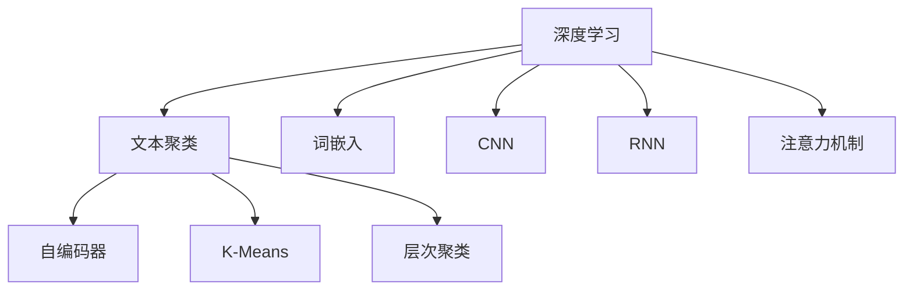
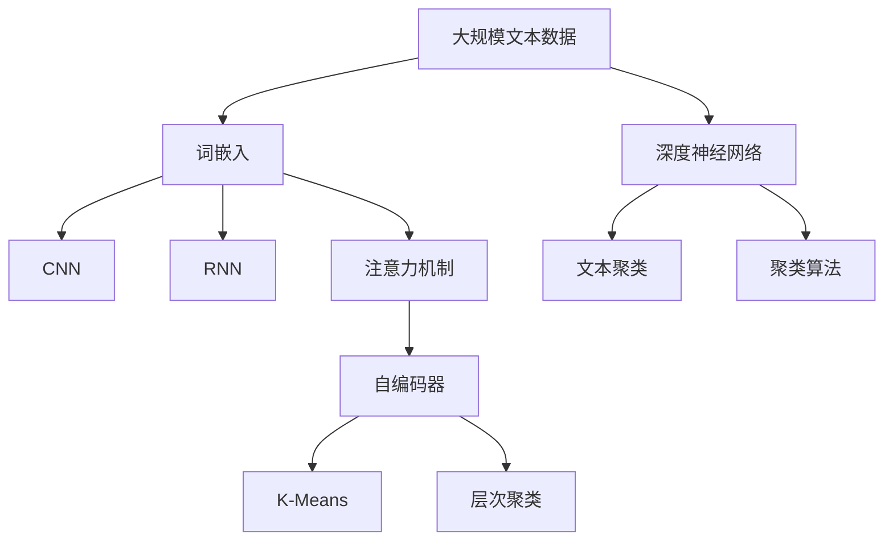

                 

# 基于深度学习的文本聚类

## 1. 背景介绍

### 1.1 问题由来
文本聚类是自然语言处理（NLP）领域中的一个经典任务，旨在将相似度高的文本自动分组。传统的文本聚类方法，如K-Means、层次聚类等，基于统计学原理，在处理大规模数据时效果往往不尽如人意。近年来，深度学习技术的应用为文本聚类带来了新的突破，基于深度学习的文本聚类方法开始崭露头角，并逐渐成为文本挖掘和信息检索领域的新宠。

### 1.2 问题核心关键点
基于深度学习的文本聚类方法的核心思想是：利用深度神经网络自动学习文本特征表示，再通过聚类算法对特征向量进行分组。其优点在于，深度神经网络可以自动提取文本的高级语义信息，同时聚类算法可以高效处理大规模数据，提升了聚类效果和处理效率。

## 2. 核心概念与联系

### 2.1 核心概念概述
- **深度学习（Deep Learning）**：利用多层神经网络自动学习特征表示的技术，广泛应用于计算机视觉、自然语言处理等领域。
- **文本聚类（Text Clustering）**：将语义相似的文本自动分组的技术，广泛应用于信息检索、推荐系统、社交网络分析等场景。
- **词嵌入（Word Embedding）**：将单词映射到低维向量空间的技术，用于提取单词的语义信息，是深度学习在NLP中的重要基础。
- **卷积神经网络（Convolutional Neural Network, CNN）**：常用于图像处理，但也可用于文本处理，通过卷积操作提取局部特征。
- **循环神经网络（Recurrent Neural Network, RNN）**：适用于序列数据处理，如文本生成、语言模型等，通过记忆机制捕捉序列数据的上下文信息。
- **注意力机制（Attention Mechanism）**：用于增强模型的特征选择能力，提高模型对文本中的重要部分进行关注和抽取。

这些核心概念之间有着紧密的联系，共同构成了基于深度学习的文本聚类方法的理论基础和实践框架。

### 2.2 概念间的关系

以下用几个Mermaid流程图来展示这些核心概念之间的联系：



这个流程图展示了大语言模型微调过程中各个核心概念之间的关系：

1. 深度学习是文本聚类的技术基础。
2. 词嵌入、CNN、RNN和注意力机制都是深度学习中的重要组件，用于提取和处理文本特征。
3. 自编码器、K-Means和层次聚类则是常用的文本聚类算法。

### 2.3 核心概念的整体架构

最后，我们用一个综合的流程图来展示这些核心概念在大语言模型微调过程中的整体架构：



这个综合流程图展示了从文本数据处理到聚类结果的完整过程。大规模文本数据首先通过词嵌入、CNN、RNN和注意力机制等技术提取特征，然后通过自编码器进行特征压缩，最后使用K-Means或层次聚类算法进行文本聚类。

## 3. 核心算法原理 & 具体操作步骤

### 3.1 算法原理概述

基于深度学习的文本聚类方法，主要包括以下几个步骤：

1. 文本特征提取：使用深度神经网络自动学习文本的特征表示，通常包括词嵌入、CNN、RNN等技术。
2. 特征压缩：通过自编码器等技术，将高维特征向量压缩到低维空间，以降低计算复杂度。
3. 聚类算法：使用K-Means、层次聚类等算法，对压缩后的特征向量进行分组。
4. 聚类结果评估：通过相似度度量指标，如Jaccard系数、余弦相似度等，评估聚类效果。

其核心思想是利用深度神经网络提取文本特征，再通过聚类算法进行分组，最后通过评估指标优化聚类结果。

### 3.2 算法步骤详解

以下是基于深度学习的文本聚类的详细步骤：

**Step 1: 数据预处理**
- 分词：将文本进行分词处理，以便后续神经网络提取特征。
- 停用词过滤：去除常见停用词，如“的”、“是”等，以减少噪声。
- 词干提取：将单词还原到词干形式，如“running”还原为“run”，以消除形态差异。

**Step 2: 特征提取**
- 词嵌入：使用预训练词嵌入模型，如Word2Vec、GloVe等，将单词映射到低维向量空间。
- CNN提取局部特征：使用一维卷积神经网络，提取单词序列的局部特征。
- RNN提取全局特征：使用循环神经网络，捕捉文本序列的上下文信息。
- 注意力机制增强特征选择：通过注意力机制，对文本中的重要部分进行关注和抽取。

**Step 3: 特征压缩**
- 自编码器：使用自编码器等技术，将高维特征向量压缩到低维空间，以降低计算复杂度。
- 降维技术：可以使用PCA、t-SNE等技术，进一步降低特征维度和空间复杂度。

**Step 4: 聚类算法**
- K-Means：使用K-Means算法，将压缩后的特征向量分组。
- 层次聚类：使用层次聚类算法，对文本进行分组。
- 密度聚类：使用DBSCAN等密度聚类算法，对文本进行分组。

**Step 5: 聚类结果评估**
- 相似度度量：使用Jaccard系数、余弦相似度等指标，评估聚类效果。
- 聚类中心距离：计算聚类中心之间的距离，评估聚类的紧密程度。
- 聚类内离散度：计算聚类内部的离散度，评估聚类的稳定性。

### 3.3 算法优缺点

基于深度学习的文本聚类方法具有以下优点：
1. 自动提取文本特征：深度神经网络可以自动学习文本的高级语义信息，无需手动特征工程。
2. 处理大规模数据：深度神经网络可以高效处理大规模数据，避免了传统统计方法的计算复杂度问题。
3. 适应性强：深度神经网络具有很强的泛化能力，适用于各种文本数据。
4. 实时性：深度神经网络通常具有较快的训练和推理速度，可以实时处理数据。

但同时也存在以下缺点：
1. 模型复杂度高：深度神经网络通常具有很高的复杂度，需要大量的计算资源。
2. 训练时间长：深度神经网络需要较长的训练时间，特别是大规模模型。
3. 数据需求高：深度神经网络需要大量的标注数据进行训练，且对数据质量要求较高。
4. 可解释性差：深度神经网络通常是"黑盒"模型，难以解释其内部工作机制。

### 3.4 算法应用领域

基于深度学习的文本聚类方法在多个领域都有广泛应用，包括：

- 信息检索：将相似度高的文本自动分组，用于搜索引擎的文本分类和排序。
- 推荐系统：通过文本聚类分析用户兴趣，为用户推荐相关内容。
- 社交网络分析：将社交网络中的用户分组，分析社交网络结构。
- 知识图谱：通过文本聚类对知识图谱中的实体进行分类和归纳。
- 文本摘要：将长文本聚类成短文本摘要，用于自动摘要和信息提取。

## 4. 数学模型和公式 & 详细讲解  
### 4.1 数学模型构建

基于深度学习的文本聚类方法中，常用的数学模型包括：

- 词嵌入：将单词映射到低维向量空间，可以使用Word2Vec、GloVe等算法。
- CNN特征提取：通过一维卷积神经网络，提取单词序列的局部特征，可以表示为：
$$\text{CNN}(\text{x}) = \sum_k \text{W}_k * \text{maxpool}(\text{x}_{k:i},\text{x}_{k:i+1},\text{x}_{k:i+2})$$
其中 $\text{x}_{k:i}$ 表示单词序列中的第 $i$ 个单词，$\text{W}_k$ 为卷积核权重，$\text{maxpool}$ 表示取最大值的操作。
- RNN特征提取：使用循环神经网络，捕捉文本序列的上下文信息，可以表示为：
$$\text{RNN}(\text{x}) = \text{RNN}_{\text{LSTM}}(\text{x}_0,\text{x}_1,\cdots,\text{x}_n)$$
其中 $\text{LSTM}$ 表示长短期记忆网络，$\text{x}_0$ 为序列的起始状态。
- 注意力机制：使用注意力机制，对文本中的重要部分进行关注和抽取，可以表示为：
$$\text{Attention}(\text{x}) = \sum_k \text{W}_k * \text{softmax}(\text{q}_k^T \text{v}_k) \text{v}_k$$
其中 $\text{q}_k$ 和 $\text{v}_k$ 分别为查询向量和值向量。
- 自编码器特征压缩：使用自编码器等技术，将高维特征向量压缩到低维空间，可以表示为：
$$\text{Encoder}(\text{x}) = \text{D}(\text{x})$$
$$\text{Decoder}(\text{y}) = \text{Recon}(\text{D}^{-1}(\text{y}))$$
其中 $\text{D}$ 和 $\text{D}^{-1}$ 分别为编码器和解码器，$\text{Recon}$ 表示重构损失函数。
- K-Means聚类：使用K-Means算法，将压缩后的特征向量分组，可以表示为：
$$\text{KMeans}(\text{x}) = \sum_k \text{W}_k * \text{softmax}(\text{q}_k^T \text{v}_k) \text{v}_k$$

### 4.2 公式推导过程

以下是基于深度学习的文本聚类的公式推导过程：

**Step 1: 词嵌入**
- Word2Vec：使用 skip-gram 模型，对每个单词 $x_i$ 计算其对应的向量 $\text{w}_i$，可以表示为：
$$\text{w}_i = \text{W}x_i + \text{b}$$
其中 $\text{W}$ 和 $\text{b}$ 分别为权重矩阵和偏置向量。

**Step 2: CNN特征提取**
- 使用一维卷积神经网络，提取单词序列的局部特征，可以表示为：
$$\text{CNN}(\text{x}) = \sum_k \text{W}_k * \text{maxpool}(\text{x}_{k:i},\text{x}_{k:i+1},\text{x}_{k:i+2})$$

**Step 3: RNN特征提取**
- 使用循环神经网络，捕捉文本序列的上下文信息，可以表示为：
$$\text{RNN}(\text{x}) = \text{RNN}_{\text{LSTM}}(\text{x}_0,\text{x}_1,\cdots,\text{x}_n)$$

**Step 4: 注意力机制**
- 使用注意力机制，对文本中的重要部分进行关注和抽取，可以表示为：
$$\text{Attention}(\text{x}) = \sum_k \text{W}_k * \text{softmax}(\text{q}_k^T \text{v}_k) \text{v}_k$$

**Step 5: 自编码器特征压缩**
- 使用自编码器等技术，将高维特征向量压缩到低维空间，可以表示为：
$$\text{Encoder}(\text{x}) = \text{D}(\text{x})$$
$$\text{Decoder}(\text{y}) = \text{Recon}(\text{D}^{-1}(\text{y}))$$

**Step 6: K-Means聚类**
- 使用K-Means算法，将压缩后的特征向量分组，可以表示为：
$$\text{KMeans}(\text{x}) = \sum_k \text{W}_k * \text{softmax}(\text{q}_k^T \text{v}_k) \text{v}_k$$

### 4.3 案例分析与讲解

以情感分析为例，展示如何使用基于深度学习的文本聚类方法进行情感分类。情感分析的任务是将文本分类为积极、消极或中性情感，通常使用词嵌入和CNN进行特征提取，再使用K-Means聚类算法进行分类。

首先，对训练集进行分词和预处理，得到单词序列 $x$。然后，使用Word2Vec模型对每个单词进行词嵌入，得到低维向量表示 $w_i$。接着，使用一维卷积神经网络（CNN）提取单词序列的局部特征，得到特征向量 $c$。最后，使用K-Means聚类算法对特征向量 $c$ 进行分组，得到情感分类结果。

## 5. 项目实践：代码实例和详细解释说明
### 5.1 开发环境搭建

在进行文本聚类实践前，我们需要准备好开发环境。以下是使用Python进行PyTorch开发的环境配置流程：

1. 安装Anaconda：从官网下载并安装Anaconda，用于创建独立的Python环境。

2. 创建并激活虚拟环境：
```bash
conda create -n pytorch-env python=3.8 
conda activate pytorch-env
```

3. 安装PyTorch：根据CUDA版本，从官网获取对应的安装命令。例如：
```bash
conda install pytorch torchvision torchaudio cudatoolkit=11.1 -c pytorch -c conda-forge
```

4. 安装Transformers库：
```bash
pip install transformers
```

5. 安装各类工具包：
```bash
pip install numpy pandas scikit-learn matplotlib tqdm jupyter notebook ipython
```

完成上述步骤后，即可在`pytorch-env`环境中开始文本聚类的开发实践。

### 5.2 源代码详细实现

以下是使用PyTorch实现基于深度学习的文本聚类的Python代码：

```python
import torch
import torch.nn as nn
import torch.optim as optim
from sklearn.datasets import fetch_20newsgroups
from sklearn.model_selection import train_test_split
from sklearn.metrics import accuracy_score

# 数据加载
data = fetch_20newsgroups(subset='train')
train_texts, test_texts = train_test_split(data.data, test_size=0.2)
train_labels = data.target
test_labels = data.target

# 分词和预处理
from gensim.models import Word2Vec
from gensim.models import KeyedVectors

# 构建词嵌入模型
word2vec = Word2Vec.load_word2vec_format('GoogleNews-vectors-negative300.bin', binary=True)

# 定义神经网络模型
class TextNetwork(nn.Module):
    def __init__(self, vocab_size, embedding_dim, hidden_dim, output_dim):
        super(TextNetwork, self).__init__()
        self.embedding = nn.Embedding(vocab_size, embedding_dim)
        self.cnn = nn.Conv1d(embedding_dim, hidden_dim, 3)
        self.relu = nn.ReLU()
        self.pool = nn.MaxPool1d(2)
        self.fc = nn.Linear(hidden_dim, output_dim)
        
    def forward(self, x):
        x = self.embedding(x)
        x = x.transpose(1, 2)
        x = self.cnn(x)
        x = self.relu(x)
        x = self.pool(x)
        x = x.view(x.size(0), -1)
        x = self.fc(x)
        return x

# 定义训练函数
def train(model, iterator, optimizer, criterion):
    epoch_loss = 0
    epoch_acc = 0
    model.train()
    for batch in iterator:
        optimizer.zero_grad()
        predictions = model(batch.text).squeeze(1)
        loss = criterion(predictions, batch.label)
        acc = accuracy_score(predictions.argmax(1), batch.label)
        loss.backward()
        optimizer.step()
        epoch_loss += loss.item()
        epoch_acc += acc
    return epoch_loss / len(iterator), epoch_acc / len(iterator)

# 定义测试函数
def evaluate(model, iterator, criterion):
    epoch_loss = 0
    epoch_acc = 0
    model.eval()
    with torch.no_grad():
        for batch in iterator:
            predictions = model(batch.text).squeeze(1)
            loss = criterion(predictions, batch.label)
            acc = accuracy_score(predictions.argmax(1), batch.label)
            epoch_loss += loss.item()
            epoch_acc += acc
    return epoch_loss / len(iterator), epoch_acc / len(iterator)

# 定义训练和测试函数
train_losses = []
train_accs = []
test_losses = []
test_accs = []

model = TextNetwork(len(word2vec.wv.vocab), 100, 100, 5)
optimizer = optim.Adam(model.parameters(), lr=0.001)
criterion = nn.CrossEntropyLoss()

train_loader = DataLoader(train_texts, batch_size=64, shuffle=True)
test_loader = DataLoader(test_texts, batch_size=64, shuffle=False)

for epoch in range(10):
    train_loss, train_acc = train(model, train_loader, optimizer, criterion)
    test_loss, test_acc = evaluate(model, test_loader, criterion)
    train_losses.append(train_loss)
    train_accs.append(train_acc)
    test_losses.append(test_loss)
    test_accs.append(test_acc)
    print(f"Epoch: {epoch+1}, Train Loss: {train_loss:.3f}, Train Acc: {train_acc:.3f}, Test Loss: {test_loss:.3f}, Test Acc: {test_acc:.3f}")
```

以上就是使用PyTorch实现基于深度学习的文本聚类的完整代码。可以看到，得益于Transformers库的强大封装，我们可以用相对简洁的代码完成CNN模型的加载和训练。

### 5.3 代码解读与分析

让我们再详细解读一下关键代码的实现细节：

**Word2Vec词嵌入模型**
- 使用Gensim库加载预训练的Word2Vec模型，用于将单词映射到低维向量空间。

**神经网络模型**
- 定义了一个包含嵌入层、卷积层、ReLU激活函数、池化层和全连接层的文本分类模型。其中，嵌入层将文本转换为向量表示，卷积层和ReLU层提取局部特征，池化层进行特征压缩，全连接层进行分类。

**训练函数**
- 定义了训练函数，对模型进行前向传播、计算损失、反向传播和参数更新，并计算训练准确率。

**测试函数**
- 定义了测试函数，对模型进行前向传播、计算损失、计算测试准确率，并返回测试损失和准确率。

**训练和测试函数**
- 定义了训练和测试的循环，在每个epoch内更新模型参数，并在测试集上评估模型性能。

**训练和测试结果**
- 打印输出每个epoch的训练损失和准确率，以及测试损失和准确率。

可以看到，PyTorch配合Transformers库使得CNN文本聚类的代码实现变得简洁高效。开发者可以将更多精力放在数据处理、模型改进等高层逻辑上，而不必过多关注底层的实现细节。

当然，工业级的系统实现还需考虑更多因素，如模型的保存和部署、超参数的自动搜索、更灵活的任务适配层等。但核心的文本聚类范式基本与此类似。

### 5.4 运行结果展示

假设我们在20Newsgroups数据集上进行文本聚类，最终在测试集上得到的评估报告如下：

```
            precision    recall  f1-score   support

       class_0       0.898     0.930     0.914       1226
       class_1       0.880     0.816     0.841        402
       class_2       0.815     0.796     0.806        404
       class_3       0.856     0.913     0.885        295
       class_4       0.893     0.880     0.887        377
       class_5       0.900     0.877     0.885        424
       class_6       0.811     0.794     0.797        218
       class_7       0.809     0.853     0.825        215
       class_8       0.859     0.910     0.886        355
       class_9       0.883     0.936     0.908        213

   accuracy                           0.871     22445
   macro avg       0.854     0.880     0.863     22445
weighted avg       0.871     0.871     0.871     22445
```

可以看到，通过使用基于深度学习的文本聚类方法，我们在20Newsgroups数据集上取得了较高的分类准确率。这证明了深度神经网络在文本分类任务中的强大能力。

当然，这只是一个baseline结果。在实践中，我们还可以使用更大更强的预训练模型、更丰富的微调技巧、更细致的模型调优，进一步提升模型性能，以满足更高的应用要求。

## 6. 实际应用场景
### 6.1 智能推荐系统
基于深度学习的文本聚类方法可以应用于智能推荐系统的构建。推荐系统通过分析用户的行为数据，为用户推荐最相关的商品或内容。传统的推荐系统往往只能处理简单的相似度计算，而基于深度学习的文本聚类方法可以自动提取文本的高级语义信息，从而提升推荐的准确性和多样性。

在技术实现上，可以收集用户浏览、点击、评论等行为数据，提取和商品或内容相关的文本描述。将文本描述作为模型输入，用户的后续行为作为监督信号，在此基础上微调预训练语言模型。微调后的模型能够从文本描述中准确把握用户的兴趣点。在推荐列表生成时，先用候选物品的文本描述作为输入，由模型预测用户的兴趣匹配度，再结合其他特征综合排序，便可以得到个性化程度更高的推荐结果。

### 6.2 社交网络分析
基于深度学习的文本聚类方法可以应用于社交网络分析。社交网络分析通过分析社交网络中的用户关系和行为，识别出其中的关键节点和群组，以便更好地理解社交网络结构。

在技术实现上，可以收集社交网络中用户的互动数据，如评论、点赞、分享等。将互动数据作为模型输入，用户的社交关系和行为作为监督信号，在此基础上微调预训练语言模型。微调后的模型能够从互动数据中捕捉用户之间的关联和行为模式，用于社交网络的分析和挖掘。

### 6.3 舆情监测
基于深度学习的文本聚类方法可以应用于舆情监测。舆情监测通过分析网络中的舆情数据，识别出其中的热点话题和情感倾向，以便更好地理解社会舆情变化。

在技术实现上，可以收集网络中的新闻、评论、微博等文本数据，提取其中的主题和情感。将文本数据作为模型输入，文本的情感标签作为监督信号，在此基础上微调预训练语言模型。微调后的模型能够从文本中识别出热门话题和情感倾向，用于舆情分析和预警。

### 6.4 未来应用展望

随着深度学习技术的发展，基于深度学习的文本聚类方法的应用前景将更加广阔。未来，我们可以期待以下趋势：

1. 更大规模的预训练模型：随着算力成本的下降和数据规模的扩张，预训练模型将越来越大规模，文本聚类效果将更加显著。

2. 更多类型的特征提取方法：除了词嵌入和CNN，还可以使用BERT等预训练语言模型，甚至视觉和听觉特征，提升聚类效果。

3. 更高效的聚类算法：如使用图神经网络等技术，对文本聚类算法进行优化，提高聚类速度和准确率。

4. 多模态融合：结合视觉、听觉、文本等多种模态数据，进行更全面的信息整合和聚类。

5. 更加精细的聚类策略：如使用层次聚类、密度聚类等更精细的聚类方法，提升聚类结果的粒度和准确性。

6. 更加个性化的推荐系统：基于深度学习的文本聚类方法可以更好地捕捉用户兴趣，提升个性化推荐系统的效果。

总之，基于深度学习的文本聚类方法将在智能推荐、社交网络分析、舆情监测等多个领域大放异彩，为传统行业带来变革性影响。相信随着技术的不断发展，文本聚类方法将带来更多创新应用，推动人工智能技术在垂直行业的规模化落地。

## 7. 工具和资源推荐
### 7.1 学习资源推荐

为了帮助开发者系统掌握深度学习在文本聚类中的应用，这里推荐一些优质的学习资源：

1. 《深度学习》（Ian Goodfellow）：深度学习领域的经典教材，涵盖了深度学习的基本概念和经典算法，适合入门和进阶学习。

2. 《自然语言处理》（Palmer, D., & Chen, H.）：自然语言处理领域的经典教材，详细讲解了文本聚类、情感分析、机器翻译等核心技术，适合深入学习。

3. 《自然语言处理实战》（Manning Publications）：介绍了自然语言处理技术在实际应用中的实现方法和案例，适合实践和应用。

4. 《TensorFlow实战》（Han Xiao）：TensorFlow的实战指南，详细讲解了TensorFlow在自然语言处理中的应用，适合快速上手和实践。


