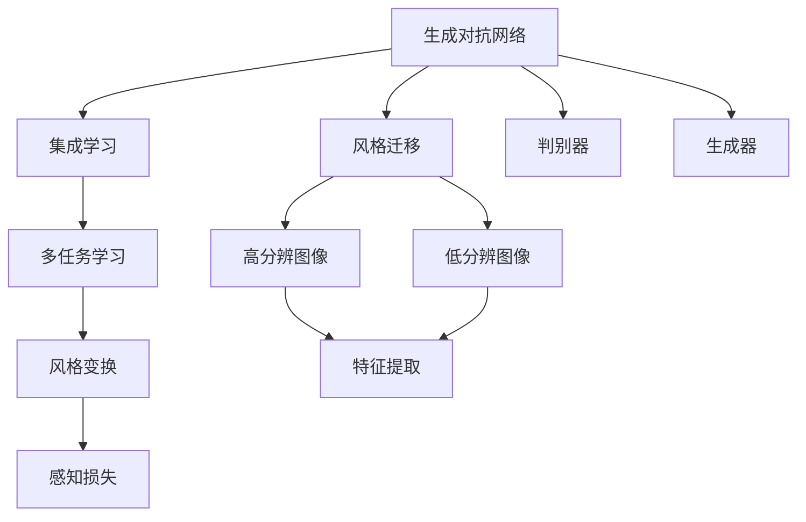
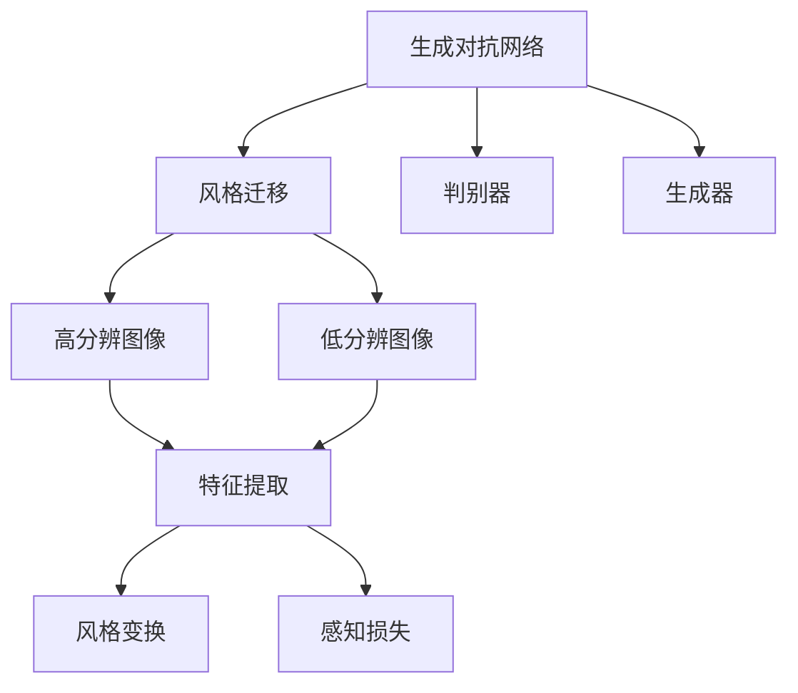
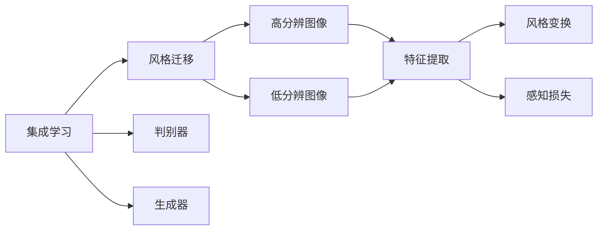
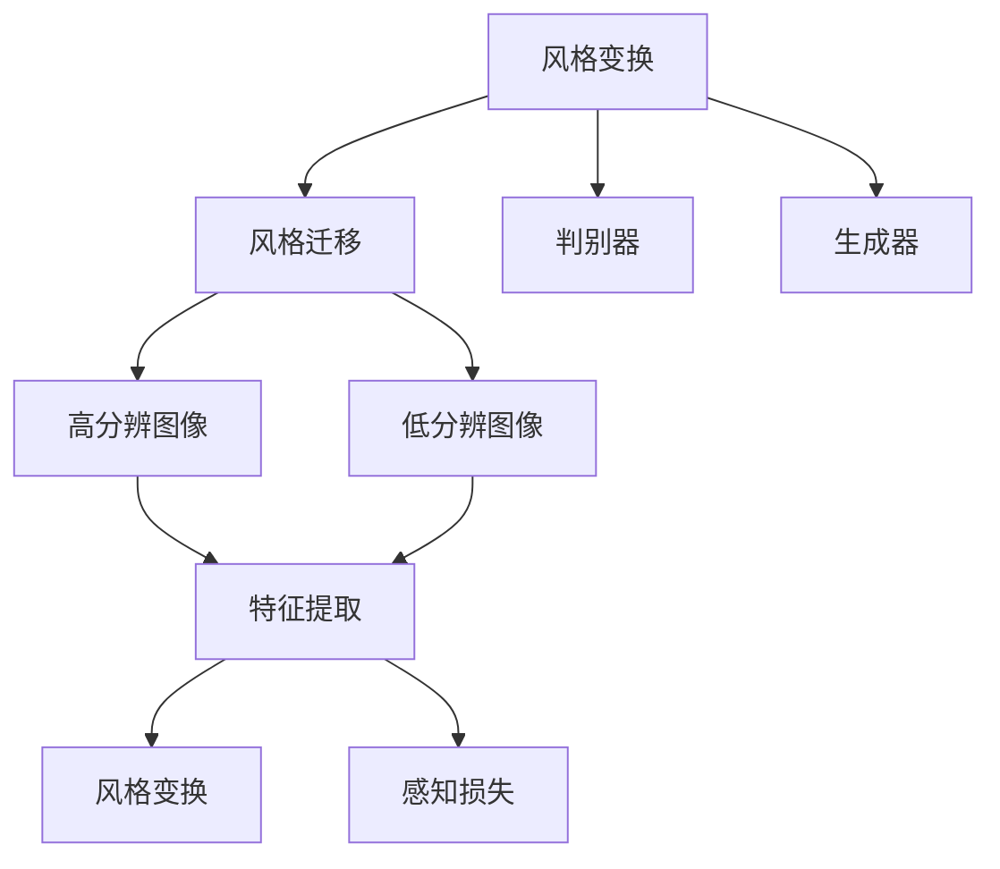
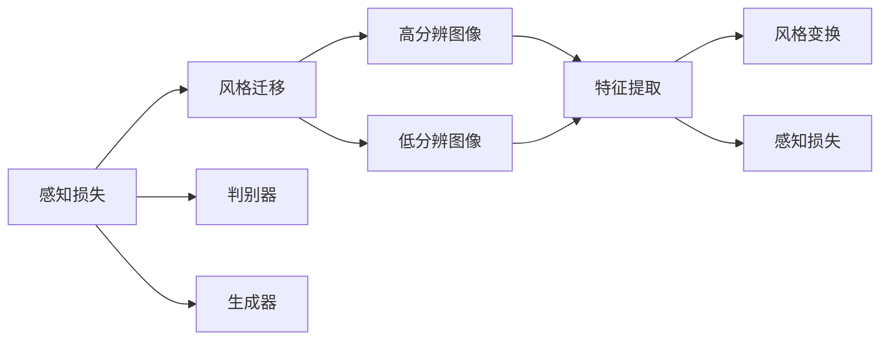
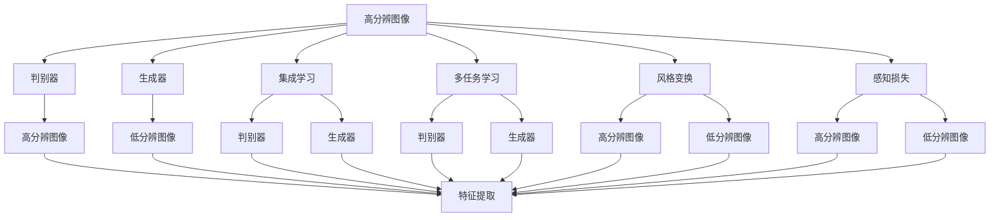

                 

# 基于生成对抗网络的集成学习风格迁移策略优化

> 关键词：生成对抗网络(GANs),风格迁移,集成学习(Ensemble Learning),多任务学习(MTL),优化策略,风格变换

## 1. 背景介绍

### 1.1 问题由来

风格迁移（Style Transfer）一直是计算机视觉和图像处理领域的一个重要研究方向。其目标是从一张图像中提取出风格（如画风、纹理、色彩）并将其应用到另一张图像上，生成具有新风格的新图像。近年来，生成对抗网络（Generative Adversarial Networks, GANs）在图像生成领域取得了巨大成功，为风格迁移提供了新的范式。然而，GANs在风格迁移上仍存在诸多挑战，如生成的风格图像质量不稳定、计算资源需求大等。

为了解决这些问题，本文提出了一种基于集成学习（Ensemble Learning）的风格迁移策略，利用多个风格迁移模型，通过优化策略和集成方法，实现高质量、低资源消耗的风格迁移。

### 1.2 问题核心关键点

本文的核心关键点在于：
1. 利用集成学习，通过组合多个风格迁移模型，提升风格迁移的效果。
2. 利用多任务学习（Multi-task Learning, MTL），同时训练多个风格迁移任务，共享模型参数，减少冗余计算。
3. 设计优化的训练策略，如学习率调整、正则化技术等，提高模型的稳定性和泛化能力。
4. 引入风格迁移的效果评估指标，如感知损失（Perceptual Loss），增强模型输出效果的客观评价。

## 2. 核心概念与联系

### 2.1 核心概念概述

为了更好地理解基于生成对抗网络的集成学习风格迁移策略，本节将介绍几个密切相关的核心概念：

- 生成对抗网络（GANs）：一种由两个神经网络构成的对抗系统，一个生成器（Generator）负责生成假样本，另一个判别器（Discriminator）负责区分生成样本和真实样本。通过对抗训练，生成器可以生成逼真的假样本，判别器可以区分真实样本和生成样本。
- 风格迁移（Style Transfer）：将图像的视觉风格从一幅图像迁移到另一幅图像上，使后者具有前者的风格。风格迁移广泛应用于图像处理、艺术创作等领域，具有重要应用价值。
- 集成学习（Ensemble Learning）：通过组合多个模型，提高模型的性能和泛化能力。常见的集成方法包括Bagging、Boosting、Stacking等。
- 多任务学习（MTL）：同时训练多个相关任务，共享模型参数，减少计算资源消耗。多任务学习可以更好地利用数据，提升模型的泛化能力。
- 风格变换（Style Transformation）：将图像的风格从一种风格变换为另一种风格，具有广泛应用价值，如将人脸图像风格化、将照片变成卡通风格等。
- 感知损失（Perceptual Loss）：用于度量生成图像与真实图像之间的视觉差异，基于神经网络的视觉特征提取技术，可以更全面地衡量生成图像的质量。

这些核心概念之间的逻辑关系可以通过以下Mermaid流程图来展示：



这个流程图展示了大语言模型微调过程的核心概念及其之间的关系：

1. 生成对抗网络由判别器和生成器组成，可以生成逼真的图像。
2. 风格迁移利用GANs生成具有新风格的新图像。
3. 集成学习通过组合多个模型，提高风格迁移的效果。
4. 多任务学习同时训练多个相关任务，共享模型参数，减少计算资源消耗。
5. 风格变换将图像的风格从一种风格变换为另一种风格，具有广泛应用价值。
6. 感知损失用于度量生成图像与真实图像之间的视觉差异，可以更全面地衡量生成图像的质量。

这些核心概念共同构成了基于GANs的风格迁移策略的完整生态系统，使其能够在各种场景下发挥强大的图像生成能力。通过理解这些核心概念，我们可以更好地把握基于GANs的风格迁移策略的工作原理和优化方向。

### 2.2 概念间的关系

这些核心概念之间存在着紧密的联系，形成了基于GANs的风格迁移策略的完整生态系统。下面我们通过几个Mermaid流程图来展示这些概念之间的关系。

#### 2.2.1 风格迁移的核心范式



这个流程图展示了生成对抗网络在风格迁移中的应用。生成对抗网络由判别器和生成器组成，生成器负责生成新风格的图像，判别器负责区分真实图像和生成图像。特征提取和感知损失用于衡量生成图像的质量。

#### 2.2.2 集成学习与风格迁移的关系



这个流程图展示了集成学习在风格迁移中的应用。集成学习通过组合多个风格迁移模型，提高风格迁移的效果。判别器和生成器分别负责生成和判别图像。

#### 2.2.3 多任务学习与风格迁移的关系


这个流程图展示了多任务学习在风格迁移中的应用。多任务学习通过同时训练多个相关任务，共享模型参数，减少计算资源消耗。判别器和生成器分别负责生成和判别图像。

#### 2.2.4 风格变换与风格迁移的关系



这个流程图展示了风格变换在风格迁移中的应用。风格变换将图像的风格从一种风格变换为另一种风格，生成具有新风格的新图像。判别器和生成器分别负责生成和判别图像。

#### 2.2.5 感知损失与风格迁移的关系



这个流程图展示了感知损失在风格迁移中的应用。感知损失用于度量生成图像与真实图像之间的视觉差异，可以更全面地衡量生成图像的质量。判别器和生成器分别负责生成和判别图像。

### 2.3 核心概念的整体架构

最后，我们用一个综合的流程图来展示这些核心概念在风格迁移策略中的应用：



这个综合流程图展示了从高分辨率图像到风格迁移的完整过程。高分辨率图像经过判别器、生成器、集成学习、多任务学习、风格变换和感知损失等多个步骤，最终生成具有新风格的新图像。

## 3. 核心算法原理 & 具体操作步骤
### 3.1 算法原理概述

基于生成对抗网络的集成学习风格迁移策略，本质上是一种风格迁移算法，其核心思想是：通过组合多个风格迁移模型，提高生成图像的质量和多样性，同时减少计算资源的消耗。

形式化地，假设我们拥有$m$个风格迁移模型$M_i=\{D_i, G_i\}$，其中$i=1,...,m$。每个模型都包含一个判别器$D_i$和一个生成器$G_i$，用于生成逼真的风格图像。设训练集为$D=\{(\mathbf{x}_i, \mathbf{y}_i)\}_{i=1}^N$，其中$\mathbf{x}_i$为高分辨率图像，$\mathbf{y}_i$为对应的低分辨率图像。

风格迁移的目标是最大化生成图像的质量，即：

$$
\max_{G_i} \min_{D_i} V(D_i, G_i)
$$

其中，$V(D_i, G_i)$为生成器和判别器的对抗损失函数。在此基础上，我们引入集成学习，通过组合$m$个模型，提升生成图像的质量和多样性，降低计算资源的消耗。

### 3.2 算法步骤详解

基于生成对抗网络的集成学习风格迁移策略的具体实现步骤如下：

**Step 1: 准备训练集和生成模型**

- 收集风格迁移任务的高分辨率图像和低分辨率图像，划分为训练集、验证集和测试集。
- 初始化多个风格迁移模型$M_i=\{D_i, G_i\}$，设置超参数，如生成器和学习率等。

**Step 2: 优化判别器和生成器**

- 对于每个风格迁移模型$M_i$，交替进行判别器优化和生成器优化，即：
  - 固定生成器$G_i$，优化判别器$D_i$：
    $$
    D_i: \arg\min_{D_i} \mathcal{L}_D(D_i, G_i, D)
    $$
  - 固定判别器$D_i$，优化生成器$G_i$：
    $$
    G_i: \arg\min_{G_i} \mathcal{L}_G(D_i, G_i, G_{-i})
    $$
  其中$\mathcal{L}_D$为判别器的损失函数，$\mathcal{L}_G$为生成器的损失函数，$G_{-i}$为其他模型生成的生成器。

**Step 3: 集成模型**

- 将所有生成器生成的图像进行组合，生成一个综合风格图像。例如，可以取所有生成器的输出平均值，或者进行加权平均。
- 对综合生成的图像进行感知损失计算，评估其质量和多样性。

**Step 4: 多任务学习**

- 同时训练多个风格迁移任务，共享模型参数。例如，可以同时训练多个风格的生成器，共享判别器的参数。

**Step 5: 训练超参数**

- 根据生成图像的质量和多样性，调整判别器、生成器的超参数。例如，可以根据感知损失函数的值调整学习率、正则化系数等。

**Step 6: 测试和部署**

- 在测试集上评估生成图像的质量和多样性，对比多个风格迁移模型的效果。
- 使用最优模型对新样本进行风格迁移，集成到实际的应用系统中。

以上是基于生成对抗网络的集成学习风格迁移策略的详细实现步骤。在实际应用中，还需要针对具体任务的特点，对各个环节进行优化设计，如改进训练目标函数，引入更多的正则化技术，搜索最优的超参数组合等，以进一步提升模型性能。

### 3.3 算法优缺点

基于生成对抗网络的集成学习风格迁移策略具有以下优点：

1. 提高生成图像的质量和多样性。通过组合多个风格迁移模型，可以提高生成图像的质量和多样性，减少过拟合的风险。
2. 降低计算资源的消耗。多任务学习可以共享模型参数，减少冗余计算，提高计算效率。
3. 提高模型的泛化能力。集成学习可以提升模型的泛化能力，使其在多种风格迁移任务上表现更好。
4. 增强模型的鲁棒性。通过优化训练策略，如学习率调整、正则化技术等，可以提高模型的鲁棒性，使其在各种场景下都能生成高质量的图像。

同时，该策略也存在一些局限性：

1. 模型训练时间较长。集成学习需要训练多个模型，计算资源需求较大。
2. 模型的可解释性较差。集成学习模型难以解释其内部工作机制，难以调试。
3. 对数据分布的变化敏感。模型的泛化能力可能受到数据分布变化的影响，需要更多的数据进行训练。
4. 可能存在梯度消失或爆炸问题。由于多个模型的联合训练，梯度传递过程可能存在问题，导致训练不稳定。

尽管存在这些局限性，但就目前而言，基于生成对抗网络的集成学习风格迁移策略仍是一种高效、可行的大规模图像生成方法。未来相关研究的重点在于如何进一步降低计算资源的消耗，提高模型的泛化能力，增强模型的鲁棒性，同时提高模型的可解释性。

### 3.4 算法应用领域

基于生成对抗网络的集成学习风格迁移策略已经广泛应用于计算机视觉、图像处理、艺术创作等领域，具有重要的应用价值：

- 图像增强：对图像进行增强，如去雾、去噪、超分辨率等。
- 风格迁移：将图像的风格从一种风格迁移到另一种风格，如将照片变成卡通风格、将人脸图像风格化等。
- 艺术创作：将艺术作品的风格应用到新的图像上，如将梵高、毕加索等名家的风格应用到普通图像上。
- 图像修复：对损坏的图像进行修复，如将模糊的图像变得清晰、将损坏的图像变得完整。
- 风格变换：将图像的风格从一种风格变换为另一种风格，具有广泛应用价值。

除了上述这些经典应用外，基于生成对抗网络的集成学习风格迁移策略还被创新性地应用到更多场景中，如视频风格迁移、多模态风格迁移等，为计算机视觉技术带来了全新的突破。随着生成对抗网络技术的发展，相信基于集成学习风格迁移策略的应用场景将更加广阔，为图像处理、艺术创作等领域带来新的变革。

## 4. 数学模型和公式 & 详细讲解  
### 4.1 数学模型构建

本节将使用数学语言对基于生成对抗网络的集成学习风格迁移策略进行更加严格的刻画。

记生成对抗网络为$M=\{D, G\}$，其中$D$为判别器，$G$为生成器。假设训练集为$D=\{(\mathbf{x}_i, \mathbf{y}_i)\}_{i=1}^N$，其中$\mathbf{x}_i$为高分辨率图像，$\mathbf{y}_i$为对应的低分辨率图像。

定义判别器的损失函数为$\mathcal{L}_D(D, G, D)$，用于衡量判别器对生成器和真实样本的判别能力。定义生成器的损失函数为$\mathcal{L}_G(D, G, G_{-i})$，用于衡量生成器生成逼真图像的能力。其中$G_{-i}$为其他生成器。

在实际应用中，我们通常使用对抗损失函数$V(D, G)$，用于衡量生成器和判别器的对抗能力。对抗损失函数可以定义为：

$$
V(D, G) = \mathbb{E}_{\mathbf{x} \sim p_{\mathbf{x}}}[\log D(\mathbf{x})] + \mathbb{E}_{\mathbf{z} \sim p_{\mathbf{z}}}[\log(1 - D(G(\mathbf{z})))]
$$

其中，$p_{\mathbf{x}}$为真实样本分布，$p_{\mathbf{z}}$为噪声分布。

### 4.2 公式推导过程

以下我们以GANs风格迁移为例，推导对抗损失函数及其梯度的计算公式。

假设生成器$G$接受噪声$\mathbf{z}$作为输入，输出为$\mathbf{x}=G(\mathbf{z})$。判别器$D$输入图像$\mathbf{x}$，输出判别结果$D(\mathbf{x})$。

判别器的梯度计算公式为：

$$
\frac{\partial \mathcal{L}_D}{\partial D} = -\frac{1}{N} \sum_{i=1}^N (\frac{1}{2}\log D(\mathbf{x}_i) + \frac{1}{2}\log(1 - D(G(\mathbf{z}_i))))
$$

其中，$\mathbf{x}_i$为高分辨率图像，$\mathbf{z}_i$为噪声向量。

生成器的梯度计算公式为：

$$
\frac{\partial \mathcal{L}_G}{\partial G} = -\frac{1}{N} \sum_{i=1}^N (\frac{1}{2}\log D(G(\mathbf{z}_i)) + \frac{1}{2}\log(1 - D(\mathbf{x}_i)))
$$

其中，$\mathbf{z}_i$为噪声向量，$\mathbf{x}_i$为高分辨率图像。

在实际应用中，我们通常使用变分梯度下降（Variational Gradient Descent）算法来计算判别器和生成器的梯度，减少梯度消失或爆炸的问题。变分梯度下降算法可以定义为：

$$
\frac{\partial \mathcal{L}}{\partial \theta} = -\frac{\partial V(D, G)}{\partial \theta}
$$

其中，$\theta$为模型参数。

### 4.3 案例分析与讲解

在实际应用中，我们可以采用多种风格迁移方法，如VGG风格的迁移、DeepStyle风格的迁移等。下面以VGG风格迁移为例，展示基于生成对抗网络的集成学习风格迁移策略的实现。

首先，定义VGG风格的迁移目标：

$$
\min_{G} \max_{D} V(D, G) = \mathbb{E}_{\mathbf{x} \sim p_{\mathbf{x}}}[\log D(\mathbf{x})] + \mathbb{E}_{\mathbf{z} \sim p_{\mathbf{z}}}[\log(1 - D(G(\mathbf{z}))))
$$

其中，$\mathbf{x}_i$为高分辨率图像，$\mathbf{z}_i$为噪声向量。

然后，我们定义判别器的损失函数为：

$$
\mathcal{L}_D(D, G, D) = -\frac{1}{N} \sum_{i=1}^N (\frac{1}{2}\log D(\mathbf{x}_i) + \frac{1}{2}\log(1 - D(G(\mathbf{z}_i))))
$$

生成器的损失函数为：

$$
\mathcal{L}_G(D, G, G_{-i}) = -\frac{1}{N} \sum_{i=1}^N (\frac{1}{2}\log D(G(\mathbf{z}_i)) + \frac{1}{2}\log(1 - D(\mathbf{x}_i)))
$$

在训练过程中，交替优化判别器和生成器。例如，在判别器的训练过程中，固定生成器$G$，优化判别器$D$：

$$
D_i: \arg\min_{D_i} \mathcal{L}_D(D_i, G_i, D)
$$

在生成器的训练过程中，固定判别器$D_i$，优化生成器$G_i$：

$$
G_i: \arg\min_{G_i} \mathcal{L}_G(D_i, G_i, G_{-i})
$$

在集成学习阶段，我们将所有生成器生成的图像进行组合，生成一个综合风格图像。例如，可以取所有生成器的输出平均值，或者进行加权平均。

例如，设$G_1$和$G_2$为两个生成器，$G_3$为综合生成器，则有：

$$
G_3(\mathbf{z}) = \frac{1}{2}G_1(\mathbf{z}) + \frac{1}{2}G_2(\mathbf{z})
$$

最后，对综合生成的图像进行感知损失计算，评估其质量和多样性。

例如，设$VGG$网络为感知损失函数，则有：

$$
\mathcal{L}_{perceptual}(G_3) = \mathbb{E}_{\mathbf{x} \sim p_{\mathbf{x}}}[\|\mathbf{x} - VGG(G_3(\mathbf{z}))\|^2]
$$

其中，$VGG$为感知损失函数，$\mathbf{x}_i$为高分辨率图像，$\mathbf{z}_i$为噪声向量。

## 5. 项目实践：代码实例和详细解释说明
### 5.1 开发环境搭建

在进行风格迁移实践前，我们需要准备好开发环境。以下是使用Python进行PyTorch开发的环境配置流程：

1. 安装Anaconda：从官网下载并安装Anaconda，用于创建独立的Python环境。

2. 创建并激活虚拟环境：
```bash
conda create -n pytorch-env python=3.8 
conda activate pytorch-env
```

3. 安装PyTorch：根据CUDA版本，从官网获取对应的安装命令。例如：
```bash
conda install pytorch torchvision torchaudio cudatoolkit=11.1 -c pytorch -c conda-forge
```

4. 安装TensorFlow：
```bash
pip install tensorflow
```

5. 安装TensorBoard：
```bash
pip install tensorboard
```

6. 安装图像处理库：
```bash
pip install Pillow numpy scipy matplotlib
```

完成上述步骤后，即可在`pytorch-env`环境中开始风格迁移实践。

### 5.2 源代码详细实现

这里我们以VGG风格的迁移为例，给出使用PyTorch对GANs模型进行风格迁移的PyTorch代码实现。

首先，定义判别器和生成器的架构：

```python
import torch
import torch.nn as nn
import torchvision.transforms as transforms
from torchvision.models.vgg import vgg16
from torchvision import models
from torchvision.datasets import ImageFolder

class Discriminator(nn.Module):
    def __init__(self):
        super(Discriminator, self).__init__()
        self.features = nn.Sequential(
            nn.Conv2d(3, 64, kernel_size=3, stride=1, padding=1),
            nn.ReLU(),
            nn.Conv2d(64, 128, kernel_size=3, stride=2, padding=1),
            nn.ReLU(),
            nn.MaxPool2d(kernel_size=2, stride=2),
            nn.Conv2d(128, 256, kernel_size=3, stride=1, padding=1),
            nn.ReLU(),
            nn.Conv2d(256, 512, kernel_size=3, stride=2, padding=1),
            nn.ReLU(),
            nn.MaxPool2d(kernel_size=2, stride=2),
            nn.Conv2d(512, 512, kernel_size=3, stride=1, padding=1),
            nn.ReLU(),
            nn.AdaptiveAvgPool2d(1),
            nn.Flatten(),
            nn.Linear(512, 1),
        )
        self.sigmoid = nn.Sigmoid()

    def forward(self, x):
        x = self.features(x)
        x = self.sigmoid(x)
        return x

class Generator(nn.Module):
    def __init__(self):
        super(Generator, self).__init__()
        self.encoder = nn.Sequential(
            nn.Linear(128, 256),
            nn.ReLU(),
            nn.Linear(256, 512),
            nn.ReLU(),
            nn.Linear(512, 512),
            nn.ReLU(),
            nn.Linear(512, 4096),
            nn.ReLU(),
            nn.Linear(4096, 3*3*128),
            nn.Tanh()
        )
        self.decoder = nn.Sequential(
            nn.ConvTranspose2d(128, 64, kernel_size=3, stride=1, padding=1),
            nn.ReLU(),
            nn.ConvTranspose2d(64, 128, kernel_size=3, stride=2, padding=1),
            nn.ReLU(),
            nn.ConvTranspose2d(128, 256, kernel_size=3, stride=2, padding=1),
            nn.ReLU(),
            nn.ConvTranspose2d(256, 512, kernel_size=3, stride=2, padding=1),
            nn.ReLU(),
            nn.ConvTranspose2d(512, 256, kernel_size=3, stride=1, padding=1),
            nn.ReLU(),
            nn.ConvTranspose2d(256, 128, kernel_size=3, stride=2, padding=1),
            nn.ReLU(),
            nn.ConvTranspose2d(128, 3, kernel_size=3

