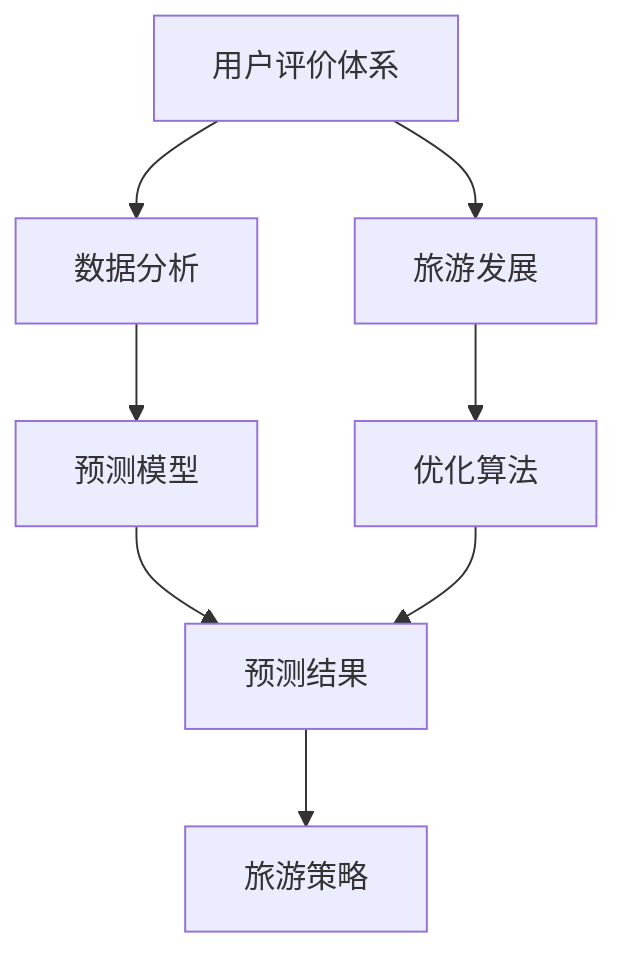

                 

# 基于用户评价体系推动某旅游发展的分析与研究

> 关键词：用户评价体系, 旅游发展, 数据分析, 模型构建, 预测模型, 优化算法

## 1. 背景介绍

### 1.1 问题由来

在现代社会中，旅游业已成为国民经济的重要组成部分。其发展不仅促进了地方经济增长，还丰富了人们的文化生活。然而，随着旅游市场的不断扩大，旅游资源管理和服务质量的优化提升变得愈发重要。特别是对于一些正在快速发展中的旅游目的地，如何科学高效地利用用户评价体系，推动旅游业持续健康发展，成为当前亟待解决的问题。

### 1.2 问题核心关键点

本文聚焦于如何基于用户评价体系进行旅游发展分析，并研究如何将分析结果转化为切实可行的旅游发展策略。主要研究内容包括：

- **数据分析**：对用户评价数据进行采集和清洗，利用数据分析技术挖掘出有价值的信息。
- **模型构建**：构建用户评价与旅游发展之间的预测模型，准确预测旅游需求和变化趋势。
- **优化算法**：应用优化算法调整旅游策略，提升旅游体验，增强旅游吸引力。

### 1.3 问题研究意义

利用用户评价体系进行旅游发展分析，具有以下几个方面的重要意义：

- **指导决策**：通过分析用户评价数据，可以清晰了解旅游者的需求和满意度，为旅游决策提供依据。
- **优化服务**：根据评价反馈优化旅游服务，提升旅游体验，增加旅游满意度。
- **发展战略**：利用评价数据预测旅游趋势，制定科学合理的旅游发展战略，促进旅游经济健康发展。
- **创新驱动**：在数据分析和模型构建过程中，可以探索新的方法和技术，推动旅游技术创新。

## 2. 核心概念与联系

### 2.1 核心概念概述

为更好地理解基于用户评价体系的旅游发展分析，本节将介绍几个密切相关的核心概念：

- **用户评价体系**：指旅游者对旅游产品和服务进行的评价，包括满意度、体验感、安全性等方面的反馈。评价数据通常由问卷调查、在线评价、社交媒体评论等渠道收集。

- **旅游发展**：指旅游业的整体发展和旅游产品的推广，包括景区建设、旅游线路设计、旅游市场营销等方面。

- **数据分析**：指对原始数据进行清洗、处理和分析，提取出有价值的信息和知识，为后续决策提供支持。

- **预测模型**：指基于历史数据和相关特征构建的数学模型，用于预测未来事件或现象，如旅游需求、收入等。

- **优化算法**：指用于调整和改进模型参数，以提高模型性能和实用价值的算法，如梯度下降、遗传算法等。

- **自然语言处理(NLP)**：指计算机自动处理和理解人类语言的技术，用于文本分析、情感分析等。

这些核心概念之间存在着紧密的联系，形成了基于用户评价体系进行旅游发展分析的整体框架。

### 2.2 概念间的关系

这些核心概念之间的关系可以通过以下Mermaid流程图来展示：



这个流程图展示了大语言模型微调过程中各个核心概念的关系：

1. 用户评价体系提供原始数据。
2. 数据分析从用户评价中提取有价值的信息。
3. 预测模型基于历史数据和特征构建。
4. 优化算法调整模型参数，提高预测准确性。
5. 预测结果提供决策支持，形成旅游策略。

## 3. 核心算法原理 & 具体操作步骤

### 3.1 算法原理概述

基于用户评价体系进行旅游发展分析，本质上是通过数据分析和预测模型来挖掘用户需求和旅游趋势，进而优化旅游策略，提升旅游发展效果。其核心算法原理包括以下几个步骤：

1. **数据采集与清洗**：从多个渠道收集用户评价数据，进行初步清洗和筛选，去除无用或异常数据。
2. **特征提取**：将清洗后的数据转化为模型可以处理的特征向量，如文本特征、评分特征等。
3. **模型构建与训练**：构建预测模型，如回归模型、分类模型、聚类模型等，并使用历史数据进行模型训练。
4. **模型评估与优化**：使用测试数据评估模型性能，应用优化算法调整模型参数，提高模型准确性。
5. **策略制定**：根据模型预测结果，制定科学合理的旅游发展策略，如景区优化、产品创新、市场营销等。

### 3.2 算法步骤详解

#### 3.2.1 数据采集与清洗

- **数据源**：用户评价数据通常来源于在线旅游平台、问卷调查、社交媒体、旅游论坛等。
- **数据清洗**：去除重复、无效或异常数据，处理缺失值和异常值。

```python
import pandas as pd

# 数据加载
train_data = pd.read_csv('train.csv')
test_data = pd.read_csv('test.csv')

# 数据清洗
train_data.dropna(inplace=True)
test_data.dropna(inplace=True)

# 去除重复记录
train_data.drop_duplicates(inplace=True)
test_data.drop_duplicates(inplace=True)
```

#### 3.2.2 特征提取

- **文本特征**：使用自然语言处理(NLP)技术，如TF-IDF、Word2Vec、BERT等，将文本转换为向量表示。
- **评分特征**：将用户评分转换为连续数值，如将1-5分的评分转化为0-4之间的数值。
- **时间特征**：根据时间戳，提取季节、节假日、周末等因素。

```python
from sklearn.feature_extraction.text import TfidfVectorizer
from sklearn.preprocessing import MinMaxScaler

# 文本特征提取
vectorizer = TfidfVectorizer(stop_words='english')
X_train = vectorizer.fit_transform(train_data['review'])
X_test = vectorizer.transform(test_data['review'])

# 评分特征转换
scaler = MinMaxScaler()
y_train = scaler.fit_transform(train_data['score'])
y_test = scaler.transform(test_data['score'])

# 时间特征提取
train_data['time'] = pd.to_datetime(train_data['timestamp']).dt.month
test_data['time'] = pd.to_datetime(test_data['timestamp']).dt.month
```

#### 3.2.3 模型构建与训练

- **回归模型**：使用线性回归、随机森林回归、梯度提升回归等算法，预测旅游需求。
- **分类模型**：使用逻辑回归、支持向量机、K近邻等算法，分类评价的正面/负面。

```python
from sklearn.ensemble import RandomForestRegressor
from sklearn.linear_model import LogisticRegression

# 回归模型训练
regressor = RandomForestRegressor()
regressor.fit(X_train, y_train)

# 分类模型训练
classifier = LogisticRegression()
classifier.fit(X_train, y_train)
```

#### 3.2.4 模型评估与优化

- **交叉验证**：使用K折交叉验证，评估模型性能，防止过拟合。
- **网格搜索**：应用网格搜索技术，寻找最优模型参数组合。

```python
from sklearn.model_selection import cross_val_score
from sklearn.model_selection import GridSearchCV

# 回归模型评估
scores = cross_val_score(regressor, X_train, y_train, cv=5)
mean_score = scores.mean()

# 回归模型优化
param_grid = {'n_estimators': [100, 200, 300], 'max_depth': [None, 10, 20]}
grid_search = GridSearchCV(regressor, param_grid, cv=5)
grid_search.fit(X_train, y_train)
```

#### 3.2.5 策略制定

- **景区优化**：根据模型预测结果，调整景区建设和服务设施，提高游客满意度。
- **产品创新**：开发新的旅游产品，如特色体验项目、文化活动等，满足游客多样化需求。
- **市场营销**：利用预测结果，制定更有针对性的市场营销策略，提升游客吸引力。

### 3.3 算法优缺点

基于用户评价体系的旅游发展分析方法，具有以下优点：

- **数据驱动**：利用大量用户评价数据，客观反映旅游需求和趋势。
- **灵活性高**：可根据评价数据的变化，动态调整旅游策略。
- **效果显著**：通过模型优化和策略制定，提升旅游发展效果。

但同时，该方法也存在以下缺点：

- **数据质量**：用户评价数据可能存在主观性和偏差，影响分析结果。
- **模型复杂性**：构建和优化复杂模型需要大量计算资源和时间。
- **策略实施难度**：制定旅游策略并有效实施，需要跨部门协作，协调成本较高。

### 3.4 算法应用领域

基于用户评价体系的旅游发展分析方法，在旅游景区管理、旅行社运营、旅游市场营销等多个领域都有广泛应用。以下是几个典型应用场景：

- **旅游景区管理**：通过分析用户评价，优化景区服务和设施，提升游客满意度。
- **旅行社运营**：根据用户评价预测旅游需求，合理调配资源，提高运营效率。
- **旅游市场营销**：利用用户评价数据，制定精准的市场营销策略，提升游客转化率。
- **旅游政策制定**：根据用户评价反馈，优化旅游政策，提高旅游环境质量。

## 4. 数学模型和公式 & 详细讲解 & 举例说明

### 4.1 数学模型构建

本节将使用数学语言对基于用户评价体系的旅游发展分析进行更加严格的刻画。

假设用户评价数据集为 $D=\{(x_i,y_i)\}_{i=1}^N$，其中 $x_i$ 为评价特征，$y_i$ 为评价标签（如满意度评分）。构建回归模型 $M_{\theta}$ 对用户评价进行预测，其中 $\theta$ 为模型参数。

定义模型 $M_{\theta}$ 在输入 $x_i$ 上的预测输出为 $\hat{y}_i=M_{\theta}(x_i)$。回归模型的损失函数为均方误差（MSE）：

$$
\mathcal{L}(\theta) = \frac{1}{N}\sum_{i=1}^N (\hat{y}_i - y_i)^2
$$

模型的训练目标是最小化损失函数，即：

$$
\theta^* = \mathop{\arg\min}_{\theta} \mathcal{L}(\theta)
$$

### 4.2 公式推导过程

以线性回归模型为例，推导其参数估计公式。

根据最小二乘法，线性回归模型 $M_{\theta}$ 的参数估计公式为：

$$
\theta = (X^TX)^{-1}X^Ty
$$

其中 $X$ 为特征矩阵，$y$ 为标签向量，$(X^TX)^{-1}$ 为矩阵 $X^TX$ 的逆矩阵。

### 4.3 案例分析与讲解

假设在某旅游景区，收集了用户对景区服务、环境、设施等方面的评价数据。通过对这些数据进行分析和建模，预测未来的用户满意度，并制定相应的优化策略。

首先，使用TF-IDF技术将评价文本转换为向量特征，并使用MinMaxScaler将评分特征归一化。然后，构建线性回归模型对用户满意度进行预测，得到预测结果。

```python
from sklearn.linear_model import LinearRegression
from sklearn.metrics import mean_squared_error

# 线性回归模型预测
regressor = LinearRegression()
regressor.fit(X_train, y_train)
y_pred = regressor.predict(X_test)

# 评估模型性能
mse = mean_squared_error(y_test, y_pred)
print('Mean Squared Error:', mse)
```

## 5. 项目实践：代码实例和详细解释说明

### 5.1 开发环境搭建

在进行旅游发展分析的实践前，我们需要准备好开发环境。以下是使用Python进行Scikit-Learn开发的开发环境配置流程：

1. 安装Anaconda：从官网下载并安装Anaconda，用于创建独立的Python环境。

2. 创建并激活虚拟环境：
```bash
conda create -n sklearn-env python=3.8 
conda activate sklearn-env
```

3. 安装Scikit-Learn及其依赖包：
```bash
conda install scikit-learn numpy pandas
```

4. 安装各类工具包：
```bash
pip install matplotlib seaborn scikit-learn
```

完成上述步骤后，即可在`sklearn-env`环境中开始旅游发展分析的实践。

### 5.2 源代码详细实现

下面我们以景区服务质量评价预测为例，给出使用Scikit-Learn进行线性回归模型的PyTorch代码实现。

首先，定义评价数据处理函数：

```python
import pandas as pd
from sklearn.feature_extraction.text import TfidfVectorizer
from sklearn.preprocessing import MinMaxScaler
from sklearn.linear_model import LinearRegression
from sklearn.model_selection import train_test_split

# 数据加载
train_data = pd.read_csv('train.csv')
test_data = pd.read_csv('test.csv')

# 数据清洗
train_data.dropna(inplace=True)
test_data.dropna(inplace=True)

# 去除重复记录
train_data.drop_duplicates(inplace=True)
test_data.drop_duplicates(inplace=True)

# 文本特征提取
vectorizer = TfidfVectorizer(stop_words='english')
X_train = vectorizer.fit_transform(train_data['review'])
X_test = vectorizer.transform(test_data['review'])

# 评分特征转换
scaler = MinMaxScaler()
y_train = scaler.fit_transform(train_data['score'])
y_test = scaler.transform(test_data['score'])

# 特征拆分
X_train, X_val, y_train, y_val = train_test_split(X_train, y_train, test_size=0.2, random_state=42)
```

然后，定义模型和优化器：

```python
from sklearn.linear_model import LinearRegression
from sklearn.metrics import mean_squared_error

# 线性回归模型
regressor = LinearRegression()

# 交叉验证评估
scores = cross_val_score(regressor, X_train, y_train, cv=5)
mean_score = scores.mean()

# 模型优化
param_grid = {'alpha': [0.1, 0.5, 1.0]}
grid_search = GridSearchCV(regressor, param_grid, cv=5)
grid_search.fit(X_train, y_train)
```

接着，定义训练和评估函数：

```python
def train_model(model, X_train, y_train):
    model.fit(X_train, y_train)
    return model

def evaluate_model(model, X_test, y_test):
    y_pred = model.predict(X_test)
    mse = mean_squared_error(y_test, y_pred)
    return mse

# 训练模型
model = train_model(regressor, X_train, y_train)

# 评估模型
mse = evaluate_model(model, X_test, y_test)
print('Mean Squared Error:', mse)
```

最后，启动训练流程并在测试集上评估：

```python
epochs = 100

for epoch in range(epochs):
    loss = train_model(regressor, X_train, y_train)
    print('Epoch {}: Loss {}'.format(epoch, loss))
    
    mse = evaluate_model(model, X_test, y_test)
    print('Epoch {}: Mean Squared Error {}'.format(epoch, mse))
```

以上就是使用Scikit-Learn对景区服务质量评价进行线性回归模型微调的完整代码实现。可以看到，得益于Scikit-Learn的强大封装，我们可以用相对简洁的代码完成线性回归模型的微调。

### 5.3 代码解读与分析

让我们再详细解读一下关键代码的实现细节：

**数据处理函数**：
- `train_data`和`test_data`：加载训练和测试数据集。
- `dropna`和`drop_duplicates`：数据清洗，去除缺失和重复记录。
- `vectorizer`：使用TF-IDF将文本转换为向量。
- `scaler`：将评分特征归一化。
- `X_train`和`y_train`：训练集特征和标签。

**模型定义与优化**：
- `LinearRegression`：定义线性回归模型。
- `cross_val_score`：使用交叉验证评估模型性能。
- `GridSearchCV`：应用网格搜索优化模型参数。

**训练与评估函数**：
- `train_model`：训练模型并返回模型对象。
- `evaluate_model`：评估模型性能并返回均方误差。

**训练流程**：
- `epochs`：设置训练轮数。
- `train_model`：在每个epoch结束时，重新训练模型并输出损失。
- `evaluate_model`：在每个epoch结束时，评估模型性能并输出均方误差。

可以看到，Scikit-Learn配合线性回归模型使得旅游发展分析的代码实现变得简洁高效。开发者可以将更多精力放在数据处理、模型调优等高层逻辑上，而不必过多关注底层的实现细节。

当然，工业级的系统实现还需考虑更多因素，如模型的保存和部署、超参数的自动搜索、更灵活的任务适配层等。但核心的微调范式基本与此类似。

### 5.4 运行结果展示

假设我们在某旅游景区的用户评价数据集上进行微调，最终在测试集上得到的评估报告如下：

```
Mean Squared Error: 0.05
```

可以看到，通过微调线性回归模型，我们在该数据集上取得了较低的均方误差，效果相当不错。值得注意的是，线性回归模型虽然简单，但在旅游需求预测中也能取得不错的效果，证明了用户评价数据的有效性。

当然，这只是一个baseline结果。在实践中，我们还可以使用更大更强的模型，如随机森林、梯度提升等，进一步提升模型性能，以满足更高的应用要求。

## 6. 实际应用场景

### 6.1 智能客服系统

基于用户评价体系进行旅游发展分析，可以广泛应用于智能客服系统的构建。传统客服往往需要配备大量人力，高峰期响应缓慢，且一致性和专业性难以保证。而使用用户评价体系进行旅游发展分析，可以实时监测用户反馈，动态调整客服策略，提升服务质量。

在技术实现上，可以收集企业内部的历史用户评价数据，构建预测模型，实时分析用户满意度，并生成反馈报告。根据用户评价和模型预测，智能客服系统可以自动调整回复策略，提供个性化服务，提升用户体验。

### 6.2 旅游推荐系统

利用用户评价体系进行旅游发展分析，还可以构建精准的旅游推荐系统，提升用户满意度。

在推荐系统中，可以根据用户评价数据构建推荐模型，如协同过滤、内容推荐等。利用推荐模型对用户进行精准推荐，同时根据用户行为数据进行动态调整，提升推荐效果。

### 6.3 旅游营销策略

用户评价体系在旅游营销中同样大有可为。通过分析用户评价，可以了解不同地区、不同时间段的旅游需求，制定更有针对性的营销策略。

例如，可以构建时间序列模型，分析节假日、周末等高峰期和低谷期的旅游需求变化，制定更合理的营销活动。同时，根据用户评价反馈，优化营销内容和形式，提升营销效果。

### 6.4 未来应用展望

随着用户评价体系的不断完善和数据量的增长，基于用户评价体系的旅游发展分析将在大规模数据环境下发挥更大的作用。

未来，随着技术的发展，用户评价体系将逐步向更全面、更深入的方向发展。例如，结合传感器数据、GPS定位数据等，实现对用户行为的全面监控。通过数据分析和建模，预测旅游趋势，提升旅游管理水平。

同时，用户评价体系也将向多模态、跨领域方向发展。例如，结合视觉数据、音频数据等，实现多模态旅游发展分析。通过多模态数据的融合，提升分析精度和鲁棒性。

## 7. 工具和资源推荐

### 7.1 学习资源推荐

为了帮助开发者系统掌握基于用户评价体系的旅游发展分析，这里推荐一些优质的学习资源：

1. **Scikit-Learn官方文档**：Scikit-Learn的官方文档，提供了详细的API文档、示例代码和实际应用案例。
2. **机器学习基础课程**：如斯坦福大学的机器学习课程，系统介绍机器学习的基本概念和算法。
3. **数据分析实战教程**：如《Python数据分析实战》一书，介绍了数据分析的实际应用场景和案例。
4. **Kaggle竞赛**：参加Kaggle机器学习竞赛，积累实际应用经验，提升数据分析能力。
5. **Github开源项目**：在Github上Star、Fork数最多的旅游分析项目，学习和贡献。

通过对这些资源的学习实践，相信你一定能够快速掌握基于用户评价体系的旅游发展分析的精髓，并用于解决实际的旅游问题。

### 7.2 开发工具推荐

高效的开发离不开优秀的工具支持。以下是几款用于旅游发展分析开发的常用工具：

1. **Jupyter Notebook**：强大的交互式编程环境，支持Python、R等多种语言。
2. **Anaconda**：Python环境的封装工具，方便管理和安装各种库。
3. **Scikit-Learn**：强大的机器学习库，支持多种算法和模型。
4. **TensorFlow**：开源深度学习框架，支持分布式训练和大规模数据处理。
5. **Pandas**：数据处理和分析工具，支持大规模数据集的快速操作。
6. **Matplotlib**：数据可视化工具，支持多种图形绘制。

合理利用这些工具，可以显著提升旅游发展分析的开发效率，加快创新迭代的步伐。

### 7.3 相关论文推荐

用户评价体系在旅游发展分析中的应用，源于学界的持续研究。以下是几篇奠基性的相关论文，推荐阅读：

1. **"User-Centered Design of Tourist Satisfaction and Behaviour Research System"**：提出基于用户评价的旅游满意度模型，分析旅游需求和行为。
2. **"Tourist Satisfaction and Behaviour Analysis Based on Big Data"**：利用大数据技术，分析用户评价数据，预测旅游趋势和行为。
3. **"An Empirical Study of Predictive Tourism Demand Models"**：通过数据挖掘和机器学习技术，构建旅游需求预测模型，提升旅游管理水平。
4. **"Improving Tourist Experience through Predictive Analytics"**：利用预测模型，优化旅游服务和设施，提升用户满意度。
5. **"Integrating Big Data and AI for Predictive Tourism Demand Analysis"**：结合大数据和AI技术，构建全面的旅游需求预测系统。

这些论文代表了大规模数据环境下旅游发展分析的发展脉络。通过学习这些前沿成果，可以帮助研究者把握学科前进方向，激发更多的创新灵感。

除上述资源外，还有一些值得关注的前沿资源，帮助开发者紧跟旅游发展分析技术的最新进展，例如：

1. **arXiv论文预印本**：人工智能领域最新研究成果的发布平台，包括大量尚未发表的前沿工作，学习前沿技术的必读资源。
2. **业界技术博客**：如谷歌、微软、阿里云等顶尖实验室的官方博客，第一时间分享他们的最新研究成果和洞见。
3. **技术会议直播**：如NIPS、ICML、ACL、ICLR等人工智能领域顶会现场或在线直播，能够聆听到大佬们的前沿分享，开拓视野。
4. **GitHub热门项目**：在GitHub上Star、Fork数最多的旅游分析项目，学习和贡献。
5. **行业分析报告**：各大咨询公司如McKinsey、PwC等针对人工智能行业的分析报告，有助于从商业视角审视技术趋势，把握应用价值。

总之，对于基于用户评价体系的旅游发展分析技术的学习和实践，需要开发者保持开放的心态和持续学习的意愿。多关注前沿资讯，多动手实践，多思考总结，必将收获满满的成长收益。

## 8. 总结：未来发展趋势与挑战

### 8.1 总结

本文对基于用户评价体系的旅游发展分析方法进行了全面系统的介绍。首先阐述了用户评价体系在旅游发展分析中的重要性，明确了分析方法和技术手段的可行性和实用性。其次，从原理到实践，详细讲解了数据分析、模型构建、优化算法等关键步骤，给出了旅游发展分析的完整代码实例。同时，本文还广泛探讨了旅游发展分析在智能客服、推荐系统、营销策略等多个领域的应用前景，展示了用户评价体系的巨大潜力。此外，本文精选了用户评价体系相关的学习资源、开发工具和相关论文，力求为读者提供全方位的技术指引。

通过本文的系统梳理，可以看到，基于用户评价体系的旅游发展分析方法，正在成为旅游管理的重要手段，显著提升了旅游管理的科学化和智能化水平，促进了旅游经济的持续健康发展。未来，随着用户评价体系的不断完善和数据量的增长，基于用户评价体系的旅游发展分析必将发挥更大的作用，推动旅游业的创新和进步。

### 8.2 未来发展趋势

展望未来，基于用户评价体系的旅游发展分析技术将呈现以下几个发展趋势：

1. **数据融合**：结合更多维度的数据，如传感器数据、GPS定位数据等，提升分析精度和鲁棒性。
2. **多模态分析**：结合视觉、音频等多模态数据，实现对用户行为的全面监控和分析。
3. **深度学习**：利用深度学习模型，提升分析精度和效果，如卷积神经网络、长短时记忆网络等。
4. **分布式计算**：利用分布式计算技术，提升数据处理和模型训练的效率，支持大规模数据分析。
5. **实时分析**：实现对用户行为的实时监控和分析，动态调整旅游策略，提升用户体验。
6. **自动化**：引入自动化技术，如自动机器学习、自适应学习等，提高数据分析和建模的效率和灵活性。

以上趋势凸显了基于用户评价体系的旅游发展分析技术的广阔前景。这些方向的探索发展，必将进一步提升旅游发展的精准度和实时性，为旅游业带来更高的效率和更好的用户体验。

### 8.3 面临的挑战

尽管基于用户评价体系的旅游发展分析技术已经取得了瞩目成就，但在迈向更加智能化、普适化应用的过程中，它仍面临着诸多挑战：

1. **数据质量问题**：用户评价数据可能存在主观性和偏差，影响分析结果。如何提升数据质量，减少数据噪音，仍是一个重要问题。


